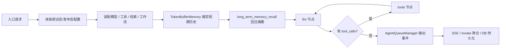

# Agent 运行时与记忆机制

这一篇只看一条执行链：一次对话请求进入平台之后，配置从哪来，运行时怎么装配，消息和记忆怎么组织，事件如何输出，结果又怎么落库。

> 适合谁读：已经知道 Agent 会调用模型和工具，但还不清楚“平台里的一次请求究竟怎么跑完”的人。
>
> 读前建议：如果还没看过配置资产这层，先读 [配置资产与平台底座](./configuration-assets-and-platform-foundation.md)。

## 先建立阅读坐标

- 这篇在主线里的位置：第三篇，是整组文档里最接近“平台主运行链”的一篇。
- 带着这三个问题读：
  1. 一次请求怎样从配置资产进入运行时。
  2. Function Calling 和 ReAct 为什么能共用一套执行骨架。
  3. 平台怎样把消息、事件、步骤、答案和长期记忆一起沉淀下来。
- 先记住的对象：`AgentState`、`Conversation`、`Message`、`MessageAgentThought`、`Conversation.summary`。
- 如果时间有限，优先看：先看主链、第 2 节、第 4 节、第 5 节、第 6 节和小结。

## 先看主链

这个项目里的 Agent 主链可以压成下面九步：

1. 读取应用配置
2. 装配模型
3. 装配工具
4. 装配知识供给能力
5. 装配工作流工具
6. 组装短期上下文与长期记忆
7. 根据模型能力选择执行模式
8. 输出统一事件流
9. 持久化步骤、答案、成本与长期记忆



这一条链里有五个实现边界：

- 配置资产先被翻译成运行时对象
- 记忆在 LLM 推理前介入
- Function Calling 和 ReAct 共用同一套工具循环
- 对外暴露的是平台事件协议，不是框架原生流
- 推理步骤本身会被结构化落库

## 1. 入口与配置源

入口层先解决三件事：

- 识别调用来源：Debugger、WebApp、OpenAPI
- 定位会话
- 决定本轮运行使用哪份配置

这里最重要的不是鉴权细节，而是配置源的分流位置：

- `AppService.debug_chat()` 读取 `draft_app_config`
- `WebAppService.web_app_chat()` 和 `OpenAPIService.chat()` 读取发布态 `app_config`

也就是说，入口差异主要压在最外层。进入 Agent 之前，服务层已经拿到一份校验过、适合装配的运行时配置。

## 2. 运行时装配

调试入口里的装配链最完整，也最适合用来说明这件事：

```python
llm = self.language_model_service.load_language_model(
    draft_app_config.get("model_config", {}), account_id=account.id
)

token_buffer_memory = TokenBufferMemory(
    db=self.db,
    conversation=debug_conversation,
    model_instance=llm,
)
history = token_buffer_memory.get_history_prompt_messages(
    message_limit=draft_app_config["dialog_round"],
)

tools = self.app_config_service.get_langchain_tools_by_tools_config(
    draft_app_config["tools"]
)

if draft_app_config["datasets"]:
    dataset_retrieval = (
        self.retrieval_service.create_langchain_tool_from_search(
            flask_app=current_app._get_current_object(),
            dataset_ids=[
                dataset["id"] for dataset in draft_app_config["datasets"]
            ],
            account_id=account.id,
            retrival_source=RetrievalSource.APP,
            source_app_id=app.id,
            **draft_app_config["retrieval_config"],
        )
    )
    tools.append(dataset_retrieval)

if draft_app_config["workflows"]:
    workflow_tools = self.app_config_service.get_langchain_tools_by_workflow_ids(
        [workflow["id"] for workflow in draft_app_config["workflows"]]
    )
    tools.extend(workflow_tools)

agent_class = (
    FunctionCallAgent if ModelFeature.TOOL_CALL in llm.features else ReACTAgent
)
```

这段装配链里有四个固定动作：

- 模型配置先被装成统一的 `BaseLanguageModel`
- 会话历史先经过 `TokenBufferMemory`
- 工具、知识库检索、工作流都会收敛到同一份工具列表
- 模式分流发生在所有运行时对象装配完成之后

这一步做完，后面的 Agent 才真正拿到可执行输入，而不是数据库里的原始配置片段。

## 3. 固定执行骨架

真正进入执行层之后，`FunctionCallAgent` 的 LangGraph 图骨架非常固定：

```python
def _build_agent(self) -> CompiledStateGraph:
    graph = StateGraph(AgentState)  # type: ignore

    graph.add_node("preset_operation", self._preset_operation_node)
    graph.add_node("long_term_memory_recall", self._long_term_memory_recall_node)
    graph.add_node("llm", self._llm_node)
    graph.add_node("tools", self._tools_node)

    graph.set_entry_point("preset_operation")
    graph.add_conditional_edges(
        "preset_operation", self._preset_operation_condition
    )
    graph.add_edge("long_term_memory_recall", "llm")
    graph.add_conditional_edges("llm", self._tools_condition)
    graph.add_edge("tools", "llm")

    return graph.compile()
```

这张图说明 Agent 主链被固定成四个节点：

- `preset_operation`
- `long_term_memory_recall`
- `llm`
- `tools`

其中 `preset_operation` 不是空节点，它承担输入审核和提前结束：

```python
if review_config["enable"] and review_config["inputs_config"]["enable"]:
    contains_keyword = any(
        keyword in query for keyword in review_config["keywords"]
    )
    if contains_keyword:
        preset_response = review_config["inputs_config"]["preset_response"]
        self.agent_queue_manager.publish(... QueueEvent.AGENT_MESSAGE ...)
        self.agent_queue_manager.publish(... QueueEvent.AGENT_END ...)
        return {"messages": [AIMessage(preset_response)]}
```

所以这张图从一开始就混入了产品规则，不只是推理循环。

## 4. 模式分流：Function Calling 与 ReAct

服务层的模式分流非常直接：

```python
agent_class = (
    FunctionCallAgent if ModelFeature.TOOL_CALL in llm.features else ReACTAgent
)
```

但分流之后并没有产生两套完全独立的系统。真正的差异主要压在两件事上：

- 系统提示怎么组织
- LLM 输出怎么归一化

### Function Calling 路径

Function Calling 路径先尝试把工具绑定到模型：

```python
if (
    ModelFeature.TOOL_CALL in llm.features
    and hasattr(llm, "bind_tools")
    and callable(getattr(llm, "bind_tools"))
    and len(self.agent_config.tools) > 0
):
    try:
        llm = llm.bind_tools(self.agent_config.tools)
    except NotImplementedError:
        logging.warning(
            "当前模型不支持bind_tools（function calling），将以不绑定工具的方式运行"
        )
```

之后 `chunk.tool_calls` 会被当成推理输出，`chunk.content` 会被当成普通文本输出。

### ReAct 路径

ReAct 在这里更接近一个兼容层。它解决的问题不是“展示思维链”，而是“让不支持原生 `tool_call` 的模型仍然能进入同一套工具循环”。

先看系统提示的分流：

```python
if ModelFeature.AGENT_THOUGHT not in self.llm.features:
    preset_messages = [
        SystemMessage(
            AGENT_SYSTEM_PROMPT_TEMPLATE.format(
                preset_prompt=self.agent_config.preset_prompt,
                long_term_memory=long_term_memory,
            )
        )
    ]
else:
    preset_messages = [
        SystemMessage(
            REACT_AGENT_SYSTEM_PROMPT_TEMPLATE.format(
                preset_prompt=self.agent_config.preset_prompt,
                long_term_memory=long_term_memory,
                tool_description=render_text_description_and_args(
                    self.agent_config.tools
                ),
            )
        )
    ]
```

这里的逻辑是：

- 模型连 `AGENT_THOUGHT` 都不支持时，不强行走 ReAct 协议
- 模型支持推理但不支持原生 `tool_call` 时，给它一份带工具描述的 ReAct 系统提示

再看输出归一化：

```python
if gathered.content.strip().startswith("```json"):
    tool_calls = [
        {
            "id": str(uuid.uuid4()),
            "type": "tool_call",
            "name": match_json.get("name", ""),
            "args": match_json.get("args", {}),
        }
    ]
    return {
        "messages": [AIMessage(content="", tool_calls=tool_calls)],
        "iteration_count": state["iteration_count"] + 1,
    }
```

这一步把 fenced JSON 重新包装成统一的 `tool_calls`，然后继续走共用的 `tools` 节点。

这里还有一个实现细节不能漏掉：如果 JSON 解析失败，`ReACTAgent` 不会直接报错，而是把这一轮退回普通消息输出。

## 5. 消息与记忆组装

这一层决定真正送给 LLM 的消息栈长什么样。

### 5.1 短期记忆

`TokenBufferMemory` 不是“查最近几轮消息”这么简单，它做了三件事：

- 只取有效历史消息
- 把数据库消息展开成 `HumanMessage / AIMessage` 成对结构
- 再按 token 限制裁剪

```python
messages = (
    self.db.session.query(Message)
    .filter(
        Message.conversation_id == self.conversation.id,
        Message.answer != "",
        Message.is_deleted == False,
        Message.status == MessageStatus.NORMAL,
    )
    .order_by(desc("created_at"))
    .limit(message_limit)
    .all()
)
messages = list(reversed(messages))

prompt_messages = []
for message in messages:
    prompt_messages.extend(
        [
            HumanMessage(content=message.query),
            AIMessage(content=message.answer),
        ]
    )

return trim_messages(
    messages=prompt_messages,
    max_tokens=max_token_limit,
    token_counter=self._count_tokens,
    strategy="last",
    start_on="human",
    end_on="ai",
)
```

这里要注意两个约束：

- 历史只取 `answer != ""` 且 `status == normal`
- 裁剪后的消息栈必须从 `human` 开始，以 `ai` 结束

### 5.2 长期记忆与系统提示

长期记忆来自 `Conversation.summary`，但它不是单独挂在状态里等模型自己读，而是直接进入系统提示：

```python
preset_messages = [
    SystemMessage(
        AGENT_SYSTEM_PROMPT_TEMPLATE.format(
            preset_prompt=self.agent_config.preset_prompt,
            long_term_memory=long_term_memory,
        )
    )
]
```

这里的系统提示不只是用户配置的 `preset_prompt`，外面还包了一层平台固定规则：

- 预设任务执行规则
- 工具调用和参数生成规则
- 历史对话与长期记忆规则
- 知识库检索规则
- 回复简洁性规则
- ReAct 路径下的 JSON 输出协议

### 5.3 当前轮消息重组

`long_term_memory_recall` 节点做的不是简单拼接，而是一次完整的消息重组：

```python
history = state["history"]
if isinstance(history, list) and len(history) > 0:
    if len(history) % 2 != 0:
        self.agent_queue_manager.publish_error(
            state["task_id"], "智能体历史消息列表格式错误"
        )
        raise FailException("智能体历史消息列表格式错误")
    preset_messages.extend(history)

human_message = state["messages"][-1]
preset_messages.append(HumanMessage(human_message.content))

return {
    "messages": [RemoveMessage(id=human_message.id), *preset_messages],
}
```

这里有三个实现点：

- 历史消息必须是偶数条，也就是严格的人类/AI 成对结构
- 当前轮 `HumanMessage` 会被重新封装进新的消息栈
- 原始消息会先通过 `RemoveMessage` 删除，再换成重组后的消息序列

### 5.4 多模态输入

`HumanMessage` 的来源不一定是纯文本。模型对象会统一处理图片输入：

```python
def convert_to_human_message(
    self, query: str, image_urls: list[str] = None
) -> HumanMessage:
    if (
        image_urls is None
        or len(image_urls) == 0
        or ModelFeature.IMAGE_INPUT not in self.features
    ):
        return HumanMessage(content=query)

    return HumanMessage(
        content=[
            {"type": "text", "text": query},
            *[
                {"type": "image_url", "image_url": {"url": image_url}}
                for image_url in image_urls
            ],
        ]
    )
```

这里统一了两类输入：

- 纯文本问题
- 文本加图片的多模态问题

### 5.5 AIMessage 与 ToolMessage

这条链上的消息对象至少有四类：

- `SystemMessage`
- `HumanMessage`
- `AIMessage`
- `ToolMessage`

其中：

- `AIMessage` 可能是普通答案，也可能携带 `tool_calls`
- `ToolMessage` 由 `tools` 节点补充，供下一轮 LLM 观察

```python
messages.append(
    ToolMessage(
        tool_call_id=tool_call["id"],
        content=json.dumps(tool_result, ensure_ascii=False),
        name=tool_call["name"],
    )
)
```

所以一轮完整上下文通常会变成：

- `SystemMessage`
- 若干组历史 `HumanMessage / AIMessage`
- 当前轮 `HumanMessage`
- 一轮或多轮 `AIMessage(tool_calls)` / `ToolMessage` 循环

## 6. 工具循环与流式事件

### 6.1 图执行与监听分离

`BaseAgent.stream()` 没有直接把 LangGraph 的 `stream()` 暴露出去，而是自己包了一层：

```python
def stream(
    self,
    input: AgentState,
    config: Optional[RunnableConfig] = None,
    **kwargs: Optional[Any],
) -> Iterator[AgentThought]:
    input["task_id"] = input.get("task_id", uuid.uuid4())
    input["iteration_count"] = input.get("iteration_count", 0)
    input["long_term_memory"] = input.get("long_term_memory", "")

    thread = Thread(target=self._agent.invoke, args=(input,))
    thread.daemon = True
    thread.start()

    yield from self._agent_queue_manager.listen(input["task_id"])
```

这里做了两件事：

- 图执行放到后台线程
- 对外统一输出 `AgentThought` 事件流

### 6.2 工具循环

`tools` 节点把 `tool_calls` 转成真实调用，再把结果补回消息栈：

```python
tool_calls = state["messages"][-1].tool_calls

for tool_call in tool_calls:
    tool = tools_by_name[tool_call["name"]]
    tool_result = tool.invoke(tool_call["args"])

    messages.append(
        ToolMessage(
            tool_call_id=tool_call["id"],
            content=json.dumps(tool_result, ensure_ascii=False),
            name=tool_call["name"],
        )
    )

    event = (
        QueueEvent.AGENT_ACTION
        if tool_call["name"] != DATASET_RETRIEVAL_TOOL_NAME
        else QueueEvent.DATASET_RETRIEVAL
    )
```

这里把工具调用再细分成两类事件：

- 普通工具调用记为 `AGENT_ACTION`
- 知识库检索记为 `DATASET_RETRIEVAL`

这样后面回放步骤时，可以直接区分“推理动作”和“检索动作”。

### 6.3 自定义队列管理器

`AgentQueueManager` 补的是平台语义，不是框架语义。监听循环里明确加入了：

- `PING`
- `TIMEOUT`
- `STOP`

```python
def listen(self, task_id: UUID) -> Generator:
    listen_timeout = 600
    start_time = time.time()
    last_ping_time = 0

    while True:
        try:
            item = self.queue(task_id).get(timeout=1)
            if item is None:
                break
            yield item
        except queue.Empty:
            continue
        finally:
            elapsed_time = time.time() - start_time

            if elapsed_time // 10 > last_ping_time:
                self.publish(
                    task_id,
                    AgentThought(
                        id=uuid.uuid4(),
                        task_id=task_id,
                        event=QueueEvent.PING,
                    ),
                )
                last_ping_time = elapsed_time // 10

            if elapsed_time >= listen_timeout:
                self.publish(
                    task_id,
                    AgentThought(
                        id=uuid.uuid4(),
                        task_id=task_id,
                        event=QueueEvent.TIMEOUT,
                    ),
                )

            if self._is_stopped(task_id):
                self.publish(
                    task_id,
                    AgentThought(
                        id=uuid.uuid4(),
                        task_id=task_id,
                        event=QueueEvent.STOP,
                    ),
                )
```

`publish()` 还会对结束条件统一收口：

```python
if agent_thought.event in [
    QueueEvent.STOP,
    QueueEvent.ERROR,
    QueueEvent.TIMEOUT,
    QueueEvent.AGENT_END,
]:
    self.stop_listen(task_id)
```

这意味着监听结束不是靠前端断开连接，而是靠事件协议自己收尾。

### 6.4 停止控制

停止控制不是直接杀线程，而是写 Redis 停止标记。任务归属也会提前登记：

```python
self.redis_client.setex(
    self.generate_task_belong_cache_key(task_id),
    1800,
    f"{user_prefix}-{str(self.user_id)}",
)

result = redis_client.get(cls.generate_task_belong_cache_key(task_id))
if result.decode("utf-8") != f"{user_prefix}-{str(user_id)}":
    return

redis_client.setex(stopped_cache_key, 600, 1)
```

这里的含义很明确：

- 任务开始时就标记 `task_id` 属于谁
- 停止请求先核验调用来源和用户身份
- 身份匹配后才设置 stop flag

### 6.5 流式响应聚合

Agent 节点发布的是细粒度 `AgentThought`，真正对外输出 SSE 的是服务层。

服务层会按 `event_id` 聚合 `agent_message`：

```python
if agent_thought.event == QueueEvent.AGENT_MESSAGE:
    if event_id not in agent_thoughts:
        agent_thoughts[event_id] = agent_thought
    else:
        agent_thoughts[event_id] = agent_thoughts[event_id].model_copy(
            update={
                "thought": agent_thoughts[event_id].thought
                + agent_thought.thought,
                "answer": agent_thoughts[event_id].answer
                + agent_thought.answer,
                "latency": agent_thought.latency,
            }
        )
```

然后再补上业务字段，转成 SSE：

```python
data = {
    **agent_thought.model_dump(
        include={
            "event",
            "thought",
            "observation",
            "tool",
            "tool_input",
            "answer",
            "total_token_count",
            "total_price",
            "latency",
        }
    ),
    "id": event_id,
    "conversation_id": str(debug_conversation.id),
    "message_id": str(message.id),
    "task_id": str(agent_thought.task_id),
}
yield f"event: {agent_thought.event.value}\ndata:{json.dumps(data)}\n\n"
```

这里还有一个流式细节：

- LLM 文本片段会持续发布 `AGENT_MESSAGE`
- 最后一条 `AGENT_MESSAGE` 可以不再带答案内容，而是补齐 token、price、latency 等统计字段

所以 SSE 层拿到的不是单纯 token 流，而是一条已经掺入业务元数据的事件流。

### 6.6 非流式响应

非流式接口并没有走第二套执行逻辑，而是直接复用 `stream()`：

```python
def invoke(
    self, input: AgentState, config: Optional[RunnableConfig] = None
) -> AgentResult:
    agent_result = AgentResult(query=query, image_urls=image_urls)
    agent_thoughts = {}
    for agent_thought in self.stream(input, config):
        ...
```

`BaseAgent.invoke()` 会做三件事：

- 忽略 `PING`
- 聚合同一个 `agent_message` 的增量内容
- 在 `STOP / TIMEOUT / ERROR` 时写入最终状态

所以流式和非流式共享同一条运行主链，只是在最后一步选择“边收边发”还是“收完再返回”。

## 7. 可观测性、持久化与记忆写回

### 7.1 AgentThought 事件模型

可观测性在这里不是一堆散日志，而是统一的 `AgentThought` 结构：

```python
class AgentThought(BaseModel):
    id: UUID
    task_id: UUID
    event: QueueEvent
    thought: str = ""
    observation: str = ""
    tool: str = ""
    tool_input: dict = Field(default_factory=dict)
    message: list[dict] = Field(default_factory=dict)
    message_token_count: int = 0
    answer: str = ""
    answer_token_count: int = 0
    total_token_count: int = 0
    total_price: float = 0
    latency: float = 0
```

这套结构至少覆盖四类观测维度：

- 事件类型：`long_term_memory_recall / agent_thought / agent_message / agent_action / dataset_retrieval / timeout / stop / error`
- 推理内容：`thought / observation`
- 成本字段：`message_token_count / answer_token_count / total_price`
- 性能字段：`latency`

### 7.2 哪些步骤会发布事件

主链里至少会发布下面几类事件：

- 长期记忆回注：`LONG_TERM_MEMORY_RECALL`
- 工具调用计划：`AGENT_THOUGHT`
- 流式答案片段：`AGENT_MESSAGE`
- 工具执行结果：`AGENT_ACTION`
- 知识库检索结果：`DATASET_RETRIEVAL`
- 收尾和异常：`AGENT_END / STOP / TIMEOUT / ERROR`

这些事件分别来自不同节点：

- `long_term_memory_recall` 节点负责发布长期记忆召回事件
- `llm` 节点负责发布思考、消息和成本事件
- `tools` 节点负责发布动作和观察事件
- 队列管理器负责发布保活、超时和停止事件

### 7.3 步骤落库

运行结束后，`ConversationService.save_agent_thoughts()` 会把关键步骤落到 `MessageAgentThought`：

```python
if agent_thought.event in [
    QueueEvent.LONG_TERM_MEMORY_RECALL,
    QueueEvent.AGENT_THOUGHT,
    QueueEvent.AGENT_MESSAGE,
    QueueEvent.AGENT_ACTION,
    QueueEvent.DATASET_RETRIEVAL,
]:
    position += 1
    latency += agent_thought.latency

    self.create(
        MessageAgentThought,
        app_id=app_id,
        conversation_id=conversation.id,
        message_id=message.id,
        position=position,
        event=agent_thought.event,
        thought=agent_thought.thought,
        observation=agent_thought.observation,
        tool=agent_thought.tool,
        tool_input=agent_thought.tool_input,
        message=agent_thought.message,
        message_token_count=agent_thought.message_token_count,
        answer=agent_thought.answer,
        answer_token_count=agent_thought.answer_token_count,
        total_token_count=agent_thought.total_token_count,
        total_price=agent_thought.total_price,
        latency=agent_thought.latency,
    )
```

`MessageAgentThought` 这一层保留的是逐步数据：

- `position` 记录顺序
- `event / thought / observation` 记录每一步的推理与观察
- `tool / tool_input` 记录动作
- `message` 记录该步真正送给模型的消息栈
- `message_token_count / answer_token_count / total_price / latency` 记录成本和耗时

### 7.4 主消息记录更新

最终答案会同步写回 `Message` 主记录：

```python
if agent_thought.event == QueueEvent.AGENT_MESSAGE:
    self.update(
        message,
        message=agent_thought.message,
        message_token_count=agent_thought.message_token_count,
        answer=agent_thought.answer,
        answer_token_count=agent_thought.answer_token_count,
        total_token_count=agent_thought.total_token_count,
        total_price=agent_thought.total_price,
        latency=latency,
    )
```

这意味着一条消息最终会有两层记录：

- `Message` 保存最终答案、最终成本、最终状态
- `MessageAgentThought` 保存逐步执行过程

另外，遇到 `STOP / TIMEOUT / ERROR` 时，消息状态也会被更新到主记录。

### 7.5 长期记忆异步写回

`Conversation.summary` 的更新不阻塞本轮回答，而是在答案落库后异步执行：

```python
if app_config["long_term_memory"]["enable"]:
    Thread(
        target=self._generate_summary_and_update,
        kwargs={
            "flask_app": current_app._get_current_object(),
            "conversation_id": conversation.id,
            "query": message.query,
            "answer": agent_thought.answer,
            "account_id": account_id,
            "model_config": app_config.get("model_config"),
        },
    ).start()
```

真正的摘要更新走的是增量总结链：

```python
new_summary = self.summary(
    query,
    answer,
    conversation.summary,
    account_id,
    model_config,
)

self.update(
    conversation,
    summary=new_summary,
)
```

这里的写回时机是长期记忆闭环的一部分：

- 本轮对话结束后异步生成摘要
- 摘要基于旧 `summary` 和本轮 `Human/AI`
- 下一轮进入主链时，再把新摘要注回系统提示

## 8. 复现同类平台时最少要保留什么

如果目标不是做一个 demo，而是做一个可维护的平台型项目，最少要保留下面这些结构：

1. 一套统一的 `AgentState`
2. 一套统一的 `AgentThought` 事件模型
3. 一条后台图执行加前台事件监听的队列协议
4. 一条把 ReAct 文本协议归一化成 `tool_calls` 的兼容路径
5. 一套显式的消息重组逻辑，而不是把历史字符串直接塞给模型
6. 一套 `Message + MessageAgentThought + Conversation.summary` 的持久化闭环

少掉其中任意一条，这个系统都更像某个框架示例，而不是一个平台运行时。

## 小结

这条 Agent 主链最终解决的不是“模型能不能调工具”，而是下面这些工程问题：

- 配置怎样稳定进入运行时
- Function Calling 和 ReAct 怎样共用一套执行骨架
- 短期记忆和长期记忆怎样进入消息栈
- 工具循环和流式事件怎样对外收敛成统一协议
- 推理步骤、成本、答案和长期记忆怎样形成持久化闭环

这些问题收住之后，Agent 才算真正变成平台主链的一部分。

## 下一篇建议读什么

- [工具与外部能力](./tools-and-external-capabilities.md)：看运行时里的 Tool 究竟从哪里来，为什么能被多入口复用。
