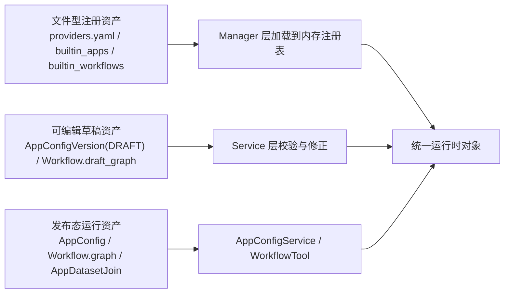

# 配置资产与平台底座

这一篇只看平台底座，不展开推理细节。

这层真正要回答的问题是：为什么当前这套 Agent 开发平台里的模型、工具、知识库、工作流，不是散在服务里的参数拼接，而是能被稳定编辑、校验、发布、再装配成运行时对象的正式资产。

> 适合谁读：已经接受“这是个平台，不只是一个聊天应用”，接下来想看平台底层资产是怎么立住的人。
>
> 读前建议：先读 [平台定义与总览](./platform-definition-and-overview.md)，再回来读这一篇会更顺。

## 先建立阅读坐标

- 这篇在主线里的位置：第二篇，用来回答“平台为什么能稳定编辑、发布、复用”，而不是只在 service 里拼参数。
- 带着这三个问题读：
  1. 为什么 `App` 要作为配置资产的总锚点。
  2. 为什么草稿态和发布态必须分开。
  3. 为什么 `AppConfigService` 会成为真正的运行时翻译器。
- 先记住的对象：`App`、`AppConfigVersion`、`AppConfig`、`Workflow.draft_graph / graph`。
- 如果时间有限，优先看：资产闭环、第 1 节、第 3 节、第 7 节和第 8 节。

## 先看资产闭环



这一层至少有三类资产：

1. 文件型注册资产
   - 模型 provider 和 model YAML
   - 内置工具 YAML
   - 内置应用模板 YAML
   - 内置工作流模板 YAML
2. 可编辑草稿资产
   - `AppConfigVersion(config_type=draft)`
   - `Workflow.draft_graph`
3. 发布态运行资产
   - `AppConfig`
   - `Workflow.graph`
   - `AppDatasetJoin`
   - `MCPTool` 这类 discovery 后的目录缓存

平台底座的工作，不是把这些资产堆在一起，而是把它们接成一条稳定的“编辑 -> 校验 -> 发布 -> 装配”链。

## 1. `App` 是配置资产的总锚点

这个项目里，真正挂起平台大部分能力的产品对象不是 Conversation，也不是 Workflow，而是 `App`。

`App` 本身只保存产品级基础信息和几个关键指针：

- `app_config_id`
- `draft_app_config_id`
- `debug_conversation_id`
- `token`
- `status`

对应代码边界很清楚：

```python
class App(db.Model):
    account_id = Column(UUID, nullable=False)
    app_config_id = Column(UUID, nullable=True)
    draft_app_config_id = Column(UUID, nullable=True)
    debug_conversation_id = Column(UUID, nullable=True)
    token = Column(String(255), nullable=True)
    status = Column(String(255), default="", nullable=False)
```

它自己不是运行配置，而是“配置资产入口 + 运行面入口”的聚合壳。

### 1.1 `App` 挂着三种派生资产

`App` 上有三个很关键的只读属性：

1. `draft_app_config`
   - 当前可编辑草稿
2. `app_config`
   - 当前正式运行配置
3. `debug_conversation`
   - 当前调试会话

这三个对象都不是构造函数里一次性塞好的，而是按需解析、按需懒创建。

最典型的是 `draft_app_config`：

```python
@property
def draft_app_config(self) -> "AppConfigVersion":
    app_config_version = (
        db.session.query(AppConfigVersion)
        .filter(
            AppConfigVersion.app_id == self.id,
            AppConfigVersion.config_type == AppConfigType.DRAFT,
        )
        .one_or_none()
    )

    if not app_config_version:
        app_config_version = AppConfigVersion(
            app_id=self.id,
            version=0,
            config_type=AppConfigType.DRAFT,
            **DEFAULT_APP_CONFIG
        )
        db.session.add(app_config_version)
        db.session.commit()

    return app_config_version
```

这说明草稿配置不是“必须先显式初始化”的独立流程，而是 `App` 级懒初始化的一部分。

### 1.2 `App` 还挂着两个发布面状态机

除了配置本身，`App` 还挂着两个很容易被忽略的发布面：

1. `token_with_default`
   - 管 WebApp token
   - 只有发布态才会生成 token
   - 回退到草稿态时会清掉 token
2. `wechat_config`
   - 管微信发布配置
   - 会根据应用发布状态和凭证完整性自动修正 `configured / unconfigured`

也就是说，这个项目不是把 WebApp、WeChat 当独立产品线做，而是当 `App` 的派生发布面做。

## 2. 默认配置不是“提示值”，而是第一版配置 schema

这套平台从一开始就没有允许“空应用”直接流进运行时。

大部分默认骨架定义在 `DEFAULT_APP_CONFIG`：

```python
DEFAULT_APP_CONFIG = {
    "model_config": {
        "provider": "openai",
        "model": "gpt-4o-mini",
        "parameters": {
            "temperature": 0.5,
            "top_p": 0.85,
            "frequency_penalty": 0.2,
            "presence_penalty": 0.2,
            "max_tokens": 8192,
        },
    },
    "dialog_round": 3,
    "preset_prompt": "",
    "tools": [],
    "workflows": [],
    "datasets": [],
    "retrieval_config": {
        "retrieval_strategy": "semantic",
        "k": 10,
        "score": 0.5,
    },
    "long_term_memory": {"enable": False},
    "opening_statement": "",
    "opening_questions": [],
    "speech_to_text": {"enable": False},
    "text_to_speech": {"enable": False, "voice": "xiaoxiao", "auto_play": False},
    "review_config": {
        "enable": False,
        "keywords": [],
        "inputs_config": {"enable": False, "preset_response": ""},
        "outputs_config": {"enable": False},
    },
}
```

这份字典定义的不是 UI 占位符，而是第一版应用配置的字段边界：

- 一定有模型配置
- 一定有会话轮数
- 一定有工具、工作流、知识库开关位
- 一定有检索、长期记忆、语音、审核这些策略位

### 2.1 默认值是分层的，不是单一来源

这一点要写清，不然会把实现讲假。

当前项目里的“默认配置”至少分三层：

1. `DEFAULT_APP_CONFIG`
   - 应用草稿骨架的主要来源
2. 数据库列默认值
   - 例如 `AppConfig` / `AppConfigVersion` 里的 `suggested_after_answer`
3. 模板资产覆盖
   - 内置应用 YAML
   - 内置工作流 YAML

例如：

- `DEFAULT_APP_CONFIG` 里没有显式写 `suggested_after_answer`
- 但 `AppConfig` 和 `AppConfigVersion` 的列默认值会补上 `{"enable": true}`
- 内置应用 YAML 里又可以显式覆盖它

所以这里不是“一个 dict 统治全部默认值”，而是“骨架默认值 + 存储默认值 + 模板覆盖”三层叠加。

### 2.2 这些补充配置项也要单独讲清楚

如果只把注意力放在模型、工具、知识库、工作流这几块，很容易把另外一组配置当成“页面修饰项”。

实际不是。`opening_statement`、`opening_questions`、`speech_to_text`、`text_to_speech`、`suggested_after_answer`、`review_config` 都已经是正式配置协议的一部分，而且每一项都有明确的校验和消费位置。

| 字段 | 结构和默认来源 | 写入校验 | 运行时或发布面落点 |
| --- | --- | --- | --- |
| `opening_statement` | `str`，默认空串，来自 `DEFAULT_APP_CONFIG` | 必须是字符串，长度 `0-2000` | 由 `AppConfigService` 返回，并在 `WebAppService.get_web_app_info()` 暴露给发布面；不进入 Agent prompt 主链 |
| `opening_questions` | `list[str]`，默认空列表，来自 `DEFAULT_APP_CONFIG` | 最多 `3` 个元素，且每个元素都必须是字符串 | 由 `AppConfigService` 返回，并在 `WebAppService.get_web_app_info()` 暴露给发布面，作为开场建议问题 |
| `speech_to_text` | `{"enable": bool}`，来自 `DEFAULT_APP_CONFIG` | 只能有 `enable` 这一个键，且值必须是布尔值 | 作为发布面的语音输入能力开关返回，不参与模型推理参数拼装 |
| `text_to_speech` | `{"enable": bool, "voice": str, "auto_play": bool}`，来自 `DEFAULT_APP_CONFIG` | 字段集合必须完整，`voice` 必须在 `ALLOWED_AUDIO_VOICES` 中，其他值必须是布尔值 | 作为发布面的播报配置返回，不进入 Agent 推理主链 |
| `suggested_after_answer` | `{"enable": bool}`，当前主要靠 `AppConfig` / `AppConfigVersion` 的列默认值补齐 | 只能有 `enable` 这一个键，且值必须是布尔值 | 由 `AppConfigService` 和 `WebAppService.get_web_app_info()` 返回，控制回答后建议问题开关 |
| `review_config` | `{"enable", "keywords", "inputs_config", "outputs_config"}`，来自 `DEFAULT_APP_CONFIG` | 结构严格；开启审核时 `keywords` 不能为空且不能超过 `100` 个；输入审核和输出审核至少要开一项；开启输入审核时 `preset_response` 不能为空 | 直接插进 Agent 主链：输入命中关键词时在进模型前短路返回 `preset_response`，输出命中关键词时在流式片段里脱敏 |

这一组字段里，真正会改变 Agent 执行路径的是 `review_config`。

- `FunctionCallAgent._preset_operation_node()` 会先跑输入审核。
- 命中关键词时不会继续走 LLM，而是直接发布 `AGENT_MESSAGE` 和 `AGENT_END`。
- `FunctionCallAgent._llm_node()` 和 `ReACTAgent._llm_node()` 在输出流式片段时又会按关键词做脱敏替换。

所以它不是“前端是否展示某个开关”的问题，而是已经进入运行链的治理配置。

## 3. 草稿态和发布态不是镜像表，而是两种不同的存储形状

这层是底座里最值钱的实现细节之一。

很多系统会把 draft 和 published 简单做成两份同构 JSON。这个项目不是。

### 3.1 草稿态是“面向编辑”的结构

`AppConfigVersion` 里直接保留：

- `tools`
- `workflows`
- `datasets`
- `retrieval_config`
- `long_term_memory`
- `review_config`

也就是说，草稿态配置更接近画布和配置面板的原始编辑结果。

### 3.2 发布态是“面向运行”的结构

`AppConfig` 里没有 `datasets` 字段，知识库关联被拆到了：

- `AppConfig.workflows`
- `AppConfig.tools`
- `AppDatasetJoin`

这说明发布态不是简单复制草稿 JSON，而是做了一次运行向归一化：

- 工具列表只保留最小引用
- 工作流列表只保留已发布工作流 id
- 知识库改成 join 表

发布动作里的代码很直白：

```python
app_config = self.create(
    AppConfig,
    app_id=app_id,
    model_config=draft_app_config["model_config"],
    dialog_round=draft_app_config["dialog_round"],
    preset_prompt=draft_app_config["preset_prompt"],
    tools=[
        {
            "type": tool["type"],
            "provider_id": tool["provider"]["id"],
            "tool_id": tool["tool"]["name"],
            "params": tool["tool"]["params"],
        }
        for tool in draft_app_config["tools"]
    ],
    workflows=[workflow["id"] for workflow in draft_app_config["workflows"]],
    retrieval_config=draft_app_config["retrieval_config"],
    long_term_memory=draft_app_config["long_term_memory"],
    opening_statement=draft_app_config["opening_statement"],
    opening_questions=draft_app_config["opening_questions"],
    speech_to_text=draft_app_config["speech_to_text"],
    text_to_speech=draft_app_config["text_to_speech"],
    review_config=draft_app_config["review_config"],
)
```

这里有个实现细节不能省：发布动作当前显式透传了 `opening_statement`、`opening_questions`、`speech_to_text`、`text_to_speech`、`review_config`，但没有显式透传 `suggested_after_answer`。也就是说，发布态这项配置目前主要依赖 `AppConfig.suggested_after_answer` 的列默认值，再由读路径带出来，而不是像 `review_config` 那样直接从草稿态复制过去。

知识库则另外写入：

```python
for dataset in draft_app_config["datasets"]:
    self.create(AppDatasetJoin, app_id=app_id, dataset_id=dataset["id"])
```

这一步很关键，因为它说明平台底座没有把“编辑友好”硬塞给“运行友好”。

### 3.3 读路径会把运行态再展开成消费友好结构

无论是 `get_draft_app_config()` 还是 `get_app_config()`，最后都会统一走：

```python
return self._process_and_transformer_app_config(
    validate_model_config,
    tools,
    workflows,
    datasets,
    app_config,
)
```

返回给前端或上层服务的结构，不是数据库里的最小存储结构，而是带有：

- provider/tool 展示信息
- dataset 名称/图标/描述
- workflow 名称/图标/描述

的展开对象。

所以这一层做了两次投影：

1. 编辑/发布时，把 rich config 压成存储结构
2. 读取时，再把存储结构展开成消费结构

## 4. 写路径和读路径的校验策略并不一样

这也是文档里必须写出来的真实实现，不然会误以为系统只有一套统一校验。

## 4.1 写草稿时走严格字段门禁

`AppService._validate_draft_app_config()` 是写路径的主门禁。

它先限制允许更新的字段集合：

```python
acceptable_fields = [
    "model_config",
    "dialog_round",
    "preset_prompt",
    "tools",
    "workflows",
    "datasets",
    "retrieval_config",
    "long_term_memory",
    "opening_statement",
    "opening_questions",
    "speech_to_text",
    "text_to_speech",
    "suggested_after_answer",
    "review_config",
]
```

然后逐块做严格校验：

- `model_config` 必须包含 `provider/model/parameters`
- `dialog_round` 必须在 `0-100`
- `tools / workflows / datasets` 都有限量和去重约束
- `retrieval_config` 只允许 `semantic/full_text/hybrid`
- `opening_statement` 长度不能超过 `2000`
- `opening_questions` 不能超过 `3` 个
- `speech_to_text`、`text_to_speech`、`suggested_after_answer` 都有严格字段形状约束
- `review_config` 不只校验字段形状，还校验关键词数量、输入/输出启停组合、输入预设响应是否为空

这层的目标不是“尽量修”，而是“拒绝写入明显错误的编辑结果”。

## 4.2 读草稿和读运行配置时走宽校验 + 自动修复

`AppConfigService.get_draft_app_config()` 和 `get_app_config()` 走的是另一套思路。

它们会：

1. 校验模型配置是否还有效
2. 剔除已删除或已失效的工具引用
3. 剔除不存在的知识库和工作流
4. 修正参数默认值
5. 把修正结果回写数据库

例如读草稿时：

```python
validate_model_config = self._process_and_validate_model_config(
    draft_app_config.model_config
)
if draft_app_config.model_config != validate_model_config:
    self.update(draft_app_config, model_config=validate_model_config)

tools, validate_tools = self._process_and_validate_tools(draft_app_config.tools)
datasets, validate_datasets = self._process_and_validate_datasets(
    draft_app_config.datasets
)
workflows, validate_workflows = self._process_and_validate_workflows(
    draft_app_config.workflows
)
```

这层的目标是：

- 不让脏配置继续污染运行时
- 尽量修成可继续编辑、可继续运行的状态

所以写路径和读路径不是同一种哲学：

- 写路径偏严格门禁
- 读路径偏宽校验和自愈

## 5. 模型注册中心是“文件资产 -> 内存注册表 -> 运行实例”的三段式

平台底座里，模型不是表驱动，而是目录驱动。

### 5.1 `providers.yaml` 只注册 provider

`LanguageModelManager` 初始化时先读取 `providers.yaml`，建立 provider 注册表：

```python
with open(providers_yaml_path, encoding="utf-8") as f:
    providers_yaml_data = yaml.safe_load(f)

values["provider_map"] = {}
for index, provider_yaml_data in enumerate(providers_yaml_data):
    provider_entity = ProviderEntity(**provider_yaml_data)
    values["provider_map"][provider_entity.name] = Provider(
        name=provider_entity.name,
        position=index + 1,
        provider_entity=provider_entity,
    )
```

这一层只声明：

- provider 名字
- label / description / icon / background
- 支持的模型类型

### 5.2 每个 provider 再读 `positions.yaml + <model>.yaml`

`Provider` 初始化时会：

1. 动态导入 provider 下对应 model type 的实现类
2. 读取 `positions.yaml`
3. 再逐个读取 `<model>.yaml`

这里真正重要的不是“用了 YAML”，而是“注册事实”和“实现类”是分开的。

### 5.3 参数模板不是写死在每个模型 YAML 里

`<model>.yaml` 里的参数还能引用 `DEFAULT_MODEL_PARAMETER_TEMPLATE`：

```python
use_template = parameter.get("use_template")
if use_template:
    default_parameter = DEFAULT_MODEL_PARAMETER_TEMPLATE.get(use_template)
    del parameter["use_template"]
    parameters.append({**default_parameter, **parameter})
```

这一步的作用，是把：

- OpenAI 风格通用参数模板
- 单模型的少量覆盖

拼成最终 `ModelEntity.parameters`。

也就是说，模型配置资产层还有一层“参数 schema 模板复用”。

### 5.4 运行时才真正实例化模型

最后由 `LanguageModelService.load_language_model()` 把配置对象变成模型实例：

```python
provider = self.language_model_manager.get_provider(provider_name)
model_entity = provider.get_model_entity(model_name)
model_class = provider.get_model_class(model_entity.model_type)

return model_class(
    **model_entity.attributes,
    **parameters,
    features=model_entity.features,
    metadata=model_entity.metadata,
)
```

如果有 `account_id`，还会在这里注入用户自己的 provider API Key。

所以模型平台的真实边界是：

- YAML 目录负责注册事实
- Manager 负责建内存注册表
- Service 负责实例化和注入租户密钥

## 6. 内置应用和内置工作流模板也是正式配置资产

这部分很容易被写成“官方示例”，但从实现看，它们已经是平台底座的一部分。

## 6.1 内置应用模板是完整 YAML 配置

`BuiltinAppManager` 会直接扫描 `internal/core/builtin_apps/builtin_apps/*.yaml`。

加载时还有一个别名转换：

```python
builtin_app["language_model_config"] = builtin_app.pop("model_config")
self.builtin_app_map[builtin_app.get("id")] = BuiltinAppEntity(**builtin_app)
```

也就是说，内置应用模板不是截图示例，而是一份能直接落成草稿 `AppConfigVersion` 的配置资产。

`BuiltinAppService.add_builtin_app_to_space()` 会把它们拷贝成新的 `App` + `AppConfigVersion(DRAFT)`。

## 6.2 内置工作流模板不是复制粘贴，而是“重写引用”的图克隆

`BuiltinWorkflowService.create_workflow_from_template()` 做的不只是把 YAML 存进库里。

它会：

1. 为每个节点生成新的 UUID
2. 重写所有 `inputs/outputs` 里的 `ref_node_id`
3. 为每条边生成新的 UUID
4. 把 `source/target` 指向新的节点 id

也就是说，工作流模板不是“共享一张图”，而是“按模板克隆出一张新的 draft 图”。

这一步对图资产很关键，不然后续编辑会污染模板引用关系。

## 7. `AppConfigService` 才是资产层真正的翻译器

如果只看到表和 YAML，还不够。

真正把这些资产翻成运行时对象的核心服务，是 `AppConfigService`。

它至少负责四类翻译：

1. `model_config` -> `BaseLanguageModel`
2. `tools` -> `BaseTool` 列表
3. `datasets + retrieval_config` -> 检索工具
4. `workflow ids` -> `WorkflowTool`

这个服务的重要性在于，它把：

- 文件型注册资产
- 数据库存储资产
- 草稿态/发布态差异

统一收口成了一组上层可直接消费的运行时对象。

因此平台底座真正稳不稳，不主要看表设计，而主要看这里的翻译边界清不清楚。

## 8. 复现同类平台时可优先保留的边界

这一层最值得复用的不是某张表，而是这几个边界：

1. 用 `App` 挂起草稿、发布、调试和发布面状态，不要让配置表自己承担产品对象职责。
2. 让默认配置成为 schema 骨架，而不是表单占位值。
3. 草稿态和发布态可以异形存储，不必强求两张同构 JSON 表。
4. 写路径用严格门禁，读路径用宽校验和自愈。
5. 把模型、工具、模板都当正式配置资产，不要把 YAML 只当“示例文件”。
6. 资产层和运行时之间一定要有统一翻译器，不要让每个入口自己拼对象。

平台底座的核心不是技术选型，而是“配置资产有没有被认真对待”。从这套平台实现看，这一层已经把资产边界、默认骨架、草稿/发布分离、模板资产和运行时翻译器都立起来了，后面的 Agent、RAG、Workflow 才能建立在一套稳定地基上。

## 9. 这一篇先记住什么

1. 平台底座的核心不是表多不多，而是配置资产有没有形成“编辑 -> 校验 -> 发布 -> 装配”的闭环。
2. 草稿态和发布态不需要同构，但必须分开。
3. 真正把配置资产翻成运行时对象的，不是路由入口，而是像 `AppConfigService` 这样的统一翻译层。

## 下一篇建议读什么

- [Agent 运行时与记忆机制](./agent-runtime-and-memory.md)：看这些配置资产怎样真正进入一次对话执行链。
