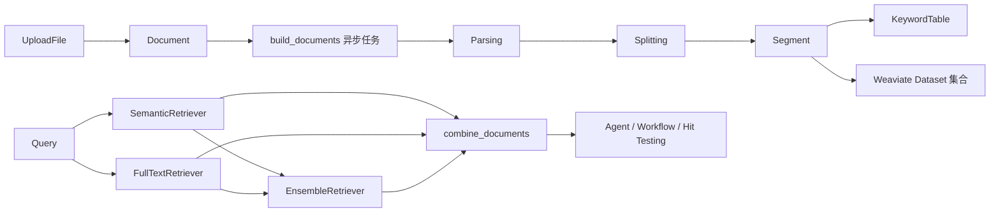

# 知识库与检索链路

这一篇只看外部知识怎样进入平台，又怎样从平台里被取出来。会话历史裁剪、长期摘要和消息拼装已经放到 [Agent 运行时与记忆机制](./agent-runtime-and-memory.md)，这里不再重复。

> 适合谁读：已经做过 RAG，但还没从“向量检索功能”切换到“平台级知识资产链”视角的人。
>
> 读前建议：先看 [工具与外部能力](./tools-and-external-capabilities.md)，因为这一篇的重点之一就是“检索为什么最后也要 Tool 化”。

## 先建立阅读坐标

- 这篇在主线里的位置：第五篇，用来回答“知识库为什么不只是上传文件 + 查向量库”。
- 带着这三个问题读：
  1. 平台维护的知识对象到底有哪些层次。
  2. 为什么建库要拆成文档资产、异步流水线和双索引维护。
  3. 为什么检索最终必须回到统一运行时，而不是停留在后台服务。
- 先记住的对象：`Dataset`、`Document`、`Segment`、`KeywordTable`、`DatasetQuery`。

先给结论：

- 知识库不是“上传文件后直接进向量库”
- 检索也不是“只做一次相似度搜索”
- 平台真正维护的是一组可在线运维的知识资产：`Dataset -> Document -> Segment -> KeywordTable / Vector Store -> Retrieval Tool`

## 先看主链



这张图里有三个实现选择，后面所有代码都是围绕它展开的：

1. 文档先落库，再异步建索引。
2. 检索保留全文、语义、混合三条路径，而不是只依赖向量库。
3. 知识库最终以 Tool 和 Workflow Node 的形式进入运行时，而不是停留在后台服务层。

## 1. 资产模型不是一张表

这套知识库实现至少维护了六类资产：

| 资产 | 作用 | 关键字段 |
| --- | --- | --- |
| `Dataset` | 知识库根对象 | `name`、`description`、`account_id` |
| `Document` | 一次上传后的文档资产 | `upload_file_id`、`process_rule_id`、`batch`、`status`、`enabled` |
| `Segment` | 检索最小单元 | `node_id`、`content`、`keywords`、`hash`、`hit_count`、`enabled` |
| `KeywordTable` | 每个知识库一份关键词表 | `dataset_id`、`keyword_table(JSONB)` |
| `DatasetQuery` | 查询日志 | `dataset_id`、`query`、`source`、`source_app_id`、`created_by` |
| `ProcessRule` | 文档处理规则快照 | `mode`、`rule` |

这里最关键的是 `Document` 和 `Segment` 都不是静态记录，它们自己带状态机和运维字段：

- `Document.status`：`waiting -> parsing -> splitting -> indexing -> completed / error`
- `Segment.status`：`waiting -> indexing -> completed / error`
- `enabled`、`disabled_at` 用来表达在线启停状态
- `processing_started_at`、`parsing_completed_at`、`splitting_completed_at`、`indexing_completed_at`、`completed_at`、`stopped_at` 用来表达构建过程

这意味着平台维护的不是“一个向量索引”，而是一批可追踪、可停用、可删除、可统计命中的知识资产。

## 2. 建库入口先固化文档，再把重活交给异步任务

上传文档的入口在 `DocumentService.create_documents()`。这个入口先做三件事：

1. 校验知识库归属和上传文件合法性。
2. 为这一批上传创建一条 `ProcessRule` 记录。
3. 批量创建 `Document`，然后把后续处理交给 `build_documents.delay(...)`。

代码上就是两段：

```python
process_rule = self.create(
    ProcessRule,
    account_id=account.id,
    dataset_id=dataset_id,
    mode=process_type,
    rule=rule,
)

document = self.create(
    Document,
    account_id=account.id,
    dataset_id=dataset_id,
    upload_file_id=upload_file.id,
    process_rule_id=process_rule.id,
    batch=batch,
    name=upload_file.name,
    position=position,
)
```

```python
build_documents.delay([document.id for document in documents])
```

这个设计有两个直接收益：

- 前台上传接口很快返回，建索引不阻塞请求。
- 每一批文档都绑定自己的 `process_rule_id`，后面即使重新调规则，旧文档也还能按原规则回溯。

### 2.1 处理规则不是写死在分割器里的

`ProcessRuleService` 把规则拆成两部分：

- `pre_process_rules`
- `segment`

自动模式直接使用默认规则：

- 预处理：`remove_extra_space`、`remove_url_and_email`
- 分段参数：`chunk_size=500`、`chunk_overlap=50`
- 默认分隔符同时兼容中文句号、英文句号、分号、逗号、空格和空字符串

自定义模式会在 `CreateDocumentsReq.validate_rule()` 里做硬校验：

- `chunk_size` 范围是 `100-1000`
- `chunk_overlap` 不能超过 `chunk_size * 0.5`
- `pre_process_rules` 只能是那两条预处理开关

这里的要点不是“可以自定义切分”，而是“规则会被固化成文档处理快照”，这样线上文档的切分结果才有出处。

## 3. 建库流水线分四段

`IndexingService.build_documents()` 的主线很固定：

1. `_parsing()`
2. `_splitting()`
3. `_indexing()`
4. `_completed()`

任意一步报错，文档会落成 `DocumentStatus.ERROR` 并记录 `stopped_at`。

### 3.1 Parsing：先把文件拉成可处理文本

`_parsing()` 会通过 `FileExtractor` 把 `UploadFile` 转成 LangChain `Document` 列表，然后做一轮清洗：

- 替换异常边界字符
- 删除控制字符
- 删除零宽非标记字符

这一段结束后，文档状态会更新成 `splitting`，并写入：

- `character_count`
- `processing_started_at`
- `parsing_completed_at`

### 3.2 Splitting：先落 `Segment`，再谈索引

`_splitting()` 不是把 chunk 暂存在内存里，而是先把每个片段写进 `segment` 表：

```python
segment = self.create(
    Segment,
    account_id=document.account_id,
    dataset_id=document.dataset_id,
    document_id=document.id,
    node_id=uuid.uuid4(),
    position=position,
    content=content,
    character_count=len(content),
    token_count=self.embeddings_service.calculate_token_count(content),
    hash=generate_text_hash(content),
    status=SegmentStatus.WAITING,
)
```

同时会给待入向量库的 `lc_segment.metadata` 先挂上一组运行时元数据：

- `account_id`
- `dataset_id`
- `document_id`
- `segment_id`
- `node_id`
- `document_enabled=False`
- `segment_enabled=False`

这一步很关键。片段先成为平台资产，向量库只是在后面消费这份资产，而不是反过来由向量库决定平台数据结构。

### 3.3 Indexing：关键词表和片段状态同步推进

`_indexing()` 做的不是嵌入计算，而是全文检索侧的数据准备：

1. 对每个片段用 `jieba` 抽最多 10 个关键词。
2. 把关键词写回 `Segment.keywords`。
3. 把片段状态推进到 `SegmentStatus.INDEXING`。
4. 更新当前知识库的 `KeywordTable.keyword_table`。

这里的 `KeywordTable` 不是外部搜索引擎，而是 PostgreSQL 里一份按知识库划分的 JSONB 映射表，结构可以理解成：

```text
keyword -> [segment_id, segment_id, ...]
```

后面的全文检索就是直接用这份映射表做的。

### 3.4 Completed：最后一跳才是向量库写入

`_completed()` 会先把每个 `lc_segment.metadata` 里的两个开关翻成 `True`：

- `document_enabled=True`
- `segment_enabled=True`

然后按每 10 条一批写入 Weaviate，执行器是 `ThreadPoolExecutor(max_workers=5)`。写入成功后，把对应片段状态更新成：

- `status=completed`
- `completed_at=now`
- `enabled=True`

如果某一批写入失败，那一批片段会被标成：

- `status=error`
- `enabled=False`
- `stopped_at=now`

所有批次结束后，文档才会最终落成：

- `status=completed`
- `completed_at=now`
- `enabled=True`

这里的顺序说明一件事：向量写入成功只是片段完成的条件之一，真正的完成状态由平台自己裁定。

## 4. 这套知识库支持在线运维

这一层的关键能力不是上传文档，而是“建完以后还能在线改”。

### 4.1 文档管理面

`DocumentHandler` 暴露的是一组标准运维动作：

- `create_documents()`：上传并触发建库
- `get_document()` / `get_documents_with_page()`：查看文档与分页列表
- `get_documents_status()`：按 `batch` 查看一批文档的构建进度
- `update_document_enabled()`：在线启停文档
- `delete_document()`：删除文档

`get_documents_status()` 返回的不是简单状态码，而是完整建库过程视图：

- `segment_count`
- `completed_segment_count`
- `processing_started_at`
- `parsing_completed_at`
- `splitting_completed_at`
- `indexing_completed_at`
- `completed_at`
- `stopped_at`

这就是这套平台里最直接的“知识生产可观测性”。

### 4.2 片段管理面

`SegmentHandler` 进一步把文档内部拆成可在线维护的片段：

- `create_segment()`
- `get_segments_with_page()`
- `get_segment()`
- `update_segment()`
- `update_segment_enabled()`
- `delete_segment()`

这说明它不是“只能按文件重建”的知识库。文档建完以后，管理员可以直接对单个片段做增删改查和启停。

## 5. 片段动态管理的实现细节

### 5.1 新增片段

`SegmentService.create_segment()` 有几个硬约束：

- 片段内容不能超过 `1000 token`
- 只有 `Document.status == completed` 才允许新增
- 如果调用方没传关键词，就现场用 `jieba` 抽取

新增成功后会同步做四件事：

1. 创建 `Segment` 记录，状态直接落成 `completed`
2. 往 Weaviate 新增一条记录
3. 回算父文档的 `character_count` / `token_count`
4. 如果父文档当前是启用状态，就把新片段加入 `KeywordTable`

这意味着“手工补片段”不是旁路能力，它和正常建库产物走的是同一套检索资产。

### 5.2 修改片段

`SegmentService.update_segment()` 的判断点比新增多一层：

- 只有 `Segment.status == completed` 才允许修改
- 会重新生成 `hash`
- 只有内容哈希发生变化，才重算向量并更新向量库中的 `text` 和 `vector`

关键词侧的处理更直接：

1. 先从 `KeywordTable` 删旧映射
2. 再把新关键词重新加回去

这样做能避免“内容没变但关键词残留”或者“关键词改了但向量没刷新”的双写不一致。

### 5.3 删除片段

`SegmentService.delete_segment()` 允许删除的状态只有两种：

- `completed`
- `error`

删除时会同步处理三件事：

1. 删 `segment` 表记录
2. 从 `KeywordTable` 清掉关联关键词
3. 从 Weaviate 按 `node_id` 删除对应向量记录

最后还会回算父文档的字符数和 token 数。

### 5.4 片段启停不是只改一个布尔值

`update_segment_enabled()` 做的是一次三端同步：

1. PostgreSQL 里的 `Segment.enabled` / `disabled_at`
2. `KeywordTable`
3. Weaviate 里的 `segment_enabled`

同步规则也不是简单开关：

- 片段启用时，只有父文档也处于启用状态，才会把关键词重新加入 `KeywordTable`
- 片段禁用时，无论父文档状态如何，都会把关键词映射删除

这样语义检索和全文检索才能同时看到相同的启停结果：

- 语义检索依赖 Weaviate 中的 `segment_enabled`
- 全文检索依赖 `KeywordTable` 里是否还保留这个片段

## 6. 缓存锁、异步启停和双索引一致性

这套实现里有三把锁，过期时间统一是 `600s`：

- `LOCK_DOCUMENT_UPDATE_ENABLED`
- `LOCK_SEGMENT_UPDATE_ENABLED`
- `LOCK_KEYWORD_TABLE_UPDATE_KEYWORD_TABLE`

### 6.1 文档启停为什么走异步

文档启停影响的是“这个文档下的所有片段”。`DocumentService.update_document_enabled()` 先做两步：

1. 更新 `Document.enabled`
2. 写入 Redis 锁键

然后把真正的同步动作交给异步任务 `update_document_enabled.delay(document.id)`。

异步任务 `IndexingService.update_document_enabled()` 会：

1. 扫描这个文档下所有 `completed` 片段
2. 把每个向量记录的 `document_enabled` 更新成目标值
3. 如果启用文档，就把所有已启用片段重新加入 `KeywordTable`
4. 如果禁用文档，就从 `KeywordTable` 中剔除这个文档下全部片段
5. 最后删除 Redis 锁键

这里把 `document_enabled` 和 `segment_enabled` 分开存，是一个很实用的设计：

- 文档停用，不必逐条改片段业务状态
- 片段单独停用，也不必影响文档整体状态
- 检索时同时过滤两个开关，就能得到最终可见集

### 6.2 片段启停为什么走同步

片段级启停只影响一条记录，`SegmentService.update_segment_enabled()` 直接在锁内同步完成：

- 改数据库
- 改关键词表
- 改 Weaviate `segment_enabled`

如果同步失败，片段会被打成：

- `status=error`
- `enabled=False`
- `disabled_at=now`
- `stopped_at=now`

这比“部分成功，部分失败”更容易收敛，因为失败后的片段会立刻退出可检索集。

### 6.3 关键词表锁覆盖了哪些场景

`KeywordTableService.add_keyword_table_from_ids()` 和 `delete_keyword_table_from_ids()` 都会拿 `LOCK_KEYWORD_TABLE_UPDATE_KEYWORD_TABLE`。

这把锁主要保护在线变更路径。下列动作都会通过 `KeywordTableService` 竞争同一份 `keyword_table`：

- 片段新增
- 片段编辑
- 片段启停
- 文档启停
- 文档/片段删除

如果没有这把锁，最容易出现的问题就是覆盖写，把别的请求刚刚更新进去的关键词映射冲掉。

要单独说明的是：建库阶段 `IndexingService._indexing()` 更新 `KeywordTable` 时，并没有走 `KeywordTableService.add_keyword_table_from_ids()`，而是直接读改写 `keyword_table`。所以当前锁保护的重点是“线上增删改启停”，不是“所有关键词表写入都统一串行化”。如果后面同一知识库下的并发建库量继续上升，这里值得再收敛一次。

## 7. 检索链不是单路向量检索

`RetrievalService.search_in_datasets()` 是检索总入口。它先校验数据集归属，然后组装三类检索器：

- `SemanticRetriever`
- `FullTextRetriever`
- `EnsembleRetriever`

### 7.1 语义检索

`SemanticRetriever` 直接调用 Weaviate 的 `similarity_search_with_relevance_scores()`，过滤条件有三项：

- `dataset_id in dataset_ids`
- `document_enabled == True`
- `segment_enabled == True`

得分阈值来自 `score_threshold`，返回值会把相似度写到 `lc_document.metadata["score"]`。

这条路径负责的是“语义上接近什么”。

### 7.2 全文检索

`FullTextRetriever` 走的是另一条路：

1. 对 query 用 `jieba` 抽 10 个关键词
2. 从指定知识库的 `KeywordTable` 里找匹配关键词
3. 汇总所有命中的 `segment_id`
4. 用 `Counter` 统计片段出现频次
5. 取频次最高的 Top K 片段
6. 回表读取 `Segment` 内容

这条路径没有外部倒排索引，命中得分也固定写成 `0`。它负责的是“关键词能不能直接打中”。

### 7.3 混合检索

混合检索用的是 LangChain 的 `EnsembleRetriever`：

```python
hybrid_retriever = EnsembleRetriever(
    retrievers=[semantic_retriever, full_text_retriever],
    weights=[0.5, 0.5],
)
```

当前版本没有再往后接二次重排模型，融合策略就是固定权重 `0.5 / 0.5`。这也是这一版实现和一些商用 RAG 平台的主要差异之一。

## 8. 查询重写和重排模型：当前实现边界与扩展插点

这一版代码里，应用配置和工作流检索配置都只认三个字段：

- `retrieval_strategy`
- `k`
- `score`

`DEFAULT_APP_CONFIG["retrieval_config"]`、`AppService._validate_draft_app_config()` 和 `DatasetRetrievalNodeData.RetrievalConfig` 也都是按这三个字段校验的。也就是说：

- 当前实现没有统一的查询重写能力
- 当前实现也没有统一的重排模型接入层

这不是文档遗漏，而是代码边界。

不过扩展位置已经很明确了。

### 8.1 如果要加查询重写

最合适的插点在 `RetrievalService.search_in_datasets()` 之前，也就是：

1. 接收原始 query
2. 调用 Query Rewrite 模型生成 `rewritten_query`
3. 用 `rewritten_query` 去驱动 `SemanticRetriever` / `FullTextRetriever`
4. 在 `DatasetQuery` 里同时记录原始 query 和改写后 query

这样改完以后，Agent Tool、Workflow Node、召回测试接口都能自动吃到这层能力，因为三者共用同一个检索服务入口。

### 8.2 如果要加重排模型

最合适的插点在初次召回之后，也就是：

1. 先拿到语义、全文或混合召回的候选 `lc_documents`
2. 交给 Rerank 模型重新排序
3. 再截断 Top K
4. 把重排分数和原始召回分数一起挂回 metadata

如果真要落地，至少还得同步改三处：

- `retrieval_config` 配置结构
- `DatasetService.hit()` 的返回体，增加重排相关分数
- `combine_documents()` 之前的排序逻辑

否则功能就只能停留在服务内部，无法被应用配置和工作流节点显式控制。

## 9. 检索为什么一定要 Tool 化

知识库如果只是后台服务，就只能被某一个入口私用。这个项目把检索能力抬成 Tool 之后，三个入口都能共用：

- Agent
- Workflow
- Hit Testing

Agent 和 Web/API 入口最终都走 `create_langchain_tool_from_search()`：

```python
@tool(DATASET_RETRIEVAL_TOOL_NAME, args_schema=DatasetRetrievalInput)
def dataset_retrieval(query: str) -> str:
    documents = self.search_in_datasets(...)
    if len(documents) == 0:
        return "知识库内没有检索到对应内容"
    return combine_documents(documents)
```

Workflow 侧则把它包装成 `dataset_retrieval` 节点：

- 节点输入固定只有一个 `query`
- 输出固定是 `combine_documents`
- 节点内部直接复用同一套检索 Tool

这样做之后，知识库层才真正变成平台公共能力，而不是某个聊天入口里的一个私有 if/else。

## 10. RAG 在线知识库评测：召回测试不是 demo 功能

`DatasetHandler.hit()` 和 `DatasetService.hit()` 是这一版最直接的 RAG 评测入口。它不是只返回一段拼接文本，而是把召回结果原样展开成结构化数据。

### 10.1 召回测试能调什么

`HitReq` 允许在线调三组参数：

- `retrieval_strategy`：`semantic` / `full_text` / `hybrid`
- `k`：`1-10`
- `score`：`0-0.99`

这意味着开发者可以直接用同一份知识库，对比三种检索策略在不同阈值下的召回差异。

### 10.2 召回测试返回什么

`DatasetService.hit()` 返回的不是黑盒结果，而是带证据的片段列表：

- 片段 `id`
- 归属文档 `id / name / extension / mime_type`
- `score`
- `position`
- `content`
- `keywords`
- `character_count`
- `token_count`
- `hit_count`
- `enabled`
- `disabled_at`
- `status`
- `error`
- `updated_at`
- `created_at`

这组返回值足够支撑两类工作：

- 人工看召回质量
- 前端做召回测试页和片段级排障

### 10.3 召回测试之外，平台还记了哪些检索行为

检索有命中时，`RetrievalService.search_in_datasets()` 还会做两件事：

1. 给命中的片段批量 `hit_count + 1`
2. 按知识库去重后写入 `DatasetQuery`

`DatasetQuery.source` 目前有两种：

- `hit_testing`
- `app`

这组数据可以直接支撑三类统计：

- 最近查过什么
- 哪些片段经常被打中
- 某个知识库到底是被调试打得多，还是线上应用用得多

`Dataset` 和 `Document` 上的 `hit_count` 也是从 `Segment.hit_count` 聚合出来的，不需要单独维护第二份统计表。

## 11. 这一套实现真正解决了什么问题

如果只看“能不能做 RAG”，很多项目做到上传、切块、向量检索就停了。这套平台实现往前又走了几步：

- 文档和片段是独立资产，不是临时 chunk
- 文档和片段都能在线启停
- 关键词表和向量库同时维护，全文检索和语义检索共享同一批资产
- 检索能力被 Tool 化后可以进入 Agent 和 Workflow
- 召回测试、查询日志、命中次数都能在线看到

它的边界也同样明确：

- 目前没有统一查询重写层
- 目前没有二次重排模型
- 混合检索仍然是固定权重融合

如果后面要继续补能力，最值得先动的地方就是 `RetrievalService.search_in_datasets()` 这一层，因为它已经是 Agent、Workflow 和评测入口的公共汇合点。

## 12. 这一篇先记住什么

1. 平台维护的不是“一个向量索引”，而是一套可追踪、可启停、可统计、可评测的知识资产链。
2. 检索不只是一条向量检索路径，而是全文、语义、混合三条路径共同组成的运行时能力。
3. 知识库只有在进入统一 Tool 装配链之后，才真正变成平台能力的一部分。

## 下一篇建议读什么

- [Workflow 编排引擎](./workflow-orchestration-engine.md)：看平台第二条执行内核怎样建立，以及它为什么最后也会回到 Tool 体系。
