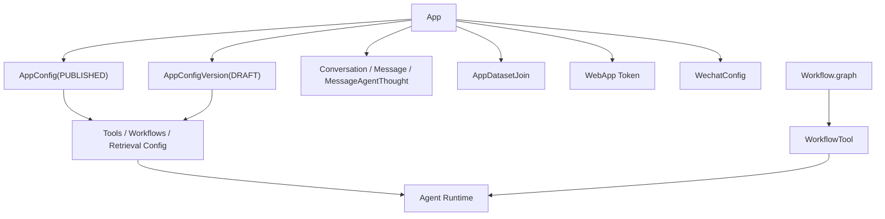

# 平台定义与总览

这一篇先把平台边界摆正，再看后面各篇细节如何挂上去。

从实现结构看，这一版平台不是“聊天页面 + 几个外挂功能”，也不是“单独的 Workflow 产品”或“单独的 RAG 产品”，而是一个以 `App` 为中心的应用装配与发布平台。

## 先给平台下一个工程定义

如果只看代码，不看产品文案，这个平台至少同时做了五件事：

1. 承载一个应用对象 `App`
2. 维护这份应用的草稿配置、发布配置和发布历史
3. 把模型、工具、知识库、工作流装配成统一运行时
4. 提供调试、WebApp、OpenAPI、WeChat 多个消费入口
5. 持续沉淀会话、消息、推理轨迹、摘要和工作流结果

所以更准确的定义应该是：

> 一个以 `App` 为产品对象、以配置资产为事实来源、以 Agent 和 Workflow 为执行内核、以多发布面复用同一套运行时为目标的应用平台。

这一定义里，四个词不能丢：

- `App`
- 配置资产
- 双执行内核
- 多入口复用

## 1. 平台边界先看产品对象，不先看功能页

这个项目最容易被低估的地方，是很多能力都已经围绕 `App` 收束了。

### 1.1 `App` 不是 prompt 容器，而是产品壳

`App` 本身并不保存完整运行配置，但它挂着：

- `draft_app_config`
- `app_config`
- `debug_conversation`
- `token_with_default`
- `wechat_config`

这意味着一个应用对象同时承担了：

- 编辑入口
- 调试入口
- 发布入口
- WebApp 发布面
- WeChat 发布面

所以平台的一号产品对象不是 Conversation，也不是 Message，而是 `App`。

### 1.2 其他资产都挂在 `App` 周围

从对象关系看，这个平台的中心关系更像这样：



这个图的重点是：

- `App` 负责把资产和运行面挂起来
- `AppConfigVersion / AppConfig` 才是配置事实来源
- Conversation / Message 是运行数据，不是应用定义
- Workflow 可以独立存在，但最终还能回流到 `App` 运行时

## 2. 平台有三条主线，但它们最后会汇到同一个 `App`

如果按工程实现来拆，这个平台至少有三条主线。

### 2.1 配置资产主线

这一条负责：

- 创建应用
- 维护草稿配置
- 发布运行配置
- 管理模板、知识库、工具、工作流引用

相关入口包括：

- `/apps`
- `/apps/<id>/draft-app-config`
- `/apps/<id>/publish`
- `/apps/<id>/publish-histories`
- `/builtin-apps`
- `/builtin-workflows`

### 2.2 运行主线

这一条负责：

- 读取配置
- 装配模型、工具、知识库和工作流
- 选择 Agent 形态
- 写回消息、摘要和推理轨迹

相关服务主要是：

- `AppService.debug_chat`
- `WebAppService.web_app_chat`
- `OpenAPIService.chat`
- `WechatService._thread_chat`

### 2.3 发布主线

这一条负责：

- 把同一个 `App` 暴露给不同消费面
- 维持不同入口的身份和会话边界

相关入口包括：

- `/web-apps/<token>/chat`
- `/openapi/chat`
- `/wechat/<app_id>`
- `/platform/<app_id>/wechat-config`

这里也要注意一个实现上的现实边界：`/web-apps/<token>/chat` 虽然用 token 解析发布态 `App`，但当前 `WebAppHandler` 仍然挂了 `login_required`，`WebAppService.web_app_chat()` 里新建或续接的会话也会写成 `invoke_from=web_app`、`created_by=account.id`。所以它现在更像“带发布 token 的账号侧 WebApp 消费面”，还不是完全匿名终端入口。

这三条主线最后都不会脱离 `App`，这就是它的平台结构。

## 3. 多入口不是多套逻辑，而是多套入口外壳

这点必须写透，不然很容易把平台理解成“每个入口一套业务”。

### 3.1 路由层已经把入口面摊开了

`Router.register_router()` 里能直接看到几种发布面：

```python
bp.add_url_rule(
    "/apps/<uuid:app_id>/conversations",
    methods=["POST"],
    view_func=self.app_handler.debug_chat,
)
bp.add_url_rule(
    "/web-apps/<string:token>/chat",
    methods=["POST"],
    view_func=self.web_app_handler.web_app_chat,
)
openapi_bp.add_url_rule(
    "/openapi/chat",
    methods=["POST"],
    view_func=self.openapi_handler.chat,
)
bp.add_url_rule(
    "/wechat/<uuid:app_id>",
    methods=["GET", "POST"],
    view_func=self.wechat_handler.wechat,
)
```

这四个入口不是四个产品线，而是同一平台的四种消费面：

- Debugger
- WebApp
- OpenAPI
- WeChat

### 3.2 多入口复用的是同一段装配逻辑

不管入口是哪一个，服务层核心动作都差不多：

1. 取草稿或发布配置
2. 加载模型
3. 取历史消息
4. 装配工具
5. 装配知识库检索
6. 装配工作流工具
7. 选择 `FunctionCallAgent` 或 `ReACTAgent`

OpenAPI 的实现是最容易看清的一条：

```python
app_config = self.app_config_service.get_app_config(app)

llm = self.language_model_service.load_language_model(
    app_config.get("model_config", {}),
    account_id=account.id,
)

tools = self.app_config_service.get_langchain_tools_by_tools_config(
    app_config["tools"]
)

if app_config["datasets"]:
    dataset_retrieval = self.retrieval_service.create_langchain_tool_from_search(...)
    tools.append(dataset_retrieval)

if app_config["workflows"]:
    workflow_tools = self.app_config_service.get_langchain_tools_by_workflow_ids(...)
    tools.extend(workflow_tools)

agent_class = (
    FunctionCallAgent if ModelFeature.TOOL_CALL in llm.features else ReACTAgent
)
```

这段链路说明平台真正复用的是：

- 配置资产
- 能力装配器
- Agent 运行时

入口之间真正不同的，只是鉴权、会话归属和响应包装。

## 4. 这个平台有两条正式执行内核

很多人第一眼只会看到 Agent，但代码里已经有第二条正式执行内核。

### 4.1 第一条内核是对话型 Agent

调试、WebApp、OpenAPI、WeChat 最后都会进 Agent 主链。

当前这条链至少负责：

- 消息装配
- 长期记忆回注
- 模型调用
- 工具循环
- 结果流式输出
- 推理轨迹落库

这条内核在产品上表现成“对话应用”。

### 4.2 第二条内核是 Workflow

Workflow 并不是 Agent 页面里的附属流程图，它有自己独立的资产和运行链：

- `Workflow.draft_graph`
- `Workflow.graph`
- `WorkflowResult`
- `/workflows/<id>/debug`
- `/workflows/<id>/publish`

它有独立的编译和调试体系，这已经是一条正式执行内核。

### 4.3 两条内核不是并列孤岛

真正体现平台感的地方，是 Workflow 最后还能再变成 Tool：

```python
workflow_tool = WorkflowTool(
    workflow_config=WorkflowConfig(
        account_id=workflow_record.account_id,
        name=f"wf_{workflow_record.tool_call_name}",
        description=workflow_record.description,
        nodes=workflow_record.graph.get("nodes", []),
        edges=workflow_record.graph.get("edges", []),
    )
)
```

这意味着：

- Workflow 是独立内核
- 但它又能重新并回 Agent 的工具层

所以平台不是“聊天”和“流程图”两套产品并排摆放，而是已经形成内核互相嵌套的关系。

## 5. 平台的能力供给层已经被对象化了

总览页不需要把每个子系统讲细，但必须把供给层讲清楚。

当前 `App` 运行时拿到的能力至少有四类：

1. 模型对象
   - `BaseLanguageModel`
2. 工具对象
   - `BaseTool`
3. 知识供给能力
   - 检索工具
4. 工作流能力
   - `WorkflowTool`

这些对象不是在入口里手拼出来的，而是通过几个平台级服务装配出来的：

- `LanguageModelService`
- `AppConfigService`
- `RetrievalService`
- `WorkflowTool`

这也是为什么后面的模型、工具、知识库、Workflow 文档都可以作为平台子系统单独展开。

## 6. 身份和租户边界已经进入模型层

如果一个系统只是 demo，它通常不会把“谁在用这个应用”写进数据模型。

这个项目已经写进去了。

### 6.1 资产层的租户边界

大部分可编辑资产都带：

- `account_id`

比如：

- `App.account_id`
- `Workflow.account_id`
- `Dataset.account_id`
- `ApiToolProvider.account_id`
- `MCPServer.account_id`

所以这不是单用户本地工具，而是多租户空间模型。

### 6.2 运行层的身份边界

运行数据里又进一步区分了：

- `Conversation.invoke_from`
- `Conversation.created_by`
- `Message.invoke_from`
- `Message.created_by`

`InvokeFrom` 已经被枚举出来：

```python
class InvokeFrom(str, Enum):
    SERVICE_API = "service_api"
    WEB_APP = "web_app"
    DEBUGGER = "debugger"
    ASSISTANT_AGENT = "assistant_agent"
```

这说明平台在运行层不只关心“哪个应用”，还关心“通过哪个入口、以谁的身份在跑”。

### 6.3 OpenAPI 和 WeChat 不是同一种终端身份模型

OpenAPI 走的是：

- `Account`
- `EndUser`
- `Conversation(created_by=end_user.id)`

WeChat 则多了一层：

- `WechatEndUser(openid -> end_user_id)`
- 再复用 `EndUser`
- 再复用 `Conversation(invoke_from=service_api)`

也就是说，WeChat 在运行内核里并没有再造一套新的会话模型，而是适配回了 `service_api` 这一套终端用户语义。

这个实现很实用，因为它避免了微信入口污染主链。

## 7. 这个项目已经不只是“聊天壳子”

判断一个系统是不是平台，不用看功能多不多，看它有没有把这些边界立起来：

1. 产品对象是不是独立于单次会话
2. 配置是不是正式资产
3. 调试态和发布态是不是分离
4. 多入口是不是复用同一套运行时
5. 外部能力是不是统一装配
6. 运行数据是不是被持续沉淀

当前这份代码里，这六件事都已经落地了：

- `App`
- `AppConfigVersion / AppConfig`
- `Workflow.draft_graph / graph`
- `AppConfigService`
- `Conversation / Message / MessageAgentThought`
- `WorkflowResult`

所以它早就不是“聊天界面上多挂了几个功能按钮”。

## 8. 读这组文档的顺序

这篇只负责定边界。后面几篇是把这些边界逐层掰开。

- [配置资产与平台底座](./configuration-assets-and-platform-foundation.md)
  - 看 `App`、配置、模板和注册中心为什么能成立
- [Agent 运行时与记忆机制](./agent-runtime-and-memory.md)
  - 看多入口怎么进同一条对话主链
- [工具与外部能力平台](./tools-and-external-capabilities.md)
  - 看外部能力怎么被压成统一工具对象
- [知识库与检索链路](./knowledge-base-and-retrieval-pipeline.md)
  - 看在线知识库怎样变成可复用检索供给层
- [Workflow 编排引擎](./workflow-orchestration-engine.md)
  - 看第二条执行内核怎样建立、调试、发布、再 Tool 化

## 9. 复现同类平台时可优先保留的边界

总览页最值得复用的不是模块清单，而是这几个判断：

1. 先定义一个稳定的产品对象，这里是 `App`。
2. 让所有能力围绕配置资产接入，不要让入口直接依赖底层实现。
3. 至少区分草稿态和发布态。
4. 让多入口复用同一条装配和运行链。
5. 如果有 Workflow，最好把它做成第二条正式内核，而不是页面级附属物。
6. 运行时一定要把会话、摘要、推理轨迹和结果沉淀下来。

这份平台实现的核心形状已经比较清楚：一个以 `App` 为中心的装配平台，前面连配置资产，后面连双执行内核，外面再挂多种发布面。后面所有实现细节，都是在把这张骨架往实处钉。
