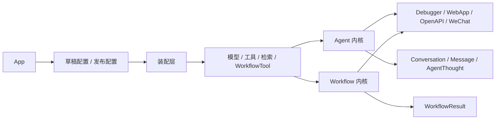

# 阅读地图与关键术语

这篇不是实现细节文档，而是这组 Agent 开发平台文档的桥接页。

如果已经做过后端、AI 应用、RAG、Tool Calling 或工作流编排，但还没系统做过“Agent 开发平台”，建议先看这一篇，再进入后面的主线文档。

## 适合谁读

- 已经理解 LLM、Prompt、Tool、RAG、Workflow 的基本概念
- 已经做过一些 AI 应用、自动化流程或后端服务
- 还没有把这些能力收成“可编辑、可发布、可复用、可运维”的平台

## 先建立一个最小平台图景

先不要把这个项目理解成“聊天页面 + 一些外挂能力”。

更接近的理解方式是：平台先围绕 `App` 维护配置资产，再把这些资产翻译成运行时对象，最后通过 Agent 或 Workflow 两条执行内核，对外暴露成多个消费入口。

先把上面这条主线记住，后面各篇文档就更容易挂回去。

## 先记住这几个对象

### 1. `App`

平台的一号产品对象。它不是 prompt 容器，而是挂起配置、调试、发布、发布面状态的总锚点。

### 2. `AppConfigVersion`

草稿态应用配置。面向编辑和反复修改。

### 3. `AppConfig`

发布态应用配置。面向正式运行和多入口复用。

### 4. `Workflow`

平台的第二条执行内核。既可以独立运行，也可以在发布后重新变成 Tool。

### 5. `Tool`

平台对外部能力的统一运行时接口。Builtin Tool、API Tool、MCP Tool、Workflow Tool、检索 Tool 最后都要压到这一层。

### 6. `Dataset / Document / Segment`

知识库资产链。平台维护的不是“一个向量库”，而是一组可以上传、切分、启停、统计、评测的正式知识资产。

### 7. `Conversation / Message / AgentThought`

Agent 主链的运行时沉淀。分别对应会话、消息和推理步骤。

### 8. `WorkflowResult`

Workflow 运行后的结果沉淀，用来承接调试、发布后的执行结果和节点输出。

## 读这组文档时最容易混淆的四件事

### 1. 不要把 `App` 当成一个聊天配置表

`App` 是产品对象，不只是 prompt 或模型参数的容器。

### 2. 不要把 Workflow 当成 Agent 页面的附属功能

它是平台的第二条正式执行内核，有独立资产、独立调试链和独立发布链。

### 3. 不要把 Tool 当成“插件管理页”概念

平台真正统一的是运行时接口，不是存储方式或接入来源。

### 4. 不要把 RAG 当成“上传文档后做一次向量检索”

平台里 RAG 是一条从文档资产、异步建库、混合检索到运行时 Tool 化的完整链路。

## 推荐阅读顺序

### 如果只想先抓主线

1. [平台定义与总览](./platform-definition-and-overview.md)
2. [配置资产与平台底座](./configuration-assets-and-platform-foundation.md)
3. [Agent 运行时与记忆机制](./agent-runtime-and-memory.md)

这三篇先回答：

- 平台边界是什么
- 配置为什么是正式资产
- 一次请求怎么真正跑起来

### 如果想把主链读完整

1. [平台定义与总览](./platform-definition-and-overview.md)
2. [配置资产与平台底座](./configuration-assets-and-platform-foundation.md)
3. [Agent 运行时与记忆机制](./agent-runtime-and-memory.md)
4. [工具与外部能力](./tools-and-external-capabilities.md)
5. [知识库与检索链路](./knowledge-base-and-retrieval-pipeline.md)
6. [Workflow 编排引擎](./workflow-orchestration-engine.md)

### 如果已经读完主线，想回头补框架角色

- [平台的 LangChain 组件抽象](./langchain-component-abstractions.md)
- [平台的 LangGraph 编排骨架](./langgraph-orchestration-kernel.md)

这两篇更适合放在主线之后回看，用来解释框架层在整个平台里的职责，而不是作为主入口。

## 每篇文档该怎么读

- 先看开头的“阅读坐标”，确认这篇在主线里的位置
- 再看“先看主链 / 先看闭环”，先抓最小运行路径
- 然后看编号章节，理解实现细节怎样挂到主链上
- 最后看文末的“先记住什么”，把判断收回来

## 如果只想先形成一个正确判断

读完整组文档之前，先抓住下面三点就够了：

1. 平台的核心不是“模型能不能回答”，而是“配置资产能不能稳定变成运行时对象”。
2. 平台的核心执行不止一条对话链，而是 Agent 和 Workflow 两条正式内核。
3. 平台的价值不只在单次运行，而在多入口复用、过程沉淀、运维边界和能力闭环。
