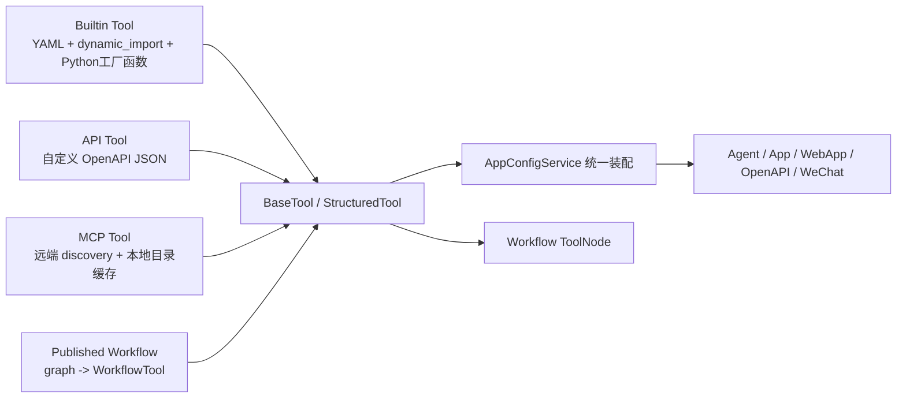

# 工具与外部能力

这一篇只看工具层和外部能力接入层。

这里真正要解决的不是“支持多少种插件”，而是几种完全不同来源的能力，怎样被压成同一批运行时对象，再被 Agent、Workflow、WebApp、OpenAPI 和微信入口一起复用。

> 适合谁读：已经看过 Agent 主链，接下来想知道运行时里的 Tool、API、MCP、Workflow 能力到底怎样汇到一起的人。
>
> 读前建议：先读 [Agent 运行时与记忆机制](./agent-runtime-and-memory.md)，再看这一篇会更容易把工具层挂回主链。

## 先建立阅读坐标

- 这篇在主线里的位置：第四篇，用来回答“外部能力怎样统一进入平台运行时”。
- 带着这三个问题读：
  1. 为什么平台统一的是运行时接口，而不是存储结构。
  2. Builtin Tool、API Tool、MCP Tool、Workflow Tool 为什么可以并存。
  3. 为什么同一套工具装配链必须被 Agent、Workflow 和多入口一起复用。
- 先记住的对象：`BaseTool`、`StructuredTool`、`MCPManagedTool`、`WorkflowTool`。
- 如果时间有限，优先看：整条闭环、第 1 节、第 5 节、第 7 节和第 9 节。

## 先看整条闭环



这条链里有几个固定边界：

1. 工具来源并没有被强行统一。
2. 统一的是 `args_schema` 和 `BaseTool` 运行时接口。
3. 平台配置里只保存“引用关系”，不直接保存工具实例。
4. 调试、正式运行、Workflow 节点调用，尽量走同一套实例化逻辑。

## 1. 先把能力来源拆开

这个仓库里，工具和外部能力至少有四种来源：

| 来源 | 资产形态 | 存储位置 | 运行时落点 |
| --- | --- | --- | --- |
| Builtin Tool | YAML + Python 实现 | 仓库文件 | `BaseTool` |
| API Tool | 自定义 OpenAPI JSON + 拆分后的接口记录 | `ApiToolProvider / ApiTool` | `StructuredTool` |
| MCP Tool | MCP 服务配置 + discovery 后的工具目录 | `MCPServer / MCPTool` | `MCPManagedTool` |
| Workflow Tool | 已发布工作流图 | `Workflow.graph` | `WorkflowTool` |

真正写入应用配置的，不是这些工具的完整定义，而是一组轻量引用：

```json
{
  "type": "builtin_tool",
  "provider_id": "tongyi",
  "tool_id": "qwen_image_generation",
  "params": {
    "model": "qwen-image-max",
    "size": "1664*928"
  }
}
```

也就是说，运行时工具永远是“临时装配出来”的，不是直接把数据库或 YAML 原样当执行对象。

## 2. Builtin Tool 的核心不是 YAML，而是 YAML + dynamic_import + 工厂函数

内置工具这层最值得抄的地方，是它没有把“工具定义”和“工具实例化”揉在一起。

### 2.1 注册入口是 `providers.yaml`

`BuiltinProviderManager` 初始化时会先读取：

```python
providers_yaml_path = os.path.join(providers_path, "providers.yaml")
with open(providers_yaml_path, encoding="utf-8") as f:
    providers_yaml_data = yaml.safe_load(f)
```

`providers.yaml` 只负责注册 provider 的元数据，例如：

- `name`
- `label`
- `description`
- `icon`
- `background`
- `category`
- `available`

这里记录的是“平台里有哪些内置能力供应商”，不是具体工具实现。

### 2.2 provider 目录再拆成 `positions.yaml + <tool>.yaml + .py`

单个 provider 初始化时，会进入自己的目录，再读两层文件：

1. `positions.yaml`
   - 只负责工具顺序和清单
2. `<tool>.yaml`
   - 只负责工具元数据和可配置参数
3. `<tool>.py`
   - 只负责真正的 LangChain 工具实例化与执行逻辑

代码路径就是：

```python
positions_yaml_path = os.path.join(provider_path, "positions.yaml")
with open(positions_yaml_path, encoding="utf-8") as f:
    positions_yaml_data = yaml.safe_load(f)

for tool_name in positions_yaml_data:
    tool_yaml_path = os.path.join(provider_path, f"{tool_name}.yaml")
    with open(tool_yaml_path, encoding="utf-8") as f:
        tool_yaml_data = yaml.safe_load(f)

    self.tool_entity_map[tool_name] = ToolEntity(**tool_yaml_data)
    self.tool_func_map[tool_name] = dynamic_import(
        f"internal.core.tools.builtin_tools.providers.{self.name}",
        tool_name,
    )
```

这里的 `tool_func_map` 里放的不是工具实例，而是通过 `dynamic_import(...)` 动态导入进来的工厂函数。。

这一层动态导入很关键。

它意味着内置工具不是靠一串硬编码的 `if/else` 或显式注册表挂进去的，而是：

- `providers.yaml` 先声明有哪些 provider
- `positions.yaml` 再声明这个 provider 下有哪些 tool
- 每个 `<tool>.yaml` 提供工具元数据
- 最后按 `tool_name` 动态导入同名 Python 符号，挂进 `tool_func_map`

所以这里的运行时装配不是“读到 YAML 就能执行”，而是“YAML 负责描述，`dynamic_import` 负责发现，工厂函数负责实例化”。

### 2.3 为什么这里要用工厂函数

这层设计的关键点，是 `Provider.get_tool(tool_name)` 返回的是 Python 符号，也就是：

- `current_time`
- `gaode_weather`
- `qwen_image_generation`

这些函数在真正使用时才被调用：

```python
builtin_tool = self.builtin_provider_manager.get_tool(
    tool["provider"]["id"], tool["tool"]["name"]
)
tools.append(builtin_tool(**tool["tool"]["params"]))
```

所以 Builtin Tool 的真实形态是：

- YAML 负责注册和前端展示
- `dynamic_import` 负责把 YAML 里声明的工具名解析成 Python 符号
- Python 工厂函数负责实例化
- `params` 在实例化时注入

这比“YAML 直接描述整个执行对象”稳很多，因为工具参数可以随配置变化，实例可以按需重建。

### 2.4 YAML 和 Python 各自管什么

以 `tongyi/qwen_image_generation` 为例：

- `qwen_image_generation.yaml`
  - 定义 `label / description / params`
  - 这里的 `params` 会出现在前端配置面板里
- `qwen_image_generation.py`
  - 定义 `QwenImageGenerationTool`
  - 工厂函数 `qwen_image_generation(**kwargs)` 把 YAML 里的 `model / size` 注入到实例

也就是说，YAML 里的参数不是给调用阶段用的，而是给“工具实例构造阶段”用的。

这和 API Tool、MCP Tool 不一样。后两者的参数主要是调用参数；Builtin Tool 这里还多了一层“实例级配置”。

### 2.5 `args_schema` 怎么补齐

Builtin Tool 的调用参数并不写在 YAML 里，而是挂在 Python 工具上。

典型写法是：

```python
@add_attribute("args_schema", GoogleSerperArgsSchema)
def google_serper(**kwargs) -> BaseTool:
    return GoogleSerperRun(
        name="google_serper",
        description="...",
        args_schema=GoogleSerperArgsSchema,
        api_wrapper=GoogleSerperAPIWrapper(),
    )
```

`BuiltinToolService.get_tool_inputs()` 会直接反射这个 `args_schema`，把字段名、描述、必填状态提出来给前端。

所以内置工具其实有两套参数面：

1. YAML `params`
   - 实例配置参数
   - 给工具选择器和配置面板用
2. `args_schema`
   - 调用参数协议
   - 给 Agent / Workflow / 调试页用

这个拆分是合理的，不然“实例配置”和“调用输入”会混成一层。

### 2.6 分类和图标也走文件化注册

Builtin Tool 的分类没有写死在前端，而是走 `categories.yaml + icons/`：

- `categories.yaml` 定义 `category / name / icon`
- `BuiltinCategoryManager` 启动时把图标读进内存
- `BuiltinToolService.get_provider_icon()` 再从 provider `_asset/` 里读出真正的 provider 图标

所以 Builtin Tool 这层不是零散 hardcode，而是一套比较完整的文件资产系统。

## 3. API Tool 接的不是完整 OpenAPI，而是项目自己的窄协议

你提到“自定义简化的 OpenAPI 规范”，这块在代码里非常明确。

### 3.1 入口只接受 JSON 字符串

`ApiToolService.parse_openapi_schema()` 先做的不是 YAML 解析，而是：

```python
data = json.loads(openapi_schema_str.strip())
if not isinstance(data, dict):
    raise
```

所以这里接入的是一段 JSON 字符串，不是通用 OpenAPI 文件上传器。

### 3.2 实际支持的顶层结构非常窄

`OpenAPISchema` 只认三个顶层字段：

```python
class OpenAPISchema(BaseModel):
    server: str
    description: str
    paths: dict[str, dict]
```

也就是说，这里并没有实现完整 OpenAPI 3.x 的这些东西：

- `info`
- `components`
- `schemas`
- `securitySchemes`
- `requestBody` 的标准对象结构
- 响应体 schema

当前项目真正要的，只是“把一批 HTTP 接口压成平台工具”所需的最小集合。

### 3.3 只接受 `get/post`

`validate_paths()` 里只枚举了：

```python
methods = ["get", "post"]
```

所以当前 API Tool 不是任意 HTTP 方法导入器，至少这一版只支持：

- `get`
- `post`

`put / patch / delete` 这类方法没有进入运行时协议。

### 3.4 operation 级别也被裁得很小

每个接口最终只要求这些信息：

- `description`
- `operationId`
- `parameters`

其中 `operationId` 还必须全局唯一，因为它会直接落成平台里的工具名：

```python
name=method_item.get("operationId")
```

这说明这里不是“导入接口文档”，而是在“生成工具目录”。

### 3.5 参数协议是平台自定义的

参数对象也不是完整 OpenAPI Parameter Object，而是项目定义的一小套字段：

```json
{
  "name": "city",
  "in": "query",
  "description": "城市名",
  "required": true,
  "type": "str"
}
```

支持的位置只有：

- `path`
- `query`
- `header`
- `cookie`
- `request_body`

支持的类型只有：

- `str`
- `int`
- `float`
- `bool`

这套协议的本质，是“够平台把表单建出来、把 HTTP 请求发出去”，而不是“覆盖 OpenAPI 标准能力”。

### 3.6 校验后还会做一次结构归一化

`validate_paths()` 在校验完以后，不会保留原始结构，而是重组为 `extra_paths`：

```python
extra_paths[interface["path"]] = {
    interface["method"]: {
        "description": interface["operation"]["description"],
        "operationId": interface["operation"]["operationId"],
        "parameters": [...]
    }
}
```

这意味着：

1. 多余字段会被丢掉。
2. 平台之后消费的，已经不是原始 OpenAPI JSON，而是归一化后的最小协议。

### 3.7 落库时会拆成 provider 和 tool 两层

创建或更新 API Tool Provider 时，服务层会：

1. 先保存 `ApiToolProvider`
   - `name`
   - `icon`
   - `description`
   - `openapi_schema`
   - `headers`
2. 再按 `paths -> method -> operation` 逐条拆成 `ApiTool`
   - `name = operationId`
   - `url = server + path`
   - `method`
   - `parameters`

更新时还会先删掉旧的 `ApiTool` 再重建，而不是局部 merge。

这说明 API Tool 的数据库模型不是“接口文档存档”，而是“归一化后的工具目录”。

### 3.8 运行时会再转成 `StructuredTool`

真正执行时，`ApiProviderManager.get_tool()` 会做两步：

1. 根据 `parameters` 动态创建 Pydantic 模型
2. 把请求函数封成 `StructuredTool`

核心代码就是：

```python
return StructuredTool.from_function(
    func=self._create_tool_func_from_tool_entity(tool_entity),
    name=f"{tool_entity.id}_{tool_entity.name}",
    description=tool_entity.description,
    args_schema=self._create_model_from_parameters(tool_entity.parameters),
)
```

发请求时，再按 `in` 分类组装：

- `path` -> `url.format(...)`
- `query` -> `params=...`
- `request_body` -> `json=...`
- `header` -> 请求头覆盖
- `cookie` -> cookies

所以 API Tool 这层真正统一的，不是 OpenAPI 文本，而是 `ToolEntity -> StructuredTool` 这个中间表示。

## 4. MCP Tool 走的是“远端 discovery + 本地代理”路线

MCP 这层的实现和前两类不一样。平台不持有工具实现，只持有：

- 服务配置
- 发现下来的工具目录
- 一层运行时代理

### 4.1 `MCPServer` 存的是连接方式，不是工具代码

数据库里保存的 `MCPServer` 字段主要是：

- `transport`
- `url`
- `command`
- `args`
- `env`
- `headers`
- `timeout`
- `enabled`

对应两种传输方式：

- `stdio`
- `http`

这两个 transport 在 `CreateMCPServerReq` 里是硬校验的，不允许传别的值。

### 4.2 敏感配置会先加密再入库

这一层有个实现细节不能漏：MCP 的 `env` 和 `headers` 不是明文直接存库。

`MCPService._normalize_payload()` 会先调用：

- `MCPSecretCipher.encrypt_env(...)`
- `MCPSecretCipher.encrypt_headers(...)`

解密则发生在：

- `MCPRuntimeManager.build_server_config()`
- `GetMCPServerResp.pre_dump()`

默认使用 `MCP_SECRET_KEY`，没有的话退回 `JWT_SECRET_KEY` 派生 Fernet key。

所以这层不是“简单保存外部连接配置”，而是已经把基础敏感信息保护接进来了。

### 4.3 发现工具时会把远端目录落成本地 catalog

`MCPRuntimeManager.discover_tools()` 会连接远端 MCP Server，拿回一批 LangChain tool，然后转成 `MCPToolCatalog`：

```python
return MCPToolCatalog(
    name=tool.name,
    description=tool.description or "",
    input_schema=input_schema,
    raw_definition={
        "name": tool.name,
        "description": tool.description or "",
        "input_schema": input_schema,
    },
)
```

`MCPService` 在创建、更新、刷新服务时，会把这些 catalog 覆盖写入 `MCPTool` 表。

所以数据库里的 `MCPTool` 更像“目录缓存”，不是源数据。

### 4.4 运行时代理的核心是 `MCPManagedTool`

MCP 工具对上层暴露时，不会直接把远端 tool 对象塞出去，而是重新包装成 `MCPManagedTool`：

```python
class MCPManagedTool(BaseTool):
    def _run(self, *args: Any, **kwargs: Any) -> Any:
        return self._runtime_manager.execute_tool(
            server_config=self._server_config,
            tool_name=self._tool_name,
            parameters=kwargs,
        )
```

这说明：

1. 平台暴露的是代理对象。
2. 每次执行时仍然回到 `MCPRuntimeManager`。
3. MCP Tool 对平台来说，本质上是“托管调用入口”，不是“本地实现”。

### 4.5 参数 schema 仍然会被压平到平台统一协议

MCP 的输入 schema 来自远端 tool 的 JSON Schema，但进平台后还是会转成动态 Pydantic 模型：

```python
properties = schema.get("properties", {})
required_fields = set(schema.get("required", []))
...
return create_model(f"MCPToolArgs_{tool_catalog.name}", **fields)
```

所以哪怕来源是远端 discovery，落到上层依然还是统一的 `args_schema`。

## 补充：音频输入输出不是 Tool，但也是外部能力

看到这里很容易把“外部能力”直接等同成 `BaseTool`。

这个项目里并不是这样。语音输入输出就是另一条独立接入链：

- `/audio/audio-to-text`
- `/audio/message-to-audio`

它们不会进入 `get_langchain_tools_by_tools_config()`，也不会被 Agent 当作 Tool 调用，但同样属于平台对外暴露的外部能力层。

### 语音转文本走的是独立服务接口

语音转文本的入口是：

```python
bp.add_url_rule(
    "/audio/audio-to-text",
    methods=["POST"],
    view_func=self.audio_handler.audio_to_text,
)
```

`AudioToTextReq` 会先限制：

- 文件必传
- 大小不能超过 `25MB`
- 只接受 `webm/wav/mp3/flac/aac/ogg/m4a`

真正转换发生在 `AudioService.audio_to_text()`：

```python
api_key = get_api_key_for_provider("tongyi", account.id)
recognition = Recognition(
    model="paraformer-realtime-v2",
    format="wav",
    sample_rate=16000,
    callback=callback,
    api_key=api_key,
)
```

这一条链的实现要点是：

- 复用账号自己的 `tongyi` API Key
- 使用 DashScope 的 `paraformer-realtime-v2`
- 按 `3200` 字节分块推流给识别器
- 通过 callback 收集句末结果再拼回完整文本

所以这里不是“前端上传音频，后端顺手转文字”，而是一条正式的账号侧音频服务链。

### 文本转语音会回读应用配置和消息归属

文本转语音的入口是：

```python
bp.add_url_rule(
    "/audio/message-to-audio",
    methods=["POST"],
    view_func=self.audio_handler.message_to_audio,
)
```

这条链不会直接接收任意文本，而是根据 `message_id` 反查：

- `Message`
- `Conversation`
- `App`

然后再按消息来源决定读哪份配置：

- `InvokeFrom.DEBUGGER` -> `app.draft_app_config`
- `InvokeFrom.WEB_APP` -> `app.app_config`
- `InvokeFrom.SERVICE_API` -> 直接拒绝

核心逻辑就是：

```python
app_config = (
    app.draft_app_config
    if message.invoke_from == InvokeFrom.DEBUGGER
    else app.app_config
)
text_to_speech = app_config.text_to_speech
enable = text_to_speech.get("enable", False)
voice = text_to_speech.get("voice", "xiaoxiao")
```

通过这一步，TTS 已经和应用发布态、调试态、消息归属绑在一起了。

### TTS 运行时是“音色别名 -> Edge-TTS -> SSE 分块”

文本转语音真正执行时，还会走三步：

1. 先把业务音色别名映射成 Edge-TTS 的 voice 名称
2. 调 `edge_tts.Communicate(...)` 合成 mp3 字节流
3. 再把音频按 `1024` 字节切块，用 SSE 事件返回

输出协议不是一次性文件下载，而是：

- `tts_message`
- `tts_end`

每个 `tts_message` 都会带一段 base64 编码后的音频分片。

这说明语音播报在当前项目里更接近“消息播放通道”，不是单纯的附件生成接口。

### 语音能力现在是不对称接入

这一点如果不写，会把实现讲假。

当前 `speech_to_text` 和 `text_to_speech` 虽然都挂在 `AppConfig` 里，但后端接入方式并不对称：

- `speech_to_text`
    - 会出现在应用配置和 WebApp 信息里
    - 但 `audio_to_text()` 这条后端接口当前没有回读 `AppConfig`，也没有按 `speech_to_text.enable` 做强门禁
- `text_to_speech`
    - 会在 `message_to_audio()` 里按 `AppConfig` 真正校验 `enable/voice`
    - 还会区分 `DEBUGGER / WEB_APP / SERVICE_API`

所以这一版更准确的描述应该是：

- `speech_to_text` 现在更偏发布面能力开关
- `text_to_speech` 已经进入运行态权限和输出链路

### 4.6 目录和实例还有一层进程内缓存

`MCPRuntimeManager` 维护了 `_tool_cache`，cache key 是：

```python
f"{server_config.id}:{updated_at.isoformat()}"
```

配置变更、刷新、删除时会调用 `invalidate()` 清缓存。

这个点很重要，因为 MCP 工具发现是远端 IO，如果每次装配都重新扫一遍，运行时成本会很高。

## 5. 真正的平台统一点在装配层，不在存储层

三类工具之所以能成为平台公共能力，不是因为它们长得像，而是因为最后都要经过同一个装配入口。

### 5.1 App 配置里保存的是最小引用集

应用发布时，工具配置会被压成：

```python
tools=[
    {
        "type": tool["type"],
        "provider_id": tool["provider"]["id"],
        "tool_id": tool["tool"]["name"],
        "params": tool["tool"]["params"],
    }
    for tool in draft_app_config["tools"]
]
```

这个结构很关键，因为它说明平台配置层并不关心：

- Builtin Tool 来自哪个 `.py`
- API Tool 是从哪段 JSON 导入的
- MCP Tool 是通过 HTTP 还是 STDIO 发现的

配置层只保留最少引用信息，运行时再解析。

### 5.2 统一装配入口是 `get_langchain_tools_by_tools_config()`

真正的收口点就在 `AppConfigService`：

```python
def get_langchain_tools_by_tools_config(
    self, tools_config: list[dict]
) -> list[BaseTool]:
    tools = []
    for tool in tools_config:
        if tool["type"] == "builtin_tool":
            ...
        elif tool["type"] == "mcp_tool":
            ...
        else:
            ...
    return tools
```

这里统一的是“实例化结果”，不是“存储结构”。

装配结果会是一批可以直接交给 Agent 的 `BaseTool`。

### 5.3 同一套装配被多条入口复用

这不是只给 Debugger 用的一条辅助链。代码里至少有这些入口都在复用同一套工具装配：

- `AppService`
- `OpenAPIService`
- `WebAppService`
- `WechatService`

它们都会先调用：

```python
tools = self.app_config_service.get_langchain_tools_by_tools_config(
    app_config["tools"]
)
```

然后再补：

- 知识库检索工具
- 已发布 Workflow Tool

最后交给 Agent 运行。

这一步说明工具层已经不是页面级功能，而是平台级运行时依赖。

### 5.4 Workflow 里也能消费同一批外部能力

Workflow 的 `ToolNode` 虽然没有直接走 `AppConfigService`，但思路是一样的：

- `builtin_tool` -> `BuiltinProviderManager`
- `api_tool` -> `ApiProviderManager`
- `mcp_tool` -> `MCPRuntimeManager`

节点内部最终仍然只持有一个 `_tool: BaseTool`，然后统一执行：

```python
result = self._tool.invoke(inputs_dict)
```

这说明 Workflow 节点并没有自造第四套工具协议，而是复用了平台工具层已经统一好的运行时对象。

### 5.5 Workflow ToolNode 的一个实现边界

当前 `ToolNodeData.outputs` 会被强制重写成：

```python
VariableEntity(name="text", value={"type": VariableValueType.GENERATED})
```

也就是说，Workflow 里的工具节点虽然内部能调用不同来源的工具，但对工作流图暴露的输出面被统一收成一个 `text` 字段。

这是当前实现的一个取舍：

- 好处是节点协议简单
- 代价是工具结构化输出会先被压成字符串

## 6. 工作流也会反过来再变成一种工具

这篇虽然主要讲外部能力，但工具层在这个项目里还有一条反向流：

- 已发布 Workflow
- 再包装成 `WorkflowTool`
- 重新并入 Agent 的工具列表

入口是：

```python
def get_langchain_tools_by_workflow_ids(
    self, workflow_ids: list[UUID]
) -> list[BaseTool]:
    ...
    workflow_tool = WorkflowTool(
        workflow_config=WorkflowConfig(...)
    )
```

这意味着“工具层”在平台里并不只包含第三方能力，还包含平台内部重新发布出来的结构化能力。

从平台设计角度看，这很重要，因为它把：

- 原子工具
- 外部 API
- MCP 远端工具
- 已编排工作流

全部拉到了同一个能力层里。

## 7. 管理、调试和正式运行尽量复用一条路径

原文里提到“调试路径应尽量复用正式路径”，这点在代码里是成立的。

### 7.1 Builtin Tool

Builtin Tool 没有单独的“模拟调试器”。

前端能拿到的主要是：

- provider/tool 元数据
- 反射出来的 `inputs`
- provider 图标

真正调用时仍然要回到同一个工厂函数和工具实例。

### 7.2 API Tool

API Tool 的调试接口 `debug_api_tool()` 做的事情也不是 mock：

1. 查数据库里的 `ApiTool`
2. 用 `ApiProviderManager.get_tool(...)` 重新构造 `StructuredTool`
3. 直接 `tool.invoke(parameters)`

这和正式运行走的是同一条构造链，只是入口换成了调试接口。

### 7.3 MCP Tool

MCP Tool 调试时也直接走：

```python
self.mcp_runtime_manager.execute_tool(...)
```

不是另起一套测试协议。

### 7.4 这样做的价值

工具层最容易出问题的地方，不是工具函数本身，而是：

- 参数 schema 是否对齐
- 配置引用是否失效
- provider/tool 是否还能被找到
- 外部依赖是否还可用

所以这里复用正式装配链，比额外写一套“调试模拟逻辑”更稳。

## 8. 这一版实现的边界

把代码看完以后，工具与外部能力层的边界也比较清楚：

### 8.1 已经落地的部分

- Builtin Tool 已经形成文件化注册中心
- Builtin Tool 已经采用“YAML 元数据 + `dynamic_import` + Python 工厂函数”模式
- API Tool 已经有自定义 OpenAPI 窄协议和动态 `StructuredTool` 装配链
- MCP Tool 已经支持 `stdio/http` 双传输、目录发现、缓存和敏感配置加密
- 语音转文本和文本转语音已经有独立的账号侧服务接口
- 已发布 Workflow 已经能重新包装成工具
- App、WebApp、OpenAPI、WeChat 都在复用统一装配入口
- Workflow ToolNode 也能消费同一批外部能力

### 8.2 当前实现的限制

- API Tool 不是完整 OpenAPI 支持，只是一套够平台使用的最小协议
- API Tool 目前只支持 `get/post`
- API Tool 参数类型只支持几种基础类型
- Workflow 里的工具节点输出会被压成单一 `text`
- Builtin Tool 的调用参数 schema 主要依赖 Python `args_schema`，不是纯 YAML 自描述
- MCP 真正的工具实现不在本仓库，仓库里只有配置、目录缓存和运行时代理

## 9. 复现同类平台时可优先保留的边界

这篇最值得复用的，不是“三类工具支持”，而是下面几个边界：

1. 不要强行统一存储方式，统一运行时接口就够了。
2. Builtin Tool 最好拆成“YAML 注册中心 + `dynamic_import` + Python 工厂函数”，不要把实例定义硬写死在配置里。
3. API Tool 不一定非要全量支持 OpenAPI，先收窄成平台真正需要的最小协议更可控。
4. 远端工具接入最好先沉一层本地目录缓存和代理对象，不要让上层直接依赖远端原始对象。
5. 应用配置只保存工具引用，不保存执行对象。
6. 调试和正式运行尽量复用同一条装配链。
7. 已编排能力最好也能重新发布成工具，这样能力层才会闭环。

这个项目里的工具层，本质上不是“插件管理页面”，而是“多来源能力统一接入、统一装配、统一执行”的平台底座。只要这层立住，Agent、Workflow 和多入口发布能力才能真正复用同一套外部能力体系。

## 10. 这一篇先记住什么

1. 平台不需要强行统一每种能力的存储结构，但必须统一运行时接口。
2. Tool 配置里保存的应该是引用关系，而不是执行对象。
3. 工具层的真正价值不在“支持了几类工具”，而在“同一套能力能不能被 Agent、Workflow 和多入口一起复用”。

## 下一篇建议读什么

- [知识库与检索链路](./knowledge-base-and-retrieval-pipeline.md)：看知识库为什么最终也要被压成运行时能力，而不是停留在后台数据层。
