# Workflow 编排引擎

这一篇只看 Workflow 这一条执行链：前端画布保存下来的 DSL 怎么进后端，后端怎么把它校验成正式图结构，节点之间怎么传状态，代码节点又是怎么隔离执行的。

这里要先把位置摆正。Workflow 不是 Agent 页面里的一个附属功能，它本身就是平台的第二条正式执行内核。

## 先看闭环

```mermaid
flowchart LR
    A["前端 DSL / draft_graph JSON"] --> B["update_draft_graph"]
    B --> C["宽校验 _validate_graph"]
    C --> D["draft_graph 落库"]
    D --> E["debug_workflow"]
    E --> F["WorkflowConfig 严格校验"]
    F --> G["Workflow._build_workflow()"]
    G --> H["StateGraph(WorkflowState)"]
    H --> I["SSE 节点流 / WorkflowResult"]
    I --> J["publish_workflow"]
    J --> K["graph 发布图"]
    K --> L["AppConfigService 再包装成 Tool"]
```



这条链里有五个固定边界：

1. 编辑态资产是 `draft_graph`，运行态资产是 `graph`。
2. 保存草稿时走宽校验，调试和发布时走严格校验。
3. 前端维护的是平台 DSL，不是 LangGraph 对象。
4. 节点之间通过 `WorkflowState` 共享状态，不是直接互调。
5. 代码节点不在应用进程里执行，而是走外部沙箱。

## 1. DSL 入口和资产边界

工作流的数据库模型很简单，但边界很清楚：

| 字段 | 作用 |
| --- | --- |
| `draft_graph` | 编辑态草稿图 |
| `graph` | 发布后的运行图 |
| `is_debug_passed` | 最近一次草稿是否调试通过 |
| `status` | `draft / published` |

对应的后端入口也很直接：

- `POST /workflows/<id>/draft-graph`：保存草稿图
- `GET /workflows/<id>/draft-graph`：读取草稿图
- `POST /workflows/<id>/debug`：基于草稿图调试
- `POST /workflows/<id>/publish`：把草稿图冻结成运行图

这个仓库没有把前端画布代码放进来，所以从代码库里能看到的“前端 DSL 边界”，就是 `WorkflowHandler.update_draft_graph()` 接收的这份 JSON：

```python
draft_graph_dict = request.get_json(force=True, silent=True) or {
    "nodes": [],
    "edges": [],
}

self.workflow_service.update_draft_graph(
    workflow_id, draft_graph_dict, current_user
)
```

也就是说，前端真正提交给后端的协议就是：

```json
{
  "nodes": [...],
  "edges": [...]
}
```

后端再把这份 JSON 翻译成真正可执行的工作流配置。

读取草稿时还有一个反向适配动作。`WorkflowService.get_draft_graph()` 不只是把 `draft_graph` 原样吐回去，还会给部分节点补展示用 `meta`：

- `tool` 节点会补 provider、tool、icon、params 等展示信息
- `dataset_retrieval` 节点会补知识库名称、图标、描述

也就是说：

- 库里存的是偏执行的 DSL
- 返回给画布的是“执行 DSL + 展示元数据”

这能让前端画布少做一轮额外 join。

## 2. 这份 DSL 长什么样

从后端模型看，这套 DSL 的最小骨架只有两类对象：

- `nodes`
- `edges`

边的数据结构很薄：

```python
class BaseEdgeData(BaseModel):
    id: UUID
    source: UUID
    source_type: NodeType
    target: UUID
    target_type: NodeType
    condition: Optional[str] = None
```

节点则先走一个统一基类：

```python
class BaseNodeData(BaseModel):
    id: UUID
    node_type: NodeType
    title: str = ""
    description: str = ""
    position: Position = Field(default_factory=lambda: {"x": 0, "y": 0})
```

真正的 DSL 差异来自各个节点自己的扩展字段：

- `StartNodeData.inputs`
- `EndNodeData.outputs`
- `LLMNodeData.prompt / model_config / inputs / outputs`
- `CodeNodeData.code / inputs / outputs`
- `DatasetRetrievalNodeData.dataset_ids / retrieval_config / inputs`
- `ToolNodeData.type / provider_id / tool_id / params / inputs`

这里有两个实现细节值得记：

1. DSL 字段名和运行时字段名不总是一一对应。
   - 例如 `LLMNodeData` 内部字段叫 `language_model_config`，但 DSL 里仍然用 `model_config`
   - `ToolNodeData` 内部字段叫 `tool_type`，但 DSL 里用 `type`
2. 这套别名转换是在 Pydantic 节点模型层吃掉的，前端不用理解后端内部命名。

这也是“前端 DSL 不直接暴露底层编排对象”的具体体现。

## 3. 草稿保存不是严格编译，而是宽校验

`WorkflowService.update_draft_graph()` 不会在每次保存时就强制要求整张图完全可运行。它先做的是 `_validate_graph()`。

这层校验比较宽，目标是让画布编辑过程能持续保存：

1. 逐个节点按 `node_type -> NodeDataClass` 实例化。
2. 节点校验失败就 `continue`，不让整次保存失败。
3. 节点 `id`、`title` 必须唯一。
4. `start` 和 `end` 在草稿态也只允许各一个。
5. `dataset_retrieval` 节点会把不属于当前账号的 `dataset_ids` 剔掉。
6. 边必须能对上 source/target 节点和类型。
7. 重复边会被去掉。

最后落库的不是原始 JSON，而是一份清洗后的 `draft_graph`。

这个设计很实用，因为前端画布编辑过程经常会出现中间态：

- 节点刚拖出来，还没填完整配置
- 边刚删了一半
- 知识库节点里还残留已删除的数据集

如果每次保存都直接走严格拓扑校验，画布体验会很差。

### 3.1 为什么 position 改动不重置调试状态

保存草稿时还做了一件事：区分“只是拖了位置”还是“改了执行语义”。

`_is_only_position_changed()` 会把所有节点的 `position` 去掉后再做 JSON 对比。只有在非坐标字段发生变化时，才会把 `is_debug_passed` 重置成 `False`。

这意味着：

- 调整布局不影响发布门禁
- 改 prompt、改边、改节点引用这些真正影响执行语义的变更，必须重新调试

## 4. 严格编译发生在 WorkflowConfig

真正的运行门禁在 `WorkflowConfig`。

无论是调试，还是发布前的二次校验，后端最终都会把 `nodes + edges` 组装成：

```python
WorkflowConfig(
    account_id=...,
    name=workflow.tool_call_name,
    description=workflow.description,
    nodes=workflow.draft_graph.get("nodes", []),
    edges=workflow.draft_graph.get("edges", []),
)
```

`WorkflowConfig` 的校验比 `_validate_graph()` 严得多，至少做了下面几层：

### 4.1 图结构约束

- `name` 必须匹配 `^[A-Za-z_][A-Za-z0-9_]*$`
- `description` 不能为空且长度不超过 1024
- `nodes`、`edges` 不能为空
- 节点 `id`、`title` 必须唯一
- 边 `id` 必须唯一
- `source/source_type/target/target_type` 必须和节点表对得上
- 同一 `source + target` 边不能重复

### 4.2 起点终点约束

- 图中必须有且只有一个 `start`
- 图中必须有且只有一个 `end`
- 从入度和出度角度看，唯一入度为 0 的节点必须是 `start`
- 唯一出度为 0 的节点必须是 `end`

### 4.3 图可执行性约束

- 用 BFS 校验整张图联通，不能有孤立节点
- 用 Kahn 拓扑排序校验无环

这两步说明当前 Workflow 是明确按 DAG 做的，不支持循环边和 while/for 这类控制流。

### 4.4 输入引用约束

这一层是工作流能不能稳定运行的关键。

后端会先基于边构造逆邻接表，然后用 DFS 把某个节点的全部前置祖先节点找出来。接着校验每个 `VariableEntity` 里的引用值：

- `ref_node_id` 必须出现在当前节点的祖先集合里
- `ref_var_name` 必须真的是被引用节点公开出来的输入或输出变量

这里不是只允许引用“直接父节点”，而是允许引用“任意上游祖先节点”。

这对前端画布很重要。因为一条链拉长之后，后面节点不需要强制再插一个中转节点，仍然可以直接引用更早节点的输出。

## 5. 真正编译成可执行图时发生了什么

`Workflow._build_workflow()` 才是 DSL 到运行图的真正转换点。

它先创建：

```python
graph = StateGraph(WorkflowState)
```

然后按 `NodeType -> NodeClass` 把每个节点实例化进图里。编译后的运行时节点名不是原始 UUID，而是：

```python
node_flag = f"{node.node_type.value}_{node.id}"
```

这个命名有两个作用：

1. 让 LangGraph 里的节点名天然带上类型前缀，避免冲突。
2. 调试流返回 chunk 时，前端拿到的 key 也能直接看出节点类型。

不同节点在编译阶段拿到的依赖也不同：

- `LLMNode`、`IntentClassifierNode` 会注入 `account_id + flask_app`
- `DatasetRetrievalNode` 会注入检索服务相关上下文
- `CodeNode` 只拿节点配置，本地不持有执行沙箱

所以“前端 DSL 转后端编排图”不是一次简单的 JSON 反序列化，而是：

1. JSON 节点转 typed node data
2. typed node data 转具体 Node 实例
3. Node 实例再带依赖注入编进 `StateGraph`

## 6. 节点引用协议怎么落在 DSL 上

节点之间传值用的是 `VariableEntity`。

它有三种值类型：

- `literal`：字面量
- `ref`：引用别的节点
- `generated`：运行时生成

引用结构长这样：

```json
{
  "name": "source_text",
  "type": "string",
  "required": true,
  "value": {
    "type": "ref",
    "content": {
      "ref_node_id": "上游节点ID",
      "ref_var_name": "上游输出变量名"
    }
  }
}
```

开始节点和结束节点是这套协议的两个边界：

- `StartNodeData.inputs` 定义整个工作流的入参
- `EndNodeData.outputs` 定义整个工作流的最终出参

这也是为什么开始节点会直接决定工作流对外暴露成 Tool 时的调用协议。`Workflow._build_args_schema()` 就是从 `start.inputs` 动态生成 Pydantic `args_schema` 的。

## 7. 共享状态不是一份可变对象，而是 reducer 合并

这套 Workflow 运行时共享状态长这样：

```python
class WorkflowState(TypedDict):
    inputs: Annotated[dict[str, Any], _process_dict]
    outputs: Annotated[dict[str, Any], _process_dict]
    node_results: Annotated[list[NodeResult], _process_node_results]
    intent_condition: str
```

对应的 reducer 很简单：

- `_process_dict(left, right)`：字典合并，右值覆盖左值
- `_process_node_results(left, right)`：列表拼接

这意味着节点之间共享数据不是靠“改全局变量”，而是靠“每个节点返回自己的状态增量，再由 LangGraph 合并”。

### 7.1 Start 节点

`StartNode.invoke()` 会从 `state["inputs"]` 提取入参，做必填校验，然后把结果写进自己的 `NodeResult.outputs`。

这里有两个结果：

1. 工作流入参被标准化成开始节点的输出
2. 下游节点以后引用开始节点，本质上就是引用 `start` 的输出变量

### 7.2 中间节点

大部分中间节点的调用模式都一样：

1. 先调用 `extract_variables_from_state(self.node_data.inputs, state)`
2. 得到本节点真正的入参字典
3. 执行业务逻辑
4. 把结果写进 `NodeResult.outputs`

`extract_variables_from_state()` 的实现也很直白：

- 对 `literal`，直接做类型转换
- 对 `ref`，去 `state["node_results"]` 里找 `ref_node_id`
- 找到以后，再从那个节点的 `outputs[ref_var_name]` 里取值

所以共享状态真正的中心不在 `outputs` 顶层字段，而在不断累积的 `node_results`。

### 7.3 End 节点

`EndNode.invoke()` 是唯一一个会把结果真正写回顶层 `outputs` 的节点：

```python
return {
    "outputs": outputs_dict,
    "node_results": [
        NodeResult(...)
    ],
}
```

也就是说：

- 中间节点主要负责把结果沉淀到 `node_results`
- 结束节点负责把要对外暴露的字段重新挑出来，组装成最终输出

## 8. 条件分支和并行汇聚是两套语义

当前实现里，普通边和条件边不是一回事。

### 8.1 条件边

如果 `edge.condition` 有值，这条边就会被收进 `conditional_edges_map`。

编译时会给这类 source node 注册 `add_conditional_edges(...)`，条件函数长这样：

```python
def condition_func(state: WorkflowState) -> str:
    intent = state.get("intent_condition", "")
    for edge in edges_list:
        if edge.condition == intent:
            return edge.condition
    if edges_list:
        return edges_list[0].condition
    return "__end__"
```

这里有个实现边界要写清：

- 条件路由读的是 `state["intent_condition"]`
- 当前内置节点里，负责写这个字段的是 `IntentClassifierNode`

也就是说，这一版 Workflow 的条件分支本质上是“意图识别结果驱动的条件路由”。

### 8.2 普通边和 fan-in

普通边会先按 target 分组。

如果某个 target 有多个 source，后端会区分两种情况：

1. 来源里包含条件分支目标节点
   - 给每个 source 单独加一条边
   - 语义是“任一被选中的分支执行完即可继续”
2. 来源都是普通并行节点
   - 用 `graph.add_edge(source_nodes, target_node)`
   - 语义是 fan-in，必须等所有上游都完成

这一步避免了一个很常见的错误：把“条件路由后的汇聚”和“真正的并行汇聚”混成同一种连线语义。

## 9. 代码节点的安全边界

用户最容易误解的地方就在这里。

这个项目里的代码节点不是本地 `exec`，也不是当前仓库里自带 Docker 沙箱。当前实现选的是腾讯云 SCF。

### 9.1 本地只做 AST 预校验

`CodeNode.invoke()` 在真正执行前，只做一层快速格式校验：

- 代码必须能通过 `ast.parse`
- 代码里只能出现函数定义
- 只能有一个 `main`
- `main` 必须只有一个参数，且参数名只能是 `params`
- 不允许定义其他函数
- 不允许有任何顶层语句

这层校验的目的不是安全隔离，而是尽量在本地拦掉明显无效的代码，避免每次都把坏请求打到远端执行器。

### 9.2 真正执行发生在外部云函数

本地校验通过后，代码会交给 `TencentSCFService.invoke_function()`：

```python
scf_result = scf_service.invoke_function(
    code=self.node_data.code, params=inputs_dict, timeout=30
)
```

服务层会从配置里读取：

- `TENCENT_SECRET_ID`
- `TENCENT_SECRET_KEY`
- `TENCENT_SCF_REGION`
- `TENCENT_SCF_NAMESPACE`
- `TENCENT_SCF_FUNCTION_NAME`

默认函数名就是 `code-executor`。

调用方式也是同步请求：

```python
req.InvocationType = "RequestResponse"
event_data = {"code": code, "params": params, "timeout": timeout}
req.ClientContext = json.dumps(event_data)
resp = self.client.Invoke(req)
```

从这条链可以明确两件事：

1. 当前仓库里的应用进程不会直接执行用户代码。
2. 真正的沙箱运行时不在这个仓库里，而是在外部配置的腾讯云函数里。

### 9.3 结果协议也被收得很死

云函数执行返回后，本地还会再做一层协议校验：

- `main` 的返回值必须是一个字典
- 只从这个字典里提取当前节点声明过的 `outputs`
- 没返回的字段会回退到对应类型默认值

这和前面提到的 `VariableEntity` 协议是一致的。代码节点不会偷偷扩展自己的输出面。

### 9.4 “支持的标准库”写在哪里

这个仓库里能看到的标准库提示，主要写在内置 Workflow 模板的 code 节点描述里，例如：

- `re`
- `datetime`
- `json`
- `Counter`
- `defaultdict`

但要注意，这只是模板层对用户的使用约束提示。真正的白名单和运行时限制不在这个仓库里，而应该落在外部的 `code-executor` 云函数实现中。

复现同类平台时，代码节点执行一般有两种做法：

1. 继续走云函数 / 云沙箱模式
2. 自己换成 Docker 沙箱执行器

但当前这份平台代码，实际落地的是第一种，不是第二种。

## 10. 调试链和状态沉淀

`WorkflowService.debug_workflow()` 是这条执行链的调试入口。它做了四件事：

1. 用 `draft_graph` 实例化一份 `WorkflowTool`
2. 创建 `WorkflowResult` 记录，状态先写 `running`
3. 调用 `workflow_tool.stream(inputs)` 流式跑图
4. 把每个节点的 `NodeResult` 逐条通过 SSE 发给前端

调试流里的 chunk 结构本来是：

```python
{"node_name": WorkflowState}
```

服务层会取出每次 chunk 的第一个 `node_result`，转成字典后：

- 通过 `event: workflow` SSE 发给前端
- 追加到 `node_results`
- 最终落到 `WorkflowResult.state`

这个设计有两个好处：

1. 前端能看到节点级调试过程，不用等整张图跑完。
2. 数据库存的是节点执行轨迹，而不是只有最终输出。

调试完全成功后，`is_debug_passed` 才会被置成 `True`。

## 11. 发布门禁和运行图冻结

发布动作并不复杂，但门禁很硬。

### 11.1 发布前提

`publish_workflow()` 先检查：

- `workflow.is_debug_passed` 必须为 `True`

不满足直接拒绝发布。

### 11.2 发布前还会再做一次严格校验

即使调试通过，发布前也会再跑一次 `WorkflowConfig(...)`。如果这一步失败：

- 工作流不会发布
- `is_debug_passed` 会被重新打回 `False`

也就是说，发布真正依赖的是“最新草稿图仍然能严格通过编译”，不是“某次历史调试通过过”。

### 11.3 发布结果

通过后，后端做的动作很少：

- `graph = draft_graph`
- `status = published`
- `is_debug_passed = False`

这样编辑态和运行态就彻底分开了：

- 调试永远用 `draft_graph`
- 正式运行永远用 `graph`

## 12. 工作流怎么再变回 Tool

Workflow 不是只供画布页面自己运行。发布后的工作流还会被重新包装成 `BaseTool`。

入口在 `AppConfigService.get_langchain_tools_by_workflow_ids()`：

1. 只查询 `status == published` 的工作流
2. 把 `workflow_record.graph` 再组装成 `WorkflowConfig`
3. 包成 `WorkflowTool`
4. 挂到 Agent 或 App 的工具列表里

这里用的名字还会统一加前缀：

```python
name=f"wf_{workflow_record.tool_call_name}"
```

这一步很关键，因为它说明平台能力层已经打通了：

- Agent 可以调用 Workflow
- Workflow 内部也可以继续调用 Tool、LLM、知识库节点

这样工作流就不只是“一个页面上的流程图”，而是真正进入平台能力编排层。

## 13. 这一版 Workflow 内核的实现边界

把代码看完以后，这套实现的边界也比较清楚：

### 13.1 已经落地的部分

- 前端 DSL 和运行时图结构是分离的
- 草稿态和发布态是分离的
- 保存草稿走宽校验，调试/发布走严格校验
- 图必须是 DAG
- 变量引用支持任意上游祖先节点
- 条件路由和并行 fan-in 是两套边语义
- 节点结果会流式输出并持久化
- 代码节点走外部云函数隔离执行
- 已发布 Workflow 可以重新包装成 Tool

### 13.2 当前实现的限制

- 当前分支条件依赖 `intent_condition`，本质上是意图识别驱动
- 代码节点沙箱运行时不在仓库内，仓库里只有客户端和本地 AST 预校验
- 当前不支持循环图
- 当前没有把前端画布实现放进这个仓库，仓库里能看到的是后端 DSL 协议和编译链

## 14. 复现同类平台时可优先保留的边界

这一篇最值得复用的不是 LangGraph 本身，而是这几个边界：

1. 先定义平台 DSL，不要让前端直接操作底层图对象。
2. 草稿保存和严格编译拆开做。
3. 变量引用协议要显式带 `ref_node_id + ref_var_name`。
4. 共享状态要通过 reducer 合并，不要靠节点之间直接互相调用。
5. 代码执行一定要出应用进程，最少也要抽成独立执行器接口。
6. 发布图和编辑图必须分开。
7. 已发布工作流最好还能重新挂回工具体系。

这份 Workflow 实现的核心不在“可视化画布”，而在“把一份 DSL 稳定编译成可运行 DAG，再把这张 DAG 重新纳入平台能力层”。这一层立住了，前端拖拽页面才有意义。
