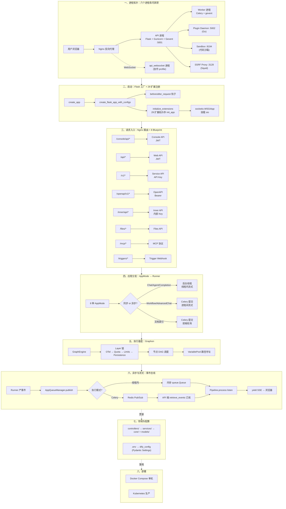
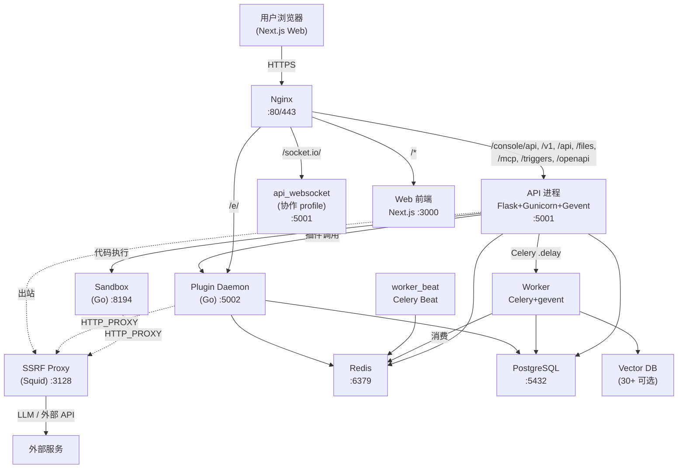
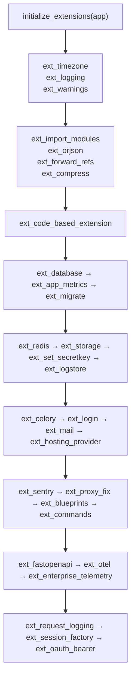
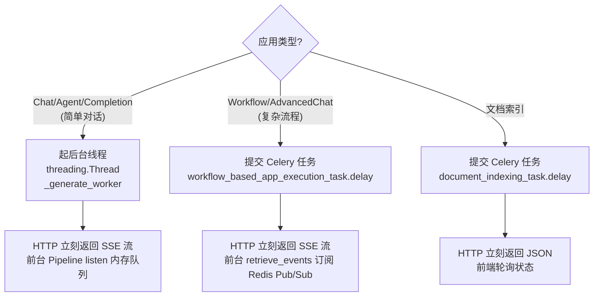
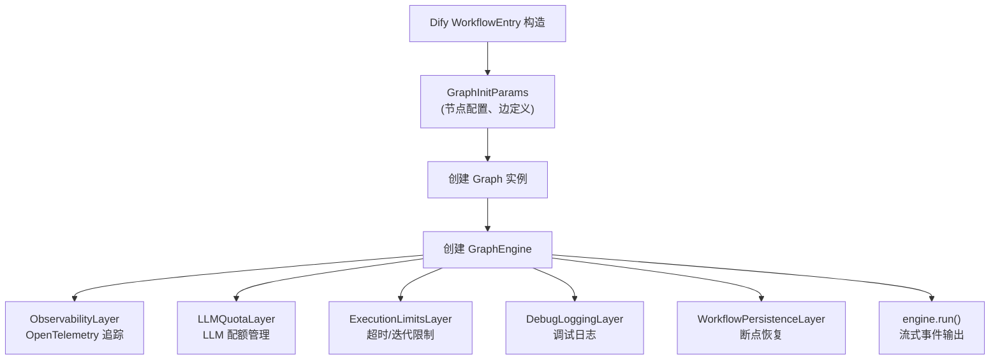
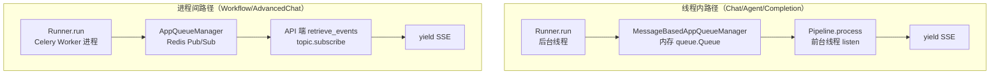
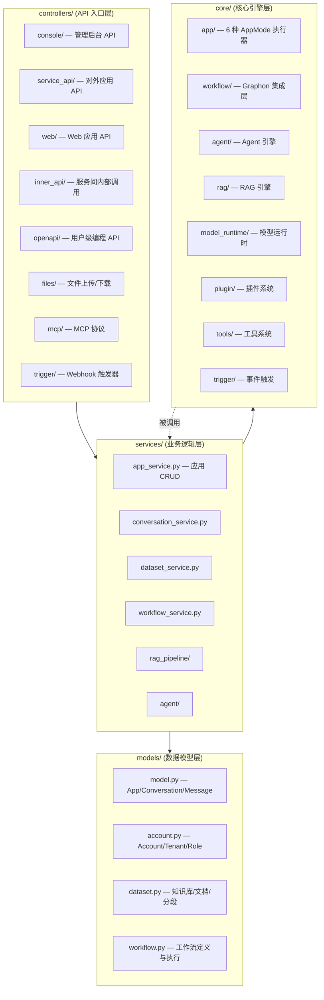
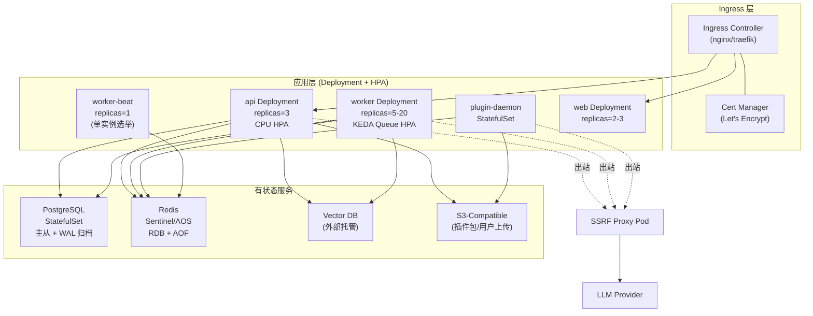

# Dify 整体架构概览

> **本章目标**：理解 Dify 的系统拓扑、技术选型、部署架构，以及一个请求从用户输入到 LLM 响应的完整数据流。
>
> **读完本章你应该能回答**：
> - Dify 由哪些核心进程组成？它们之间如何协作（同步 vs 异步）？
> - 一次 HTTP 请求从浏览器进入，到 LLM 流式响应返回，经历了哪些服务和层？
> - 为什么 Dify 把 API 和 Worker 拆成两个进程，而不是合在一起？
> - Flask 应用工厂模式的 `create_app()` 做了什么？为什么扩展要按固定顺序注册？
> - 同步路径（直接流式）和异步路径（Celery 任务）分别在什么场景下被选用？
> - Graphon 在 Dify 中扮演什么角色？为什么说它是"Workflow 和 Agent 共同的事实标准执行引擎"？
> - 配置体系是如何分层的？`.env` 文件、`dify_config`、部署模板这三者是什么关系？
> - 横向对比 LangChain / LlamaIndex / LangGraph，Dify 的差异化定位是什么？

## 本章要解决的问题

Dify 要回答的工程问题是：**一个 LLM 应用平台要同时支持 Chat / Agent / Workflow / RAG 四种形态，还要多租户、可扩展（30+ 模型运行时 + 30+ 向量库 + 插件生态）、可观测，怎么把这些揉进一个系统而不失控？** 一次用户请求从浏览器到 LLM 流式响应，跨了 Nginx、API 进程、Worker 进程、Plugin Daemon、向量库、模型提供商六类组件——如果没有清晰的架构分层，Dify 会变成一个无法演进的巨石。

具体来说，这套系统同时面对三对矛盾。第一对：**同步流式 vs 异步耗时**——LLM 调用要逐 token 推给前端（毫秒级延迟），但文档索引和工作流执行是大块 CPU+IO 密集工作（分钟级）；如果都塞进一个进程，一个慢工作流会卡死所有正在等待流式响应的用户。第二对：**开放扩展 vs 安全隔离**——平台要支持 30+ 模型提供商和用户自定义插件，但插件代码不可信，不能让它在主进程里直接跑。第三对：**可视化低代码 vs 引擎可复用**——业务团队要拖拽搭应用，但底层执行引擎必须能被 HTTP 请求和 Celery 任务两种方式调用，否则同步和异步两条路径就要各写一遍。

Dify 的解法是**进程级分工 + Flask 工厂扩展注册 + Graphon 统一执行基底 + 事件总线解耦流式**：API 进程只做同步快任务，慢任务交 Celery Worker；不可信代码（插件、用户代码）进独立进程（Plugin Daemon / Sandbox）；所有"复杂执行路径"（Workflow、Agent、Chatflow）最终都收敛到 Graphon 图执行引擎；后台执行引擎产出的 token/节点事件经 `AppQueueManager` 队列解耦，前台 Pipeline 消费转 SSE。这套架构坏了，加一个模型要改十处代码，一个慢索引卡死全站对话，插件漏洞直接打穿主进程。

本章是全系列综述，沿"一次请求的端到端生命周期"展开，自然串起 02-16 各章。

## 宏观架构：一次请求的端到端生命周期

下图是一次用户请求从浏览器到 LLM 流式响应返回的完整生命周期，也是全文的叙事主线——后续每一节对应生命周期的一个阶段。



理解这张图的关键：**API 进程不做重活，所有复杂执行路径最终都收敛到 Graphon，事件总线把"生产 token"和"推送 SSE"解耦**。后续八节按这八个阶段逐层展开，每节回答"这一层为什么存在、坏了会怎样"。

## 一、进程拓扑：为什么是六个进程而不是一个

**这一节为什么存在**：Dify 看起来像一个 Docker 镜像，实际由六个职责不同的进程组成。不理解进程边界，就无法理解同步/异步分流、安全隔离、水平扩展这些后续决策。

Dify 的第一个架构决策就是**API 进程 / Worker 进程分离**。理由很直接：LLM 流式响应需要低延迟（毫秒级返回第一个 token），但文档索引是大块 CPU+IO 密集工作（可能跑几分钟）；HTTP 请求受 Nginx 60s 超时约束，而工作流执行可能持续更久。如果两类负载在同一进程，一个慢工作流就会占满 Gunicorn worker，导致其他用户的流式响应卡住。所以 API 进程只处理需要低延迟返回的同步请求；任何可能超过 1 秒的任务（文档索引、工作流执行、批量数据处理）都通过 Celery 提交给 Worker。

整个系统拓扑如下（基于 `docker/docker-compose.yaml`）：



这张图揭示了几个关键设计：

**1. Redis 是消息总线，不是单纯缓存。** API、Worker、Plugin Daemon 三个进程都连 Redis，但用途不同——API 用它做会话缓存和速率限制，Worker 用它消费 Celery 任务，Plugin Daemon 用它做插件调用的事件通道。Redis 是 Dify 的"实时数据流主干"。

**2. 所有出站请求强制走 SSRF 代理。** Sandbox 通过标准 `HTTP_PROXY`/`HTTPS_PROXY` 环境变量指向 `ssrf_proxy:3128`（docker-compose.yaml:513-514）；API 进程通过应用层 `dify_config.SSRF_PROXY_*_URL` 配置 `httpx` 代理挂载（api/core/helper/ssrf_proxy.py:54-78）；Plugin Daemon 加入 `ssrf_proxy_network`，由 Go daemon 内部处理插件出站请求的代理。Squid 默认拒绝所有内网 IP 地址段，这是纵深防御——即使应用代码写错，也不会直接泄露内网资源（详见 [13-multi-tenancy-and-security.md](./dify-13-multi-tenancy-and-security.md)）。

**3. Plugin Daemon 是独立 Go 进程。** 为什么不做成 Python 库？因为插件运行时需要沙箱隔离（防止恶意插件破坏主进程），Go 的内存模型和进程管理比 Python 更适合做"宿主"。它和 API 之间通过 Redis 通信，API 把插件调用请求放到 Redis 队列，Plugin Daemon 消费并执行（详见 [08-model-providers-and-extensions.md](./dify-08-model-providers-and-extensions.md)）。

**4. WebSocket 有独立进程（可选）。** `api_websocket` 是一个带 `collaboration` profile 的独立服务（docker-compose.yaml:271-293），使用 `GeventWebSocketWorker`，专门处理 `/socket.io/` 路径的工作流协作编辑。Nginx 通过 `NGINX_SOCKET_IO_UPSTREAM`（默认 `api_websocket:5001`）路由（docker/nginx/conf.d/default.conf.template:17-25）。不开协作 profile 时，WebSocket 流量回退到 api 进程。

### 核心服务职责

| 服务 | 镜像 / 角色 | 关键能力 |
|------|------------|----------|
| **api** | `langgenius/dify-api:1.15.0` | Flask + Gunicorn + Gevent，处理所有 REST API 和 SSE 流式响应 |
| **api_websocket** | 同上（collaboration profile） | 专用 WebSocket 进程，处理工作流协作编辑 |
| **worker** | 同上（MODE=worker） | Celery Worker，gevent 池，消费文档索引、工作流执行、邮件等队列 |
| **worker_beat** | 同上（MODE=beat） | Celery Beat，触发周期性任务（清理过期数据、自动续期插件） |
| **web** | `langgenius/dify-web:1.15.0` | Next.js 应用，管理控制台 + 用户界面 |
| **plugin_daemon** | `langgenius/dify-plugin-daemon:0.6.3-local` | 独立 Go 服务，插件安装/加载/执行沙箱 |
| **sandbox** | `langgenius/dify-sandbox:0.2.15` | 代码执行沙箱（Workflow Code 节点、Agent 代码工具） |
| **ssrf_proxy** | Squid | 安全代理，阻断内网访问 |
| **nginx** | Nginx | 统一入口，HTTPS 终止、静态资源、WebSocket 升级 |
| **redis** | Redis | Celery broker + 会话缓存 + 限流 + 分布式锁 + Pub/Sub |
| **postgres** | PostgreSQL | 主数据库，所有业务数据 |
| **vector_db** | 可选 30+ | pgvector / Weaviate / Qdrant / Milvus 等 |

记住一个关键原则：**API 进程不做重活**。Worker 才是耗时任务的执行者。把所有请求都打到 API 进程是最常见的部署错误——会导致 LLM 流式响应阻塞文档索引、长时间任务超时、Worker 重启影响前端响应。

## 二、启动流程：Flask 工厂与 29 个扩展的拓扑序注册

**这一节为什么存在**：理解后端启动骨架，才能理解"横切关注点如何被拆分"，也才能在排查启动失败、扩展冲突、性能问题时快速定位。Dify 后端的入口在 `api/app_factory.py`。

### 工厂模式

Dify 用经典的 **Application Factory 模式**——`create_app()` 是一个函数而不是全局对象（app_factory.py:127）。这有两个好处：(1) 测试时可以创建多个隔离的应用实例；(2) 通过参数控制生产/开发/测试的不同配置。

```python
# app_factory.py:127-138
def create_app() -> tuple[socketio.WSGIApp, DifyApp]:
    start_time = time.perf_counter()
    app = create_flask_app_with_configs()
    initialize_extensions(app)

    sio.app = app
    socketio_app = socketio.WSGIApp(sio, app)

    end_time = time.perf_counter()
    if dify_config.DEBUG:
        logger.info("Finished create_app (%s ms)", round((end_time - start_time) * 1000, 2))
    return socketio_app, app
```

返回值是 `(socketio_app, flask_app)` 二元组——`socketio_app` 是外层 WSGI 应用（包装了 Flask app 和 SocketIO），由 Gunicorn 直接运行（`app:socketio_app`，见 entrypoint.sh:133）；`flask_app` 是内层 Flask 实例，供 Celery 等场景使用（app.py:52-54）。

### 29 个扩展按拓扑序注册

Dify 用 **Extension 注册机制**——把横切关注点（数据库、Redis、日志、迁移、Celery、邮件、Sentry、OTel、登录、代理等）拆成独立的扩展模块，按依赖顺序逐个 `init_app()`。为什么不在 `create_app()` 里全写完？因为 Dify 有 29 个扩展，全部塞进一个函数会让它膨胀到无法维护。



完整顺序见 app_factory.py:178-208。关键约束是**拓扑序**——每个扩展的 `init_app()` 会调用前序扩展提供的功能：

- `ext_celery` 需要拿到 `ext_redis` 的连接来配置 broker URL，所以 `ext_redis`（第 12 位）必须在 `ext_celery`（第 16 位）之前。
- `ext_storage` 需要 `ext_database` 加载的存储配置来决定用本地/S3/OSS，所以 `ext_database`（第 9 位）在前。
- `ext_login` 需要 `ext_database` 才能建用户表查询的 Session。
- `ext_logstore` 必须在 `ext_storage` 之后、`ext_celery` 之前（app_factory.py:193 注释明确写了 `Initialize logstore after storage, before celery`）。

这种链式依赖本质是拓扑序——必须先初始化 A 才能初始化 B。并行初始化会带来复杂的 race condition 处理，得不偿失。

> 注意：`api/extensions/` 目录下有 30 个 `ext_*.py` 文件，但 `initialize_extensions()` 注册的是 29 个。`ext_socketio` 不在列表里——它是一个模块级单例 `sio`，在 `create_app()` 中直接挂载（`sio.app = app` + `socketio.WSGIApp(sio, app)`，app_factory.py:14、app_factory.py:132-133）。29 个扩展的完整清单见附录 B。

### 条件加载与启动可观测

每个扩展通过 `is_enabled()` 方法支持**条件加载**（app_factory.py:209-221）：

```python
for ext in extensions:
    short_name = ext.__name__.split(".")[-1]
    is_enabled = ext.is_enabled() if hasattr(ext, "is_enabled") else True
    if not is_enabled:
        if dify_config.DEBUG:
            logger.info("Skipped %s", short_name)
        continue
    start_time = time.perf_counter()
    ext.init_app(app)
    end_time = time.perf_counter()
    if dify_config.DEBUG:
        logger.info("Loaded %s (%s ms)", short_name, round((end_time - start_time) * 1000, 2))
```

三个细节：

1. `is_enabled()` 让 `ext_sentry` 在没配 `SENTRY_DSN` 时不启用、`ext_mail` 在没配 SMTP 时不启用——避免"即使不用也要初始化"的浪费。
2. DEBUG 模式打印每个扩展的耗时，对启动性能调优非常关键——调试时一眼看出哪个扩展拖慢了启动。
3. **`before_request` 钩子承担双职责**（app_factory.py:59-96）：初始化每次请求的日志上下文（`init_request_context()` 注入 request_id、用户 ID）；企业版许可证校验（过期时 `UnauthorizedAndForceLogout`，白名单端点豁免）。许可证校验放 `before_request` 而不是单独中间件，是因为这是企业版特有功能——通过 `ENTERPRISE_ENABLED` 条件加载，比把所有可能特性都写进主请求管线干净。

## 三、请求入口：Nginx 反代与 8 个 Blueprint 的分层

**这一节为什么存在**：HTTP 请求进入后，首先要经过 Nginx 路由和 Flask Blueprint 分层。这一层决定了"哪些端点对应哪些认证方式和用途"，是理解 Dify 对外 API 体系的入口。

### Nginx 路由

Nginx 是统一入口，按路径前缀分流（docker/nginx/conf.d/default.conf.template）：

| 路径 | 上游 | 说明 |
|------|------|------|
| `/console/api/*` | `api:5001` | 管理后台 API |
| `/api/*` | `api:5001` | Web 应用 API |
| `/v1/*` | `api:5001` | 对外 Service API |
| `/openapi/*` | `api:5001` | 用户级编程 API |
| `/files/*` | `api:5001` | 文件上传/下载 |
| `/mcp/*` | `api:5001` | MCP 协议端点 |
| `/triggers/*` | `api:5001` | Webhook 触发器 |
| `/inner/api/*` | `api:5001` | 服务间内部调用 |
| `/socket.io/*` | `api_websocket:5001`（可回退 api） | WebSocket 升级 |
| `/e/*` | `plugin_daemon:5002` | 插件回调钩子 |
| `/*` | `web:3000` | Next.js 前端 |

### 8 个 Blueprint

Dify 的 API 通过 8 个 Flask Blueprint 分层，每个对应不同的认证方式和用途（ext_blueprints.py:27-120）：

| Blueprint | url_prefix | 认证 | 用途 |
|-----------|-----------|------|------|
| `console` | `/console/api` | 用户会话/JWT | 管理后台（应用配置、知识库、系统设置） |
| `web` | `/api` | 用户会话/JWT | Web 应用功能（对话、文件上传） |
| `service_api` | `/v1` | API Key | 对外暴露的应用服务 API |
| `openapi` | `/openapi/v1` | Bearer Token | 用户级编程 API（Device Flow OAuth） |
| `inner_api` | `/inner/api` | Inner API Key | 服务间内部调用（Worker→API、Plugin→API） |
| `files` | `/files` | 混合 | 文件上传/下载/预览 |
| `mcp` | `/mcp` | MCP 协议 | Model Context Protocol 标准端点 |
| `trigger` | `/triggers` | Webhook 签名 | 外部系统触发的 Webhook |

四层核心考虑：

- **Service API（`/v1`）是 Dify 的"对外产品"**：用 API Key 认证，任何持有合法 Key 的客户端都能调 `/v1/chat-messages`，不需用户登录——这是第三方系统集成 Dify 的入口。
- **Console API（`/console/api`）是运营管理**：用 JWT，只有登录的管理员能访问——操作知识库、修改应用配置、查看用量。
- **OpenAPI（`/openapi/v1`）是用户级编程接口**：用 Bearer Token + Device Flow OAuth，让外部程序以"用户身份"操作 Dify（运行应用、管理 DSL、管理工作区成员），比 Service API 权限粒度更细。受 `OPENAPI_ENABLED` 开关控制（ext_blueprints.py:47）。
- **Inner API 是集群内部**：用 Inner API Key，权限更大、只对内部网络暴露——例如 Worker 进程提交文档索引完成通知、Plugin Daemon 回调 API。
- **MCP 让 Dify 作为"工具提供方"接入外部 LLM**（详见 [12-mcp-protocol.md](./dify-12-mcp-protocol.md)）；**Trigger 让外部系统通过 Webhook 触发 Dify 工作流**（详见 [15-trigger-system.md](./dify-15-trigger-system.md)）。

这种分层让 Dify 在"自托管"和"SaaS 集成"两种场景下都能找到合适的入口——管理员用 Console API、终端用户用 Web API、第三方集成用 Service API、编程访问用 OpenAPI、内部系统用 Inner API、协议扩展用 MCP/Trigger。

## 四、应用分发：AppMode 与同步/异步路径抉择

**这一节为什么存在**：请求进入 Flask 后，下一步是"根据应用类型选 Runner、决定同步还是异步"。这一步的分支决策决定了请求走线程内流式还是 Celery 进程间流式——是理解整个执行架构的关键岔路口。

### 8 种 AppMode

`AppMode`（model.py:364-375）当前定义了 8 种：

| AppMode | 值 | 执行器 | 推理策略 |
|---------|-----|--------|---------|
| `COMPLETION` | `"completion"` | `CompletionAppRunner` | 单轮 LLM |
| `CHAT` | `"chat"` | `ChatAppRunner` | 单轮对话 LLM |
| `ADVANCED_CHAT` | `"advanced-chat"` | `AdvancedChatAppRunner` | 工作流封装的对话 |
| `WORKFLOW` | `"workflow"` | `WorkflowAppRunner` | Graphon DAG |
| `AGENT_CHAT` | `"agent-chat"` | `AgentChatAppRunner` | CoT/FC 推理循环 |
| `AGENT` | `"agent"` | — | 绑定 Agent 实体（v2） |
| `CHANNEL` | `"channel"` | — | 渠道发布 |
| `RAG_PIPELINE` | `"rag-pipeline"` | — | 知识库管道 |

每种 AppMode 对应一种"用法形态"：COMPLETION 是"我有 prompt 给我生成"，CHAT 是"对话聊天"，WORKFLOW 是"可视化编辑器搭的流程"，AGENT_CHAT 是"LLM 自己推理调用工具"。这种枚举式设计让所有形态共享一套配置（应用 ID、模型、知识库、API Key），但执行策略各自分化。配置如何从界面转换为后端配置对象，详见 [02-app-config-layer.md](./dify-02-app-config-layer.md)。

### 同步路径 vs 异步路径

AppMode 选好 Runner 后，下一个决策是**同步执行还是异步提交**：



为什么简单的直接同步、复杂的异步？两个理由：

1. **超时控制。** Nginx/Flask 默认请求超时 60s。一个有十几个节点的工作流完全可能跑超过这个时间。同步路径会被超时切断；异步路径不会——Celery 任务可以跑任意长，状态通过 WebSocket/SSE 增量推送。

2. **API 进程负载平衡。** 如果所有 Workflow/Agent 都让 API 进程同步执行，一个慢工作流就会把 API 进程的工作线程占满，其他用户的对话也会卡。异步路径让 Worker 进程承担重活，API 进程始终轻盈。

> 同步/异步路径的完整实现、`AppQueueManager` 的两种实现（内存 `queue.Queue` vs Redis Pub/Sub）、停止机制、断线恢复详见 [06-async-tasks-and-events.md](./dify-06-async-tasks-and-events.md)。

### 一次 Chat 请求的逐层流向

以最常见的 Chat 流程（同步路径）为例，逐层看每一步在做什么：

**第 1 步：Nginx 路由。** HTTPS 终止、路径前缀匹配（`/api/chat-messages` → Web API）。WebSocket 升级请求（`/socket.io/`）由 Nginx 反代到 api_websocket。

**第 2 步：Flask API 验证。** API Key 或用户会话解析（通过 `before_request` 钩子）、Pydantic 参数校验（消息内容、文件 ID、会话 ID）、加载 App 配置。

**第 3 步：应用服务层。** `app_service.get_app(app_id)` 返回 App ORM 实体，触发关联模型的懒加载——加载当前应用绑定的 LLM 模型凭证、知识库列表、工具配置。这一步往往触发多条 SQL 查询，是性能热点。

**第 4 步：对话应用层。** 根据 `AppMode`（这里是 `CHAT`）选择 `ChatAppRunner`，构建 `DifyRunContext`（包含用户输入、App 配置、当前会话），创建或获取 Conversation 实体。如果需要 RAG，先并发检索相关分段（详见 [10-rag-retrieval.md](./dify-10-rag-retrieval.md)）。

**第 5 步：提示词组装。** 把系统 Prompt、用户输入、检索到的分段、对话历史、工具调用约束（Agent 模式才有）组装成模型请求体。

**第 6 步：LLM 调用。** 通过模型运行时（`model_runtime`）切换到具体 LLM provider，发送流式请求。LLM 返回的 token 增量通过 SSE 推送到前端，前端逐字渲染。模型运行时的抽象层详见 [08-model-providers-and-extensions.md](./dify-08-model-providers-and-extensions.md)。

## 五、执行基底：Graphon 作为 Workflow 与 Agent 的共同内核

**这一节为什么存在**：Dify 的所有"复杂执行路径"——Workflow、Chatflow、Agent V2——最终都收敛到 Graphon 图执行引擎。不理解 Graphon 的定位，就无法理解为什么 Workflow 和 Agent 共享同一套可观测性、配额、超时控制能力。

Graphon 是 Dify 团队自研的图执行引擎（作为独立 pip 包发布，v1.15.0 锁定版本 `graphon==0.5.3`，声明于 `api/pyproject.toml`）。Dify 在 `api/core/workflow/` 和 `api/core/app/workflow/layers/` 下构建集成层。它负责：

- **DAG 拓扑排序与节点调度** — 把工作流的节点依赖图转成可执行序列
- **变量池（Variable Pool）管理** — 节点间共享数据的中央存储，路径寻址 `(node_id, variable_key)`
- **事件驱动的执行模型** — 每个节点开始/结束/出错都发出事件，UI 层和持久化层订阅
- **Layer 模式叠加横切关注点** — 每个 Layer 独立可插拔



**Layer 模式**是 Graphon 的关键设计。每个 Layer 是一个独立的横切关注点实现（Observability 负责埋点、LLMQuota 负责配额检查、ExecutionLimits 负责超时管控），它们都 wrap GraphEngine，在每个节点执行前后插入逻辑。好处：每个 Layer 独立可插拔、独立可测、横切关注点不污染核心引擎代码。

Dify 的 Workflow 和 Agent 都基于 Graphon：

- **Workflow** 用 Graphon 编排可视化节点（开始 → LLM → 知识检索 → 结束），详见 [11-workflow-engine.md](./dify-11-workflow-engine.md)。
- **Agent V2** 用 Graphon 编排推理循环（推理节点 → 工具执行节点 → 推理节点 → ... 直到推理完成），连接器是 `PluginAgentStrategy`（strategy/plugin.py），详见 [03-agent-runtime.md](./dify-03-agent-runtime.md)。

读到这里应该意识到：**所有"复杂执行路径"在 Dify 中最终都收敛到 Graphon**。这是为什么 Workflow 编辑器和 Agent 推理循环虽然看起来不同，但底层执行模型一致——可观测性、配额、超时这些能力天然复用，不需重复实现。新项目不应绕开 Graphon 直接调用 Runner。

## 六、异步与流式：Celery 提交与 AppQueueManager 事件总线

**这一节为什么存在**：HTTP 请求不能等慢任务完成，但用户要逐 token 看到输出。这一层是"生产 token"和"推送 SSE"之间的解耦层——理解它才能解释为什么 Runner 不直接写 HTTP 响应。

Dify 有两条流式路径，共享同一套事件类型体系（`QueueEvent` 枚举）和同一个 `AppQueueManager` 基类，但 `_publish` 的实现不同：



**线程内路径**：HTTP 请求线程立刻 `spawn` 一个后台线程跑 Runner，自己返回一个 SSE generator。后台线程把 token/事件 `publish` 到内存 `queue.Queue`，前台 generator `listen` 队列消费转 SSE。停止信号通过 `MessageBasedAppQueueManager` 的标志位传递。

**进程间路径**：HTTP 请求提交 Celery 任务后立刻返回，Celery Worker 进程跑 Runner，产出的事件通过 Redis Pub/Sub `topic.publish` 广播；API 端的 `retrieve_events` 端点 `topic.subscribe` 订阅，转成 SSE 推给前端。断线恢复通过 DB 快照重放 + Pub/Sub 重新订阅实现。

两条路径的选型逻辑：

| 维度 | 线程内 | 进程间 |
|------|--------|--------|
| 适用场景 | Chat/Agent/Completion | Workflow/AdvancedChat |
| 队列实现 | 内存 `queue.Queue` | Redis Pub/Sub |
| 超时风险 | 受 HTTP 超时约束 | Celery 任务可跑任意长 |
| 停止机制 | 标志位 + `GenerateTaskStoppedError` | Redis 标志位 + `QueueStopEvent` |
| 断线恢复 | 不可恢复（线程内） | DB 快照 + Pub/Sub 重放 |

关键设计：**Runner 不直接写 HTTP**。它只 `publish` 事件到队列。这让 Runner 可以在后台线程或 Worker 进程跑，与 HTTP 线程解耦。Pipeline 统一消费，把 `QueueMessageEvent` 转成 `MessageStreamResponse`，`QueueErrorEvent` 转成 `ErrorStreamResponse` 并 break 出监听循环。`QueueMessageEndEvent` 是终止信号——Pipeline 收到后停止 listen，调 `_save_message` 落库最终结果。

> 事件类型体系、WebSocket/SSE 推送路径、心跳重连、SQLAlchemy 安全检查详见 [06-async-tasks-and-events.md](./dify-06-async-tasks-and-events.md)。Celery 的队列划分（dataset/pipeline/workflow/mail 等 20+ 队列）见 entrypoint.sh:34-45。

## 七、领域划分与配置分层

**这一节为什么存在**：进入代码库前先看清"四层职责"和"配置如何加载"，否则会在数千个文件中迷失。这一节建立代码地图和配置心智模型。

### 四层代码组织



四层职责：

- **models/** — 定义数据表的 ORM 映射，不含业务逻辑。读这层看到"哪些字段、表关系是什么"。
- **services/** — 业务用例编排。例如 `app_service.create_app(tenant_id, payload)` 做权限检查、配额检查、创建 ORM 记录、初始化关联数据。
- **controllers/** — HTTP 边界。只做参数解析、调用 service、序列化响应，不放业务逻辑。
- **core/** — 不依赖 Flask 的纯逻辑引擎，可独立测试、独立复用。例如 `core/workflow/` 的图执行引擎可以被 Celery 任务和 HTTP 请求两种方式调用。

四层之间的关系是：**controller → service → core / models**。controller 不直接调 models（必须经过 service 做权限和业务规则检查），service 可以直接调 models，core 不依赖 controller 和 service（它是被这两层调用的纯逻辑）。

### 配置分层

Dify 采用分层配置体系，和"支持 30+ 向量数据库 / 多环境 / 企业版定制"直接相关。配置目录结构位于 `docker/envs/`：

```
docker/
├── envs/
│   ├── core-services/         # API/Worker 共享配置
│   │   ├── shared.env         #   数据库、Redis 连接
│   │   ├── api.env            #   API 特有配置
│   │   ├── worker.env         #   Worker 特有配置
│   │   └── worker-beat.env    #   定时任务配置
│   ├── databases/             # 数据库连接
│   ├── vectorstores/          # 向量库配置（17 个 .env.example）
│   ├── infrastructure/        # 基础设施（nginx/ssrf/certbot/etcd/minio）
│   └── security.env           # 安全相关密钥
```

这些 `.env` 文件通过 `docker-compose.yaml` 的 `env_file` 聚合加载（docker-compose.yaml:8-68）。配置通过 `dify_config`（Pydantic Settings）统一管理——`.env` 文件和环境变量两种方式加载到类型安全的 Python 对象（`api/configs/`）。

为什么用 Pydantic Settings 而不是直接 `os.getenv()`？Pydantic 提供**类型校验、必填检查、嵌套模型、自动文档**——配置错误会在启动时报错，而不是在第一次使用时才表现为奇怪的运行时 bug。

> 配置层如何把界面操作转换为后端配置对象、七种 AppMode 的配置结构详见 [02-app-config-layer.md](./dify-02-app-config-layer.md)。

## 八、部署与扩展：从 Docker Compose 到 Kubernetes

**这一节为什么存在**：部署是 Dify 的另一个"暴露面"——用户既可以单机跑，也可以跑 Kubernetes。理解部署选项才能理解水平扩展、高可用、容量规划的约束。

### 单机部署（Docker Compose）

最低门槛的部署方式，所有进程跑在一台服务器上，适合 POC、自托管小团队、单租户场景。虽然单机部署看起来简单，但 Worker 还是独立进程——即使一台机器，也保持 API/Worker 分离的形态，避免同步阻塞。

### 高可用部署

如果一个进程挂掉不能让整个系统停摆——需要做冗余：

- **API 层**：多个 API 实例 + Nginx 负载均衡
- **Worker 层**：多个 Worker 进程 + Redis 作为消息 broker
- **数据库层**：PostgreSQL 主从复制 / 向量库集群
- **存储层**：S3/OSS 兼容存储（插件包、用户文件）

Redis 作为消息总线天然支持水平扩展——加一个新 Worker 节点只需让它连接同一个 Redis 集群，立刻就能消费任务。但 Database 必须做主从或集群，否则单点是隐患。

### Kubernetes 生产部署

K8s 生产拓扑、关键配置、容量规划公式等详见附录 C。核心要点：API 用 CPU HPA 扩缩容、Worker 推荐用 KEDA 基于 Celery 队列长度扩缩容（因为 Worker 在等待 LLM 响应时几乎没有 CPU，队列长度更准）、Redis 用 Sentinel 或外部托管、PG 每日全量 + WAL 归档。

### SSRF 安全架构

Dify 要求所有出站 HTTP 请求通过 Squid 代理（`ssrf_proxy`），防止 SSRF（Server-Side Request Forgery）攻击——攻击者诱导服务器访问本不应该访问的资源。例如用户上传一个图片 URL 让 Dify 拉取，如果 URL 是 `http://169.254.169.254/latest/meta-data/`（AWS 元数据服务），Dify 可能在不知情的情况下泄露云服务器凭据。

Squid 代理默认拒绝所有内网 IP 地址段（10.0.0.0/8、172.16.0.0/12、192.168.0.0/16、169.254.0.0/16 等）。Sandbox 通过 `HTTP_PROXY`/`HTTPS_PROXY` 指向 `ssrf_proxy:3128`（docker-compose.yaml:513-514）；API 进程通过应用层 `httpx` 代理挂载（api/core/helper/ssrf_proxy.py:54-78）。这是纵深防御的一层。详见 [13-multi-tenancy-and-security.md](./dify-13-multi-tenancy-and-security.md)。

## 收敛

### 边界：哪些场景不适合用 Dify

- **纯研究项目 / 单人脚本**：Dify 的多服务架构太重，直接调 OpenAI SDK 更快
- **需要完全定制 UI 的 C 端产品**：Dify 前端是给管理员用的，终端用户体验需要自己包一层
- **超大规模（>1 亿用户）**：Dify 官方推荐中小团队到中等规模企业，超大规模需要做大量定制
- **联邦部署/数据合规要求极严**：Dify 通过 SSRF Proxy 提供基础保护，但需要更严格的合规控制时建议自行二次封装

### 本章要点

1. **六个进程各司其职**：API（同步快任务）、Worker（异步慢任务）、Plugin Daemon（插件沙箱）、Sandbox（代码沙箱）、SSRF Proxy（安全代理）、Web（前端）。API 不做重活，慢任务走 Celery。
2. **Flask 工厂 + 29 扩展拓扑序注册**：`create_app()` 按依赖顺序注册 29 个扩展，每个通过 `is_enabled()` 条件加载；`ext_socketio` 作为模块级单例单独挂载。
3. **8 个 Blueprint 分层**：Console / Web / Service / OpenAPI / Inner / Files / MCP / Trigger，各有独立认证方式和用途。
4. **双执行路径**：简单对话走线程内流式（内存队列），复杂工作流走 Celery 进程间流式（Redis Pub/Sub）——选型依据是超时风险和负载平衡。
5. **Graphon 是执行基底**：Workflow 和 Agent V2 都基于 Graphon 图执行引擎，通过 Layer 模式叠加 OTel/配额/超时/持久化等横切关注点。
6. **事件总线解耦流式**：Runner 不直接写 HTTP，只 `publish` 事件到 `AppQueueManager`；Pipeline 消费转 SSE——这是"流式 + 可中断 + 不阻塞 HTTP"同时成立的物理基础。
7. **配置分层 + Pydantic Settings**：`.env` 文件按 core-services/databases/vectorstores/infrastructure 分目录，通过 `dify_config` 统一类型安全管理。

### 推荐源码入口

| 文件 | 职责 |
|------|------|
| api/app_factory.py | Flask 应用工厂，29 扩展按依赖顺序注册；before_request 钩子 |
| api/app.py | 启动入口，`create_app()` 返回 socketio_app + flask_app |
| api/docker/entrypoint.sh | 容器入口，按 MODE 分流 api/worker/beat/job |
| api/gunicorn.conf.py | Gunicorn gevent 配置，psycogreen/grpc patch |
| api/celery_entrypoint.py | Celery worker 入口 |
| docker/docker-compose.yaml | 完整服务拓扑 |
| docker/nginx/conf.d/default.conf.template | Nginx 路由规则 |
| api/extensions/ext_blueprints.py | 8 个 Blueprint 注册 + CORS 配置 |
| api/extensions/ | 30 个扩展模块（29 注册 + ext_socketio） |
| api/models/model.py | `AppMode` 枚举（8 种）、App/Conversation/Message 数据模型 |
| api/configs/ | Pydantic Settings 配置定义 |
| api/core/rag/datasource/vdb/vector_type.py | 30+ 向量库类型枚举 |

---

## 附录

### A. 技术栈全表

#### 后端

| 层级 | 技术 | 说明 |
|------|------|------|
| Web 框架 | Flask 3.1 + Flask-SocketIO | 同步 HTTP + WebSocket 支持 |
| 异步网络 | Gevent | 协程异步，monkey-patch 驱动 |
| WSGI 服务器 | Gunicorn | 生产级 Python WSGI 服务器，`GeventWebSocketWorker` |
| ORM | SQLAlchemy 2.x + Flask-Migrate | typed `Mapped[]` 模式 |
| 验证 | Pydantic v2 | 数据验证与配置管理 |
| 任务队列 | Celery 5.6 + Redis | 分布式异步任务，gevent 池 |
| 缓存 | Redis 6 | 会话、限流、分布式锁、Celery broker、Pub/Sub |
| 可观测性 | OpenTelemetry | 链路追踪、指标采集 |
| 图执行引擎 | Graphon 0.5.3 | 工作流/Agent 的 DAG 引擎（自研 pip 包） |
| 数据库 | PostgreSQL / MySQL | 主数据库 |
| 向量库 | 30+ 可选 | pgvector/Weaviate/Qdrant/Milvus/Chroma/ES 等 |

**Flask 而不是 FastAPI？** Dify 大部分 API 路径是 WSGI 同步或长连接（WebSocket 流式响应），Flask + Flask-SocketIO + Gevent 协程模型的组合在长连接场景下非常成熟，且与 Celery 的同步任务风格天然契合。FastAPI 的优势（自动 OpenAPI、依赖注入）在 Dify 已有独立的认证/配置体系后收益不大。

**Gevent 而不是 asyncio？** Flask 历史上是同步框架，要支持 WebSocket 和长时间流式响应，必须用 Gevent monkey-patch 或迁移到 asyncio。Dify 选择前者——代价小、收益快，社区生态（gunicorn、socketio、requests）都兼容。代价是所有阻塞调用必须显式标记。Gunicorn 启动时通过 `post_patch` 钩子（gunicorn.conf.py:30-45）做 gevent monkey-patch + psycogreen（psycopg2 协程化）+ grpc gevent patch。

#### 前端

| 层级 | 技术 | 说明 |
|------|------|------|
| 框架 | Next.js (App Router) | React 服务端渲染 |
| 状态管理 | Jotai + Zustand | 原子状态 + 客户端全局状态 |
| 服务端状态 | TanStack Query | 数据获取与缓存 |
| 样式 | Tailwind CSS | 原子化 CSS |
| 工作流编辑器 | ReactFlow | 可视化节点编辑器 |
| 富文本 | Lexical | 可扩展富文本编辑器 |
| 代码编辑器 | Monaco Editor | VS Code 同款 |
| HTTP 客户端 | Ky + oRPC | 类型安全 RPC |
| 协作 | Loro (CRDT) | 实时协作编辑 |

#### 基础设施

| 组件 | 用途 |
|------|------|
| Docker Compose | 单机/集群部署编排 |
| Nginx | 反向代理、SSL 终止、静态资源 |
| SSRF Proxy (Squid) | 所有出站请求的安全代理 |
| Certbot | Let's Encrypt SSL 证书自动管理 |
| MinIO | 对象存储（Milvus 向量库依赖） |
| etcd | 服务发现（部分向量数据库使用） |

### B. 29 个扩展完整清单

按 `initialize_extensions()` 注册顺序（app_factory.py:178-208）：

| # | 扩展 | 职责 | 依赖前置 |
|---|------|------|---------|
| 1 | `ext_timezone` | 时区初始化 | — |
| 2 | `ext_logging` | 日志系统 | timezone |
| 3 | `ext_warnings` | 警告过滤 | — |
| 4 | `ext_import_modules` | 动态模块加载 | — |
| 5 | `ext_orjson` | orjson 序列化器 | — |
| 6 | `ext_forward_refs` | 类型前向引用处理 | — |
| 7 | `ext_compress` | gzip 压缩 | — |
| 8 | `ext_code_based_extension` | 代码扩展注册 | — |
| 9 | `ext_database` | SQLAlchemy 数据库 | — |
| 10 | `ext_app_metrics` | 应用指标采集 | database |
| 11 | `ext_migrate` | Flask-Migrate 迁移 | database |
| 12 | `ext_redis` | Redis 连接 | — |
| 13 | `ext_storage` | 存储后端（本地/S3/OSS） | database |
| 14 | `ext_set_secretkey` | 设置 SECRET_KEY | — |
| 15 | `ext_logstore` | 日志存储 | storage |
| 16 | `ext_celery` | Celery 任务队列 | redis |
| 17 | `ext_login` | Flask-Login 用户会话 | database |
| 18 | `ext_mail` | 邮件发送 | — |
| 19 | `ext_hosting_provider` | 托管提供商 | — |
| 20 | `ext_sentry` | Sentry 错误监控 | — |
| 21 | `ext_proxy_fix` | ProxyFix 中间件 | — |
| 22 | `ext_blueprints` | 8 个 Blueprint 注册 | — |
| 23 | `ext_commands` | Flask CLI 命令 | — |
| 24 | `ext_fastopenapi` | OpenAPI 规范生成 | — |
| 25 | `ext_otel` | OpenTelemetry 追踪 | — |
| 26 | `ext_enterprise_telemetry` | 企业版遥测 | — |
| 27 | `ext_request_logging` | 请求日志 | — |
| 28 | `ext_session_factory` | Session 工厂 | database |
| 29 | `ext_oauth_bearer` | OAuth Bearer 认证 | — |

> 另有 `ext_socketio`（api/extensions/ext_socketio.py）作为模块级单例 `sio`，在 `create_app()` 中直接挂载（`sio.app = app` + `socketio.WSGIApp(sio, app)`），不经过 `initialize_extensions()` 注册。

### C. Kubernetes 生产部署拓扑与容量规划

> 以下为推荐的生产架构，官方 Helm chart 见 [`langgenius/dify-helm`](https://github.com/langgenius/dify-helm)。



#### 关键生产配置

| 关注点 | 推荐做法 |
|--------|----------|
| **API 扩缩容** | HPA 基于 CPU（70% target）+ minReplicas=3 |
| **Worker 扩缩容** | 推荐 KEDA 基于 Celery 队列长度，避免堆积 |
| **数据库备份** | PG 每日全量 + 持续 WAL 归档，使用 `pgBackRest` |
| **Redis 高可用** | Sentinel（≥3 节点）或外部托管（如 AWS ElastiCache） |
| **零停机迁移** | Vector DB 迁移时先 dual-write，后切换读取 |
| **可观测性** | OpenTelemetry Collector + Prometheus + Grafana + Loki（详见 [14-observability.md](./dify-14-observability.md)） |
| **密钥管理** | External Secrets Operator 注入 Vault/AWS Secrets Manager |
| **资源配额** | API: 500m/1Gi, Worker: 1/2Gi, Beat: 100m/256Mi |

API 和 Worker 用不同的扩缩容策略（CPU vs 队列长度），是因为两者负载特征不同。API 是快进快出，CPU 是好的信号；Worker 是长任务，CPU 在跑的时候才高，在等待 LLM 响应时几乎没有 CPU——所以队列长度更准。

#### 容量规划公式（粗估）

- **API 实例数** ≈ (峰值并发 QPS × 平均响应时间) / 单实例吞吐（参考 200 RPS）
- **Worker 实例数** ≈ (Celery 队列堆积阈值 × 任务平均 CPU 时间) / Worker 单实例 CPU
- **PG 连接数** ≈ API 实例数 × (10~20 SQLAlchemy pool) + Worker × 5

### D. 横向对比：Dify vs LangChain vs LlamaIndex vs LangGraph

#### 误区 1：Dify 等同于 LangChain 或 LlamaIndex

| 维度 | Dify | LangChain | LlamaIndex |
|------|------|-----------|------------|
| 定位 | **BaaS + 编排框架**，自包含可视化 + 后端 | Python 编排框架，仅代码 | 专做 RAG 的 SDK |
| 前端 | 自带 Next.js 控制台 | 无 | 无（早期） |
| 数据库 | 自带 PG/MySQL + 30+ 向量库 | 用户自配 | 用户自配 |
| 用户 | 业务团队 + 应用开发者 | 应用开发者 | 应用开发者 |
| 部署 | 独立 Docker Compose / Helm | 用户集成进自己的服务 | 用户集成进自己的服务 |

Dify 的差异点是**自带 SaaS 控制台和工作流可视化编辑器**，让业务团队直接拖拽搭应用；而 LangChain/LlamaIndex 是面向开发者的库，必须自己写前端和后端。如果你的项目已有一个 Python 后端团队在维护并想自己控制前端，LangChain/LlamaIndex 更合适；如果想要业务团队也能独立搭应用，Dify 更合适。

#### 误区 2：Graphon 等同于 LangGraph

| 维度 | Graphon | LangGraph |
|------|---------|-----------|
| 来源 | Dify 自研 | LangChain 团队（2024） |
| 设计目标 | 服务 Dify 自身的 8 种 AppMode + 工作流编辑器 | 通用 Agent 图编排 SDK |
| 图层（Layer） | 内置 5 个 Layer，可叠加横切关注点 | 不支持，需手动 wrap |
| 持久化 | 内置 WorkflowPersistenceLayer | Checkpointer 接口 |
| 节点类型 | 30+ 内置节点（LLM/Code/Iteration 等） | 用户自己注册 |

Dify 在 v1.0 后把 Graphon 作为执行引擎的事实标准，**新项目不应绕开 Graphon 直接调用 Runner**。

---

> **相关文档**：配置层细节见 [02-app-config-layer.md](./dify-02-app-config-layer.md)；Agent 运行时见 [03-agent-runtime.md](./dify-03-agent-runtime.md)；异步任务与事件系统见 [06-async-tasks-and-events.md](./dify-06-async-tasks-and-events.md)；Workflow 引擎见 [11-workflow-engine.md](./dify-11-workflow-engine.md)；RAG 索引见 [09-rag-indexing.md](./dify-09-rag-indexing.md)、检索见 [10-rag-retrieval.md](./dify-10-rag-retrieval.md)；模型与插件见 [08-model-providers-and-extensions.md](./dify-08-model-providers-and-extensions.md)；多租户与安全见 [13-multi-tenancy-and-security.md](./dify-13-multi-tenancy-and-security.md)；可观测性见 [14-observability.md](./dify-14-observability.md)；MCP 协议见 [12-mcp-protocol.md](./dify-12-mcp-protocol.md)；Trigger 系统见 [15-trigger-system.md](./dify-15-trigger-system.md)；实战部署见 [16-practice-and-deployment.md](./dify-16-practice-and-deployment.md)。
