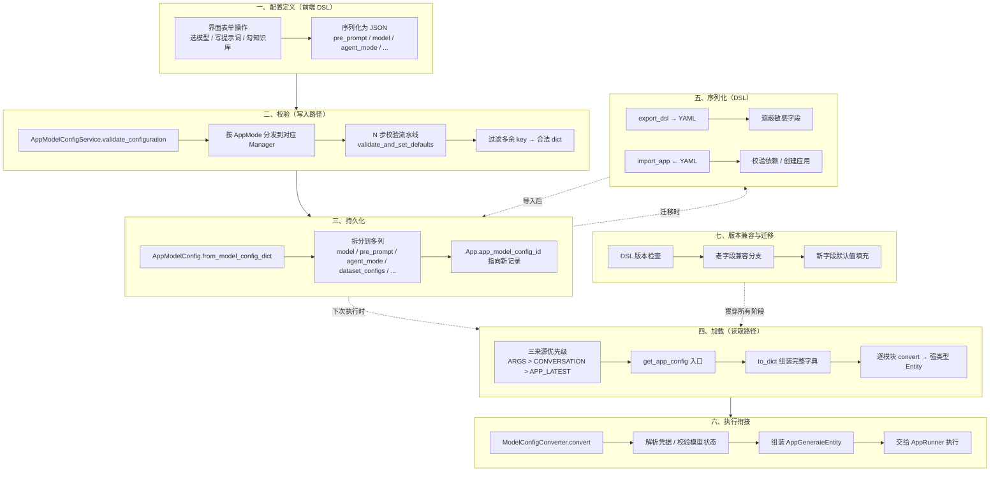
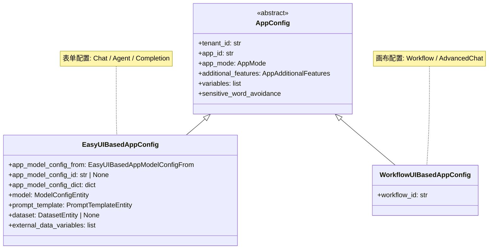
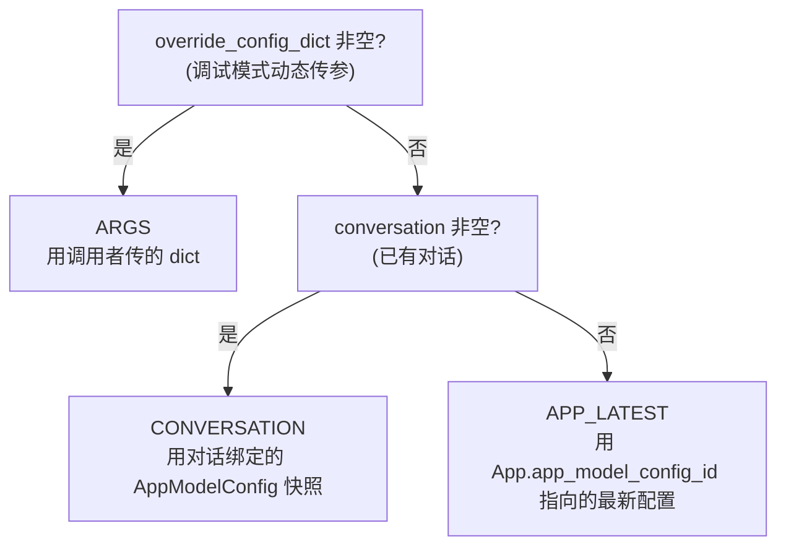
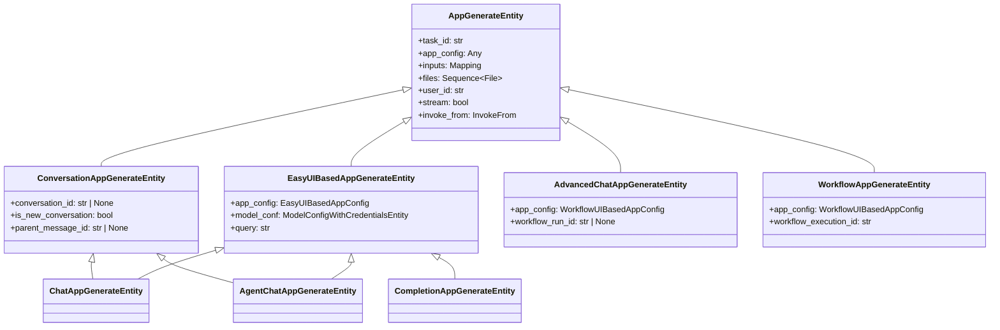
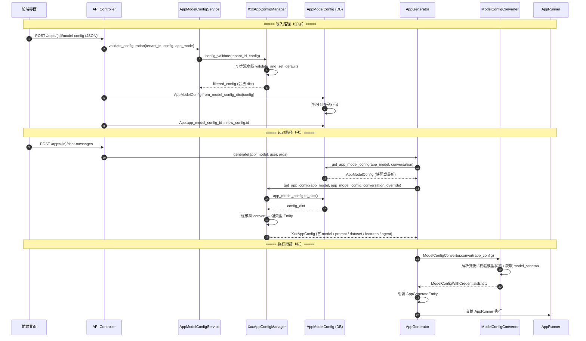
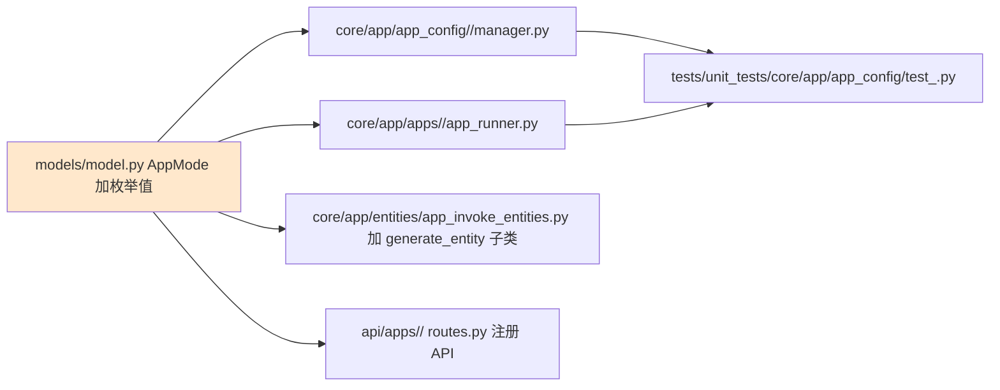

# 应用配置层：从界面操作到后端执行的桥梁

> **学习目标**：理解 Dify 中用户在界面上的每一次功能操作（修改提示词、选择模型、配置知识库等）如何被转换为后端可执行的配置对象，以及配置的加载、校验、序列化和全生命周期管理。
>
> **读完本章你应该能回答**：
> - Dify 为什么需要"配置层"作为单独一层抽象？它解决的核心矛盾是什么？
> - 8 种 AppMode 各自的配置管理器和执行器是什么？它们如何对应到两大配置基类？
> - 配置加载的入口在哪里？运行时如何决定使用哪份配置（ARGS / 对话 / 应用最新版）？
> - 模型配置、提示词配置、知识库配置、特性配置这四大子模块各自负责什么？
> - 配置在前端编辑到后端执行之间，经历了哪些环节、每环节谁负责？
> - 配置校验的"11 步流水线"是什么？为什么按这个顺序？
> - DSL 是什么？它在 Dify 的应用迁移中扮演什么角色？
> - 配置的全生命周期有哪些阶段？每个阶段的不变量是什么？
> - 新增一种 AppMode 时需要修改哪些文件？最少侵入面是什么？

## 本章要解决的问题

Dify 的核心矛盾是：**前端界面提供可视化的低代码操作，后端引擎需要结构化的配置对象来执行**。用户在界面上选模型、写提示词、勾选知识库、配置工具——这些操作的产出物是松散的表单 JSON；而执行引擎需要的是强类型的 `ModelConfigEntity`、`PromptTemplateEntity`、`DatasetEntity`——字段完整、类型确定、已校验、带凭据。配置层就是弥合这道鸿沟的中间件。

如果没有这一层，会发生什么？前端每次改动都要改后端代码：用户想加一个"开场白"字段，引擎就要新增一个参数解析分支；用户想把 temperature 从滑块改成输入框，LLM 调用层就要调整类型断言。更严重的是，8 种 AppMode（Chat / Completion / Agent / Workflow / AdvancedChat / …）各自的配置形态差异巨大——Chat 有开场白和提示词模板，Workflow 有节点图和变量流，Agent 有工具列表和推理策略——如果让 UI 直接和引擎对话，每种模式都要写一套独立适配，低代码无从谈起。

配置层把这些"翻译、校验、适配"职责集中起来：写入时把松散 JSON 校验为合法字典再存库，读取时把库里的字典转换为强类型 Pydantic 实体再交给引擎，迁移时把配置序列化为 YAML DSL 供跨环境移植。它坏了，Dify 的所有应用就退回成"硬编码的一次性脚本"——改一个参数要改代码、迁移一个应用要手工重建、不同模式无法共享能力。

## 宏观架构：配置的生命周期

下图是一条配置从"用户在界面上编辑"到"引擎执行时消费"的完整生命周期，也是全文的叙事主线——后续每一节对应生命周期的一个阶段。



理解这张图的关键：**写入路径和读取路径是分离的**。写入走 `validate_and_set_defaults`（校验 + 补默认值 → dict），读取走 `convert`（dict → 强类型 Entity）。两条路径共用同一份 JSON 字典作为中间状态，但各自独立、不互相调用。这种分离让"保存"和"执行"可以异步发生——保存时校验合法性，执行时只做类型转换，不重复校验。

下面按这七个阶段逐层展开。

## 一、配置定义：应用类型体系与前端 DSL

**这一节为什么存在**：配置的生命周期从用户在界面上的操作开始。不同 AppMode 的配置形态差异巨大，决定了后续校验、加载、序列化各阶段的分支逻辑。理解 8 种 AppMode 和两大配置基类的划分依据，才能理解后续阶段为什么有"EasyUI"和"WorkflowUI"两条并行路径。

### 1.1 八种 AppMode

Dify 当前支持 8 种 `AppMode`（model.py:364-375）：

| 应用类型 | AppMode 枚举值 | 配置管理器 | 执行器 |
|----------|-------------|-----------|--------|
| 聊天补全 | `COMPLETION` | `CompletionAppConfigManager` | `CompletionAppRunner` |
| 工作流 | `WORKFLOW` | `WorkflowAppConfigManager` | `WorkflowAppRunner` |
| 聊天助手 | `CHAT` | `ChatAppConfigManager` | `ChatAppRunner` |
| 高级聊天 | `ADVANCED_CHAT` | `AdvancedChatAppConfigManager` | `AdvancedChatAppRunner` |
| Agent | `AGENT_CHAT` | `AgentChatAppConfigManager` | `AgentChatAppRunner` |
| 新 Agent (v2) | `AGENT` | — | 绑定 Agent 实体 |
| 渠道发布 | `CHANNEL` | — | 渠道 |
| RAG 管道 | `RAG_PIPELINE` | — | 知识库管道 |

前 5 种是"运行一个 LLM 对话/推理"的某种形态，有独立的配置管理器和执行器。后 3 种是元模式：`AGENT` 绑定一个独立的 Agent 实体（v2 引入的新概念，配置存在 Agent Soul 快照中）、`CHANNEL` 用于对接外部发布渠道、`RAG_PIPELINE` 是知识库管道专用。本章重点是前 5 种的"配置层"。

### 1.2 两大配置基类

5 种配置管理器的继承结构指向两个基类（entities.py:211-255）：



这种二分的根据是**配置结构形态**：

- `EasyUIBasedAppConfig`（entities.py:234）对应"用表单配置一个应用"——模型、提示词、知识库、特性开关等字段彼此独立、平行存在。Chat / Agent / Completion 三种模式走这条路。
- `WorkflowUIBasedAppConfig`（entities.py:250）对应"用画布编排一个应用"——核心是节点图（DAG），配置的关键不是扁平字段而是节点间的依赖关系和变量流动。Workflow / AdvancedChat 走这条路。

为什么 `AdvancedChat` 归 Workflow 而非 EasyUI？因为高级聊天本质上是用工作流编排的聊天应用——它的"聊天"能力来自画布上的 LLM 节点而非一个简单的 prompt 模板。把 `AdvancedChat` 放在 WorkflowUI 体系下，让它共享工作流的节点调度、变量解析基础设施，避免重复实现。

### 1.3 前端表单到 JSON

用户在界面上的每一次操作最终序列化为一个 JSON 字典，其 schema 由 `AppModelConfigDict` 定义（model.py:234-257）：

```python
class AppModelConfigDict(TypedDict):
    model: ModelConfig                    # 模型配置
    pre_prompt: str | None                # 简单模式提示词
    prompt_type: str                      # "simple" | "advanced"
    chat_prompt_config: ChatPromptConfig  # 高级模式 chat 消息列表
    completion_prompt_config: CompletionPromptConfig  # 高级模式 completion
    user_input_form: list[UserInputFormItem]  # 用户输入变量
    dataset_configs: DatasetConfigs       # 知识库检索配置
    agent_mode: AgentModeConfig           # Agent 工具与策略
    file_upload: FileUploadConfig         # 文件上传
    opening_statement: str | None         # 开场白
    suggested_questions: list[str]        # 推荐问题
    # ... speech_to_text / text_to_speech / more_like_this / ...
```

这个字典是贯穿全生命周期的"通用语"——前端提交它、校验器过滤它、数据库存储它、加载器读取它、DSL 序列化它。每个阶段对这个字典做不同操作，但都用同一个 schema。

## 二、校验：写入路径的流水线

**这一节为什么存在**：前端提交的 JSON 不可信——用户可能选了不存在的模型、设了超范围的 temperature、引用了未定义的变量。校验流水线是写入路径的核心防线，它把"可能不合法的 JSON"变成"确定合法的 dict"再存库。校验顺序不是任意的，而是配置项之间的依赖 DAG。

### 2.1 入口：按 AppMode 分发

校验入口在 `AppModelConfigService.validate_configuration`（app_model_config_service.py:11）：

```python
@classmethod
def validate_configuration(cls, tenant_id, config, app_mode) -> AppModelConfigDict:
    match app_mode:
        case AppMode.CHAT:
            return ChatAppConfigManager.config_validate(tenant_id, config)
        case AppMode.AGENT_CHAT:
            return AgentChatAppConfigManager.config_validate(tenant_id, config)
        case AppMode.COMPLETION:
            return CompletionAppConfigManager.config_validate(tenant_id, config)
        case AppMode.WORKFLOW | AppMode.ADVANCED_CHAT | AppMode.CHANNEL | AppMode.RAG_PIPELINE | AppMode.AGENT:
            raise ValueError(f"Invalid app mode: {app_mode}")
```

注意 `WORKFLOW` 和 `ADVANCED_CHAT` 不走这条路径——它们的校验由 `WorkflowAppConfigManager.config_validate` 和 `AdvancedChatAppConfigManager.config_validate` 独立处理，且校验内容少得多（只有 file_upload / text_to_speech / sensitive_word 等外层特性），因为节点图内部的校验由 Graphon 引擎在执行时做。

### 2.2 校验流水线

以 `AgentChatAppConfigManager.config_validate` 为例（app_config_manager.py:91-162），它是一条 **12 步流水线**：

```python
@classmethod
def config_validate(cls, tenant_id, config):
    app_mode = AppMode.AGENT_CHAT
    related_config_keys = []

    # 1. 模型（provider 是否存在 / model 是否在租户已配置的模型列表中）
    config, keys = ModelConfigManager.validate_and_set_defaults(tenant_id, config)
    # 2. 用户输入变量（变量名合法 / 类型合法 / 外部数据工具配置合法）
    config, keys = BasicVariablesConfigManager.validate_and_set_defaults(tenant_id, config)
    # 3. 文件上传（image_config 结构合法）
    config, keys = FileUploadConfigManager.validate_and_set_defaults(config)
    # 4. 提示词（prompt_type 合法 / simple 模式 pre_prompt 非空 / advanced 模式消息结构合法）
    config, keys = PromptTemplateConfigManager.validate_and_set_defaults(app_mode, config)
    # 5. Agent 模式（strategy 合法 / tools 结构合法 / 旧式工具迁移）
    config, keys = cls.validate_agent_mode_and_set_defaults(tenant_id, config)
    # 6. 开场白
    config, keys = OpeningStatementConfigManager.validate_and_set_defaults(config)
    # 7. 后续追问
    config, keys = SuggestedQuestionsAfterAnswerConfigManager.validate_and_set_defaults(config)
    # 8. 语音输入
    config, keys = SpeechToTextConfigManager.validate_and_set_defaults(config)
    # 9. 语音输出
    config, keys = TextToSpeechConfigManager.validate_and_set_defaults(config)
    # 10. 检索来源展示
    config, keys = RetrievalResourceConfigManager.validate_and_set_defaults(config)
    # 11. 知识库（dataset_id 属于当前租户 / retrieve_config 合法）
    config, keys = DatasetConfigManager.validate_and_set_defaults(tenant_id, app_mode, config)
    # 12. 敏感词
    config, keys = SensitiveWordAvoidanceConfigManager.validate_and_set_defaults(tenant_id, config)

    # 过滤掉多余的 key
    related_config_keys = list(set(related_config_keys))
    filtered_config = {key: config.get(key) for key in related_config_keys}
    return filtered_config
```

不同 AppMode 的步数不同——Chat 是 11 步（少一个 agent_mode），Completion 是 8 步（少 agent_mode / opening_statement / suggested_questions / speech_to_text / retrieval_resource，多 more_like_this），Workflow 只有 3 步。步数差异反映的是"这种模式支持哪些配置维度"。

### 2.3 为什么按这个顺序

校验顺序是一份**隐式依赖 DAG**：

- **模型必须先校验**：因为后续的 Agent 策略嗅探需要知道 `model.provider`（旧配置的默认策略由 provider 决定，见 manager.py:27）。
- **变量在文件上传之前**：因为文件上传的 `image_config` 可能引用变量。
- **提示词在变量之后**：因为提示词模板里的 `#variable#` 引用需要变量已定义。
- **Agent 模式在提示词之后**：因为 Agent 的 ReAct prompt 模板需要根据 `model.mode` 选 chat 还是 completion 版本（manager.py:56-74）。
- **知识库靠后**：因为它需要 `dataset_query_variable`（对 Completion 模式），而这依赖变量定义。

最后一步"过滤多余 key"至关重要——它确保存到数据库的 JSON 只含合法字段。否则用户提交的调试草稿、前端实验性字段也会被存入，下次加载时被新代码不认识就报错。

### 2.4 Manager 模式的对称接口

每个配置维度的 Manager 实现统一的两个接口：

```python
class BaseFeatureConfigManager(ABC):
    @classmethod
    @abstractmethod
    def convert(cls, config: Mapping[str, Any]) -> FeatureConfig | None:
        """从字典提取该特性的强类型实体（读取时调用）"""

    @classmethod
    @abstractmethod
    def validate_and_set_defaults(cls, config: dict) -> tuple[dict, list]:
        """校验 + 补默认值，返回 (更新后的 dict, 关联的 key 列表)（写入时调用）"""
```

两个接口的对称性是写入/读取分离的关键：

- `validate_and_set_defaults()`：写入路径调用。输入是可能不完整的 dict，输出是补了默认值、删了非法字段的 dict + 关心的 key 列表。返回 `tuple[dict, list]` 而非单值，是为了支持"增量保存"——Manager 只修改自己关心的 key，不动其他字段。
- `convert()`：读取路径调用。输入是已校验的 dict，输出是强类型 Pydantic Entity。不做校验，只做类型转换。

这种分离的好处：保存时校验一次（合法的 dict 存库），执行时只 convert 不校验（快），两条路径互不干扰。

## 三、持久化：AppModelConfig 的多列存储

**这一节为什么存在**：校验后的 dict 要存到数据库。存成单列 JSON 还是拆成多列？这个选择直接影响查询、缓存、迁移。Dify 的答案是"多列 + 一个 JSON 兜底"——每个配置维度独立存列，方便单维度查询和索引。

### 3.1 存储结构

`AppModelConfig`（model.py:697-743）的表结构：

```
AppModelConfig 表 (app_model_configs)
 ├── id (StringUUID, PK)
 ├── app_id (StringUUID, FK)
 ├── provider (String 255)           → 冗余: 模型提供商
 ├── model_id (String 255)           → 冗余: 模型 ID
 ├── configs (JSON)                  → 附加配置
 ├── model (LongText, JSON)          → {"provider": "openai", "name": "gpt-4o", "mode": "chat", "completion_params": {...}}
 ├── pre_prompt (LongText)           → 简单模式提示词原文
 ├── prompt_type (EnumText)          → "simple" | "advanced"
 ├── chat_prompt_config (LongText)   → 高级 chat 模式消息列表 JSON
 ├── completion_prompt_config (LongText) → 高级 completion 模式 JSON
 ├── user_input_form (LongText, JSON) → 用户输入变量定义
 ├── dataset_query_variable (String)  → Completion 模式的查询变量名
 ├── dataset_configs (LongText, JSON) → 知识库检索配置
 ├── agent_mode (LongText, JSON)      → {"enabled": true, "strategy": "cot", "tools": [...], "prompt": {...}}
 ├── file_upload (LongText, JSON)     → 文件上传配置
 ├── opening_statement (LongText)     → 开场白文本
 ├── suggested_questions (LongText)   → 推荐问题 JSON
 ├── speech_to_text (LongText)        → 语音输入配置
 ├── text_to_speech (LongText)        → 语音输出配置
 ├── more_like_this (LongText)        → 相似推荐配置
 ├── sensitive_word_avoidance (LongText) → 敏感词配置
 ├── retriever_resource (LongText)    → 检索来源展示配置
 ├── external_data_tools (LongText)   → 外部数据工具 JSON
 ├── created_by / updated_by (StringUUID)
 └── created_at / updated_at (DateTime)
```

工作流应用则把图定义存在 `Workflow.graph` 字段（JSON），特性配置存在 `Workflow.features` 字段（JSON），不使用 `AppModelConfig` 表。

### 3.2 为什么用多列而非单 JSON

三个原因：

1. **单维度查询**。列出所有用 OpenAI 模型的应用，只需 `SELECT ... WHERE provider = 'openai'`，不用 JSON 解码。如果全部塞进一个 `config` JSON 列，每次查询都要全表扫描 + JSON 解析。
2. **冗余字段加速**。`provider` 和 `model_id` 是 `model` JSON 的冗余字段，但它们让对话列表的"显示模型名"不需要解析整个 `model` JSON。
3. **字段级演进**。新增一个配置维度（如 `speech_to_text`）只需加一列，老数据该列为 NULL，代码里 `json.loads(value) if value else default` 自动兼容。如果用单 JSON，老数据里没有这个 key，代码要处处做 `.get()` 兜底。

代价是写入和读取稍复杂——`from_model_config_dict()` 把 dict 拆到多列，`to_dict()` 把多列拼回 dict。但这两个方法的逻辑是机械的映射，无业务复杂度。

### 3.3 写入：from_model_config_dict

`AppModelConfig.from_model_config_dict()`（model.py:882-904）把校验后的 dict 拆到各列：

```python
def from_model_config_dict(self, model_config: AppModelConfigDict):
    self.opening_statement = model_config.get("opening_statement")
    self.suggested_questions = self._dump_optional(model_config.get("suggested_questions"))
    self.model = self._dump_optional(model_config.get("model"))
    self.pre_prompt = model_config.get("pre_prompt")
    self.agent_mode = self._dump_optional(model_config.get("agent_mode"))
    self.dataset_configs = self._dump_optional(model_config.get("dataset_configs"))
    self.file_upload = self._dump_optional(model_config.get("file_upload"))
    # ... 其余字段同理
    return self
```

`_dump_optional` 是 `json.dumps(value) if value else None`——空值存 NULL，非空存 JSON 字符串。

### 3.4 读取：to_dict

`AppModelConfig.to_dict()`（model.py:854-876）把各列拼回完整 dict：

```python
def to_dict(self) -> AppModelConfigDict:
    return {
        "opening_statement": self.opening_statement,
        "suggested_questions": self.suggested_questions_list,
        "model": self.model_dict,           # json.loads(self.model) if self.model else {}
        "pre_prompt": self.pre_prompt,
        "agent_mode": self.agent_mode_dict,  # json.loads(self.agent_mode) if ... else {enabled: False, ...}
        "dataset_configs": self.dataset_configs_dict,
        "file_upload": self.file_upload_dict,
        # ... 其余字段同理
    }
```

每个 `*_dict` property 做的是 `json.loads(column) if column else default`——NULL 安全。`to_dict()` 的产出就是下一阶段（加载）的输入。

`App` 表通过 `app_model_config_id` 指向当前生效的 `AppModelConfig` 记录（model.py:419）。每次用户保存配置，会创建一条新的 `AppModelConfig` 记录并更新 `App.app_model_config_id`，老的记录保留用于历史对话回放。

## 四、加载：三来源优先级与逐模块转换

**这一节为什么存在**：执行引擎不能直接用数据库里的 JSON——它需要强类型、带凭据、已转换的 Entity。加载阶段是读取路径的核心，它解决两个问题：运行时用哪份配置（三来源优先级）和如何把 dict 变成 Entity（逐模块 convert）。

### 4.1 三来源优先级

以 `AgentChatAppConfigManager.get_app_config()` 为例（app_config_manager.py:38-88）：

```python
@classmethod
def get_app_config(cls, app_model, app_model_config, conversation=None, override_config_dict=None):
    # 1. 确定配置来源
    if override_config_dict:
        config_from = EasyUIBasedAppModelConfigFrom.ARGS
    elif conversation:
        config_from = EasyUIBasedAppModelConfigFrom.CONVERSATION_SPECIFIC_CONFIG
    else:
        config_from = EasyUIBasedAppModelConfigFrom.APP_LATEST_CONFIG

    # 2. 获取原始字典
    if config_from != EasyUIBasedAppModelConfigFrom.ARGS:
        config_dict = app_model_config.to_dict().copy()
    else:
        config_dict = override_config_dict
    # ...
```

三种来源的语义（entities.py:224-231）：

| 来源 | 枚举值 | 含义 | 典型场景 |
|------|--------|------|---------|
| `ARGS` | `"args"` | 调用者传入的覆盖参数 | 调试面板动态调参 |
| `CONVERSATION_SPECIFIC_CONFIG` | `"conversation-specific-config"` | 对话创建时的配置快照 | 多轮对话保持首轮回合的配置 |
| `APP_LATEST_CONFIG` | `"app-latest-config"` | 应用最新发布配置 | 首次对话 / 无覆盖参数 |



关键设计决策：**优先级在入口决定，之后所有 Manager 共用同一份 dict**。不做"字段级混合"——不会出现"模型用 ARGS 的、提示词用 APP_LATEST 的"这种交叉。整个配置对象要么全是 ARGS，要么全是 CONVERSATION，要么全是 APP_LATEST。好处是**配置来源可追溯**：`app_model_config_from` 字段记录了来源，调试时一眼看出"这次调用用的是哪份配置"。

CONVERSATION 来源的实际解析发生在上游 `_get_app_model_config`（message_based_app_generator.py:92-110）：

```python
def _get_app_model_config(self, app_model, conversation=None):
    if conversation:
        # 用对话创建时绑定的 AppModelConfig 快照
        app_model_config = db.session.scalar(
            select(AppModelConfig).where(
                AppModelConfig.id == conversation.app_model_config_id,
                AppModelConfig.app_id == app_model.id,
            )
        )
    else:
        # 用应用最新发布的配置
        app_model_config = app_model.app_model_config
    return app_model_config
```

这意味着对话创建时的配置被"冻结"——即使用户后来修改了应用配置，老对话仍用创建时的快照。这是"配置改变不影响历史对话回复"的物理实现。

### 4.2 逐模块 convert

确定 `config_dict` 后，`get_app_config` 逐模块调用 `convert()` 组装强类型 Entity（app_config_manager.py:69-87）：

```python
app_config = AgentChatAppConfig(
    tenant_id=app_model.tenant_id,
    app_id=app_model.id,
    app_mode=AppMode.value_of(app_model.mode),
    app_model_config_from=config_from,
    app_model_config_id=app_model_config.id,
    app_model_config_dict=cast(dict[str, Any], config_dict),
    model=ModelConfigManager.convert(config=config_dict),
    prompt_template=PromptTemplateConfigManager.convert(config=config_dict),
    sensitive_word_avoidance=SensitiveWordAvoidanceConfigManager.convert(config=config_dict),
    dataset=DatasetConfigManager.convert(config=config_dict),
    agent=AgentConfigManager.convert(config=config_dict),
    additional_features=cls.convert_features(config_dict, app_mode),
)

app_config.variables, app_config.external_data_variables = BasicVariablesConfigManager.convert(
    config=config_dict
)
```

每个 Manager 的 `convert()` 从同一个 `config_dict` 中提取自己关心的字段，构造强类型 Entity。变量解析放在最后，因为它依赖前面所有维度的配置。

### 4.3 模型配置：ModelConfigEntity

`ModelConfigManager.convert()`（manager.py:13-40）从 dict 提取模型配置：

```python
return ModelConfigEntity(
    provider=config["model"]["provider"],
    model=config["model"]["name"],
    mode=model_config.get("mode"),
    parameters=completion_params,
    stop=stop,
)
```

`ModelConfigEntity`（entities.py:15-24）字段：

| 字段 | 类型 | 含义 |
|------|------|------|
| `provider` | `str` | 模型提供商，如 `"openai"` |
| `model` | `str` | 模型名，如 `"gpt-4o"` |
| `mode` | `str \| None` | `chat` 或 `completion`，决定 prompt 拼法 |
| `parameters` | `dict[str, Any]` | temperature / top_p / max_tokens 等推理参数 |
| `stop` | `list[str]` | 停止序列 |

为什么 `parameters` 是 dict 而非拆成 `temperature: float, top_p: float`？因为不同 provider 的参数差异极大——OpenAI 有 `response_format`、`seed`；Anthropic 有 `top_k`；开源模型有 `repetition_penalty`。用 dict 容纳一切，校验时按 provider 分流。

### 4.4 提示词配置：PromptTemplateEntity

`PromptTemplateConfigManager.convert()`（manager.py:16-60）分简单和高级两种模式：

```python
class PromptTemplateEntity(BaseModel):
    class PromptType(StrEnum):
        SIMPLE = auto()      # 用户编辑一个 prompt 字符串
        ADVANCED = auto()    # 用户编辑消息列表 (role + text)

    prompt_type: PromptType
    simple_prompt_template: str | None = None
    advanced_chat_prompt_template: AdvancedChatPromptTemplateEntity | None = None
    advanced_completion_prompt_template: AdvancedCompletionPromptTemplateEntity | None = None
```

简单模式（entities.py:61-91）：用户在富文本编辑器中输入一段 prompt，存为 `pre_prompt` 字符串。模板中的 `#sys.query#` / `{{#sys.query#}}` 在运行时由变量池解析替换。

高级模式：用户自定义多轮消息（system / user / assistant 各几条），存为 `chat_prompt_config` 或 `completion_prompt_config` JSON。适合多角色扮演、链式推理这类需要精细控制消息结构的场景。

### 4.5 知识库配置：DatasetEntity

`DatasetConfigManager.convert()`（manager.py:18-87）提取知识库检索配置：

```python
class DatasetEntity(BaseModel):
    dataset_ids: list[str]
    retrieve_config: DatasetRetrieveConfigEntity

class DatasetRetrieveConfigEntity(BaseModel):
    query_variable: str | None = None     # Completion 模式的查询变量
    retrieve_strategy: RetrieveStrategy   # SINGLE / MULTIPLE
    top_k: int | None = None
    score_threshold: float | None = 0.0
    reranking_model: RerankingModelDict | None = None
    weights: WeightsDict | None = None     # 语义/全文权重
    metadata_filtering_mode: Literal["disabled", "automatic", "manual"] | None = "disabled"
    # ...
```

这个 Entity 比其他维度复杂，因为 RAG 检索本身就有多策略（向量 / 全文 / 混合）、多参数（Top-K、分数阈值、Rerank、Metadata 过滤）。详见 [09-rag-indexing.md](./dify-09-rag-indexing.md) 和 [10-rag-retrieval.md](./dify-10-rag-retrieval.md)。

### 4.6 特性配置：AppAdditionalFeatures

`BaseAppConfigManager.convert_features()`（base_app_config_manager.py:19-49）统一调度 7 个特性管理器：

```python
@classmethod
def convert_features(cls, config_dict, app_mode) -> AppAdditionalFeatures:
    additional_features = AppAdditionalFeatures()
    additional_features.show_retrieve_source = RetrievalResourceConfigManager.convert(config=config_dict)
    additional_features.file_upload = FileUploadConfigManager.convert(
        config=config_dict,
        is_vision=app_mode in {AppMode.CHAT, AppMode.COMPLETION, AppMode.AGENT_CHAT},
    )
    additional_features.opening_statement, additional_features.suggested_questions = (
        OpeningStatementConfigManager.convert(config=config_dict)
    )
    additional_features.suggested_questions_after_answer = SuggestedQuestionsAfterAnswerConfigManager.convert(config=config_dict)
    additional_features.more_like_this = MoreLikeThisConfigManager.convert(config=config_dict)
    additional_features.speech_to_text = SpeechToTextConfigManager.convert(config=config_dict)
    additional_features.text_to_speech = TextToSpeechConfigManager.convert(config=config_dict)
    return additional_features
```

`AppAdditionalFeatures`（entities.py:199-208）字段：

```python
class AppAdditionalFeatures(BaseModel):
    file_upload: FileUploadConfig | None = None
    opening_statement: str | None = None
    suggested_questions: list[str] = []
    suggested_questions_after_answer: bool = False
    show_retrieve_source: bool = False
    more_like_this: bool = False
    speech_to_text: bool = False
    text_to_speech: TextToSpeechEntity | None = None
    trace_config: TracingConfigEntity | None = None
```

注意 `is_vision=app_mode in {CHAT, COMPLETION, AGENT_CHAT}` 的分支——只有这三种模式支持图片上传。这种"特性粒度 AppMode"设计让 Workflow 应用天然不支持图片上传（它没有聊天消息接入口），不需要在每个 Manager 里重复判断。

### 4.7 Agent 配置：AgentEntity

`AgentConfigManager.convert()`（manager.py:10-85）是 Agent 模式独有的配置维度，把 `agent_mode` dict 转换为 `AgentEntity`：

```python
class AgentEntity(BaseModel):
    provider: str
    model: str
    strategy: Strategy           # FUNCTION_CALLING | CHAIN_OF_THOUGHT
    prompt: AgentPromptEntity | None = None
    tools: list[AgentToolEntity] | None = None
    max_iteration: int = 10
```

strategy 的映射逻辑（manager.py:20-30）：

| 配置值 | 映射 |
|--------|------|
| `"function_call"` | `FUNCTION_CALLING` |
| `"cot"` 或 `"react"` | `CHAIN_OF_THOUGHT` |
| 旧配置无显式 strategy | OpenAI → `FUNCTION_CALLING`，其他 → `CHAIN_OF_THOUGHT` |

注意这里只是配置层的"初始值"——运行时还会根据模型能力做嗅探覆盖（模型支持 TOOL_CALL 则强制 FC），详见 [03-agent-runtime.md](./dify-03-agent-runtime.md) §③。

`prompt` 在 FC 模式下为 `None` 是有意的——FC 依赖模型原生 tool_calls，不需要 ReAct 提示模板；标 None 让代码路径明确"这里没有 prompt 拼接逻辑"。

### 4.8 工作流配置的特殊加载路径

工作流应用（`WORKFLOW` / `ADVANCED_CHAT`）的加载路径与 EasyUI 完全不同。`WorkflowAppConfigManager.get_app_config()`（app_config_manager.py:21-35）不接收 `app_model_config`，而是直接读 `Workflow` 表：

```python
@classmethod
def get_app_config(cls, app_model, workflow) -> WorkflowAppConfig:
    features_dict = workflow.features_dict   # 来自 Workflow.features 列，不是 AppModelConfig
    app_config = WorkflowAppConfig(
        tenant_id=app_model.tenant_id,
        app_id=app_model.id,
        app_mode=AppMode.value_of(app_model.mode),
        workflow_id=workflow.id,
        sensitive_word_avoidance=SensitiveWordAvoidanceConfigManager.convert(config=features_dict),
        variables=WorkflowVariablesConfigManager.convert(workflow=workflow),
        additional_features=cls.convert_features(features_dict, app_mode),
    )
    return app_config
```

几个关键差异：

1. **节点图是核心**。`Workflow.graph`（JSON）包含节点列表、边列表、变量定义，是工作流的"骨架"。每个节点的 `data` 字段保存该节点的配置（LLM 节点的模型、Code 节点的代码等）。"工作流配置"不是一个配置对象，而是一张图。
2. **特性配置来自 `workflow.features_dict`** 而非 `app_model_config`。因为工作流的"特性"（开场白、文件上传）和"图"是解耦的——一个工作流可以有开场白也可以没有，跟节点无关。
3. **没有三来源优先级**。工作流没有 ARGS / CONVERSATION / APP_LATEST 的分支——每次执行都用最新的 draft workflow（调试时）或 published workflow（生产时），不做对话级配置快照。
4. **加载时不做 12 步校验**。工作流配置有自己的验证机制（节点连接合法性、循环检测、变量引用完整性），由 Graphon 引擎在执行时做，不在配置层重复。详见 [11-workflow-engine.md](./dify-11-workflow-engine.md)。

## 五、序列化：DSL 导出与导入

**这一节为什么存在**：应用需要跨环境迁移（dev → staging → prod）、备份存档、版本控制。DSL（Domain Specific Language）是配置的 YAML 序列化格式，让应用可以脱离数据库以文件形式存在。这一阶段是"配置的便携化"。

### 5.1 导出：export_dsl

`AppDslService.export_dsl()`（app_dsl_service.py:517-549）负责把应用导出为 YAML：

```python
@classmethod
def export_dsl(cls, app_model, include_secret=False, workflow_id=None) -> str:
    app_mode = AppMode.value_of(app_model.mode)
    export_data = {
        "version": CURRENT_DSL_VERSION,   # "0.6.0"
        "kind": "app",
        "app": {
            "name": app_model.name,
            "mode": app_model.mode.value,
            "icon": app_model.icon,
            "icon_type": ...,
            "icon_background": app_model.icon_background,
            "description": app_model.description,
            "use_icon_as_answer_icon": app_model.use_icon_as_answer_icon,
        },
    }

    if app_mode in {AppMode.ADVANCED_CHAT, AppMode.WORKFLOW}:
        cls._append_workflow_export_data(...)   # 导出 workflow graph
    else:
        cls._append_model_config_export_data(...)  # 导出 AppModelConfig

    return yaml.dump(export_data, allow_unicode=True)
```

导出时按 AppMode 分两条路径：
- **工作流应用**（`_append_workflow_export_data`，app_dsl_service.py:551-596）：导出 `Workflow` 的 `graph_dict`，并清理敏感字段——`credential_id` 从 Tool 节点移除（除非 `include_secret=True`）、知识库 ID 加密、Webhook URL 清空。
- **简单应用**（`_append_model_config_export_data`）：导出 `AppModelConfig.to_dict()` 的内容。

### 5.2 导入：import_app

`AppDslService.import_app()`（app_dsl_service.py:89-103）负责从 YAML 创建应用：

```python
def import_app(self, *, account, import_mode, yaml_content=None, yaml_url=None, ...):
    # 1. 获取 YAML 内容（直接传或从 URL 拉取）
    # 2. 解析 YAML → dict
    # 3. 版本兼容性检查
    status = check_version_compatibility(imported_version, CURRENT_DSL_VERSION)
    # 4. 校验依赖（目标环境是否有对应模型、知识库等）
    # 5. 创建 App 记录
    # 6. 存储配置到 AppModelConfig（简单应用）或 Workflow（工作流应用）
    # 7. 返回 Import 记录
```

导入支持两种模式：`YAML_CONTENT`（直接传 YAML 文本）和 `YAML_URL`（从 URL 拉取，支持 GitHub raw URL 自动转换）。文件大小限制 10MB（`DSL_MAX_SIZE`）。

### 5.3 DSL 的设计取舍

DSL 不是简单的 YAML 包装，而是经过精心设计的可移植应用包：

- **敏感字段遮蔽**：导出时 `credential_id` 默认移除，知识库 ID 加密（`encrypt_dataset_id`）。导入时如果原环境没有对应知识库，加密 ID 不会泄露原租户的 dataset_id。
- **版本兼容**：导出时写入 `version` 字段，导入时 `check_version_compatibility` 检查版本差异并做必要迁移。
- **依赖校验**：导入时检查目标环境是否有对应的模型 provider、模型是否已配置。没有则报错，避免导入后执行失败。

DSL 的 YAML 格式让它既是可读的配置文件，又是可移植的应用包——可以提交到 Git 做版本控制，也可以作为模板分享。

## 六、执行衔接：从 AppConfig 到 AppGenerateEntity

**这一节为什么存在**：加载阶段产出的 `AppConfig` 是纯数据对象——它知道自己要用哪个模型，但不持有模型凭据，无法直接调 LLM。执行衔接阶段做最后一公里：解析凭据、校验模型状态、组装成引擎能用的 `AppGenerateEntity`。

### 6.1 ModelConfigConverter：解析凭据

`ModelConfigConverter.convert()`（converter.py:14-91）把 `EasyUIBasedAppConfig` 转换为 `ModelConfigWithCredentialsEntity`：

```python
@classmethod
def convert(cls, app_config: EasyUIBasedAppConfig) -> ModelConfigWithCredentialsEntity:
    model_config = app_config.model

    # 1. 获取 provider bundle（含 model_type_instance）
    provider_manager = create_plugin_provider_manager(tenant_id=app_config.tenant_id)
    provider_model_bundle = provider_manager.get_provider_model_bundle(
        tenant_id=app_config.tenant_id, provider=model_config.provider, model_type=ModelType.LLM
    )

    # 2. 获取并校验模型凭据
    model_credentials = provider_model_bundle.configuration.get_current_credentials(
        model_type=ModelType.LLM, model=model_config.model
    )
    if model_credentials is None:
        raise ProviderTokenNotInitError(f"Model {model_name} credentials is not initialized.")

    # 3. 校验模型状态
    provider_model = provider_model_bundle.configuration.get_provider_model(...)
    if provider_model.status == ModelStatus.NO_CONFIGURE:
        raise ProviderTokenNotInitError(...)
    elif provider_model.status == ModelStatus.NO_PERMISSION:
        raise ModelCurrentlyNotSupportError(...)
    elif provider_model.status == ModelStatus.QUOTA_EXCEEDED:
        raise QuotaExceededError(...)

    # 4. 获取 model_schema（含功能声明，影响 Agent 策略嗅探）
    model_schema = model_type_instance.get_model_schema(model_config.model, model_credentials)

    # 5. 解析 model_mode
    model_mode = model_config.mode
    if not model_mode:
        model_mode = LLMMode.CHAT  # 默认 chat

    return ModelConfigWithCredentialsEntity(
        provider=model_config.provider,
        model=model_config.model,
        model_schema=model_schema,
        mode=model_mode,
        provider_model_bundle=provider_model_bundle,
        credentials=model_credentials,
        parameters=completion_params,
        stop=stop,
    )
```

这一步是配置层和执行层的分界线——之前的对象都是"纯数据"（provider 名、model 名），这步之后产出的 `ModelConfigWithCredentialsEntity`（app_invoke_entities.py:96-111）持有 `provider_model_bundle`（含 model_type_instance）和 `credentials`（API Key 等敏感信息），可以直接调 LLM。

### 6.2 组装 AppGenerateEntity

`ModelConfigConverter` 的产出被装入 `AppGenerateEntity`（app_invoke_entities.py:114-147），它是执行引擎的统一入口对象：

```python
class EasyUIBasedAppGenerateEntity(AppGenerateEntity):
    app_config: EasyUIBasedAppConfig       # 完整配置对象
    model_conf: ModelConfigWithCredentialsEntity  # 带凭据的模型配置
    query: str = ""                        # 用户输入
```

以 `AgentChatAppGenerator.generate()` 的组装代码为例（app_generator.py:152-185）：

```python
app_config = AgentChatAppConfigManager.get_app_config(
    app_model=app_model, app_model_config=app_model_config,
    conversation=conversation, override_config_dict=override_model_config_dict,
)
application_generate_entity = AgentChatAppGenerateEntity(
    task_id=str(uuid.uuid4()),
    app_config=app_config,                           # 配置层产出
    model_conf=ModelConfigConverter.convert(app_config),  # 凭据解析
    file_upload_config=file_extra_config,
    conversation_id=conversation.id if conversation else None,
    inputs=self._prepare_user_inputs(...),            # 用户输入
    query=query,
    files=list(file_objs),
    user_id=user.id,
    stream=streaming,
    invoke_from=invoke_from,
    extras=extras,
    trace_manager=trace_manager,
)
```

`AppGenerateEntity` 的继承体系反映不同模式的执行需求（app_invoke_entities.py:150-318）：



`AgentChatAppGenerateEntity` 同时继承 `ConversationAppGenerateEntity`（有多轮对话能力）和 `EasyUIBasedAppGenerateEntity`（有模型凭据）——这是 Python 多继承在配置层的典型应用，让 Agent Chat 既有对话管理又有模型调用能力。

### 6.3 配置层到执行层的单向数据流

组装完 `AppGenerateEntity` 后，配置层的任务结束。执行引擎通过 `app_config` 和 `model_conf` 访问所有需要的信息：

- `app_config.model` → 构造 LLM 调用参数
- `app_config.prompt_template` → 构建 System Prompt
- `app_config.dataset` → 触发 RAG 检索
- `app_config.variables` → 解析用户输入
- `app_config.additional_features` → 功能开关（文件上传 / 开场白 / …）
- `app_config.agent` → Agent 工具列表和推理策略（Agent 模式独有）
- `model_conf.credentials` → LLM API 调用的认证

配置层到执行层是**单向数据流**——执行引擎产生的结果（消息、流式响应）通过事件队列回给前端，不经过配置层。这种单向依赖让配置层可以独立测试、独立演进。

## 七、版本兼容与迁移

**这一节为什么存在**：Dify 的配置 schema 会随版本演进——新增字段、废弃旧字段、改变结构。已经存在数据库里的老配置必须能被新代码正确加载。这一阶段贯穿配置生命周期的所有环节（加载、校验、序列化都涉及兼容），是 Dify 平滑升级的保障。

### 7.1 DSL 版本检查

DSL 导出时写入 `version` 字段（当前 `CURRENT_APP_DSL_VERSION = "0.6.0"`，dsl_version.py:1）。导入时 `check_version_compatibility` 检查版本差异，决定是否需要做迁移。

### 7.2 读写两侧分别兼容

Dify 的兼容策略不是"强制 ETL 重写所有数据"，而是"老数据走兼容分支、新数据走新分支"。这种策略要求 `convert()` 同时接受新旧两种 key 格式。

以 `ModelConfigManager.validate_and_set_defaults()` 为例（manager.py:60-67）：

```python
# model.provider 兼容：支持新旧两种 ID 格式
if "/" not in config["model"]["provider"]:
    config["model"]["provider"] = str(ModelProviderID(config["model"]["provider"]))
```

以 `AgentConfigManager.convert()` 的 strategy 兼容为例（manager.py:20-30）：

```python
match agent_strategy:
    case "function_call":
        strategy = AgentEntity.Strategy.FUNCTION_CALLING
    case "cot" | "react":
        strategy = AgentEntity.Strategy.CHAIN_OF_THOUGHT
    case _:
        # old configs, try to detect default strategy
        if config["model"]["provider"] == "openai":
            strategy = AgentEntity.Strategy.FUNCTION_CALLING
        else:
            strategy = AgentEntity.Strategy.CHAIN_OF_THOUGHT
```

老配置没有显式 `strategy` 字段，`match _` 分支根据 provider 推断默认值——OpenAI 走 FC，其他走 CoT。这让老配置无需 ETL 就能被新代码加载。

### 7.3 老式工具迁移

`AgentChatAppConfigManager.validate_agent_mode_and_set_defaults()`（app_config_manager.py:164-238）还处理老式工具格式迁移：

```python
OLD_TOOLS = ["dataset", "google_search", "web_reader", "wikipedia", "current_datetime"]

for tool in agent_mode["tools"]:
    key = list(tool.keys())[0]
    if key in OLD_TOOLS:
        # old style, use tool name as key
        tool_item = tool[key]
        # ... 校验老式结构
    else:
        # latest style, use key-value pair
        # ... 校验新式结构
```

老式工具用 `{"dataset": {"enabled": true, "id": "..."}}` 格式（工具名做 key），新式工具用 `{"provider_type": "...", "provider_id": "...", "tool_name": "...", ...}` 格式（扁平字段）。校验器同时接受两种格式，让老配置平滑升级。

### 7.4 AppModelConfig 的 NULL 安全

`AppModelConfig` 的每个 `*_dict` property 都做 NULL 安全处理——列值为 NULL 时返回默认值而非报错：

```python
@property
def agent_mode_dict(self) -> AgentModeConfig:
    return cast(
        AgentModeConfig,
        json.loads(self.agent_mode)
        if self.agent_mode
        else {"enabled": False, "strategy": None, "tools": [], "prompt": None},
    )
```

这意味着新增的列在老数据中为 NULL，`to_dict()` 会返回该维度的默认值，`convert()` 再把默认值转成 Entity——整个链路对"字段缺失"是健壮的。

## 收敛

### 边界：配置层不该做什么

- **不执行 LLM 调用**。配置层产出 `ModelConfigWithCredentialsEntity`，但不调 LLM。调用在执行引擎（AppRunner）里。
- **不处理流式输出**。配置层组装 `AppGenerateEntity` 后交棒，不参与事件队列 / SSE。
- **不做节点图执行**。工作流节点图的调度由 Graphon 引擎负责，配置层只存图定义。
- **不做权限校验**。配置层校验的是"配置是否合法"（模型是否存在、知识库是否属于租户），不是"用户是否有权修改"——后者由 API 层的 RBAC 中间件做。

### 本章要点

1. **配置层是 UI 和引擎之间的翻译器**：写入时校验松散 JSON 为合法 dict，读取时转换 dict 为强类型 Entity。
2. **8 种 AppMode 分两大基类**：`EasyUIBasedAppConfig`（表单配置：Chat/Agent/Completion）vs `WorkflowUIBasedAppConfig`（画布配置：Workflow/AdvancedChat）。
3. **三来源优先级在入口决定**：`ARGS` > `CONVERSATION_SPECIFIC_CONFIG` > `APP_LATEST_CONFIG`，不做字段级混合，配置来源可追溯。
4. **写入/读取路径分离**：`validate_and_set_defaults`（写入校验）和 `convert`（读取转换）是 Manager 的对称接口，共用 JSON dict 作为中间状态。
5. **多列存储 + NULL 安全**：`AppModelConfig` 每个配置维度独立存列，新增字段老数据为 NULL，`*_dict` property 自动返回默认值。
6. **ModelConfigConverter 是执行衔接的关键**：解析凭据、校验模型状态、产出 `ModelConfigWithCredentialsEntity`，配置层到执行层单向数据流。
7. **DSL 是配置的跨环境载体**：YAML 格式，支持敏感字段遮蔽、版本兼容检查、依赖校验。

### 推荐源码入口

| 文件 | 职责 |
|------|------|
| api/core/app/app_config/entities.py | 所有配置实体定义（AppConfig / EasyUIBasedAppConfig / WorkflowUIBasedAppConfig / ModelConfigEntity / …） |
| api/core/app/app_config/base_app_config_manager.py | 配置管理器基类，统一调度 7 个特性管理器 |
| api/core/app/apps/agent_chat/app_config_manager.py | Agent Chat 配置加载 + 12 步校验流水线 |
| api/core/app/apps/chat/app_config_manager.py | Chat 应用配置加载 + 11 步校验流水线 |
| api/core/app/apps/workflow/app_config_manager.py | Workflow 应用配置加载（走 WorkflowUI 路径） |
| api/core/app/app_config/easy_ui_based_app/model_config/manager.py | `ModelConfigManager.convert` / `validate_and_set_defaults` |
| api/core/app/app_config/easy_ui_based_app/model_config/converter.py | `ModelConfigConverter.convert`：解析凭据，衔接执行层 |
| api/core/app/app_config/easy_ui_based_app/agent/manager.py | `AgentConfigManager.convert`：agent_mode → AgentEntity |
| api/services/app_dsl_service.py | DSL 导出（`export_dsl`）/ 导入（`import_app`） |
| api/services/app_model_config_service.py | 校验入口：按 AppMode 分发到对应 Manager |
| api/models/model.py | `AppModelConfig`（多列存储 + `to_dict` / `from_model_config_dict`）、`AppMode`、`Conversation` |
| api/core/app/entities/app_invoke_entities.py | `AppGenerateEntity` 继承体系：配置与执行的衔接点 |

---

## 附录

### A. 配置实体字段全表

#### ModelConfigEntity（entities.py:15-24）

| 字段 | 类型 | 默认值 | 含义 |
|------|------|--------|------|
| `provider` | `str` | 必填 | 模型提供商 |
| `model` | `str` | 必填 | 模型名 |
| `mode` | `str \| None` | `None` | chat / completion |
| `parameters` | `dict[str, Any]` | `{}` | temperature / top_p / max_tokens 等 |
| `stop` | `list[str]` | `[]` | 停止序列 |

#### PromptTemplateEntity（entities.py:61-91）

| 字段 | 类型 | 含义 |
|------|------|------|
| `prompt_type` | `PromptType` | SIMPLE / ADVANCED |
| `simple_prompt_template` | `str \| None` | 简单模式的 prompt 原文 |
| `advanced_chat_prompt_template` | `AdvancedChatPromptTemplateEntity \| None` | 高级 chat 模式的消息列表 |
| `advanced_completion_prompt_template` | `AdvancedCompletionPromptTemplateEntity \| None` | 高级 completion 模式 |

#### DatasetRetrieveConfigEntity（entities.py:121-159）

| 字段 | 类型 | 默认值 | 含义 |
|------|------|--------|------|
| `query_variable` | `str \| None` | `None` | Completion 模式的查询变量 |
| `retrieve_strategy` | `RetrieveStrategy` | 必填 | SINGLE / MULTIPLE |
| `top_k` | `int \| None` | `None` | 检索数量 |
| `score_threshold` | `float \| None` | `0.0` | 分数阈值 |
| `reranking_model` | `RerankingModelDict \| None` | `None` | Rerank 模型配置 |
| `weights` | `WeightsDict \| None` | `None` | 语义/全文权重（混合检索） |
| `metadata_filtering_mode` | `Literal[...] \| None` | `"disabled"` | Metadata 过滤模式 |

#### AgentEntity（entities.py:68-86）

| 字段 | 类型 | 默认值 | 含义 |
|------|------|--------|------|
| `provider` | `str` | 必填 | 模型提供商 |
| `model` | `str` | 必填 | 模型名 |
| `strategy` | `Strategy` | 必填 | FUNCTION_CALLING / CHAIN_OF_THOUGHT |
| `prompt` | `AgentPromptEntity \| None` | `None` | ReAct prompt 模板（FC 模式为 None） |
| `tools` | `list[AgentToolEntity] \| None` | `None` | 工具列表 |
| `max_iteration` | `int` | `10` | 最大推理迭代次数 |

#### AppAdditionalFeatures（entities.py:199-208）

| 字段 | 类型 | 默认值 | 含义 |
|------|------|--------|------|
| `file_upload` | `FileUploadConfig \| None` | `None` | 文件上传配置 |
| `opening_statement` | `str \| None` | `None` | 开场白 |
| `suggested_questions` | `list[str]` | `[]` | 推荐问题 |
| `suggested_questions_after_answer` | `bool` | `False` | 回答后推荐问题 |
| `show_retrieve_source` | `bool` | `False` | 显示检索来源 |
| `more_like_this` | `bool` | `False` | 相似推荐 |
| `speech_to_text` | `bool` | `False` | 语音输入 |
| `text_to_speech` | `TextToSpeechEntity \| None` | `None` | 语音输出 |
| `trace_config` | `TracingConfigEntity \| None` | `None` | 链路追踪配置 |

### B. 端到端时序：从界面编辑到执行



### C. 常见误区与排障清单

| 症状 | 根因 | 检查 |
|------|------|------|
| 保存配置后调用仍报错"模型不存在" | AppModelConfig 没真正更新到 DB | 检查 API 返回 200；看 `App.app_model_config_id` 是否指向新记录 |
| DSL 导入失败 | YAML 含 BOM / 中文标点全角 | 用 `python -c "import yaml; yaml.safe_load(open('x.yml','rb').read().decode('utf-8-sig'))"` 验证 |
| 变量替换没生效 | prompt 用 `#var#` 但 inputs 没传同名 key | 看 `AppGenerateEntity.inputs` 与 prompt 模板变量名是否一致 |
| 多轮对话记忆丢失 | 对话绑定的配置快照与预期不符 | 检查 `Conversation.app_model_config_id` 指向的配置记录 |
| Agent 无法使用工具 | `agent_mode.tools` 为空数组而非 None | 检查 `AgentConfigManager.convert` 对空数组的处理 |
| 调试模式覆盖配置不生效 | 非 DEBUGGER 模式不允许 override | 检查 `invoke_from != InvokeFrom.DEBUGGER` 的分支 |

### D. 扩展指南：新增一种 AppMode

假设要给 Dify 增加一种新的应用模式（比如 "Form" 表单收集），最小侵入修改面：



| 层 | 文件 | 必改 / 可选 |
|----|------|-------------|
| 数据层 | `api/models/model.py` | 必改：`AppMode` 枚举加值 |
| 配置层 | `api/core/app/app_config/<new>/` 新建目录 | 必改：`manager.py` 继承 `BaseAppConfigManager`，实现 `get_app_config` + `config_validate` |
| 执行层 | `api/core/app/apps/<new>/app_runner.py` | 必改：继承 `AppRunner`，实现执行逻辑 |
| 实体层 | `api/core/app/entities/app_invoke_entities.py` | 必改：加 `XxxAppGenerateEntity` 子类 |
| API 层 | `api/controllers/console/app/<new>.py` | 必改：CRUD + invoke 接口 |
| 校验分发 | `api/services/app_model_config_service.py` | 必改：`validate_configuration` 的 match 语句加新分支 |
| DSL | `api/services/app_dsl_service.py` | 可选：如需支持 DSL 导入导出 |

新增 AppMode 的真正成本不是"写一个 Manager"，而是"在 N 个地方加注册"。如果只改了数据层和配置层而没改 `app_model_config_service.py`，保存配置时会报 `Invalid app mode` 错误。

---

> **相关文档**：Agent 运行时如何消费配置层产出的 `AppGenerateEntity` 见 [03-agent-runtime.md](./dify-03-agent-runtime.md)；Agent 推理策略与工具调用见 [04-agent-reasoning.md](./dify-04-agent-reasoning.md)；Workflow 引擎如何处理 `WorkflowUIBasedAppConfig` 见 [11-workflow-engine.md](./dify-11-workflow-engine.md)；RAG 检索如何使用 `DatasetEntity` 见 [10-rag-retrieval.md](./dify-10-rag-retrieval.md)。
