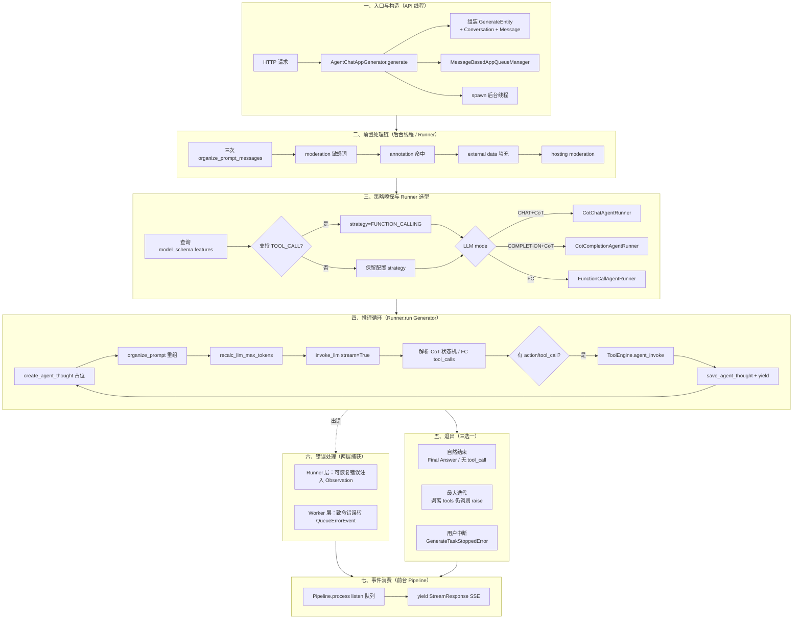
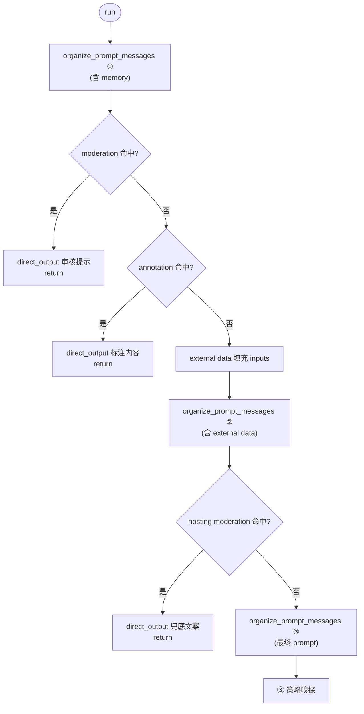
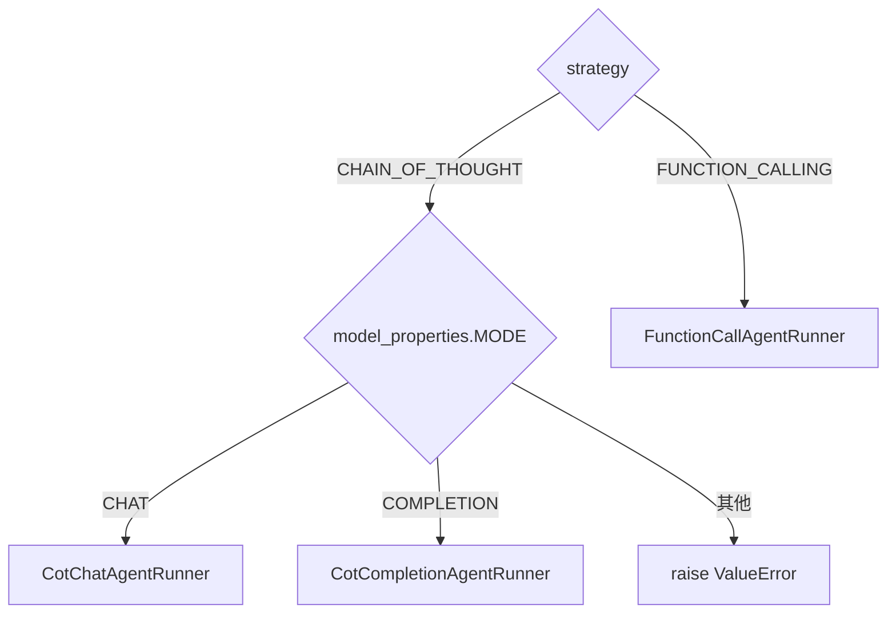
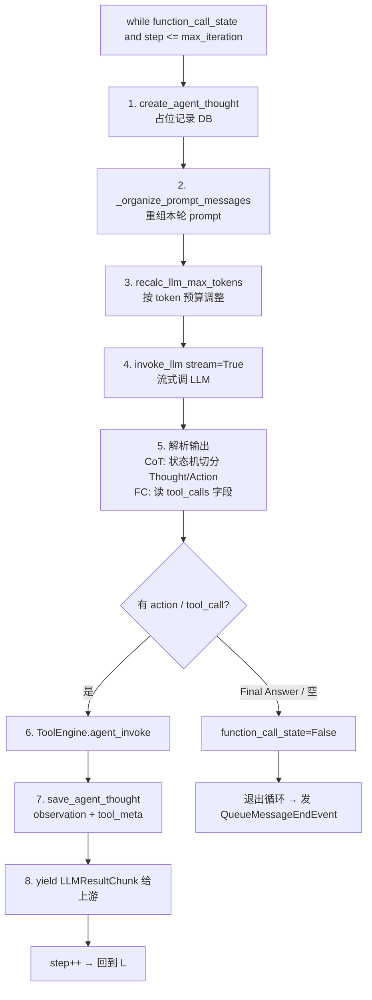
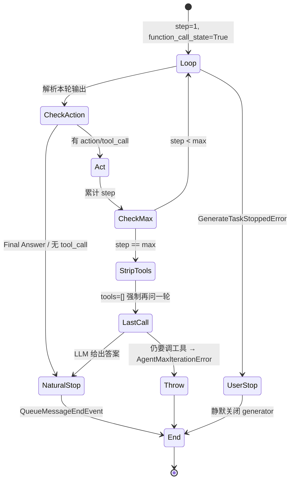
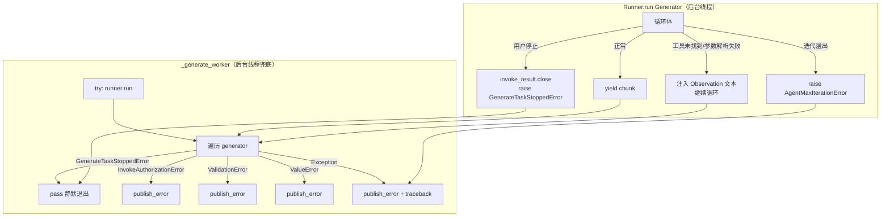
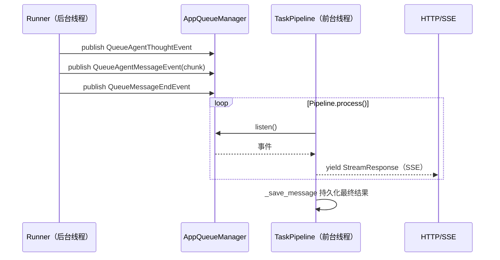
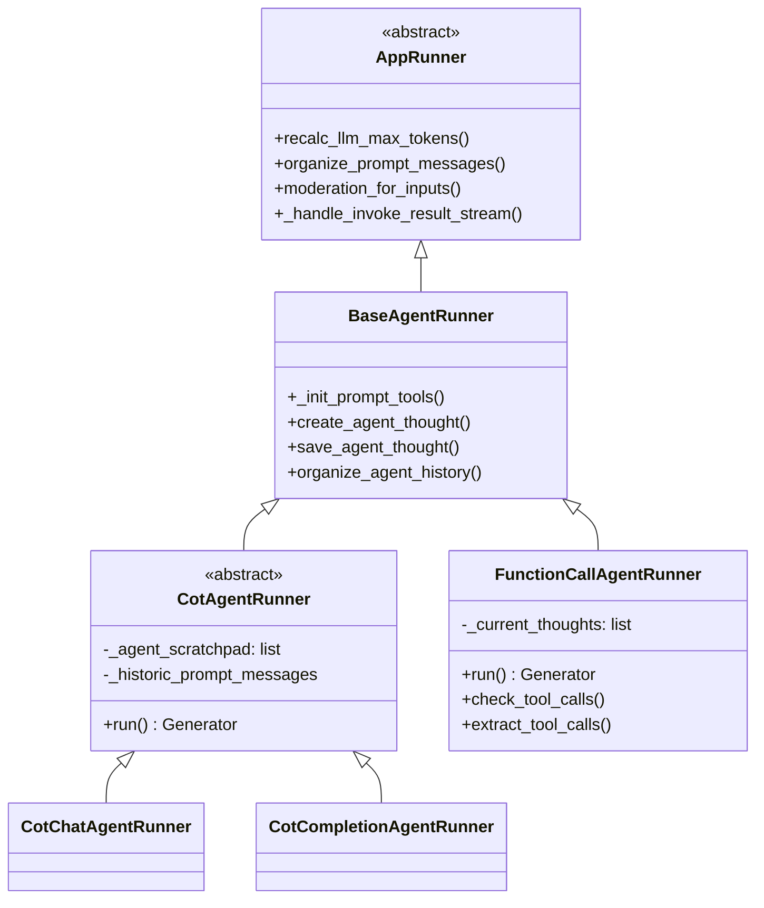
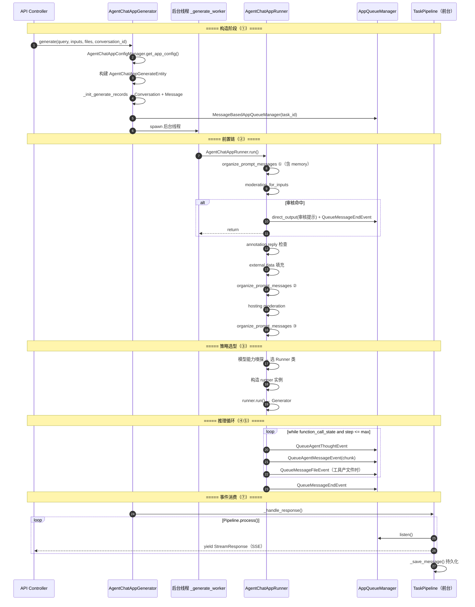

# Agent 运行时与控制流

> **学习目标**：理解 Dify Agent 的运行时入口、策略自动分发、推理循环骨架、三个退出路径，以及 Agent 与 Workflow 的关系和四种运行模式。
>
> **读完本章你应该能回答**：
> - Dify Agent 的入口函数是什么？它在做出关键决策前做了哪些前置处理？
> - 策略嗅探是怎么工作的？为什么 Dify 让模型能力自动选 CoT/FC，而不是让用户硬选？
> - 推理循环的"骨架"是什么？一次迭代经历哪 8 个阶段，每个阶段做什么？
> - 循环有三个退出路径——自然结束、最大迭代保护、用户中断——它们各自的触发条件和处理逻辑是什么？
> - 错误分两层（可恢复 vs 致命）背后的设计哲学是什么？为什么让 LLM 看到错误文本通常比直接抛异常更好？
> - Dify 为什么用双线程 + Generator 模型？后台线程和前台线程各自的职责是什么？
> - Agent 和 Workflow 在控制权、节点调度、工具调用三个维度上有什么本质区别？
> - Agent V2（Plugin Agent Strategy）为什么要迁移到 Graphon 引擎？

## 本章要解决的问题

Dify 的 Agent 应用要回答一个工程难题：**如何把一次用户对话，从 HTTP 请求一路驱动到 LLM 的多轮推理循环（think → act → observe），再安全地退出，同时满足四个互相拉扯的约束——不阻塞 HTTP、逐 token 流式输出、用户可随时中断、每一步可观测可回放**。

这四个约束任何一个单独满足都不难，合在一起就排除了几乎所有"简单"方案：直接在 HTTP 请求里同步跑 LLM 循环会阻塞 Gunicorn worker 并触发 Nginx 60s 超时；丢到 Celery 异步任务里又丢失了流式能力；纯同步 generator 无法响应"用户已点击停止"；而不落库每一步思考，调试时就成了黑盒。

Dify 的解法是**"双线程 + Generator + 事件队列"**：HTTP 请求线程立刻返回一个 SSE 流，真正的推理在后台线程跑 Generator 逐 token 产出，产出的 token 包成事件丢进 `AppQueueManager`，前台 Pipeline 从队列消费转成 SSE。这个解法的核心载体就是 Agent 运行时——本章拆解的组件。它坏了，Dify 的所有 Agent 应用就退回成"一次性问答"，丢失工具调用、记忆、可中断、可观测全部能力。

## 宏观架构：一次 Agent 请求的生命周期

下图是 Agent Chat 请求从 API 进入到 SSE 流返回的完整生命周期，也是全文的叙事主线——后续每一节对应生命周期的一个阶段。



理解这张图的关键：**后台线程和前台线程通过 `AppQueueManager` 解耦**。后台线程只管"跑循环、产事件、丢队列"；前台线程只管"听队列、转 SSE"。这种解耦让"流式"和"可中断"同时成立——前台随时可以停止消费，后台通过异常感知到停止。

下面按这七个阶段逐层展开。

## 一、入口与构造

**这一节为什么存在**：Agent 的执行不在 HTTP 请求线程里跑，但 HTTP 请求必须先"造好"执行所需的全部上下文（配置、记录、队列、线程），否则后台线程无从启动。

入口是 `AgentChatAppGenerator.generate()`（app_generator.py:69）。它做四件事：组装配置、初始化记录、建队列、起后台线程。

```python
# app_generator.py:152-185 配置 → GenerateEntity
app_config = AgentChatAppConfigManager.get_app_config(
    app_model=app_model, app_model_config=app_model_config,
    conversation=conversation, override_config_dict=override_model_config_dict,
)
application_generate_entity = AgentChatAppGenerateEntity(
    task_id=str(uuid.uuid4()), app_config=app_config, ...
)

# app_generator.py:188-198 记录 + 队列
(conversation, message) = self._init_generate_records(application_generate_entity, conversation)
queue_manager = MessageBasedAppQueueManager(task_id=..., message_id=message.id, ...)

# app_generator.py:203-215 起后台线程（携带 Flask context + contextvars）
worker_thread = threading.Thread(
    target=self._generate_worker,
    kwargs={"flask_app": current_app._get_current_object(), "context": context, ...},
)
worker_thread.start()

# app_generator.py:218-226 立刻返回 SSE 流
response = self._handle_response(...)
return AgentChatAppGenerateResponseConverter.convert(response=response, ...)
```

几个关键设计决策：

- **`task_id` 是全链路追踪键**：`uuid.uuid4()` 生成，贯穿 GenerateEntity、QueueManager、Message 记录。后台线程和前台 Pipeline 通过它找到同一个队列。
- **后台线程必须携带 Flask context 和 contextvars**：因为 SQLAlchemy session、`current_app`、请求级 tracing 都依赖上下文变量，新线程默认丢失。`preserve_flask_contexts` + `contextvars.copy_context()` 把上下文"打包"带过去（app_generator.py:201、app_generator.py:247）。
- **HTTP 请求不等后台完成**：`worker_thread.start()` 后立刻调 `_handle_response` 返回 SSE 流。这是"不阻塞 HTTP"的物理实现。
- **Agent Chat 不支持 blocking 模式**（app_generator.py:87-88）：`if not streaming: raise ValueError("Agent Chat App does not support blocking mode")`。Agent 本质是多轮循环，blocking 模式下用户无法看到中间步骤，失去意义。

配置组装的细节（`AgentChatAppConfigManager.get_app_config` 从 `AppModelConfig` + `Conversation` + `override_config_dict` 三来源合并）属于配置层，详见 [02-app-config-layer.md](./dify-02-app-config-layer.md)。本节只关注它产出的 `AgentChatAppConfig.agent: AgentEntity`——驱动 Runner 选型的核心配置对象（字段全表见附录 A）。

## 二、前置处理链

**这一节为什么存在**：在进入推理循环之前，Runner 要先把"用户原始输入"加工成"LLM 可安全执行的 prompt"，并沿途拦截几类无需推理就能回答的情况（敏感词、标注命中）。这条前置链决定了循环的输入质量。

入口是 `AgentChatAppRunner.run()`（app_runner.py:32）。它的前半段是一条**带早退的前置链**：



三个值得理解的点：

**1. 为什么 prompt 要重组三次？** 因为输入在链路上演化（app_runner.py:74、app_runner.py:144、app_runner.py:172）：

| 第几次 | 位置 | 此时 inputs 包含 | 用途 |
|--------|------|------------------|------|
| ① | line 74 | prompt 模板 + 用户输入 + memory | 给 moderation / annotation / direct_output 提供 fallback prompt |
| ② | line 144 | 上面 + external data 填充结果 | 给 hosting moderation 检查完整内容 |
| ③ | line 172 | 同 ② | 最终传给 Runner 构造函数的 `prompt_messages` |

每次重组都不可省——少了第 ② 次，external data 进不了 prompt；少了第 ③ 次，Runner 拿不到基线 prompt。

**2. 早退用 `direct_output`，不走推理循环**：moderation 命中、annotation 命中、hosting moderation 命中三处都调 `direct_output`（base_app_runner.py:169）把预设文本逐 token 推进队列再发 `QueueMessageEndEvent`，然后 `return`。这避免了"为了说一句'你输入了敏感词'还跑一轮 LLM"的浪费。

**3. memory 是只读快照**：`TokenBufferMemory(conversation, model_instance)`（app_runner.py:69）在构造阶段一次性读取对话历史，运行中不写回。Agent 的历史回放由 `BaseAgentRunner.organize_agent_history`（base_agent_runner.py:350）另走一条路（详见 [05-agent-context.md](./dify-05-agent-context.md)），memory 只负责 token 预算裁剪。

## 三、策略嗅探与 Runner 选型

**这一节为什么存在**：Agent 有两种推理范式（CoT ReAct 提示工程、FC 原生函数调用），选错会直接失败——把 FC 提示喂给不支持 tool_calls 的模型，模型会输出无法解析的文本。这一阶段决定"用哪种范式跑循环"。

Dify 不让用户硬选，而是**根据模型能力自适应**（app_runner.py:182-189）：

```python
llm_model = cast(LargeLanguageModel, model_instance.model_type_instance)
model_schema = llm_model.get_model_schema(model_instance.model_name, model_instance.credentials)

# 嗅探：模型 features 声明了 TOOL_CALL → 强制走 FC
if {ModelFeature.MULTI_TOOL_CALL, ModelFeature.TOOL_CALL}.intersection(model_schema.features or []):
    agent_entity.strategy = AgentEntity.Strategy.FUNCTION_CALLING
```

这里有一个**配置与能力的优先级问题**：用户在 `agent_mode.strategy` 里可能配了 `"cot"`，但如果模型支持原生 tool_call，运行时会被**覆盖为 FUNCTION_CALLING**。原因是 FC 在支持它的模型上更可靠（结构化字段 vs 文本解析），且支持多工具并行。配置层只负责"用户意图的初始值"，运行时用模型能力做最终裁决。

配置层的初始 strategy 由 `AgentConfigManager.convert` 决定（manager.py:20-30）：

| 配置值 | 映射 |
|--------|------|
| `"function_call"` | `FUNCTION_CALLING` |
| `"cot"` 或 `"react"` | `CHAIN_OF_THOUGHT` |
| 旧配置无显式 strategy | OpenAI → `FUNCTION_CALLING`，其他 → `CHAIN_OF_THOUGHT` |

选好 strategy 后，再按 LLM mode 选具体 Runner 类（app_runner.py:206-217）：



为什么 CoT 要再分 Chat / Completion？因为 ReAct 提示模板对 chat 模型和 completion 模型的拼法不同——chat 模型用多轮 message，completion 模型把所有内容拼成一段文本。`CotChatAgentRunner` 和 `CotCompletionAgentRunner` 几乎只在 `_organize_prompt_messages()` 这一步分叉，公共逻辑都在父类 `CotAgentRunner`。继承结构见附录 B。

构造 Runner 实例（app_runner.py:219-232）后，调用 `runner.run()` 拿到一个 Generator，交给 `_handle_invoke_result` 进入流式处理。

## 四、推理循环骨架

**这一节为什么存在**：这是 Agent 运行时的心脏——一个"while 有工具调用且未超迭代"的循环，每轮重新组装 prompt、调 LLM、解析输出、执行工具、落库、yield。理解了这 8 步，看任何 Runner 代码都能快速定位。

`CotAgentRunner.run()`（cot_agent_runner.py:47）和 `FunctionCallAgentRunner.run()`（fc_agent_runner.py:35）共享同一套骨架，只是"解析输出"和"工具调用"两步的实现不同：



三个关键状态变量控制循环：

- `function_call_state`：本轮是否有工具调用。每轮开头置 `False`，解析时发现 action/tool_call 才置 `True`。`True` 才进下一轮。
- `iteration_step`：当前迭代计数，`1..max_iteration_steps`。
- `_agent_scratchpad`（CoT，cot_agent_runner.py:42）/ `_current_thoughts`（FC，base_agent_runner.py:122）：累积的 prompt 片段，下一轮重组 prompt 时拼进去。

**8 步各自的存在理由**：

- **第 1 步占位记录**（base_agent_runner.py:220）：先在 DB 开一条 `MessageAgentThought` 空记录，等会儿回填。这是可观测性的关键——即使中途崩溃，已有占位记录可查。
- **第 2 步重组 prompt**：每轮都要把历史 + 上一轮的 scratchpad/tool_response 重新拼进去。CoT 走抽象方法 `_organize_prompt_messages`（cot_agent_runner.py:368，子类实现），FC 走 fc_agent_runner.py:453。
- **第 3 步重算 max_tokens**（base_app_runner.py:54）：`prompt_tokens + max_tokens` 若超出模型 context 上限，就压低 `max_tokens`，防止 LLM 报 context overflow。
- **第 4 步真正调 LLM**：`stream=True` 让响应以 chunk 流返回，避免长时间无响应触发 Nginx 超时。这是"流式"的物理实现。
- **第 5 步解析**：两种范式分叉最大。
  - **CoT** 用 `CotAgentOutputParser.handle_react_stream_output`（cot_agent_runner.py:136）把流式文本切成 `Thought / Action / Observation`，识别 `Action: {"action": "...", "action_input": ...}` 结构。
  - **FC** 直接读 `chunk.delta.message.tool_calls` 字段（fc_agent_runner.py:122），无需文本解析。
- **第 6-7 步工具 + 落库**：`ToolEngine.agent_invoke` 执行工具（详见 [04-agent-reasoning.md](./dify-04-agent-reasoning.md)），`save_agent_thought`（base_agent_runner.py:262）把 observation 和 tool_meta 回填到第 1 步的占位记录。
- **第 8 步 yield**：把 LLM 的 chunk yield 给上游 `_handle_invoke_result_stream`（base_app_runner.py:274），由它包成 `QueueAgentMessageEvent` 推队列。

> 流式事件如何推送到前端、事件类型体系详见 [06-async-tasks-and-events.md](./dify-06-async-tasks-and-events.md) §4。

## 五、退出路径

**这一节为什么存在**：循环不能无限跑，必须有"何时停"的机制。Dify 设计了三个互斥的退出路径，分别对应"模型说完了""系统强制停""用户让停"——它们的触发条件、处理逻辑、用户体验完全不同。



### 5.1 自然结束

**CoT**（cot_agent_runner.py:204-221）：靠 prompt 里约定的 `final answer` 标记。`AgentScratchpadUnit.is_final()`（entities.py:59-65）判定——`action` 为空，或 `action_name` 同时含 "final" 和 "answer"（大小写不敏感）。

```python
if not scratchpad.action:
    final_answer = ""  # 解析失败（有 Thought 没 Action）→ 直接结束
else:
    if scratchpad.action.action_name.lower() == "final answer":
        # 标准 ReAct 终止信号
        match scratchpad.action.action_input:
            case dict(): final_answer = json.dumps(...)
            case str():  final_answer = scratchpad.action.action_input
            case _:      final_answer = f"{scratchpad.action.action_input}"
    else:
        function_call_state = True  # 进入工具调用分支
```

**FC**（fc_agent_runner.py:113-124）：没有显式 "Final Answer" 信号——只要模型**不**返回 `tool_calls` 字段，`function_call_state` 保持 `False`，while 条件不满足就退出。

```python
# 每轮开头
function_call_state = False
# 解析 chunk 时
if self.check_tool_calls(chunk):
    function_call_state = True  # 发现 tool_call 才置 True
    tool_calls.extend(self.extract_tool_calls(chunk) or [])
# 整轮没发现 tool_call → function_call_state 保持 False → while 退出
```

两种机制的取舍：
- **CoT 的标记法**不需任何特殊 API 字段，但 LLM 可能忘了写 `final answer` 陷入死循环。
- **FC 的空 tool_calls 法**依赖 API 语义约定，更可靠，但需要模型支持原生 FC。

### 5.2 最大迭代保护

两个 Runner 都用 `max_iteration_steps = min(app_config.agent.max_iteration, 99) + 1`（cot_agent_runner.py:77、fc_agent_runner.py:52）——业务可配 1..99，实际步数 2..100。`99` 上限是硬保护，防止用户配 10000 让 Agent 跑几小时。

保护分两层——**软强制 + 硬强制**：

1. **软强制（剥离工具）**：到达最后一轮时把工具清空（cot_agent_runner.py:107-109、fc_agent_runner.py:80-82）：
   ```python
   if iteration_step == max_iteration_steps:
       self._prompt_messages_tools = []   # CoT
       prompt_messages_tools = []          # FC
   ```
   LLM 在没有工具可选时，绝大多数情况会给出最终答案。

2. **硬强制（抛异常）**：如果剥离工具后 LLM 仍坚持调工具，说明推理"卡死"，抛 `AgentMaxIterationError`（cot_agent_runner.py:176-178、fc_agent_runner.py:224-225）：
   ```python
   # CoT
   if iteration_step == max_iteration_steps and scratchpad.action:
       if scratchpad.action.action_name.lower() != "final answer":
           raise AgentMaxIterationError(app_config.agent.max_iteration)
   # FC
   if iteration_step == max_iteration_steps and tool_calls:
       raise AgentMaxIterationError(app_config.agent.max_iteration)
   ```

> 注意：这不是"额外重试一轮"，而是循环的**最后一轮**——剥离工具发生在最后一轮开头，抛异常发生在最后一轮解析后。自然结束和最大迭代的"最后一次 LLM 调用"语义不同：前者 LLM 自己想通了，后者是被剥夺工具后被迫回答。

### 5.3 用户中断

用户点停止按钮时，前台停止消费队列，后台通过 `GenerateTaskStoppedError` 感知。捕获点在 `_handle_invoke_result_stream`（base_app_runner.py:340-343）：

```python
except GenerateTaskStoppedError:
    # Explicitly close provider stream to stop in-flight token generation ASAP.
    invoke_result.close()
    raise
```

关键动作：
- **显式 `invoke_result.close()`**：关闭上游 LLM provider 的流，立即停止 token 生成，省钱。
- **异常向上抛**：让 `_generate_worker` 的 `except GenerateTaskStoppedError: pass`（app_generator.py:261-262）静默收尾。
- **已落库的 `MessageAgentThought` 不回滚**：这些是用户已经看到的步骤，回滚会破坏可观测性。用户停止意味着"不要再往前走"，不是"撤销之前的内容"。

### 5.4 三种退出对比

| 退出类型 | 触发条件 | LLM 调用次数 | 用户感知 |
|---------|---------|-------------|---------|
| 自然结束 | Final Answer / 无 tool_call | 取决于任务（1..N） | 正常流式结束 |
| 强制收敛 | step==max 且仍调工具 | 跑满 max_iteration_steps | `QueueErrorEvent` 显示错误 |
| 用户中断 | 前台停止消费 | 立即截断 | 流静默关闭（无错误事件） |

## 六、错误的两层捕获

**这一节为什么存在**：Agent 运行时跨两个线程（Runner 在后台、Pipeline 在前台），错误必须在这两层之间合理流转。Dify 的设计是：可恢复错误在 Runner 层注入上下文让 LLM 自主决策，致命错误在 Worker 层统一转成 `QueueErrorEvent`。这种分层让 Runner 专注业务、Worker 专注事件转换。



### 6.1 可恢复错误：注入上下文

工具层错误不终止循环，而是转成文本注入 Observation，让 LLM 自主决定下一步（重试、换工具、放弃）：

| 错误 | 发生位置 | 处理 | LLM 看到的内容 |
|------|---------|------|---------------|
| 工具未找到 | `_handle_invoke_action` / FC `run` | 返回 `"there is not a tool named X"`（cot_agent_runner.py:309、fc_agent_runner.py:235） | 错误文本，可换工具 |
| 工具初始化失败 | `_init_prompt_tools` | `except Exception: continue` 静默跳过（base_agent_runner.py:195-197） | 该工具不可用 |
| 参数 JSON 解析失败 | `_handle_invoke_action` | 吞 `JSONDecodeError`，原字符串直传（cot_agent_runner.py:312-316） | 工具收到原始字符串 |

这种"错误即 Observation"模式的好处：**适应性**（不同 LLM 处理错误方式不同，硬编码 fallback 反而限制发挥）、**可观测性**（所有失败显式记录到历史）、**简洁性**（核心逻辑只管"调工具→拿结果"，错误是附加到结果而非控制流分支）。

### 6.2 致命错误：终止并推送事件

致命错误由 `_generate_worker` 统一捕获（app_generator.py:261-276），转成 `QueueErrorEvent` 让前台感知：

| 错误 | 触发条件 | 捕获分支 | 用户感知 |
|------|---------|---------|---------|
| `AgentMaxIterationError` | 最大迭代仍调工具 | `except Exception` 兜底（line 274） | `QueueErrorEvent` |
| `InvokeAuthorizationError` | 模型 API Key 错误 | 专用捕获（line 263） | `QueueErrorEvent` |
| `ValidationError` | Pydantic 校验失败 | 专用捕获（line 267） | `QueueErrorEvent` |
| `ValueError` | 参数错误 | 专用捕获（line 270） | `QueueErrorEvent`（DEBUG 时记日志） |
| 通用 `Exception` | 未分类异常 | 兜底（line 274） | `QueueErrorEvent` + traceback |
| `GenerateTaskStoppedError` | 用户停止 | 专用捕获（line 261） | **静默退出，不发错误事件** |

`GenerateTaskStoppedError` 是特殊的——它**不**推送 `QueueErrorEvent`，而是 `pass` 静默退出。设计意图："用户停止"不等于"出错"，UI 上按停止按钮和收到错误是两种心理感受。

两层捕获带来的关注点分离：Runner 专注业务逻辑（raise 或 yield），Worker 专注错误→事件转换，前台 Pipeline 只 listen 队列消费已格式化的 `ErrorStreamResponse`。如果三层各自 try/except，错误流转会散落难追。

## 七、事件消费与 SSE

**这一节为什么存在**：后台线程产出的事件最终要变成前端的 SSE 流。这一阶段是"生产-消费"的消费者侧，理解它才能解释为什么 Runner 不直接写 HTTP 响应。

前台 `_handle_response` 返回一个 generator，`Pipeline.process()` 内部 `listen()` 队列（app_generator.py:218-225）：



关键决策：
- **Runner 不直接写 HTTP**：它只 `publish` 事件到队列。这让 Runner 可以在后台线程跑，与 HTTP 线程解耦。
- **Pipeline 统一消费**：`EasyUIBasedGenerateTaskPipeline._process_stream_response` 把 `QueueAgentMessageEvent` 转成 `AgentMessageStreamResponse`，`QueueErrorEvent` 转成 `ErrorStreamResponse` 并 break 出监听循环。
- **`QueueMessageEndEvent` 是终止信号**：Pipeline 收到后停止 listen，调 `_save_message` 落库最终结果。

事件类型体系、WebSocket/SSE 推送路径、心跳重连详见 [06-async-tasks-and-events.md](./dify-06-async-tasks-and-events.md)。

## 收敛

### 边界：Agent vs Workflow

Agent 和 Workflow 不是"哪个更好"，而是解决不同问题的两类应用模式：

| 维度 | Agent | Workflow |
|------|-------|----------|
| 控制者 | LLM 自主决策（黑盒） | 开发者显式定义（白盒） |
| 节点调度 | 动态生成（推理循环） | 预定义拓扑（Graphon 引擎） |
| 工具调用 | `ToolEngine.agent_invoke` 在循环内 | 节点边显式调用 |
| 适用场景 | 开放问题、对话 | 固定流程、业务自动化 |
| 可控性 | 低 | 高 |

**不该在这里做的事**：用 Agent 跑固定流程（不可重复、难调试）、用 Workflow 处理开放对话（缺乏推理灵活性）。很多生产场景组合使用——Workflow 里嵌 Agent 节点处理需推理的子任务，详见 [11-workflow-engine.md](./dify-11-workflow-engine.md)。

### 演进方向：Agent V2 迁移到 Graphon

Dify 已把第二代 Agent 节点（`agent_v2`）迁移到 Graphon 引擎，让 Agent 作为工作流节点共享节点调度、错误处理、可观测性基础设施。连接器是 `PluginAgentStrategy`（strategy/plugin.py:12）：

```python
class PluginAgentStrategy(BaseAgentStrategy):
    def _invoke(self, params, user_id, ...):
        manager = PluginAgentClient()
        yield from manager.invoke(
            tenant_id=self.tenant_id,
            agent_provider=self.declaration.identity.provider,
            agent_strategy=self.declaration.identity.name,
            agent_params=convert_parameters_to_plugin_format(initialized_params),
            ...
        )
```

动机：统一基础设施（Graphon 已有可观测性层、配额层、超时控制）、节点复用（Agent 成为工作流里的一类节点）、插件生态统一（所有 Agent 策略通过 Plugin Daemon 执行）。理解这个迁移后应意识到：**未来 Dify 的"Agent"更多是"工作流里一种特殊节点"**，而不是独立运行时。这与 LangGraph 等独立 Agent 运行时框架有本质差异。

### 本章要点

1. **入口在 `AgentChatAppGenerator.generate`**：组装配置 + 起后台线程 + 立刻返回 SSE 流，HTTP 不阻塞。
2. **前置链三次重组 prompt**：输入随 memory → external data 演化，每次重组不可省。
3. **策略嗅探覆盖用户配置**：模型支持 TOOL_CALL → 强制 FC，否则按配置走 CoT。
4. **循环骨架 8 步**：占位 → 重组 → recalc → invoke → 解析 → 工具 → 落库 → yield。
5. **三个退出路径**：自然结束（Final Answer / 无 tool_call）、最大迭代（剥离 tools 仍调→raise）、用户中断（close generator）。
6. **`max_iteration_steps = min(config, 99) + 1`**：业务 1..99，实际 2..100。
7. **错误两层捕获**：Runner 注入可恢复错误到 Observation，Worker 把致命错误转 `QueueErrorEvent`。
8. **双线程 + Generator + 事件队列**：后台跑循环产事件，前台 listen 队列转 SSE——这是流式 + 可中断 + 不阻塞 HTTP 同时成立的物理基础。

### 推荐源码入口

| 文件 | 职责 |
|------|------|
| api/core/app/apps/agent_chat/app_generator.py | 入口：构造 GenerateEntity、起后台线程、返回 SSE |
| api/core/app/apps/agent_chat/app_runner.py | 前置链、策略嗅探、Runner 分发 |
| api/core/agent/base_agent_runner.py | 公共底座：工具初始化、thought 落库、历史回放 |
| api/core/agent/cot_agent_runner.py | CoT ReAct 状态机循环 |
| api/core/agent/fc_agent_runner.py | FC 原生 tool_calls 循环 |
| api/core/agent/entities.py | `AgentEntity`、`AgentScratchpadUnit` 数据模型 |
| api/core/agent/errors.py | `AgentMaxIterationError` |
| api/core/agent/strategy/plugin.py | V2 插件化 Agent 策略连接器 |
| api/core/app/apps/base_app_runner.py | `AppRunner` 基类、`_handle_invoke_result_stream`、用户中断处理 |
| api/core/app/app_config/easy_ui_based_app/agent/manager.py | `agent_mode.strategy` 配置映射 |

---

## 附录

### A. AgentEntity 配置字段全表

`AgentEntity`（entities.py:68）由 `AgentConfigManager.convert` 从 `agent_mode` 配置字典构造：

| 字段 | 类型 | 默认值 | 影响 |
|------|------|--------|------|
| `provider` | `str` | 必填 | 模型提供商，决定走哪个 model runtime |
| `model` | `str` | 必填 | 具体模型名，影响 token 计算和功能嗅探 |
| `strategy` | `Strategy` | 必填 | `FUNCTION_CALLING` 或 `CHAIN_OF_THOUGHT`，决定 Runner 选型 |
| `prompt` | `AgentPromptEntity \| None` | `None` | CoT 的 ReAct prompt 模板；FC 模式为 `None` |
| `tools` | `list[AgentToolEntity] \| None` | `None` | Agent 可调用的工具列表 |
| `max_iteration` | `int` | `10` | 最大推理迭代次数 |

`AgentToolEntity` 字段：`provider_type`（builtin/api/workflow/mcp/plugin）、`provider_id`、`tool_name`、`tool_parameters`、`plugin_unique_identifier`（内置为 None）、`credential_id`（无凭据为 None）。

`prompt` 在 FC 模式下为 `None` 是有意的——FC 依赖模型原生 tool_calls，不需要 ReAct 模板；标 None 让代码路径明确"这里没有 prompt 拼接逻辑"。

配置对象层级：

```
AgentChatAppConfig
  ├── agent: AgentEntity | None
  │     ├── provider, model, strategy, max_iteration
  │     ├── prompt: AgentPromptEntity (first_prompt, next_iteration)
  │     └── tools: list[AgentToolEntity]
  ├── model: ModelConfigEntity
  ├── prompt_template: PromptTemplateEntity
  ├── dataset: DatasetEntity | None
  └── ... (variables, sensitive_word_avoidance 等)
```

### B. Runner 继承结构



三层抽象的职责：
- **`AppRunner`**（base_app_runner.py:53）：所有应用 Runner 的基类，提供 `recalc_llm_max_tokens`、`organize_prompt_messages`、`moderation_for_inputs`、`_handle_invoke_result_stream`。
- **`BaseAgentRunner`**（base_agent_runner.py:50）：Agent 通用逻辑——工具初始化、`MessageAgentThought` 落库、历史回放。
- **`CotAgentRunner`**（cot_agent_runner.py:38）：ReAct 状态机（`_agent_scratchpad`）。`CotChat` / `CotCompletion` 仅在 `_organize_prompt_messages()` 分叉。

### C. 四种 Agent 运行模式

| 模式 | 类 | 输入 | 输出 | 推理策略 |
|------|------|------|------|---------|
| Agent Chat | `AgentChatApp` | 消息 + 历史 + 附件 | 流式 `QueueAgentMessageEvent` | CoT(Chat) / FC |
| Agent Completion | `AgentCompletionApp` | 纯文本 | 纯文本 | CoT(Completion) |
| Advanced Chat | `AdvancedChatApp` | 消息 + 对话变量 | 流式 | 走 Workflow 引擎 |
| Chat | `ChatApp` | 消息 + 历史 | 流式 | 无工具 |

> 当前 `app_runner.py` 只实现 Agent Chat 路径（app_runner.py:32-249），其他模式分布在 `api/core/app/apps/` 各子目录。

四种模式是"是否有工具调用 × 是否多轮 × 是否流式"三个维度交叉的产物。Dify 把它们做成 AppMode 是为了 UI 上对应不同入口，而非实现难度差异。

### D. 端到端时序（完整版）



---

> **相关文档**：Agent 推理策略与工具调用的深度解析见 [04-agent-reasoning.md](./dify-04-agent-reasoning.md)；上下文、记忆与持久化见 [05-agent-context.md](./dify-05-agent-context.md)；事件系统与流式输出见 [06-async-tasks-and-events.md](./dify-06-async-tasks-and-events.md)；配置层细节见 [02-app-config-layer.md](./dify-02-app-config-layer.md)。
