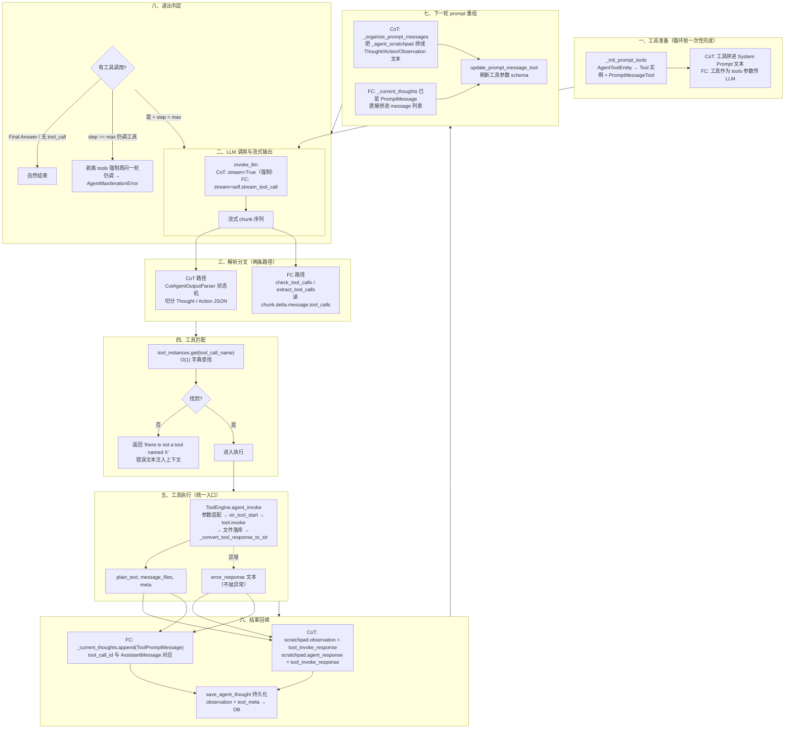
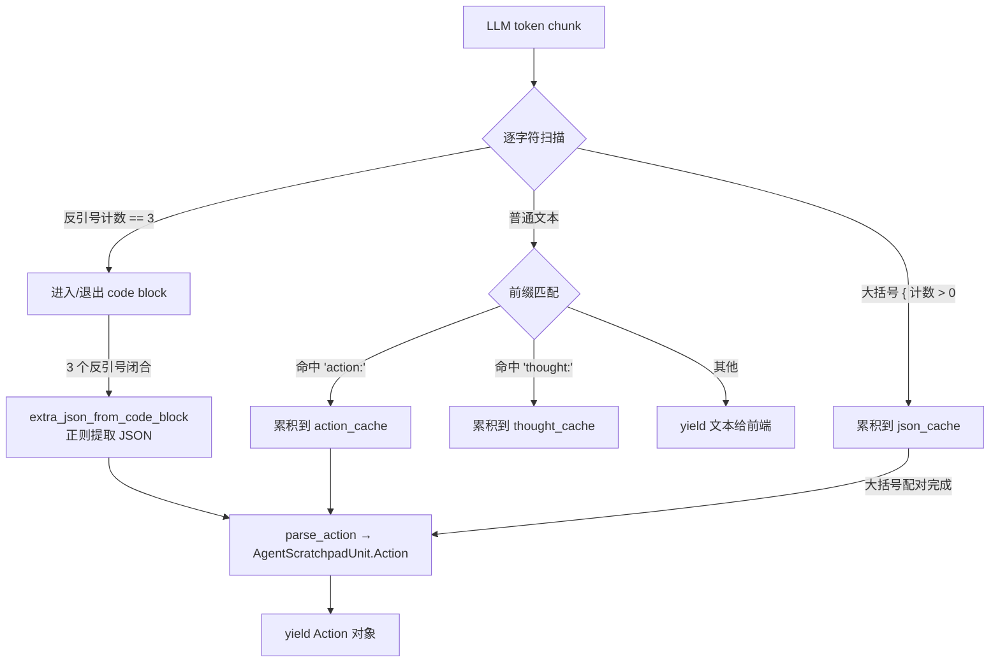
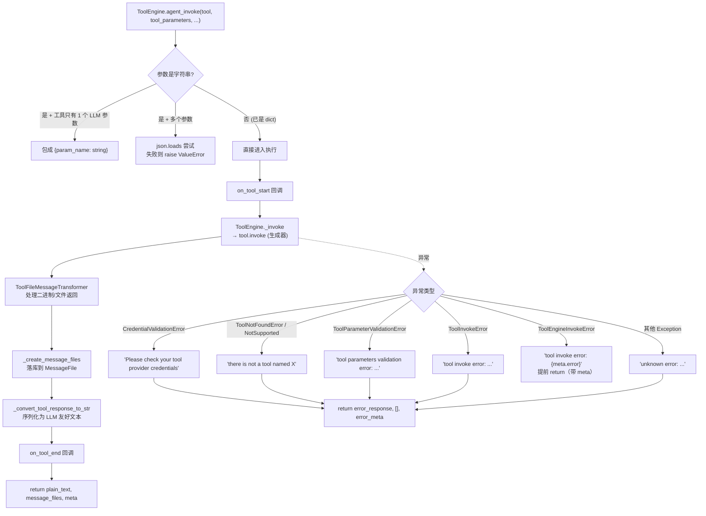
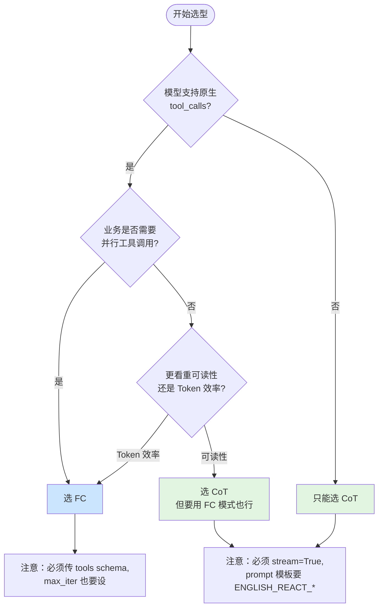
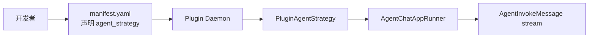
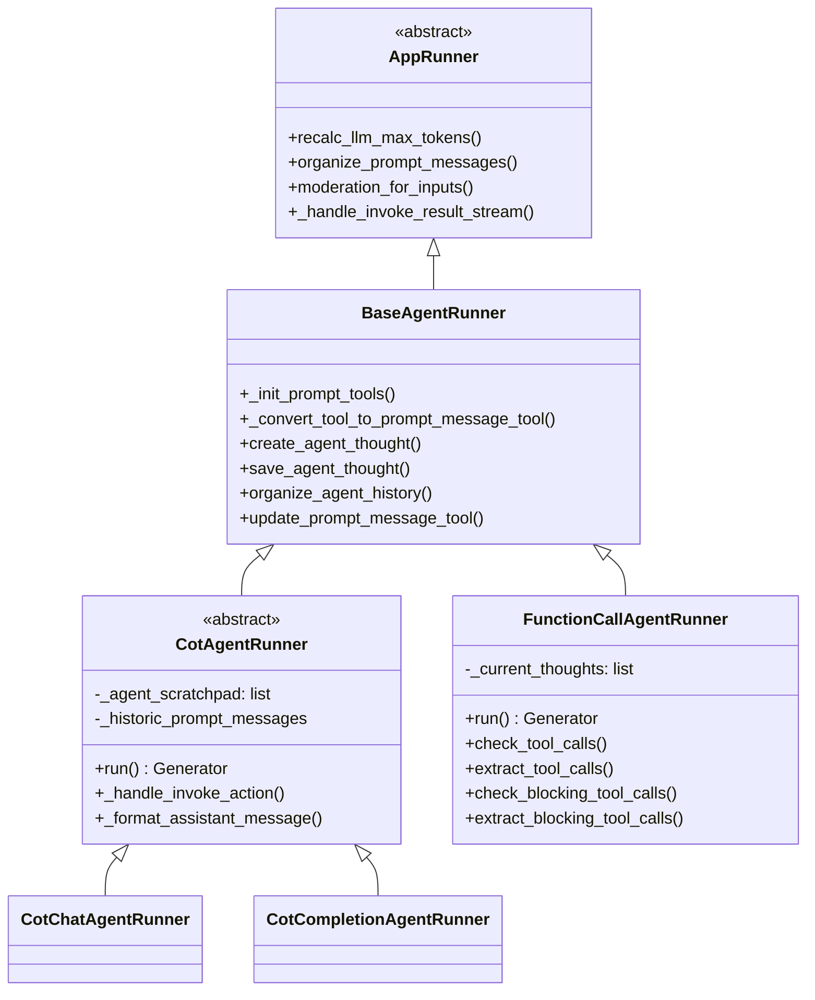

# Agent 推理策略与工具调用

> **学习目标**：深入理解 CoT（Chain of Thought）与 FC（Function Calling）两种推理策略的实现细节、`BaseAgentRunner` 公共底座、工具调用层 `ToolEngine.agent_invoke()`，以及如何开发自定义 Agent 工具。
>
> **读完本章你应该能回答**：
> - CoT 和 FC 两种推理策略的核心差异是什么？它们各自的"prompt 工程"假设是什么？
> - `_agent_scratchpad` 在 CoT 中扮演什么角色？它和 `_current_thoughts`（FC）的本质区别是什么？
> - `CotAgentOutputParser` 为什么必须用流式（stream）解析？状态机切分 Thought/Action 的关键是什么？
> - FC 模式如何实现工具并行？CoT 为什么不能？
> - `BaseAgentRunner` 提供哪些公共能力？子类分别覆盖了哪些？
> - `ToolEngine.agent_invoke()` 的统一入口如何处理参数多样性、文件返回、异常降级？
> - 错误为什么转成 Observation/ToolMessage 注入上下文，而不是抛异常？
> - 开发自定义工具时有哪些切入点？插件化模式相比 Python 内置模式有什么优势？
> - 面对一个新业务需求，应该如何选 CoT 还是 FC？决策的依据是什么？

## 本章要解决的问题

LLM 是一个"会说话"的引擎——给它一段自然语言，它返回一段自然语言。但 Agent 要做的事情远比"说话"多：它需要查数据库、调 API、搜索知识库、执行代码。这些动作需要的是**结构化的函数调用**（工具名 + 参数字典），不是一段漂亮的散文。这中间有一道鸿沟：LLM 的自然语言输出，如何被可靠地翻译成可执行的工具调用？工具执行完的结果，又如何回填给 LLM 让它决定下一步？

如果没有这一层解析与调度，Agent 就退化成"只能想不能做"的聊天机器人——开发者必须为每个工具手写胶水代码：从 LLM 输出里正则提取意图、拼参数、调函数、把结果格式化回去。这种做法在小规模能跑通，一旦工具数量超过三五个、LLM 换一个版本、输出格式漂移，整个胶水层就崩溃。更根本的问题是：工具调用的可靠性无法保证——LLM 可能漏掉必填参数、编造不存在的工具名、把字符串参数当成 JSON 传。

Dify 的解法是**两条解析路径 + 一个统一执行入口**。两条路径对应两种范式：CoT ReAct 提示工程（用 prompt 约束 LLM 输出 `Thought/Action/Observation` 格式，再用状态机解析文本）和 FC 原生函数调用（利用模型 SDK 的结构化 `tool_calls` 字段，无需文本解析）。统一执行入口是 `ToolEngine.agent_invoke`——无论哪条路径解析出的工具调用，都经过同一套参数适配、权限校验、异常降级、文件落库逻辑。这一层坏了，Agent 的工具调用就全靠手写胶水，可靠性、可观测性、可扩展性全部丧失。

## 宏观架构：一次工具调用的生命周期

下图是一次工具调用从"LLM 流式输出"到"结果回填、准备下一轮"的完整生命周期，也是全文的叙事主线——后续每一节对应生命周期的一个阶段。



理解这张图的关键：**CoT 和 FC 在第 ② 阶段分叉最大，但在第 ③④⑤ 阶段合流**——两种范式解析出的工具调用，最终都走同一个 `tool_instances.get` 查找、同一个 `ToolEngine.agent_invoke` 执行、同一套"错误转文本"的降级逻辑。分叉只在"如何从 LLM 输出中提取工具调用"这一步，合流是因为工具执行的工程问题是通用的。

下面按这八个阶段逐层展开。

## 一、工具准备：从配置到运行时实例

**这一节为什么存在**：推理循环开始前，Runner 必须把用户在 UI 上配置的工具列表（`AgentToolEntity` 配置项）转换成两种表示——给 LLM 看的"prompt 描述"和给执行器用的"运行时实例"。没有这一步，LLM 不知道有哪些工具可选，Runner 也不知道收到工具调用请求后该调哪个对象。

### 工具初始化：两个返回值

`BaseAgentRunner._init_prompt_tools()`（base_agent_runner.py:185）是所有 Runner 的工具入口，返回一个二元组：

```python
# base_agent_runner.py:185-211
def _init_prompt_tools(self) -> tuple[dict[str, Tool], list[PromptMessageTool]]:
    tool_instances = {}
    prompt_messages_tools = []

    for tool in self.app_config.agent.tools or []:
        try:
            prompt_tool, tool_entity = self._convert_tool_to_prompt_message_tool(tool)
        except Exception:
            continue  # API 类工具被删除时静默跳过
        tool_instances[tool.tool_name] = tool_entity
        prompt_messages_tools.append(prompt_tool)

    # 自动注入数据集检索工具（如果 App 配置了 dataset）
    for dataset_tool in self.dataset_tools:
        prompt_tool = self._convert_dataset_retriever_tool_to_prompt_message_tool(dataset_tool)
        prompt_messages_tools.append(prompt_tool)
        tool_instances[dataset_tool.entity.identity.name] = dataset_tool

    return tool_instances, prompt_messages_tools
```

这两个返回值分别服务于生命周期的不同阶段：

- **`tool_instances: dict[str, Tool]`** —— 工具运行时实例的字典，按 `tool_name` 索引。第 ③ 阶段工具匹配时用 `tool_instances.get(tool_name)` 做 O(1) 查找。这个字典是"执行侧"的表示——拿到工具调用请求后，用它找到真正的 Tool 对象执行。
- **`prompt_messages_tools: list[PromptMessageTool]`** —— 工具的"prompt 表示"列表，每个元素含 `name`、`description`、`parameters`（JSON Schema）。这个列表是"告诉 LLM 有哪些工具"的表示——第 ① 阶段调 `invoke_llm` 时传入。

### 工具到 PromptMessageTool 的转换

`_convert_tool_to_prompt_message_tool()`（base_agent_runner.py:135）把 `AgentToolEntity` 转成 `PromptMessageTool`：

```python
# base_agent_runner.py:135-153
def _convert_tool_to_prompt_message_tool(self, tool: AgentToolEntity) -> tuple[PromptMessageTool, Tool]:
    tool_entity = ToolManager.get_agent_tool_runtime(
        tenant_id=self.tenant_id,
        app_id=self.app_config.app_id,
        agent_tool=tool,
        user_id=self.user_id,
        invoke_from=self.application_generate_entity.invoke_from,
    )
    message_tool = PromptMessageTool(
        name=tool.tool_name,
        description=tool_entity.entity.description.llm,        # 给 LLM 看的自然语言描述
        parameters=tool_entity.get_llm_parameters_json_schema(), # JSON Schema 参数定义
    )
    return message_tool, tool_entity
```

这里有一个关键设计：**`description` 用 `llm` 字段而非 `tool` 字段**。`ToolDescription` 有两套描述——`llm` 是给 LLM 看的精简说明（"这个工具做什么、什么时候用"），`tool` 是给开发者看的详细文档。终端用户（LLM）和开发者需要不同的信息密度，所以维护两套。

`ToolManager.get_agent_tool_runtime` 是工具实例工厂，支持五种工具类型——Builtin（内置）、Custom API（自定义 API）、Workflow-as-Tool（工作流当工具）、MCP（远程 MCP Server）、Plugin（插件）。五种类型全部走同一条 `_init_prompt_tools` 入口，统一转成 `Tool` 子类实例。工具注册与发现的细节详见 [07-tool-registration.md](./dify-07-tool-registration.md)。

### CoT 与 FC 对 prompt_messages_tools 的不同用法

工具准备阶段产出的 `prompt_messages_tools`，在两种范式下的传递方式完全不同：

| 范式 | prompt_messages_tools 的去向 |
|------|---------------------------|
| CoT | 序列化成 JSON 文本，替换进 System Prompt 的 `{{tools}}` 占位符（cot_chat_agent_runner.py:32） |
| FC | 作为 `invoke_llm(..., tools=prompt_messages_tools)` 的结构化参数传给模型 SDK（fc_agent_runner.py:96） |

这个差异是两种范式的根本分野——CoT 把工具信息"塞进文本让 LLM 读"，FC 把工具信息"作为结构化参数让 SDK 处理"。它直接决定了第 ② 阶段的解析路径。

### 静默跳过的容错设计

`_init_prompt_tools` 里的 `except Exception: continue`（base_agent_runner.py:195-197）值得注意——API 类工具如果被用户在配置后删除，`get_agent_tool_runtime` 会抛异常，这里静默跳过而不是终止整个 Agent。设计意图：**单个工具的配置失效不应让整个 Agent 不可用**。代价是该工具在 prompt 中"消失"，LLM 不知道它的存在——但这比 Agent 直接崩溃好得多。

## 二、LLM 调用与流式输出

**这一节为什么存在**：工具准备好后，Runner 要把组装好的 prompt 发给 LLM，拿到响应。这一步的关键决策是"stream 还是 block"——它直接影响第 ② 阶段能否正确解析。

### CoT：强制 stream=True

```python
# cot_agent_runner.py:126-133
chunks = model_instance.invoke_llm(
    prompt_messages=prompt_messages,
    model_parameters=app_generate_entity.model_conf.parameters,
    tools=[],              # CoT 不传 tools 参数，工具已在 System Prompt 里
    stop=app_generate_entity.model_conf.stop,
    stream=True,           # 强制流式
    callbacks=[],
)
```

CoT 为什么**必须** stream？因为 `CotAgentOutputParser` 需要在 LLM 写出 `Action:` 标记的瞬间就识别出来、把后续 JSON 切走，避免 Thought 文本和 Action JSON 混在一起。如果用 block 模式（等 LLM 输出完毕再一次性解析），JSON 边界问题会变得棘手——你不知道一段 JSON 何时结束（LLM 可能在 JSON 之后又写了别的解释文字），状态机无法正确切分。

还有一个细节：CoT 传 `tools=[]`（空列表）。工具描述已经在第 ⓪ 阶段被拼进 System Prompt 的 `{{tools}}` 占位符了，不需要再通过 `tools` 参数传——否则 LLM 会看到两遍工具描述。

### FC：stream 取决于模型能力

```python
# fc_agent_runner.py:93-100
chunks = model_instance.invoke_llm(
    prompt_messages=prompt_messages,
    model_parameters=app_generate_entity.model_conf.parameters,
    tools=prompt_messages_tools,    # FC 通过 tools 参数传工具
    stop=app_generate_entity.model_conf.stop,
    stream=self.stream_tool_call,   # 由模型特性决定
    callbacks=[],
)
```

FC 的 `stream` 值来自 `self.stream_tool_call`（base_agent_runner.py:119），它是构造阶段嗅探出来的：

```python
# base_agent_runner.py:116-120
llm_model = cast(LargeLanguageModel, model_instance.model_type_instance)
model_schema = llm_model.get_model_schema(model_instance.model_name, model_instance.credentials)
features = model_schema.features if model_schema and model_schema.features else []
self.stream_tool_call = ModelFeature.STREAM_TOOL_CALL in features
self.files = application_generate_entity.files if ModelFeature.VISION in features else []
```

`STREAM_TOOL_CALL` feature 决定是否流式。这是因为有些模型 SDK（如早期 OpenAI 版本）在流式模式下 `tool_calls` 字段是分片到达的（一个 tool_call 的 `arguments` 字段可能跨多个 chunk），需要 Runner 做增量拼接；而非流式模式下 `tool_calls` 一次性完整返回。FC 的 `check_tool_calls` / `extract_tool_calls` 两种方法对这两种路径都做了适配。

### stop 序列的注入

CoT 还在循环开头注入了一个 stop 序列（cot_agent_runner.py:64-66）：

```python
if "Observation" not in app_generate_entity.model_conf.stop:
    if app_generate_entity.model_conf.provider not in self._ignore_observation_providers:
        app_generate_entity.model_conf.stop.append("Observation")
```

这是 ReAct 协议的关键约定——LLM 输出到 `Observation:` 时应该停下来，因为 Observation 的内容由 Runner 填入（工具执行结果），不是 LLM 自己编的。`_ignore_observation_providers = ["wenxin"]`（cot_agent_runner.py:40）排除了文心一言，因为它对 stop 序列的支持有兼容性问题。

## 三、输出解析：两条路径的分叉

**这一节为什么存在**：这是两种范式差异最大的阶段——CoT 要把 LLM 的自然语言文本切成结构化的 Thought / Action，FC 只需读 SDK 返回的结构化 `tool_calls` 字段。解析的可靠性直接决定工具调用能否成功。

### 2.1 CoT 状态机：CotAgentOutputParser

`CotAgentOutputParser.handle_react_stream_output()`（cot_output_parser.py:12）是 CoT 模式的灵魂——它在 LLM 还在逐 token 生成时，就实时识别出 `Thought:` / `Action:` 标记，并把后续内容分流到不同缓存。



解析器维护五个状态变量（cot_output_parser.py:55-71）：

| 状态变量 | 作用 | 触发流转 |
|---------|------|---------|
| `code_block_cache` | 累积 code block 内容 | 连续 3 个反引号 → 进入/退出 |
| `code_block_delimiter_count` | 反引号计数器 | 遇到 `\`` +1，其他归 0 |
| `in_code_block` | 是否在 code block 内 | count==3 时翻转 |
| `json_cache` | 累积裸 JSON 内容 | 遇到 `{` +1，遇到 `}` -1 |
| `json_quote_count` | 大括号配对计数 | 配对归 0 → JSON 完整 |
| `action_cache` / `thought_cache` | 前缀匹配缓存 | 命中完整前缀后清空 |

核心逻辑是**逐字符扫描 + 前缀匹配**。对每个 token chunk，解析器逐字符检查：

1. **反引号检测**（cot_output_parser.py:87-100）：遇到 `` ` `` 就累加 `code_block_delimiter_count`，到 3 时翻转 `in_code_block` 状态。这是为了识别 `Action: ```json\n&#123;...&#125;\n```` 这种代码块包裹的 JSON。
2. **Action / Thought 前缀匹配**（cot_output_parser.py:102-157）：逐字符匹配 `"action:"` 或 `"thought:"` 前缀（大小写不敏感）。匹配成功后清空缓存，后续内容按当前段落处理。
3. **大括号配对**（cot_output_parser.py:180-208）：不在 code block 时，遇到 `{` 就进入 `in_json` 状态，累积到 `json_cache`；大括号配对完成时调用 `parse_action` 解析。

### parse_action：三种 Action 形态的归一化

`parse_action`（cot_output_parser.py:15-40）把提取出的文本变成 `AgentScratchpadUnit.Action` 对象：

```python
def parse_action(action) -> Union[str, AgentScratchpadUnit.Action]:
    if isinstance(action, str):
        try:
            action = json.loads(action, strict=False)
        except json.JSONDecodeError:
            return action or ""    # 解析失败回退为字符串

    if isinstance(action, list) and len(action) == 1:
        action = action[0]         # cohere 总是返回 list

    for key, value in action.items():
        if "input" in key.lower():
            action_input = value
        else:
            action_name = value

    if action_name is not None and action_input is not None:
        return AgentScratchpadUnit.Action(action_name=action_name, action_input=action_input)
    else:
        return json.dumps(action)
```

LLM 的 Action 输出有三种形态，解析器都要识别：

| 形态 | LLM 输出示例 | 检测信号 | 提取方式 |
|------|-------------|---------|---------|
| 裸 JSON | `Action: {"action": "search", "action_input": &#123;...&#125;}` | 大括号配对 | `json.loads` |
| 代码块 | `Action: \`\`\`json\n&#123;...&#125;\n\`\`\`` | 连续 3 反引号 | `extra_json_from_code_block` 正则 |
| 后跟换行 | `Action:\n&#123;...&#125;` | 前缀匹配后大括号配对 | 同裸 JSON |

`parse_action` 还处理了 cohere 模型的特殊性——它总是把 JSON 包成 `[&#123;...&#125;]` 列表返回（cot_output_parser.py:25-26）。这种"模型差异在解析层吸收"的模式贯穿整个 Agent 框架。

### 解析输出：Action 对象 vs 文本

`handle_react_stream_output` 是一个 Generator，yield 两种类型的对象（cot_output_parser.py:73-214）：

- `str`：Thought 文本和无法解析的内容，直接 yield 给前端显示。
- `AgentScratchpadUnit.Action`：解析出的工具调用，包含 `action_name` 和 `action_input`。

CoT Runner 的循环主体消费这两种输出（cot_agent_runner.py:151-169）：

```python
for chunk in react_chunks:
    if isinstance(chunk, AgentScratchpadUnit.Action):
        action = chunk
        scratchpad.agent_response += json.dumps(chunk.model_dump())
        scratchpad.action_str = json.dumps(chunk.model_dump())
        scratchpad.action = action
    else:
        scratchpad.agent_response += chunk
        scratchpad.thought += chunk
        yield LLMResultChunk(...)  # 同时 yield 给前端
```

文本累积到 `scratchpad.thought`，Action 对象存到 `scratchpad.action`。这个 scratchpad 就是 CoT 的状态载体——下一轮 prompt 重组时，整条 scratchpad 链会被重新拼成 ReAct 格式文本。

### 2.2 FC 原生 tool_calls 解析

FC 走的是完全不同的路——模型 SDK 直接返回结构化的 `tool_calls` 字段，不需要文本解析。

#### 流式路径

当 `stream=True` 时，响应是 chunk 序列，FC Runner 逐 chunk 检查（fc_agent_runner.py:113-145）：

```python
if isinstance(chunks, Generator):
    is_first_chunk = True
    for chunk in chunks:
        if is_first_chunk:
            # 第一个 chunk 立刻推送 AgentThought 创建事件
            self.queue_manager.publish(
                QueueAgentThoughtEvent(agent_thought_id=agent_thought_id), ...)
            is_first_chunk = False
        if self.check_tool_calls(chunk):
            function_call_state = True
            tool_calls.extend(self.extract_tool_calls(chunk) or [])
            tool_call_names = ";".join([tc[1] for tc in tool_calls])
            tool_call_inputs = json.dumps({tc[1]: tc[2] for tc in tool_calls}, ...)
        if chunk.delta.message.content:
            response += str(chunk.delta.message.content)
        yield chunk
```

`check_tool_calls`（fc_agent_runner.py:322）只做一件事——检查 `chunk.delta.message.tool_calls` 是否非空：

```python
def check_tool_calls(self, llm_result_chunk: LLMResultChunk) -> bool:
    if llm_result_chunk.delta.message.tool_calls:
        return True
    return False
```

`extract_tool_calls`（fc_agent_runner.py:338）把 SDK 的 tool_call 结构转成三元组 `(tool_call_id, tool_call_name, tool_call_args)`：

```python
def extract_tool_calls(self, llm_result_chunk: LLMResultChunk) -> list[tuple[str, str, dict[str, Any]]]:
    tool_calls = []
    for prompt_message in llm_result_chunk.delta.message.tool_calls:
        args = {}
        if prompt_message.function.arguments != "":
            args = json.loads(prompt_message.function.arguments)
        tool_calls.append((prompt_message.id, prompt_message.function.name, args))
    return tool_calls
```

注意 `arguments` 字段——流式模式下它可能分片到达，但 SDK 会在 chunk 级别做拼接，Runner 拿到的每个 chunk 的 `arguments` 是当前已累积的完整字符串。`if arguments != ""` 的判断是为了跳过空 arguments 的早期 chunk。

#### 非流式路径

当 `stream=False` 时，响应是一个完整的 `LLMResult` 对象，FC 走另一组方法（fc_agent_runner.py:146-188）：

```python
else:
    result = chunks
    if self.check_blocking_tool_calls(result):
        function_call_state = True
        tool_calls.extend(self.extract_blocking_tool_calls(result) or [])
    # ... 累积 response, usage
    yield LLMResultChunk(...)  # 包装成统一 chunk 格式
```

`check_blocking_tool_calls`（fc_agent_runner.py:330）和 `extract_blocking_tool_calls`（fc_agent_runner.py:361）的逻辑与流式版本完全对称，只是读 `result.message.tool_calls` 而非 `chunk.delta.message.tool_calls`。

#### "第一个 chunk 先推 thought_id"

FC 在第一个 chunk 到达时就推送 `QueueAgentThoughtEvent`（fc_agent_runner.py:116-119）。这个细节很重要——前端可以在 LLM 还没开始输出内容时就展示"思考中..."占位，等真正有内容后用增量更新它。如果没有这一步占位，UI 在 LLM 第一个 chunk 到达前是空白的，体验差。

### 2.3 两种解析的本质差异

| 维度 | CoT (`CotAgentOutputParser`) | FC (`check_tool_calls` / `extract_tool_calls`) |
|------|-----|-----|
| 输入 | LLM 的自然语言文本流 | SDK 返回的结构化 `tool_calls` 字段 |
| 解析方式 | 逐字符状态机 + 前缀匹配 + JSON 配对 | 字段读取 + `json.loads(arguments)` |
| 复杂性来源 | LLM 输出格式漂移、多种 Action 变体 | SDK 版本差异、流式分片拼接 |
| 流式必须 | 是（否则无法切分 Action 边界） | 否（取决于 `STREAM_TOOL_CALL` feature） |
| 工具并行 | 不支持（一次只解析一个 Action） | 支持（一次可返回多个 tool_calls） |
| 容错 | `parse_action` 失败回退为字符串 | `arguments` 为空时跳过 |

理解这些差异后应该意识到：**两种模式的复杂性来源不同**。CoT 难在解析——LLM 的自然语言输出是非结构化的，状态机要处理所有变体（多 Action、嵌套 JSON、代码块 vs 裸 JSON、cohere 的 list 包装等）。FC 难在协议——模型 SDK 的 `tool_calls` schema 经常变（OpenAI 不同版本、Anthropic 不同版本），Runner 要做适配层。

## 四、工具匹配

**这一节为什么存在**：解析出工具调用后，Runner 要把 LLM 说的"我要调 search 工具"映射到真正的 Tool 实例。这一步看似简单（字典查找），但它的"找不到"分支是错误注入模式的关键入口。

### O(1) 字典查找

两种范式都用 `tool_instances.get(tool_call_name)` 做查找：

**CoT**（cot_agent_runner.py:306）：
```python
tool_call_name = action.action_name
tool_instance = tool_instances.get(tool_call_name)
```

**FC**（fc_agent_runner.py:230）：
```python
for tool_call_id, tool_call_name, tool_call_args in tool_calls:
    tool_instance = tool_instances.get(tool_call_name)
```

`tool_instances` 是第 ⓪ 阶段 `_init_prompt_tools` 构造的字典，key 是 `tool_name`，value 是 `Tool` 运行时实例。LLM 输出的 `action_name` / `tool_call_name` 必须与工具的 `tool_name` **精确匹配**——这是 prompt 工程的责任：CoT 在 System Prompt 里列出了 `{{tool_names}}`，FC 通过 `tools` 参数的 `name` 字段告知 LLM。

### 找不到工具时的处理

两种范式在"找不到工具"时都返回错误文本，而不是抛异常：

**CoT**（cot_agent_runner.py:308-310）：
```python
if not tool_instance:
    answer = f"there is not a tool named {tool_call_name}"
    return answer, ToolInvokeMeta.error_instance(answer)
```

**FC**（fc_agent_runner.py:231-237）：
```python
if not tool_instance:
    tool_response = {
        "tool_call_id": tool_call_id,
        "tool_call_name": tool_call_name,
        "tool_response": f"there is not a tool named {tool_call_name}",
        "meta": ToolInvokeMeta.error_instance(...).to_dict(),
    }
```

这个错误文本会进入第 ⑤ 阶段的结果回填——CoT 把它塞进 `scratchpad.observation`，FC 把它包成 `ToolPromptMessage`。LLM 在下一轮看到"there is not a tool named X"后，可以自主决定换一个工具或直接回答。

这种"错误即文本"的设计是整个工具调用层的核心哲学，第 ④ 阶段的 `ToolEngine.agent_invoke` 把它推广到了所有异常类型。

### CoT 的参数预处理

CoT 在匹配到工具后、调用 `ToolEngine` 前，还做了一步参数预处理（cot_agent_runner.py:312-316）：

```python
if isinstance(tool_call_args, str):
    try:
        tool_call_args = json.loads(tool_call_args)
    except json.JSONDecodeError:
        pass  # 解析失败原样传入，ToolEngine 会再做适配
```

这是因为 CoT 的 `action_input` 可能是 dict（标准情况）、也可能是 str（LLM 没按格式输出）。`json.loads` 失败时不抛异常，原字符串直传——`ToolEngine.agent_invoke` 内部还有一层参数适配（见第 ④ 阶段）。

## 五、工具执行：ToolEngine.agent_invoke

**这一节为什么存在**：无论 CoT 还是 FC，解析出的工具调用最终都汇聚到 `ToolEngine.agent_invoke` 这一个入口。它的"统一"价值在于：所有 Runner 共用同一套参数适配、权限校验、文件落库、异常降级逻辑，不会重复实现。

### 统一入口的职责

`ToolEngine.agent_invoke()`（tool_engine.py:49）接收 `Tool` 实例和参数，返回 `(plain_text, message_files, meta)` 三元组：



### 参数智能适配

LLM 返回的参数可能是三种形态，`agent_invoke` 在入口处做统一适配（tool_engine.py:66-79）：

```python
if isinstance(tool_parameters, str):
    parameters = [
        parameter for parameter in tool.get_runtime_parameters()
        if parameter.form == ToolParameter.ToolParameterForm.LLM
    ]
    if parameters and len(parameters) == 1:
        # 只有一个 LLM 参数，字符串直接包成 dict
        tool_parameters = {parameters[0].name: tool_parameters}
    else:
        # 多参数，尝试 json.loads
        with contextlib.suppress(Exception):
            tool_parameters = json.loads(tool_parameters)
        if not isinstance(tool_parameters, dict):
            raise ValueError(f"tool_parameters should be a dict, but got a string: {tool_parameters}")
```

三种形态的处理：

| LLM 返回形态 | 工具参数情况 | 适配方式 |
|-------------|------------|---------|
| `dict` | 任意 | 直接使用 |
| `str` + 工具只有 1 个 LLM 参数 | 单参数工具 | `{param_name: str}` |
| `str` + 工具有多个参数 | 多参数工具 | `json.loads` 解析成 dict |

这种适配是必要的——LLM 经常不按 schema 输出。单参数工具 LLM 可能直接返回 `"hello"` 而不是 `{"query": "hello"}`；多参数工具 LLM 可能返回 JSON 字符串而不是 dict。统一入口吸收这些差异，让 Tool 子类只关心"拿到正确 dict 参数后怎么执行"。

### 工具调用与文件落库

核心执行链路（tool_engine.py:85-128）：

```python
messages = ToolEngine._invoke(tool, tool_parameters, user_id, conversation_id, app_id, message_id)
# _invoke 内部 yield from tool.invoke(...) + yield ToolInvokeMeta

messages = ToolFileMessageTransformer.transform_tool_invoke_messages(
    messages=message_callback(invocation_meta_dict, messages),
    user_id=user_id, tenant_id=tenant_id, conversation_id=message.conversation_id,
)
message_list = list(messages)

binary_files = ToolEngine._extract_tool_response_binary_and_text(message_list)
message_files = ToolEngine._create_message_files(
    tool_messages=binary_files, agent_message=message, invoke_from=invoke_from, user_id=user_id
)
plain_text = ToolEngine._convert_tool_response_to_str(message_list)
```

几个关键点：

- **`ToolEngine._invoke`**（tool_engine.py:202）：包装 `tool.invoke` 生成器，记录 `started_at` / `ended_at` 计算 `time_cost`，异常时把 error 写进 meta 并包成 `ToolEngineInvokeError` 抛出，finally 总是 yield `ToolInvokeMeta`。
- **`ToolFileMessageTransformer`**：处理工具返回的二进制内容（图片、文件），把 URL 类响应转成可落库的格式。
- **`_create_message_files`**（tool_engine.py:334）：把文件类返回落库到 `MessageFile` 表，使用独立 session（`sessionmaker(bind=db.engine, ...).begin()`），不干扰调用方的事务。这是"工具文件持久化是副作用"的设计——失败不应回滚 Agent 的主流程。
- **`_convert_tool_response_to_str`**（tool_engine.py:237）：把 `ToolInvokeMessage` 列表序列化成 LLM 友好的纯文本。不同消息类型有不同处理——TEXT 直接拼接、LINK 提示"请告诉用户查看"、IMAGE 提示"图片已创建并发送"、JSON 序列化后拼接、VARIABLE 跳过。

### 异常降级：错误即文本

`agent_invoke` 最关键的设计是**所有异常都转成 `error_response` 文本返回，而不是抛异常**（tool_engine.py:129-156）：

```python
try:
    # ... 执行逻辑
    return plain_text, message_files, meta
except ToolProviderCredentialValidationError as e:
    error_response = "Please check your tool provider credentials"
    agent_tool_callback.on_tool_error(e)
except (ToolNotFoundError, ToolNotSupportedError, ToolProviderNotFoundError) as e:
    error_response = f"there is not a tool named {tool.entity.identity.name}"
    agent_tool_callback.on_tool_error(e)
except ToolParameterValidationError as e:
    error_response = f"tool parameters validation error: {e}, please check your tool parameters"
    agent_tool_callback.on_tool_error(e)
except ToolInvokeError as e:
    error_response = f"tool invoke error: {e}"
    agent_tool_callback.on_tool_error(e)
except ToolEngineInvokeError as e:
    meta = e.meta
    error_response = f"tool invoke error: {meta.error}"
    return error_response, [], meta    # 提前 return（带 meta）
except Exception as e:
    error_response = f"unknown error: {e}"
    agent_tool_callback.on_tool_error(e)

return error_response, [], ToolInvokeMeta.error_instance(error_response)
```

六种异常类型的处理：

| 异常 | 触发条件 | error_response 文本 | LLM 看到的信息 |
|------|---------|-------------------|--------------|
| `ToolProviderCredentialValidationError` | API Key 错误 | "Please check your tool provider credentials" | 凭据有问题，可能需要告知用户 |
| `ToolNotFoundError` / `NotSupported` / `ProviderNotFound` | 工具不存在 | "there is not a tool named X" | 工具不存在，换一个 |
| `ToolParameterValidationError` | 参数校验失败 | "tool parameters validation error: ..." | 参数有问题，看具体哪个字段 |
| `ToolInvokeError` | 工具内部执行错误 | "tool invoke error: ..." | 执行出错，可重试或换工具 |
| `ToolEngineInvokeError` | `_invoke` 包装的错误 | "tool invoke error: &#123;meta.error&#125;" | 带 meta 的错误（提前 return） |
| 其他 `Exception` | 未分类异常 | "unknown error: ..." | 未知错误，可能需要放弃 |

这种"错误即文本"模式的好处：

1. **LLM 自主决策**——给 LLM "the tool returned error: 401 unauthorized"，LLM 可能决定"换工具"、"重试"、"直接告诉用户无权限"。这些都比硬编码 fallback 灵活。
2. **可观测性**——所有错误都进了 prompt 历史，调试时可以完整看到"Agent 在第几步遇到了什么问题、怎么应对的"。
3. **更少边界代码**——Runner 只关心"调一下工具"，不关心错误处理。错误处理是统一入口的责任。

这是为什么第 ③ 阶段"工具找不到"时也返回文本而非抛异常——整个工具调用层的设计哲学是**让 LLM 看到错误、让 LLM 决定下一步**，而不是让代码替 LLM 做决定。

## 六、结果回填

**这一节为什么存在**：工具执行完后，结果必须回填到两种范式的状态载体里（CoT 的 scratchpad / FC 的 _current_thoughts），同时持久化到 DB 供可观测。这一步是"工具结果变成 LLM 下一轮输入"的桥梁。

### CoT：回填到 scratchpad

```python
# cot_agent_runner.py:223-230
tool_invoke_response, tool_invoke_meta = self._handle_invoke_action(
    action=scratchpad.action,
    tool_instances=tool_instances,
    message_file_ids=message_file_ids,
    trace_manager=trace_manager,
)
scratchpad.observation = tool_invoke_response
scratchpad.agent_response = tool_invoke_response
```

工具结果写入 `scratchpad.observation` 和 `scratchpad.agent_response`。这个 scratchpad 已经在第 ② 阶段被 append 到 `self._agent_scratchpad` 列表（cot_agent_runner.py:173），所以回填 observation 后，下一轮 prompt 重组时能读到完整的 `Thought / Action / Observation` 三元组。

`AgentScratchpadUnit` 的完整字段（entities.py:31-65）：

```python
class AgentScratchpadUnit(BaseModel):
    class Action(BaseModel):
        action_name: str
        action_input: Union[dict, str]
        def to_dict(self): return {"action": self.action_name, "action_input": self.action_input}

    agent_response: str | None = None   # 累积的 assistant 文本（含 Observation）
    thought: str | None = None          # 思考部分
    action_str: str | None = None       # Action 原始 JSON 字符串
    observation: str | None = None      # 工具执行结果
    action: Action | None = None        # 结构化的 action_name + action_input

    def is_final(self) -> bool:
        return self.action is None or (
            "final" in self.action.action_name.lower()
            and "answer" in self.action.action_name.lower()
        )
```

`is_final()` 是退出判定的关键——`action` 为空（解析失败），或 `action_name` 同时含 "final" 和 "answer"（大小写不敏感），都判定为最终答案。两种情况都结束循环（见第 ⑦ 阶段）。

### FC：回填到 _current_thoughts

FC 把工具结果包成 `ToolPromptMessage` 追加到 `_current_thoughts`（fc_agent_runner.py:269-277）：

```python
tool_responses.append(tool_response)
if tool_response["tool_response"] is not None:
    self._current_thoughts.append(
        ToolPromptMessage(
            content=str(tool_response["tool_response"]),
            tool_call_id=tool_call_id,
            name=tool_call_name,
        )
    )
```

`_current_thoughts` 是一个 `list[PromptMessage]`（base_agent_runner.py:122），交替存放 `AssistantPromptMessage`（LLM 的回复）和 `ToolPromptMessage`（工具结果）。这个列表在下一轮 `_organize_prompt_messages` 时直接拼进 message 序列。

关键细节：**`tool_call_id` 必须与 AssistantMessage 中的 tool_call 一一对应**。FC 在第 ② 阶段解析时，把 LLM 的回复包成带 `tool_calls` 的 `AssistantPromptMessage`（fc_agent_runner.py:190-203），每个 tool_call 有一个 `id`。回填时 `ToolPromptMessage` 的 `tool_call_id` 用同一个 id——这样 LLM 在下一轮能看到"我之前调用了 id=call_1 的工具，结果是..."。

```python
# fc_agent_runner.py:190-203
assistant_message = AssistantPromptMessage(content=response, tool_calls=[])
if tool_calls:
    assistant_message.tool_calls = [
        AssistantPromptMessage.ToolCall(
            id=tool_call[0],           # tool_call_id
            type="function",
            function=AssistantPromptMessage.ToolCall.ToolCallFunction(
                name=tool_call[1],     # tool_call_name
                arguments=json.dumps(tool_call[2], ensure_ascii=False)  # tool_call_args
            ),
        )
        for tool_call in tool_calls
    ]
self._current_thoughts.append(assistant_message)
```

### 两种状态载体的本质区别

| 维度 | CoT `_agent_scratchpad` | FC `_current_thoughts` |
|------|------------------------|----------------------|
| 类型 | `list[AgentScratchpadUnit]` | `list[PromptMessage]` |
| 内容 | 结构化的 Thought/Action/Observation | AssistantPromptMessage + ToolPromptMessage 交替 |
| 下一轮用法 | 拼成 ReAct 文本塞进 prompt | 直接作为 message 序列传给 LLM |
| 工具调用表示 | `Action.action_name` + `Action.action_input` | `AssistantPromptMessage.tool_calls` |
| 工具结果表示 | `observation: str` | `ToolPromptMessage.content` |
| 并行支持 | 不支持（一个 scratchpad 一个 action） | 支持（一个 AssistantMessage 可有多个 tool_calls） |

本质区别：CoT 的 scratchpad 是**文本拼接式**的——每轮把 Thought/Action/Observation 拼成文本，LLM 通过"读文本"理解历史。FC 的 `_current_thoughts` 是**消息序列式**的——每轮是结构化的 message，LLM 通过"读消息"理解历史。后者更符合现代 LLM API 的设计，也更紧凑（不需要重复 Thought/Action/Observation 标记）。

### 持久化：save_agent_thought

两种范式都调用 `save_agent_thought`（base_agent_runner.py:262）把结果落库。这个方法更新第 ⓪ 阶段 `create_agent_thought`（base_agent_runner.py:220）创建的占位记录：

```python
# CoT 的两次 save（cot_agent_runner.py:187-197 和 232-242）
# 第一次：LLM 输出后，保存 thought + tool_name + tool_input
# 第二次：工具执行后，保存 observation + tool_invoke_meta

# FC 的两次 save（fc_agent_runner.py:206-216 和 281-295）
# 第一次：LLM 输出后，保存 response + tool_call_names + tool_call_inputs
# 第二次：工具执行后，保存 observation + tool_invoke_meta
```

两次保存的设计意图：**即使工具执行中途崩溃，第一次保存的 thought 和 tool_input 已经在 DB 里**——调试时可以看到"Agent 想调什么工具、传了什么参数"，即使没拿到结果。这是可观测性的关键。

## 七、下一轮 prompt 重组

**这一节为什么存在**：工具结果回填后，Runner 要重新组装 prompt 发给 LLM 做下一轮推理。两种范式的重组方式完全不同——CoT 把 scratchpad 拼成文本，FC 把 _current_thoughts 拼进 message 列表。这一步决定了 LLM 在下一轮能看到什么历史。

### CoT Chat：scratchpad 拼成 AssistantPromptMessage

`CotChatAgentRunner._organize_prompt_messages()`（cot_chat_agent_runner.py:70）把 scratchpad 列表格式化成 ReAct 文本：

```python
# cot_chat_agent_runner.py:79-94
agent_scratchpad = self._agent_scratchpad
if not agent_scratchpad:
    assistant_messages = []
else:
    content = ""
    for unit in agent_scratchpad:
        if unit.is_final():
            content += f"Final Answer: {unit.agent_response}"
        else:
            content += f"Thought: {unit.thought}\n\n"
            if unit.action_str:
                content += f"Action: {unit.action_str}\n\n"
            if unit.observation:
                content += f"Observation: {unit.observation}\n\n"
    assistant_messages = [AssistantPromptMessage(content=content)]
```

每轮的 scratchpad 被拼成 `Thought: ...\nAction: ...\nObservation: ...` 格式，多轮累积成一条 `AssistantPromptMessage`。这条消息加上 System Prompt（含工具描述）、历史消息、当前 query，组成完整 prompt。

System Prompt 的组装（cot_chat_agent_runner.py:18-36）：

```python
def _organize_system_prompt(self) -> SystemPromptMessage:
    prompt_entity = self.app_config.agent.prompt
    first_prompt = prompt_entity.first_prompt
    system_prompt = (
        first_prompt.replace("{{instruction}}", self._instruction)
        .replace("{{tools}}", json.dumps(jsonable_encoder(self._prompt_messages_tools)))
        .replace("{{tool_names}}", ", ".join([tool.name for tool in self._prompt_messages_tools]))
    )
    return SystemPromptMessage(content=system_prompt)
```

三个占位符替换——`{{instruction}}`（用户配置的指令）、`{{tools}}`（工具列表 JSON）、`{{tool_names}}`（工具名逗号分隔）。模板来自 `REACT_PROMPT_TEMPLATES`（template.py:95），定义了 ReAct 格式的完整约束。

### CoT Completion：全部拼成一段文本

`CotCompletionAgentRunner._organize_prompt_messages()`（cot_completion_agent_runner.py:57）走另一条路——把所有内容拼成一段文本，包成单条 `UserPromptMessage`：

```python
# cot_completion_agent_runner.py:84-91
prompt = (
    system_prompt.replace("{{historic_messages}}", historic_prompt)
    .replace("{{agent_scratchpad}}", assistant_prompt)
    .replace("{{query}}", query_prompt)
)
return [UserPromptMessage(content=prompt)]
```

Completion 模式的模板（`ENGLISH_REACT_COMPLETION_PROMPT_TEMPLATES`，template.py:1）在末尾多了三个占位符：`{{historic_messages}}`、`{{query}}`、`{{agent_scratchpad}}`。这是因为 completion 模型不支持多轮 message，只能把所有内容拼成一段文本。

### FC：_current_thoughts 直接拼进 message 列表

`FunctionCallAgentRunner._organize_prompt_messages()`（fc_agent_runner.py:453）更直接——`_current_thoughts` 已经是 `PromptMessage` 列表，直接拼接：

```python
# fc_agent_runner.py:453-469
def _organize_prompt_messages(self):
    prompt_template = self.app_config.prompt_template.simple_prompt_template or ""
    self.history_prompt_messages = self._init_system_message(prompt_template, self.history_prompt_messages)
    query_prompt_messages = self._organize_user_query(self.query or "", [])

    self.history_prompt_messages = AgentHistoryPromptTransform(
        model_config=self.model_config,
        prompt_messages=[*query_prompt_messages, *self._current_thoughts],
        history_messages=self.history_prompt_messages,
        memory=self.memory,
    ).get_prompt()

    prompt_messages = [*self.history_prompt_messages, *query_prompt_messages, *self._current_thoughts]
    if len(self._current_thoughts) != 0:
        prompt_messages = self._clear_user_prompt_image_messages(prompt_messages)
    return prompt_messages
```

FC 不用 ReAct 模板——System Prompt 直接用 `simple_prompt_template`（用户配置的系统提示），工具描述通过 `tools` 参数传（第 ① 阶段）。这让 FC 的 prompt 比 CoT 简洁很多，token 消耗也低。

`_clear_user_prompt_image_messages`（fc_agent_runner.py:430）的注释说明了 GPT 的限制："gpt supports both fc and vision at the first iteration. We need to remove the image messages from the prompt messages at the first iteration."——第一轮可以同时有图片和 FC，但后续轮次需要把图片消息清掉（转成 `[image]` 文本），否则模型会报错。

### update_prompt_message_tool：刷新工具 schema

两种范式在循环末尾都调用 `update_prompt_message_tool`（base_agent_runner.py:213），刷新工具的参数 schema：

```python
# CoT: cot_agent_runner.py:249-250
for prompt_tool in self._prompt_messages_tools:
    self.update_prompt_message_tool(tool_instances[prompt_tool.name], prompt_tool)

# FC: fc_agent_runner.py:301-304
for prompt_tool in prompt_messages_tools:
    tool_instance = tool_instances.get(prompt_tool.name)
    if tool_instance:
        self.update_prompt_message_tool(tool_instance, prompt_tool)
```

`update_prompt_message_tool` 重新调用 `tool.get_llm_parameters_json_schema()` 刷新参数定义。这针对的是**动态参数工具**——有些工具的参数 schema 会根据运行时状态变化（如级联选择、动态枚举值），每轮刷新让 LLM 看到最新的参数选项。

### ReAct Prompt 模板系统

CoT 的 prompt 模板定义在 template.py，`REACT_PROMPT_TEMPLATES` 字典（template.py:95）组织为 `{language: {mode: {prompt, agent_scratchpad}}}`。

Chat 模板（`ENGLISH_REACT_CHAT_PROMPT_TEMPLATES`，template.py:50）的核心结构：

```
Respond to the human as helpfully and accurately as possible.
{{instruction}}
You have access to the following tools:
{{tools}}
Use a json blob to specify a tool by providing an action key (tool name) and an action_input key (tool input).
Valid "action" values: "Final Answer" or {{tool_names}}
...
Follow this format:
Question: input question to answer
Thought: consider previous and subsequent steps
Action:
$JSON_BLOB
Observation: action result
... (repeat Thought/Action/Observation N times)
Thought: I know what to respond
Action:
{
  "action": "Final Answer",
  "action_input": "Final response to human"
}
```

模板的关键约定：
- `{{tools}}` 是 JSON 数组，每个元素含 name/description/parameters
- `{{tool_names}}` 是逗号分隔的工具名列表
- `Final Answer` 是特殊的 action_name，触发退出
- `Observation:` 是 stop 序列，LLM 输出到这里停下（第 ① 阶段注入）

**`first_prompt` vs `next_iteration`**：`AgentPromptEntity` 有两个字段（entities.py:22-28），但 CoT Runner **只使用 `first_prompt`**（cot_chat_agent_runner.py:28），`next_iteration` 仅在前端 UI 中使用。Runner 在 `_organize_prompt_messages` 中手工拼接 scratchpad 文本（逐条 `Thought:/Action:/Observation:` 格式化），不用 `next_iteration` 模板。

**FC 模式不使用 ReAct 模板**：FC 的 System Prompt 直接用 `simple_prompt_template`，工具描述通过 `tools` 参数传递。为什么？因为 FC 把"工具调用"的责任完全推给了模型 SDK——LLM 通过 `tools` 参数理解工具有什么、通过返回 `tool_calls` 字段表达选择，不需要 prompt 里再描述一遍。

## 八、退出判定

**这一节为什么存在**：循环不能无限跑，必须有"何时停"的机制。两种范式的退出信号完全不同——CoT 靠 prompt 约束的 `Final Answer` 标记，FC 靠 `tool_calls` 字段为空。加上最大迭代保护，构成三个退出路径。

### 自然结束

**CoT**（cot_agent_runner.py:204-219）靠 prompt 里约定的 `final answer` 标记。`AgentScratchpadUnit.is_final()`（entities.py:59-65）判定——`action` 为空（解析失败），或 `action_name` 同时含 "final" 和 "answer"（大小写不敏感）：

```python
if not scratchpad.action:
    final_answer = ""  # 解析失败（有 Thought 没 Action）→ 直接结束
else:
    if scratchpad.action.action_name.lower() == "final answer":
        # 标准 ReAct 终止信号
        match scratchpad.action.action_input:
            case dict(): final_answer = json.dumps(scratchpad.action.action_input, ensure_ascii=False)
            case str():  final_answer = scratchpad.action.action_input
            case _:      final_answer = f"{scratchpad.action.action_input}"
    else:
        function_call_state = True  # 进入工具调用分支
```

**FC**（fc_agent_runner.py:77-78）没有显式 "Final Answer" 信号——只要模型**不**返回 `tool_calls` 字段，`function_call_state` 保持 `False`，while 条件不满足就退出：

```python
# 每轮开头
function_call_state = False
# 解析 chunk 时
if self.check_tool_calls(chunk):
    function_call_state = True  # 发现 tool_call 才置 True
# 整轮没发现 tool_call → function_call_state 保持 False → while 退出
```

两种机制的取舍：
- **CoT 的标记法**不需任何特殊 API 字段，但 LLM 可能忘了写 `final answer` 陷入死循环。
- **FC 的空 tool_calls 法**依赖 API 语义约定，更可靠，但需要模型支持原生 FC。

### 最大迭代保护

两个 Runner 都用 `max_iteration_steps = min(app_config.agent.max_iteration, 99) + 1`（cot_agent_runner.py:77、fc_agent_runner.py:52）——业务可配 1..99，实际步数 2..100。`99` 上限是硬保护，防止用户配 10000 让 Agent 跑几小时。

保护分两层——**软强制 + 硬强制**：

1. **软强制（剥离工具）**：到达最后一轮时把工具清空（cot_agent_runner.py:107-109、fc_agent_runner.py:80-82）：
   ```python
   if iteration_step == max_iteration_steps:
       self._prompt_messages_tools = []   # CoT
       prompt_messages_tools = []          # FC
   ```
   LLM 在没有工具可选时，绝大多数情况会给出最终答案。

2. **硬强制（抛异常）**：如果剥离工具后 LLM 仍坚持调工具，说明推理"卡死"，抛 `AgentMaxIterationError`（cot_agent_runner.py:176-178、fc_agent_runner.py:224-225）：
   ```python
   # CoT
   if iteration_step == max_iteration_steps and scratchpad.action:
       if scratchpad.action.action_name.lower() != "final answer":
           raise AgentMaxIterationError(app_config.agent.max_iteration)
   # FC
   if iteration_step == max_iteration_steps and tool_calls:
       raise AgentMaxIterationError(app_config.agent.max_iteration)
   ```

> 注意：这不是"额外重试一轮"，而是循环的**最后一轮**——剥离工具发生在最后一轮开头，抛异常发生在最后一轮解析后。自然结束和最大迭代的"最后一次 LLM 调用"语义不同：前者 LLM 自己想通了，后者是被剥夺工具后被迫回答。

### 三种退出对比

| 退出类型 | 触发条件 | CoT 信号 | FC 信号 | 用户感知 |
|---------|---------|---------|---------|---------|
| 自然结束 | LLM 给出最终答案 | `action_name == "final answer"` | 整轮无 `tool_calls` | 正常流式结束 |
| 强制收敛 | step==max 且仍调工具 | 剥离 tools 后仍非 final answer | 剥离 tools 后仍有 tool_calls | `QueueErrorEvent` 显示错误 |
| 用户中断 | 前台停止消费 | `GenerateTaskStoppedError` | `GenerateTaskStoppedError` | 流静默关闭 |

用户中断的处理详见 [03-agent-runtime.md](./dify-03-agent-runtime.md) §5.3。

## 收敛

### 边界：Agent 推理 vs Workflow 节点

Agent 推理策略和 Workflow 节点是两种不同的"工具调用"模式：

| 维度 | Agent 推理（本章） | Workflow 工具节点 |
|------|------------------|------------------|
| 决策者 | LLM 自主决定调哪个工具 | 开发者预先定义 |
| 工具选择 | 动态（LLM 从 tools 列表中选） | 静态（节点绑定特定工具） |
| 参数来源 | LLM 生成 | 上一节点变量传递 |
| 执行入口 | `ToolEngine.agent_invoke` | `ToolEngine.generic_invoke` |
| 错误处理 | 转文本注入上下文让 LLM 决策 | 抛异常终止工作流 |

`ToolEngine` 有两个入口——`agent_invoke`（tool_engine.py:49）和 `generic_invoke`（tool_engine.py:159）。前者面向 Agent（错误降级为文本），后者面向 Workflow（错误抛异常）。这种分流反映了两种模式的根本差异：Agent 要"适应性"，Workflow 要"确定性"。

### 扩展点：插件化 Agent 策略

Dify 已把第二代 Agent（`agent_v2`）迁移到插件化策略。`BaseAgentStrategy`（strategy/base.py:10）是 Agent 策略的 SPI：

```python
class BaseAgentStrategy(ABC):
    def invoke(self, params, user_id, ...) -> Generator[AgentInvokeMessage, None, None]:
        yield from self._invoke(params, user_id, ...)

    def get_parameters(self) -> Sequence[AgentStrategyParameter]:
        return []
```

`PluginAgentStrategy`（strategy/plugin.py:12）是连接器，通过 Plugin Daemon 执行插件化的 Agent 策略：

```python
class PluginAgentStrategy(BaseAgentStrategy):
    def _invoke(self, params, user_id, ...):
        manager = PluginAgentClient()
        initialized_params = self.initialize_parameters(params)
        params = convert_parameters_to_plugin_format(initialized_params)
        yield from manager.invoke(
            tenant_id=self.tenant_id,
            agent_provider=self.declaration.identity.provider,
            agent_strategy=self.declaration.identity.name,
            agent_params=params, ...
        )
```

插件化模式相比 Python 内置模式（直接写 `Tool` 子类）的优势：沙箱隔离（插件在独立 Daemon 进程跑，崩溃不影响主 API）、跨语言支持（Go/Rust 也可以）、热加载/卸载、分发简单（manifest + 实现包一键安装）。理解这个迁移后应意识到：**未来 Dify 的 Agent 策略更多是"插件"而非"内置代码"**。Agent V2 与 Graphon 引擎的关系详见 [03-agent-runtime.md](./dify-03-agent-runtime.md) 收敛节。

### 本章要点

1. **工具准备产出两个表示**：`tool_instances` 字典（执行侧）+ `prompt_messages_tools` 列表（LLM 侧），CoT 把后者拼进文本，FC 把后者作为 `tools` 参数传。
2. **CoT 必须流式**：`CotAgentOutputParser` 需要逐 token 识别 `Action:` 标记、切走后续 JSON，block 模式无法正确切分 JSON 边界。
3. **FC 读结构化字段**：`check_tool_calls` / `extract_tool_calls` 直接读 `chunk.delta.message.tool_calls`，无需文本解析，支持多工具并行。
4. **两种范式在第 ③④⑤ 阶段合流**：都走 `tool_instances.get` 查找、`ToolEngine.agent_invoke` 执行、错误转文本回填。
5. **`ToolEngine.agent_invoke` 的统一价值**：参数智能适配（str→dict）、文件自动落库、所有异常转成 `error_response` 文本返回（不抛异常）。
6. **错误即文本**：让 LLM 看到"the tool returned error: ..."并自主决策下一步，比硬编码 fallback 更灵活、更可观测。
7. **两种状态载体**：CoT 的 `_agent_scratchpad`（文本拼接式）vs FC 的 `_current_thoughts`（消息序列式）。
8. **退出信号不同**：CoT 靠 `Final Answer` 标记，FC 靠空 `tool_calls`，最大迭代保护两层（软剥离 tools + 硬抛异常）。

### 推荐源码入口

| 文件 | 职责 |
|------|------|
| api/core/agent/base_agent_runner.py | 公共底座：`_init_prompt_tools`、`_convert_tool_to_prompt_message_tool`、`create_agent_thought`、`save_agent_thought`、`organize_agent_history` |
| api/core/agent/cot_agent_runner.py | CoT ReAct 状态机：`_agent_scratchpad`、`run` 循环、`_handle_invoke_action`、Final Answer 判定 |
| api/core/agent/fc_agent_runner.py | FC 推理循环：`check_tool_calls`、`extract_tool_calls`、`_current_thoughts`、stream/block 双路径 |
| api/core/agent/output_parser/cot_output_parser.py | CoT 流式解析器：`handle_react_stream_output` 状态机、`parse_action`、`extra_json_from_code_block` |
| api/core/agent/entities.py | `AgentScratchpadUnit`（含 `Action`、`is_final`）、`AgentEntity`、`AgentToolEntity` |
| api/core/agent/prompt/template.py | `REACT_PROMPT_TEMPLATES`：Chat / Completion 两套 ReAct 模板 |
| api/core/agent/cot_chat_agent_runner.py | CoT Chat 模式：`_organize_system_prompt`、`_organize_prompt_messages` |
| api/core/agent/cot_completion_agent_runner.py | CoT Completion 模式：单条 UserPromptMessage 拼接 |
| api/core/tools/tool_engine.py | `ToolEngine.agent_invoke`：参数适配、文件落库、异常降级；`generic_invoke`（Workflow 用） |
| api/core/agent/errors.py | `AgentMaxIterationError` |
| api/core/agent/strategy/base.py | `BaseAgentStrategy`：插件化 Agent 策略 SPI |
| api/core/agent/strategy/plugin.py | `PluginAgentStrategy`：连接 Plugin Daemon 执行插件化策略 |

---

## 附录

### A. CoT vs FC 完整对比矩阵

| 维度 | CoT (`CotAgentRunner`) | FC (`FunctionCallAgentRunner`) |
|------|---------------------|---------------------------------|
| 模型依赖 | 任意 chat/completion 模型 | 仅支持原生 `tool_calls` 的模型 |
| 工具描述传递 | 拼成 JSON 文本塞进 System Prompt（`{{tools}}`） | 作为结构化 `PromptMessageTool` 通过 `tools` 参数 |
| 工具调用解析 | `CotAgentOutputParser` 状态机解析 `Action:` 块 | 解析模型原生 `chunk.delta.message.tool_calls` |
| 流式必须 | 是（看流才能切 Action 边界） | 否（取决于 `STREAM_TOOL_CALL` feature） |
| 工具并行 | 不支持（一次只能解析一个 action） | 支持（一次可多 tool_call 并行） |
| Final Answer | `{"action": "Final Answer", "action_input": "..."}` | 工具不调用时 `finish_reason=stop` |
| 状态载体 | `_agent_scratchpad: list[AgentScratchpadUnit]` | `_current_thoughts: list[PromptMessage]` |
| 错误处理 | `parse_action` 失败回退为字符串 | `ToolEngine.agent_invoke` 返回 `error_response` 直接拼上下文 |
| 停止信号 | `action.is_final()` | 整个 chunk 无 `tool_calls` |
| Token 消耗 | 较高（每轮追加完整 scratchpad 文本） | 较低（tool_calls 一次性给完，无重复标记） |
| 容错性 | 解析失败回退为 Final Answer 兜底 | 解析失败抛错 |
| 适用模型家族 | GPT-3.5、多数开源模型、CodeLlama | GPT-4+、Claude 3.5+、Gemini 1.5+ |
| 实现复杂度 | 高（自己解析 ReAct 语法） | 低（SDK 自带 tool schema） |
| 调试可读性 | 高（LLM 输出与人类推理一致） | 中（依赖 SDK 的 JSON 字段） |

### B. 选型决策树



### C. 选型速查表

| 场景 | 推荐策略 | 理由 |
|------|----------|------|
| GPT-4o / Claude 3.5 生产 Agent | FC | Token 省、并行工具、SDK 解析 |
| 开源模型（Qwen2、Llama3.1） | CoT | 多数不支持原生 tool_calls |
| 调试 / 演示 / 给客户展示推理过程 | CoT | Thought/Action 完整可读 |
| 大规模 Agent 调用（高 QPS） | FC | Token 省 = 直接降成本 |
| 单工具 + 单步调用的简单 Agent | 两者都行，FC 更简洁 |
| 工具之间有严格依赖（A→B→C） | CoT | 强制顺序，可控性强 |
| Agent 需要复杂 I/O（文件读写、API 调用） | FC | 流式友好，能边写边读 |

### D. 实战案例：电商客服 Agent

**用户输入**："我上周买的订单 #12345 还没收到，能查一下物流吗？"

#### CoT 轨迹（可读）

```
Thought 1: 用户想知道订单 #12345 的物流，需要先查询订单状态。
Action 1: {"action": "query_order", "action_input": {"order_id": "12345"}}
Observation 1: {"status": "shipped", "carrier": "顺丰", "tracking_no": "SF123456"}

Thought 2: 已发货，需要调用物流追踪接口。
Action 2: {"action": "track_shipping", "action_input": {"tracking_no": "SF123456"}}
Observation 2: {"location": "北京中转中心", "expected_delivery": "2024-01-20"}

Thought 3: 已经拿到物流信息，可以给用户回答了。
Action 3: {"action": "Final Answer", "action_input": "您的订单 #12345 已由顺丰承运..."}
```

#### FC 轨迹（结构化）

```json
LLM Response (round 1):
{
  "content": null,
  "tool_calls": [{
    "id": "call_1",
    "type": "function",
    "function": {"name": "query_order", "arguments": "{\"order_id\": \"12345\"}"}
  }]
}

ToolMessage 1: {"status": "shipped", "carrier": "顺丰", "tracking_no": "SF123456"}

LLM Response (round 2):
{
  "content": null,
  "tool_calls": [{
    "id": "call_2",
    "function": {"name": "track_shipping", "arguments": "{\"tracking_no\": \"SF123456\"}"}
  }]
}

ToolMessage 2: {"location": "北京中转中心", "expected_delivery": "2024-01-20"}

LLM Response (round 3):
{
  "content": "您的订单 #12345 已由顺丰承运...",
  "tool_calls": []
}
```

CoT 把"思考过程"也输出了，方便调试；FC 更紧凑、Token 更少，但需要查模型日志才能看到 LLM 的"内心戏"。

### E. 自定义工具开发

#### 工具接口

```python
from core.tools.entities.common_entities import ToolIdentity, ToolDescription
from core.tools.__base.tool import Tool

class MyCustomTool(Tool):
    @property
    def identity(self) -> ToolIdentity:
        return ToolIdentity(provider="custom", name="my_tool", label="My Custom Tool")

    @property
    def description(self) -> ToolDescription:
        return ToolDescription(
            llm="这是一个自定义工具，用于执行...",
            tool="""## 工具功能
### 参数
- `param1` (string): 参数1的描述
### 返回值
返回 JSON 格式的结果""".strip(),
        )

    def get_runtime_parameters(self) -> list[ParameterSchema]:
        return [ParameterSchema(name="param1", type="string", required=True)]

    def _invoke(self, user_id: str, parameters: dict):
        result = self._do_something(parameters["param1"])
        yield self.create_text_message(str(result))
```

关键点：

1. **`identity`**：工具的唯一标识（provider, name）。`name` 必须与 LLM 输出匹配——CoT 的 `action_name`、FC 的 `tool_call.function.name`。
2. **`description`**：`llm` 字段是给 LLM 看的精简说明（自然语言告诉 LLM 这个工具做什么、什么时候用），`tool` 字段是给运维/调试用的详细文档。两套描述维护，原因是终端用户（LLM）需要不同的信息密度。
3. **`_invoke`**：实际执行逻辑。**生成器函数**（`yield` 而不是 return），可以多次产出结果（流式输出）。

#### 插件化注册



插件化模式的优势：沙箱隔离（插件在独立 Daemon 进程跑，恶意/有 bug 的插件不会让主 API 进程崩溃）、跨语言支持（Go、Rust 写得快）、热加载/卸载（不需要重启 API 进程就能安装新插件）、分发简单（开发者发布一个 manifest + 实现包，用户一键安装）。

### F. 四层权限控制

| 层级 | 实现 | 文件 |
|------|------|------|
| 应用级 | `app_config.agent.tools` 决定可见工具 | app_config_manager.py:175-238 |
| 租户级 | 通过 `disabled_tools`（插件市场 / 平台配置） | `tenant_feature.disabled_tools` |
| 数据集级 | `DatasetConfigManager.is_dataset_exists(tenant_id, dataset_id)` 校验 | app_config_manager.py:223 |
| 工具级 | `tool.check_user_permission(user_id)` | 每个 Tool 子类实现 |

四层权限的设计意图：**多层防御**。即使前端校验失效（应用级），租户配置还能拦截（租户级）；即使租户配置漏了某个数据集（数据集级），工具自己也能校验 user 是否有权限访问（工具级）。任何一层失守，下一层都能补上。

### G. Runner 继承结构



三层抽象的职责：
- **`AppRunner`**（base_app_runner.py:53）：所有应用 Runner 的基类，提供 `recalc_llm_max_tokens`、`organize_prompt_messages`、`moderation_for_inputs`、`_handle_invoke_result_stream`。
- **`BaseAgentRunner`**（base_agent_runner.py:50）：Agent 通用逻辑——工具初始化、`MessageAgentThought` 落库、历史回放、模型特性嗅探。
- **`CotAgentRunner`**（cot_agent_runner.py:38）：ReAct 状态机（`_agent_scratchpad`）。`CotChat` / `CotCompletion` 仅在 `_organize_prompt_messages()` 分叉。

### H. Agent 模式的流式事件分发

`base_app_runner._handle_invoke_result_stream`（base_app_runner.py:274）对 Agent 模式有专门的分发路径：

```python
# base_app_runner.py:298-302
for result in invoke_result:
    if not agent:
        queue_manager.publish(QueueLLMChunkEvent(chunk=result), PublishFrom.APPLICATION_MANAGER)
    else:
        queue_manager.publish(QueueAgentMessageEvent(chunk=result), PublishFrom.APPLICATION_MANAGER)
```

同一个 LLM 输出，在 Agent 模式下用 `QueueAgentMessageEvent`，在普通 Chat 模式下用 `QueueLLMChunkEvent`。前端按事件类型决定渲染方式——`QueueLLMChunkEvent` 积累到当前回答区域，`QueueAgentMessageEvent` 积累到"推理步骤"折叠区。完整的事件体系详见 [06-async-tasks-and-events.md](./dify-06-async-tasks-and-events.md)。

### I. 性能调优 Checklist

- [ ] 设置合理的 `max_iteration`（默认 10，可按业务调到 5-15）
- [ ] 在前端展示"思考中..."提示时，按 FC/CoT 选择不同 UI（CoT 可显示 Thought）
- [ ] CoT 必须 prompt engineering 检查：模板必须 `ENGLISH_REACT_CHAT` 或 `ENGLISH_REACT_COMPLETION`
- [ ] FC 必须 prompt engineering 检查：tools schema 字段名清晰、description 中英一致
- [ ] 高 QPS 场景给 AgentThought 加写库节流（避免每个 tool_call 都写一次 DB）
- [ ] 大工具 description 要精简（每个工具 description 平均 200 token 以内）

### J. 已知陷阱

1. **ReAct prompt 失效**：某些模型不严格遵循 `Action: {json}`，会先写解释再写 JSON，导致解析器进入 long-running 状态。Dify 兜底逻辑是等待 Action 完整 JSON；如果截断，进入 Final Answer。
2. **FC mode 多轮 tool_calls 兼容性**：OpenAI 早期 SDK 在某些版本上会丢 `tool_call_id`，必须用 1.x+ 版本。
3. **循环依赖的工具链**：A 调用 B、B 又调用 A，会触发 Runner 的 max_iteration_steps 保护，最后一轮会强制返回 Final Answer。
4. **中文 CoT 模板**：Dify 默认用 `ENGLISH_REACT_*`，对中文 LLM 适配较差；如需中文链路，请 fork prompt 模板或自定义 `BaseAgentStrategy`。

### K. BaseAgentRunner 公共能力总结

`BaseAgentRunner`（base_agent_runner.py:50）提供的公共能力：

| 方法 | 职责 | 调用时机 |
|------|------|---------|
| `_init_prompt_tools` | 工具初始化，返回 `tool_instances` + `prompt_messages_tools` | 循环前一次性调用 |
| `_convert_tool_to_prompt_message_tool` | AgentToolEntity → PromptMessageTool + Tool 实例 | `_init_prompt_tools` 内部 |
| `_convert_dataset_retriever_tool_to_prompt_message_tool` | 数据集检索工具 → PromptMessageTool | `_init_prompt_tools` 内部 |
| `create_agent_thought` | 在 DB 创建空的 `MessageAgentThought` 占位记录 | 每轮循环开头 |
| `save_agent_thought` | 回填 thought / observation / tool_meta 到占位记录 | 每轮循环中（LLM 输出后 + 工具执行后） |
| `organize_agent_history` | 从 DB 加载历史 Message，还原成 (Assistant, Tool)* 消息序列 | FC 构造时（`__init__`） |
| `organize_agent_user_prompt` | 把历史用户消息 + 附件包成 UserPromptMessage | `organize_agent_history` 内部 |
| `update_prompt_message_tool` | 刷新工具的参数 JSON Schema | 每轮循环末尾 |
| `recalc_llm_max_tokens` | 按 token 预算压低 max_tokens | 每轮循环中（`_organize_prompt_messages` 后） |

子类覆盖的方法：

| 方法 | CotAgentRunner | FunctionCallAgentRunner |
|------|---------------|----------------------|
| `run` | ReAct 状态机循环 | tool_calls 解析循环 |
| `_organize_prompt_messages` | 抽象方法，Chat/Completion 子类实现 | 直接拼 message 列表 |
| `_handle_invoke_action` | CoT 独有（处理 Action 对象） | 无（FC 直接在 run 里调 ToolEngine） |
| `check_tool_calls` / `extract_tool_calls` | 无 | FC 独有 |
| `_organize_system_prompt` | Chat 子类独有 | 无（FC 用 `_init_system_message`） |

---

> **相关文档**：Agent 运行时入口与控制流见 [03-agent-runtime.md](./dify-03-agent-runtime.md)；上下文、记忆与持久化见 [05-agent-context.md](./dify-05-agent-context.md)；工具注册与发现机制见 [07-tool-registration.md](./dify-07-tool-registration.md)；事件系统与流式输出见 [06-async-tasks-and-events.md](./dify-06-async-tasks-and-events.md)；MCP 工具集成见 [12-mcp-protocol.md](./dify-12-mcp-protocol.md)。
