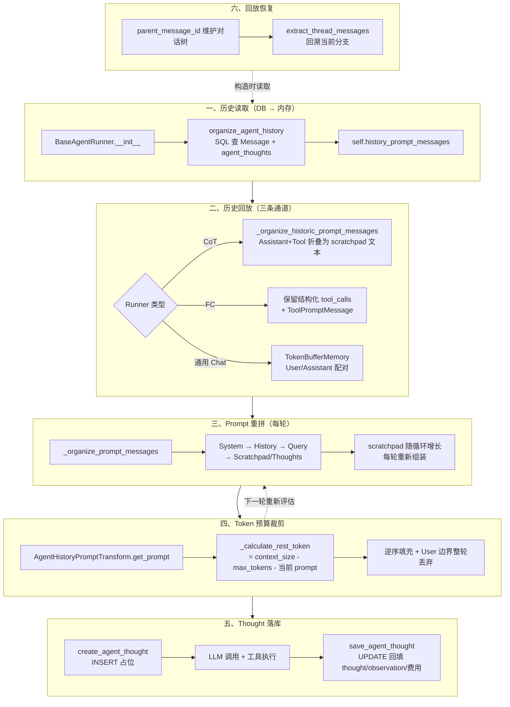
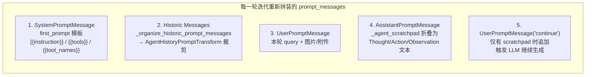
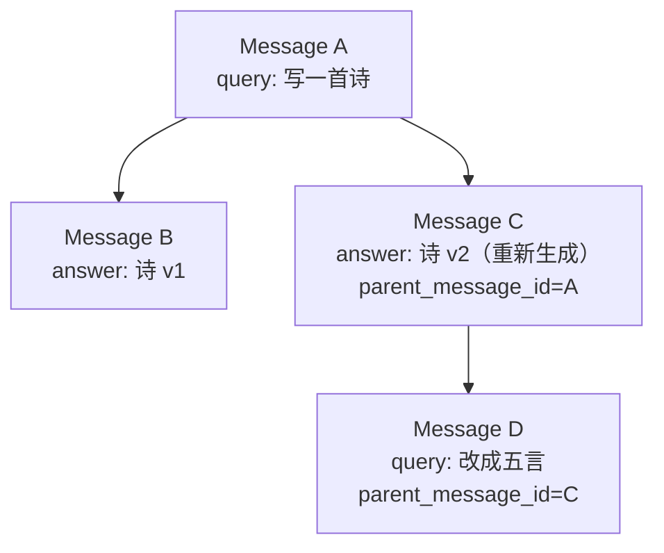
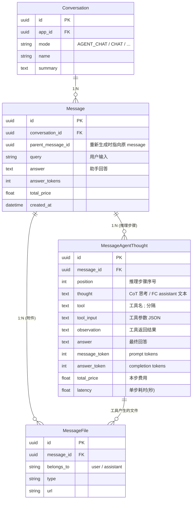
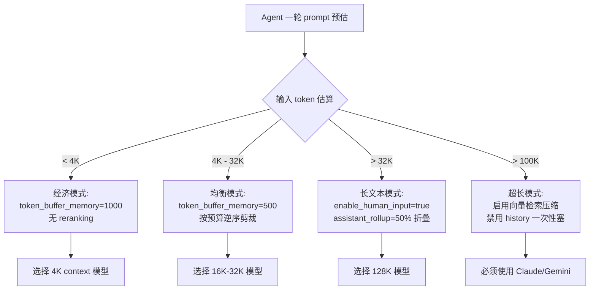
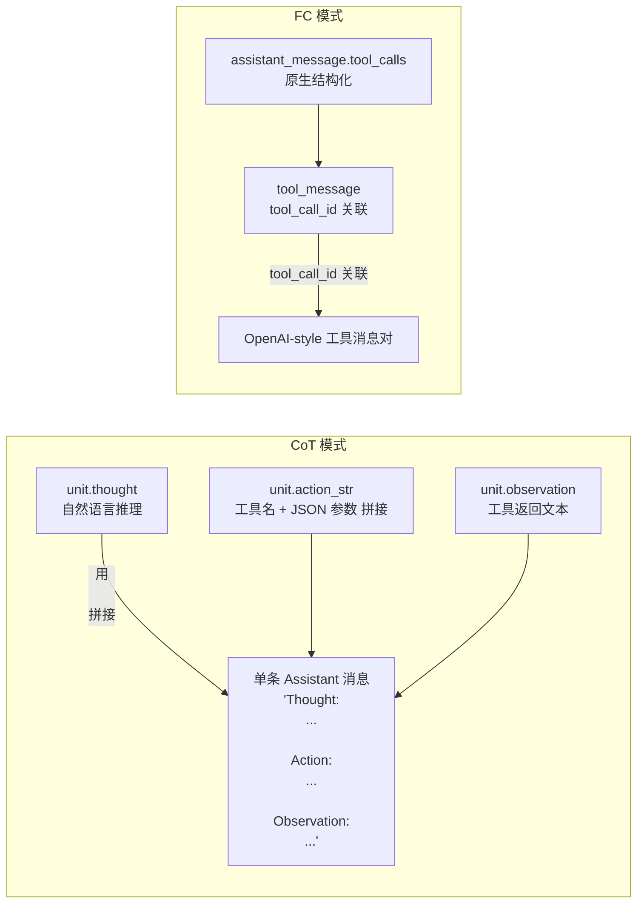
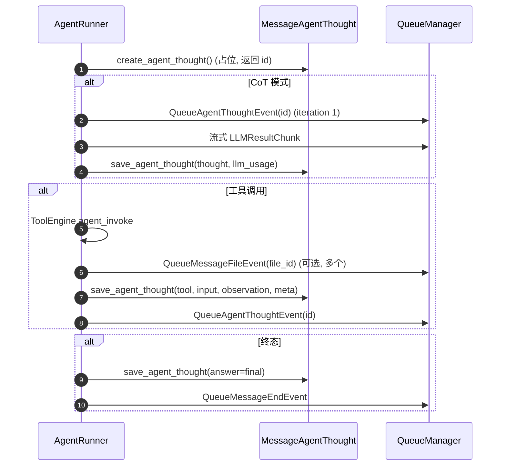
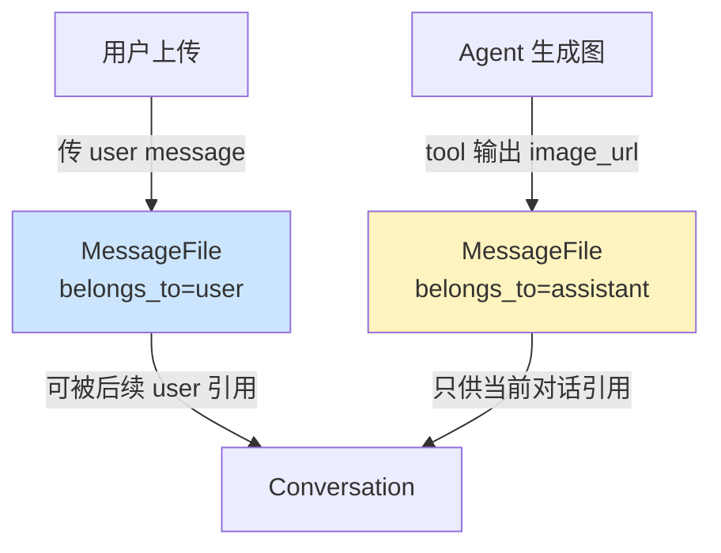

# Agent 上下文、记忆与持久化

> **学习目标**：理解 Dify Agent 的上下文"每轮重拼"特性、Token 预算与滑动窗口策略、三条历史通道的设计差异，以及 `MessageAgentThought` 的持久化模型和写入时序。
>
> **读完本章你应该能回答**：
> - 为什么 Agent 的 prompt 不是静态组装一次就完，而是每轮迭代都重新拼装？
> - CoT 模式的 System Prompt 怎么用模板占位符（`{{instruction}}` / `{{tools}}` / `{{tool_names}}`）替换实际内容？
> - Token 预算超过限制时，Dify 用什么策略裁剪历史？为什么按 User 边界做"整轮丢弃"而不是单条删？
> - `TokenBufferMemory` 滑动窗口的算法是什么？为什么有 500 条上限？
> - 多分支对话中"重新生成"如何工作？`parent_message_id` 和 `extract_thread_messages` 怎么配合？
> - 三条历史通道（CoT / FC / 通用 Chat）在数据源、裁剪策略、适用模式上有什么差异？
> - 多模态文件为什么有 `belongs_to` 字段区分用户/助手归属？
> - `MessageAgentThought` 为什么先占位再增量更新？"占位 → 增量 → 完成"三阶段优势是什么？
> - 一个推理步骤的成本与耗时怎么追踪？`total_price` 是怎么计算的？

## 本章要解决的问题

Agent 的推理循环（详见 [03-agent-runtime.md](./dify-03-agent-runtime.md)）每跑一轮，LLM 看到的 prompt 必须包含完整上下文：历史对话、本轮 query、以及之前所有步骤的 Thought/Action/Observation。但这引出四个互相拉扯的工程难题——**prompt 每轮都在变长、token 预算是有限的、推理过程必须落库可回溯、多分支对话不能串线**。

没有这一层会怎样？第一轮工具调用的 Observation 进不了第二轮的 prompt，Agent 就像失忆了一样重复调用同一个工具；长对话的历史不断累积，token 数很快击穿模型上下文窗口，LLM 直接报错；推理步骤不落库，前端无法展示"Agent 正在第 3 步搜索知识库"，调试时也看不到中间过程；用户点了"重新生成"后再提问，系统回溯到错误的对话分支，把已废弃的旧答案当成上下文。

Dify 的解法是**一条"读取 → 回放 → 重拼 → 裁剪 → 落库 → 恢复"的上下文生命周期管线**：构造 Runner 时从 DB 一次性读取历史，按 Runner 类型走不同的回放通道（CoT 折叠成文本、FC 保留结构化 tool_calls），每轮迭代重新组装 prompt 并按 token 预算逆序裁剪，每个推理步骤先占位 INSERT 再增量 UPDATE 落库。这条管线坏了，Agent 退回成"单轮问答"——没有记忆、没有可观测性、没有多分支。

## 宏观架构：Agent 上下文的生命周期

下图是 Agent 上下文从 DB 读取到最终落库的完整生命周期，也是全文的叙事主线——后续每一节对应生命周期的一个阶段。



理解这张图的关键：**阶段 ③ 和 ④ 在推理循环内每轮重复执行**——scratchpad 每轮增长，token 预算因此每轮收缩，历史裁剪窗口也随之变化。而阶段 ① 在 Runner 构造时一次性完成，阶段 ⑤ 在每轮循环内执行两次（占位 + 回填），阶段 ⑥ 在历史读取时隐式工作。这种"一次性读取 + 每轮重拼 + 每轮落库"的节奏，是 Agent 上下文管理的核心。

下面按这六个阶段逐层展开。

## 一、历史读取：从 DB 到内存

**这一节为什么存在**：推理循环开始前，Runner 必须先把"之前的对话历史"从 DB 读到内存，否则第一轮 LLM 调用就没有上下文。这一步在 Runner 构造时完成，是整条管线的入口。

历史读取发生在 `BaseAgentRunner.__init__`（base_agent_runner.py:77）：

```python
self.history_prompt_messages = self.organize_agent_history(prompt_messages=prompt_messages or [])
```

`organize_agent_history`（base_agent_runner.py:350）做三件事：

```python
def organize_agent_history(self, prompt_messages: list[PromptMessage]) -> list[PromptMessage]:
    result: list[PromptMessage] = []
    # 1. 保留传入的 SystemPromptMessage
    for prompt_message in prompt_messages:
        if isinstance(prompt_message, SystemPromptMessage):
            result.append(prompt_message)

    # 2. SQL 查 Message 表（按时间倒序）
    messages = db.session.execute(
        select(Message).where(Message.conversation_id == self.message.conversation_id)
        .order_by(Message.created_at.desc())
    ).scalars().all()

    # 3. 提取当前分支线程 + 正序排列
    messages = list(reversed(extract_thread_messages(messages)))
```

三个关键设计决策：

**1. 为什么历史在构造时一次性读取，而不是每轮重新查 DB？** 因为推理循环可能跑 10+ 轮，每轮查一次 DB 会产生 10+ 次 SQL，且历史在单次 Agent 调用内不会变化（没有其他写入者）。一次性读到内存，后续所有裁剪都在内存操作。如果用户在另一个会话里发了新消息，本次调用看不到——这是有意的隔离。

**2. 为什么按 `created_at.desc()` 倒序查再 `reversed` 正序？** 因为 `extract_thread_messages`（详见 [⑥ 回放恢复](#⑥-回放恢复多分支对话)）需要从最新的消息开始回溯 `parent_message_id` 链，所以先倒序查出再交给它处理，最后 `reversed` 恢复时间正序。

**3. `agent_thoughts` 是惰性加载的**：`organize_agent_history` 遍历每个 Message 时访问 `message.agent_thoughts`（model.py:1680），这是一个 `@property`，每次访问都执行一次 SQL 查询：

```python
@property
def agent_thoughts(self) -> Sequence[MessageAgentThought]:
    return db.session.scalars(
        select(MessageAgentThought)
        .where(MessageAgentThought.message_id == self.id)
        .order_by(MessageAgentThought.position.asc())
    ).all()
```

这意味着 N 条历史 Message 会触发 N 次 agent_thoughts 查询（N+1 查询问题）。在长对话中这会产生性能压力，但 Dify 接受这个折中——因为 `organize_agent_history` 只在构造时调一次，且 500 条 Message 上限（见 [④ Token 预算裁剪](#④-token-预算裁剪滑动窗口)）控制了最坏情况。

读取完成后，`self.history_prompt_messages` 成为一个 `list[PromptMessage]`，包含 SystemPromptMessage + 每轮的 User/Assistant/Tool 消息。这个列表是后续所有回放和裁剪的输入。

## 二、历史回放：三条通道的格式分化

**这一节为什么存在**：历史读出来了，但 CoT Agent、FC Agent、通用 Chat 应用对历史的"形态"需求不同——CoT 要把工具调用历史折叠成自然语言文本，FC 要保留结构化 `tool_calls` 字段，通用 Chat 只需 User/Assistant 配对。三条通道并存是"针对不同模式做最合适的格式"的设计选择。

### 2.1 CoT 通道：折叠为 scratchpad 文本

CoT Agent 的历史回放分两步：先在 `_init_react_state`（cot_agent_runner.py:359）中初始化，再在每轮 `_organize_prompt_messages` 中重新调用。

`_init_react_state` 在 `run()` 开头调用（cot_agent_runner.py:59）：

```python
def _init_react_state(self, query):
    self._query = query
    self._agent_scratchpad = []                                    # 清空本轮 scratchpad
    self._historic_prompt_messages = self._organize_historic_prompt_messages()
```

`_organize_historic_prompt_messages`（cot_agent_runner.py:390）是 CoT 回放的核心——它把 `self.history_prompt_messages` 中的 `AssistantPromptMessage` + `ToolPromptMessage` 对重新折叠成 ReAct 风格的文本：

```python
for message in self.history_prompt_messages:
    match message:
        case AssistantPromptMessage():
            # 把 assistant 消息 + tool_calls 还原为 scratchpad unit
            current_scratchpad = AgentScratchpadUnit(
                agent_response=message.content,
                thought=message.content or "I am thinking about how to help you",
                ...
            )
            if message.tool_calls:
                current_scratchpad.action = AgentScratchpadUnit.Action(
                    action_name=message.tool_calls[0].function.name,
                    action_input=json.loads(message.tool_calls[0].function.arguments),
                )
        case ToolPromptMessage():
            current_scratchpad.observation = message.content      # 工具返回 → observation
        case UserPromptMessage():
            # 遇到下一条 User 时，把累积的 scratchpads 折叠成一条 Assistant 消息
            result.append(AssistantPromptMessage(
                content=self._format_assistant_message(scratchpads)
            ))
            result.append(message)
```

`_format_assistant_message`（cot_agent_runner.py:373）把 scratchpad 列表拼成文本：

```python
def _format_assistant_message(self, agent_scratchpad: list[AgentScratchpadUnit]) -> str:
    message = ""
    for scratchpad in agent_scratchpad:
        if scratchpad.is_final():
            message += f"Final Answer: {scratchpad.agent_response}"
        else:
            message += f"Thought: {scratchpad.thought}\n\n"
            if scratchpad.action_str:
                message += f"Action: {scratchpad.action_str}\n\n"
            if scratchpad.observation:
                message += f"Observation: {scratchpad.observation}\n\n"
    return message
```

这段还原了 ReAct prompt 的经典格式：`Thought → Action → Observation` 循环。历史中每一条 `AssistantPromptMessage(tool_calls=[...])` + `ToolPromptMessage` 对，被折叠成一段自然语言文本，让 LLM 看起来"像人在思考"。

### 2.2 FC 通道：保留结构化 tool_calls

FC Agent 不需要折叠——`organize_agent_history`（base_agent_runner.py:374-436）已经把历史中的 `agent_thoughts` 还原为结构化的 `AssistantPromptMessage(tool_calls=...)` + `ToolPromptMessage` 对：

```python
for agent_thought in agent_thoughts:
    tool_names = agent_thought.tool.split(";")
    tool_calls: list[AssistantPromptMessage.ToolCall] = []
    tool_call_response: list[ToolPromptMessage] = []

    for tool in tool_names:
        tool_call_id = str(uuid.uuid4())
        tool_calls.append(AssistantPromptMessage.ToolCall(
            id=tool_call_id, type="function",
            function=AssistantPromptMessage.ToolCall.ToolCallFunction(
                name=tool,
                arguments=json.dumps(tool_inputs.get(tool, {})),
            ),
        ))
        tool_call_response.append(ToolPromptMessage(
            content=tool_responses.get(tool, agent_thought.observation),
            name=tool, tool_call_id=tool_call_id,
        ))

    result.extend([
        AssistantPromptMessage(content=agent_thought.thought, tool_calls=tool_calls),
        *tool_call_response,
    ])
```

关键细节：**`tool_call_id` 是重新生成的 UUID**，不是从 DB 恢复的原始 ID。因为 DB 里只存了 `tool`（名称）和 `tool_input`（参数），没存 `tool_call_id`。回放时为每个工具调用生成新 ID，保证 `AssistantPromptMessage.tool_calls` 和 `ToolPromptMessage.tool_call_id` 的关联关系一致。这足够让 LLM 理解"哪个工具返回了什么结果"——LLM 只看关联关系，不关心 ID 的具体值。

没有 `agent_thoughts` 的历史消息（普通对话或无工具调用），直接用 `message.answer` 构造 `AssistantPromptMessage`（base_agent_runner.py:438-439）。

### 2.3 通用 Chat 通道：TokenBufferMemory

通用 Chat 应用（非 Agent）不需要回放工具调用历史，走 `TokenBufferMemory.get_history_prompt_messages`（token_buffer_memory.py:122）：

```python
def get_history_prompt_messages(self, max_token_limit=2000, message_limit=None):
    message_limit = min(message_limit, 500)  # 硬上限 500 条
    messages = db.session.scalars(
        select(Message).where(Message.conversation_id == self.conversation.id)
        .order_by(Message.created_at.desc()).limit(message_limit)
    ).all()

    thread_messages = extract_thread_messages(messages)
    # 跳过正在生成的消息
    if thread_messages and not thread_messages[0].answer and thread_messages[0].answer_tokens == 0:
        thread_messages.pop(0)
    messages = list(reversed(thread_messages))

    # 按 (User, Assistant) 配对构造 PromptMessage
    for message in messages:
        user_files = ...  # 查 MessageFile belongs_to=user
        prompt_messages.append(UserPromptMessage(content=message.query))
        assistant_files = ...  # 查 MessageFile belongs_to=assistant
        prompt_messages.append(AssistantPromptMessage(content=message.answer))

    # Token 滑动裁剪
    if curr_message_tokens > max_token_limit:
        while curr_message_tokens > max_token_limit and len(prompt_messages) > 1:
            prompt_messages.pop(0)
            curr_message_tokens = self.model_instance.get_llm_num_tokens(prompt_messages)
```

通用 Chat 的裁剪策略是 `pop(0)`——从头丢弃最老的消息，直到 token 数达标。这比 Agent 场景简单，因为不需要考虑 scratchpad 和工具调用的完整性。

### 2.4 三条通道对比

| 通道 | 来源 | 历史格式 | 裁剪策略 | 适用模式 |
|------|------|---------|---------|---------|
| CoT `_organize_historic_prompt_messages` | `self.history_prompt_messages`（organize_agent_history 加载） | 折叠为 `Thought/Action/Observation` 文本 | `AgentHistoryPromptTransform` 逆序整轮丢弃 | CoT Agent |
| FC `organize_agent_history` | SQL 查 `Message` + `agent_thoughts` | 结构化 `tool_calls` + `ToolPromptMessage` | `AgentHistoryPromptTransform` 逆序整轮丢弃 | FC Agent |
| 通用 Chat `TokenBufferMemory` | SQL 查 `Message` | `UserPromptMessage` / `AssistantPromptMessage` 配对 | `pop(0)` 头部丢弃 | Chat / Completion |

> **设计意图**：CoT/FC 走两条路是因为 CoT 需要把历史"折叠"成 scratchpad 文本（ReAct 风格），而 FC 要保留结构化的 `tool_calls` 字段（模型原生 function call）。如果强行统一，要么 FC 的结构化信息被破坏（折叠成文本后模型工具调用能力下降），要么 CoT 的语义丢失（保留 tool_calls 不利于让 LLM 用自然语言思考）。

## 三、Prompt 重拼：每轮迭代重新组装

**这一节为什么存在**：Agent 的 prompt 不是静态组装一次就完，而是推理循环每轮都重新拼装。这是 Agent 上下文管理与普通 Chat 应用最本质的差异——scratchpad 随循环增长，token 预算因此每轮收缩，历史裁剪窗口也随之变化。

每轮调用 `_organize_prompt_messages()` 的位置：CoT 在 cot_agent_runner.py:123，FC 在 fc_agent_runner.py:90。两者都在循环体的 `create_agent_thought` 之后、`invoke_llm` 之前。

### 3.1 CoT Chat 模式：五段式拼装

`CotChatAgentRunner._organize_prompt_messages`（cot_chat_agent_runner.py:70）拼出五段消息：



```python
def _organize_prompt_messages(self) -> list[PromptMessage]:
    system_message = self._organize_system_prompt()              # 1. System
    agent_scratchpad = self._agent_scratchpad
    if not agent_scratchpad:
        assistant_messages = []
    else:
        content = ""
        for unit in agent_scratchpad:
            if unit.is_final():
                content += f"Final Answer: {unit.agent_response}"
            else:
                content += f"Thought: {unit.thought}\n\n"
                if unit.action_str:
                    content += f"Action: {unit.action_str}\n\n"
                if unit.observation:
                    content += f"Observation: {unit.observation}\n\n"
        assistant_messages = [AssistantPromptMessage(content=content)]  # 4. Scratchpad 折叠

    query_messages = self._organize_user_query(self._query, [])   # 3. 当前 query

    if assistant_messages:
        historic_messages = self._organize_historic_prompt_messages([
            system_message, *query_messages, *assistant_messages, UserPromptMessage(content="continue")
        ])
        messages = [system_message, *historic_messages, *query_messages,
                    *assistant_messages, UserPromptMessage(content="continue")]
    else:
        historic_messages = self._organize_historic_prompt_messages([system_message, *query_messages])
        messages = [system_message, *historic_messages, *query_messages]
    return messages
```

为什么每轮都要重拼？三个原因：

1. **scratchpad 累积**——`_agent_scratchpad`（cot_agent_runner.py:42）是一个 list，每轮迭代 `self._agent_scratchpad.append(scratchpad)`（cot_agent_runner.py:173）。如果只拼一次，scratchpad 永远是空的。
2. **history 裁剪窗口变化**——`AgentHistoryPromptTransform` 按 token 预算裁剪。预算 = `context_size - max_tokens - 当前 prompt tokens`，而"当前 prompt tokens"包含 scratchpad，scratchpad 每轮增长，预算因此每轮收缩，必须重新评估。
3. **继续触发**——末尾追加 `UserPromptMessage("continue")` 是为了 LLM 继续生成（不返回结果让对话结束）。这条只在有 scratchpad 时才有。

拼装顺序也经过精心设计：System → History → Query → Assistant(scratchpad) → User("continue")。这种顺序让 LLM 看到"历史对话" → "当前问题" → "我的思考过程" → "请继续"，是 ReAct prompt 工程的经典模板。

### 3.2 System Prompt 的模板替换

`_organize_system_prompt`（cot_chat_agent_runner.py:18）是 CoT 模式下 prompt 拼装的第一步，负责将 ReAct 模板中的三个占位符替换为实际内容：

```python
def _organize_system_prompt(self) -> SystemPromptMessage:
    prompt_entity = self.app_config.agent.prompt
    first_prompt = prompt_entity.first_prompt

    system_prompt = (
        first_prompt.replace("{{instruction}}", self._instruction)
        .replace("{{tools}}", json.dumps(jsonable_encoder(self._prompt_messages_tools)))
        .replace("{{tool_names}}", ", ".join([tool.name for tool in self._prompt_messages_tools]))
    )
    return SystemPromptMessage(content=system_prompt)
```

| 占位符 | 来源 | 解析链路 |
|--------|------|---------|
| `{{instruction}}` | `self._instruction` | `app_config.prompt_template.simple_prompt_template` → 填入 `{{variable}}` 输入变量后的文本 |
| `{{tools}}` | `self._prompt_messages_tools` | `_init_prompt_tools()` 构造的 `PromptMessageTool` 列表，JSON 序列化 |
| `{{tool_names}}` | 同上 | 逗号拼接的工具名列表，如 `"search, calculator, weather"` |

`_instruction` 不是直接取自某个字段——它经过了"模板嵌套模板"链路（cot_agent_runner.py:73-74）：先把 `prompt_template.simple_prompt_template` 中用户定义的 `{{variable}}` 占位符替换为实际输入值，然后才作为 `{{instruction}}` 嵌入到系统提示。这种设计让用户既控制"系统提示"又能用"变量注入"。

**FC 模式不走这条路**：FC 的 System Prompt 直接使用 `simple_prompt_template`（用户配置的系统提示），工具描述通过模型原生 `tools` 参数传递（fc_agent_runner.py:454）。详见 [04-agent-reasoning.md](./dify-04-agent-reasoning.md)。

### 3.3 FC 模式：结构化拼装

`FunctionCallAgentRunner._organize_prompt_messages`（fc_agent_runner.py:453）更简洁——不需要折叠 scratchpad，直接用 `_current_thoughts` 累积结构化消息：

```python
def _organize_prompt_messages(self):
    prompt_template = self.app_config.prompt_template.simple_prompt_template or ""
    self.history_prompt_messages = self._init_system_message(prompt_template, self.history_prompt_messages)
    query_prompt_messages = self._organize_user_query(self.query or "", [])

    self.history_prompt_messages = AgentHistoryPromptTransform(
        model_config=self.model_config,
        prompt_messages=[*query_prompt_messages, *self._current_thoughts],
        history_messages=self.history_prompt_messages,
        memory=self.memory,
    ).get_prompt()

    prompt_messages = [*self.history_prompt_messages, *query_prompt_messages, *self._current_thoughts]
    if len(self._current_thoughts) != 0:
        prompt_messages = self._clear_user_prompt_image_messages(prompt_messages)
    return prompt_messages
```

FC 的拼装顺序：System → History → Query → `_current_thoughts`。`_current_thoughts`（base_agent_runner.py:122）是一个 `list[PromptMessage]`，每轮追加 `AssistantPromptMessage`（含 `tool_calls`）和 `ToolPromptMessage`（fc_agent_runner.py:203、fc_agent_runner.py:271-277）。

**一个微妙的设计**：`_clear_user_prompt_image_messages`（fc_agent_runner.py:430）在第一轮之后把 User 消息中的图片替换为 `[image]` 文本。原因是 GPT 系列只支持第一轮同时使用 FC + Vision，后续轮次如果继续带图片会让模型困惑。这是针对模型能力限制的 workaround。

### 3.4 CoT Completion 模式：单条文本

`CotCompletionAgentRunner._organize_prompt_messages`（cot_completion_agent_runner.py:57）把所有内容拼成一条 `UserPromptMessage`——因为 completion 模型不分消息角色，所有内容是一段文本：

```python
prompt = (
    system_prompt.replace("{{historic_messages}}", historic_prompt)
    .replace("{{agent_scratchpad}}", assistant_prompt)
    .replace("{{query}}", query_prompt)
)
return [UserPromptMessage(content=prompt)]
```

Completion 模式比 Chat 模式多了 `{{historic_messages}}`、`{{query}}`、`{{agent_scratchpad}}` 三个占位符，少了 `UserPromptMessage("continue")`——因为 completion 模型不会因为消息边界而停止生成。

### 3.5 CoT Chat vs CoT Completion vs FC

| 维度 | CoT Chat | CoT Completion | FC |
|------|----------|----------------|-----|
| 消息结构 | 多条 `PromptMessage` 列表 | 单条 `UserPromptMessage` | 多条 `PromptMessage` 列表 |
| System Prompt | `SystemPromptMessage` 对象 | 嵌入文本 `{{historic_messages}}` 等 | `simple_prompt_template` 直传 |
| 工具描述 | `{{tools}}` / `{{tool_names}}` 占位符 | 同左 | 模型原生 `tools` 参数 |
| Scratchpad 形态 | 折叠为 `AssistantPromptMessage` 文本 | 嵌入 `{{agent_scratchpad}}` | 结构化 `tool_calls` + `ToolPromptMessage` |
| "continue" 触发 | 有 | 无（completion 不分消息边界） | 无（FC 靠 `tool_calls` 驱动） |

## 四、Token 预算裁剪：滑动窗口

**这一节为什么存在**：prompt 每轮都在变长（scratchpad 增长 + 历史累积），但模型的上下文窗口是有限的。如果不裁剪，token 数很快击穿窗口上限，LLM 直接报 context overflow。`AgentHistoryPromptTransform` 是 Agent 场景下的裁剪器，它的策略决定了"哪些历史被保留、哪些被丢弃"。

`AgentHistoryPromptTransform`（agent_history_prompt_transform.py:16）在 CoT 和 FC 两条通道里都被调用——CoT 在 `_organize_historic_prompt_messages` 内（cot_agent_runner.py:439），FC 在 `_organize_prompt_messages` 内（fc_agent_runner.py:458）。

### 4.1 预算计算：动态残差

`get_prompt`（agent_history_prompt_transform.py:33）的第一步是计算"历史还能用多少 token"：

```python
max_token_limit = self._calculate_rest_token(self.prompt_messages, model_config=self.model_config)
```

`_calculate_rest_token`（继承自 `PromptTransform`，prompt_transform.py:58）的算法：

```python
rest_tokens = model_context_tokens - max_tokens - curr_message_tokens
```

三个变量：
- `model_context_tokens`：模型的上下文窗口大小（如 GPT-4o 的 128K）
- `max_tokens`：用户配置的 `max_tokens` 参数（留给 LLM 生成的预算）
- `curr_message_tokens`：当前 prompt（不含历史）的 token 数——包括 System、Query、Scratchpad

关键洞察：**`curr_message_tokens` 包含 scratchpad，scratchpad 每轮增长，所以 `max_token_limit` 每轮缩小**。这就是为什么 prompt 必须每轮重拼 + 重新裁剪——第一轮可能还有 100K token 给历史用，到第五轮 scratchpad 吃掉了 5K，历史预算就只剩 95K。

> **如果没有 memory 怎么办？** `get_prompt` 在 `not self.memory` 时直接返回原始 history_messages 不裁剪（agent_history_prompt_transform.py:41-42）。这意味着 Agent 的历史裁剪依赖 `TokenBufferMemory` 实例的存在——而 `TokenBufferMemory` 在 `AgentChatAppRunner.run` 中构造（app_runner.py:69），仅当 `conversation_id` 存在时才创建。首次对话（无 conversation_id）没有 memory，也就不裁剪历史——因为首次对话根本没有历史。

### 4.2 裁剪算法：逆序填充 + User 边界整轮丢弃

```python
def get_prompt(self) -> list[PromptMessage]:
    # 1. 总是保留 SystemPromptMessage
    prompt_messages: list[PromptMessage] = []
    num_system = 0
    for prompt_message in self.history_messages:
        if isinstance(prompt_message, SystemPromptMessage):
            prompt_messages.append(prompt_message)
            num_system += 1

    # 2. 如果总 token 没超预算，直接返回全部
    if curr_message_tokens <= max_token_limit:
        return self.history_messages

    # 3. 逆序遍历，凑满预算就停
    num_prompt = 0
    for prompt_message in self.history_messages[::-1]:
        if isinstance(prompt_message, SystemPromptMessage):
            continue
        prompt_messages.append(prompt_message)
        num_prompt += 1
        if isinstance(prompt_message, UserPromptMessage):
            # 触达 User 边界，评估一次 token
            curr_message_tokens = model_type_instance.get_num_tokens(...)
            if curr_message_tokens > max_token_limit:
                prompt_messages = prompt_messages[:-num_prompt]  # 整轮丢弃
                break
            num_prompt = 0

    # 4. 翻回正序
    message_prompts = prompt_messages[num_system:]
    message_prompts.reverse()
    return prompt_messages[:num_system] + message_prompts
```

**为什么按 User 边界整轮丢弃，而不是按 token 数单条删？** 因为 CoT 推理依赖完整的 (Thought, Action, Observation) 序列。如果只删部分消息，LLM 会看到"上一步 Action 是 search 工具，但 Observation 是另一轮的——我到底在做什么？"。整轮丢弃保证 (User 问题, Assistant 回答) 的语义完整：从 User 消息开始、到下一个 User 消息之前的所有 Assistant/Tool 消息，要么全留要么全丢。

**逆序填充的智慧**：最近的对话最相关。逆序遍历历史，凑满 token 预算就停止，意味着"最新的几轮对话进 prompt，最老的被丢掉"。这匹配用户最近的关注点——用户刚问的问题比 20 轮前的问题更重要。

**`get_num_tokens` 的代价**：每次触达 User 边界都调一次 `model_type_instance.get_num_tokens`（agent_history_prompt_transform.py:67），这是一个 O(n) 的 tokenizer 调用。在最坏情况下（每条消息都触发评估），N 条历史消息会产生 N 次 tokenizer 调用。Dify 接受这个开销，因为裁剪只在每轮一次，且 500 条消息上限控制了最坏情况。

### 4.3 通用 Chat 的裁剪：pop(0) 头部丢弃

`TokenBufferMemory.get_history_prompt_messages` 的裁剪策略更简单（token_buffer_memory.py:202-205）：

```python
if curr_message_tokens > max_token_limit:
    while curr_message_tokens > max_token_limit and len(prompt_messages) > 1:
        prompt_messages.pop(0)
        curr_message_tokens = self.model_instance.get_llm_num_tokens(prompt_messages)
```

`pop(0)` 从头部丢弃最老的消息，直到 token 数达标。这比 `AgentHistoryPromptTransform` 简单——不需要考虑 User 边界和整轮完整性，因为通用 Chat 没有工具调用历史，User/Assistant 消息天然成对。

### 4.4 "只丢不压缩"的权衡

Dify 的裁剪策略是**只丢弃，不摘要/压缩**。这是一个有意的折中：

- **简单**：不需要调用 LLM 做摘要/压缩（那本身又消耗 token、增加延迟）。
- **保留原始信息**：丢掉的历史仍然存在 DB 里，用户可以在 UI 上翻页查看。
- **缺点**：长对话会丢失早期上下文——遇到"用户在第 1 轮提了一句关键前提"的场景会失效。

替代方案是"摘要压缩"——把丢掉的历史用 LLM 摘要成一段文本放回去。Dify 没有采用，因为摘要本身不可靠（LLM 可能遗漏关键信息），且增加延迟和成本。未来如果需要，可以在 `AgentHistoryPromptTransform` 和 `TokenBufferMemory` 之间插入一个摘要层，不改现有裁剪逻辑。

## 五、Thought 落库：占位与回填

**这一节为什么存在**：推理循环的每一步都必须落库——否则前端无法展示"Agent 正在第 3 步搜索知识库"，调试时也看不到中间过程，进程崩溃后无法恢复。`MessageAgentThought` 的"占位 → 回填"两阶段写入模式，是可观测性和可恢复性的物理基础。

### 5.1 数据模型

`MessageAgentThought`（model.py:2392）存储每一次推理步骤。核心字段：

| 字段 | 类型 | 含义 |
|------|------|------|
| `id` | UUID | 主键 |
| `message_id` | UUID | 关联的 Message |
| `position` | int | 在该 Message 内的推理步骤序号 |
| `thought` | LongText | CoT 的思考过程 / FC 的 assistant 文本 |
| `tool` | LongText | 工具名（多工具用 `;` 分隔） |
| `tool_input` | LongText | 工具参数 JSON |
| `observation` | LongText | 工具返回结果 |
| `answer` | LongText | 助手回答 / CoT 累积文本 |
| `tool_labels_str` | LongText | 工具显示标签（i18n） |
| `tool_meta_str` | LongText | 工具执行元数据（耗时、错误等） |
| `message_token` / `answer_token` | int | LLM 调用的 prompt/completion token |
| `total_price` / `currency` | Decimal / str | 总价 / 币种 |
| `latency` | float | 单步耗时（秒） |

完整字段表和 ER 关系图见 [附录 A](#附录-a-messageagentthought-数据模型全表)。

**关键关系**：一次 Agent 调用 = 1 条 `Message` + N 条 `MessageAgentThought`（每个推理步骤 1 条）+ M 条 `MessageFile`（用户上传 + 工具产生）。`Message.agent_thoughts`（model.py:1680）按 `position` 升序返回该消息的所有推理步骤。

### 5.2 占位阶段：create_agent_thought

每轮循环开头调用 `create_agent_thought`（base_agent_runner.py:220），在 DB 里 INSERT 一条空记录，返回 id：

```python
def create_agent_thought(self, message_id, message, tool_name, tool_input, messages_ids) -> str:
    thought = MessageAgentThought(
        message_id=message_id,
        thought="",
        tool=tool_name,
        tool_input=tool_input,
        message_token=0,
        answer_token=0,
        total_price=Decimal(0),
        position=self.agent_thought_count + 1,   # 递增序号
        currency="USD",
        latency=0,
        ...
    )
    db.session.add(thought)
    db.session.commit()
    agent_thought_id = str(thought.id)
    self.agent_thought_count += 1
    return agent_thought_id
```

`position` 由 `self.agent_thought_count` 控制——这个计数器在 Runner 构造时从 DB 查询当前 Message 已有多少条 thought（base_agent_runner.py:103-112），确保即使中断恢复后 position 也能接续。

CoT 在 cot_agent_runner.py:113 调用，FC 在 fc_agent_runner.py:85 调用，都在循环体最开头。

### 5.3 回填阶段：save_agent_thought

`save_agent_thought`（base_agent_runner.py:262）做 UPDATE，**一次推理步骤内可能被调用 2-3 次**：

```python
def save_agent_thought(self, agent_thought_id, tool_name, tool_input, thought,
                       observation, tool_invoke_meta, answer, messages_ids, llm_usage=None):
    agent_thought = db.session.scalar(select(MessageAgentThought).where(...))
    if not agent_thought:
        raise ValueError("agent thought not found")

    if thought:
        existing_thought = agent_thought.thought or ""
        agent_thought.thought = f"{existing_thought}{thought}"   # 追加，不是覆盖

    if tool_name: agent_thought.tool = tool_name
    if tool_input: agent_thought.tool_input = ...
    if observation: agent_thought.observation = ...
    if answer: agent_thought.answer = answer
    if llm_usage:
        agent_thought.message_token = llm_usage.prompt_tokens
        agent_thought.answer_token = llm_usage.completion_tokens
        agent_thought.total_price = llm_usage.total_price
        ...

    # 自动填充 tool_labels（i18n）
    labels = agent_thought.tool_labels or {}
    tools = agent_thought.tool.split(";") if agent_thought.tool else []
    for tool in tools:
        if tool not in labels:
            tool_label = ToolManager.get_tool_label(tool)
            labels[tool] = tool_label.to_dict() if tool_label else {"en_US": tool, "zh_Hans": tool}
    agent_thought.tool_labels_str = json.dumps(labels)

    db.session.commit()
```

注意 `thought` 字段是**追加**（`f"{existing_thought}{thought}"`），不是覆盖。这是因为 CoT 的流式输出会把 thought 分多次传入。

**CoT 的调用时序**（一个工具调用步骤）：

| 调用次序 | 位置 | 填充的字段 |
|---------|------|-----------|
| 第 1 次 | cot_agent_runner.py:187 | `thought` + `llm_usage`（LLM 输出解析后） |
| 第 2 次 | cot_agent_runner.py:232 | `observation` + `tool_invoke_meta`（工具执行后） |
| 第 3 次 | cot_agent_runner.py:264 | `answer=final_answer`（循环结束后，最终步骤） |

**FC 的调用时序**：

| 调用次序 | 位置 | 填充的字段 |
|---------|------|-----------|
| 第 1 次 | fc_agent_runner.py:206 | `thought=response` + `tool_name` + `llm_usage`（LLM 输出后） |
| 第 2 次 | fc_agent_runner.py:281 | `observation` + `tool_invoke_meta`（工具执行后，仅有工具调用时） |

### 5.4 "占位 + 多次回填"的优势

对比"一次性 INSERT 完整 thought"，这种模式有三个优势：

1. **错误定位粒度细**——如果某次 save 失败，DB 里能看到"已经 INSERT 占位但还没 save 完整"的脏数据，可以通过 `position=N, answer IS NULL` 找出来。这种脏数据要么回滚要么续写。
2. **事件推送和 DB 写入解耦**——INSERT 占位后立刻推一个 `QueueAgentThoughtEvent`（前端开始显示"步骤 N"），后续多次 save 触发增量更新事件。前端感知"步骤正在丰富内容"，而不是"步骤突然出现"。
3. **可恢复性**——如果进程崩溃，下次启动可以查 `answer IS NULL` 找到"半成品 thought"，决定是回滚还是续写。

### 5.5 费用追踪

每个 step 都独立计费，`save_agent_thought` 在收到 `llm_usage` 时写入（base_agent_runner.py:313-321）：

```python
if llm_usage:
    agent_thought.message_token = llm_usage.prompt_tokens
    agent_thought.message_unit_price = llm_usage.prompt_unit_price
    agent_thought.answer_token = llm_usage.completion_tokens
    agent_thought.answer_unit_price = llm_usage.completion_unit_price
    agent_thought.tokens = llm_usage.total_tokens
    agent_thought.total_price = llm_usage.total_price
```

多 step 的 `total_price` 之和 = 这次 Agent 调用的总费用。计费的颗粒度到 step 级（不是 message 级）有两个好处：

1. **用户透明**——Agent "为什么花这么多钱"可以追溯到具体哪一步。
2. **配额控制**——可以按 step 设阈值（比如 step 超过 100 次停止），按 message 设阈值则不及时。

`total_price` 和 `currency` 一起存——虽然目前 Code 里是单币种（`currency="USD"`），但未来多币种时不需要 schema migration。

## 六、回放恢复：多分支对话

**这一节为什么存在**：用户点了"重新生成"后再提问，系统必须回溯到正确的对话分支——否则会把已废弃的旧答案当成上下文。`parent_message_id` 和 `extract_thread_messages` 共同维护这棵对话树。

### 6.1 对话树模型

`Message.parent_message_id`（model.py:1476）指向"重新生成前的原消息"。当用户对某条回答点了"重新生成"，新 Message 的 `parent_message_id` 设为原 Message 的 id，形成一棵对话树：



用户在"诗 v2"分支上继续对话时，历史读取必须只回溯 A → C → D 这条分支，不能串入 B。

### 6.2 extract_thread_messages 的回溯算法

`extract_thread_messages`（extract_thread_messages.py:7）从最新的消息开始，沿 `parent_message_id` 链回溯：

```python
def extract_thread_messages(messages: Sequence[Message]):
    thread_messages: list[Message] = []
    next_message = None

    for message in messages:  # messages 已按 created_at desc 排序
        if not message.parent_message_id:
            # 到达对话树的根节点
            thread_messages.append(message)
            break

        if not next_message:
            # 第一条（最新消息），直接加入
            thread_messages.append(message)
            next_message = message.parent_message_id
        else:
            # 检查当前消息是否是链上的下一环
            if next_message in {message.id, UUID_NIL}:
                thread_messages.append(message)
                next_message = message.parent_message_id

    return thread_messages
```

算法逐步解析：
1. `messages` 按 `created_at.desc()` 排序，所以第一条是最新的消息。
2. `next_message` 记录"正在寻找的下一个 parent"。初始为 None，遇到第一条消息时设为它的 `parent_message_id`。
3. 后续每条消息，检查 `message.id` 是否等于 `next_message`——如果是，说明它是链上的下一环，加入线程并更新 `next_message`。
4. 遇到 `parent_message_id` 为空的消息（对话树根节点），加入线程并终止。

**`UUID_NIL` 的作用**：`next_message in {message.id, UUID_NIL}` 中的 `UUID_NIL` 是一个"零 UUID"常量，用于处理 `parent_message_id` 为 `UUID_NIL` 而非 `None` 的旧数据兼容。

### 6.3 在两条通道中的使用

`extract_thread_messages` 被两个地方调用：

1. **`organize_agent_history`**（base_agent_runner.py:372）：Agent 场景，从 `Message` 表查出所有消息后提取当前分支。
2. **`TokenBufferMemory.get_history_prompt_messages`**（token_buffer_memory.py:148）：通用 Chat 场景，同样提取当前分支。

两者都是先按 `created_at.desc()` 倒序查询，再 `extract_thread_messages` 提取线程，最后 `reversed` 恢复正序。

### 6.4 跳过正在生成的消息

`TokenBufferMemory` 有一个额外处理（token_buffer_memory.py:151-152）：

```python
# for newly created message, its answer is temporarily empty
if thread_messages and not thread_messages[0].answer and thread_messages[0].answer_tokens == 0:
    thread_messages.pop(0)
```

`thread_messages[0]` 是最新的消息（倒序查询后第一条）。如果它的 `answer` 为空且 `answer_tokens` 为 0，说明它是"当前正在生成、还没 answer 的新消息"——不能放进历史，否则 LLM 会看到一条空的 Assistant 消息。这个检查只在 `TokenBufferMemory` 中有，`organize_agent_history` 中没有——因为 Agent 场景下当前消息的 id 已知，直接 `if message.id == self.message.id: continue` 跳过（base_agent_runner.py:375-376）。

## 收敛

### 边界：Agent 记忆 vs Workflow 变量

Agent 的上下文管理和 Workflow 的变量池是两种不同的"状态保持"机制：

| 维度 | Agent 记忆 | Workflow 变量池 |
|------|-----------|----------------|
| 状态载体 | DB（Message + MessageAgentThought） | 内存（变量池 + 节点输出） |
| 生命周期 | 跨会话持久化 | 单次执行内 |
| 裁剪策略 | Token 预算滑动窗口 | 无（依赖节点设计） |
| 多轮支持 | 天然支持（对话历史） | 通过 `conversation_variable` 节点支持 |

**不该在这里做的事**：用 Agent 的对话历史传递结构化业务数据（应该用 Workflow 变量池），用 Workflow 变量池做长对话记忆（应该用 Agent + Conversation）。详见 [11-workflow-engine.md](./dify-11-workflow-engine.md)。

### 扩展点

- **自定义裁剪策略**：继承 `AgentHistoryPromptTransform`，重写 `get_prompt`，可以实现"摘要压缩""按重要性排序"等策略。当前 Dify 只提供"逆序整轮丢弃"一种。
- **自定义 thought 持久化**：`MessageAgentThought` 的字段设计是通用的，但写入逻辑在 `BaseAgentRunner` 中硬编码。如果需要额外的元数据（如 trace_id、plugin_id），可以在 `save_agent_thought` 中扩展。
- **多模态历史**：`organize_agent_user_prompt`（base_agent_runner.py:445）已支持从 `MessageFile` 构造多模态 `UserPromptMessage`，但 Agent 的工具调用历史目前只回放文本——工具产生的图片通过 `MessageFile` 单独关联。

### 本章要点

1. **历史一次性读取**：`organize_agent_history` 在 Runner 构造时从 DB 读到 `self.history_prompt_messages`，后续所有裁剪都在内存操作。
2. **三条历史通道并存**：CoT 折叠为 scratchpad 文本、FC 保留结构化 tool_calls、通用 Chat 走 TokenBufferMemory——针对不同模式做最合适的格式。
3. **prompt 每轮重拼**：scratchpad 随循环增长，token 预算因此每轮收缩，历史裁剪窗口也随之变化——`_organize_prompt_messages` 每轮重新组装。
4. **`AgentHistoryPromptTransform` 按 token 预算逆序填充**：以 User 边界做整轮丢弃，保证 (User, Assistant) 配对完整。
5. **`MessageAgentThought` 先占位再增量回填**：`create_agent_thought` INSERT 空记录，`save_agent_thought` 多次 UPDATE 回填——支持实时渲染、崩溃恢复、审计。
6. **`parent_message_id` + `extract_thread_messages` 维护对话树**：重新生成时沿 parent 链回溯当前分支，不串入其他分支。
7. **每个推理步骤独立计费**：`message_token` / `answer_token` / `total_price` / `latency` 完整追踪到 step 级。

### 推荐源码入口

| 文件 | 职责 |
|------|------|
| api/core/agent/base_agent_runner.py | `organize_agent_history`（历史读取）、`create_agent_thought` / `save_agent_thought`（落库）、`organize_agent_user_prompt`（多模态） |
| api/core/agent/cot_agent_runner.py | `_init_react_state`、`_organize_historic_prompt_messages`（CoT 回放）、`_format_assistant_message`（scratchpad 折叠） |
| api/core/agent/cot_chat_agent_runner.py | CoT Chat 的 `_organize_prompt_messages`（每轮重拼）、`_organize_system_prompt`（模板替换） |
| api/core/agent/cot_completion_agent_runner.py | CoT Completion 的 `_organize_prompt_messages`（单条文本拼装） |
| api/core/agent/fc_agent_runner.py | FC 的 `_organize_prompt_messages`、`_current_thoughts` 累积 |
| api/core/prompt/agent_history_prompt_transform.py | `AgentHistoryPromptTransform`：按 token 预算逆序填充 + User 边界整轮丢弃 |
| api/core/memory/token_buffer_memory.py | `TokenBufferMemory`：通用 Chat 的 history 只读来源、500 条上限、`pop(0)` 裁剪 |
| api/core/prompt/utils/extract_thread_messages.py | `extract_thread_messages`：沿 `parent_message_id` 回溯当前分支 |
| api/core/prompt/prompt_transform.py | `_calculate_rest_token`：动态计算历史 token 预算 |
| api/models/model.py | `MessageAgentThought`（line 2392）、`Message`（line 1443）、`MessageFile`（line 1882） |
| api/core/agent/entities.py | `AgentScratchpadUnit`：scratchpad 数据模型 + `is_final()` |

---

## 附录

### A. MessageAgentThought 数据模型全表

`MessageAgentThought`（model.py:2392）存储每一次推理步骤。完整字段表：

| 字段 | 类型 | 默认值 | 含义 |
|------|------|--------|------|
| `id` | StringUUID | 自动生成 | 主键 |
| `message_id` | StringUUID | 必填 | 关联的 Message |
| `position` | int | 必填 | 在该 Message 内的推理步骤序号 |
| `message_chain_id` | StringUUID | None | 消息链 ID（预留） |
| `thought` | LongText | None | CoT 的思考过程 / FC 的 assistant 文本 |
| `tool` | LongText | None | 工具名（多工具用 `;` 分隔） |
| `tool_labels_str` | LongText | `'{}'` | 工具显示标签（i18n），JSON |
| `tool_meta_str` | LongText | `'{}'` | 工具执行元数据（耗时、错误等），JSON |
| `tool_input` | LongText | None | 工具参数 JSON |
| `observation` | LongText | None | 工具返回结果（多工具用 JSON dict） |
| `tool_process_data` | LongText | None | 工具处理数据（预留） |
| `message` | LongText | None | 原始消息文本 |
| `message_token` | int | None | LLM 调用的 prompt tokens |
| `message_unit_price` | Numeric | None | prompt 单价 |
| `message_price_unit` | Numeric(10,7) | 0.001 | prompt 价格单位 |
| `message_files` | LongText | None | 关联文件 id 列表，JSON |
| `answer` | LongText | None | 助手回答 / CoT 累积文本 |
| `answer_token` | int | None | LLM 调用的 completion tokens |
| `answer_unit_price` | Numeric | None | completion 单价 |
| `answer_price_unit` | Numeric(10,7) | 0.001 | completion 价格单位 |
| `tokens` | int | None | total_tokens |
| `total_price` | Numeric | None | 总价 |
| `currency` | String(255) | None | 币种 |
| `latency` | float | None | 单步耗时（秒） |
| `created_by_role` | CreatorUserRole | 必填 | 创建者角色 |
| `created_by` | StringUUID | 必填 | 创建者 id |
| `created_at` | datetime | 自动 | 创建时间 |

ER 关系图：



ER 图揭示的几个关键决策：

1. **`MessageAgentThought` 独立成表而不是 message.answer 里塞 JSON**——这让每个推理步骤可以独立查询、独立统计（"Agent 平均几步解决问题"）、独立索引（前端"按步查看"功能）。
2. **`MessageFile` 双重外键**——既关联到 `Message`（属于哪一轮对话），又通过 `message_files` 字段关联到 `MessageAgentThought`（哪个推理步骤产生）。这让"用户上传"和"工具产生"的图片在结构上一致，但语义可区分。
3. **`parent_message_id` 维护对话树**——支持"重新生成"后回溯到分叉点。

### B. Token 预算决策表

Agent 的每一步消耗 `input_tokens`（拼好的 prompt）+ `output_tokens`（LLM 生成）。下表给出典型模型的 Token 经济性与上下文窗口约束，可作为选择模型与配置迭代上限的依据。



这张决策表给出一个"业务规模选择模型"的反向思路：不是"模型有多强 → 我能跑多大"，而是"业务需要多大 → 该选什么模型"。这种思路的好处是避免"用 Claude 200K context 但实际只用了 4K"的浪费。

### C. Scratchpad 折叠策略对比

`_agent_scratchpad` 是 Agent 循环中累积的"thought + action + observation"列表。CoT 与 FC 模式的折叠方式截然不同：



| 维度 | CoT 折叠 | FC 结构化 |
|------|----------|-----------|
| **Token 占用** | 中（每轮翻倍） | 高（每轮额外 tool 描述） |
| **下游 LLM 兼容性** | 任何 chat 模型 | 仅支持原生 function call 的模型 |
| **调试可读性** | 自然语言一目了然 | JSON 单调难读 |
| **可恢复性** | 折叠后无法还原 | 结构化可还原原始 tool |
| **错误修正** | 重新生成整段 | 仅重生失败 tool_call |

经验阈值：

- CoT scratchpad 累积超过 **8 步** → Token 增长非线性，建议开 `enable_human_input` 让用户收束
- FC scratchpad 累积超过 **20 步** → 大多数模型的 function_call schema 容易混淆，建议拆装上下文压缩（手动丢弃旧 tool_calls，但保留 user message）

这些阈值是经验值——8 步 CoT 大约对应 2000-4000 token，20 步 FC 大约对应 5000-8000 token（每步的工具描述 + 参数消耗大约 200-400 token）。

### D. MessageAgentThought 持久化时序详解

为排障方便，下表罗列关键时间点 ORM 字段值与对应数据库状态：



「占位 → 增量 → 完成」三阶段的优势：

1. **前端可以实时渲染**：步骤 1 结束就 INSERT，前端立刻看到 loading 第 1 步
2. **崩溃可恢复**：步骤 3 假设进程崩溃，下次启动 `WHERE answer IS NULL` 查脏数据，要么回滚要么续写
3. **审计友好**：每一轮 thought/observation 都进库，业务后期可建 Data Warehouse 做轨迹分析

### E. 多模态上下文注入：`belongs_to` 字段解读

`MessageFile` 的 `belongs_to` 字段（model.py:1900）决定文件归谁所有，决定 Agent 能否在后续轮次中复用：



`TokenBufferMemory.get_history_prompt_messages` 在构造历史 prompt 时，按 `belongs_to` 分别查 user 文件和 assistant 文件（token_buffer_memory.py:160-182）：

```python
# user 文件：belongs_to='user' 或 NULL
user_files = db.session.scalars(
    select(MessageFile).where(
        MessageFile.message_id == message.id,
        (MessageFile.belongs_to == "user") | (MessageFile.belongs_to.is_(None)),
    )
).all()

# assistant 文件：belongs_to='assistant'
assistant_files = db.session.scalars(
    select(MessageFile).where(
        MessageFile.message_id == message.id, MessageFile.belongs_to == "assistant"
    )
).all()
```

`belongs_to` 为 `None` 时按 user 处理——这是兼容旧数据的做法（早期版本没有这个字段）。

`_build_prompt_message_with_files`（token_buffer_memory.py:47）按 AppMode 获取不同的 `FileUploadConfig`：

```python
match self.conversation.mode:
    case AppMode.AGENT_CHAT | AppMode.COMPLETION | AppMode.CHAT:
        file_extra_config = FileUploadConfigManager.convert(self.conversation.model_config)
    case AppMode.ADVANCED_CHAT | AppMode.WORKFLOW:
        workflow_run = self.workflow_run_repo.get_workflow_run_by_id(...)
        workflow = db.session.scalar(select(Workflow).where(Workflow.id == workflow_run.workflow_id))
        file_extra_config = FileUploadConfigManager.convert(workflow.features_dict, is_vision=False)
```

图片 token 消耗参考：

| 模型 | 单图 token 范围 | 备注 |
|------|---------------|------|
| GPT-4o (DETAIL.HIGH) | 85 – 2045 | 由 `image_detail_config` 控制 |
| GPT-4o (DETAIL.LOW) | 固定 85 | 默认值 |
| Claude 3 (Opus) | 100 – 1500 | |

不同模型对图片的 token 计费差异巨大——一张高分辨率图可能吃 2000+ token，几乎等于一份长文档。这是为什么 Agent 应用默认上传压缩后的图（控制在 85 token 量级）。

为什么 `belongs_to` 要区分？因为多模态 token 计算要区分"用户当前上传"和"模型之前生成"——前者算 user 输入 token、后者已经算在之前的 assistant 输出 token 里。混在一起会导致 token 重复计费。`belongs_to=assistant` 的"只供当前对话引用"也是有意的——AI 生成的图不应该跨对话复用，否则用户可能隐私泄漏。

> **常见踩坑**：用 `tool: generate_image` 让 Agent 出图后，紧接着问"再画一张类似风格"。如果 `belongs_to=assistant` 且你没传，用户第二轮的 file_inputs 是空的，Agent 看不到第一张图。

---

> **相关文档**：Agent 运行时与控制流见 [03-agent-runtime.md](./dify-03-agent-runtime.md)；推理策略与工具调用见 [04-agent-reasoning.md](./dify-04-agent-reasoning.md)；异步任务、事件驱动与流式输出见 [06-async-tasks-and-events.md](./dify-06-async-tasks-and-events.md)；配置层细节见 [02-app-config-layer.md](./dify-02-app-config-layer.md)。
