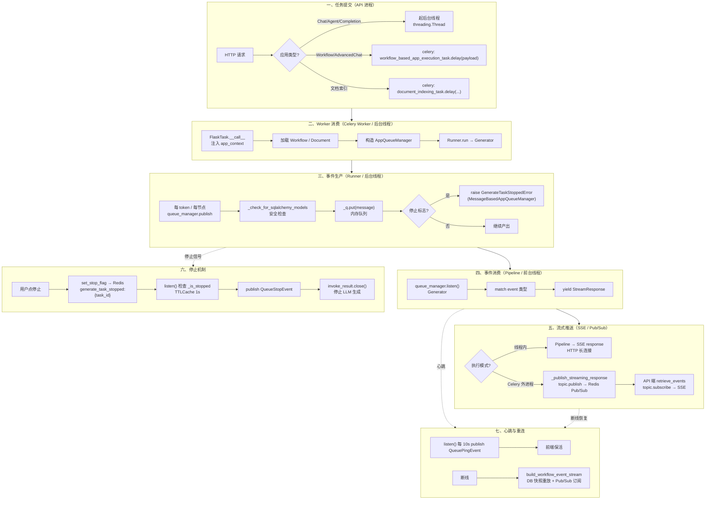
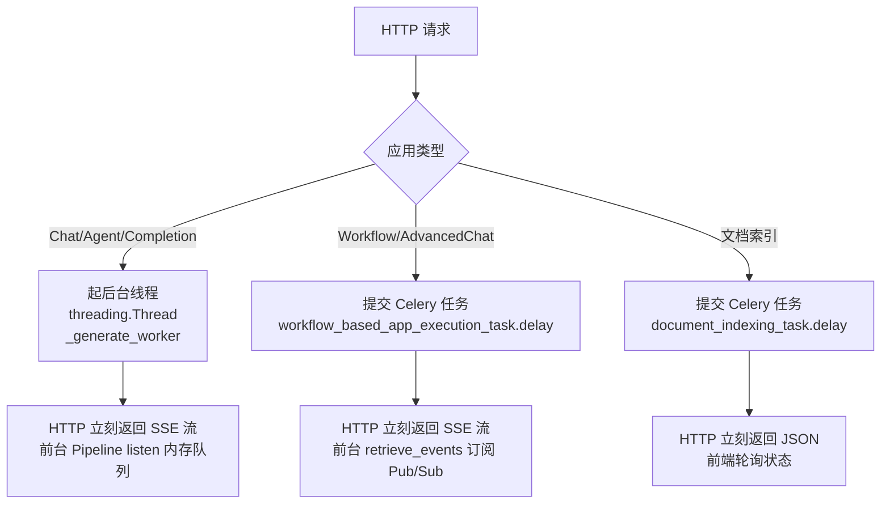
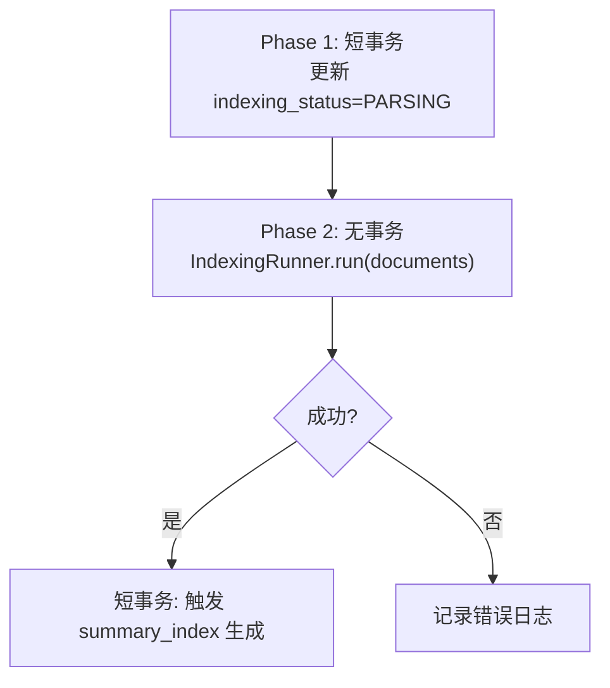
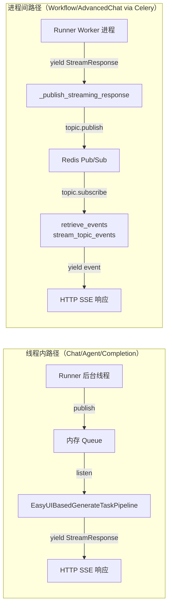
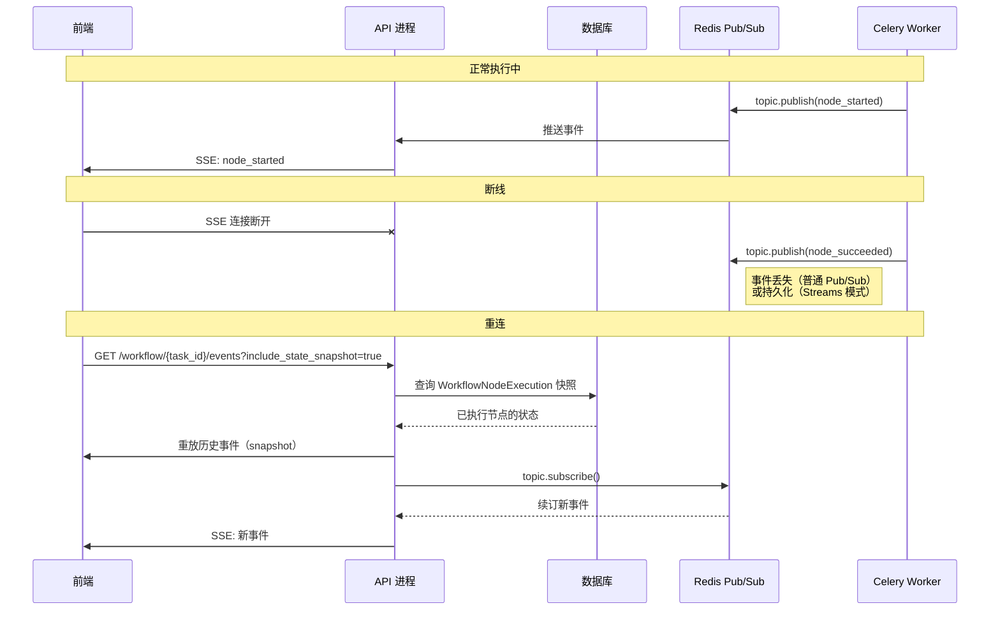

# 异步任务、事件驱动与流式输出

> **学习目标**：理解 Dify 的 Celery 异步任务架构、事件驱动机制、事件队列设计、流式输出实现，以及可观测性集成。
>
> **读完本章你应该能回答**：
> - Dify 为什么把"快任务"和"慢任务"分到两个进程（API / Worker）？它们之间用 Redis 作为消息总线解决了什么问题？
> - Celery 任务的六大类别分别是什么？每类有几个任务？
> - 三种应用流式路径（同步 WebSocket 直推、异步 Redis 持久化）的差异和选型原则？
> - `AppQueueManager` 的核心接口是什么？`publish()` 和 `listen()` 如何保证事件不丢、不串？
> - 整套事件类型体系（消息类、工作流类、Agent 类）有哪些事件？
> - 用户停止按钮是怎么生效的？执行引擎如何在不破坏数据的前提下优雅终止？
> - WebSocket 断开后如何恢复？Redis 历史事件如何重放？
> - 为什么 Dify 要对发布事件做 SQLAlchemy 安全检查？跨线程 lazy-load 的危险性是什么？
> - OpenTelemetry 在 Dify 中扮演什么角色？5 种追踪提供商各自的特色？
> - 如何定义自己的 Celery 任务？任务参数和重试机制有哪些约定？

## 本章要解决的问题

Dify 的应用执行引擎面临一个核心工程矛盾：**LLM 推理、文档索引、工作流执行都是慢任务（秒级到分钟级），但 HTTP 请求必须在 Nginx 60 秒超时前返回；与此同时，用户希望逐 token 看到输出、随时能点停止、断线后能恢复进度**。

这四个约束——不阻塞 HTTP、逐 token 流式、可中断、可恢复——合在一起排除了几乎所有"简单"方案。直接在 HTTP 请求里同步跑 LLM 循环会阻塞 Gunicorn worker 并触发超时；丢到 Celery 异步任务里又丢失了流式能力；纯同步 generator 无法响应"用户已点击停止"；不落库每一步状态，断线后历史就丢失。

Dify 的解法是**分两层异步基础设施**：第一层是 **Celery + Redis** 的进程级异步——API 进程把慢任务（文档索引、工作流执行）交给 Celery Worker 进程，两者通过 Redis 队列解耦；第二层是 **AppQueueManager + Redis Pub/Sub** 的流式事件总线——后台执行引擎把 token、节点状态、错误包成事件丢进队列，前台 Pipeline 从队列消费转成 SSE 流推给前端。停止信号通过 Redis 标志位传递，断线恢复通过 DB 快照 + Pub/Sub 重放实现。这一层基础设施坏了，一个慢索引会卡死所有用户的对话流，停止按钮形同虚设，断线后历史丢失。

## 宏观架构：一次异步执行的生命周期

下图是 Dify 异步任务从"提交"到"前端收到最后一片 token"的完整生命周期，也是全文的叙事主线——后续每一节对应生命周期的一个阶段。



理解这张图的关键：**Dify 有两条流式路径——线程内（Chat/Agent/Completion）和进程间（Workflow/AdvancedChat via Celery）**。线程内路径用内存 `queue.Queue` 解耦后台线程和前台线程；进程间路径用 Redis Pub/Sub 解耦 Worker 进程和 API 进程。两条路径共享同一套事件类型体系（`QueueEvent` 枚举）和同一个 `AppQueueManager` 基类，但 `_publish` 的实现不同。

下面按这七个阶段逐层展开。

## 一、任务提交

**这一节为什么存在**：HTTP 请求不能等慢任务完成，但必须先"造好"执行所需的全部上下文（配置、记录、队列、线程或 Celery 任务），否则后续阶段无从启动。这一阶段决定"任务怎么进入系统"。

Dify 有三种任务提交路径，对应三种应用模式：



### 1.1 线程内路径（Chat / Agent / Completion）

入口是 `AgentChatAppGenerator.generate()`（app_generator.py:69）。它做四件事：组装配置、初始化记录、建队列、起后台线程。

```python
# api/core/app/apps/agent_chat/app_generator.py:191-215
queue_manager = MessageBasedAppQueueManager(
    task_id=application_generate_entity.task_id,
    user_id=application_generate_entity.user_id,
    invoke_from=application_generate_entity.invoke_from,
    conversation_id=conversation.id,
    app_mode=conversation.mode,
    message_id=message.id,
)

context = contextvars.copy_context()
worker_thread = threading.Thread(
    target=self._generate_worker,
    kwargs={
        "flask_app": current_app._get_current_object(),
        "context": context,
        "application_generate_entity": application_generate_entity,
        "queue_manager": queue_manager,
        ...
    },
)
worker_thread.start()
```

几个关键设计决策：

- **`task_id` 是全链路追踪键**：`uuid.uuid4()` 生成，贯穿 GenerateEntity、QueueManager、Message 记录。后台线程和前台 Pipeline 通过它找到同一个队列。
- **后台线程必须携带 Flask context 和 contextvars**：因为 SQLAlchemy session、`current_app`、请求级 tracing 都依赖上下文变量，新线程默认丢失。`preserve_flask_contexts` + `contextvars.copy_context()` 把上下文"打包"带过去（app_generator.py:201、app_generator.py:247）。
- **HTTP 请求不等后台完成**：`worker_thread.start()` 后立刻调 `_handle_response` 返回 SSE 流。这是"不阻塞 HTTP"的物理实现。

### 1.2 进程间路径（Workflow / Advanced Chat via Celery）

入口在 `AppGenerateService`（app_generate_service.py:182），它把执行参数序列化后提交 Celery 任务：

```python
# api/services/app_generate_service.py:182
workflow_based_app_execution_task.delay(payload_json)
```

同时，API 进程立刻订阅 Redis Pub/Sub topic，把收到的事件转成 SSE 流返回前端：

```python
# api/services/app_generate_service.py:241-243
WorkflowAppGenerator.convert_to_event_stream(
    MessageBasedAppGenerator.retrieve_events(...)
)
```

`retrieve_events` 通过 `stream_topic_events` 订阅 Redis Pub/Sub topic（message_generator.py:23-39），topic key 格式为 `channel:{app_mode}:{workflow_run_id}`。

为什么 Workflow 走 Celery 而不是后台线程？因为 Workflow 的执行时间和 LLM 调用次数都不可预测——10 个节点的简单工作流可能 5 秒跑完，复杂工作流（带 Agent 节点、人机交互、长 PDF 解析）可能跑半小时。如果走后台线程，API 进程重启（部署、OOM）会丢失正在执行的任务；走 Celery Worker 进程，任务持久化在 Redis 队列里，Worker 重启后可以重新消费。

### 1.3 文档索引路径

文档上传后，API 进程创建 Document 记录（`status: 'waiting'`），然后提交 Celery 任务（document_indexing_task.py:32-46）：

```python
# api/tasks/document_indexing_task.py:32-33
@shared_task(queue="dataset")
def document_indexing_task(dataset_id: str, document_ids: list):
    ...
```

"先入库再异步索引"的模式避免了用户上传时的长时间阻塞——上传 1GB 文档不应该让 API 进程卡几分钟。

### 1.4 Celery 扩展初始化

Celery 实例在 `ext_celery.py` 中初始化（ext_celery.py:98-149）。关键设计是 `FlaskTask` 类——每个 Celery 任务执行时都包裹在 `app.app_context()` 里，让 Worker 进程也能访问 Flask 扩展（数据库、Redis 等）：

```python
# api/extensions/ext_celery.py:99-106
class FlaskTask(Task):
    def __call__(self, *args, **kwargs):
        from core.logging.context import init_request_context
        with app.app_context():
            init_request_context()
            return self.run(*args, **kwargs)
```

任务参数传递有一个铁律：**只传 ID，不传对象**。原因：Celery 序列化参数到 Redis，传对象需要 pickle，但 ORM 对象 pickling 容易失败（lazy-load 字段触发查询）；传 ID 让 Worker 进程自己查 DB，更解耦、更安全。

### 1.5 Celery 任务分类

`api/tasks/` 目录下有 47 个任务文件，按业务领域分为六大类：

| 任务类别 | 示例任务 | 队列 |
|----------|---------|------|
| **文档索引** | `document_indexing_task`, `normal_document_indexing_task`, `batch_clean_document_task` | `dataset` / `priority_dataset` |
| **工作流执行** | `workflow_based_app_execution_task`, `execute_workflow_professional`, `resume_app_execution` | `workflow_based_app_execution` |
| **邮件通知** | `mail_register_task`, `mail_invite_member_task`, `mail_reset_password_task` | 默认 |
| **数据清理** | `delete_account_task`, `clean_dataset_task`, `remove_app_and_related_data_task` | 默认 |
| **触发处理** | `trigger_processing_tasks`, `trigger_subscription_refresh_tasks` | 默认 |
| **系统维护** | `process_tenant_plugin_autoupgrade_check_task`, `generate_summary_index_task` | 默认（Beat 调度） |

Beat 定时任务在 `ext_celery.py:161-259` 中按开关注册（如 `ENABLE_CLEAN_EMBEDDING_CACHE_TASK`、`ENABLE_HUMAN_INPUT_TIMEOUT_TASK` 等），用 `crontab` 或 `timedelta` 调度。

## 二、Worker 消费

**这一节为什么存在**：任务到了 Worker 进程（或后台线程）后，要先完成"加载上下文 → 构造队列 → 启动 Runner"这条前置链，才能进入事件生产阶段。这一阶段决定"任务怎么开始跑"。

### 2.1 Celery Worker 的消费入口

`workflow_based_app_execution_task` 是 Workflow / Advanced Chat 的统一入口（workflow_execute_task.py:457-466）：

```python
# api/tasks/app_generate/workflow_execute_task.py:457-466
@shared_task(queue=WORKFLOW_BASED_APP_EXECUTION_QUEUE)
def workflow_based_app_execution_task(payload: str):
    exec_params = AppExecutionParams.model_validate_json(payload)
    runner = _AppRunner(db.engine, exec_params=exec_params)
    return runner.run()
```

`_AppRunner.run()`（workflow_execute_task.py:152-198）加载 Workflow 和 App 模型，构造 Flask context，调用 `AdvancedChatAppGenerator.generate()` 或 `WorkflowAppGenerator.generate()`，拿到 Generator 后交给 `_publish_streaming_response` 把事件推到 Redis Pub/Sub。

### 2.2 文档索引 Worker 的消费链路

`document_indexing_task` 的消费链路（document_indexing_task.py:49-191）分两个阶段事务：



为什么分两个阶段事务？因为 `IndexingRunner.run` 可能跑几分钟，长事务会锁住数据库连接。Phase 1 快速更新状态后提交事务释放连接，Phase 2 在无事务状态下跑索引，IndexingRunner 内部自己创建短事务。

文档索引还支持**租户隔离队列**（`TenantIsolatedTaskQueue`，document_indexing_task.py:193-233）：每个租户的任务串行执行，防止一个租户的大量文档索引任务挤占其他租户的资源。

## 三、事件生产

**这一节为什么存在**：后台执行引擎（Runner / GraphEngine）产出的 token 和节点状态，必须转换成结构化事件丢进队列，前台才能消费。这一阶段是"生产-消费"模型的生产者侧，理解它才能解释为什么 Runner 不直接写 HTTP 响应。

### 3.1 AppQueueManager：事件总线基类

`AppQueueManager` 是所有应用类型的事件总线基类（base_app_queue_manager.py:34）。它的核心接口只有三个：

```python
# api/core/app/apps/base_app_queue_manager.py:34-53
class AppQueueManager(ABC):
    def __init__(self, task_id: str, user_id: str, invoke_from: InvokeFrom):
        ...
        # 1. 写入 task_belong 缓存（权限校验，1800s TTL）
        self._task_belong_cache_key = AppQueueManager._generate_task_belong_cache_key(self._task_id)
        redis_client.setex(self._task_belong_cache_key, 1800, f"{user_prefix}-{self._user_id}")

        # 2. 内存队列
        self._q: queue.Queue = queue.Queue()
        # 3. 停止标志缓存（1s TTL，防止每帧打 Redis）
        self._stopped_cache: TTLCache = TTLCache(maxsize=1, ttl=1)
        self._cache_lock = threading.Lock()
```

构造函数做三件事，每件都有明确的设计意图：

1. **权限缓存**：每个 `task_id` 创建时立即在 Redis 写一条 `generate_task_belong:{task_id}` 记录（`user_id` + 角色前缀），TTL 30 分钟。后续停止操作可以快速校验"这个 task 属于哪个用户"。
2. **内存队列**：`queue.Queue` 用于进程内快速消费，无网络开销。这是线程内路径（Chat/Agent）的核心通道。
3. **停止标志缓存**：`TTLCache(maxsize=1, ttl=1)` 缓存"是否已停止"的 Redis 查询结果，1 秒过期。避免每产出一片 token 就查一次 Redis。

### 3.2 publish：发布事件（含安全检查）

`publish` 方法（base_app_queue_manager.py:127-135）做两件事——SQLAlchemy 安全检查 + 调用子类 `_publish`：

```python
# api/core/app/apps/base_app_queue_manager.py:127-135
def publish(self, event: AppQueueEvent, pub_from: PublishFrom) -> None:
    self._check_for_sqlalchemy_models(event.model_dump())
    self._publish(event, pub_from)
```

安全检查的细节见 §⑧。`_publish` 是抽象方法，由子类实现。

### 3.3 两种 _publish 实现

Dify 有两个 `AppQueueManager` 子类，对应两种应用类型，但**两者都不直接推送前端**——它们只往内存队列放消息，由各自的 Pipeline 消费：

**MessageBasedAppQueueManager**（Chat / Agent / Completion，message_based_app_queue_manager.py:28-53）：

```python
# api/core/app/apps/message_based_app_queue_manager.py:28-53
@override
def _publish(self, event: AppQueueEvent, pub_from: PublishFrom):
    message = MessageQueueMessage(
        task_id=self._task_id,
        message_id=self._message_id,
        conversation_id=self._conversation_id,
        app_mode=self._app_mode,
        event=event,
    )
    self._q.put(message)

    if isinstance(event, QueueStopEvent | QueueErrorEvent | QueueMessageEndEvent | QueueAdvancedChatMessageEndEvent):
        self.stop_listen()

    if pub_from == PublishFrom.APPLICATION_MANAGER and self._is_stopped():
        if self._app_mode == AppMode.ADVANCED_CHAT.value:
            return
        raise GenerateTaskStoppedError()
```

关键设计：
- **终止事件触发 `stop_listen()`**：收到 `QueueStopEvent` / `QueueErrorEvent` / `QueueMessageEndEvent` 后，往队列放一个 `None` 哨兵值，`listen()` 的 `get(timeout=1)` 收到 `None` 就 break 退出。
- **停止检查抛异常**：如果事件来自 `APPLICATION_MANAGER`（Runner 侧）且检测到停止标志，直接抛 `GenerateTaskStoppedError`——这会中断 Runner 的 Generator 循环。但 `ADVANCED_CHAT` 模式例外，因为它走 Workflow 引擎，停止由 GraphEngine 的命令通道处理。

**WorkflowAppQueueManager**（Workflow / Advanced Chat，workflow/app_queue_manager.py:24-44）：

```python
# api/core/app/apps/workflow/app_queue_manager.py:24-44
@override
def _publish(self, event: AppQueueEvent, pub_from: PublishFrom):
    message = WorkflowQueueMessage(task_id=self._task_id, app_mode=self._app_mode, event=event)
    self._q.put(message)

    if isinstance(event, QueueStopEvent | QueueErrorEvent | QueueMessageEndEvent
                  | QueueWorkflowSucceededEvent | QueueWorkflowFailedEvent
                  | QueueWorkflowPartialSuccessEvent):
        self.stop_listen()
```

差异：不抛 `GenerateTaskStoppedError`——Workflow 的停止通过 GraphEngine 的命令通道（`CommandChannel`）下发，不走异常路径。

### 3.4 事件类型体系

所有事件继承自 `AppQueueEvent`（Pydantic BaseModel），事件类型由 `QueueEvent` 枚举标识（queue_entities.py:17-54）。完整的 `QueueEvent` 枚举有 30+ 个值，按语义分为五大类：

| 类别 | 事件类 | QueueEvent 值 | 说明 |
|------|--------|--------------|------|
| **消息流** | `QueueLLMChunkEvent` | `LLM_CHUNK` | LLM 流式 token（基础模式应用） |
| | `QueueTextChunkEvent` | `TEXT_CHUNK` | 文本片段（工作流 LLM 节点） |
| | `QueueReasoningChunkEvent` | `REASONING_CHUNK` | 推理链（分离模式思考过程） |
| | `QueueAgentMessageEvent` | `AGENT_MESSAGE` | Agent 流式 token |
| | `QueueMessageEndEvent` | `MESSAGE_END` | 消息结束（含完整 usage） |
| | `QueueAdvancedChatMessageEndEvent` | `ADVANCED_CHAT_MESSAGE_END` | 高级聊天消息结束 |
| | `QueueMessageReplaceEvent` | `MESSAGE_REPLACE` | 内容替换（输出审核） |
| **控制流** | `QueueErrorEvent` | `ERROR` | 执行错误 |
| | `QueueStopEvent` | `STOP` | 用户停止（含 `StopBy` 原因） |
| | `QueuePingEvent` | `PING` | 心跳包 |
| | `QueueAnnotationReplyEvent` | `ANNOTATION_REPLY` | 标注命中，跳过 LLM |
| **工作流** | `QueueWorkflowStartedEvent` | `WORKFLOW_STARTED` | 工作流开始（含 `reason`） |
| | `QueueWorkflowSucceededEvent` | `WORKFLOW_SUCCEEDED` | 工作流成功 |
| | `QueueWorkflowFailedEvent` | `WORKFLOW_FAILED` | 工作流失败 |
| | `QueueWorkflowPartialSuccessEvent` | `WORKFLOW_PARTIAL_SUCCEEDED` | 部分节点成功 |
| | `QueueWorkflowPausedEvent` | `PAUSE` | 暂停（含 `PauseReason` 列表） |
| **节点** | `QueueNodeStartedEvent` | `NODE_STARTED` | 节点开始 |
| | `QueueNodeSucceededEvent` | `NODE_SUCCEEDED` | 节点成功 |
| | `QueueNodeFailedEvent` | `NODE_FAILED` | 节点失败 |
| | `QueueNodeExceptionEvent` | `NODE_EXCEPTION` | 节点异常（可恢复） |
| | `QueueNodeRetryEvent` | `RETRY` | 节点重试 |
| **迭代/循环** | `QueueIterationStartEvent` | `ITERATION_START` | 迭代开始 |
| | `QueueIterationNextEvent` | `ITERATION_NEXT` | 迭代下一项 |
| | `QueueIterationCompletedEvent` | `ITERATION_COMPLETED` | 迭代完成 |
| | `QueueLoopStartEvent` / `QueueLoopNextEvent` / `QueueLoopCompletedEvent` | `LOOP_*` | 循环事件 |
| **Agent 专用** | `QueueAgentThoughtEvent` | `AGENT_THOUGHT` | Agent 推理步骤 |
| | `QueueMessageFileEvent` | `MESSAGE_FILE` | 工具产生的文件 |
| | `QueueAgentLogEvent` | `AGENT_LOG` | Agent 日志 |
| **人机交互** | `QueueHumanInputFormFilledEvent` | `HUMAN_INPUT_FORM_FILLED` | 表单已填写 |
| | `QueueHumanInputFormTimeoutEvent` | `HUMAN_INPUT_FORM_TIMEOUT` | 表单超时 |

`QueueStopEvent` 有一个嵌套枚举 `StopBy`（queue_entities.py:491-499），区分四种停止原因：`USER_MANUAL`、`ANNOTATION_REPLY`、`OUTPUT_MODERATION`、`INPUT_MODERATION`。前端根据原因显示不同的 UI 提示。

事件类型的设计哲学是**"语义分类决定订阅逻辑"**：前端通过 `event` 字段决定渲染到哪里、显示什么样式；不同的应用类型（Chat / Workflow / Agent）有不同的"事件语言"，但都遵循统一的基类 `AppQueueEvent`，便于 `AppQueueManager.listen()` 通用接收。

> Agent 场景下这些事件的推送时机和上下文，详见 [03-agent-runtime.md](./dify-03-agent-runtime.md) §④（推理循环骨架）和 §⑦（事件消费与 SSE）。

## 四、事件消费

**这一节为什么存在**：后台线程产出的事件最终要变成前端的 SSE 流。这一阶段是"生产-消费"的消费者侧，理解它才能解释为什么 Runner 不直接写 HTTP 响应，以及为什么不同应用类型有不同的 Pipeline 类。

### 4.1 listen：Generator 模式消费

`listen()` 方法（base_app_queue_manager.py:55-87）是一个 Generator，用 `yield` 逐事件产出：

```python
# api/core/app/apps/base_app_queue_manager.py:55-87
def listen(self):
    listen_timeout = dify_config.APP_MAX_EXECUTION_TIME
    start_time = time.time()
    last_ping_time: int | float = 0
    try:
        while True:
            try:
                message = self._q.get(timeout=1)
                if message is None:
                    break
                yield message
            except queue.Empty:
                continue
            finally:
                elapsed_time = time.time() - start_time
                if elapsed_time >= listen_timeout or self._is_stopped():
                    self.publish(
                        QueueStopEvent(stopped_by=QueueStopEvent.StopBy.USER_MANUAL), PublishFrom.TASK_PIPELINE
                    )
                if elapsed_time // 10 > last_ping_time:
                    self.publish(QueuePingEvent(), PublishFrom.TASK_PIPELINE)
                    last_ping_time = elapsed_time // 10
    finally:
        self._graph_runtime_state = None
```

几个关键设计：

- **`get(timeout=1)` 而非 `get()`**：每秒超时一次，让 `finally` 块能检查超时和停止标志。如果用阻塞 `get()`，停止信号无法及时生效。
- **`None` 哨兵**：`stop_listen()` 往队列放 `None`，`listen()` 收到后 `break` 退出。这是优雅退出的信号。
- **`listen_timeout` 硬保护**：`APP_MAX_EXECUTION_TIME` 默认 60 秒，超过即发 `QueueStopEvent`。即使任务跑半天，这个机制让 listen 也能退出。
- **心跳每 10 秒**：`elapsed_time // 10 > last_ping_time` 时发 `QueuePingEvent`，前端用来检测连接是否存活。
- **停止检查在 `finally` 里**：即使 `get()` 抛异常，`finally` 也会检查停止标志。

### 4.2 三种 Pipeline 的消费差异

不同应用类型有不同的 Pipeline 类，但它们的核心模式相同——`for message in queue_manager.listen()` + `match event` 分发：

**EasyUIBasedGenerateTaskPipeline**（Chat / Agent / Completion，easy_ui_based_generate_task_pipeline.py:258-373）：

```python
# api/core/app/task_pipeline/easy_ui_based_generate_task_pipeline.py:265-276
for message in self.queue_manager.listen():
    if publisher:
        publisher.publish(message)
    event = message.event

    match event:
        case QueueErrorEvent():
            ...
            yield self.error_to_stream_response(err)
            break
        case QueueStopEvent() | QueueMessageEndEvent():
            ...
            yield message_end_resp
        case QueueLLMChunkEvent() | QueueAgentMessageEvent():
            chunk = event.chunk
            ...
            yield self._message_cycle_manager.message_to_stream_response(answer=delta_text, ...)
```

**AdvancedChatAppGenerateTaskPipeline**（Advanced Chat，advanced_chat/generate_task_pipeline.py:981-1031）和 **WorkflowAppGenerateTaskPipeline**（Workflow，workflow/generate_task_pipeline.py:696-744）使用更优雅的 `_dispatch_event` 模式——用 `dict[type, Callable]` 映射事件类型到 handler 方法：

```python
# api/core/app/apps/advanced_chat/generate_task_pipeline.py:902-938
def _get_event_handlers(self) -> dict[type, Callable]:
    return {
        QueuePingEvent: self._handle_ping_event,
        QueueErrorEvent: self._handle_error_event,
        QueueTextChunkEvent: self._handle_text_chunk_event,
        QueueWorkflowStartedEvent: self._handle_workflow_started_event,
        QueueNodeStartedEvent: self._handle_node_started_event,
        ...
    }
```

关键决策：
- **Runner 不直接写 HTTP**：它只 `publish` 事件到队列。这让 Runner 可以在后台线程跑，与 HTTP 线程解耦。
- **`QueueMessageEndEvent` / `QueueWorkflowSucceededEvent` 是终止信号**：Pipeline 收到后停止 listen，调 `_save_message` 落库最终结果。
- **`QueueErrorEvent` 触发 break**：错误事件让 Pipeline 立刻退出监听循环，不再消费后续事件。

### 4.3 Graphon 事件过滤

Workflow / Advanced Chat 走 Graphon 引擎，Graphon 产出的是原始事件流，Dify 通过过滤器转换为前端格式（workflow_entry.py:49-61）：

```python
# api/core/workflow/workflow_entry.py:49-61
def iter_dify_graph_engine_events(engine: GraphEngine) -> Generator[GraphEngineEvent, None, None]:
    yield from filter_graph_events(
        engine.run(),
        context=GraphEventFilterContext.from_engine(engine),
        filters=[ResponseStreamFilter()],
    )
```

`ResponseStreamFilter`（来自 `graphon.filters`）把 Graphon 的原始节点事件打标签——加 ID、加顺序、加元数据，让前端能按节点 ID 分组 LLM 片段，显示节点进度。Graphon 是通用引擎，事件粒度对开发者友好（"节点开始 / 节点成功"），但对前端展示需要额外的语义。

> Graphon 引擎的 DAG 调度、图层模式、节点执行详见 [11-workflow-engine.md](./dify-11-workflow-engine.md)。

## 五、流式推送

**这一节为什么存在**：事件消费后，还要变成前端能接收的 HTTP 流。这一阶段决定"token 怎么从后台线程推到浏览器"，是用户体验最直接的环节。

### 5.1 两条流式推送路径



**线程内路径**：Pipeline 在 HTTP 请求线程里跑，直接 yield `StreamResponse` 给 Flask 的 Response generator。SSE 格式由 `convert_to_event_stream` 转换。这是"不阻塞 HTTP"的物理实现——HTTP 线程在 `listen()` 上阻塞等待事件，但这个阻塞是有意义的（它在产出响应）。

**进程间路径**：Worker 进程跑 Runner，拿到 Generator 后由 `_publish_streaming_response`（workflow_execute_task.py:342-454）逐事件序列化并 `topic.publish` 到 Redis Pub/Sub。API 进程的 `retrieve_events` 订阅同一 topic，把收到的事件转成 SSE 流：

```python
# api/tasks/app_generate/workflow_execute_task.py:410-426
for event in response_stream:
    event_name = _get_event_name(event)
    ...
    try:
        if isinstance(event, BaseModel):
            payload = json.dumps(event.model_dump(mode="json"), ensure_ascii=False)
        else:
            payload = json.dumps(event, ensure_ascii=False, default=str)
    except (TypeError, ValueError):
        logger.exception("error while encoding event")
        continue

    topic.publish(payload.encode())

    if event_name == "workflow_started":
        started_published = True
    elif event_name in terminal_events:
        terminal_published = True
```

`_publish_streaming_response` 还有一个重要的兜底机制（workflow_execute_task.py:432-454）：如果 Generator 异常退出或正常结束但没发终止事件（`workflow_finished` / `workflow_paused`），它会合成一个 `workflow_started → workflow_finished(failed)` 事件序列推到 topic，确保 SSE 消费端永远能看到终止信号，不会无限等待。

### 5.2 Redis Pub/Sub 广播通道

进程间路径的桥梁是 Redis Pub/Sub，封装在 `BroadcastChannel` 抽象里（ext_redis.py:458-461）：

```python
# api/extensions/ext_redis.py:458-461
def get_pubsub_broadcast_channel() -> BroadcastChannelProtocol:
    assert _pubsub_redis_client is not None
    if dify_config.PUBSUB_REDIS_CHANNEL_TYPE == "sharded":
        return ShardedRedisBroadcastChannel(_pubsub_redis_client)
    ...
```

Dify 支持三种 Redis 广播通道实现：
- **`BroadcastChannel`**（普通 Pub/Sub，pubsub_channel.py:16）：基础模式，消息不持久化，订阅者断开期间的消息丢失。
- **`ShardedRedisBroadcastChannel`**（Redis 7.0+ Sharded Pub/Sub，sharded_channel.py:16）：分片模式，降低单节点负载。
- **`StreamsBroadcastChannel`**（Redis Streams，streams_channel.py:18）：持久化模式，支持回放。

Topic key 格式为 `channel:{app_mode}:{workflow_run_id}`（message_generator.py:12-13），每个 workflow run 一个独立 topic，天然隔离。

### 5.3 前端事件消费

前端通过 SSE（`text/event-stream`）接收事件，格式为 `data: {JSON}\n\n`。前端只做"事件类型 → UI 动作"的 switch 分发，不做业务逻辑：

```typescript
// 前端伪代码
const eventSource = new EventSource("/v1/workflow/runs/{task_id}/events");
eventSource.onmessage = (e) => {
  const event = JSON.parse(e.data);
  switch (event.event) {
    case "text_chunk": appendTextToUI(event.data.text); break;
    case "message_end": finalizeMessage(event.data); break;
    case "workflow_started": updateNodeStatus(event.data.id, "running"); break;
    case "node_started": updateNodeStatus(event.data.node_id, "running"); break;
    case "agent_thought": appendThoughtToUI(event.data); break;
    case "error": showError(event.data.error); break;
    case "ping": /* keep-alive */; break;
  }
};
```

### 5.4 SocketIO 的真实角色

需要澄清一个常见误解：**Dify 的 SocketIO（`sio`）不是用来推送 LLM 流式 token 的**。`ext_socketio.py` 创建的 `socketio.Server`（ext_socketio.py:9）只服务于**工作流编辑器的实时协作**（多用户同时编辑 DSL、鼠标位置同步、节点面板状态同步），注册在 socketio/workflow.py。LLM 流式输出走的是 SSE，不是 WebSocket。

### 5.5 不同应用类型的流式差异

| 应用类型 | Pipeline 类 | 流式事件 | 事件粒度 |
|---------|------------|---------|---------|
| **Chat** | `EasyUIBasedGenerateTaskPipeline` | `QueueLLMChunkEvent` | 每个 LLM token |
| **Completion** | `EasyUIBasedGenerateTaskPipeline` | `QueueLLMChunkEvent` | 每个 LLM token |
| **Agent (CoT/FC)** | `EasyUIBasedGenerateTaskPipeline` | `QueueAgentThoughtEvent` + `QueueAgentMessageEvent` | 推理步骤 + LLM token |
| **Advanced Chat** | `AdvancedChatAppGenerateTaskPipeline` | `QueueTextChunkEvent` + `QueueNode*Event` | 节点级 + LLM token |
| **Workflow** | `WorkflowAppGenerateTaskPipeline` | `QueueTextChunkEvent` + `QueueNode*Event` | 节点级 + LLM token |

> Agent 推理策略（CoT vs FC）的详细对比见 [03-agent-runtime.md](./dify-03-agent-runtime.md) §③。

Workflow 的"双层事件"——节点级（`QueueNodeStartedEvent` / `QueueNodeSucceededEvent`）和 LLM 级（`QueueTextChunkEvent`）——让前端可以按节点 ID 分组 LLM 片段，同一节点的 token 归到该节点下，进度显示更清晰。

## 六、停止机制

**这一节为什么存在**：用户点"停止生成"后，后台 LLM 生成必须尽快停下来——不停就继续烧 token 烧钱。但"停止"不是简单退出循环，要保证已落库的数据不回滚、已发的事件不丢失、上游 provider 的流被主动关闭。这一阶段是"可中断"约束的物理实现。

```mermaid
flowchart TD
    Click[用户点击"停止生成"] --> API_stop["API: POST /chat-messages/stop<br/>AppQueueManager.set_stop_flag"]
    API_stop --> Auth[验证用户身份<br/>task_belong 缓存比对]
    Auth --> Redis_stop["写入 Redis<br/>generate_task_stopped:{task_id} = 1<br/>TTL 600s"]

    Redis_stop --> Check["listen() finally 块<br/>_is_stopped() 检查"]
    Check --> TTL["TTLCache 缓存 TTL=1s<br/>避免每 token 查 Redis"]
    TTL --> Detected{检测到停止}
    Detected --> Pub["publish QueueStopEvent<br/>PublishFrom.TASK_PIPELINE"]
    Detected --> Pub2["MessageBasedAppQueueManager._publish<br/>检测 _is_stopped → raise GenerateTaskStoppedError"]
    Pub --> Pipeline[Pipeline 收到 QueueStopEvent → break]
    Pub2 --> Runner[Runner Generator 中断]
    Runner --> Close["invoke_result.close()<br/>关闭 LLM provider 流"]
```

### 6.1 set_stop_flag：写入 Redis 标志

停止的入口是 `AppQueueManager.set_stop_flag` 类方法（base_app_queue_manager.py:152-166）：

```python
# api/core/app/apps/base_app_queue_manager.py:152-166
@classmethod
def set_stop_flag(cls, task_id: str, invoke_from: InvokeFrom, user_id: str):
    result: Any | None = redis_client.get(cls._generate_task_belong_cache_key(task_id))
    if result is None:
        return

    user_prefix = "account" if invoke_from in {InvokeFrom.EXPLORE, InvokeFrom.DEBUGGER} else "end-user"
    if result.decode("utf-8") != f"{user_prefix}-{user_id}":
        return

    stopped_cache_key = cls._generate_stopped_cache_key(task_id)
    redis_client.setex(stopped_cache_key, 600, 1)
```

关键设计：
- **权限校验**：先查 `generate_task_belong:{task_id}` 缓存，比对 `user_id` 和角色前缀。只有任务的所有者才能停止自己的任务——防止 A 用户停止 B 用户的任务。
- **TTL 600 秒**：停止标志在 Redis 里存活 10 分钟，足够 Worker 检测到。超时自动清理，防止僵尸标志。
- **无用户校验版本**：`set_stop_flag_no_user_check`（base_app_queue_manager.py:168-181）用于系统内部停止（如超时），不检查用户身份。

### 6.2 _is_stopped：带缓存的检测

`_is_stopped` 用 `@cachedmethod` 装饰（base_app_queue_manager.py:183-194）：

```python
# api/core/app/apps/base_app_queue_manager.py:183-194
@cachedmethod(lambda self: self._stopped_cache, lock=lambda self: self._cache_lock)
def _is_stopped(self) -> bool:
    stopped_cache_key = AppQueueManager._generate_stopped_cache_key(self._task_id)
    result = redis_client.get(stopped_cache_key)
    if result is not None:
        return True
    return False
```

`TTLCache(maxsize=1, ttl=1)` 让停止检查每秒最多查一次 Redis。这是"延迟感知"的权衡——用户点停止后，引擎最坏要等 1 秒（缓存过期）+ 1 秒（`listen` 的 `get(timeout=1)` 超时）才知道。这避免了每 token 查 Redis 的开销，也避免了用户点错立即停的误操作。

### 6.3 GenerateTaskStoppedError：中断 Runner

停止信号传递到 Runner 的路径有两种：

**路径一（listen 侧）**：`listen()` 的 `finally` 块检测到 `_is_stopped()`，发 `QueueStopEvent`。Pipeline 收到后 break 退出，HTTP 流关闭。但 Runner 还在跑——它不知道前台已经停了。

**路径二（publish 侧）**：`MessageBasedAppQueueManager._publish` 在每次 publish 时检查 `_is_stopped()`（message_based_app_queue_manager.py:50-53），如果已停止且事件来自 `APPLICATION_MANAGER`，抛 `GenerateTaskStoppedError`。这个异常会中断 Runner 的 Generator 循环。

异常的捕获点在 `_handle_invoke_result_stream`（base_app_runner.py:340-343）：

```python
# api/core/app/apps/base_app_runner.py:340-343
except GenerateTaskStoppedError:
    # Explicitly close provider stream to stop in-flight token generation ASAP.
    invoke_result.close()
    raise
```

关键动作：
- **`invoke_result.close()`**：关闭上游 LLM provider 的流，立即停止 token 生成，省钱。
- **异常向上抛**：让 `_generate_worker` 的 `except GenerateTaskStoppedError: pass`（app_generator.py:261-262）静默收尾。
- **已落库的 `MessageAgentThought` 不回滚**：这些是用户已经看到的步骤，回滚会破坏可观测性。用户停止意味着"不要再往前走"，不是"撤销之前的内容"。

`GenerateTaskStoppedError` 本身只是一个空异常类（exc.py:1-2）：

```python
# api/core/app/apps/exc.py:1-2
class GenerateTaskStoppedError(Exception):
    pass
```

它的意义不在异常本身，而在于它是一个**跨线程的信号载体**——从前台 `listen()` 检测到 Redis 标志，到后台 Runner 的 Generator 被中断，全程通过这个异常传递"停止"语义。

### 6.4 Workflow 的停止差异

Workflow / Advanced Chat 不抛 `GenerateTaskStoppedError`（workflow/app_queue_manager.py:24-44）。停止通过 GraphEngine 的 `CommandChannel` 下发——前台调 `command_channel.send(StopCommand())`，GraphEngine 在节点边界检查命令并停止调度。这是 Workflow 和 Chat 的一个本质架构差异：Chat 用异常控制停止，Workflow 用命令通道控制停止。

> Graphon 的命令通道和节点中断机制详见 [11-workflow-engine.md](./dify-11-workflow-engine.md)。

## 七、心跳与重连

**这一节为什么存在**：长连接（SSE / WebSocket）会因网络抖动、代理超时、服务重启而断开。如果断线后无法恢复，用户就丢失了已有的执行进度——工作流跑了 5 分钟，断线后从头再来。这一阶段是"可恢复"约束的物理实现。

### 7.1 心跳保活

心跳在 `AppQueueManager.listen()` 中实现（base_app_queue_manager.py:83-85）：

```python
# 每 10 秒发一次 Ping
if elapsed_time // 10 > last_ping_time:
    self.publish(QueuePingEvent(), PublishFrom.TASK_PIPELINE)
    last_ping_time = elapsed_time // 10
```

`QueuePingEvent` 是一个空事件（queue_entities.py:478-483），只有 `event: QueueEvent.PING` 字段。它的作用：
- 前端检测连接是否存活——超过 10 秒没收到 Ping，说明后端可能卡死。
- 防止中间代理（Nginx、CDN）断开空闲连接——Nginx 默认 60 秒超时，10 秒心跳远小于这个阈值。
- `listen_timeout`（`APP_MAX_EXECUTION_TIME`）是硬保护——超过这个时间 listen 自动发 `QueueStopEvent` 停止。

进程间路径的心跳在 `stream_topic_events`（streaming_utils.py:44-46）中实现，逻辑相同——空闲时每 10 秒发 `StreamEvent.PING.value`。

### 7.2 断线重放

断线恢复的核心思路是**"DB 快照重放 + Pub/Sub 续订"**：



重放的实现在 `build_workflow_event_stream`（workflow_event_snapshot_service.py:69-172）：

```python
# api/services/workflow_event_snapshot_service.py:69-80
def build_workflow_event_stream(*, app_mode, workflow_run, tenant_id, app_id, session_maker, ...):
    topic = MessageGenerator.get_response_topic(app_mode, workflow_run.id)
    ...
    node_snapshots = node_execution_repo.get_execution_snapshots_by_workflow_run(...)

    def _generate():
        yield StreamEvent.PING.value
        ...
        with topic.subscribe() as sub:
            buffer_state = _start_buffering(sub)
            # 1. 重放 DB 快照
            snapshot_events = _build_snapshot_events(workflow_run, node_snapshots, ...)
            for event in snapshot_events:
                yield event
                if _is_terminal_event(event, ...):
                    return
            # 2. 续订 Pub/Sub 新事件
            while True:
                if buffer_state.done_event.is_set() and buffer_state.queue.empty():
                    return
                event = buffer_state.queue.get(timeout=1)
                yield event
                if _is_terminal_event(event, ...):
                    return
```

关键设计：
- **`_start_buffering`**：在重放 DB 快照之前先订阅 Pub/Sub，把期间到达的新事件缓存在 `buffer_state.queue` 里。重放完快照后从 queue 里取新事件，避免快照重放期间的新事件丢失。
- **`_is_terminal_event`**：遇到 `workflow_finished` / `workflow_paused` 等终止事件就停止，不再续订。
- **`include_state_snapshot` 参数**：前端可以选是否重放历史。如果 `false`，只订阅新事件（断线期间的历史不补）。

重连恢复的价值：**用户网络闪断不丢进度**。这是进程间路径相比线程内路径的关键收益——线程内路径断了就是断了（从头开始），进程间路径可以从断点继续（重放历史事件后再订阅新事件）。

## 八、事件安全：SQLAlchemy 跨线程检查

**这一节为什么存在**：事件从后台线程 publish 到前台线程消费，中间可能经过 Redis 序列化。如果事件里携带了 SQLAlchemy ORM 对象，跨线程访问会触发难以调试的崩溃。这个"看不见的安全"机制，没有它应用会在生产环境随机崩溃。

### 8.1 问题：lazy-load 跨线程

SQLAlchemy 的 ORM 对象有 lazy-load 机制——访问一个未加载的字段时，会自动触发数据库查询。这个查询用的是创建该对象的 session。当 ORM 对象被传递到另一个线程（通过事件队列）：

1. 原 session 可能已关闭 → 查询报 `DetachedInstanceError`。
2. 原 session 被其他请求占用 → 查询在错误的上下文执行，数据错乱。
3. SQLAlchemy 的 greenlet 模式下 → 报 `MissingGreenlet` 错误。

这些错误是**间歇性的**——开发环境可能不出现，生产环境负载高时才触发，极难复现和调试。

### 8.2 防御：_check_for_sqlalchemy_models

`publish` 方法在发布前递归检查事件数据（base_app_queue_manager.py:214-228）：

```python
# api/core/app/apps/base_app_queue_manager.py:214-228
def _check_for_sqlalchemy_models(self, data: Any):
    match data:
        case dict():
            for value in data.values():
                self._check_for_sqlalchemy_models(value)
        case list():
            for item in data:
                self._check_for_sqlalchemy_models(item)
        case _:
            if isinstance(data, DeclarativeMeta) or hasattr(data, "_sa_instance_state"):
                raise TypeError(
                    "Critical Error: Passing SQLAlchemy Model instances that"
                    " cause thread safety issues is not allowed."
                )
```

检查逻辑用 Python 3.10+ 的 `match` 语句递归遍历 dict 和 list，对叶子节点检查两个条件：
- `isinstance(data, DeclarativeMeta)`：是否是 SQLAlchemy 声明式模型实例。
- `hasattr(data, "_sa_instance_state")`：是否带有 SQLAlchemy 的实例状态属性（更通用，覆盖非声明式模型）。

命中任一条件就抛 `TypeError`——在开发阶段就暴露问题，不让它带到生产环境。

### 8.3 正确做法

事件里应该传**纯数据**（dict / list / str / int / float / bool / None），不传 ORM 对象。如果需要传递 ORM 对象的数据，先调用 `.model_dump()`（Pydantic）或手动转 dict：

```python
# 错误：传 ORM 对象
queue_manager.publish(QueueMyEvent(document=Document.query.get(doc_id)), ...)

# 正确：传纯数据
doc = Document.query.get(doc_id)
queue_manager.publish(QueueMyEvent(document={
    "id": doc.id,
    "title": doc.title,
    "status": doc.indexing_status,
}), ...)
```

这个检查是"看不见的安全"——没有它，应用可能在生产环境正常运行几天才出现一个神秘的 `MissingGreenlet` 崩溃，且难以复现。强制"事件不能携带 ORM 对象"的约定让所有开发者都遵守一个无歧义的规则。

## 收敛

### 边界：异步基础设施 vs 业务引擎

本章描述的 Celery + AppQueueManager + Pub/Sub 是**通用异步基础设施**，不关心业务逻辑（LLM 推理、文档分段、工作流调度）。业务引擎（Agent Runner、IndexingRunner、GraphEngine）是它的"客户端"——它们只管产出事件，不管事件怎么推到前端。

| 维度 | 异步基础设施（本章） | 业务引擎 |
|------|-------------------|---------|
| 关注点 | 任务调度、事件传递、停止信号、重连 | LLM 调用、工具执行、文档解析、节点调度 |
| 入口 | `AppQueueManager`、Celery Task | `AgentChatAppRunner`、`IndexingRunner`、`GraphEngine` |
| 变化频率 | 低（基础设施稳定） | 高（业务迭代快） |

**不该在这里做的事**：在 `AppQueueManager` 里加业务逻辑（如"遇到特定事件自动触发索引"）、在 Pipeline 里做 LLM 调用。这些属于业务层，应放在 Runner 或 GraphEngine 里。

### 扩展点

1. **自定义 Celery 任务**：用 `@shared_task` 装饰器定义，只传 ID 不传对象，详见附录 B。
2. **自定义事件类型**：继承 `AppQueueEvent`，加 `event: QueueEvent = QueueEvent.YOUR_EVENT` 字段，在 `QueueEvent` 枚举里注册。Pipeline 的 `match event` 分支里加对应处理。
3. **自定义 Pipeline**：如果需要新的应用类型，继承 `BasedGenerateTaskPipeline`，实现 `_process_stream_response`。
4. **Graphon 事件过滤器**：如果需要转换 Graphon 原始事件，实现 `graphon.filters.BaseFilter`，加到 `iter_dify_graph_engine_events` 的 `filters` 列表。

### 本章要点

1. **两层异步基础设施**：Celery + Redis 解决进程级异步（慢任务不阻塞 API），AppQueueManager + 内存 Queue 解决线程级异步（后台跑循环，前台转 SSE）。
2. **两条流式路径**：线程内路径（Chat/Agent/Completion，内存 Queue + SSE）、进程间路径（Workflow/AdvancedChat，Redis Pub/Sub + SSE）。
3. **AppQueueManager 是事件总线基类**：`publish`（含 SQLAlchemy 安全检查）+ `listen`（Generator + 心跳 + 超时保护）+ `set_stop_flag`（Redis 标志 + 权限校验）。
4. **停止机制基于 Redis + 异常**：`set_stop_flag` 写 Redis → `_is_stopped` 带缓存检测 → `MessageBasedAppQueueManager._publish` 抛 `GenerateTaskStoppedError` → `invoke_result.close()` 关闭 LLM 流。
5. **断线重放基于 DB 快照 + Pub/Sub 续订**：`build_workflow_event_stream` 先重放 `WorkflowNodeExecution` 快照，再续订 Pub/Sub 新事件，用 `_start_buffering` 避免衔接间隙丢事件。
6. **SQLAlchemy 安全检查是看不见的防线**：`_check_for_sqlalchemy_models` 递归检查事件数据，防止 ORM 对象跨线程泄露触发 `MissingGreenlet`。
7. **SocketIO 只用于编辑器协作**，LLM 流式输出走 SSE，不走 WebSocket。

### 推荐源码入口

| 文件 | 职责 |
|------|------|
| api/core/app/apps/base_app_queue_manager.py | 事件队列基类：`publish` / `listen` / `set_stop_flag` / `_check_for_sqlalchemy_models` |
| api/core/app/apps/message_based_app_queue_manager.py | Chat/Agent 的队列实现：`_publish` + `GenerateTaskStoppedError` |
| api/core/app/apps/workflow/app_queue_manager.py | Workflow 的队列实现：`_publish` 不抛异常 |
| api/core/app/entities/queue_entities.py | 所有队列事件实体定义（`QueueEvent` 枚举 + 30+ 事件类） |
| api/core/app/apps/exc.py | `GenerateTaskStoppedError` 异常定义 |
| api/core/app/apps/base_app_runner.py | `AppRunner` 基类：`_handle_invoke_result_stream` + 用户中断处理 |
| api/core/app/task_pipeline/easy_ui_based_generate_task_pipeline.py | Chat/Agent/Completion 的 Pipeline：`_process_stream_response` |
| api/core/app/apps/advanced_chat/generate_task_pipeline.py | Advanced Chat 的 Pipeline：事件分发 + 消息落库 |
| api/core/app/apps/workflow/generate_task_pipeline.py | Workflow 的 Pipeline：事件分发 + WorkflowAppLog |
| api/core/app/apps/streaming_utils.py | `stream_topic_events`：Pub/Sub 订阅 + 心跳 + 空闲超时 |
| api/core/app/apps/message_generator.py | `MessageGenerator`：Topic key 生成 + `retrieve_events` |
| api/tasks/app_generate/workflow_execute_task.py | Celery Worker 入口：`_publish_streaming_response` + 兜底终止事件 |
| api/services/workflow_event_snapshot_service.py | 断线重放：`build_workflow_event_stream` + DB 快照 + Pub/Sub 续订 |
| api/tasks/document_indexing_task.py | 文档索引任务：两阶段事务 + 租户隔离队列 |
| api/extensions/ext_celery.py | Celery 扩展初始化：`FlaskTask` + Beat 调度 + SSL |
| api/extensions/ext_socketio.py | SocketIO 扩展（仅用于编辑器协作） |
| api/core/workflow/workflow_entry.py | `iter_dify_graph_engine_events`：Graphon 事件过滤入口 |

---

## 附录

### A. 可观测性集成

#### A.1 OpenTelemetry

Dify 的可观测性集成分为两层：

- **应用级追踪**：OpenTelemetry 扩展（`ext_otel.py`）初始化 Tracer Provider 和 Meter Provider，配置导出器，自动埋点 Flask、SQLAlchemy、Redis 等框架。
- **工作流级追踪**：Graphon 引擎的 `ObservabilityLayer`（在 `WorkflowEntry.__init__` 中通过 `self.graph_engine.layer(ObservabilityLayer())` 添加，workflow_entry.py:235-236）为每个节点和 LLM 调用生成 Span。

#### A.2 链路追踪层级

```
Trace (工作流执行)
 ├── Span: workflow.run (总览)
 │     ├── Span: node:start (入口节点)
 │     ├── Span: node:llm-1
 │     │     ├── Span: llm.invoke
 │     │     │     ├── 属性: model, provider, temperature
 │     │     │     └── 指标: prompt_tokens, completion_tokens, latency
 │     │     └── Span: prompt_transform
 │     └── Span: node:code-1
 └── Span: workflow.run 结束
```

#### A.3 支持的追踪提供商

| 提供商 | 集成方式 | 特色功能 |
|--------|---------|----------|
| **Langfuse** | SDK 直接集成 | LLM 追踪、Prompt 管理、成本分析、A/B 测试 |
| **Arize Phoenix** | OTLP 导出 | 异常检测、可视化、归因分析 |
| **MLflow** | OTLP 导出 | 实验追踪、模型版本管理 |
| **Weave** | OTLP 导出 | 模型评估、数据追踪 |
| **Opik** | OTLP 导出 | LLM 应用追踪、评估框架 |

5 种提供商的选择反映了"OTLP 标准化 + 各家特色"的现状。Dify 把追踪抽象为 OTLP 标准（按 spans/attributes 组织），让用户能选最适合自己的后端，避免厂商绑定。详见 [14-observability.md](./dify-14-observability.md)。

### B. 实战：自定义 Celery 任务

定义自定义 Celery 任务的约定：

```python
# api/tasks/my_custom_task.py
from celery import shared_task

@shared_task(bind=True, max_retries=3, default_retry_delay=60)
def process_large_dataset(self, dataset_id: str):
    try:
        dataset = Dataset.query.get(dataset_id)
        for batch in dataset.documents:
            process_batch(batch)
            self.update_state(state="PROGRESS",
                meta={"current": batch_index, "total": total})
        return {"status": "completed", "dataset_id": dataset_id}
    except Exception as e:
        raise self.retry(exc=e)
```

定义任务时的几个约定：

1. **`bind=True` 把 self 注入任务**：可以在任务内调用 `self.retry(...)` / `self.update_state(...)`。
2. **`max_retries=3`、`default_retry_delay=60`**：失败重试的硬规则，避免无限重试拖垮 Worker。
3. **`self.update_state(state="PROGRESS", ...)`**：向前端暴露进度，让用户看到"已处理 100/1000"。
4. **只传 ID，不传对象**：Celery 序列化参数到 Redis，传对象需要 pickle，但 ORM 对象 pickling 容易失败（lazy-load 字段触发查询）。传 ID 让 Worker 进程自己查 DB。
5. **用 `@shared_task` 而非 `@app.task`**：`shared_task` 支持自动发现（auto-discover），不需要在 `app.tasks.register` 显式注册。
6. **指定队列**：`@shared_task(queue="dataset")` 把任务路由到专用队列，避免和别的任务抢占 Worker。

从 API 触发：

```python
task = process_large_dataset.delay(dataset_id)
return {"task_id": task.id, "status": "queued"}
```

### C. 事件安全：故障排查

#### 现象：日志出现 "Detached instance" 警告

某个 ORM 对象被序列化到了另一个线程。修复方法：提取需要的数据为 dict 而非 ORM 对象。检查 `queue_manager.publish()` 调用处，确保传入的事件不携带 SQLAlchemy 模型实例。

#### 现象：`TypeError: Critical Error: Passing SQLAlchemy Model instances...`

`_check_for_sqlalchemy_models` 检查命中。定位到 publish 调用，把事件里的 ORM 对象改成 dict。

### D. 故障排查决策树

#### 现象 1：Celery 任务堆积，队列迟迟不消化

```mermaid
flowchart TD
    Q{Worker 是否在运行?}
    Q -- 否 --> A1[检查 worker 进程: docker ps | grep worker]
    A1 --> A2[查看 worker 日志: docker logs dify-api-worker]
    A2 --> A3[常见原因:<br/>- OOM 被 kill<br/>- 数据库连接超时<br/>- LLM API 限速卡死]

    Q -- 是 --> B{任务是否超时?}
    B -- 是 --> B1[查看 CELERY_TASK_TIME_LIMIT 配置<br/>默认 30 分钟]
    B1 --> B2[长任务可拆子任务或加 ACK_LATE]

    B -- 否 --> C{任务状态?}
    C -- STARTED --> C1[Worker 进程被卡:<br/>ps aux 看 CPU 占用]
    C1 --> C2[可能: deadlock / 无返回的 HTTP call]
    C -- PENDING --> D{Redis 健康?}
    D -- 否 --> D1[重启 Redis 或检查 AOF 文件]
    D -- 是 --> E[检查 Celery 路由表是否匹配]
```

#### 现象 2：SSE 流频繁断连

| 症状 | 排查步骤 |
|------|----------|
| **连接后立即断** | 1. 检查 Nginx 的 `proxy_http_version 1.1` 和 `Upgrade/Connection` 头<br/>2. 检查 `worker_class = gevent` 配置 |
| **空闲 60s 断** | 确认心跳生效：`listen()` 每 10s 发 `QueuePingEvent`，Nginx `proxy_read_timeout` 至少 300s |
| **断后无法重连** | 确认前端调用 `GET /workflow/{task_id}/events?include_state_snapshot=true` 重放历史 |
| **Nginx 502** | 检查 `proxy_read_timeout` 至少 300s（默认 60s 容易断长任务流） |
| **进程间路径丢事件** | 检查 `PUBSUB_REDIS_CHANNEL_TYPE` 配置；普通 Pub/Sub 不保证消息不丢，考虑切换到 `streams` 模式 |

#### 现象 3：工作流挂起（无限等待）

```mermaid
flowchart LR
    Suspended([工作流挂起]) --> Check{有触发节点?}
    Check -- 有 --> PauseType{类型?}
    PauseType -- Wait/Pause --> P1[检查后续节点配置<br/>查看 WAITING 状态原因]
    PauseType -- HumanInput --> P2[检查 human_input_form_timeout<br/>Celery Beat 是否运行]
    PauseType -- Webhook --> P3[查看 Webhook 触发日志:<br/>GET /v1/triggers/webhook/{id}]

    Check -- 无 --> Loop[可能是节点死循环:<br/>查看 ExecutionLimitsLayer 日志]
```

---

> **相关文档**：Agent 运行时与控制流见 [03-agent-runtime.md](./dify-03-agent-runtime.md)；Workflow 引擎与 Graphon 详见 [11-workflow-engine.md](./dify-11-workflow-engine.md)；可观测性与 OpenTelemetry 详见 [14-observability.md](./dify-14-observability.md)；触发器系统详见 [15-trigger-system.md](./dify-15-trigger-system.md)。
