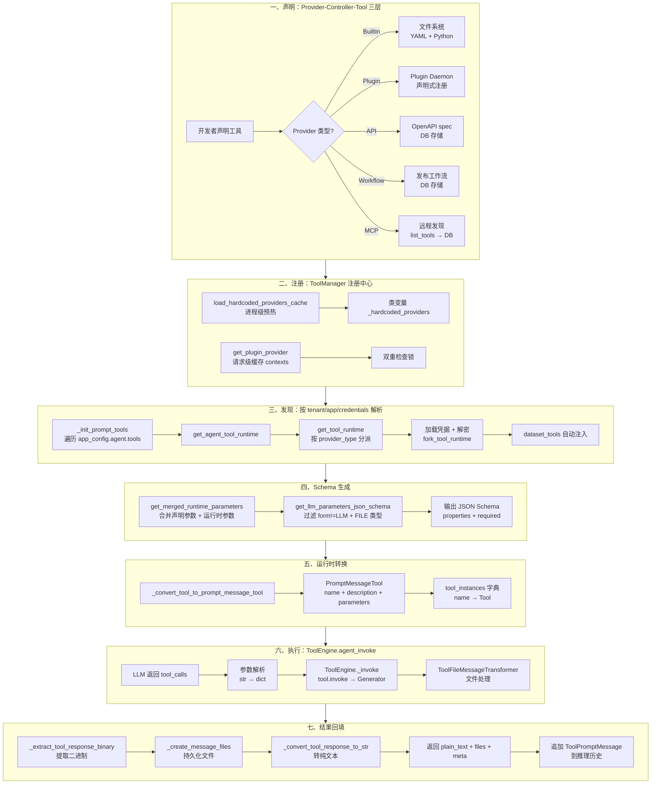
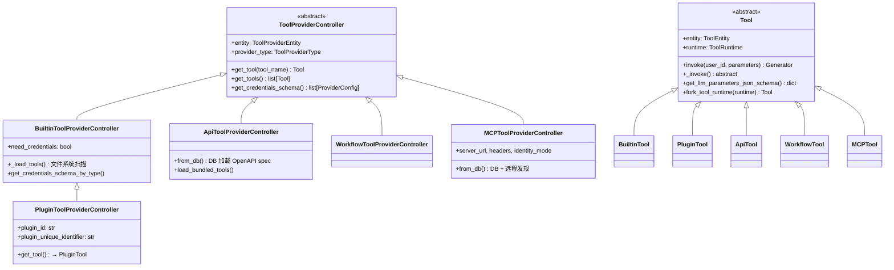
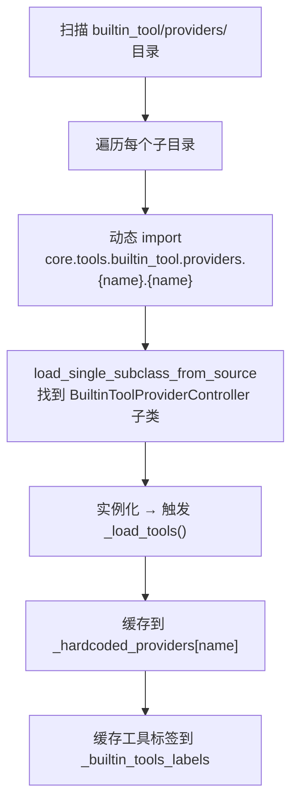
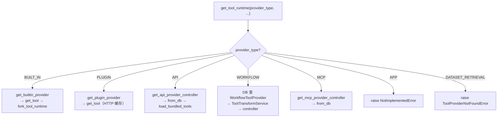
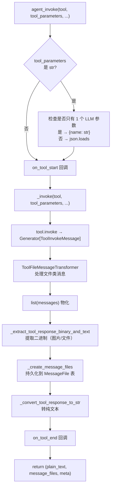
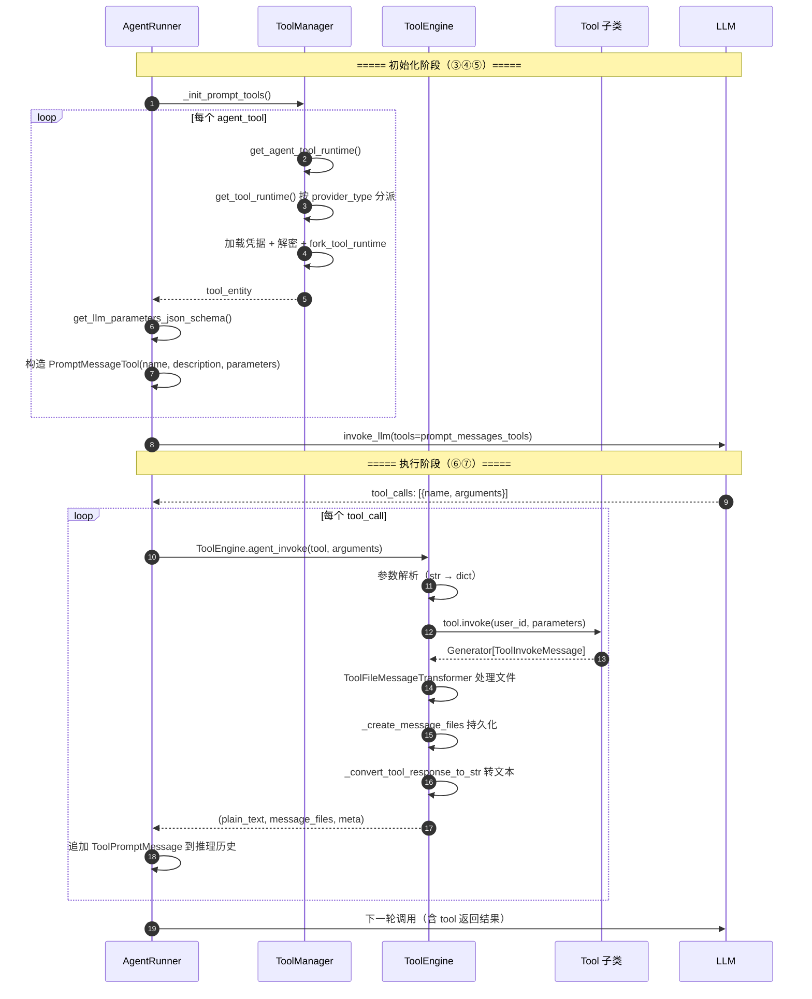
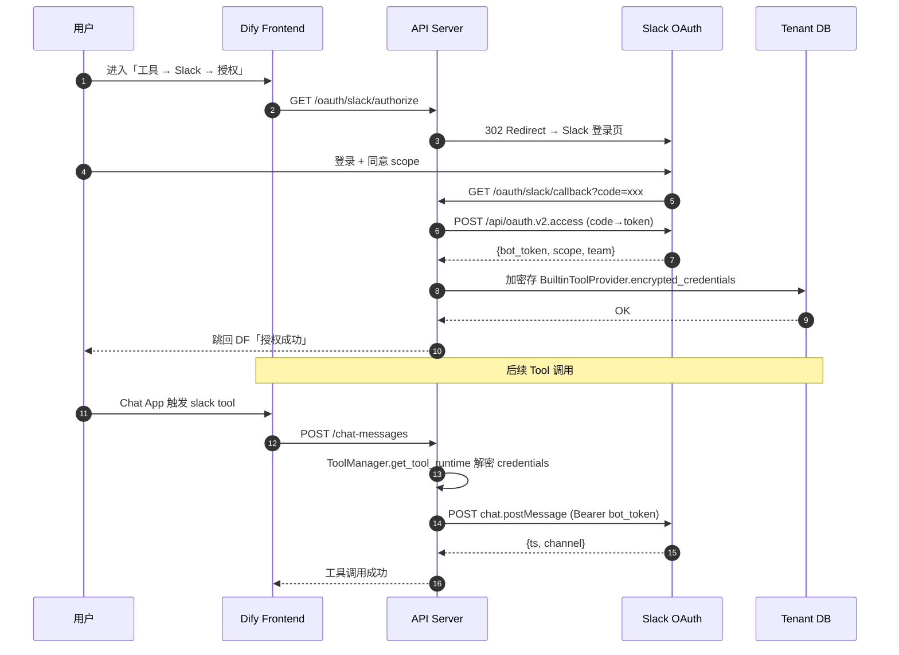

# 工具注册与发现机制

> **学习目标**：理解 Dify 工具系统的三层架构（Provider → Controller → Tool）、六种 Provider 类型的注册与发现流程、ToolManager 核心注册表、参数 Schema 生成，以及完整的工具调用链路。
>
> **读完本章你应该能回答**：
> - Dify 工具系统的三层架构（Provider / Controller / Tool）各自的职责是什么？为什么要分这三层？
> - 六种 Provider 类型（BUILT_IN / API / WORKFLOW / MCP / PLUGIN / DATASET_RETRIEVAL）的发现机制有何不同？
> - `ToolManager` 作为"唯一注册中心"如何实现懒加载 + 双重检查锁 + 多级缓存？
> - Builtin 工具如何通过文件系统扫描 → 动态 import → YAML 解析完成自动注册？
> - Plugin 工具如何通过 HTTP 与 Plugin Daemon 通信？为什么需要请求级缓存？
> - OpenAPI 工具、Workflow-as-Tool、MCP 工具分别的注册流程是什么？
> - 工具参数的三种 form（LLM / FORM / SCHEMA）如何影响 LLM 推理？
> - `get_llm_parameters_json_schema()` 如何生成高质量 schema？什么样的 description 才是 LLM 友好的？
> - 四层权限控制如何在工具调用时生效？
> - 同名工具冲突如何解决？Plugin vs Builtin 的优先级是什么？

## 本章要解决的问题

Dify 的 Agent 要调用工具，但"工具"是一个极度异构的概念——Google 搜索是 REST API、发送邮件是 OAuth 三方授权、知识库检索是内部函数、一个复杂业务流程可能是另一个 Dify 工作流、而 2024 年后越来越多的能力以 MCP 协议或 Plugin 插件形式提供。如果 Agent 代码直接耦合每一种工具的调用方式，每加一个工具就要改 Agent 的 if-else 分支、手写参数 schema、硬编码凭据获取逻辑——这会让 Agent 运行时变成一个不可维护的怪物。

更本质的矛盾是：**LLM 只认一种接口——JSON Schema 描述的 function definition**。不管工具后端是 HTTP、文件系统、还是另一个工作流，传给 LLM 的 `tools` 参数必须是统一的 `{"name", "description", "parameters"}` 结构。Dify 需要一层"翻译层"，把五种来源的工具统一注册、按租户隔离发现、动态生成 schema、在运行时转换为 LLM 可识别的 `PromptMessageTool`，再由 `ToolEngine` 统一执行并把结果回填为文本。

这层翻译坏了，Dify 的 Agent 就退回成"只能对话、不能动手"的纯 LLM——每加一个工具都要改 Agent 代码，参数 schema 全靠手写，多租户凭据隔离无从谈起。本章拆解的就是这层"工具注册与发现机制"。

## 宏观架构：一个工具从声明到执行的生命周期

下图是一个工具从被开发者声明，到被 Agent 发现、生成 schema、执行、回填结果的完整生命周期，也是全文的叙事主线——后续每一节对应生命周期的一个阶段。



理解这张图的关键：**LLM 看到的是 schema，执行的是 instance**。`_convert_tool_to_prompt_message_tool` 把一个 Tool 实例拆成两半——schema 给 LLM 看（`prompt_messages_tools`），instance 留着执行（`tool_instances`）。这种"声明与执行分离"让 LLM 不需要知道工具后端是 HTTP 还是工作流，只需要决定"调哪个、填什么参数"。

下面按这七个阶段逐层展开。

## 一、工具声明：Provider-Controller-Tool 三层架构

**这一节为什么存在**：工具的来源五花八门（文件系统、DB、远程 HTTP），但它们都需要"凭据管理 + 元数据查询 + 实例化"的公共能力。三层架构把这些公共能力抽到 Provider 层，让 Tool 层只关心执行——这样新增一种 Provider 类型时，只写 Controller 子类即可。

### 1.1 三层职责



三层职责的边界：

| 层级 | 基类 | 职责 | 关键方法 |
|------|------|------|---------|
| Provider（提供者） | `ToolProviderController`（tool_provider.py:14） | 管理一组同类工具，持有凭据 schema、OAuth 配置 | `get_tool()`、`get_tools()`、`get_credentials_schema()` |
| Controller（控制器） | 各子类 | 工具的发现、加载、凭据校验、生命周期 | `_load_tools()`、`from_db()`、`validate_credentials()` |
| Tool（工具） | `Tool`（tool.py:20） | 单个工具的执行逻辑、参数定义、schema 生成 | `_invoke()`、`get_llm_parameters_json_schema()`、`fork_tool_runtime()` |

为什么是三层而不是两层（直接 Tool）？两个原因：

1. **同类工具聚合**——一个 Provider（比如 Google Workspace）通常有多个 Tool（Gmail / Calendar / Drive）。把这些 Tool 聚合到一个 Provider 内管理凭据（共用一个 OAuth token）、维护一致的认证生命周期，避免每个 Tool 各自维护凭据。
2. **不同源的复用抽象**——不同来源（文件系统 / DB / HTTP）的工具都需要"凭据管理 + 元数据查询 + Tool 实例化"的能力。把这些公共能力放到 Provider 层抽象，让 Tool 层只关心"执行"。

### 1.2 六种 Provider 类型

`ToolProviderType` 枚举（tool_entities.py:65）：

| 类型 | 值 | 发现机制 | 存储 | 说明 |
|------|------|---------|------|------|
| `BUILT_IN` | `"builtin"` | 文件系统扫描 + Plugin Daemon | 内存 + Daemon | 代码内置 + 插件市场安装 |
| `API` | `"api"` | 用户上传 OpenAPI spec | DB (`tool_api_providers`) | REST API 包装为工具 |
| `WORKFLOW` | `"workflow"` | 发布 Dify 工作流 | DB (`tool_workflow_providers`) | 工作流复用为工具 |
| `MCP` | `"mcp"` | 远程 MCP Server 发现 | DB (`tool_mcp_providers`) | MCP 协议工具 |
| `PLUGIN` | `"plugin"` | Plugin Daemon HTTP | Daemon | 独立插件工具 |
| `DATASET_RETRIEVAL` | `"dataset-retrieval"` | 内置 | 内存 | 知识库检索（特殊内部类型） |
| `APP` | `"app"` | （未实现） | — | 发布 App 为工具（预留） |

五类主工具（builtin/api/workflow/mcp/plugin）的本质区别是**"工具的来源不同"**：

- **BUILT_IN / PLUGIN** 是 Dify 代码自己或插件提供的工具——发现靠扫描文件系统或 HTTP。
- **API / WORKFLOW / MCP** 是用户配置的——发现靠 DB 或远程协议。
- **DATASET_RETRIEVAL** 是 Dify 内部特定功能（知识库检索），不走 ToolManager 注册，由 `DatasetRetrieverTool` 单独构造（详见 [10-rag-retrieval.md](./dify-10-rag-retrieval.md)）。

### 1.3 各类 Provider 的声明方式

**Builtin**——文件系统声明。每个 Provider 目录下有 `{provider_name}.yaml` + `{provider_name}.py`，`tools/` 子目录下每个工具有 `{tool_name}.yaml` + `{tool_name}.py`（详见 §②）。

**Plugin**——声明式注册。插件安装时向 Plugin Daemon 上报 `declaration`（含 identity、tools 列表、credentials_schema），Dify 通过 HTTP 拉取（plugin/impl/tool.py:18）。`PluginToolProviderController` 继承自 `BuiltinToolProviderController`（plugin_tool/provider.py:11），复用凭据校验逻辑，但 `get_tool()` 不扫描文件系统而是从 `entity.tools` 列表查找（plugin_tool/provider.py:52）。

**API**——DB 声明。用户上传 OpenAPI/Swagger spec，解析后存入 `tool_api_providers` 表。`ApiToolProviderController.from_db()`（custom_tool/provider.py:38）从 DB 加载，`load_bundled_tools()` 把 JSON 反序列化为 `ApiToolBundle` 列表。

**Workflow**——DB 声明。发布工作流时，`ToolTransformService.workflow_provider_to_controller()` 把工作流的起始变量映射为工具参数，存入 `tool_workflow_providers` 表。

**MCP**——远程发现 + DB 缓存。用户配置 MCP Server URL 后，`MCPClientWithAuthRetry` 连接远程 Server 调用 `list_tools()`，序列化为 JSON 存入 `tool_mcp_providers` 表。`MCPToolProviderController.from_db()`（mcp_tool/provider.py:54）从 DB 加载，通过 `ToolTransformService.convert_mcp_schema_to_parameter()` 把 MCP 的 `inputSchema` 转为 Dify 的 `ToolParameter`。

## 二、注册：ToolManager 注册中心

**这一节为什么存在**：五种来源的工具需要被统一索引，Agent 才能按 `provider_type + provider_id + tool_name` 找到任意工具。`ToolManager` 是这个统一索引——它把文件系统扫描结果、Plugin Daemon 返回的声明、DB 里的用户配置，全部归一到同一个注册表里。

`api/core/tools/tool_manager.py` 的 `ToolManager` 是工具系统的**唯一注册中心**：

```python
class ToolManager:
    _builtin_provider_lock = Lock()                                    # 线程安全锁
    _hardcoded_providers: dict[str, BuiltinToolProviderController] = {} # name → controller（进程级）
    _builtin_providers_loaded = False                                   # 懒加载标记
    _builtin_tools_labels: dict[str, I18nObject | None] = {}            # 工具标签缓存
```

（tool_manager.py:98-102）

### 2.1 Builtin 懒加载：文件系统扫描 → 动态 import → YAML 解析

模块导入时自动触发预热（tool_manager.py:1181）：

```python
ToolManager.load_hardcoded_providers_cache()
```

`load_hardcoded_providers_cache()`（tool_manager.py:633）调用 `list_hardcoded_providers()`（tool_manager.py:552），后者用**双重检查锁**保证线程安全：

```python
@classmethod
def list_hardcoded_providers(cls):
    if cls._builtin_providers_loaded:          # 第一次检查（无锁）
        yield from list(cls._hardcoded_providers.values())
        return
    with cls._builtin_provider_lock:           # 加锁
        if cls._builtin_providers_loaded:      # 第二次检查（有锁）
            yield from list(cls._hardcoded_providers.values())
            return
        yield from cls._list_hardcoded_providers()  # 真正扫描
```

真正的扫描在 `_list_hardcoded_providers()`（tool_manager.py:595）：



实例化 `BuiltinToolProviderController` 时，构造函数会加载 Provider YAML 并触发 `_load_tools()`（builtin_tool/provider.py:65）扫描 `tools/` 目录下的所有 `.yaml` 文件，动态 import 对应的 Tool Python 模块，用 `load_single_subclass_from_source` 找到 `BuiltinTool` 子类并实例化。

```python
# builtin_tool/provider.py:65-98 _load_tools 简化
def _load_tools(self):
    provider = self.entity.identity.name
    tool_path = path.join(..., "providers", provider, "tools")
    tool_files = list(filter(lambda x: x.endswith(".yaml") and not x.startswith("__"), listdir(tool_path)))
    for tool_file in tool_files:
        tool_name = tool_file.split(".")[0]
        tool_yaml = load_yaml_file_cached(path.join(tool_path, tool_file))
        tool_class = load_single_subclass_from_source(
            module_name=f"core.tools.builtin_tool.providers.{provider}.tools.{tool_name}",
            script_path=path.join(..., "tools", f"{tool_name}.py"),
            parent_type=BuiltinTool,
        )
        tool_yaml["identity"]["provider"] = provider
        tools.append(tool_class(entity=ToolEntity.model_validate(tool_yaml), runtime=ToolRuntime(tenant_id="")))
    self.tools = tools
```

为什么用"懒加载 + 双重检查锁"模式？

1. **避免无谓 import**——`load_hardcoded_providers_cache()` 在模块导入时即执行（tool_manager.py:1181），扫描所有 builtin provider 目录。但 Plugin 类型的工具按租户隔离，只有请求到来时才通过 HTTP 获取。
2. **线程安全**——多线程 Flask 环境并发触发首次调用，双重检查锁保证只 import 一次。
3. **进程级缓存**——`_hardcoded_providers` 是类变量，所有请求共享，全进程只加载一次。

### 2.2 Plugin 请求级缓存：contexts + 双重检查锁

Plugin 工具不进 `_hardcoded_providers`（因为按租户隔离），而是走 `get_plugin_provider()`（tool_manager.py:144），用 `contexts.plugin_tool_providers` 做**请求级缓存**：

```python
@classmethod
def get_plugin_provider(cls, provider: str, tenant_id: str) -> PluginToolProviderController:
    try:
        contexts.plugin_tool_providers.get()        # 检查 context 是否设置
    except LookupError:
        contexts.plugin_tool_providers.set({})       # 首次：初始化空 dict
        contexts.plugin_tool_providers_lock.set(Lock())

    plugin_tool_providers = contexts.plugin_tool_providers.get()
    if provider in plugin_tool_providers:            # 第一次检查（无锁）
        return plugin_tool_providers[provider]

    with contexts.plugin_tool_providers_lock.get():  # 加锁
        plugin_tool_providers = contexts.plugin_tool_providers.get()
        if provider in plugin_tool_providers:        # 第二次检查（有锁）
            return plugin_tool_providers[provider]

        manager = PluginToolManager()
        provider_entity = manager.fetch_tool_provider(tenant_id, provider)  # HTTP
        controller = PluginToolProviderController(...)
        plugin_tool_providers[provider] = controller
        return controller
```

为什么 Plugin 用请求级缓存（`contexts`）而 Builtin 用进程级缓存（类变量）？因为 Plugin 工具是**租户隔离**的——不同租户安装的插件不同，不能用一个全局 dict。但同一个请求内可能多次查同一个 Provider（如 Agent 多轮迭代），请求级缓存避免重复 HTTP 往返。

### 2.3 Provider ID 格式：三段式命名空间

`GenericProviderID` 解析器（provider_ids.py:10）处理 Plugin/Builtin 的 provider ID：

- 完整格式：`organization/plugin_name/provider_name`（如 `langgenius/google/google`）
- 短格式：`provider_name` → 自动扩展为 `langgenius/provider_name/provider_name`（provider_ids.py:29-30）
- 特殊映射：`ToolProviderID` 对 `jina`、`siliconflow`、`stepfun`、`gitee_ai` 做 plugin_name 后缀映射（`{name}_tool`）（provider_ids.py:52-57）

三段式命名空间让不同组织发布的同名插件不冲突。`PluginToolManager.fetch_tool_providers()`（plugin/impl/tool.py:18）拉取后会重写 provider name 为 `{plugin_id}/{provider_name}`（plugin/impl/tool.py:44），确保全局唯一。

## 三、发现：按 tenant/app/credentials 解析可用工具

**这一节为什么存在**：注册表里有所有工具，但一次 Agent 运行只需要其中几个——由 `app_config.agent.tools` 指定。这一阶段把"配置里的工具声明"解析为"可执行的 Tool 实例"，并沿途完成凭据解密、参数类型转换、知识库工具注入。

### 3.1 入口：_init_prompt_tools

Agent Runner 初始化时调 `BaseAgentRunner._init_prompt_tools()`（base_agent_runner.py:185），它做两件事：

```python
def _init_prompt_tools(self) -> tuple[dict[str, Tool], list[PromptMessageTool]]:
    tool_instances = {}
    prompt_messages_tools = []

    # 1. 解析 app_config.agent.tools 里的每个工具声明
    for tool in self.app_config.agent.tools or []:
        try:
            prompt_tool, tool_entity = self._convert_tool_to_prompt_message_tool(tool)
        except Exception:
            continue  # api tool may be deleted —— 静默跳过已删除的工具
        tool_instances[tool.tool_name] = tool_entity
        prompt_messages_tools.append(prompt_tool)

    # 2. 自动注入 dataset_tools（知识库检索工具）
    for dataset_tool in self.dataset_tools:
        prompt_tool = self._convert_dataset_retriever_tool_to_prompt_message_tool(dataset_tool)
        prompt_messages_tools.append(prompt_tool)
        tool_instances[dataset_tool.entity.identity.name] = dataset_tool

    return tool_instances, prompt_messages_tools
```

关键设计：

- **静默跳过已删除工具**（`except Exception: continue`，base_agent_runner.py:195-197）——如果用户删了一个 API 工具但 Agent 配置还引用着，不让整个 Agent 崩溃，而是跳过这个工具继续跑。这与 Agent 运行时"错误即 Observation"的哲学一致（详见 [03-agent-runtime.md](./dify-03-agent-runtime.md) §6.1）。
- **dataset_tools 单独注入**——知识库检索工具不走 `ToolManager`，而是由 `DatasetRetrieverTool.get_dataset_tools()`（base_agent_runner.py:90）在 Runner 构造时单独创建，这里追加到工具列表末尾。
- **返回两个集合**——`tool_instances`（name → Tool 实例，用于执行）和 `prompt_messages_tools`（`PromptMessageTool` 列表，用于传给 LLM）。这就是"声明与执行分离"的物理实现。

### 3.2 get_agent_tool_runtime：按 provider_type 分派

`_convert_tool_to_prompt_message_tool()`（base_agent_runner.py:135）调 `ToolManager.get_agent_tool_runtime()`（tool_manager.py:393），后者内部调 `get_tool_runtime()`（tool_manager.py:182），按 `provider_type` match 分派：



（tool_manager.py:207-390）

BUILT_IN 分支最复杂（tool_manager.py:208-328），因为它要处理凭据：

1. 先 `get_builtin_provider()` 查 provider（先查 `_hardcoded_providers`，未命中再查 Plugin）
2. 判断 `need_credentials`——不需要凭据的工具（如 `time`）直接 `fork_tool_runtime` 返回
3. 需要凭据的，从 DB 查 `BuiltinToolProvider` 记录（按 tenant_id + provider_id），支持多凭据（`is_default` 优先）
4. **OAuth 过期自动刷新**——如果 `expires_at - 60 < now`，调 `OAuthHandler.refresh_credentials()` 刷新 token，更新 DB 并清缓存（tool_manager.py:289-316）
5. 用 `create_provider_encrypter()` 解密凭据，`fork_tool_runtime()` 创建带凭据的 Tool 实例

`fork_tool_runtime()`（tool.py:29）是关键——它不修改原 Tool 实例，而是 `model_copy()` entity 并创建新 runtime，让每个 Agent 请求拿到独立的凭据副本，互不污染。

### 3.3 参数类型转换与解密

`get_agent_tool_runtime()` 在拿到 Tool 实例后，还要处理 `tool_parameters`（tool_manager.py:417-440）：

```python
# 1. 合并声明参数 + 运行时参数
parameters = tool_entity.get_merged_runtime_parameters()
# 2. 把 AgentToolEntity.tool_parameters 转成运行时格式
runtime_parameters = cls._convert_tool_parameters_type(
    parameters, variable_pool, agent_tool.tool_parameters, typ="agent", ...
)
# 3. 解密 SECRET_INPUT 类型的参数
encryption_manager = ToolParameterConfigurationManager(...)
runtime_parameters = encryption_manager.decrypt_tool_parameters(runtime_parameters)
# 4. 写入 tool_entity.runtime.runtime_parameters
tool_entity.runtime.runtime_parameters.update(runtime_parameters)
```

`_convert_tool_parameters_type()`（tool_manager.py:1067）处理 FORM 类型的参数——如果参数是 `variable` 类型，从 `variable_pool` 解析值；如果是 `constant`，直接用配置值。这让 Agent 工具的参数可以引用工作流变量（如 `{{#node.output#}}`），而不只是硬编码。

## 四、参数 Schema 生成：get_llm_parameters_json_schema

**这一节为什么存在**：LLM 只认 JSON Schema。不管工具后端是什么，传给 LLM 的 `tools` 参数里的 `parameters` 字段必须是 `{"type": "object", "properties": {...}, "required": [...]}` 结构。这一阶段把 Tool 的参数声明翻译成 LLM 能理解的 schema。

`Tool.get_llm_parameters_json_schema()`（tool.py:162）：

```python
def get_llm_parameters_json_schema(self, ...) -> dict[str, Any]:
    schema: dict[str, Any] = {"type": "object", "properties": {}, "required": []}

    for parameter in self.get_merged_runtime_parameters(...):
        # 过滤 1：只暴露 form=LLM 的参数
        if parameter.form != ToolParameter.ToolParameterForm.LLM:
            continue
        # 过滤 2：不暴露 FILE 类型给 LLM
        if parameter.type in {SYSTEM_FILES, FILE, FILES}:
            continue

        parameter_schema = (
            {"type": parameter.type.as_normal_type(), "description": parameter.llm_description or ""}
            if parameter.input_schema is None
            else deepcopy(parameter.input_schema)  # MCP 工具可能带自定义 input_schema
        )
        parameter_schema.setdefault("description", parameter.llm_description or "")

        if parameter.type == SELECT and parameter.options:
            parameter_schema["enum"] = [option.value for option in parameter.options]

        schema["properties"][parameter.name] = parameter_schema
        if parameter.required:
            schema["required"].append(parameter.name)

    return schema
```

两个关键过滤的设计意图：

- **只暴露 `form=LLM` 的参数**——FORM 和 SCHEMA 的参数由用户在 UI 上预设（如 API Key、默认搜索范围），LLM 不用填。如果把这些暴露给 LLM，它会尝试填写不该填的字段（如尝试猜你的 API Key）。
- **不暴露 FILE 类型**——文件由用户上传或 Agent 内部传入，不是 LLM 自由决定的。LLM 不知道该传什么文件 ID。

### 4.1 三种 form 的语义

`ToolParameter.ToolParameterForm`（tool_entities.py:330）：

| form | 值 | 谁填 | 何时填 | 典型场景 |
|------|------|------|--------|---------|
| `SCHEMA` | `"schema"` | 用户 | 添加工具时 | 必填的连接配置（如 MCP Server URL） |
| `FORM` | `"form"` | 用户 | 调用前配置 | 每次调用都一样的值（API Key、默认 query） |
| `LLM` | `"llm"` | LLM | 推理时 | LLM 根据上下文决定的值（搜索关键词、邮件主题） |

### 4.2 参数合并：声明参数 vs 运行时参数

`get_merged_runtime_parameters()`（tool.py:123）合并两套参数：

- **声明参数**（`entity.parameters`）——来自 YAML / DB / Plugin 声明，是工具的静态定义。
- **运行时参数**（`get_runtime_parameters()` 返回）——子类可覆盖此方法，根据 `variable_pool` 动态生成参数（如 MCP 工具的参数可能依赖远程 Server 的运行时状态）。

合并规则：运行时参数按 `name` 覆盖声明参数，新参数追加到末尾。返回的是 deepcopy，调用方可安全修改（tool.py:139）。

## 五、运行时转换：_convert_tool_to_prompt_message_tool

**这一节为什么存在**：Tool 实例不能直接传给 LLM——LLM 需要的是 `PromptMessageTool`（一个轻量 schema 对象），而执行需要的是 Tool 实例（带凭据和 `_invoke()` 方法）。这一阶段把一个 Tool 实例"拆"成这两半。

`BaseAgentRunner._convert_tool_to_prompt_message_tool()`（base_agent_runner.py:135）：

```python
def _convert_tool_to_prompt_message_tool(self, tool: AgentToolEntity) -> tuple[PromptMessageTool, Tool]:
    # 1. 通过 ToolManager 解析工具实体（含凭据解密、参数转换）
    tool_entity = ToolManager.get_agent_tool_runtime(
        tenant_id=self.tenant_id,
        app_id=self.app_config.app_id,
        agent_tool=tool,
        user_id=self.user_id,
        invoke_from=self.application_generate_entity.invoke_from,
    )
    # 2. 构造 LLM 可识别的 PromptMessageTool
    assert tool_entity.entity.description
    message_tool = PromptMessageTool(
        name=tool.tool_name,
        description=tool_entity.entity.description.llm,           # LLM 友好的描述
        parameters=tool_entity.get_llm_parameters_json_schema(),   # §④ 生成的 schema
    )
    return message_tool, tool_entity
```

`PromptMessageTool` 的三个字段对应 LLM function calling 的标准格式：

| 字段 | 来源 | 用途 |
|------|------|------|
| `name` | `tool.tool_name`（AgentToolEntity 配置） | LLM 在 `tool_calls` 里用这个名字引用工具 |
| `description` | `tool_entity.entity.description.llm`（YAML 的 `description.llm`） | 告诉 LLM 这个工具做什么、何时用 |
| `parameters` | `get_llm_parameters_json_schema()` 输出 | 告诉 LLM 该填什么参数 |

注意 `name` 用的是 `tool.tool_name`（配置值），而不是 `tool_entity.entity.identity.name`（声明值）——这允许同一个工具被配置多次（如两个 Google Search 工具用不同 API Key），由 `tool_name` 区分。

### 5.1 dataset_tools 的特殊转换

知识库检索工具不走 `ToolManager`，有独立的转换方法 `_convert_dataset_retriever_tool_to_prompt_message_tool()`（base_agent_runner.py:155）。它手动构造 schema（`properties` 和 `required` 都手动填充），因为 `DatasetRetrieverTool` 的参数结构与普通 Tool 不同——它没有 `llm_description`，参数是检索配置而非业务参数。

## 六、执行：ToolEngine.agent_invoke

**这一节为什么存在**：LLM 返回 `tool_calls` 后，需要一个统一入口执行工具——处理参数解析、回调钩子、文件转换、错误捕获。`ToolEngine.agent_invoke` 就是这个入口，它让每个 Tool 子类只关心 `_invoke()` 业务逻辑。

`ToolEngine.agent_invoke()`（tool_engine.py:49）的执行流程：



### 6.1 参数解析：字符串到 dict

LLM 返回的 `tool_calls[].arguments` 可能是字符串（CoT 模式）或 dict（FC 模式）。`agent_invoke` 先做归一化（tool_engine.py:66-79）：

```python
if isinstance(tool_parameters, str):
    # 检查是否只有 1 个 LLM 参数——如果是，直接把字符串作为该参数的值
    parameters = [p for p in tool.get_runtime_parameters() if p.form == ToolParameterForm.LLM]
    if parameters and len(parameters) == 1:
        tool_parameters = {parameters[0].name: tool_parameters}
    else:
        with contextlib.suppress(Exception):
            tool_parameters = json.loads(tool_parameters)
        if not isinstance(tool_parameters, dict):
            raise ValueError(f"tool_parameters should be a dict, but got a string: {tool_parameters}")
```

这个设计处理了一个常见 LLM 行为：当工具只有一个参数时，LLM 经常不输出 JSON 而是直接输出裸字符串（如 `"Asia/Shanghai"` 而非 `{"timezone": "Asia/Shanghai"}`）。代码检测到单参数时自动包装，避免 JSON 解析失败。

### 6.2 _invoke：包裹 meta 的 Generator

`ToolEngine._invoke()`（tool_engine.py:203）是一个包装器，它在 `tool.invoke()` 的 Generator 外面包了一层 `ToolInvokeMeta`：

```python
@staticmethod
def _invoke(tool, tool_parameters, ...) -> Generator[ToolInvokeMessage | ToolInvokeMeta, ...]:
    started_at = datetime.now(UTC)
    meta = ToolInvokeMeta(
        time_cost=0.0, error=None,
        tool_config={"tool_name": ..., "tool_provider": ..., "tool_provider_type": ..., "tool_parameters": ..., "tool_icon": ...},
    )
    try:
        yield from tool.invoke(user_id, tool_parameters, ...)
    except Exception as e:
        meta.error = str(e)
        raise ToolEngineInvokeError(meta)
    finally:
        ended_at = datetime.now(UTC)
        meta.time_cost = (ended_at - started_at).total_seconds()
        yield meta  # 最后 yield meta
```

`ToolInvokeMeta`（tool_entities.py:459）记录执行耗时、错误信息、工具配置——这些信息会回填到 `MessageAgentThought` 表，是 Agent 可观测性的关键（详见 [05-agent-context.md](./dify-05-agent-context.md)）。

### 6.3 各类 Tool 的 _invoke 实现

`Tool.invoke()`（tool.py:47）是公共入口，它先合并 `runtime_parameters`，再做类型转换，最后调子类的 `_invoke()`：

| Tool 子类 | `_invoke()` 实现 | 关键行为 |
|-----------|------------------|---------|
| `BuiltinTool` | 子类实现 | 直接执行 Python 逻辑，`yield` 多种 `ToolInvokeMessage` |
| `PluginTool` | 转发到 `PluginToolManager.invoke()` | HTTP POST 到 `plugin/{tenant_id}/dispatch/tool/invoke`，流式返回（plugin/impl/tool.py:85） |
| `ApiTool` | `ssrf_proxy` 发 HTTP 请求 | 所有出站请求走 SSRF 代理（custom_tool/tool.py:281），防止访问内网 |
| `WorkflowTool` | 创建 `WorkflowAppGenerator` 执行 | 把工具参数作为工作流输入，提取输出构造返回（workflow_as_tool/tool.py:80） |
| `MCPTool` | `invoke_remote_mcp_tool()` | `MCPClientWithAuthRetry.invoke_tool()`，处理 TextContent/ImageContent/AudioContent/EmbeddedResource（mcp_tool/tool.py:66） |

### 6.4 错误处理：错误转文本

`agent_invoke` 的 except 链（tool_engine.py:129-156）把各类错误转成文本返回，而不是抛异常：

| 错误类型 | 返回文本 | 设计意图 |
|---------|---------|---------|
| `ToolProviderCredentialValidationError` | `"Please check your tool provider credentials"` | 凭据问题让 LLM 告诉用户去检查 |
| `ToolNotFoundError` / `ToolNotSupportedError` | `"there is not a tool named X"` | LLM 可换工具重试 |
| `ToolParameterValidationError` | `"tool parameters validation error: ..."` | LLM 可修正参数重试 |
| `ToolInvokeError` | `"tool invoke error: ..."` | 通用执行错误 |
| `ToolEngineInvokeError` | `"tool invoke error: {meta.error}"` | 带 meta 的执行错误，直接返回（不走兜底） |
| 通用 `Exception` | `"unknown error: ..."` | 兜底 |

这种"错误即文本"模式与 Agent 运行时的设计一致——让 LLM 看到错误后自主决策（重试、换工具、放弃），而不是终止整个推理循环（详见 [03-agent-runtime.md](./dify-03-agent-runtime.md) §6.1）。

## 七、结果回填：从 ToolInvokeMessage 到 LLM 可读文本

**这一节为什么存在**：Tool 的 `_invoke()` 返回的是 `Generator[ToolInvokeMessage]`——一种多形态消息流（文本、图片、文件、JSON、变量）。但 LLM 只能读文本。这一阶段把多形态消息流转成纯文本 + 文件列表 + meta，让 LLM 能消费工具结果。

### 7.1 文件提取与持久化

`ToolFileMessageTransformer.transform_tool_invoke_messages()`（tool_engine.py:98）先处理文件类消息——把 `IMAGE` / `IMAGE_LINK` / `BINARY_LINK` / `BLOB` 类型的消息提取出来，上传到文件存储，转成 URL。

然后 `_extract_tool_response_binary_and_text()`（tool_engine.py:280）提取二进制内容，`_create_message_files()`（tool_engine.py:335）把它们持久化到 `MessageFile` 表：

```python
message_file = MessageFile(
    message_id=agent_message.id,
    type=ToolEngine._resolve_tool_file_type(message),  # IMAGE / VIDEO / AUDIO / DOCUMENT / CUSTOM
    transfer_method=FileTransferMethod.TOOL_FILE,
    belongs_to=MessageFileBelongsTo.ASSISTANT,
    url=message.url,
    upload_file_id=tool_file_id,
    ...
)
```

关键设计：**用独立事务持久化文件**（tool_engine.py:352：`with sessionmaker(bind=db.engine, expire_on_commit=False).begin() as session`）——工具文件持久化是 Agent 执行的副作用，用独立事务确保它不会因为调用方 session 的回滚而丢失。

### 7.2 文本转换：_convert_tool_response_to_str

`_convert_tool_response_to_str()`（tool_engine.py:237）把所有消息类型转成纯文本：

| 消息类型 | 转换结果 |
|---------|---------|
| `TEXT` | 直接取 `.text` |
| `LINK` | `"result link: {url}. please tell user to check it."` |
| `IMAGE` / `IMAGE_LINK` | `"image has been created and sent to user already, you do not need to create it, just tell the user to check it now."` |
| `JSON` | `json.dumps(json_object)`（除非 `suppress_output=True`） |
| `VARIABLE` | 跳过（不进文本） |
| 其他 | `str(response.message)` |

这种转换的意图：**告诉 LLM 文件已经处理好了，不用再生成**。比如图片工具返回后，LLM 不应该再输出一段图片描述，而是告诉用户"图片已生成"。

### 7.3 回填推理历史

`agent_invoke` 返回 `(plain_text, message_files, meta)` 后，Agent Runner 把 `plain_text` 包装成 `ToolPromptMessage` 追加到 `_current_thoughts`（FC）或 `_agent_scratchpad`（CoT），作为下一轮 LLM 调用的 `observation`。`meta` 回填到 `MessageAgentThought` 记录。这 closes the loop——工具执行结果成为下一轮推理的输入。

### 7.4 端到端时序



## 收敛

### 边界：工具系统 vs 模型运行时

工具系统和模型运行时（[08-model-providers-and-extensions.md](./dify-08-model-providers-and-extensions.md)）都涉及"能力扩展"，但边界清晰：

| 维度 | 工具系统 | 模型运行时 |
|------|---------|-----------|
| 扩展对象 | Tool（被 Agent 调用） | Model（调用 LLM） |
| 注册中心 | `ToolManager` | `ModelRuntime` |
| LLM 关系 | LLM 决定调哪个工具 | LLM 本身是工具的调用者 |
| 执行入口 | `ToolEngine.agent_invoke` | `model_instance.invoke_llm` |

**不该在这里做的事**：在 Tool 的 `_invoke()` 里直接调 LLM（应该用 Workflow-as-Tool 封装）、在 ToolManager 里做权限校验（应在配置层做，见下）。

### 扩展点

- **新增 Builtin 工具**：在 `builtin_tool/providers/{name}/` 下加 YAML + Python，重启即生效（文件系统扫描自动发现）。
- **新增 Plugin 工具**：开发插件，通过 Plugin Daemon 安装，无需重启（HTTP 拉取声明）。
- **新增 API 工具**：用户上传 OpenAPI spec，存 DB 即生效。
- **新增 Workflow-as-Tool**：发布工作流时勾选"作为工具使用"。
- **新增 MCP 工具**：配置 MCP Server URL，远程发现工具。

### 配置层的数据集校验

原"四层权限"模型中的"数据集级"校验确实存在，但发生在配置层而非工具执行层：`AgentChatAppConfigManager` 在加载配置时调 `DatasetConfigManager.is_dataset_exists()`（agent_chat/app_config_manager.py:223），校验关联的知识库是否存在。工具级和租户级的权限校验由 API 层和配置层各自负责，不在 ToolManager 内集中实现。

### 本章要点

1. **三层架构**：Provider（管理一组工具 + 凭据）→ Controller（发现/加载）→ Tool（执行 + schema 生成）。
2. **五种主工具来源**：Builtin（文件扫描）、Plugin（Daemon HTTP）、API（OpenAPI 上传）、Workflow（工作流发布）、MCP（远程发现），外加 DATASET_RETRIEVAL（内部）和 APP（预留）。
3. **ToolManager 是唯一注册中心**：Builtin 用进程级类变量缓存（懒加载 + 双重检查锁），Plugin 用请求级 `contexts` 缓存（按租户隔离）。
4. **声明与执行分离**：`_convert_tool_to_prompt_message_tool` 把一个 Tool 拆成 `PromptMessageTool`（给 LLM）+ `Tool` 实例（用于执行）。
5. **`get_llm_parameters_json_schema()`**：过滤 `form!=LLM` 和 FILE 类型，只把 LLM 该填的参数暴露出去。
6. **`ToolEngine.agent_invoke`** 是统一执行入口：参数解析 → `tool.invoke` → 文件处理 → 文本转换 → 错误转文本。
7. **错误即文本**：工具错误不抛异常，转成文本让 LLM 自主决策（重试/换工具/放弃）。
8. **`fork_tool_runtime`** 保证每个请求拿到独立的凭据副本，互不污染。

### 推荐源码入口

| 文件 | 职责 |
|------|------|
| api/core/tools/tool_manager.py | 工具注册中心：发现、列表、缓存、运行时解析 |
| api/core/tools/tool_engine.py | 工具执行引擎：参数解析、回调钩子、文件转换、错误捕获 |
| api/core/tools/__base/tool.py | Tool 抽象基类：参数合并、Schema 生成、`_invoke()` |
| api/core/tools/__base/tool_provider.py | Provider 抽象基类：凭据 schema、`get_tool()` |
| api/core/tools/__base/tool_runtime.py | 运行时状态：tenant_id、credentials、runtime_parameters |
| api/core/tools/entities/tool_entities.py | 实体定义：`ToolProviderType`、`ToolParameter`、`ToolInvokeMeta` |
| api/core/tools/builtin_tool/provider.py | Builtin Provider：文件系统扫描、YAML 加载 |
| api/core/tools/plugin_tool/provider.py | Plugin Provider：Daemon 代理 |
| api/core/tools/custom_tool/tool.py | ApiTool：OpenAPI spec → SSRF 安全的 HTTP 请求 |
| api/core/tools/workflow_as_tool/tool.py | WorkflowTool：工作流作为工具 |
| api/core/tools/mcp_tool/tool.py | MCPTool：远程 MCP Server 调用 |
| api/core/plugin/impl/tool.py | PluginToolManager：HTTP 通信层 |
| api/core/agent/base_agent_runner.py | `_init_prompt_tools`、`_convert_tool_to_prompt_message_tool` |
| api/models/provider_ids.py | `ToolProviderID`、`GenericProviderID`：三段式 ID 解析 |

---

## 附录

### A. Builtin Provider YAML 结构

每个 Provider 目录下有一个 `{provider_name}.yaml`：

```yaml
identity:
  name: time
  author: Dify
  label:
    en_US: Time
    zh_Hans: 时间
description:
  en_US: Time-related tools
  zh_Hans: 时间相关工具
credentials_for_provider:  # 可选
  timezone:
    type: text-input
    required: true
    label:
      en_US: Timezone
oauth_schema:  # 可选，OAuth 三方工具
  client_schema: [...]
  credentials_schema: [...]
```

### B. Builtin Tool YAML 结构

`tools/{tool_name}.yaml`：

```yaml
identity:
  name: current_time
  author: Dify
  label:
    en_US: Current Time
description:
  human:
    en_US: Get the current time
    zh_Hans: 获取当前时间
  llm: A tool to get the current time in a specified timezone.
parameters:
  - name: timezone
    type: string
    required: true
    form: LLM  # LLM / FORM / SCHEMA
    human_description:
      en_US: Timezone (e.g. Asia/Shanghai)
    llm_description: The timezone to get current time for
output_schema:  # 可选，工具输出 schema
  type: object
  properties: {...}
```

`description.llm` 是给 LLM 看的——它直接影响 LLM 是否选择这个工具以及如何填参数。`description.human` 是给用户看的。两者分离是因为 LLM 和人类对"好描述"的标准不同：LLM 需要明确的触发条件和参数语义，人类需要友好的自然语言。

### C. API 工具的认证类型

| 类型 | 枚举值 | 说明 |
|------|--------|------|
| 无认证 | `NONE` | 无需认证 |
| API Key in Header | `API_KEY_HEADER` | API Key 放在 Header（可配置 header 名、key 值、前缀） |
| API Key in Query | `API_KEY_QUERY` | API Key 放在 Query 参数 |

`ApiProviderAuthType`（tool_entities.py:116）支持向后兼容：`api_key` 旧值自动映射为 `API_KEY_HEADER`（tool_entities.py:136-137）。

### D. Workflow-as-Tool 的变量映射

工作流起始节点的变量自动映射为工具参数：

```python
VARIABLE_TO_PARAMETER_TYPE_MAPPING = {
    "TEXT_INPUT": "STRING",
    "PARAGRAPH": "STRING",
    "SELECT": "SELECT",
    "NUMBER": "NUMBER",
    "CHECKBOX": "BOOLEAN",
    "FILE": "FILE",
    "FILE_LIST": "FILES",
    "JSON_OBJECT": "OBJECT",
}
```

`parameter_configurations` 控制哪些参数暴露给调用方、每个参数的 `form` 是 LLM 还是 FORM。

### E. MCP 工具的认证模式

| 模式 | 说明 |
|------|------|
| API Key | Header 或 Credentials 中传递 |
| OAuth 2.0 | 自动 token 管理，60 秒 grace period 提前刷新 |
| Identity Forwarding | 企业版 SSO token 通过 `X-Dify-SSO-Token` Header 转发（mcp_tool/tool.py:33） |

`MCPTool.invoke_remote_mcp_tool()`（mcp_tool/tool.py:272）创建 `MCPClientWithAuthRetry`，调用 `mcp_client.invoke_tool()`，处理返回的 `TextContent` / `ImageContent` / `AudioContent` / `EmbeddedResource`。

MCP 协议的深度解析见 [12-mcp-protocol.md](./dify-12-mcp-protocol.md)。

### F. 参数 Schema 的 LLM-Friendliness 调优

`get_llm_parameters_json_schema()` 输出的 schema 直接喂给 LLM。一个高质量的 schema 应具备以下特征：

**优质 vs 劣质 schema 对比**：

```jsonc
// 劣质：模糊、未约束
{
  "query": { "type": "string" },
  "limit": { "type": "integer" }
}

// 优质：边界清晰、描述完整
{
  "query": {
    "type": "string",
    "description": "搜索关键词，需 URL-encoded；不支持高级操作符",
    "minLength": 1,
    "maxLength": 256
  },
  "limit": {
    "type": "integer",
    "description": "返回结果数；范围 1-50，默认 10",
    "minimum": 1,
    "maximum": 50,
    "default": 10
  }
}
```

| 优化项 | 收益 | 实现 |
|--------|------|------|
| `enum` 替代 `string` | 减少 LLM 幻觉 | `enum: ["relevance", "date_desc"]` |
| 显式 `description` | +30% 参数正确率 | "金额用分表示，不是元" |
| `pattern` regex | 校验在前 | `pattern: "^grayscale\\.[a-z]+"` |
| `additionalProperties: false` | 防意外 | 告诉 LLM 不要发明字段 |

为什么 description 这么重要？因为 LLM 的"幻觉"主要来源于"不确定"——给它清楚的描述（"金额用分表示，不是元"）能消除大部分常见误解。`description.llm` 字段是写给人 LLM 看的，不是写给用户的，应该用 LLM 容易理解的方式描述参数语义和约束。

### G. OAuth 凭证流：典型三方工具配置

以 Slack 为例，展示 OAuth2 安装到调用的完整时序：



**凭证加密细节**：

- **加密算法**：`Fernet` 对称加密，密钥来自环境变量 `SECRET_KEY`
- **存储形态**：`BuiltinToolProvider.encrypted_credentials` 是加密后的 JSON 字符串
- **解密时机**：`get_tool_runtime()` 里 `create_provider_encrypter()` 解密（tool_manager.py:276-287），解密后的凭据只存在于 `ToolRuntime.credentials`，不进 LLM
- **OAuth 过期刷新**：`expires_at - 60 < now` 时自动刷新（tool_manager.py:289-316），60 秒 grace period 避免临界过期

### H. Label 管理

`ToolLabelManager`（tool_label_manager.py）：

- **Builtin 工具**：标签来自 Provider YAML 的 `identity.tags` 字段（枚举值如 `search`、`utilities`、`productivity`，定义在 tool_entities.py:45 的 `ToolLabelEnum`）
- **API/Workflow 工具**：标签存储在 `tool_label_bindings` 数据库表
- `ToolManager.get_tool_label()`（tool_manager.py:643）从 `_builtin_tools_labels` 缓存查询，缓存由 `load_hardcoded_providers_cache()` 预热。

---

> **相关文档**：Agent 推理策略与工具调用的深度解析见 [04-agent-reasoning.md](./dify-04-agent-reasoning.md)；Agent 上下文与 `MessageAgentThought` 持久化见 [05-agent-context.md](./dify-05-agent-context.md)；模型运行时与插件系统见 [08-model-providers-and-extensions.md](./dify-08-model-providers-and-extensions.md)；MCP 协议深度解析见 [12-mcp-protocol.md](./dify-12-mcp-protocol.md)。
