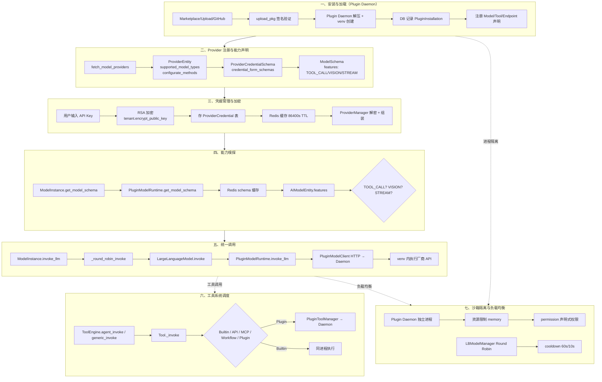
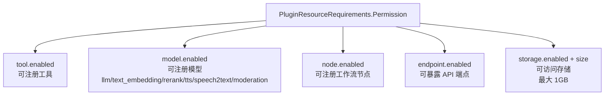
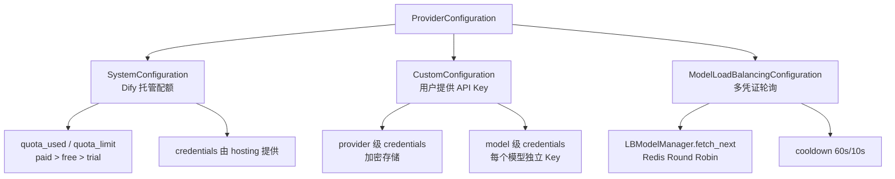
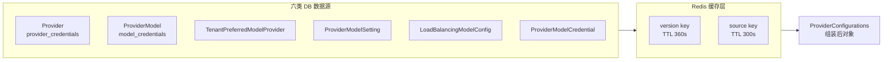
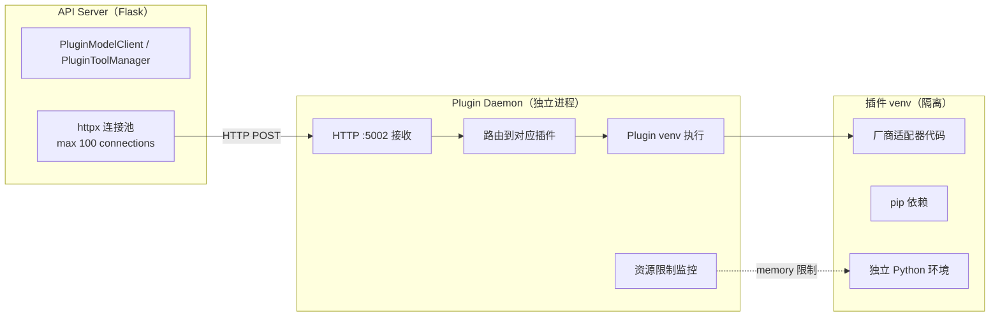
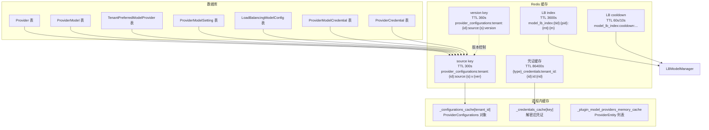
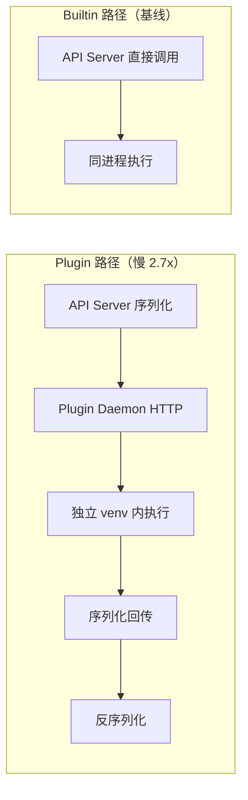
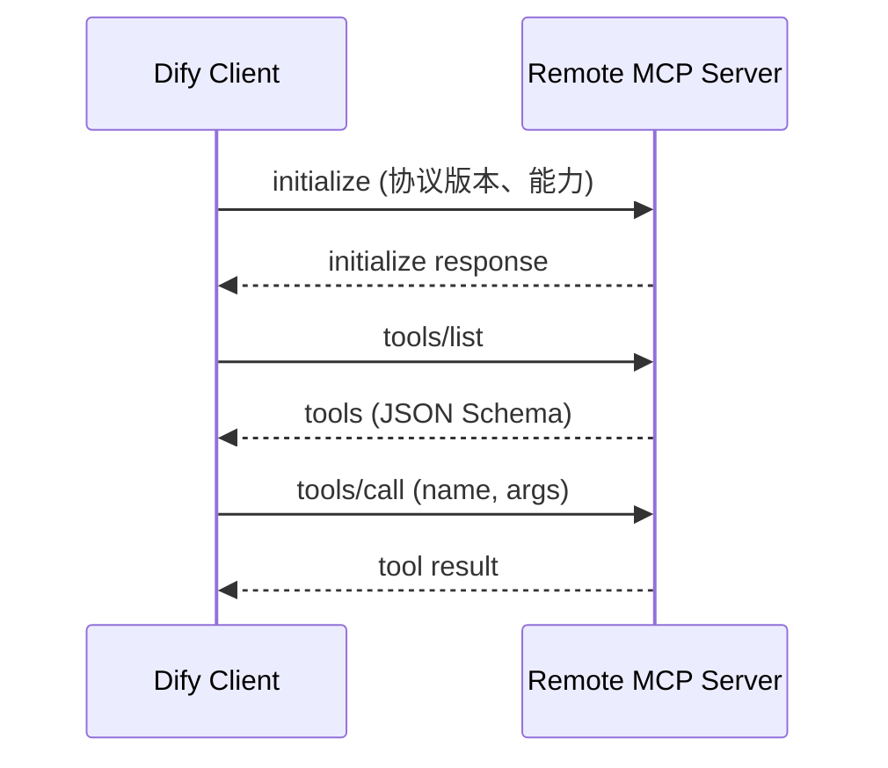

# 模型运行时、工具链与插件系统

> **学习目标**：理解 Dify 如何统一管理 100+ LLM 提供商，如何通过五类工具架构统一外部能力调用，以及插件系统的架构设计与开发方式。
>
> **读完本章你应该能回答**：
> - Dify 统一管理 5 类 AI 模型（LLM / Embedding / Rerank / TTS / Speech2Text）的"统一抽象"具体表现在哪里？
> - Provider 有哪三种配置类型（System / Custom / Load Balancing）？为什么互斥？
> - 凭证如何加密存储？Redis 缓存 TTL 5 分钟的设计考虑是什么？
> - 五种工具类型（Builtin / API / MCP / Workflow / Plugin）各自的发现机制是什么？
> - `ToolEngine` 为什么有三种 invoke 入口？异常处理在 Agent 和 Workflow 中为什么不同？
> - 插件的完整生命周期（Install → Loaded → Running → Stopped）是什么？
> - 插件的六类扩展点（Model / Tool / Extension / AgentStrategy / Datasource / Trigger / Endpoint）各支持什么场景？
> - 新增一个 LLM Provider 需要改哪些文件？最少侵入面是什么？
> - 多凭证 Load Balancing 怎么实现？什么时候切换备用 provider？
> - 插件与 Builtin 工具的性能差距有多大？什么场景该用哪个？

## 本章要解决的问题

Dify 的模型层要回答一个工程难题：**如何让 30+ 模型提供商（OpenAI、Anthropic、Cohere、智谱……）在同一套 `invoke_llm` 接口下运行，同时让第三方开发者能在不修改 Dify 主仓库的情况下新增模型和工具，还要防止恶意插件代码污染主进程？**

这三个约束任何一个单独满足都不难，合在一起就排除了几乎所有"简单"方案：直接在 Dify 主仓库里为每个厂商写适配器，会让核心代码膨胀到难以维护，而且新增厂商必须发版；让插件代码以 importlib 方式加载进主进程，一个有 bug 的模型适配器就能搞崩整个 API Server；而把所有模型调用丢给远程微服务又不现实——凭证解密、配额管理、负载均衡都需要与 Dify 主库紧密协作。

Dify v1.15.0 的解法是**"插件化模型运行时 + Plugin Daemon 沙箱"**：所有模型提供商（包括 OpenAI、Anthropic 等核心厂商）都不再是主仓库里的代码，而是作为插件运行在独立的 Plugin Daemon 进程中。`graphon.model_runtime` 包提供抽象基类（`LargeLanguageModel`、`AIModel` 等），`PluginModelRuntime` 作为适配器将 Dify API Server 的调用转发给 Plugin Daemon，Daemon 在隔离的 Python venv 中执行真正的厂商 API 调用。这一层坏了，Dify 的所有模型调用都会断联——Agent 无法推理、Workflow 的 LLM 节点无法执行、RAG 无法嵌入。

## 宏观架构：模型/插件的生命周期

下图是模型提供商和插件从安装到调用的完整生命周期，也是全文的叙事主线——后续每一节对应生命周期的一个阶段。



理解这张图的关键：**v1.15.0 的模型运行时已完全插件化**。`graphon.model_runtime` 包提供抽象基类和协议（`ModelRuntime`），但所有厂商适配器（OpenAI、Anthropic 等）都作为插件运行在 Plugin Daemon 中。Dify API Server 通过 `PluginModelRuntime` 适配器将调用转发给 Daemon，Daemon 在隔离的 venv 中执行真正的 API 调用。这种架构让"新增厂商"变成"安装插件"，无需改 Dify 主仓库一行代码。

下面按这七个阶段逐层展开。

## 一、安装与加载

**这一节为什么存在**：v1.15.0 的所有模型提供商和外部工具都是插件。插件必须先安装、加载、注册到 Plugin Daemon，才能被 Dify API Server 发现和调用。这一阶段决定了"系统里有哪些可用能力"。

### 1.1 安装入口与签名验证

插件安装有三种来源（api/core/plugin/entities/plugin.py:19）：

| 来源 | 说明 | 场景 |
|------|------|------|
| `Marketplace` | 从 Dify 官方市场下载 | 标准场景 |
| `Github` | 从 GitHub 仓库下载 | 开发者自建 |
| `Package` | 上传 .dify_pkg 包 | 私有/离线 |
| `Remote` | 远程标识符安装 | 批量部署 |

安装入口是 `PluginInstaller.upload_pkg()`（api/core/plugin/impl/plugin.py:89）：

```python
def upload_pkg(self, tenant_id: str, pkg: bytes, verify_signature: bool = False) -> PluginDecodeResponse:
    body = {"dify_pkg": ("dify_pkg", pkg, "application/octet-stream")}
    data = {"verify_signature": "true" if verify_signature else "false"}
    return self._request_with_plugin_daemon_response(
        "POST",
        f"plugin/{tenant_id}/management/install/upload/package",
        PluginDecodeResponse,
        files=body,
        data=data,
    )
```

关键设计决策：

- **包上传给 Plugin Daemon，不是 API Server**：API Server 只做转发，Daemon 负责解压、验证、venv 创建。这保证了即使解压过程有安全漏洞，也只能影响 Daemon 进程。
- **`verify_signature` 是安全开关**：企业版强制开启（`FORCE_VERIFYING_SIGNATURE`），验证插件包的 RSA 签名是否由可信源签发。社区版可选。
- **安装是异步任务**：`install_from_identifiers()` 返回 `PluginInstallTaskStartResponse`，实际安装状态通过 `PluginInstallTaskStatus` 轮询（api/core/plugin/entities/plugin_daemon.py:144）：

```python
class PluginInstallTaskStatus(StrEnum):
    Pending = "pending"
    Running = "running"
    Success = "success"
    Failed = "failed"
```

### 1.2 Plugin Daemon 的角色

Plugin Daemon 是独立的服务进程（Go 实现），通过 HTTP 与 API Server 通信（api/core/plugin/impl/base.py:43）：

```python
plugin_daemon_inner_api_baseurl = URL(str(dify_config.PLUGIN_DAEMON_URL))
_plugin_daemon_timeout_config = cast(float | httpx.Timeout | None,
    getattr(dify_config, "PLUGIN_DAEMON_TIMEOUT", 600.0))
```

Daemon 的核心职责：

1. **包管理**：解压、签名验证、依赖解析
2. **进程隔离**：每个插件在独立 Python venv 中运行，pip 依赖隔离
3. **资源限制**：`PluginResourceRequirements.memory` 限制内存（如 256MB）
4. **声明注册**：读取 `plugin.yaml`，注册 Model/Tool/Endpoint 等扩展点
5. **调用分发**：接收 API Server 的 HTTP 调用，在对应 venv 中执行

### 1.3 插件声明与权限模型

插件的 `plugin.yaml` 被解析为 `PluginDeclaration`（api/core/plugin/entities/plugin.py:70）：

```python
class PluginDeclaration(BaseModel):
    class Plugins(BaseModel):
        tools: list[str] | None = Field(default_factory=list[str])
        models: list[str] | None = Field(default_factory=list[str])
        endpoints: list[str] | None = Field(default_factory=list[str])
        datasources: list[str] | None = Field(default_factory=list[str])
        triggers: list[str] | None = Field(default_factory=list[str])

    version: str = Field(...)
    author: str | None = Field(..., pattern=r"^[a-zA-Z0-9_-]{1,64}$")
    name: str = Field(..., pattern=r"^[a-z0-9_-]{1,128}$")
    category: PluginCategory
    resource: PluginResourceRequirements
    plugins: Plugins
```

`PluginResourceRequirements.Permission`（api/core/plugin/entities/plugin.py:29）是插件的"安全边界"——声明了它能注册哪些扩展点、能访问哪些存储：



这种声明式权限模型避免了"装了个天气查询插件，结果它能调用 chat 接口"的越权风险。Daemon 在加载插件时会校验 `permission` 字段，拒绝未声明的扩展点注册。

### 1.4 插件分类

`PluginCategory`（api/core/plugin/entities/plugin.py:61）定义六类插件，由 `validate_category` 自动推断：

```python
class PluginCategory(StrEnum):
    Tool = auto()
    Model = auto()
    Extension = auto()
    AgentStrategy = "agent-strategy"
    Datasource = "datasource"
    Trigger = "trigger"
```

类别自动推断逻辑（api/core/plugin/entities/plugin.py:124）：声明里有 `tool` → Tool，有 `model` → Model，有 `datasource` → Datasource，有 `agent_strategy` → AgentStrategy，有 `trigger` → Trigger，否则 → Extension。Endpoint 插件归入 Extension 类别。

## 二、Provider 注册与能力声明

**这一节为什么存在**：插件安装后，Dify 需要知道"这个插件提供了哪些模型提供商、每个提供商支持哪些模型类型和配置方式"。这一阶段是"能力发现"，决定了 UI 上能看到哪些可选 Provider。

### 2.1 Provider 发现链路

Provider 发现通过 `PluginModelRuntime.fetch_model_providers()`（api/core/plugin/impl/model_runtime.py:132）：

```python
@override
def fetch_model_providers(self) -> Sequence[ProviderEntity]:
    return self._plugin_service.fetch_plugin_model_providers(
        tenant_id=self.tenant_id, client=self.client
    )
```

`PluginService` 从 Plugin Daemon 获取 provider 列表，并做租户级缓存（api/core/plugin/plugin_service.py:71）：

```python
class PluginService:
    _plugin_model_providers_memory_cache: ClassVar[
        dict[str, tuple[int, float, tuple[ProviderEntity, ...]]]
    ] = {}
    REDIS_TTL = 60 * 5  # 5 minutes
    PLUGIN_MODEL_PROVIDERS_REDIS_KEY_PREFIX = "plugin_model_providers:tenant_id:"
```

缓存分两层：
- **内存缓存**（`_plugin_model_providers_memory_cache`）：进程内字典，避免同一进程内重复 HTTP 调用
- **Redis 缓存**（TTL 5 分钟）：跨进程共享，避免每个 Gunicorn worker 都打 Daemon

两层缓存的意义：provider 列表不频繁变化（只在安装/卸载插件时变），但每次 UI 渲染模型选择器都要拉全量。5 分钟 TTL 在"即时性"和"性能"间取了平衡——安装新插件后最多等 5 分钟看到，或手动触发缓存失效。

### 2.2 ProviderEntity：能力声明

每个 provider 的能力声明由 `ProviderEntity`（来自 `graphon.model_runtime.entities.provider_entities`）描述，关键字段：

| 字段 | 类型 | 含义 |
|------|------|------|
| `provider` | `str` | 唯一标识，如 `langgenius/openai/openai` |
| `supported_model_types` | `list[ModelType]` | 支持的模型类型：LLM / TEXT_EMBEDDING / RERANK / TTS / SPEECH2TEXT / MODERATION |
| `configurate_methods` | `list[ConfigurateMethod]` | 配置方式：PREDEFINED_MODEL（预定义模型）/ CUSTOMIZABLE_MODEL（自定义模型）|
| `provider_credential_schema` | `CredentialFormSchema` | Provider 级凭证表单（如 API Key） |
| `model_credential_schema` | `CredentialFormSchema` | Model 级凭证表单（自定义模型用） |

`configurate_methods` 决定了 UI 上的配置流程：

- **PREDEFINED_MODEL**：Provider 有预设模型清单（如 OpenAI 的 gpt-4、gpt-3.5-turbo），用户只需填 API Key
- **CUSTOMIZABLE_MODEL**：用户可自定义模型名和 endpoint（如接入 OpenAI 兼容的私有部署）

一个 Provider 可以同时支持两种方式——预设模型开箱即用，自定义模型覆盖长尾。

### 2.3 ModelSchema 与 features 声明

每个模型的"能力"由 `AIModelEntity`（来自 `graphon.model_runtime.entities.model_entities`）描述，其中最关键的是 `features` 字段：

```python
# ModelFeature 枚举（graphon.model_runtime.entities.model_entities）
# 从代码引用中提取的已知值：
class ModelFeature:  # 实际定义在 graphon 包中
    TOOL_CALL = ...        # 支持原生函数调用
    MULTI_TOOL_CALL = ...  # 支持多工具并行调用
    VISION = ...           # 支持图片输入
    STREAM_TOOL_CALL = ... # 支持流式工具调用
    POLLING = ...          # 支持长任务轮询
```

`features` 的值从代码中的引用提取（api/core/model_manager.py:555、api/core/app/apps/agent_chat/app_runner.py:188）。这些 feature 标志是"能力嗅探"的基础——上层代码根据它们决定调用路径。

`ModelType` 定义五类模型 + 审核模型（api/core/plugin/impl/model_runtime_factory.py:24）：

```python
_MODEL_CLASS_BY_TYPE: dict[ModelType, type[AIModel]] = {
    ModelType.LLM: LargeLanguageModel,
    ModelType.TEXT_EMBEDDING: TextEmbeddingModel,
    ModelType.RERANK: RerankModel,
    ModelType.SPEECH2TEXT: Speech2TextModel,
    ModelType.MODERATION: ModerationModel,
    ModelType.TTS: TTSModel,
}
```

每种类型对应一个抽象基类（来自 `graphon.model_runtime.model_providers.base`），定义了该类型的统一调用接口。插件中的厂商适配器继承这些基类，实现 `_invoke()` 等方法。

### 2.4 模型类型实例化

`create_model_type_instance()`（api/core/plugin/impl/model_runtime_factory.py:34）根据 `ModelType` 创建对应的模型类型实例：

```python
def create_model_type_instance(
    *, runtime: ModelRuntime, provider_schema: ProviderEntity, model_type: ModelType
) -> AIModel:
    model_class = _MODEL_CLASS_BY_TYPE.get(model_type)
    if model_class is None:
        raise ValueError(f"Unsupported model type: {model_type}")
    return model_class(provider_schema=provider_schema, model_runtime=runtime)
```

关键设计：模型类型实例（如 `LargeLanguageModel`）是 graphon 包提供的**包装器**，不是插件里的厂商适配器。包装器持有 `ModelRuntime`（即 `PluginModelRuntime`），所有调用都通过 `model_runtime` 转发给 Plugin Daemon。这意味着 Dify API Server 中运行的只是抽象层，真正的厂商适配逻辑在插件的 venv 中。

## 三、凭据管理与加密

**这一节为什么存在**：模型调用的前提是有有效凭证。API Key 是敏感数据，必须加密存储、按需解密、缓存加速。这一阶段决定了"系统能否安全地拿到调用所需的凭证"。

### 3.1 三种 Provider 配置类型（互斥）

每个 Provider 有三种互斥的配置类型，由 `ProviderType` 枚举控制（api/core/provider_manager.py:744）：



三种配置的语义差异决定了为什么必须互斥（api/core/provider_manager.py:755-765）：

- **System**：平台自营 API Key，有配额管理（`quota_used` / `quota_limit`），适合 SaaS 场景
- **Custom**：用户自己的 API Key，适合自托管或数据敏感场景
- **Load Balancing**：多个凭证轮询，适合高 QPS 场景

互斥的原因是"调哪个凭证"必须有确定答案。`preferred_provider_type` 和 `using_provider_type` 的推导逻辑（api/core/provider_manager.py:744-765）：

```python
preferred_provider_type = preferred_model_provider_record.preferred_provider_type
# CLOUD 版优先 System
if preferred_provider_type == ProviderType.SYSTEM:
    if not system_configuration.enabled or not has_valid_quota:
        using_provider_type = ProviderType.CUSTOM  # 配额用尽降级
else:  # CUSTOM
    if not custom_configuration.provider and not custom_configuration.models:
        if system_configuration.enabled and has_valid_quota:
            using_provider_type = ProviderType.SYSTEM  # 无 Custom 凭证降级
```

这种"优先选 + 降级"的设计让 System 配额耗尽时自动降级到 Custom，Custom 无凭证时自动降级到 System（如果有配额）。

### 3.2 RSA 加密与解密

凭证加密使用 RSA（api/core/helper/encrypter.py:18）：

```python
def encrypt_token(tenant_id: str, token: str):
    tenant = db.session.get(Tenant, tenant_id)
    assert tenant.encrypt_public_key is not None
    encrypted_token = rsa.encrypt(token, tenant.encrypt_public_key)
    return base64.b64encode(encrypted_token).decode()

def decrypt_token_with_decoding(token: str, rsa_key, cipher_rsa):
    return rsa.decrypt_token_with_decoding(base64.b64decode(token), rsa_key, cipher_rsa)
```

加密流程：
1. 每个 workspace（tenant）生成 RSA 密钥对，公钥存 `Tenant.encrypt_public_key`
2. 用户输入 API Key → RSA 公钥加密 → base64 编码 → 存 `ProviderCredential.encrypted_config`
3. 调用时读取 → base64 解码 → RSA 私钥解密 → 得到明文 API Key

私钥不直接存数据库，而是通过 `get_decrypt_decoding(tenant_id)` 从 tenant 配置中推导。`ProviderManager` 在首次解密时缓存 RSA key 和 cipher（api/core/provider_manager.py:1497），避免每次解密都重新推导。

### 3.3 凭证缓存策略

凭证缓存由 `ProviderCredentialsCache`（api/core/helper/model_provider_cache.py:15）管理：

```python
class ProviderCredentialsCache:
    def __init__(self, tenant_id: str, identity_id: str, cache_type: ProviderCredentialsCacheType):
        self.cache_key = f"{cache_type}_credentials:tenant_id:{tenant_id}:id:{identity_id}"

    def get(self) -> dict[str, Any] | None:
        cached = redis_client.get(self.cache_key)
        # ... JSON 解码

    def set(self, credentials: dict[str, Any]):
        redis_client.setex(self.cache_key, 86400, json.dumps(credentials))  # 24 小时 TTL
```

三种缓存类型（api/core/helper/model_provider_cache.py:9）：

| 类型 | 场景 | TTL |
|------|------|-----|
| `PROVIDER` | Provider 级凭证（一个 API Key 用于该 Provider 所有模型） | 86400s (24h) |
| `MODEL` | Model 级凭证（每个模型独立 API Key） | 86400s (24h) |
| `LOAD_BALANCING_MODEL` | 负载均衡凭证 | 86400s (24h) |

> **注意**：原版本文档说"Redis 缓存 TTL 5 分钟"指的是 `ProviderConfigurations` 的缓存（`_PROVIDER_CONFIGURATION_CACHE_TTL_SECONDS = 300`，api/core/provider_manager.py:70），不是凭证缓存。凭证缓存 TTL 是 24 小时（86400 秒）。300 秒缓存的是"组装好的 Provider 配置对象"（DB 行的快照），86400 秒缓存的是"解密后的凭证明文"。两者职责不同：前者保证配置变更后 5 分钟内生效，后者避免每次调用都做 RSA 解密。

### 3.4 Provider 配置组装

`ProviderManager.get_configurations()`（api/core/provider_manager.py:601）是配置组装的入口，它聚合六类 DB 数据：



六类数据各有独立的 Redis 缓存源（`ProviderConfigurationCacheSource`，api/core/provider_manager.py:76），通过版本号（version key）实现失效控制。当任何一类数据变更时，`invalidate_configurations_cache()` 递增版本号，旧缓存自然过期。

组装流程（api/core/provider_manager.py:638-812）的核心步骤：

1. 查缓存 → 命中则返回
2. 查六类 DB 数据（每类先查 Redis 缓存，未命中再查 DB 并回填）
3. 初始化 trial provider 记录（SaaS 版自动创建试用 Provider）
4. 对每个 `ProviderEntity` 组装 `ProviderConfiguration`（custom + system + preferred + model_settings）
5. 绑定 `ModelRuntime`（`provider_configuration.bind_model_runtime(self._model_runtime)`）
6. 缓存到 `_configurations_cache[tenant_id]` 并返回

## 四、能力嗅探

**这一节为什么存在**：不同模型支持的能力不同（有的支持工具调用、有的支持视觉、有的支持流式）。上层代码在调用前必须知道模型的能力，否则会选错调用路径——把 FC 提示喂给不支持 tool_calls 的模型会直接失败。

### 4.1 get_model_schema 调用链

`ModelInstance.get_model_schema()`（api/core/model_manager.py:58）：

```python
def get_model_schema(self) -> AIModelEntity:
    model_schema = self.model_type_instance.get_model_schema(
        self.model_name, self.credentials
    )
    if model_schema is None:
        raise ValueError(f"model schema not found for {self.model_name}")
    return model_schema
```

`model_type_instance` 是 graphon 的 `LargeLanguageModel` 包装器。它的 `get_model_schema()` 内部调用 `PluginModelRuntime.get_model_schema()`（api/core/plugin/impl/model_runtime.py:210）：

```python
@override
def get_model_schema(self, *, provider, model_type, model, credentials) -> AIModelEntity | None:
    cache_key = self._get_schema_cache_key(provider=provider, model_type=model_type,
                                            model=model, credentials=credentials)
    cached_schema_json = redis_client.get(cache_key)
    if cached_schema_json:
        return AIModelEntity.model_validate_json(cached_schema_json)

    plugin_id, provider_name = self._split_provider(provider)
    schema = self.client.get_model_schema(
        tenant_id=self.tenant_id, user_id=self.user_id, plugin_id=plugin_id,
        provider=provider_name, model_type=model_type.value,
        model=model, credentials=credentials,
    )
    if schema:
        redis_client.setex(cache_key, dify_config.PLUGIN_MODEL_SCHEMA_CACHE_TTL,
                           schema.model_dump_json())
    return schema
```

关键设计：schema 查询走 Plugin Daemon（因为只有插件知道自己的模型能力），但结果缓存在 Redis 中（`PLUGIN_MODEL_SCHEMA_CACHE_TTL`），避免每次调用都打 Daemon。缓存 key 包含 credentials 的哈希（api/core/plugin/impl/model_runtime.py:690），因为不同凭证可能对应不同的模型能力（如企业版 vs 个人版）。

### 4.2 能力嗅探的使用场景

`features` 字段在多处被用于"能力嗅探"：

**Agent 策略选型**（api/core/app/apps/agent_chat/app_runner.py:188）：

```python
if {ModelFeature.MULTI_TOOL_CALL, ModelFeature.TOOL_CALL}.intersection(
    model_schema.features or []
):
    agent_entity.strategy = AgentEntity.Strategy.FUNCTION_CALLING
```

模型支持 TOOL_CALL → 强制走 FC；否则走 CoT。详见 [03-agent-runtime.md](./dify-03-agent-runtime.md) §③。

**视觉能力检查**（api/core/model_manager.py:553-557）：

```python
def check_model_support_vision(self, tenant_id, provider, model, model_type) -> bool:
    model_instance = self.get_model_instance(tenant_id, provider, model_type, model)
    model_schema = model_type_instance.get_model_schema(model, model_instance.credentials)
    if model_schema.features and ModelFeature.VISION in model_schema.features:
        return True
    return False
```

**Agent 文件处理**（api/core/agent/base_agent_runner.py:119）：

```python
self.stream_tool_call = ModelFeature.STREAM_TOOL_CALL in features
self.files = application_generate_entity.files if ModelFeature.VISION in features else []
```

**RAG 检索工具调用**（api/core/rag/retrieval/dataset_retrieval.py:412）：

```python
if ModelFeature.TOOL_CALL in features or ModelFeature.MULTI_TOOL_CALL in features:
    # 走 FC 路径的检索
```

这些嗅探点的共同模式：**不假设模型能力，运行时查 `features` 做决策**。这让 Dify 能在同一套代码中支持从 GPT-3.5 到 Claude 3.5 的各种模型，无需 if-else 硬编码厂商名。

## 五、统一模型调用

**这一节为什么存在**：这是模型运行时的心脏——一次 `invoke_llm` 从 API Server 出发，经过凭证获取、负载均衡、格式转换、HTTP 转发，最终在 Plugin Daemon 的 venv 中执行厂商 API 调用。理解了这条链路，看任何模型调用代码都能快速定位。

### 5.1 ModelInstance：调用入口

`ModelInstance`（api/core/model_manager.py:35）是模型调用的统一入口。`invoke_llm()` 的完整签名（api/core/model_manager.py:151）：

```python
def invoke_llm(
    self,
    prompt_messages: Sequence[PromptMessage],
    model_parameters: dict[str, Any] | None = None,
    tools: Sequence[PromptMessageTool] | None = None,
    stop: Sequence[str] | None = None,
    stream: bool = True,
    callbacks: list[Callback] | None = None,
) -> Union[LLMResult, Generator]:
    if not isinstance(self.model_type_instance, LargeLanguageModel):
        raise Exception("Model type instance is not LargeLanguageModel")
    return cast(
        Union[LLMResult, Generator],
        self._round_robin_invoke(
            self.model_type_instance.invoke,
            model=self.model_name,
            credentials=self.credentials,
            prompt_messages=list(prompt_messages),
            model_parameters=model_parameters,
            tools=list(tools) if tools else None,
            stop=list(stop) if stop else None,
            stream=stream,
            callbacks=callbacks,
        ),
    )
```

`ModelInstance` 还提供其他模型类型的调用方法，模式相同：

| 方法 | 模型类型 | 返回类型 |
|------|---------|---------|
| `invoke_llm` | LLM | `LLMResult` 或 `Generator[LLMResultChunk]` |
| `invoke_text_embedding` | Text Embedding | `EmbeddingResult` |
| `invoke_rerank` | Rerank | `RerankResult` |
| `invoke_speech2text` | Speech2Text | `str` |
| `invoke_tts` | TTS | `Iterable[bytes]` |
| `invoke_moderation` | Moderation | `bool` |

### 5.2 _round_robin_invoke：负载均衡入口

所有模型调用都经过 `_round_robin_invoke()`（api/core/model_manager.py:372）：

```python
def _round_robin_invoke(self, function: Callable[P, R], *args: P.args, **kwargs: P.kwargs) -> R:
    if not self.load_balancing_manager:
        return function(*args, **kwargs)  # 无负载均衡直接调用

    last_exception = None
    while True:
        lb_config = self.load_balancing_manager.fetch_next()
        if not lb_config:
            if not last_exception:
                raise ProviderTokenNotInitError("Model credentials is not initialized.")
            raise last_exception

        # 策略合规检查
        try:
            runtime_check_credential_policy_compliance(
                credential_id=lb_config.credential_id, ...)
        except Exception:
            self.load_balancing_manager.cooldown(lb_config, expire=60)
            continue

        try:
            kwargs["credentials"] = lb_config.credentials
            return function(*args, **kwargs)
        except InvokeRateLimitError as e:
            self.load_balancing_manager.cooldown(lb_config, expire=60)  # 限速冷却 60s
            last_exception = e
            continue
        except (InvokeAuthorizationError, InvokeConnectionError) as e:
            self.load_balancing_manager.cooldown(lb_config, expire=10)  # 认证失败冷却 10s
            last_exception = e
            continue
        except Exception:
            raise  # 其他异常直接抛
```

关键设计：
- **无负载均衡时直接调用**：`load_balancing_manager` 为 `None` 时走原始凭证，零开销
- **限速 → 冷却 60 秒**：429 Rate Limit 时该凭证冷却 60 秒，自动切换到下一个
- **认证失败 → 冷却 10 秒**：401/403 时冷却 10 秒（可能是临时故障）
- **所有凭证都冷却 → 抛最后一个异常**：`fetch_next()` 返回 `None` 时抛出

### 5.3 PluginModelRuntime：HTTP 转发

`LargeLanguageModel.invoke()`（graphon 包装器）内部调用 `PluginModelRuntime.invoke_llm()`（api/core/plugin/impl/model_runtime.py:304）：

```python
@override
def invoke_llm(self, *, provider, model, credentials, model_parameters,
               prompt_messages, tools, stop, stream) -> LLMResult | Generator[LLMResultChunk]:
    plugin_id, provider_name = self._split_provider(provider)
    result = self.client.invoke_llm(
        tenant_id=self.tenant_id, user_id=self.user_id, plugin_id=plugin_id,
        provider=provider_name, model=model, credentials=credentials,
        model_parameters=model_parameters, prompt_messages=list(prompt_messages),
        tools=tools, stop=list(stop) if stop else None, stream=stream,
    )
    if stream:
        return result
    return normalize_non_stream_runtime_result(model=model, prompt_messages=prompt_messages, result=result)
```

`_split_provider()`（api/core/plugin/impl/model_runtime.py:710）将 `langgenius/openai/openai` 拆成 `plugin_id` 和 `provider_name`：

```python
def _split_provider(self, provider: str) -> tuple[str, str]:
    provider_id = ModelProviderID(provider)
    return provider_id.plugin_id, provider_id.provider_name
```

`PluginModelClient.invoke_llm()`（api/core/plugin/impl/model.py）通过 HTTP POST 到 `plugin/{tenant_id}/dispatch/model/invoke_llm`，headers 带 `X-Plugin-ID` 标识目标插件。

### 5.4 统一消息格式

所有 LLM 调用使用统一的 `PromptMessage` 类型体系（来自 `graphon.model_runtime.entities.message_entities`）：

```python
class SystemPromptMessage(PromptMessage):
    content: str

class UserPromptMessage(PromptMessage):
    content: str | list[PromptMessageContentUnionTypes]  # 支持多模态

class AssistantPromptMessage(PromptMessage):
    content: str | None
    tool_calls: list[AssistantPromptMessageToolCall] | None

class ToolPromptMessage(PromptMessage):
    content: str
    tool_call_id: str
    name: str
```

四种消息类型覆盖所有 LLM 交互场景：System（系统提示）、User（用户输入，可含图片/文件）、Assistant（LLM 输出，含可选 tool_calls）、Tool（工具返回结果）。`PromptMessageTool` 描述可调用工具的 schema，供 FC 模式使用。

### 5.5 流式 vs 非流式

```python
# 非流式
result: LLMResult = model_instance.invoke_llm(prompt_messages, stream=False)
# → LLMResult(text="完整回答", usage=LLMUsage(...), message=AssistantPromptMessage(...))

# 流式
for chunk in model_instance.invoke_llm(prompt_messages, stream=True):
    # chunk: LLMResultChunk
    # chunk.delta: LLMResultChunkDelta(message, usage)
    yield chunk.delta
```

`stream` 参数透传到 Plugin Daemon，Daemon 根据值决定调用方式。流式结果通过 HTTP chunked transfer 传回，`PluginModelClient` 用 `_request_with_plugin_daemon_response_stream()` 逐 chunk 解析。非流式结果经过 `normalize_non_stream_runtime_result()` 规范化（api/core/plugin/impl/model_runtime.py:334）。

## 六、工具系统调度

**这一节为什么存在**：模型调用只是能力之一，Dify 还需要调用外部工具（搜索、天气、数据库查询等）。工具系统是模型运行时的"姊妹"——模型负责推理，工具负责执行。这一阶段决定了"LLM 想调用工具时，系统如何找到并执行它"。

> 工具注册与发现的完整机制（Provider-Controller-Tool 三层架构、六种 Provider 类型）详见 [07-tool-registration.md](./dify-07-tool-registration.md)。本节聚焦工具执行的调度层。

### 6.1 Tool 基类：统一接口

`Tool`（api/core/tools/__base/tool.py:20）是所有工具的基类：

```python
class Tool(ABC):
    def __init__(self, entity: ToolEntity, runtime: ToolRuntime):
        self.entity = entity
        self.runtime = runtime

    def invoke(self, user_id, tool_parameters, conversation_id=None, app_id=None, message_id=None
    ) -> Generator[ToolInvokeMessage]:
        if self.runtime and self.runtime.runtime_parameters:
            tool_parameters.update(self.runtime.runtime_parameters)
        tool_parameters = self._transform_tool_parameters_type(tool_parameters)
        result = self._invoke(user_id, tool_parameters, conversation_id, app_id, message_id)
        # 包装为 Generator
        match result:
            case ToolInvokeMessage(): ...  # 单条 → 单元素 generator
            case list(): ...               # 列表 → 逐条 yield
            case _: return result           # 已是 generator 直接返回

    @abstractmethod
    def _invoke(self, user_id, tool_parameters, ...) -> ...:
        pass
```

设计要点：
1. **`invoke()` 是公开入口**（非抽象），公共逻辑（运行时参数合并、类型转换、Generator 包装）集中在此
2. **`_invoke()` 是子类必须实现的业务逻辑**，只关心业务
3. **统一 Generator 模式**——所有工具都返回流式结果，简化上层处理

### 6.2 ToolEngine：两种 invoke 入口

`ToolEngine`（api/core/tools/tool_engine.py:43）提供两种 invoke 入口，核心差异在异常处理：

| 方法 | 场景 | 异常处理 |
|------|------|---------|
| `agent_invoke()` | Agent 场景（CoT/FC） | 异常转 `error_response` 字符串注入上下文 |
| `generic_invoke()` | Workflow 场景 | 异常向上抛，由上层捕获 |

**`agent_invoke()`**（api/core/tools/tool_engine.py:49）的异常处理：

```python
try:
    messages = ToolEngine._invoke(tool, tool_parameters, ...)
    # ... 处理消息
    return plain_text, message_files, meta
except ToolProviderCredentialValidationError:
    error_response = "Please check your tool provider credentials"
except (ToolNotFoundError, ToolNotSupportedError, ToolProviderNotFoundError):
    error_response = f"there is not a tool named {tool.entity.identity.name}"
except ToolParameterValidationError as e:
    error_response = f"tool parameters validation error: {e}"
except ToolInvokeError as e:
    error_response = f"tool invoke error: {e}"
except Exception as e:
    error_response = f"unknown error: {e}"
return error_response, [], ToolInvokeMeta.error_instance(error_response)
```

异常转字符串的设计是 Agent 与 Workflow 的关键差异：Agent 让 LLM 自主决策如何处理错误（重试、换工具、放弃），Workflow 直接失败让用户修复。如果把工具错误直接抛给 Agent Runner，整个推理循环就中断了——LLM 失去了"从错误中学习"的机会。

**`generic_invoke()`**（api/core/tools/tool_engine.py:159）直接 `raise e`，让 Workflow 的错误处理层决定是否重试或中止。

### 6.3 五类工具的执行路径

`ToolProviderType`（api/core/tools/entities/tool_entities.py:65）定义七种 Provider 类型，其中五种是外部工具：

| 类型 | 值 | 执行方式 | 沙箱 |
|------|-----|---------|------|
| **Builtin** | `builtin` | 同进程 Python 调用 | 无 |
| **API** | `api` | HTTP 请求（OpenAPI/Swagger 生成） | SSRF Proxy |
| **MCP** | `mcp` | HTTP/SSE 连接远程 MCP Server | 远程进程 |
| **Workflow** | `workflow` | 复用工作流引擎执行 | 同进程 |
| **Plugin** | `plugin` | HTTP → Plugin Daemon | 独立 venv |

另外两种 `APP` 和 `DATASET_RETRIEVAL` 是内部特殊用途。

**Plugin 工具**（api/core/tools/plugin_tool/tool.py:13）的执行路径：

```python
class PluginTool(Tool):
    @override
    def _invoke(self, user_id, tool_parameters, ...) -> Generator[ToolInvokeMessage]:
        manager = PluginToolManager()
        tool_parameters = convert_parameters_to_plugin_format(tool_parameters)
        yield from manager.invoke(
            tenant_id=self.tenant_id, user_id=user_id,
            tool_provider=self.entity.identity.provider,
            tool_name=self.entity.identity.name,
            credentials=self.runtime.credentials,
            credential_type=self.runtime.credential_type,
            tool_parameters=tool_parameters, ...
        )
```

`PluginToolManager.invoke()`（api/core/plugin/impl/tool.py:85）通过 HTTP POST 到 `plugin/{tenant_id}/dispatch/tool/invoke`，Daemon 在插件 venv 中执行工具代码，结果通过流式 HTTP 返回。

### 6.4 工具消息类型

`ToolInvokeMessage`（api/core/tools/entities/tool_entities.py:147）支持多种消息类型：

| 类型 | 说明 | 使用场景 |
|------|------|---------|
| `text_message` | 纯文本 | 搜索结果摘要 |
| `json_message` | JSON 数据 | 结构化数据返回 |
| `file_message` | 文件 | 生成的图片、PDF |
| `blob_message` | 二进制数据 | 原始文件下载 |
| `link_message` | 链接 | 外部资源引用 |
| `variable_message` | 变量赋值 | 直接写入 VariablePool（仅工作流工具） |

`variable_message` 是 Workflow 工具特有的——直接写入 VariablePool 让后续节点能立即读取，这是 Workflow 工具与 Agent 工具有效通信的关键机制。

## 七、沙箱隔离与负载均衡

**这一节为什么存在**：插件代码运行在独立进程中，这是安全隔离的物理基础。多凭证负载均衡是高可用保障。这一阶段决定了"插件不会搞崩主进程"和"单凭证限速时自动切换"。

### 7.1 Plugin Daemon 进程隔离



隔离的实现要点：

1. **独立进程**：Plugin Daemon 是独立服务进程（Go 实现），API Server 通过 HTTP 调用。Daemon 崩溃不影响 API Server。
2. **独立 venv**：每个插件有自己的 Python 虚拟环境，pip 依赖互不干扰。
3. **资源限制**：`PluginResourceRequirements.memory` 限制内存用量，Daemon 监控并 OOM kill 超限插件。
4. **连接池复用**：API Server 侧用 httpx 连接池（api/core/plugin/impl/base.py:62），`max_keepalive_connections=50, max_connections=100`，避免每次调用都建 TCP 连接。

### 7.2 LBModelManager：Round Robin + Cooldown

`LBModelManager`（api/core/model_manager.py:560）实现多凭证轮询：

```python
class LBModelManager:
    def fetch_next(self) -> ModelLoadBalancingConfiguration | None:
        cache_key = "model_lb_index:{}:{}:{}:{}".format(
            self._tenant_id, self._provider, self._model_type.value, self._model
        )
        cooldown_load_balancing_configs = []
        max_index = len(self._load_balancing_configs)

        while True:
            current_index = redis_client.incr(cache_key)  # 原子递增
            if current_index >= 10000000:
                current_index = 1
                redis_client.set(cache_key, current_index)
            redis_client.expire(cache_key, 3600)

            if current_index > max_index:
                current_index = current_index % max_index

            real_index = current_index - 1
            config = self._load_balancing_configs[real_index]

            if self.in_cooldown(config):
                cooldown_load_balancing_configs.append(config)
                if len(cooldown_load_balancing_configs) >= len(self._load_balancing_configs):
                    return None  # 全部冷却中
                continue

            # 策略合规检查
            try:
                runtime_check_credential_policy_compliance(...)
            except Exception:
                cooldown_load_balancing_configs.append(config)
                continue

            return config
```

关键设计：
- **Redis 原子递增**：`redis_client.incr(cache_key)` 保证多进程并发下的原子性，无需锁
- **Round Robin**：`current_index % max_index` 实现轮询
- **Cooldown 检查**：被冷却的凭证跳过，继续找下一个
- **全部冷却 → 返回 None**：调用方抛出最后一个异常
- **`__inherit__` 特殊凭证**：`name == "__inherit__"` 的配置使用主凭证的 credentials（api/core/model_manager.py:586），实现"主凭证 + 备用凭证"的 failover 模式

Cooldown 机制（api/core/model_manager.py:668）：

```python
def cooldown(self, config, expire: int = 60):
    cooldown_cache_key = "model_lb_index:cooldown:{}:{}:{}:{}:{}".format(
        self._tenant_id, self._provider, self._model_type.value, self._model, config.id
    )
    redis_client.setex(cooldown_cache_key, expire, "true")

def in_cooldown(self, config) -> bool:
    cooldown_cache_key = "model_lb_index:cooldown:..."
    return redis_client.exists(cooldown_cache_key)
```

两种 cooldown 时长对应不同错误类型：
- **60 秒**：`InvokeRateLimitError`（429 限速），等厂商限速窗口恢复
- **10 秒**：`InvokeAuthorizationError` / `InvokeConnectionError`（401/403/连接错误），短重试

### 7.3 Provider 调用错误矩阵

调用方或网络错误决定下层逻辑如何处理。下表覆盖 90% 生产问题：

| 错误类别 | HTTP / 状态 | 重试？ | 行为 | 上层处理 |
|----------|-------------|--------|------|---------|
| **429 Rate Limit** | 429 | 是 | 凭证 cooldown 60s | LB 切换下一个凭证 |
| **400 Bad Request** | 400 | 否 | 返回 `InvokeBadRequestError` | 注入上下文让 LLM 改写 |
| **401 Auth** | 401 | 否 | 凭证 cooldown 10s | 提示用户重置 API Key |
| **403 Forbidden** | 403 | 否 | 凭证 cooldown 10s | 提示套餐升级 |
| **408 Timeout** | 408 | 是 | 指数退避 | 自动重试 |
| **500 Internal** | 500 | 是 | 同上 | 最多 3 次 |
| **502/503/504** | 5xx | 是 | 60s 内重试 | 切换备用 provider |
| **网络重置** | OSError | 是 | 短期抖动 | 1s 退避 |
| **凭证过期** | Custom | 否 | 拒绝调用 | 凭证轮换 |

### 7.4 凭证泄露应急响应

| 步骤 | 动作 | 时间窗 |
|------|------|--------|
| 1 | 在模型厂商 Dashboard **revoke** 当前 API Key | 立即 |
| 2 | 进 Dify Admin → Provider 配置页替换 | <  5 min |
| 3 | Redis 凭证缓存 24h TTL 到期自动用新 key（或手动 `ProviderCredentialsCache.delete()`） | <  24 h（或即时） |
| 4 | grep 日志确认没有老 key 残留 | <  15 min |
| 5 | 检查 Dify 审计日志，确认无异常调用 | <  1 h |

> **预防措施**：环境变量注入而非 UI 输入；定期轮换；启用 `credential_audit_log` 跟踪访问。凭证缓存 24h TTL 是性能 vs 安全的权衡——平时避免每次调用都做 RSA 解密，泄露后可手动 `delete()` 即时失效。

## 收敛

### 边界：模型运行时 vs 工具系统

模型运行时和工具系统是 Dify 扩展能力的两个维度：

| 维度 | 模型运行时 | 工具系统 |
|------|----------|---------|
| 职责 | 推理（LLM）、嵌入、重排序、语音 | 外部能力调用（搜索、API、数据库） |
| 调用方 | Agent Runner、Workflow LLM 节点、RAG 管线 | Agent ToolEngine、Workflow Tool 节点 |
| 统一接口 | `ModelInstance.invoke_llm` | `Tool._invoke` |
| 插件化 | 全部插件化（v1.15.0） | Plugin 类型插件化，Builtin 在主仓库 |
| 沙箱 | Plugin Daemon venv | Plugin 走 Daemon，Builtin 同进程 |

两者通过 Agent 的推理循环协作：LLM 决定调用哪个工具 → ToolEngine 执行工具 → 结果注入 Observation → LLM 继续推理。详见 [04-agent-reasoning.md](./dify-04-agent-reasoning.md)。

### 演进方向：完全插件化

v1.15.0 的最大变化是**所有模型提供商都已插件化**。早期版本（<  1.0）的 `api/core/model_runtime/model_providers/` 目录里有 OpenAI、Anthropic 等厂商的适配器代码，现在这些都迁移到了独立插件仓库（`langgenius/dify-official-plugins`）。Dify 主仓库只保留：
- `graphon.model_runtime` 包：抽象基类和协议（作为 pip 依赖安装）
- `api/core/model_manager.py`：`ModelInstance` / `ModelManager` 调用层
- `api/core/provider_manager.py`：`ProviderManager` 配置组装层
- `api/core/plugin/impl/model_runtime.py`：`PluginModelRuntime` 适配器

这种架构让"新增厂商"的成本从"改 Dify 主仓库 + 发版"降到"开发插件 + 安装"。未来 Dify 团队只需维护核心抽象层，厂商适配由社区或厂商自行维护。

### 本章要点

1. **完全插件化的模型运行时**：v1.15.0 所有模型提供商都是插件，运行在 Plugin Daemon 的隔离 venv 中。`graphon.model_runtime` 提供抽象基类，`PluginModelRuntime` 做 HTTP 转发。
2. **Provider 三级配置互斥**：System（托管配额）/ Custom（用户提供）/ Load Balancing（多凭证轮询），`preferred_provider_type` + 降级逻辑保证凭证可用性。
3. **RSA 加密 + 两层缓存**：凭证用 tenant 级 RSA 公钥加密存储，解密后缓存 Redis 24h（86400s）；Provider 配置组装结果缓存 300s。
4. **能力嗅探驱动调用路径**：`get_model_schema` 查询 `features`（TOOL_CALL / VISION / STREAM / POLLING），上层代码据此选择 FC vs CoT、是否传文件、是否流式。
5. **统一调用链**：`ModelInstance.invoke_llm` → `_round_robin_invoke`（负载均衡）→ `LargeLanguageModel.invoke`（graphon 包装器）→ `PluginModelRuntime.invoke_llm`（HTTP 转发）→ Plugin Daemon venv 执行。
6. **ToolEngine 两种入口**：`agent_invoke` 异常转字符串注入上下文（让 LLM 自主决策）；`generic_invoke` 异常上抛（让 Workflow 处理）。
7. **LBModelManager Round Robin + Cooldown**：Redis 原子递增实现多进程安全的轮询，429 冷却 60s，401/403 冷却 10s，全部冷却则抛异常。
8. **Plugin Daemon 进程隔离**：独立 Go 服务 + 独立 Python venv + memory 限制 + 声明式 permission，恶意插件只能影响 Daemon 进程。

### 推荐源码入口

| 文件 | 职责 |
|------|------|
| api/core/model_manager.py | `ModelInstance`（调用入口）、`ModelManager`（实例工厂）、`LBModelManager`（负载均衡） |
| api/core/provider_manager.py | `ProviderManager`（配置组装 + 凭证解密 + 缓存） |
| api/core/plugin/impl/model_runtime.py | `PluginModelRuntime`（实现 `ModelRuntime` 协议，HTTP 转发到 Daemon） |
| api/core/plugin/impl/model_runtime_factory.py | `PluginModelAssembly`（组装请求级模型运行时栈） |
| api/core/plugin/impl/model.py | `PluginModelClient`（HTTP 客户端，调用 Daemon 的 model dispatch 接口） |
| api/core/plugin/impl/tool.py | `PluginToolManager`（工具调用的 HTTP 客户端） |
| api/core/plugin/impl/plugin.py | `PluginInstaller`（插件安装、列表、卸载） |
| api/core/plugin/impl/base.py | `BasePluginClient`（HTTP 通信基类，连接池、错误处理） |
| api/core/plugin/entities/plugin.py | `PluginDeclaration`、`PluginCategory`、`PluginResourceRequirements` |
| api/core/plugin/entities/plugin_daemon.py | `PluginInstallTaskStatus`、`PluginModelProviderEntity` |
| api/core/plugin/entities/request.py | `PluginInvokeContext`、`RequestInvokeLLM` 等请求模型 |
| api/core/plugin/plugin_service.py | `PluginService`（插件元数据缓存、provider 发现） |
| api/core/tools/tool_engine.py | `ToolEngine`（`agent_invoke` / `generic_invoke` 两种入口） |
| api/core/tools/__base/tool.py | `Tool` 基类（`invoke` / `_invoke` 模式） |
| api/core/tools/plugin_tool/tool.py | `PluginTool`（插件工具实现，转发到 `PluginToolManager`） |
| api/core/tools/entities/tool_entities.py | `ToolProviderType`、`ToolInvokeMessage`、`ApiProviderAuthType` |
| api/core/helper/encrypter.py | RSA 加密/解密工具 |
| api/core/helper/model_provider_cache.py | `ProviderCredentialsCache`（凭证 Redis 缓存） |
| api/core/entities/provider_configuration.py | `ProviderConfiguration`（组装后的配置对象） |

---

## 附录

### A. PluginModelAssembly：请求级组装

`PluginModelAssembly`（api/core/plugin/impl/model_runtime_factory.py:48）将请求级的模型运行时栈组装在一起，避免每次调用都重新创建：

```python
class PluginModelAssembly:
    """Compose request-scoped model views on top of a single plugin runtime."""

    def __init__(self, *, tenant_id: str, user_id: str | None = None):
        self.tenant_id = tenant_id
        self.user_id = user_id
        self._model_runtime = None
        self._model_provider_factory = None
        self._provider_manager = None
        self._model_manager = None

    @property
    def model_runtime(self) -> PluginModelRuntime:
        if self._model_runtime is None:
            self._model_runtime = create_plugin_model_runtime(
                tenant_id=self.tenant_id, user_id=self.user_id
            )
        return self._model_runtime

    @property
    def provider_manager(self) -> ProviderManager:
        if self._provider_manager is None:
            self._provider_manager = ProviderManager(model_runtime=self.model_runtime)
        return self._provider_manager

    @property
    def model_manager(self) -> ModelManager:
        if self._model_manager is None:
            self._model_manager = ModelManager(provider_manager=self.provider_manager)
        return self._model_manager
```

懒加载设计让一个请求中只创建实际用到的组件。`ModelManager.for_tenant()`（api/core/model_manager.py:466）是快捷入口：

```python
@classmethod
def for_tenant(cls, tenant_id: str, user_id: str | None = None) -> "ModelManager":
    return cls(provider_manager=create_plugin_provider_manager(tenant_id=tenant_id, user_id=user_id))
```

### B. 插件声明文件示例

```yaml
# plugin.yaml
version: 0.1.0
author: langgenius
name: my-plugin
description:
  en_US: "My Plugin"
icon: icon.svg
icon_dark: icon_dark.svg
label:
  en_US: "My Plugin"
category: tool  # 自动推断，也可显式指定
resource:
  memory: 268435456  # 256MB
  permission:
    tool:
      enabled: true
    model:
      enabled: false
    endpoint:
      enabled: false
    storage:
      enabled: true
      size: 1048576  # 1MB
plugins:
  tools:
    - "tools/my_tool.py:MyTool"
meta:
  version: 0.1.0
  minimum_dify_version: 1.0.0
```

`category` 字段会被 `validate_category` 自动推断（api/core/plugin/entities/plugin.py:124）：有 `tool` → Tool，有 `model` → Model，有 `datasource` → Datasource，有 `agent_strategy` → AgentStrategy，有 `trigger` → Trigger，否则 → Extension。

### C. 模型提供商插件开发

模型提供商插件的目录结构：

```
my-plugin/
├── .langgenius/
│   └── my_org/
│       └── my_llm_provider/
│           └── 1.0.0/
│               ├── provider/
│               │   ├── __init__.py
│               │   └── llm.py        # 继承 LargeLanguageModel
│               ├── provider.yaml     # Provider 声明
│               ├── models/yaml/
│               │   ├── gpt4-custom.yaml
│               │   └── gpt35-custom.yaml
│               └── requirements.txt
├── main.py
└── manifest.yaml
```

provider.yaml 核心字段：

```yaml
provider: my-org/my-llm
label:
  en_US: "My Custom LLM"
configurate_methods:
  - customizable-api-key
  - model-mode
supported_model_types:
  - llm
  - text-embedding
provider_credential_schema:
  credential_form_schemas:
    - variable: api_key
      type: secret-input
      required: true
      label:
        en_US: API Key
```

> **常见错误**：忘写 `supported_model_types` 会导致前端加载后找不到 chat 入口；漏 `background` 会导致卡片主题色 fallback 成默认灰。

### D. Provider 配置缓存架构



三层缓存各司其职：
- **Redis source 缓存（300s）**：缓存 DB 行的 JSON 快照，跨进程共享，5 分钟自动过期
- **Redis 凭证缓存（86400s）**：缓存解密后的凭证明文，避免 RSA 解密开销
- **进程内缓存**：缓存组装后的 `ProviderConfigurations` 对象，同一请求内复用

### E. 插件与 Builtin 工具的性能差距

测试同一 `google_search` 工具，Plugin 版平均 850ms，Builtin 版 320ms。差距源于：



| 路径 | 延迟均 | 内存占用 | 适用场景 |
|------|--------|----------|----------|
| **Builtin** | 100-300ms | 进程共享 | 高频、低延迟 |
| **Plugin（in-process venv）** | 400-700ms | +30MB/plugin | 隔离需求 |
| **Plugin（daemon 远程）** | 600-1200ms | 独立进程 | 完全隔离 |

> **生产建议**：极高频工具（每秒 > 10 次）尽量选 builtin；新工具先用 plugin（迭代快），稳定后改 builtin 重写。

### F. MCP 协议集成

Dify 通过 MCP (Model Context Protocol) 支持远程工具服务器：



MCP 支持：
- **传输协议**：HTTP + SSE
- **认证**：OAuth 2.0 / API Key / None
- **Identity 转发**：IDP_TOKEN 模式把用户身份透传给上游
- **可配置超时**：连接超时、请求超时独立配置

> MCP 协议的完整实现（双角色 Server/Client、Streamable HTTP 传输、JSON-RPC 2.0、Session 生命周期、与 Agent 集成）详见 [12-mcp-protocol.md](./dify-12-mcp-protocol.md)。

### G. 工具开发的完整流程

#### 内置工具

```
api/core/tools/builtin_tool/tool/my_tool/
├── my_tool.yaml    # 工具配置（描述、参数定义）
└── my_tool.py      # 实现类
```

注册：放在 `builtin_tool/tool/` 目录下，`_import_node_package()` 自动发现。

#### 插件工具

```
my-plugin/
├── manifest.yaml   # 声明工具扩展点
└── tools/
    └── my_tool.py  # 工具实现
```

注册：在 `manifest.yaml` 的 `plugins.tools` 中声明。

#### 自定义工具类模板

```python
from core.tools.__base.tool import Tool
from core.tools.entities.tool_entities import ToolProviderType

class MyCustomTool(Tool):
    @property
    def tool_provider_type(self) -> ToolProviderType:
        return ToolProviderType.PLUGIN  # 或 BUILT_IN

    def _invoke(self, user_id, tool_parameters, conversation_id=None, app_id=None, message_id=None):
        result = self._do_something(tool_parameters["param1"])
        yield self.create_text_message(str(result))
```

---

> **相关文档**：工具注册与发现的完整机制见 [07-tool-registration.md](./dify-07-tool-registration.md)；Agent 推理策略与工具调用见 [04-agent-reasoning.md](./dify-04-agent-reasoning.md)；Agent 运行时与控制流见 [03-agent-runtime.md](./dify-03-agent-runtime.md)；MCP 协议深度解析见 [12-mcp-protocol.md](./dify-12-mcp-protocol.md)；实战开发见 [16-practice-and-deployment.md](./dify-16-practice-and-deployment.md)。
