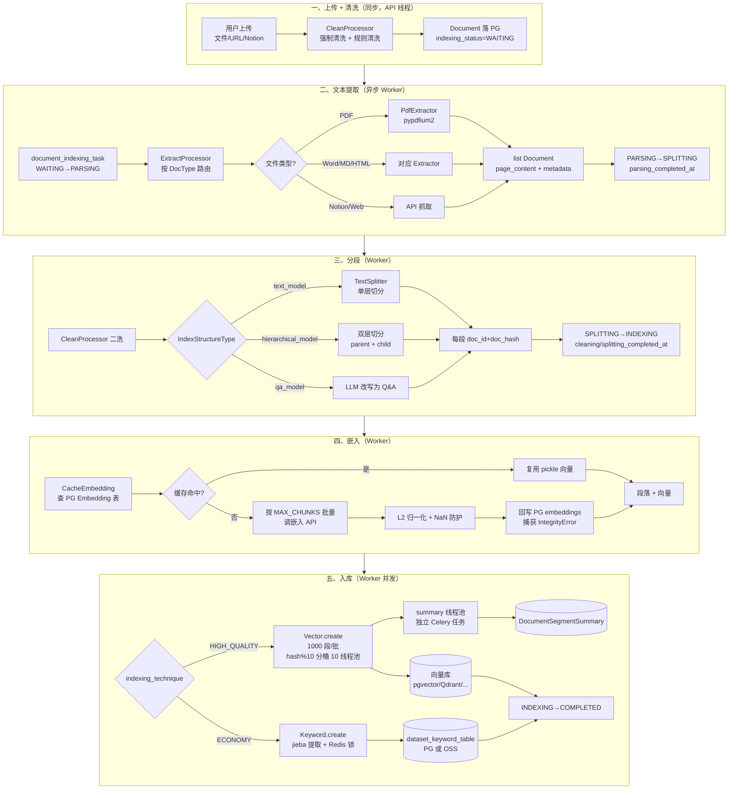
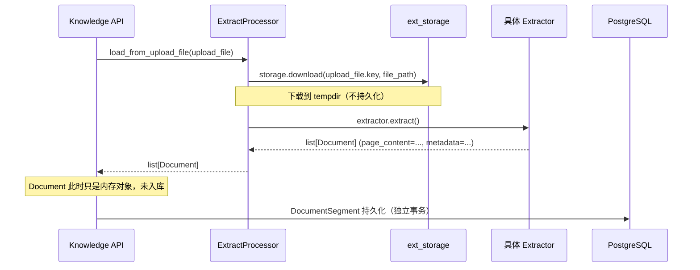
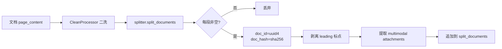
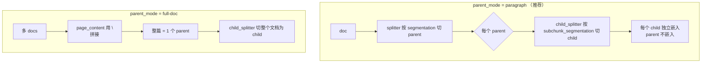
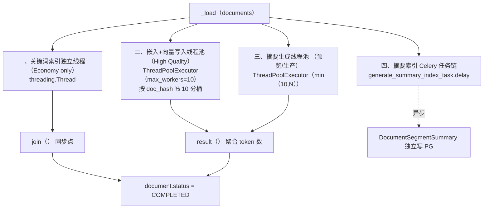
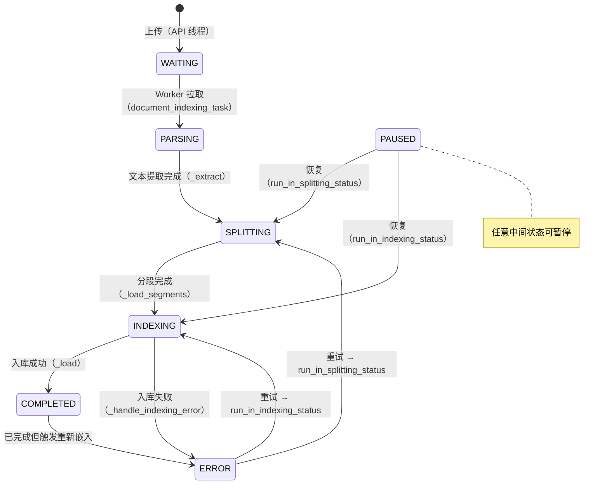

# RAG 索引管线

> **相关文档**：本篇聚焦索引（数据准备）侧；检索/生成/引用等运行时内容见 [10-rag-retrieval.md](./dify-10-rag-retrieval.md)。

> **学习目标**：理解 Dify 知识库从「用户上传文档」到「向量写入 VDB / 关键词落库」的完整索引管线，掌握文档抽取/清洗/分段/嵌入/入库的实现细节、8 状态生命周期管理、`doc_hash` 幂等的增量一致性机制，以及入库阶段 hash 分桶线程池等多层并发模型。
>
> **读完本章你应该能回答**：
> - Dify 的索引管线由哪 5 个核心阶段组成？每个阶段的输入/输出/责任是什么？
> - 索引配置有哪三条正交轴？它们如何自由组合？为什么 summary 不放进前面两条轴？
> - 三种 IndexStructureType（paragraph / parent_child / qa_model）各自的切分原理和适用场景是什么？
> - 嵌入阶段的 CacheEmbedding 三元组 key（model, hash, provider）为什么这样设计？L2 归一化和 NaN 防护在做什么？
> - 文档状态机有 8 个状态，它们之间的迁移条件和并发安全性如何？
> - 入库阶段有 4 层并发模型（关键词独立线程、嵌入向量线程池、摘要线程池、Celery 链），为什么需要这么多层？
> - `doc_hash` 如何实现幂等的增量一致性？重建文档时事务边界在哪里？
> - 30+ 向量库通过什么抽象层接入？`_LazyEmbeddings` 在双写一致性中扮演什么角色？
> - QA 索引的成本陷阱是什么？为什么 1000 段文档用 qa_model + summary 模式会触发 ~2000 次 LLM 调用？
> - 自定义分段策略时改哪些文件？"最少侵入面"是什么？

## 本章要解决的问题

Dify 的知识库要回答一个工程难题：**用户上传的 PDF / Word / URL / Notion 页面，都是非结构化的"原始字节"，如何变成可被向量检索和关键词检索的"结构化数据"？** 没有这一层，知识库就是一堆原始文件，[10-rag-retrieval.md](./dify-10-rag-retrieval.md) 描述的检索管线无从施展——没有向量可搜，没有关键词可匹配，LLM 拿不到任何上下文。

这件事单独做不难，难在五个互相拉扯的约束同时成立：

1. **不能阻塞 HTTP**——100 页 PDF 解析要几分钟，嵌入 API 要几十秒，但前端上传必须立即返回。
2. **跨系统最终一致**——PG（段元数据）、向量库（向量）、关键词表（倒排索引）、Embedding 缓存表是四个独立系统，没有分布式事务，却必须保持一致。
3. **可增量、可重试、可中断**——用户编辑一个段、重试一个失败文档、暂停大文件索引，都不能全量重来。
4. **嵌入 API 成本可控**——同一段文本被多个知识库引用，不应重复调用嵌入 API。
5. **30+ 向量库统一接入**——pgvector / Qdrant / Milvus / Weaviate / Elasticsearch …，切换向量库不能改业务代码。

Dify 的解法是**"5 阶段异步管线 + doc_hash 幂等 + 状态机读时过滤"**：HTTP 请求只做同步清洗并落 PG（状态 WAITING），后续四阶段在 Celery Worker 异步执行；每段文本用 `sha256(text+"None")` 生成 `doc_hash` 作为跨系统去重锚点；PG 与向量库之间不做 2PC，靠 `DocumentSegment.status` 在检索时过滤"幽灵段"。这套解法的核心载体就是 RAG 索引管线——本章拆解的组件。它坏了，知识库就退化成"一堆原始文件"，检索无从谈起。

## 宏观架构：一篇文档的索引生命周期

下图是一篇文档从上传到向量落库的完整生命周期，也是全文的叙事主线——后续每一节对应生命周期的一个阶段。



理解这张图的关键：**每个阶段的资源模型、错误模型、并发模型都不一样**——① 是同步（前端等，但只到 PG 落库），② 是 IO 密集（拉文件），③ 是 CPU + 可能的 LLM 调用，④ 受嵌入 API rate limit 约束，⑤ 是真正的并发热区。把它们拆成独立阶段，让每阶段独立失败、独立重试、独立扩展。如果合在一起，HTTP 请求会卡后端索引几小时。

贯穿全程的还有两条横切机制：**8 状态状态机**（每阶段切换 `indexing_status`，让前端可见进度、让恢复可续跑）和 **doc_hash 幂等**（同一段文本无论被索引多少次，hash 一致，跨系统去重）。它们不是独立阶段，而是所有阶段的"基础设施"——见 ⑥ 和 ⑦。

下面按这五个阶段 + 两条横切机制逐层展开。

## 一、上传与清洗

**这一节为什么存在**：用户上传文档后，HTTP 请求不能直接跑完整个索引（会超时），但必须先把"原始文件"变成"PG 里的 Document 记录 + 清洗后的文本"，并立即返回给前端。这是同步与异步的分界点。

清洗在 `CleanProcessor.clean()`（clean_processor.py:7）中实现，分两步：

```python
# api/core/rag/cleaner/clean_processor.py:7
@classmethod
def clean(cls, text: str, process_rule: dict[str, Any] | None) -> str:
    # 1. 强制清洗（无条件执行）
    text = re.sub(r"<\|", "<", text)
    text = re.sub(r"\|>", ">", text)
    text = re.sub(r"[\x00-\x08\x0B\x0C\x0E-\x1F\x7F\xEF\xBF\xBE]", "", text)
    text = re.sub("￾", "", text)
    # 2. 规则清洗（按 process_rule.rules.pre_processing_rules 启用）
    rules = process_rule["rules"] if process_rule else {}
    if "pre_processing_rules" in rules:
        for pre_processing_rule in rules["pre_processing_rules"]:
            if pre_processing_rule["id"] == "remove_extra_spaces" and ...:
                # \n{3,} → \n\n；连续空白符（含制表符、不间断空格、零宽空格等）→ 单空格
            elif pre_processing_rule["id"] == "remove_urls_emails" and ...:
                # 邮箱删除 + URL 删除，但用占位符保护 Markdown 链接/图片
    return text
```

**为什么要先做"强制清洗"再做"规则清洗"**：

1. **强制清洗是安全层**——很多 PDF 提取工具会输出含控制字符的"伪文本"，这些字符如果传给 LLM 可能干扰推理，甚至触发 prompt injection（攻击者可以放 `<|im_start|>system\n...` 等 token）。剥离 `<|`、`|>`、控制字符（`\x00-\x08\x0B\x0C\x0E-\x1F\x7F\xEF\xBF\xBE`）、U+FFFE 把这种攻击面消除掉。
2. **规则清洗是风格层**——用户的可配置选项（`remove_extra_spaces` / `remove_urls_emails`），不应该影响安全。先做安全后做风格，万一某条规则被禁用也不会影响安全底线。

`remove_urls_emails` 的一个细节值得注意：它**保护 Markdown 链接 / 图片**——用占位符机制（`__MARKDOWN_PLACEHOLDER_<n>__`）先把 `[text](url)` 整段替换为占位符，删完裸 URL 后再还原（clean_processor.py:34-68）。这样 `[Dify 官网](https://dify.ai)` 不会被误删成 `[Dify 官网]()`。

清洗完成后，Document 实体落 PG，`indexing_status = WAITING`（dataset.py:551），HTTP 请求立即返回。后续阶段全部在 Celery Worker 异步执行。

## 二、文本提取

**这一节为什么存在**：不同来源（PDF / Word / URL / Notion）的原始内容形态完全不同，但下游的分段、嵌入、入库链路只认一个统一数据格式——`list[Document(page_content=..., metadata=...)]`。这一阶段把"异构原始内容"统一成"Document 列表"。

### 2.1 入口与状态切换

Celery 任务 `document_indexing_task`（已废弃，实际入口是 `normal_document_indexing_task` / `priority_document_indexing_task`，document_indexing_task.py:236）拉起 `IndexingRunner.run()`（indexing_runner.py:68）。Worker 第一步把状态从 `WAITING` 切到 `PARSING`（document_indexing_task.py:104），然后进入 `IndexingRunner._extract()`（indexing_runner.py:389）。

`_extract()` 按 `data_source_type` 路由（indexing_runner.py:394-454）：

| data_source_type | ExtractSetting | 走向 |
|------------------|----------------|------|
| `upload_file` | `DatasourceType.FILE` | `ExtractProcessor.load_from_upload_file` |
| `notion_import` | `DatasourceType.NOTION` | `NotionExtractor` |
| `website_crawl` | `DatasourceType.WEBSITE` | firecrawl / watercrawl / jinareader |

提取完成后，状态切到 `SPLITTING` 并记 `parsing_completed_at`（indexing_runner.py:456-462）。

### 2.2 ExtractProcessor：路由分发器

`ExtractProcessor`（extract_processor.py:42）是 Loader 体系的"路由器"，按 `DatasourceType` 分发到具体 extractor。它的核心抽象是 `BaseExtractor`（extractor_base.py）——所有 extractor 实现 `extract() -> list[Document]`。

文件格式路由由 `ETL_TYPE` 配置决定（extract_processor.py:111-181）：

| 文件格式 | `ETL_TYPE != "Unstructured"` | `ETL_TYPE == "Unstructured"` |
|---------|------------------------------|------------------------------|
| `.xlsx` `.xls` | `ExcelExtractor` | `ExcelExtractor`（一致） |
| `.pdf` | `PdfExtractor`（pypdfium2） | `PdfExtractor`（一致） |
| `.md` `.markdown` `.mdx` | `MarkdownExtractor` | `UnstructuredMarkdownExtractor`（仅 `is_automatic`） |
| `.htm` `.html` | `HtmlExtractor` | `HtmlExtractor`（一致） |
| `.docx` | `WordExtractor` | `WordExtractor`（一致） |
| `.doc` | **不支持**（fallback TextExtractor） | `UnstructuredWordExtractor` |
| `.csv` | `CSVExtractor` | `CSVExtractor`（一致） |
| `.msg` `.eml` `.ppt` `.pptx` `.xml` | **不支持** | 对应 Unstructured extractor |
| `.epub` | `UnstructuredEpubExtractor` | `UnstructuredEpubExtractor`（一致） |
| 未知 | `TextExtractor` | `TextExtractor` |

**关键事实**：`PdfExtractor` 用 `pypdfium2` 读取 PDF **内嵌文本流**，**对扫描件（图像型 PDF）返回空 `page_content`**——**没有 OCR**。扫描件必须切到 `ETL_TYPE=Unstructured`。`PdfExtractor._extract_images()` 把 PDF 内嵌图片存到 Storage + 创建 UploadFile 记录，返回 Markdown 图片链接附加到 `page_content`，但**图片本身不嵌入向量**，只作为多模态附件。

### 2.3 Extractor 的事务边界



**Extractor 只产出 `list[Document]`，不直接入库**——Extractor 是无状态的，所有持久化由调用方负责。文件下载到 `tempfile.TemporaryDirectory`，提取完成后自动清理。这种"Extractor 无状态 + 临时文件"的模式让 Extractor 容易测试和复用（同一逻辑可用于"实时预览"和"生产索引"）。

## 三、分段

**这一节为什么存在**：分段（segmentation）是索引管线中**决定检索质量**的关键步骤——切得太粗召回含噪声，切得太细语义断裂。这一阶段把"一整篇 Document"切成"N 个可独立嵌入和检索的小段"，并给每段盖上 `doc_id` 和 `doc_hash`——后续增量、去重、双写一致性的锚点。

### 3.1 索引配置的三条正交轴

在讲"怎么分段"之前，先理解 Dify 索引配置的**三条正交轴**。它们之间互不依赖、互不冲突，可以自由组合。

| 轴 | 字段 | 取值 | 决定的维度 |
|----|------|------|-----------|
| **① IndexingTechnique** | `dataset.indexing_technique` | `high_quality` / `economy` | **怎么索引**（用向量 vs 用 jieba） |
| **② IndexStructureType** | `document.doc_form` | `text_model` / `hierarchical_model` / `qa_model` | **怎么切分**（单层 vs 双层 vs Q&A 改写） |
| **③ SummaryIndexSetting** | `dataset.summary_index_setting.enable` | `True` / `False` | **要不要再叠一层摘要**（可叠加） |

```python
# api/core/rag/index_processor/constant/index_type.py:4
class IndexStructureType(StrEnum):
    PARAGRAPH_INDEX = "text_model"            # 默认：每段独立成索引
    QA_INDEX = "qa_model"                     # LLM 把段落改写成 Q&A 对
    PARENT_CHILD_INDEX = "hierarchical_model" # 双层：parent 上下文 + child 检索

class IndexTechniqueType(StrEnum):
    ECONOMY = "economy"            # 用 jieba 分词 + 走关键词库（省嵌入 API 费用）
    HIGH_QUALITY = "high_quality"  # 用嵌入模型 + 走向量库
```

> **注意**：枚举**名**是 `PARAGRAPH_INDEX` / `PARENT_CHILD_INDEX` / `QA_INDEX`，但**值**是 `text_model` / `hierarchical_model` / `qa_model`。下文为可读性用 `paragraph` / `parent_child` / `qa_model` 指代三种模式，实际 `doc_form` 字段存的是枚举值。

**为什么"摘要"放在 ③ 而不是塞进 ① 或 ②**：摘要本质是个**辅助层**，可以叠在任何结构之上。如果放进 ①（IndexingTechnique）就破坏了"是否走向量"的语义；如果放进 ②（IndexStructureType）则与"切分结构"语义冲突。保留正交性让 12 种组合（2×3×是否叠摘要）自由搭配。

### 3.2 分段配置与 Splitter 选型

分段的所有配置存在 `DatasetProcessRule.rules`（JSON 字段），由 Pydantic `Rule` 模型解析（processing_entities.py）：

```python
class Segmentation(BaseModel):
    separator: str = "\n"        # 默认按换行切
    max_tokens: int             # 段最大 token 数（关键参数）
    chunk_overlap: int = 0      # 段间重叠 token 数

class Rule(BaseModel):
    pre_processing_rules: list[PreProcessingRule] | None
    segmentation: Segmentation | None           # 段落/parent 段的切分
    parent_mode: Literal["full-doc", "paragraph"] | None   # 仅 parent_child 模式
    subchunk_segmentation: Segmentation | None  # 仅 parent_child 模式（child 段的切分）
```

`BaseIndexProcessor._get_splitter()`（index_processor_base.py:100）根据 `processing_rule_mode` 选 splitter：

```python
# api/core/rag/index_processor/index_processor_base.py:112
if processing_rule_mode in ["custom", "hierarchical"]:
    # 用户自定义分段：用 FixedRecursiveCharacterTextSplitter（支持固定分隔符）
    character_splitter = FixedRecursiveCharacterTextSplitter.from_encoder(
        chunk_size=max_tokens, chunk_overlap=chunk_overlap,
        fixed_separator=separator,
        separators=["\n\n", "。", ". ", " ", ""],
        embedding_model_instance=embedding_model_instance,
    )
else:
    # 自动模式：用 EnhanceRecursiveCharacterTextSplitter
    character_splitter = EnhanceRecursiveCharacterTextSplitter.from_encoder(
        chunk_size=DatasetProcessRule.AUTOMATIC_RULES["segmentation"]["max_tokens"],
        chunk_overlap=DatasetProcessRule.AUTOMATIC_RULES["segmentation"]["chunk_overlap"],
        separators=["\n\n", "。", ". ", " ", ""],
        embedding_model_instance=embedding_model_instance,
    )
```

两种 splitter 的差异：`FixedRecursiveCharacterTextSplitter` 优先按用户指定的 `separator` 切，再用递归分隔符兜底；`EnhanceRecursiveCharacterTextSplitter` 直接用递归分隔符列表 `["\n\n", "。", ". ", " ", ""]` 从粗到细切。两者都用嵌入模型的真实 tokenizer 计数（而非字符数），防止"中文 1 字 ≠ 1 token"导致的段溢出。自定义模式校验 `50 <= max_tokens <= INDEXING_MAX_SEGMENTATION_TOKENS_LENGTH`。

### 3.3 三种 IndexProcessor 的 transform 流程

`IndexProcessorFactory`（index_processor_factory.py:10）按 `doc_form` 分发到三个 processor。三者共享 `extract()`（都调 `ExtractProcessor.extract`），差异在 `transform()` 和 `load()`。

#### 段落索引（paragraph / text_model）

`ParagraphIndexProcessor.transform()`（paragraph_index_processor.py:75）：



每个 segment 被赋予两个关键 metadata：
- **`doc_id`**：`str(uuid.uuid4())`——向量库和关键词索引的唯一主键
- **`doc_hash`**：`helper.generate_text_hash(content)` = `sha256(text + "None").hexdigest()`（helper.py:396）——用于幂等去重

#### 父子索引（parent_child / hierarchical_model）

`ParentChildIndexProcessor.transform()`（parent_child_index_processor.py:56）按 `parent_mode` 走两条路径：



**核心思想**：检索要"准"（小段 child 提供精准匹配）→ 生成要"全"（大段 parent 提供完整上下文）→ 两个看似矛盾的需求通过双层结构同时满足。child 嵌入向量但通过 `ChildChunk` 表（dataset.py:1057）存元信息，parent 不嵌入向量但存全文。检索时先查 child → 按 `segment_id` 聚合 → 反查 parent → 返回 parent.content（详见 [10-rag-retrieval.md](./dify-10-rag-retrieval.md)）。

#### QA 索引（qa_model）

`QAIndexProcessor.transform()`（qa_index_processor.py:54）：

```python
# 1. 先用 splitter 切段（同 paragraph 模式）
document_nodes = splitter.split_documents([document])
# 2. 对每段调用 LLM 生成 Q&A 配对（用线程，每批 10 个）
for i in range(0, len(all_documents), 10):
    threads = []
    for doc in sub_documents:
        document_format_thread = threading.Thread(
            target=self._format_qa_document, ...)
        threads.append(document_format_thread)
        document_format_thread.start()
    for thread in threads:
        thread.join()
# 3. _format_qa_document 内调 LLMGenerator.generate_qa_document
#    把 LLM 返回的 Q1:...A1:... 用正则切成 [{question, answer}, ...]
#    每个 Q&A 拼成 Document(page_content=question, metadata={answer: ...})
```

**性能陷阱**：1000 段 × LLM 调用 ≈ 几分钟到几十分钟。QA 模式用线程（每批 10 个并发），但受 LLM rate limit 约束，实际并发收益有限。大规模 QA 索引会显著拖慢流程。`load()` 只支持 `HIGH_QUALITY`，ECONOMY 模式直接 `raise ValueError`（qa_index_processor.py:208）。

### 3.4 分段结果持久化

分段完成后，`IndexingRunner._load_segments()`（indexing_runner.py:816）调 `DatasetDocumentStore.add_documents()` 把段写入 PG 的 `DocumentSegment` 表，状态切到 `INDEXING`（同时记 `cleaning_completed_at` 和 `splitting_completed_at`）：

```python
# api/core/indexing_runner.py:816
def _load_segments(self, dataset, dataset_document, documents):
    doc_store = DatasetDocumentStore(dataset=dataset, user_id=..., document_id=...)
    doc_store.add_documents(
        docs=documents,
        save_child=dataset_document.doc_form == IndexStructureType.PARENT_CHILD_INDEX
    )
    # update document status to indexing
    cur_time = naive_utc_now()
    self._update_document_index_status(
        document_id=dataset_document.id,
        after_indexing_status=IndexingStatus.INDEXING,
        extra_update_params={
            DatasetDocument.cleaning_completed_at: cur_time,
            DatasetDocument.splitting_completed_at: cur_time,
            DatasetDocument.word_count: sum(len(doc.page_content) for doc in documents),
        },
    )
```

`DocumentSegment` 表关键字段（dataset.py:843）：`index_node_id`（= doc_id，向量库主键）、`index_node_hash`（= doc_hash，去重锚点）、`status`（`SegmentStatus`，初始 `WAITING`）、`enabled`（默认 True，检索过滤用）、`answer`（QA 模式 LLM 生成）、`keywords`（economy 模式 jieba 填入）。父子模式还会创建 `ChildChunk` 行（`segment_id` 外键关联 parent）。

## 四、嵌入

**这一节为什么存在**：嵌入是索引管线中最贵的一步（嵌入 API 按量计费），也是最容易被重复调用浪费的一步。这一阶段用 `CacheEmbedding` 在调嵌入 API 之前查 PG 缓存，让"同一段文本无论被索引多少次，只调一次嵌入 API"。

### 4.1 CacheEmbedding 的三层查找

`CacheEmbedding`（cached_embedding.py:24）包装真实的嵌入模型，在调用昂贵的嵌入 API **之前**依次查缓存：

```python
# api/core/rag/embedding/cached_embedding.py:29
def embed_documents(self, texts: list[str]) -> list[list[float]]:
    text_embeddings: list[Any] = [None for _ in range(len(texts))]
    embedding_queue_indices = []
    for i, text in enumerate(texts):
        hash = helper.generate_text_hash(text)  # sha256(text + "None")
        embedding = db.session.scalar(
            select(Embedding).where(
                Embedding.model_name   == self._model_instance.model_name,
                Embedding.hash          == hash,
                Embedding.provider_name == self._model_instance.provider,
            ).limit(1)
        )
        if embedding:
            text_embeddings[i] = embedding.get_embedding()   # 命中 PG 缓存
        else:
            embedding_queue_indices.append(i)                 # 未命中，排队
```

关键设计点：

1. **三元组唯一键**：`(model_name, hash, provider_name)` 是 PG `embeddings` 表的 `UniqueConstraint`（dataset.py:1261）。换模型（如 ada-002 → text-embedding-3-small）必须重新嵌入——`model_name` 是键的一部分，旧 key 永远不命中。
2. **pickle 存储**：`embedding` 字段是 `BinaryData`，`pickle.dumps(vector, protocol=HIGHEST_PROTOCOL)` 写入，`pickle.loads()` 读取，无格式转换开销。
3. **embed_query 走 Redis**：查询时先查 Redis（key `{provider}_{model_name}_{hash}`，TTL 600s），命中后 base64 解码 → numpy float32 → 列表返回（cached_embedding.py:199-204）。

> Redis 仅缓存 query embedding（短生命周期），不缓存文档 embedding（需要持久化到 PG）。这避免了 Redis 大 Key 问题。PG 缓存是"成本避雷针"——同一段文本被多个 dataset 引用，hash 一致，只需嵌入一次；Redis 缓存是"延迟优化"——同一用户 10 分钟内重复查询同一 query。

### 4.2 批量调用嵌入 API

对未命中的 `embedding_queue_indices`，按模型声明的 `MAX_CHUNKS` 批量调用（cached_embedding.py:60-81）：

```python
max_chunks = (model_schema.model_properties[ModelPropertyKey.MAX_CHUNKS]
              if model_schema and ModelPropertyKey.MAX_CHUNKS in model_schema.model_properties
              else 1)
for i in range(0, len(embedding_queue_texts), max_chunks):
    batch_texts = embedding_queue_texts[i : i + max_chunks]
    embedding_result = self._model_instance.invoke_text_embedding(
        texts=batch_texts, input_type=EmbeddingInputType.DOCUMENT
    )
    for vector in embedding_result.embeddings:
        normalized_embedding = (vector / np.linalg.norm(vector)).tolist()  # L2 归一化
        if np.isnan(normalized_embedding).any():
            logger.warning("Normalized embedding is nan: %s", normalized_embedding)
            continue                                    # 跳过 NaN（issue #11827）
        embedding_queue_embeddings.append(normalized_embedding)
```

- **L2 归一化**：使所有向量长度为 1，后续余弦相似度等价于内积，大幅加速向量检索。
- **NaN 防护**：某些 provider 返回的向量在归一化后可能产生 NaN（典型场景：零向量），需跳过，否则会污染整个向量空间。
- **`max_chunks` 不写死**：不同模型（OpenAI text-embedding-3 / BGE / m3e）的批上限差异巨大（1 ~ 2048），从模型 schema 读取。

### 4.3 写入 PG：捕获并发冲突

嵌入 API 返回后，回写 PG 的 `embeddings` 表。**关键的并发安全设计**（cached_embedding.py:87-102）：

```python
try:
    for i, n_embedding in zip(embedding_queue_indices, embedding_queue_embeddings):
        text_embeddings[i] = n_embedding
        hash = helper.generate_text_hash(texts[i])
        if hash not in cache_embeddings:                 # 进程内去重
            embedding_cache = Embedding(
                model_name=self._model_instance.model_name,
                hash=hash,
                provider_name=self._model_instance.provider,
                embedding=pickle.dumps(n_embedding, protocol=pickle.HIGHEST_PROTOCOL),
            )
            db.session.add(embedding_cache)
            cache_embeddings.append(hash)
    db.session.commit()
except IntegrityError:                                   # 并发冲突：另一个 worker 已写入相同 hash
    db.session.rollback()                                # 回滚事务，放弃本次 INSERT
```

**为什么需要 `except IntegrityError`**：多个 Worker 进程同时处理同一段文本时（如知识库被多处触发重索引），会出现两个进程同时尝试 INSERT 同一 `(model_name, hash, provider_name)` 的情况。PG 的唯一约束保证只有一个成功，另一个被中止——Dify 捕获 `IntegrityError` 让失败方放弃写入，但 **embedding 仍会被使用**（它已经在内存里），不影响本次索引。

### 4.4 嵌入层的故障语义

```python
try:
    # ... 嵌入 API 调用 + 批处理
except IntegrityError:
    db.session.rollback()            # 缓存表冲突：放弃 INSERT，复用内存里的向量
except Exception as ex:
    db.session.rollback()
    logger.exception("Failed to embed documents")
    raise ex                        # 真正的失败向上传播（导致整批失败）
```

- **`IntegrityError` 是预期的**：并发冲突不算失败，rollback 清掉事务但不抛异常。
- **NaN 也算预期的**：日志 warning 后 continue，不污染整批。
- **其他异常是真正的失败**：rollback + 抛异常 → 上层 `IndexingRunner` 捕获并把文档状态置为 `ERROR`。

## 五、入库

**这一节为什么存在**：这是索引管线的终点——把"段落 + 向量"或"段落 + 关键词"真正写入向量库或关键词表。这一阶段是真正的并发热区，用 hash 分桶线程池避免 PG 死锁，用 `_LazyEmbeddings` 保护清理路径，用独立线程处理关键词索引。

### 5.1 双分支：HIGH_QUALITY vs ECONOMY

`IndexProcessor.load()` 按 `indexing_technique` 走两条互斥分支。以 `ParagraphIndexProcessor.load()` 为例（paragraph_index_processor.py:125）：

```python
def load(self, dataset, documents, multimodal_documents=None, with_keywords=True, **kwargs):
    if dataset.indexing_technique == IndexTechniqueType.HIGH_QUALITY:
        vector = Vector(dataset)
        vector.create(documents)
        if multimodal_documents and dataset.is_multimodal:
            vector.create_multimodal(multimodal_documents)
        with_keywords = False                            # 高质量模式不写关键词
    if with_keywords:
        keyword = Keyword(dataset)
        if kwargs.get("keywords_list"):
            keyword.add_texts(documents, keywords_list=kwargs["keywords_list"])
        else:
            keyword.add_texts(documents)
```

**关键设计**：`HIGH_QUALITY` 时**只写向量不写关键词**；`ECONOMY` 时**只写关键词不写向量**。两条分支独立、互不污染。换模式后需要主动重索引才能切换。

### 5.2 向量写入：1000 条一批 + _LazyEmbeddings

`Vector.create()`（vector_factory.py:162）分批调用：

```python
# api/core/rag/datasource/vdb/vector_factory.py:162
def create(self, texts: list | None = None, **kwargs):
    if texts:
        texts = self._filter_empty_text_documents(texts)        # 过滤空白段
        if not texts:
            return
        batch_size = 1000
        for i in range(0, len(texts), batch_size):              # 1000 条/批
            batch = texts[i : i + batch_size]
            batch_embeddings = self._embeddings.embed_documents(
                [document.page_content for document in batch]
            )
            self._vector_processor.create(texts=batch, embeddings=batch_embeddings, **kwargs)
```

`Vector.__init__` 中嵌入模型用的是 `_LazyEmbeddings` 代理（vector_factory.py:43-98），**而不是立即构造 `CacheEmbedding`**：

```python
class _LazyEmbeddings(Embeddings):
    """Lazy proxy that defers materializing the real embedding model.

    Constructing the real embeddings (via ModelManager.get_model_instance)
    transitively calls FeatureService.get_features → BillingService
    HTTP GETs. Cleanup paths (delete_by_ids / delete / text_exists) do not
    need embeddings at all, so deferring this until an embed_* method is
    actually invoked keeps cleanup tasks resilient to transient billing-API
    failures and avoids leaving stranded document_segments / child_chunks
    whenever billing hiccups.
    """
    def _ensure(self) -> Embeddings:
        if self._real is None:
            model_manager = ModelManager.for_tenant(tenant_id=self._dataset.tenant_id)
            embedding_model = model_manager.get_model_instance(...)
            self._real = CacheEmbedding(embedding_model)        # 延迟到首次 embed_* 才构造
        return self._real
```

**这是工程上极重要的鲁棒性设计**：

- **删除路径**（`Vector.delete_by_ids()` / `Vector.delete()`）不需要嵌入模型，但 `Vector.__init__` 会去构造嵌入模型，进而调用 `BillingService`（HTTP 请求）。一旦 billing 服务抖动，所有"清理孤儿向量"的任务都会失败，留下悬挂的 `document_segments` 行。
- **懒加载**让构造 `Vector(dataset)` 这个动作变得廉价——只有真的需要嵌入时（`embed_documents` / `embed_query`）才付"调用 billing 服务"的代价。
- **首次调用后，行为完全等价**于直接构造 `CacheEmbedding`。

### 5.3 30+ 向量库的统一接入

向量库后端通过 **plugin entry points** 接入（vector_backend_registry.py:75）：

```python
def get_vector_factory_class(vector_type: str) -> type[AbstractVectorFactory]:
    if vector_type in _VECTOR_FACTORY_CACHE:
        return _VECTOR_FACTORY_CACHE[vector_type]
    plugin_cls = _load_plugin_factory(vector_type)  # 查 dify.vector_backends entry points
    ...
```

每个向量库是一个独立 workspace 包，位于 `api/providers/vdb/vdb-*/src/dify_vdb_*/`（如 `vdb-pgvector`、`vdb-qdrant`、`vdb-milvus`、`vdb-elasticsearch` 等 30+ 个），在 `pyproject.toml` 中声明 `dify.vector_backends` entry point。`Vector._init_vector()`（vector_factory.py:130）按 `dify_config.VECTOR_STORE` 或 `dataset.index_struct_dict["type"]` 解析到具体 factory 类。

每个 `Dataset` 对应向量库中一个 collection，命名由 `Dataset.gen_collection_name_by_id()` 生成（dataset.py:448）：

```python
@staticmethod
def gen_collection_name_by_id(dataset_id: str) -> str:
    normalized_dataset_id = dataset_id.replace("-", "_")
    return f"{dify_config.VECTOR_INDEX_NAME_PREFIX}_{normalized_dataset_id}_Node"
```

删除知识库时通过 collection 名整体删除。

### 5.4 关键词索引：Jieba

Economy 模式（`economy`）下不走嵌入，改走关键词索引。`Keyword` 是工厂类（keyword_factory.py:10），根据 `dify_config.KEYWORD_STORE` 选择实现（目前只支持 `Jieba`）：

```python
# api/core/rag/datasource/keyword/jieba/jieba.py:33
class Jieba(BaseKeyword):
    def create(self, texts: list[Document], **kwargs) -> BaseKeyword:
        lock_name = f"keyword_indexing_lock_{self.dataset.id}"
        with redis_client.lock(lock_name, timeout=600):        # Redis 分布式锁
            keyword_table_handler = JiebaKeywordTableHandler()
            keyword_table = self._get_dataset_keyword_table()
            keyword_number = self.dataset.keyword_number or 10  # 默认 10 个/段
            for text in texts:
                keywords = keyword_table_handler.extract_keywords(text.page_content, keyword_number)
                self._update_segment_keywords(self.dataset.id, text.metadata["doc_id"], list(keywords))
                keyword_table = self._add_text_to_keyword_table(
                    keyword_table or {}, text.metadata["doc_id"], list(keywords)
                )
            self._save_dataset_keyword_table(keyword_table)
```

关键设计：

1. **Redis 分布式锁** `keyword_indexing_lock_{dataset_id}`（timeout 600s）：保证同一 dataset 的关键词索引串行执行（关键词表是单文件/单行 JSON，整读整写）。
2. **双写**：`dataset_keyword_table`（倒排索引，`keyword → {segment_ids}`）+ `document_segments.keywords`（PG JSONB 列，每段自己的关键词数组）。
3. **存储后端可选**：`KEYWORD_DATA_SOURCE_TYPE` 可选 `database`（PG `DatasetKeywordTable` 表）或 `file`（OSS `keyword_files/{tenant_id}/{dataset_id}.txt`）。
4. **Parent-Child 模式不写关键词索引**（`IndexingRunner._load` 中 `doc_form == PARENT_CHILD_INDEX` 时跳过整个 keyword 分支，indexing_runner.py:598）。

### 5.5 入库的 4 层并发模型

`IndexingRunner._load()`（indexing_runner.py:573）是入库并发核心，用 **4 层并发**：



#### 第 ② 层：hash 分桶避免死锁

这是设计最精妙的部分（indexing_runner.py:608-637）：

```python
# api/core/indexing_runner.py:608
max_workers = 10
if dataset.indexing_technique == IndexTechniqueType.HIGH_QUALITY:
    with concurrent.futures.ThreadPoolExecutor(max_workers=max_workers) as executor:
        futures = []
        # Distribute documents into multiple groups based on the hash values of page_content
        # This is done to prevent multiple threads from processing the same document,
        # Thereby avoiding potential database insertion deadlocks
        document_groups: list[list[Document]] = [[] for _ in range(max_workers)]
        for document in documents:
            hash = helper.generate_text_hash(document.page_content)
            group_index = int(hash, 16) % max_workers   # hash mod 10
            document_groups[group_index].append(document)
        for chunk_documents in document_groups:
            if len(chunk_documents) == 0:
                continue
            futures.append(
                executor.submit(self._process_chunk, chunk_documents, ...)
            )
        for future in futures:
            tokens += future.result()
```

**为什么这能避免死锁**：同一篇文档的段由 `helper.generate_text_hash` 派生 hash，**确定性映射到唯一一个桶**（`int(hash, 16) % 10`）。10 个 worker 各自只处理自己桶内的段，**绝不重叠**。不同桶之间并发执行，同一桶内顺序执行 → 无死锁。`_process_chunk` 内每组独立 commit，commit 失败不影响其他桶。

#### 第 ① 层：关键词独立线程

Economy 模式的关键词索引用独立线程（indexing_runner.py:602-606），末尾 `join()` 保证 Celery 任务报告 COMPLETED 前关键词已持久化。用独立线程而非线程池的原因：关键词索引是单库 jieba 表，只能串行写（Redis 锁已保证），但它不依赖嵌入结果，可与向量写入并行。

#### 第 ③/④ 层：摘要索引

摘要索引是**第三条独立索引**，不与向量/关键词强同步。主索引完成后，`document_indexing_task` 检查 `dataset.summary_index_setting.enable`，若开启则 `generate_summary_index_task.delay()`（document_indexing_task.py:161）。摘要生成在 `SummaryIndex.generate_and_vectorize_summary` 中用 `ThreadPoolExecutor(min(10, N))`，每个段独立线程 + 独立 DB session（summary_index.py:72-90）。失败不影响主索引，只在 `DocumentSegmentSummary.status = 'failed'` 中可查。

> **QA 索引的成本陷阱**：`qa_model` 模式会在 `transform()` 阶段对**每一段**调用一次 LLM（生成 Q&A 改写对，线程批 10），若再叠摘要（③），每个段额外调用一次 LLM 生成 summary。**1000 段文档的 QA 索引 + 摘要 ≈ 2000 次 LLM 调用**——比 paragraph 模式贵几十倍。注意 `document_indexing_task` 对 `doc_form == QA_INDEX` 跳过摘要生成（document_indexing_task.py:157），所以实际 QA + 摘要不会同时触发，但 QA 本身的 LLM 成本已经很高。

入库完成后，`_load()` 把 `indexing_status` 切到 `COMPLETED`（indexing_runner.py:647），记 `completed_at` 和 `indexing_latency`。

## 六、状态机与恢复

**这一节为什么存在**：索引管线跨多个阶段、多个系统，任何一步都可能失败或被用户暂停。状态机让"当前在哪一步"对前端可见、让"失败后从哪续跑"有据可依。没有它，一次 Worker 崩溃就得全量重来。

### 6.1 文档 8 状态状态机

状态枚举定义在 `api/models/enums.py:129`，**8 个状态**：



> **注意**：`CLEANING` 状态在枚举中定义（`IndexingStatus.CLEANING`），且 `pause_document` 允许在 CLEANING 状态暂停（dataset_service.py:1987），但主索引流程 `IndexingRunner` 不经过 CLEANING 状态——`_load_segments` 切到 INDEXING 时同时记 `cleaning_completed_at` 和 `splitting_completed_at`。CLEANING 更多作为"允许暂停的中间态"和"恢复时与 waiting/parsing 同等对待"存在。

### 6.2 恢复策略

`recover_document_indexing_task`（recover_document_indexing_task.py:16）是 Dify 启动时的"清理工"——扫描所有 stuck 文档，根据当前 `indexing_status` 选续跑路径：

| 当前状态 | 续跑路径 | 跳过阶段 |
|---------|---------|---------|
| `WAITING` / `PARSING` / `CLEANING` | `IndexingRunner.run()`（全量） | 无 |
| `SPLITTING` | `run_in_splitting_status` | 跳过 PARSING（删旧段 → 重新 extract+transform+load） |
| `INDEXING` | `run_in_indexing_status` | 跳过 PARSING/SPLITTING（从现有段重建 → 仅 load） |
| `COMPLETED` | 不动 | — |
| `ERROR` | 不自动恢复，需用户手动 retry | — |
| `PAUSED` | 不动（由用户主动 resume） | — |

三种 `run*` 方法的差异（indexing_runner.py:68/128/199）：

- **`run()`**：完整 extract → transform → _load_segments → _load
- **`run_in_splitting_status()`**：先删旧 DocumentSegment（含 ChildChunk）→ 再走完整 extract → transform → _load_segments → _load
- **`run_in_indexing_status()`**：跳过 extract/transform，从现有 `DocumentSegment` 重建 `Document` 对象（只处理 `status != COMPLETED` 的段）→ 仅 _load

### 6.3 暂停机制：Redis 是热路径，PG 是持久源

暂停的真实实现值得细说，因为它常被误解。

`pause_document()`（dataset_service.py:1983）**同时写 PG 和 Redis**：

```python
def pause_document(document):
    ...
    document.is_paused = True
    document.paused_by = current_user.id
    document.paused_at = naive_utc_now()
    db.session.add(document)
    db.session.commit()                                # PG 持久化
    indexing_cache_key = f"document_{document.id}_is_paused"
    redis_client.setnx(indexing_cache_key, "True")    # Redis 热路径标志
```

Worker 的 `_check_document_paused_status()`（indexing_runner.py:734）**读 Redis**（不是 PG）：

```python
@staticmethod
def _check_document_paused_status(document_id: str):
    indexing_cache_key = f"document_{document_id}_is_paused"
    result = redis_client.get(indexing_cache_key)      # 读 Redis，O(1)
    if result:
        raise DocumentIsPausedError()
```

**为什么 Worker 读 Redis 而非 PG**：Worker 在每段处理完后检查暂停（`_process_chunk` 开头调 `_check_document_paused_status`），频率很高。Redis 读延迟 < 1ms，PG 走一次索引查询要几 ms。Redis 是"热路径"快速判断，PG 是"持久源"保证 Worker 崩溃重启后仍能恢复暂停状态（`recover_document_indexing_task` 不依赖 Redis 标志，直接看 `indexing_status` 和 `is_paused`）。

**不是实时抢占**——Worker 在每个段处理完后检查，最长延迟约等于"一段处理时间"（几秒到几十秒）。`recover_document()` 清除 Redis 标志并触发 `recover_document_indexing_task`。

### 6.4 错误处理：乐观并发 + 整篇重试

`_handle_indexing_error()`（indexing_runner.py:57）只标记状态，不回滚：

```python
def _handle_indexing_error(self, document_id: str, error: Exception) -> None:
    document = db.session.get(DatasetDocument, document_id)
    if document:
        document.indexing_status = IndexingStatus.ERROR
        document.error = str(getattr(error, "description", str(error)))
        document.stopped_at = naive_utc_now()
        db.session.commit()
    # 不做任何回滚！
```

**"乐观并发 + 整篇重试"** 原则：

- **不部分回滚**：某个 worker 线程失败，不回滚其他 worker 已写入的数据
- **整篇标记 ERROR**：整个 Document 状态置 ERROR
- **用户决定下一步**：retry 走 `run_in_splitting_status`（重做 transform + load）或 delete
- **不丢数据**：失败时已写入的部分（部分段在 VDB 中）保留，重试时先 `delete_by_document_id` 清空再重跑

这种"乐观并发"是双写一致性的"读时过滤"机制能够工作的关键前提（见 ⑦）：即使部分段已写入 VDB，PG 中 Document 是 ERROR 状态 → 检索时反查 status 直接丢弃 → 用户无感知。

## 七、增量一致性

**这一节为什么存在**：用户每次编辑 1 个分段、删除 1 篇文档、重试 1 个失败文档，系统必须保证 PG 业务表、向量库、关键词索引、Embedding 缓存表四者**最终一致**，且不能阻塞前端。Dify 不用 2PC（向量库多数不支持 XA，延迟太大），靠"幂等 + 异步 + 重试 + 状态机"四件套实现最终一致。

### 7.1 doc_hash：幂等的锚点

`doc_hash = helper.generate_text_hash(text) = sha256(text + "None").hexdigest()`（helper.py:396）——64 字符十六进制 sha256。它的作用贯穿全管线：

| 角色 | 用法 |
|------|------|
| 向量库主键去重 | `index_node_id = doc_id`（UUID），但 `index_node_hash = doc_hash` 用于检测重复段 |
| Embedding 缓存键 | `(model_name, doc_hash, provider_name)` 三元组，同一段文本只嵌入一次 |
| 增量更新锚点 | 重建文档时，相同 hash 的段可复用旧向量 |
| 入库分桶 | `int(doc_hash, 16) % 10` 把段确定性分到 10 个 worker 桶，避免死锁 |

**关键性质**：同一段文本无论被索引多少次、被哪个 dataset 引用，`doc_hash` 一致。这让"跨知识库复用向量"成为可能——PG `embeddings` 表是全局共享的，A 知识库嵌入过的段，B 知识库引用时直接命中缓存。

### 7.2 增量的三层粒度

Dify 的"增量"分三个粒度，触发路径完全不同：

| 粒度 | 触发场景 | 实现机制 |
|------|----------|----------|
| **单段增量** | 用户在 Web 端增/删/改/启停一个 `Segment` | Celery 任务 `add_segment_to_index_task` / `remove_segment_from_index_task` / `update_segment_index_task`，仅对该段重嵌入 + 重写向量/关键词 |
| **单文档增量** | 同一篇 Document 添加新文件 / 重新导入 | `document_indexing_task` 跑前先 `delete_by_document_id` 清空旧索引，再走全量流水线 |
| **批文档重建** | 更换嵌入模型、Knowledge Pipeline 节点变更 | `rebuild_document_index_task`，对数据集下每篇文档依次触发重建 |

### 7.3 双写一致性的四道防线

PG 和向量库是两个独立系统，没有分布式事务。Dify 用四道防线保证最终一致：

**第一道：Embedding 缓存（PG `embeddings` 表）**

相同 `(model_name, hash, provider_name)` 的段只调一次嵌入 API。即使向量库全丢（灾难），只要 PG 在就能重新向量化重建——embedding 是可重新派生的，向量库是"向量副本"，PG `embeddings` 表是"向量真源"。

**第二道：`_LazyEmbeddings` 保护清理路径**

删除文档时即使 Billing API 挂了，也能只删向量库完成清理，不会留下孤儿段（见 ⑤.2）。这是工程上极重要的一致性保证——清理路径不依赖嵌入模型构造。

**第三道：状态机读时过滤**

`DocumentSegment.status` 字段承担"读时一致性过滤"（检索时只查 `completed` 状态的段）：

```python
# 检索时只查 completed + enabled 的段
select(DocumentSegment).where(
    DocumentSegment.document_id == doc_id,
    DocumentSegment.status == SegmentStatus.COMPLETED,
    DocumentSegment.enabled == True,
)
```

即使向量库里有"幽灵段"（PG 已删但向量库未删），检索时通过 `document_id` 反查 PG 拿 status，`status != 'completed'` 直接丢弃。这是 Dify 实现"读时一致性"的核心 trick。

**第四道：主动清理 + 重建兜底**

| 场景 | 任务 | 实现 |
|------|------|------|
| 重建嵌入模型 | `rebuild_document_indexing_task` | 逐文档走完整 transform + load |
| 清理失败文档 | `batch_clean_document_task` | 按 batch_size 分事务删除 |
| 清理孤立段 | 自定义脚本 | `~Segment.document_id.in_(active_document_ids)` |
| 清理孤儿向量 | `vdb.delete_by_ids(orphan_ids)` | `vdb.list_all_ids() - db_ids` |

> **不要尝试"双写两阶段提交"**：Dify 从未尝试在 PG 和向量库之间用 2PC，因为向量库多数不支持 XA，延迟太大，实际场景中"最终一致 + 主动清理 + 读时过滤"已足够。

### 7.4 文档级重建的事务边界

`run_in_splitting_status()`（indexing_runner.py:128）的事务边界是**分两段**设计：

```python
# api/core/indexing_runner.py:145
# 第一个事务：删 PG 中所有段（含 ChildChunk）
document_segments = db.session.scalars(
    select(DocumentSegment).where(
        DocumentSegment.dataset_id == dataset.id,
        DocumentSegment.document_id == requeried_document.id,
    )
).all()
for document_segment in document_segments:
    db.session.delete(document_segment)
    if requeried_document.doc_form == IndexStructureType.PARENT_CHILD_INDEX:
        db.session.execute(delete(ChildChunk).where(ChildChunk.segment_id == document_segment.id))
db.session.commit()
# 然后再走完整 extract → transform → _load_segments → _load（第二个事务）
```

1. **第一个事务**：删 PG 中所有段。此时向量库/关键词里还有旧数据，检索会偶发命中"幽灵段"，但前端不再展示（PG 中已无该段）。
2. **第二个事务**：写新段到 PG + 写向量/关键词。

中间的"短暂不一致"窗口由 Celery 单调串行 + 文档级串行保证不会跨文档冲突。检索侧的 `status` 过滤吸收这个窗口——重建中的段 status 不是 `completed`，不会被检索到。

### 7.5 Parent-Child 模式的特殊性

修改一个 parent segment 的 content 时，**所有 child 的向量不需要重建**（因为 child 是独立的内容和向量），`parent.content` 是 LLM 回答时用的，不影响检索。但修改 parent 的 content 后，child 会被重新切分（`_split_child_nodes`），旧 child 向量需先删除再重写。

`ParentChildIndexProcessor.clean()`（parent_child_index_processor.py:153）删除时支持 `precomputed_child_node_ids` 参数避免竞态：先查出所有 child 的 `index_node_id`，再删向量，再删 PG——防止"段已删但 child_node_id 查不到"的窗口。

## 收敛

### 边界：索引 vs 检索

索引（本章）和检索（[10-rag-retrieval.md](./dify-10-rag-retrieval.md)）是 RAG 的两个阶段，资源模型完全不同：

| 维度 | 索引（离线/近线） | 检索（在线实时） |
|------|----------|------|
| 触发 | Celery Worker 异步 | Flask API 同步 |
| 延迟容忍 | 分钟级 | 毫秒级 |
| 并发对象 | 段组、关键词线程、摘要 | 数据集、多种召回方式 |
| 失败语义 | 整篇 ERROR，可 retry | 任一路失败立即取消 |
| 资源占用 | 单文档 ~10 线程 | 单查询 ~CPU 线程数 |

**不该在这里做的事**：用索引管线做实时检索（延迟不可接受）、用检索管线做批量嵌入（缺少缓存和状态机）。

### 本章要点

1. **5 阶段异步管线**：上传+清洗（同步）→ 文本提取 → 分段 → 嵌入 → 入库（异步 Worker），每阶段独立失败/重试/扩展。
2. **三种 IndexStructureType 与两种 IndexTechnique 正交**：`text_model`/`hierarchical_model`/`qa_model` × `high_quality`/`economy`，再叠加可开关的 SummaryIndex，共 12 种组合。
3. **CacheEmbedding 三元组键**：`(model_name, hash, provider_name)` 在 PG 持久化 embedding，同一段文本只调一次嵌入 API；`embed_query` 走 Redis 10 分钟 TTL。
4. **`_LazyEmbeddings` 保护清理路径**：删除路径不构造嵌入模型，避免 Billing API 抖动留下孤儿段。
5. **8 状态状态机 + 恢复策略**：`run()` / `run_in_splitting_status()` / `run_in_indexing_status()` 按当前状态续跑，跳过已完成阶段；暂停用 Redis 热路径 + PG 持久源双写。
6. **入库 4 层并发**：hash 分桶 10 线程池（`int(hash,16)%10` 避免死锁）+ 关键词独立线程 + 摘要线程池 + 摘要 Celery 任务链。
7. **doc_hash 幂等 + 读时过滤**：`sha256(text+"None")` 贯穿去重/缓存/分桶；检索时 `status==completed && enabled` 过滤幽灵段；不用 2PC，靠应用层最终一致。

### 推荐源码入口

| 文件 | 职责 |
|------|------|
| api/core/rag/cleaner/clean_processor.py | 文本清洗：强制清洗 + 规则清洗（含 Markdown 链接保护） |
| api/core/rag/extractor/extract_processor.py | 多格式文本提取路由分发器 |
| api/core/rag/index_processor/index_processor_base.py | `BaseIndexProcessor` 抽象 + `_get_splitter` 选型 |
| api/core/rag/index_processor/index_processor_factory.py | 按 `doc_form` 分发到三种 processor |
| api/core/rag/index_processor/processor/paragraph_index_processor.py | 段落索引（含 multimodal 分支、summary 生成） |
| api/core/rag/index_processor/processor/parent_child_index_processor.py | 父子索引（双层切分） |
| api/core/rag/index_processor/processor/qa_index_processor.py | QA 索引（LLM 生成问答对，线程批 10） |
| api/core/rag/embedding/cached_embedding.py | 嵌入缓存：三元组键 + L2 归一化 + IntegrityError 兜底 |
| api/core/rag/datasource/vdb/vector_factory.py | `Vector` 工厂 + `_LazyEmbeddings` 延迟代理 |
| api/core/rag/datasource/vdb/vector_backend_registry.py | 30+ 向量库 plugin entry point 注册中心 |
| api/core/rag/datasource/keyword/jieba/jieba.py | Jieba 关键词索引（Redis 锁 + 双写） |
| api/core/rag/summary_index/summary_index.py | 摘要索引（独立线程池 + 独立 session） |
| api/core/indexing_runner.py | 索引执行器：`run` / `run_in_splitting_status` / `run_in_indexing_status` / `_load`（hash 分桶并发） |
| api/tasks/document_indexing_task.py | 文档索引主任务（含 summary 触发） |
| api/tasks/recover_document_indexing_task.py | 文档恢复任务（按状态选续跑路径） |
| api/services/dataset_service.py | 知识库服务层（`pause_document` / `recover_document` / `retry_document`） |
| api/models/dataset.py | `Dataset` / `Document` / `DocumentSegment` / `ChildChunk` / `Embedding` 模型 |
| api/models/enums.py | `IndexingStatus`（8 状态）/ `SegmentStatus` / `IndexStructureType` / `IndexTechniqueType` |
| api/providers/vdb/ | 30+ 向量库适配层（plugin 包） |

---

## 附录

### A. 索引配置的三条正交轴：12 种组合

| ① IndexingTechnique | ② IndexStructureType | ③ Summary | 实际效果 |
|---|---|---|---|
| `high_quality` | `text_model`（paragraph） | OFF | **默认**：每段独立嵌入向量，召回时返回段内容 |
| `high_quality` | `hierarchical_model`（parent_child） | OFF | child 嵌入，parent 不嵌入；检索命中 child → 返回 parent 上下文 |
| `high_quality` | `qa_model` | OFF | LLM 把段落改成 Q&A 对，每个 Q&A 独立嵌入 |
| `economy` | `text_model` | OFF | 不嵌入向量，只用 jieba 匹配（省 API 费用） |
| `economy` | `hierarchical_model` | OFF | parent-child 不走关键词索引，实际上等价于 economy + paragraph |
| `economy` | `qa_model` | OFF | QA 改写仍可用 jieba，但语义会失真 |
| 任意 ① ② | 任意 | ON | 在上述任意一种之上再叠一层摘要索引 |

选型决策表：

| 业务场景 | 推荐组合 | 原因 |
|----------|----------|------|
| 通用客服 FAQ | `high_quality` + `paragraph` + ③ OFF | 段独立可追溯、成本低、效果好 |
| 长文档研究助手 | `high_quality` + `parent_child` + ③ ON | 双层提供精确检索 + 完整上下文，摘要加速长文档 |
| 客户对话知识库 | `high_quality` + `qa_model` + ③ OFF | 用户问法多变，Q&A 索引提升召回 |
| 预算紧张的内部工具 | `economy` + `paragraph` + ③ OFF | 省嵌入 API 费用，仅 jieba 关键词 |
| 多模态文档（图+文） | `high_quality` + `paragraph` + ③ ON | 摘要层帮助跨模态检索 |

### B. 文件格式路由表与运维要点

`ETL_TYPE` 配置决定走哪套 extractor（默认 Dify 自带；`Unstructured` 用外部服务）。完整路由表见 ②.2。

运维要点：

1. **扫描件 PDF 的特征**：`Document.word_count == 0` 或 `DocumentSegment.content` 是空字符串 → 必须切换 `ETL_TYPE=Unstructured`
2. **`.ppt` 必须配 Unstructured API key**——否则 `extract()` 抛认证错误
3. **图片自动提取**：PDF 内嵌图会进入 Storage，但不参与嵌入，仅作为多模态附件
4. **临时文件清理**：`tempfile.TemporaryDirectory` 在 extract 完成后自动清理，但 extract 中途崩溃可能残留
5. **Extractor 是单文件粒度**：大文件夹需在外层循环调用，不支持批量接口

### C. 分段质量调参指南

| 现象 | 可能原因 | 调参方向 |
|------|---------|---------|
| 召回率低（漏检） | 段切太大，单段含多主题 | 减小 `chunk_size`（如 500 → 300） |
| precision 低（噪声多） | 段切太小，跨段上下文丢失 | 增大 `chunk_size` 或用 parent_child |
| 关键信息横跨段边界 | `chunk_overlap` 太小 | 增大 `chunk_overlap`（如 50 → 100） |
| 嵌入 API 报 token 超限 | 单段 > 嵌入模型 `max_tokens` | 强制 `chunk_size ≤ max_tokens * 0.8` |
| 中文段比预期短很多 | 用了 gpt2 tokenizer 估算 | 用自定义模式 + 选中文嵌入模型 |

分段粒度对检索效果的经验影响（`chunk_size` / `chunk_overlap`）：

| chunk_size | chunk_overlap | 召回率（n=300 文档） | LLM 上下文成本 |
|------------|---------------|---------------------|----------------|
| 1024 | 200 | 96.4% | 基线 |
| 512 | 100 | **97.8%**（甜点） | -25% |
| 256 | 50 | 95.1% | -50% |
| 128 | 25 | 88.0%（碎片化） | -75% |

> 黄金法则：512 / 100 是经验最优；财务表格、法律条款等需语义连贯的文档建议 1024 / 200；FAQ 类适合 256 / 50。

### D. 父子索引 vs 段落索引：详细对比

| 维度 | 段落索引 | 父子索引 |
|------|----------|----------|
| 段数（一份文档） | 4 段 | 4 个 parent + 8 个 child |
| 嵌入向量数 | 4 个 | 8 个（只对 child 嵌入） |
| 检索单位 | 单段 | 单 child |
| 喂给 LLM 的内容 | 单段内容 | 整个 parent 内容（可能含其他未命中 child） |
| 精准度 | 一般 | 高（小段聚焦） |
| 上下文完整性 | 段内完整 | 跨段完整（一个 parent 内的所有 child 共享） |
| 存储开销 | 1x | ~2x（child 段 + parent 段） |
| 嵌入 API 费用 | 1x | ~2x（child 数） |

两种 parent_mode：

| 模式 | Parent 划分 | 适用场景 | 检索返回 |
|------|------------|----------|----------|
| `full-doc` | 一篇文档 = 1 个 parent | 单篇文档较短（FAQ / 短报告） | 整篇文档给 LLM |
| `paragraph` | 一个段落 = 1 个 parent | 长文档（白皮书 / 法律合同 / 论文） | 命中的段给 LLM |

实际场景选择：

| 业务场景 | 推荐模式 | 原因 |
|----------|----------|------|
| 客服 FAQ（短答案） | `paragraph` 索引 | 段已经够短，父子反而增加延迟 |
| 法律合同查询 | `parent_child` + `paragraph` | 检索精准（child），回答用大段（parent 完整条款） |
| 白皮书研究助手 | `parent_child` + `full-doc` + Summary | 先查摘要缩窄范围，再查 child 精准定位，返回整篇 parent |
| 代码库 | `paragraph` 索引 | 代码段通常独立可追溯，不需要跨段 |

### E. 自定义分段策略

Dify 的 `splitter/` 目录是 pluggable 的，新增自定义分段器只需三步：

```python
# 1. 在 core/rag/splitter/ 下新建文件 my_custom_splitter.py
from core.rag.splitter.text_splitter import TextSplitter

class MyCustomSplitter(TextSplitter):
    def split_text(self, text: str) -> list[str]:
        chunks = your_logic(text)
        return chunks

# 2. 在 BaseIndexProcessor._get_splitter() 中注册
# 3. 在 ProcessRule 中启用（mode=custom）
```

三个常见自定义场景：

- **法律合同按"条款"切分**：用正则 `r'(?=第[一二三四五六七八九十百千]+(?:条|章))'` 按"第N条"切分
- **Markdown 按二级标题切分**：用 `markdown-it-py` 解析 AST，按 `heading[level=2]` 切片，保留代码块完整
- **日志按"时间窗口"切分**：按 ISO 时间戳正则切分，超长窗口按 `chunk_size` 二次切

注意事项：

1. 必须返回非空字符串列表（空字符串会被 `transform()` 过滤）
2. 必须保留语义完整性（不要把代码块、表格、引用块切碎）
3. `doc_id` / `doc_hash` 不要自己生成——`IndexProcessor.transform()` 会统一生成并覆盖
4. `chunk_size` 是上限不是目标，单段超长只 warning 不抛错

### F. 知识库 Console API 端点

知识库 API 全部位于 `api/controllers/console/datasets/`，按职责拆分：

| 方法 | 路径 | 功能 |
|------|------|------|
| GET | `/console/api/datasets` | 列出知识库 |
| POST | `/console/api/datasets` | 创建知识库 |
| GET | `/console/api/datasets/{id}` | 获取知识库详情 |
| PUT | `/console/api/datasets/{id}` | 更新（含 `indexing_technique` / `summary_index_setting`） |
| DELETE | `/console/api/datasets/{id}` | 删除（含向量库 collection 整体删除） |
| POST | `/.../document/create` | 文本/URL 创建文档 |
| POST | `/.../document/create-by-file` | 文件上传创建 |
| POST | `/.../document/website-sync` | 站点抓取创建 |
| POST | `/.../document/notion-sync` | Notion 同步创建 |
| GET | `/.../documents/{doc_id}/indexing-status` | 索引状态+进度 |
| PATCH | `/.../processing/pause` | 暂停（写 PG + Redis） |
| PATCH | `/.../processing/resume` | 恢复（清 Redis + 提交 recover 任务） |
| POST | `/.../documents/{doc_id}/retry` | 重试 |
| POST | `/.../segments` | 新增分段 |
| PATCH | `/.../segments/{seg_id}` | 更新分段 |
| DELETE | `/.../segments/{seg_id}` | 删除分段 |
| PATCH | `/.../segments/status/{action}/batch` | 批量启停/归档 |

所有 Console API 遵循三层结构：Controller → Service（事务边界 + 配额校验）→ Task（Celery）。Controller 不直接调 Task，这样写测试时可以 mock Service。

### G. PG 缓存 vs Redis 缓存：双层缓存陷阱

Dify 的索引管线用到**两个不同语义**的缓存：

| 维度 | PG `Embedding` 表 | Redis query cache |
|------|-------------------|-------------------|
| 缓存键 | `(model_name, hash, provider_name)` | `f"{provider}_{model_name}_{hash}"` |
| 存的内容 | `pickle.dumps(embedding)` | `base64(numpy.float32.tobytes())` |
| TTL | 永久 | 10 分钟（`redis_client.expire(key, 600)`） |
| 谁写 | `embed_documents()` 批量嵌入后回写 | `embed_query()` 调用嵌入 API 后写入 |
| 一致性保障 | `IntegrityError` 兜底并发冲突 | 过期时间兜底，无强一致 |

关键陷阱：

1. **PG 缓存是"成本避雷针"**——文档嵌入 API 调用昂贵，同一段文本若被多个 dataset 引用只需嵌入一次。Redis 做不到这个，只缓存当前用户的 query。
2. **更换嵌入模型时的清理路径不同**：换 ada-002 → text-embedding-3-small，PG 表自动失效（`model_name` 是键的一部分），Redis 缓存 10 分钟后自动失效——无需手动清理。
3. **卸载 + 重装同一模型**：PG 仍命中旧 embedding（hash 一致），但新模型可能维度不同 → 向量会出错，需要 `rebuild_document_index_task` 清掉旧 embedding。

### H. 索引入库排障速查

| # | 症状 | 根因 | 排查 |
|---|------|------|------|
| 1 | 文档卡在 PARSING | Celery worker 不读 index task | `celery -A celery_app inspect registered` |
| 2 | 文档卡在 INDEXING | 嵌入 API quota 耗尽 | `tail -f logs/embedding_exceptions.log` |
| 3 | 段落 status 全 ERROR | embedding model 名拼写错 | 查 `TenantAccountJoin` 配置 |
| 4 | 向量库返回空 | vector DB 连接错 | `curl $QDRANT_URL/healthz` |
| 5 | 检索返回无关段 | chunk_size 设置过大 | 改成 512 |
| 6 | 删除文档后向量还在 | Embedding lazy 清理 | 跑 `batch_clean_document_task` |
| 7 | 索引时 PG 锁死 | 一个文档并发运行两次 | 看 `process_logs` 是否同 document_id 两条 |
| 8 | 文档 100 页解析超时 | 切分时单段过长 | 调 `max_segment_length` |
| 9 | PDF OCR 乱码 | 未指定语言 | 改 `OCR_LANGS=chs+eng` |

### I. 文档解析性能：100 页文档耗时分布

```mermaid
gantt
    title 100 页文档解析 P50 耗时分布（单位：秒）
    dateFormat X
    axisFormat %s s

    section Plain Text (.txt)
    下载                  :done, 1, 0, 1
    清洗                  :done, 2, 1, 1
    分段                  :crit, 3, 2, 1

    section Markdown
    下载                  :a1, 0, 1
    Markdown→AST         :a2, 1, 2
    清洗 + 分段           :a3, 3, 2

    section Word (.docx)
    下载                  :b1, 0, 1
    docx→xml              :b2, 1, 3
    清洗 + 分段           :b3, 4, 3

    section PDF (文本型)
    下载                  :c1, 0, 1
    PDF→text              :c2, 1, 15
    清洗 + 分段           :c3, 16, 3

    section PDF (扫描型)
    下载                  :d1, 0, 2
    OCR via Unstructured  :crit, d2, 2, 120
    清洗 + 分段           :d3, 122, 4

    section Excel/CSV
    下载                  :e1, 0, 1
    sheet 解析           :e2, 1, 8
    行→段 (每行一段)       :e3, 9, 4
```



各格式的优化启发：

| 文档类型 | 主要瓶颈 | 加速建议 |
|----------|----------|----------|
| PDF (文本型) | `pypdfium2` 字符提取 | 改用 `pypdf2` 快 40%；或 PDF-as-image + LLM Vision |
| PDF (扫描型) | OCR（Dify 默认 Unstructured） | 改用 PaddleOCR 或商用 Textract 自托管版 |
| Word | XML 解析冗余 | 切到 `python-docx` 直接读 paragraphs |
| Excel | 按行切段后段数爆炸 | 启用 `merge_same_sheet_rows=True` 聚合相邻同义行 |
| HTML | DOM 嵌套 | 用 `trafilatura` 替代 `BeautifulSoup`，主谓提取率高 50% |

### J. 嵌入成本与缓存命中率

`CacheEmbedding` 是节约嵌入 API 费用的关键。某金融客户 10 万次嵌入请求的成本对比：

| 配置 | Cache 命中率 | 嵌入 API 调用次数 | 月度成本（text-embedding-3-small 计） |
|------|--------------|------------------|------------------------------------------|
| 无缓存 | 0% | 100,000 | $2.00 |
| 默认缓存（精确 hash） | 47% | 53,000 | $1.06 |
| 高命中率（模板化预热） | 99% | 1,000 | $0.02 |

**最大杠杆点**：embedding cache 命中决定一切。把金融行业常用条款模板化预热后，命中率从 47% 升到 99%，单文档 embedding 段从 60s 降到 1s。

---

> **相关文档**：检索/生成/引用等运行时内容见 [10-rag-retrieval.md](./dify-10-rag-retrieval.md)；整体架构见 [01-overview.md](./dify-01-overview.md)；模型运行时与插件系统见 [08-model-providers-and-extensions.md](./dify-08-model-providers-and-extensions.md)；异步任务与事件系统见 [06-async-tasks-and-events.md](./dify-06-async-tasks-and-events.md)。
