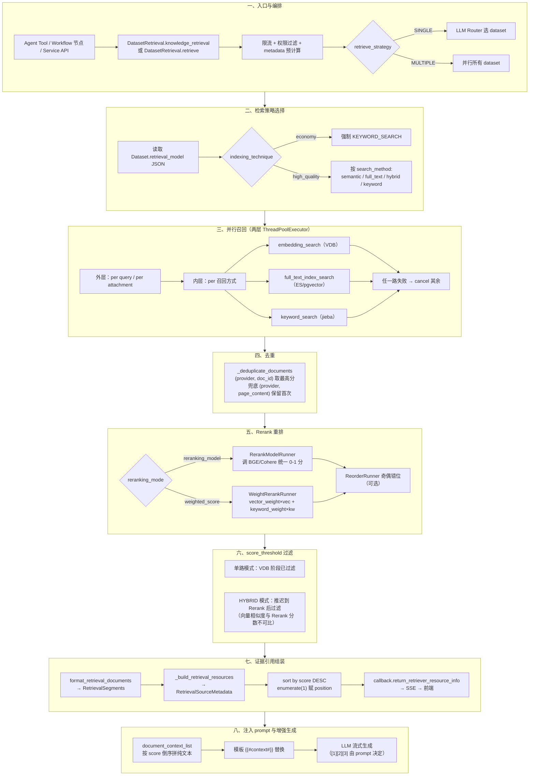
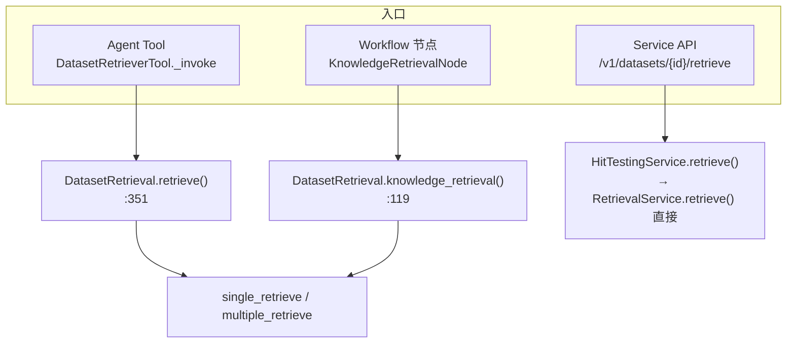
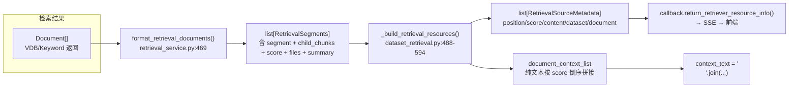
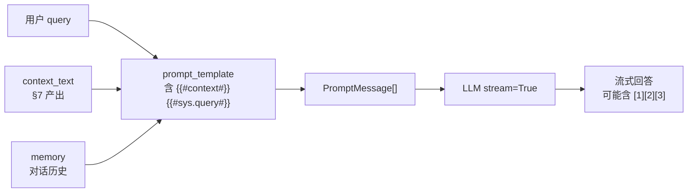

# RAG 检索管线与增强生成

> **相关文档**：本篇聚焦检索/生成/引用（应用运行时）侧；索引/一致性/自定义 splitter 等数据准备内容见 [09-rag-indexing.md](./dify-09-rag-indexing.md)。

> **学习目标**：理解 Dify 中从「检索请求」到「LLM 回答 + 引用列表」的完整运行时管线，掌握四类检索模式、`DatasetRetrieveConfigEntity` 配置三层结构、两层线程池与 HYBRID score_threshold 推迟等关键设计、证据引用机制（`[1][2][3]` 由 LLM 自由生成、前端不做程序化对应），以及性能优化、调参与运维实践。
>
> **读完本章你应该能回答**：
> - Dify 有哪四类检索模式？它们互斥还是能融合？hybrid_search 是怎么"并行融合"的？
> - `DatasetRetrieveConfigEntity` 配置的三层结构（单数据集配置 / 多数据集配置 / 跨租户默认）是什么？
> - 两层线程池（embedding 编码线程池 vs 检索执行线程池）的职责分工？为什么两者分开？
> - HYBRID 模式下 `score_threshold` 为什么要在融合后做"推迟过滤"？这和单路检索的阈值过滤有什么不同？
> - 证据引用机制是怎么工作的？为什么 `[1][2][3]` 是由 LLM 自由生成、前端不做程序化对应？
> - 关键词检索（jieba）和全文检索有什么区别？为什么 pgvector 也可以做全文检索？
> - Rerank 模型在管线中的位置？为什么检索后还要过一次 LLM 重排序？
> - Top-K / score_threshold / reranking_model 三个参数怎么调？典型的取舍是什么？
> - RAG 检索的高频运维问题（命中率低、Top-K 不够、引用对不上）怎么排查？

## 本章要解决的问题

09 章讲了怎么把文档切片、向量化、写进向量库——那是"建库"侧。但建完库只是存了数据，用户问一句话时，**Dify 怎么从几十万条分段里找到相关的几条、塞进 prompt 让 LLM 有依据地回答**？这就是本章拆解的检索管线要解决的问题。

这个问题的难点不在于"查一下向量库"——单路向量检索任何向量库都能做。真正的工程矛盾在于：**纯向量检索召回相关但不精确（语义近但词面不同），纯关键词检索精确但不理解语义（同义词全漏），两者分数体系还不可比（余弦 0.72 vs BM25 8.5）**。Dify 的解法是"多路并行召回 → 去重 → Rerank 统一打分 → 阈值过滤"，让每种检索方式的优点互补、缺点对冲。但多路并行带来新的工程问题：一路失败怎么办？跨库分数基线不同怎么融合？阈值该在哪一步生效？

更深层的问题是**证据溯源**：LLM 生成的内容必须有依据，否则就是"一本正经地胡说八道"。Dify 需要把检索到的分段以两种形式同时输出——给 LLM 看的纯文本上下文（让它有依据地回答），给前端看的结构化元数据（让用户能点开看原文）。这两套产物的编号如何对应？Dify 的回答是：**不对应**——`[1][2][3]` 由 LLM 自由生成，前端只展示引用列表，两者只共享按 score 倒序的排列。这个设计决策背后的取舍是本章的重点之一。

检索管线坏了，知识库建了也用不上：LLM 拿不到上下文、回答没有依据、用户无法溯源——等于 RAG 退化成"裸 LLM 问答"。

## 宏观架构：一次检索请求的生命周期

下图是一次 RAG 检索请求从入口到增强生成的完整生命周期，也是全文的叙事主线——后续每一节对应生命周期的一个阶段。



理解这张图的关键：**检索管线是"漏斗"结构——从多路宽召回，逐步收窄到 Top-N 精排，最后分成两条产物线（LLM context + 前端 metadata）**。每一步都在解决前一步遗留的问题：并行召回解决了"单路不够全"但带来了"重复段"；去重解决了"重复"但带来了"分数不可比"；Rerank 解决了"不可比"但带来了"额外 API 延迟"；score_threshold 过滤解决了"噪声"但 HYBRID 下不能提前下推。

下面按这八个阶段逐层展开。

## 一、入口与编排层

**这一节为什么存在**：检索不是"直接查向量库"那么简单——上层调用方（Agent、Workflow 节点、Service API）各自带着不同的上下文（哪些 dataset、什么过滤条件、要不要 Router），必须有一个编排层统一回答"能查哪些库、用什么过滤、走单库还是多库"。这一层就是 `DatasetRetrieval`。

Dify 的检索有三个入口，最终都汇入 `DatasetRetrieval`（dataset_retrieval.py:102）：



三个入口的差异：

| 入口 | 调用方法 | 返回值 | 特点 |
|------|---------|--------|------|
| Agent Tool | `retrieve()`（dataset_retrieval.py:351） | `(context_text, context_files)` | Agent 只支持 SINGLE 模式（dataset_retriever_tool.py:51），每个 dataset 变成一个 Tool |
| Workflow 节点 | `knowledge_retrieval()`（dataset_retrieval.py:119） | `list[Source]` | 支持 SINGLE / MULTIPLE，走 `KnowledgeRetrievalRequest` |
| Service API | `HitTestingService.retrieve()`（hit_testing_service.py:106） | `dict` | 绕过编排层，直接调 `RetrievalService.retrieve()`，单库检索 |

`knowledge_retrieval()` 是 Workflow 节点的统一入口，做三件事（dataset_retrieval.py:119-248）：

1. **限流 + 权限过滤**：`_check_knowledge_rate_limit(tenant_id)`（dataset_retrieval.py:120）按租户配额限流；`_get_available_datasets(...)`（dataset_retrieval.py:1847）过滤掉无权限、archived、无可用文档的库。
2. **metadata 过滤预计算**（可选）：`get_metadata_filter_condition(...)`（dataset_retrieval.py:1350）——manual 模式直接把 name→value 转 SQL WHERE；automatic 模式调 LLM 把自然语言 query 翻译成结构化过滤条件。
3. **路由分发**：`retrieve_strategy == SINGLE` 走 `single_retrieve()`（用 LLM Router 选 dataset），否则走 `multiple_retrieve()`（并行所有 dataset）。

**Agent 入口的特殊处理**：`DatasetRetrieverTool.get_dataset_tools()`（dataset_retriever_tool.py:28）会临时把 `retrieve_strategy` 改成 SINGLE——因为 Agent 的工具调用语义是"一次调一个工具"，多库并行不适用。改完再恢复原值（dataset_retriever_tool.py:67），不影响后续 Workflow 路径。

外部知识库（`provider == "external"`）走独立 HTTP 路径，**不经 `RetrievalService._retrieve`**，直接转 `provider="external"` 的 `Document`（dataset_retrieval.py:649-668）。

## 二、检索策略选择

**这一节为什么存在**：选错检索策略会直接导致"查不到"或"查到一堆噪声"。Economy 库没有向量、HighQuality 库才有语义检索能力——策略选择必须和索引侧的能力对齐，否则运行时报错或静默退化。

`RetrievalMethod` 枚举定义四种检索模式，**互斥但可融合**（retrieval_methods.py:4）：

```python
class RetrievalMethod(StrEnum):
    SEMANTIC_SEARCH = "semantic_search"     # 纯向量检索
    FULL_TEXT_SEARCH = "full_text_search"   # 纯全文检索
    HYBRID_SEARCH = "hybrid_search"         # 混合：向量 + 关键词/全文并行
    KEYWORD_SEARCH = "keyword_search"       # 纯关键词（jieba）
```

**"互斥但可融合"**：一次检索请求只能选一种模式，但 HYBRID 模式内部"融合"了向量 + 全文两种检索路径。两个静态方法是分路开关——**HYBRID 模式下两个都返回 True**，因此同时跑向量 + 全文 + 关键词三路（retrieval_methods.py:10-16）。

| 模式 | 向量库 | 关键词库 | 典型场景 |
|---|---|---|---|
| `SEMANTIC_SEARCH` | 用 | 不用 | 通用语义问答、跨语言检索 |
| `FULL_TEXT_SEARCH` | 不用 | 不用（走 ES/pgvector 全文） | 精确关键词匹配、专业术语 |
| `HYBRID_SEARCH` | 用 | 用 | 高 precision 要求的客服/研究 |
| `KEYWORD_SEARCH` | 不用 | 用（jieba） | 仅 Economy 知识库 |

**策略选择不是纯用户配置，还要看索引能力**。`single_retrieve()` 里有一段关键逻辑（dataset_retrieval.py:688-691）：

```python
if selected_dataset.indexing_technique == IndexTechniqueType.ECONOMY:
    retrieval_method = RetrievalMethod.KEYWORD_SEARCH   # Economy 库强制走关键词
else:
    retrieval_method = retrieval_model_config["search_method"]  # HighQuality 才按配置
```

同样在 `_retriever()` 里（dataset_retrieval.py:1122-1133）：Economy 库不管用户配了什么 `search_method`，都用 `KEYWORD_SEARCH`——因为 Economy 模式只构建了 jieba 关键词库，根本没有向量可查。

**HYBRID 在不同 indexing_technique 下的实际表现也不同**：

| `indexing_technique` | 实际召回路数 | 缺失路 | 原因 |
|---|---|---|---|
| `high_quality` | 3 路（向量 + 全文 + 关键词） | 无 | 完整 HYBRID |
| `economy` | 2 路（全文 + 关键词） | 缺向量路 | Economy 不构建向量库 |

> **调试提示**：如果发现"Economy 库配了 HYBRID 但只召回 2 路"，不要误以为是 bug——这是设计如此。同理 `search_method == "keyword_search"` 仅 Economy 有效。

**全文检索的实现载体**：`full_text_index_search`（retrieval_service.py:414）调用 `Vector(dataset=dataset).search_by_full_text()`——注意是走 **Vector 工厂**而非独立 ES 客户端。pgvector 向量库的 `search_by_full_text` 利用 PostgreSQL 原生的 `tsvector` 全文检索能力；ES/OpenSearch 向量库则用其原生 BM25。所以"pgvector 也可以做全文检索"是因为 Vector 抽象层把全文检索能力也封装进去了——不同向量库适配层各自实现，对上层统一接口。

## 三、并行召回：两层线程池

**这一节为什么存在**：HYBRID + 多模态的一次 retrieve 最多触发 7 路网络调用（4 路召回 × 1 query + 2 附件），串行执行总延迟 700-2100ms，超过 RAG 聊天 1s 体验阈值。两层线程池把 7 路并发执行，理论最低延迟降到单路 max ≈ 300ms。

检索阶段是**两层调用**结构（retrieval_service.py:114）：

```
外层 ThreadPoolExecutor (per query / per attachment)        ← Query 分发
  └─ 每条 future 进入 _retrieve()  (retrieval_service.py:779)
       └─ 内层 ThreadPoolExecutor (per 召回方式)            ← 并行召回
            ├─ keyword_search              (KEYWORD_SEARCH)
            ├─ embedding_search (text)     (is_support_semantic_search)
            ├─ embedding_search (image)    (多模态)
            └─ full_text_index_search      (is_support_fulltext_search)
```

**外层 Query 分发**（retrieval_service.py:140-178）：`RetrievalService.retrieve()` 接收 `query` 和 `attachment_ids`，两者都为空直接返回 `[]`，否则用一个 `ThreadPoolExecutor` 为每个输入各开一条 future。每条 future 都包了 `_propagate_otel_context(...)`（retrieval_service.py:96）——把 OpenTelemetry trace 上下文跨线程传递，保证一次 retrieve 在 trace UI 上是同一个 span。

**内层并行召回**（retrieval_service.py:800-865）：`_retrieve()` 内部新开一个 `ThreadPoolExecutor`，按 `retrieval_method` 决定并行触发哪几路。`is_support_semantic_search()` / `is_support_fulltext_search()` 两个静态方法是分路开关——HYBRID 模式下两个都返回 True，同时提交 3 条 future 并行执行。

**失败取消机制**（retrieval_service.py:868-873）：

```python
for future in concurrent.futures.as_completed(futures, timeout=300):
    if future.exception():
        for f in futures:
            f.cancel()
        break
```

`as_completed` 谁先完成就 yield 谁，一旦某个 future 抛异常就立即遍历所有 futures 调 `.cancel()`。需要注意的是，`ThreadPoolExecutor` 的 `cancel()` **只能阻止尚未开始执行的任务进入队列**——已经在跑的任务无法被中断（`cancel()` 对已运行任务返回 `False`），只能等它自己完成或超时。这个机制真正避免的浪费是**不让其他路继续进入执行**，从而省下本该传给下游 Rerank 的 API 调用——否则用空集合或半坏数据去调 Rerank 模型，既浪费 API 费用又拉长延迟。

**为什么用 `ThreadPoolExecutor` 而不是手写 `threading.Thread`**：线程复用、`with` 块自动 join、`as_completed` 语义、`future.exception()` 异常聚合——把"启动-等待-异常处理"从 30+ 行手写代码压到 5 行。`max_workers` 默认 `RETRIEVAL_SERVICE_EXECUTORS`（middleware/__init__.py:233，默认 `os.cpu_count() or 1`）。

**`group_id` 过滤**：每次向量检索都带 `filter={"group_id": [dataset.id]}`（retrieval_service.py:350）——向量库层面的租户隔离字段，多租户共享同一 collection 时防止跨租户越权。

## 四、去重：双规则合并

**这一节为什么存在**：HYBRID 模式下同一段会被向量、全文、关键词三路同时命中，结果列表里出现 3 份。如果不合并，Rerank 模型会把同一段当作 3 个独立候选——调用次数 ×3、费用 ×3，且同一段可能占 Top-N 的 3 个位置污染排序。**去重必须在 Rerank 之前**——Rerank 之后段已按相关性排序，每段只出现一次，去重就没意义了。

`_deduplicate_documents()`（retrieval_service.py:236）用双规则按数据可用性优先级处理"什么是同一段"：

| 规则 | Trigger 条件 | 判断依据 | 重复时如何选 |
|---|---|---|---|
| **首选 `(provider, doc_id)`** | `metadata.doc_id` 存在 | VDB 返回的段唯一 ID | **取分数最高者** |
| **兜底 `(provider, page_content)`** | `metadata.doc_id` 缺失 | 段落文本内容 | **保留首次出现** |

```python
# retrieval_service.py:254-277
for doc in documents:
    doc_id = (doc.metadata or {}).get("doc_id")
    if doc_id:
        key = (doc.provider or "dify", doc_id)
        if key not in chosen:
            chosen[key] = doc
            order.append(key)
        else:
            # 只有新分数严格更高才覆盖
            if "score" in doc.metadata:
                new_score = float(doc.metadata.get("score", 0.0))
                old_score = float(chosen[key].metadata.get("score", 0.0))
                if new_score > old_score:
                    chosen[key] = doc
    else:
        content_key = (doc.provider or "dify", doc.page_content)
        if content_key not in chosen:
            chosen[content_key] = doc
            order.append(content_key)
```

**为什么是混合策略而不是统一规则**：
- 首选用 doc_id 而非 page_content 是为了**抗语义冲突**：同一文本可能因 embedding 不同属于不同段，只有 doc_id 能稳定标识身份。
- 首选"取最高分"而非"保留首次"是因为 HYBRID 下同一段在向量空间（0.72）和 BM25 空间（8.5）的分数都是合法表示——保留 0.85 信号更强。
- 兜底"保留首次"是因为外部库 HTTP 响应可能没 `score` 字段，无法比较分数，只能按"先来后到"。

`order` 列表跟踪插入顺序，最终按 `[chosen[k] for k in order]` 输出——保证**稳定输出顺序**，上层 debug 日志、前端 citation 渲染都依赖"同一 query 多次检索结果顺序一致"。

## 五、Rerank 重排：两种模式

**这一节为什么存在**：去重后的 documents 还有两个问题——**分数不可比**（向量 0.72、BM25 8.5 是不同空间）和**位置集中**（LLM 注意力偏向 prompt 首尾，中间段被忽略，即 [Lost in the Middle](https://arxiv.org/abs/2307.03172)）。`DataPostProcessor` 用 Rerank + Reorder 两步解决。

`DataPostProcessor.invoke()`（data_post_processor.py:49）是严格两步串联：

```python
def invoke(self, query, documents, score_threshold, top_n, query_type):
    if self.rerank_runner:    # Step 1：按统一分数重排 + 截 top_n
        documents = self.rerank_runner.run(query, documents, score_threshold, top_n, query_type)
    if self.reorder_runner:   # Step 2：调整位置让 LLM 注意力均匀覆盖
        documents = self.reorder_runner.run(documents)
    return documents
```

> **顺序不能反**：Rerank 必须先做（按统一分数截 `top_n`），再做 Reorder（仅调整位置）。倒过来会破坏"靠前段最相关"的假设。

### Step 1：Rerank 按 `reranking_mode` 二选一

`RerankMode` 枚举（rerank_type.py:4）定义两种模式，由 `RerankRunnerFactory`（rerank_factory.py:7）分发：

| `reranking_mode` | Runner 类 | 实现 | 输出 |
|---|---|---|---|
| `RERANKING_MODEL` | `RerankModelRunner`（rerank_model.py:16） | 调 BGE/Cohere/Jina，按 query-document 相关性重排 | 统一 0-1 分数 |
| `WEIGHTED_SCORE` | `WeightRerankRunner`（weight_rerank.py:18） | `vector_weight × vector_score + keyword_weight × keyword_score` 线性加权 | 0-1 融合分数 |

**RERANKING_MODEL 模式**（rerank_model.py:21）：调外部 Rerank 模型 API，返回的 `RerankResult.docs` 每条带 `index` 和 `score`。Runner 把分数写回 `document.metadata["score"]`，按 score 降序截 `top_n`。多模态场景下（`query_type == IMAGE_QUERY`）会检查 Rerank 模型是否支持 vision——不支持则直接返回原序（rerank_model.py:46-50）。

**WEIGHTED_SCORE 模式**（weight_rerank.py:24）：不调外部 API，纯本地计算。公式（weight_rerank.py:64-66）：

```python
score = vector_weight * query_vector_score + keyword_weight * query_score
```

其中 `query_vector_score` 来自 `CacheEmbedding.embed_query(query)` 与文档向量的余弦相似度（weight_rerank.py:154-194）；`query_score` 来自 jieba 关键词的 TF-IDF 余弦相似度（weight_rerank.py:77-152）。

**隐含约定**：`full_text_index_search` 的 BM25 分数被归入 `keyword_weight` 分支——因为 ES/OpenSearch 的 BM25 与 jieba 关键词分数在 Dify 内部被归为同一类（都是文本匹配信号），而不是单独一类。所以 `keyword_weight` 同时控制"jieba 关键词召回"和"BM25 全文召回"两路的权重。如果发现"向量召回 0.8 的段被全文召回 0.3 的段压下去"，检查 `vector_weight` 是否设得过低。`vector_weight=0.7, keyword_weight=0.3` 是常见起点。

任一条件不满足时 `rerank_runner = None`（data_post_processor.py:71-96），**直接跳过 Rerank**，保留去重后的原顺序。

### Step 2：Reorder 奇偶错位（可选）

`ReorderRunner.run()`（reorder.py:5）做"奇偶错位反转"——把 `documents[::2]` 与 `documents[1::2][::-1]` 拼接，结果是 `[0,2,4,...,5,3,1]`：奇数位正序、偶数位倒序穿插，让最相关的段不集中在头部或尾部。仅当 `reorder_enabled=True` 时启用。

### HYBRID 下的后处理入口

HYBRID 模式的 Rerank 不在 `embedding_search` 内部做（单路模式才在内部做，见 retrieval_service.py:368-409），而是在 `_retrieve()` 末尾统一做（retrieval_service.py:879-901）：

```python
if retrieval_method == RetrievalMethod.HYBRID_SEARCH:
    all_documents_item = self._deduplicate_documents(all_documents_item)
    data_post_processor = DataPostProcessor(str(dataset.tenant_id), reranking_mode, ...)
    all_documents_item = data_post_processor.invoke(
        query=rerank_query, documents=all_documents_item,
        score_threshold=score_threshold, top_n=top_k, query_type=query_type)
```

多库场景下还有**第二层 Rerank**：`_multiple_retrieve_thread()` 在所有 dataset 各自检索完后，如果 `reranking_enable and dataset_count > 1`，再对所有库的结果做一次 `DataPostProcessor.invoke()`（dataset_retrieval.py:1810-1828）——把跨库的分数统一到同一基线。

## 六、score_threshold 过滤：HYBRID 的推迟

**这一节为什么存在**：用户配了 `score_threshold=0.5` 想过滤低分段，但在 HYBRID 模式下如果把这个阈值下推到向量召回阶段，会误删"跨模型基线偏低但语义相关"的段——因为向量相似度（余弦 0.72）和 Rerank 分数（0-1 概率 0.85）不可比。

**行为对照**：

| 模式 | `embedding_score_threshold` | VDB 行为 | threshold 生效时机 |
|---|---|---|---|
| `SEMANTIC_SEARCH` / `FULL_TEXT_SEARCH` | `score_threshold`（用户原值） | 召回阶段就过滤 | VDB 阶段已生效 |
| `HYBRID_SEARCH` | `0.0`（关掉 VDB 过滤） | 召回所有段 | **Rerank 之后**才过滤 |

源码实现（retrieval_service.py:340-342）：

```python
embedding_score_threshold = (
    0.0 if retrieval_method == RetrievalMethod.HYBRID_SEARCH else score_threshold
)
documents = vector.search_by_vector(query,
    search_type="similarity_score_threshold",
    top_k=top_k, score_threshold=embedding_score_threshold, ...)
```

在召回阶段就重写 `embedding_score_threshold = 0.0`，但实际生效是在 Rerank 之后——`DataPostProcessor.invoke()` 把 `score_threshold` 传给 Rerank Runner，由 Runner 在重排后过滤（weight_rerank.py:68、rerank_model.py:58）。

**兜底路径**：如果 HYBRID 模式下 `rerank_runner` 为 `None`（没配 Rerank 模型），`_retrieve()` 末尾会用 `_filter_documents_by_vector_score_threshold()`（retrieval_service.py:219）做一次兜底过滤——用原始向量分数而非 Rerank 分数，这是"没有 Rerank 时的退而求其次"（retrieval_service.py:902-905）。

## 七、证据引用组装

**这一节为什么存在**：检索结果不能直接丢给 LLM——LLM 需要纯文本上下文，前端需要结构化元数据（哪个库、哪个文档、第几段、分数多少、有没有附件）。Dify 输出**两套不共享结构的产物**，用同一次排序的 score 倒序关联。



### 7.1 中间表示：RetrievalSegments

`format_retrieval_documents()`（retrieval_service.py:469）把 VDB/Keyword 返回的裸 `Document` 列表加工成 `RetrievalSegments`（retrieval.py:26）：

```python
class RetrievalSegments(BaseModel):
    segment: DocumentSegment              # PG 中的分段记录
    child_chunks: list[RetrievalChildChunk] | None = None  # 父子索引的子块
    score: float | None = None            # max(子块分, 附件分, summary分)
    files: list[AttachmentInfoDict] | None = None          # 多模态附件
    summary: str | None = None            # summary 召回的摘要
```

这一步做了批量优化（避免 N+1 查询）：
- 批量查 `DatasetDocument` 拿 `doc_form`（判断是否 parent_child）
- 识别 summary 文档 → 走 `original_chunk_id` 反查原段
- 父子分支 → 查 `ChildChunk` 按 `segment_id` 聚合，`score = max(child_scores, attachment_scores, summary_score)`
- 过滤 `enabled == True and status == "completed"` 的段（读时过滤"幽灵段"）

### 7.2 两条产物线

`retrieve()` 方法（Agent 入口，dataset_retrieval.py:488-594）和 `knowledge_retrieval()` 方法（Workflow 入口，dataset_retrieval.py:249-349）各自组装两条产物：

**产物一：LLM context（纯文本，无编号）**

```python
# dataset_retrieval.py:488-510
for record in records:
    segment = record.segment
    segment_content = (
        f"question:{segment.get_sign_content()} answer:{segment.answer}"
        if segment.answer else segment.get_sign_content()
    )
    final_content = (
        f"{record.summary}\n{segment_content}" if record.summary else segment_content
    )
    document_context_list.append(DocumentContext(content=final_content, score=record.score))

# 倒序拼接
return str("\n".join(d.content for d in sorted(document_context_list, key=lambda x: x.score or 0.0, reverse=True))), context_files
```

关键点：
- **`get_sign_content()` 还原切片标记**：IndexProcessor 阶段截断时会附 `​`（zero-width-space）标记，检索时还原为干净的 `segment.content`——LLM 看到的不是被切过的部分。
- **`{summary}\n{原段}` 拼接**：summary 召回时，LLM 同时看到"摘要 + 原文"（全局视野）。
- **无任何编号**：`<context>` 标签内是裸文本，LLM 是否写 `[1]` 完全由 prompt 决定。

**产物二：前端 metadata（结构化，1-indexed position）**

`RetrievalSourceMetadata`（citation_metadata.py:6）是结构化元数据：

```python
class RetrievalSourceMetadata(BaseModel):
    position: int | None = None           # 展示用编号（1-indexed）
    dataset_id / dataset_name: str | None
    document_id / document_name: str | None
    data_source_type: str | None          # upload_file / notion / web / external
    segment_id: str | None                # external 知识库时为 None
    retriever_from: str | None            # dev / api / web_app / explore / tool
    score: float | None
    content: str | None                   # 段落原文（QA 拼为 "question:X \nanswer:Y"）
    doc_metadata: dict[str, Any] | None   # 用户自定义文档元数据
    files: list[dict[str, Any]] | None    # 多模态附件
    summary: str | None                   # summary 召回的摘要
```

`position` 的唯一来源是后端在排序后用 `enumerate(..., start=1)` 一次性分配（dataset_retrieval.py:587-588），前端不做二次编号：

```python
retrieval_resource_list = sorted(retrieval_resource_list, key=lambda x: x.score or 0.0, reverse=True)
for position, item in enumerate(retrieval_resource_list, start=1):
    item.position = position
hit_callback.return_retriever_resource_info(retrieval_resource_list)
```

### 7.3 为什么 `[1][2][3]` 是 LLM 自由生成

Dify 默认 prompt 模板（advanced_prompt_templates.py:1）：

```python
CONTEXT = """Use the following context as your learned knowledge, inside <context></context> XML tags.

<context>
{{#context#}}
</context>

When answer to user:
- If you don't know, just say that you don't know.
- If you don't know when you are not sure, ask for clarification.
Avoid mentioning that you obtained the information from the context.
And answer according to the language of the user's question.
"""
```

模板**不强制要求**输出 `[1][2][3]` 标记——LLM context 是 `"\n".join(plain_text)` 纯文本，没有编号；`retriever_resources` 是结构化 metadata，有 `position` 编号。两者**只共享按 score 倒序的排列**，没有程序化对应关系。

Dify 没走 Anthropic Citations API / OpenAI file_citation 那种"模型内置引用"路线，而是把"是否输出引用"完全交给 prompt 配置。用户想自定义引用格式，在 `pre_prompt` 里加规则即可（如"回答时在引用处标注 `[1][2][3]`"），但这只是 LLM 自由生成的标记，并非程序化对应。

### 7.4 生命周期与审计快照

```
检索响应 → SSE metadata.retriever_resources → 前端缓存
       → 持久化到 messages.metadata.retriever_resources 列
       → /messages API → 历史会话重新打开 → 直接渲染（不重新检索）
```

历史消息里的引用是**审计快照**：segment 被删/禁用后，`format_retrieval_documents` 不会再查它，但历史消息里仍有 `content` 字段——前端直接展示旧 content；document 被 archive 后，历史消息里 `document_name` 还是旧值。

## 八、注入 prompt 与增强生成

**这一节为什么存在**：检索的最终目的是"让 LLM 有依据地回答"。前面七步产出的 `context_text` 必须正确注入 prompt，LLM 才能基于上下文生成回答。这一步看似简单，但 prompt 模板的设计直接影响引用是否出现、回答是否忠实于上下文。

prompt 装配由 `simple_prompt_transform` / `advanced_prompt_transform` 完成，模板引擎把 `{{#context#}}` 替换为 §7.3 拼接的纯文本。完整流程：



**关键设计决策**：

- **context 在 prompt 里的位置**：默认模板把 context 放在 `<context>` XML 标签内，位于 query 之前。这是"先给材料再提问"的范式，让 LLM 先"阅读"再"回答"。
- **`Avoid mentioning that you obtained the information from the context`**：这条指令让 LLM 不要说"根据上下文..."，而是直接给出答案——提升用户体验，但牺牲了可解释性。
- **多模态注入**：`vision_enabled` 时，图片以 `File` 对象直接喂给视觉 LLM（dataset_retrieval.py:511-539），而非 URL——LLM 不读 URL，需要直接看到图片数据。

**增强生成参数对效果的影响**：

| 参数 | 作用 | 调参方向 |
|------|------|----------|
| `top_k` | 召回候选数 | 太小 → 召回不足；太大 → 噪声 + token 浪费 |
| `score_threshold` | 过滤低分段 | HYBRID 下只在 Rerank 后生效（见 §6） |
| `reranking_model` | 统一打分 | 启用后 precision 通常 +10~30% |
| `prompt_template` | 控制引用格式 | 想要 `[1][2][3]` 必须在 prompt 里明确要求 |

## 收敛

### 边界与扩展点

**检索 vs 索引的边界**：本章只管"读时"（在线检索），"写时"（离线索引）见 [09-rag-indexing.md](./dify-09-rag-indexing.md)。两者的耦合点在 `Dataset.retrieval_model` JSON——索引侧写入什么 `indexing_technique` / `doc_form`，检索侧就必须按对应策略检索（Economy → keyword、parent_child → 回查 parent）。

**多库检索的两条硬约束**（dataset_retrieval.py:757-780）：

| 场景 | 约束 | 原因 |
|---|---|---|
| 跨 `indexing_technique`（high_quality ↔ economy） | 必须配 Rerank model | economy 库无向量分，WEIGHTED_SCORE 公式缺值 |
| 跨 `embedding_model` + `WEIGHTED_SCORE` | 必须切 Rerank model | 线性加权会被基线漂移污染 |

**扩展点**：
- **External Dataset**：`provider == "external"` 的库走 HTTP 转发，Dify 不存向量（见附录 E）。
- **多模态检索**：`attachment_ids` 非空时，文本 query 和图片 query 并行触发（见附录 E）。
- **Metadata 过滤**：automatic 模式用 LLM 把 query 翻译成结构化条件（见附录 E）。
- **Rerank 模型插件化**：`RerankRunnerFactory` 按 `runner_type` 分发，新增 Rerank 实现只需注册新 Runner。

### 本章要点

1. **检索管线是漏斗结构**：多路并行召回 → 去重 → Rerank 统一打分 → 阈值过滤 → 两条产物线（LLM context + 前端 metadata）。
2. **四类检索模式互斥但可融合**：HYBRID 内部融合向量 + 全文 + 关键词三路；Economy 库强制走 KEYWORD_SEARCH，HighQuality 库才按配置。
3. **两层 ThreadPoolExecutor**：外层 per query/attachment 分发，内层 per 召回方式并行；任一路失败立即 `cancel()` 其余，省下游 Rerank API 费用。
4. **去重双规则**：首选 `(provider, doc_id)` 取最高分，兜底 `(provider, page_content)` 保留首次——`order` 列表保证稳定输出。
5. **HYBRID score_threshold 推迟**：向量相似度与 Rerank 分数不可比，HYBRID 在召回阶段重写 `embedding_score_threshold = 0.0`，推迟到 Rerank 后过滤。
6. **两条产物线不共享结构**：LLM 看纯文本无编号，前端看结构化 metadata 有 `position`；`[1][2][3]` 由 LLM 自由生成，前端不做程序化对应。
7. **多库两条硬约束**：跨 indexing_technique 或跨 embedding_model + WEIGHTED_SCORE 时强制切 Rerank model。
8. **Agent 入口强制 SINGLE**：`DatasetRetrieverTool` 临时改 `retrieve_strategy` 为 SINGLE 再恢复。

### 推荐源码入口

| 文件 | 职责 |
|------|------|
| api/core/rag/retrieval/dataset_retrieval.py | 顶层编排：`knowledge_retrieval` / `retrieve` / `single_retrieve` / `multiple_retrieve` |
| api/core/rag/retrieval/retrieval_methods.py | `RetrievalMethod` 枚举 + 能力判断方法 |
| api/core/rag/datasource/retrieval_service.py | 单库检索：两层线程池 + 去重 + HYBRID 后处理 |
| api/core/rag/data_post_processor/data_post_processor.py | `DataPostProcessor`：Rerank + Reorder 两步串联 |
| api/core/rag/rerank/rerank_model.py | `RerankModelRunner`：调外部 Rerank 模型 API |
| api/core/rag/rerank/weight_rerank.py | `WeightRerankRunner`：本地线性加权融合 |
| api/core/rag/data_post_processor/reorder.py | `ReorderRunner`：奇偶错位反转 |
| api/core/rag/entities/citation_metadata.py | `RetrievalSourceMetadata` 字段定义 |
| api/core/rag/embedding/retrieval.py | `RetrievalSegments` / `RetrievalChildChunk` 定义 |
| api/core/tools/utils/dataset_retriever_tool.py | `DatasetRetrieverTool`：Agent 调用入口 |
| api/core/workflow/nodes/knowledge_retrieval/knowledge_retrieval_node.py | Workflow 知识检索节点 |
| api/core/rag/retrieval/router/multi_dataset_function_call_router.py | FunctionCall Router |
| api/core/rag/retrieval/router/multi_dataset_react_route.py | ReAct Router |
| api/services/hit_testing_service.py | Service API 检索服务 |
| api/core/app/app_config/entities.py | `DatasetRetrieveConfigEntity` DTO |

---

## 附录

### A. 检索配置三层结构

检索配置由三层共同表达：**DB 持久层**（`Dataset.retrieval_model` JSON 字段）、**DTO 层**（`DatasetRetrieveConfigEntity`）、**请求级覆盖**（`KnowledgeRetrievalRequest`）。

**DTO 层**（entities.py:121）：

```python
class DatasetRetrieveConfigEntity(BaseModel):
    class RetrieveStrategy(StrEnum):
        SINGLE = auto()       # 单库检索（LLM Router 选 dataset）
        MULTIPLE = auto()     # 多库并行

    query_variable: str | None = None                          # 仅 completion 模式
    retrieve_strategy: RetrieveStrategy
    top_k: int | None = None
    score_threshold: float | None = 0.0
    rerank_mode: str | None = "reranking_model"                # "reranking_model" | "weighted_score"
    reranking_model: RerankingModelDict | None = None
    weights: WeightsDict | None = None
    reranking_enabled: bool | None = True
    metadata_filtering_mode: Literal["disabled","automatic","manual"] | None = "disabled"
    metadata_model_config: ModelConfig | None = None
    metadata_filtering_conditions: MetadataFilteringCondition | None = None
```

**`Dataset.retrieval_model` JSON 结构**（持久层）：

```jsonc
{
  "search_method": "semantic_search | full_text_search | hybrid_search | keyword_search",
  "reranking_enable": true,
  "reranking_model": { "reranking_provider_name": "...", "reranking_model_name": "..." },
  "reranking_mode": "reranking_model | weighted_score",
  "weights": { "vector_setting": { "vector_weight": 0.7 }, "keyword_setting": { "keyword_weight": 0.3 } },
  "top_k": 5,
  "score_threshold": 0.5,
  "score_threshold_enabled": false
}
```

**配置在索引轴上的联动**：

| 索引轴配置 | 检索配置联动 |
|------------|--------------|
| `indexing_technique = "economy"` | 强制 `KEYWORD_SEARCH`，无向量可检索 |
| `doc_form = "parent_child"` | `top_k` 实际返回 parent 数（child 命中聚合成 parent） |
| `summary_index_setting.enable = True` | 检索时先查摘要向量库，命中后反查原段 |
| `indexing_technique = "high_quality"` | 可配 `semantic_search` / `hybrid_search` |

### B. 调参实操指南

#### B.1 分段大小调参

**默认起点**（`DatasetProcessRule.AUTOMATIC_RULES`）：

| 文档类型 | `max_tokens` | `chunk_overlap` |
|----------|--------------|-----------------|
| 普通文本 | 1024 | 50 |
| Markdown | 1024 | 50 |

```
如果 precision 低（命中但不相关）：
    减小 chunk_size（500 → 300）→ 段更短 → 单段更聚焦
    或启用 Rerank 二次精排

如果 recall 低（相关但未命中）：
    增大 chunk_size（1024 → 2000）→ 段更长 → 覆盖更多上下文
    或减小 chunk_overlap（50 → 0）

如果 embedding 维度低（如 1536）：
    chunk_size 不要超 1500 token
```

#### B.2 Rerank 与 score_threshold 调参

**启用 Rerank 的判断**：

| 症状 | 推荐动作 |
|------|----------|
| top-3 中有 1+ 段明显不相关 | 启用 Rerank（成本 +20~50ms/查询） |
| top-1 就很精准 | 不启用（省钱 + 减延迟） |
| 多语言混合检索 | 启用（多语 embedding 对齐能力差） |
| 大量短段（<  200 token） | 不启用（短段 + Rerank 边际收益低） |

**score_threshold 调参**：
- **HYBRID 模式**：不要在向量召回阶段启用（会误杀），只能放在 Rerank 后（见 §6）。
- **SEMANTIC 模式**：从 0.5 开始，按"前 10 条 query 的命中率"调。
- **调试方法**：临时设为 0，对比 Top-K 中"实际相关段"的最低分，作为合理阈值。

#### B.3 top_k 的选择

| 业务 | top_k | top_n (Rerank 后) | 说明 |
|------|-------|-------------------|------|
| 客服问答（短答案） | 3 | 2 | 引用要少、要精 |
| 研究助理（长答案） | 10 | 5 | 上下文要丰富 |
| Code Search | 5 | 3 | 代码段通常独立成段 |

> `top_n > top_k` 是错的：Rerank 是从 top_k 中筛 top_n，不可能"无中生有"。

#### B.4 嵌入模型选型

| 模型 | 维度 | 适用场景 |
|------|------|----------|
| OpenAI text-embedding-3-small | 1536 | 通用英文/中文，性价比高 |
| OpenAI text-embedding-3-large | 3072 | 高质量需求 |
| BGE-large-zh-v1.5 | 1024 | 中文为主，本地部署友好 |
| BGE-m3 | 1024 | 多语言，支持 100+ 语种 |

#### B.5 何时用 Parent-Child 模式

| 场景 | 推荐模式 | 原因 |
|------|----------|------|
| FAQ / 短答案 | paragraph | 段已够短，父子增加延迟 |
| 长文档（白皮书/报告） | parent_child | 检索精准（小段）但回答用大上下文（parent） |
| 研究论文 | parent_child | 单段可能不完整，需要 parent 补充 |

> Parent-Child 的代价：每个 parent 段被切成 N 个 child 段，索引量翻 N 倍。

#### B.6 何时用 Summary Index

| 场景 | 推荐 |
|------|------|
| 文档 <  50 段 | 不推荐（额外 LLM 调用不划算） |
| 文档 50~500 段 | 按需 |
| 文档 > 500 段 | 强烈推荐（显著降低 Top-K 噪声） |

### C. API 端点

#### C.1 Service API（应用对外，需 API Key）

| 方法 | 路径 | 用途 |
|------|------|------|
| POST | `/v1/datasets` | 知识库创建 |
| GET | `/v1/datasets/{id}` | 知识库详情 |
| POST | `/v1/datasets/{id}/retrieve` | **知识库检索**（对开发者暴露的检索接口） |
| POST | `/v1/datasets/{id}/hit-testing` | 检索测试（与 retrieve 同路径） |

`/v1/datasets/{id}/retrieve` 的控制器是 `HitTestingApi`（hit_testing.py:14），委托给 `HitTestingService.retrieve()`（hit_testing_service.py:106）——绕过 `DatasetRetrieval` 编排层，直接调 `RetrievalService.retrieve()`，适合自建 Agent/RAG Pipeline 集成。请求体包含完整 `retrieval_model` / `metadata_filtering_conditions`，与附录 A 的字段一一对应。

#### C.2 Console API

Console API 不直接暴露检索调用——所有检索由 chatflow / workflow / agent tool / Service API 在运行时触发。Console 侧的"命中测试"功能也走 `HitTestingService.retrieve()`（hit_testing_base.py:110）。

### D. 性能优化与运维

#### D.1 一次检索请求的延迟分解

```mermaid
gantt
    title 单次 RAG 检索的延迟分解（典型耗时）
    dateFormat X
    axisFormat %s ms

    section 请求解析
    解析入参（Pydantic）     :a1, 0, 5
    加载知识库元数据         :a2, 5, 15
    section 检索
    向量化 query              :b1, 20, 60
    并行 VDB 搜索             :b2, 80, 120
    并行关键词搜索            :b3, 80, 100
    HYBRID 融合               :b4, 130, 145
    section 后处理
    Rerank 模型调用           :c1, 150, 350
    去重                      :c2, 350, 360
    section LLM 生成
    拼装 prompt              :d1, 370, 380
    LLM 首 token              :d2, 380, 500
    LLM 流式生成              :d3, 500, 1500
    section 后置
    写 message + hit_count    :e1, 1500, 1550
    事件 publish              :e2, 1550, 1560
```



典型值：检索阶段约 80-150ms；Rerank 阶段约 200-500ms；LLM 生成约 1000-2000ms。

#### D.2 性能瓶颈与优化手段

| 阶段 | 常见瓶颈 | 优化手段 | 预期收益 |
|------|----------|----------|----------|
| 向量编码 | 同步调用，每 query 跑一次 | 用 `tenacity` 缓存或本地小型 embedding 模型 | -60ms |
| VDB 搜索 | ANN 召回率 vs 延迟 | 调 `ef_construction` / `ef_search`；用 HNSW 而非 IVF | -50ms |
| HYBRID 融合 | 双路并行被串行化 | 确认 `RetrievalService` 用 ThreadPoolExecutor 并行 | -30~60ms |
| Rerank 调用 | 单次 200ms+ | 用 batch_rerank 或异步预 rerank；选更快模型（BGE-reranker-base） | -100~200ms |
| LLM 首 token | 模型网络 + prompt 大小 | 简化 prompt、压缩历史；选近地域 LLM API | -200~500ms |

#### D.3 监控指标

| 指标 | 含义 | 查询方式 |
|------|------|----------|
| 检索 p99 延迟 | 端到端检索耗时 | `histogram_quantile(0.99, rate(knowledge_retrieval_duration_seconds_bucket[5m]))` |
| 分段命中率 | `segment.hit_count` 增长率 | 检索效果代理指标 |
| Rerank 调用耗时 | `DataPostProcessor.invoke` 耗时 | OTEL span |
| 向量库连接状态 | 健康检查 | 防止静默失败 |

#### D.4 关键决策表

| 决策 | 触发条件 | 推荐动作 |
|------|----------|----------|
| 何时暂停大文档 | 单文档 > 1000 页 / 50 MB | `PATCH /processing/pause` |
| 何时调整分段大小 | 召回率 <  70% 或 precision <  50% | 减小（精度问题）或增大（召回问题） |
| 何时启用 Rerank | top-3 中有 1+ 个明显不相关段 | 配 BGE-reranker / Cohere |
| 何时启用 Summary Index | 文档 > 100 段 | `dataset.summary_index_setting.enable = true` |
| 何时更换嵌入模型 | 跨语言检索质量差 | 改 `embedding_model`，触发批重建 |

#### D.5 高频运维问题排查

| 症状 | 可能原因 | 排查方法 |
|------|---------|----------|
| 命中率低 | score_threshold 过高 / chunk_size 不匹配 | 临时设 threshold=0，看 Top-K 分数分布 |
| Top-K 不够 | top_k 太小 / Rerank 截断 | 调大 top_k，确认 top_n ≤ top_k |
| 引用对不上 | LLM 未按 prompt 输出 `[1]` | 检查 pre_prompt 是否强制要求标注 |
| HYBRID 只召回 2 路 | Economy 库缺向量路 | 确认 `indexing_technique`，非 bug |
| 跨库报错 | indexing_technique 或 embedding_model 不一致 | 配 Rerank model 或统一索引配置 |

#### D.6 调优真实案例

**场景**：某客户接入 10 万条客服记录，首次检索 P95 延迟 2.8s。

**诊断**：OTEL Trace 看到 Rerank 阶段耗时 800ms+；Rerank 模型是 Cohere 跨太平洋调用；没用 prompt cache。

**优化**：切换到本地 BGE-reranker-base（推理 80ms）；HYBRID 时只在召回 > 5 条时 rerank；关闭元数据过滤（少一次 LLM 调用）。

**结果**：P95 降到 1.2s，吞吐量提升 2x。

### E. 扩展专题

#### E.1 多知识库路由（Router）

当 App 关联多个知识库时，SINGLE 模式会**先让 LLM 决定"该查哪几个 dataset"**，再对选中的 dataset 触发检索。这一步决策就是 Router。

`single_retrieve()`（dataset_retrieval.py:597）根据模型能力选 Router（dataset_retrieval.py:631-639）：

```python
if planning_strategy == PlanningStrategy.REACT_ROUTER:
    react_multi_dataset_router = ReactMultiDatasetRouter()
    dataset_id, router_usage = react_multi_dataset_router.invoke(query, tools, ...)
elif planning_strategy == PlanningStrategy.ROUTER:
    function_call_router = FunctionCallMultiDatasetRouter()
    dataset_id, router_usage = function_call_router.invoke(query, tools, ...)
```

| 维度 | FunctionCallMultiDatasetRouter | ReactMultiDatasetRouter |
|---|---|---|
| 触发策略 | `PlanningStrategy.ROUTER` | `PlanningStrategy.REACT_ROUTER` |
| 调用方式 | 单轮 LLM 调用 | 多步 ReAct 推理 |
| 决策时机 | 一次决定查哪几个 dataset | 可先观察初步结果再决定 |
| 适用场景 | 数据集少（2-5 个）、区分度高 | 数据集多（5+ 个）、需交叉验证 |
| 延迟 | 1 次 LLM + N 次检索 | K 次 LLM + M 次检索 |

> **MULTIPLE 模式跳过 Router**——用户已显式选了 dataset，Router 是多余的。只有 SINGLE 模式才触发。

#### E.2 External Dataset（外部知识库）

Dify 支持把外部向量库（如客户的 Pinecone / 自建 Milvus）挂载为 Dataset，**不存任何数据到 Dify 自己的 VDB**：

```python
# dataset_retrieval.py:649-668
if selected_dataset.provider == "external":
    external_documents = ExternalDatasetService.fetch_external_knowledge_retrieval(
        tenant_id=..., dataset_id=dataset_id, query=query,
        external_retrieval_parameters=selected_dataset.retrieval_model, ...)
    for external_document in external_documents:
        document = Document(page_content=..., metadata=..., provider="external")
```

特点：Dify 不存向量，仅存 binding 配置；检索通过 HTTP 转发给客户自己的检索服务（走 SSRF 代理）；`data_source_type="external"`、`segment_id=None`。适合"数据不能出域"的合规场景。

#### E.3 多模态检索（Multimodal）

`RetrievalService.retrieve()` 接受 `attachment_ids`，**文本 query 和图片 query 并行触发**（retrieval_service.py:159-178）。每条 future 内部又按 `query_type` 分文本/图片两路（retrieval_service.py:816-849）：

```python
if query:
    futures.append(executor.submit(self.embedding_search, ..., query_type=QueryType.TEXT_QUERY))
if attachment_id:
    futures.append(executor.submit(self.embedding_search, ..., query_type=QueryType.IMAGE_QUERY))
```

多模态段不参与文本去重键（provider 不一致），单独走 `AttachmentInfo` 注入。`vision_enabled` 时图片以 `File` 对象直接喂给视觉 LLM，而非 URL。

#### E.4 父子索引的回查 parent

Parent-Child 检索时如果一个 parent 有 100 个 child，命中多个 child 时不能返回 100 个 parent。`format_retrieval_documents()` 用 `SegmentChildMapDetail` 聚合（retrieval_service.py:639-679）：

```python
class SegmentChildMapDetail(TypedDict):
    max_score: float               # 取 child 中最大 score
    child_chunks: list[ChildChunkDetail]  # 保留所有命中的 child（用于追溯）
```

返回给 LLM 的是**一个 parent + 它所有命中的 child 详情**，避免重复 + 保留可解释性。设计动机：向量检索精准（小段 child 提供高匹配），LLM 上下文完整（大段 parent 提供完整语义），可解释性（UI 可高亮"具体哪句被命中"）。

#### E.5 摘要索引的加速用法

开启 Summary Index 后，检索时不是先向量化 query 查向量库，而是**先向量化 query 查摘要向量库**（retrieval_service.py:498-534）：


收益：长文档/大量段的场景，先用摘要缩窄范围，再做精确检索，Top-K 召回率提升、检索延迟下降。summary 召回时 LLM 同时看到"摘要 + 原文"（`f"{summary}\n{segment_content}"`）。

#### E.6 命中计数与"热门分段"

`DocumentSegment.hit_count` 字段在每次检索命中时 +1。`_on_retrieval_end()`（dataset_retrieval.py:882）批量更新（dataset_retrieval.py:982-988）：

```python
session.execute(
    update(DocumentSegment)
    .where(DocumentSegment.id.in_(segment_ids_to_update))
    .values(hit_count=DocumentSegment.hit_count + 1)
)
```

用法：`SELECT * FROM document_segments ORDER BY hit_count DESC LIMIT 10` → 知识库的"热门问题"；命中率低的段可能是"质量差"，可考虑 disable；命中率高的段是"高价值内容"，可考虑用 Rerank 加权。

#### E.7 多库并行的二级线程模型

`multiple_retrieve()` 不是替换 §3 的两层 ThreadPoolExecutor，而是**在其上多包一层 `threading.Thread`**（dataset_retrieval.py:789-842）：

```
single dataset                              multiple datasets
─────────────                              ─────────────────
RetrievalService.retrieve()                 
  └─ ThreadPoolExecutor (per query)         multiple_retrieve()
       └─ ThreadPoolExecutor (per 召回)        └─ threading.Thread (per dataset)        ← 新增外层
                                                └─ 内部每个 Thread 都调 RetrievalService.retrieve()
```

为什么不用 `ThreadPoolExecutor + future.cancel()`？多库场景需要"任意一库失败则全部退出"的语义，但 `future.cancel()` 只能阻止未开始的任务，对已运行的任务无效。改用 `threading.Thread + cancel_event`（dataset_retrieval.py:789）：`cancel_event.is_set()` 让已运行任务主动 `raise` 退出——比 `future.cancel()` 多一层"已运行任务可主动退出"的能力。

---

> **相关文档**：索引/一致性/自定义 splitter 等数据准备内容见 [09-rag-indexing.md](./dify-09-rag-indexing.md)；Agent 推理与工具调用见 [04-agent-reasoning.md](./dify-04-agent-reasoning.md)；Agent 上下文与记忆见 [05-agent-context.md](./dify-05-agent-context.md)；Workflow 引擎见 [11-workflow-engine.md](./dify-11-workflow-engine.md)；模型运行时见 [08-model-providers-and-extensions.md](./dify-08-model-providers-and-extensions.md)。
