# Workflow 工作流引擎深度解析

> **学习目标**：理解 Dify 工作流引擎的完整架构，包括 DAG 执行模型、节点调度机制、变量池管理、三种执行模式、条件分支、循环、持久化恢复，以及如何开发自定义工作流节点。
>
> **读完本章你应该能回答**：
> - Graphon 图执行引擎的四个核心类（Graph / GraphEngine / GraphRuntimeState / VariablePool）各自负责什么？
> - 工作流的图结构（`graph_dict` JSON）如何存储？如何解析为运行时图？
> - Variable Pool 用"路径寻址"的设计有什么好处？子图怎么和父图共享/隔离变量？
> - Layer 模式的"装饰器变体"具体怎么工作？5 个内置 Layer 各自负责什么横切关注点？
> - 三种执行模式（正常 / 恢复 / 单节点调试）的差异和使用场景？
> - If/Else 通过"边激活/禁用"实现条件分支为什么比运行时 if 判断更高效？
> - Loop 节点怎么通过子图引擎实现迭代？子图为什么用 InMemoryChannel？
> - 断点恢复的完整流程：从中断 → 记录 → 恢复 → 继续执行？
> - 工作流持久化的三层保护（最大步数、最大时间、调用深度）什么时候触发？
> - 同步 vs 异步执行路径的差异？什么时候应该走 Celery？
> - 自定义工作流节点需要实现哪些接口？开发时的"最少侵入面"是什么？

## 本章要解决的问题

Dify 的工作流引擎要回答一个工程难题：**如何让开发者在可视化画布上画出一张 DAG（有向无环图），引擎把它可靠地变成可执行、可观测、可恢复的运行时流程——同时满足四个互相拉扯的约束：节点间数据要安全流转、条件分支要高效、长流程要能断点续跑、每一步都要可观测可调试。**

没有这一层，复杂业务流程只能写死在代码里：一个"检索知识库 → LLM 总结 → 条件分支 → 发邮件"的流程，在代码里是一连串 if/else 和函数调用，不可视化、不可复用、不可恢复、不可调试。用户改一个分支条件要改代码重新部署，运维要查某次执行为什么走错了分支只能翻日志。这把 AI 应用的迭代速度锁死在"代码发布周期"上。

Dify 的解法是**Graphon 图执行引擎 + VariablePool 路径寻址 + Layer 横切叠加**：开发者画的 JSON 图被解析成运行时 `Graph` 结构，`GraphEngine` 按拓扑序调度节点，节点间通过 `VariablePool` 的路径 `(node_id, variable_key)` 传递数据，条件分支通过"边激活/禁用"在调度层直接跳过不执行的分支，而配额、超时、可观测性、持久化等横切关注点通过 `Layer` 模式叠加——不侵入引擎核心。`graphon` 是 Dify 团队自研的图执行框架（作为独立 pip 包发布，v1.15.0 锁定版本 `graphon==0.5.3`，声明于 `api/pyproject.toml:47`），Dify 在 `api/core/workflow/` 和 `api/core/app/workflow/layers/` 下构建集成层。这一层坏了，所有 Workflow 和 Chatflow 应用立刻退回成"一次性脚本"——不可视化、不可恢复、不可调试。

## 宏观架构：一次工作流执行的生命周期

下图是一次工作流请求从 API 进入到 SSE 流返回的完整生命周期，也是全文的叙事主线——后续每一节对应生命周期的一个阶段。

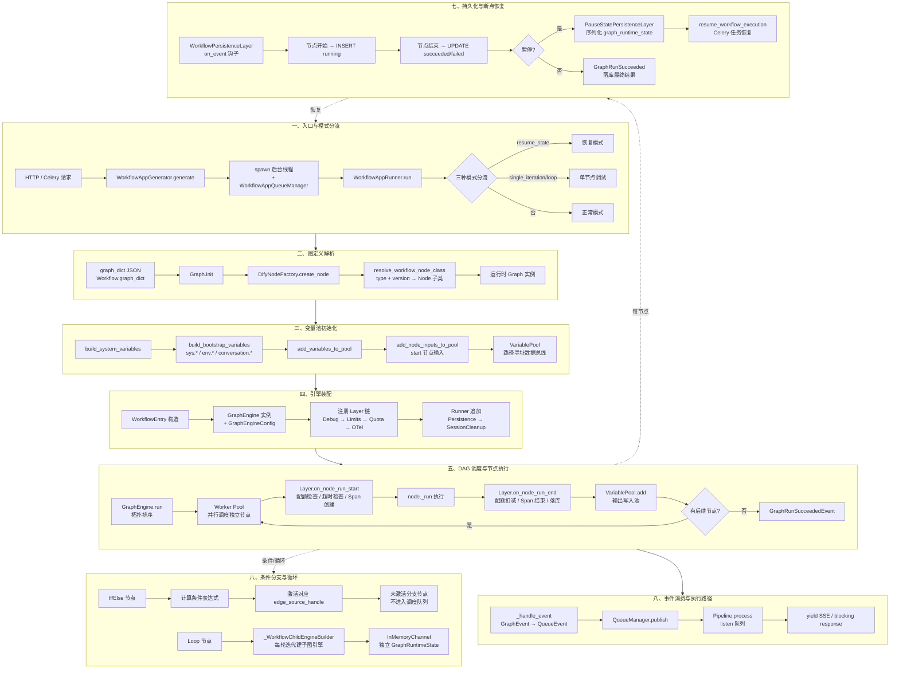

理解这张图的关键：**`VariablePool` 贯穿全程——它在模式分流阶段被初始化，在节点执行阶段被读写，在恢复阶段被序列化/反序列化。`Layer` 链则是引擎的"横切骨架"——每个节点的开始和结束都被 Layer 钩子包裹，配额/超时/可观测/持久化全部在这里完成，不侵入节点业务逻辑。** 这两个设计让工作流引擎的"数据流"和"控制流"彻底解耦。

下面按这八个阶段逐层展开。

## 一、入口与模式分流

**这一节为什么存在**：工作流的执行不在 HTTP 请求线程里跑，且同一条 `run()` 路径要支持三种完全不同的启动场景（首次执行、断点恢复、单节点调试）。入口阶段的模式分流决定了后续变量池和图如何准备，是整条生命周期的起点。

入口是 `WorkflowAppGenerator.generate()`（api/core/app/apps/workflow/app_generator.py:148）。它与 Agent Chat 的入口（详见 [03-agent-runtime.md](./dify-03-agent-runtime.md) §①）共享同一套"双线程 + 队列"骨架，但有关键差异：

```python
# app_generator.py:315-404 _generate 方法核心
queue_manager = WorkflowAppQueueManager(
    task_id=application_generate_entity.task_id,
    user_id=application_generate_entity.user_id,
    invoke_from=application_generate_entity.invoke_from,
    app_mode=app_model.mode,
)
# ... 构造 graph_layers（含 PauseStatePersistenceLayer）
worker_thread = threading.Thread(
    target=self._generate_worker,
    kwargs={"flask_app": current_app._get_current_object(), "context": context, ...},
)
worker_thread.start()
response = self._handle_response(...)
return WorkflowAppGenerateResponseConverter.convert(response=response, ...)
```

三个关键设计决策：

- **`task_id` 是全链路追踪键**：`uuid.uuid4()` 生成，贯穿 GenerateEntity、QueueManager、Redis 命令通道、WorkflowExecution 记录。
- **后台线程携带 Flask context 和 contextvars**：`preserve_flask_contexts(flask_app, context_vars=context)`（app_generator.py:602），因为 SQLAlchemy session、`current_app`、请求级 tracing 都依赖上下文变量。
- **HTTP 请求不等后台完成**：`worker_thread.start()` 后立刻调 `_handle_response` 返回 SSE 流。

后台线程的 `_generate_worker`（app_generator.py:581）构造 `WorkflowAppRunner` 并调 `runner.run()`，错误处理分五层：

| 错误 | 捕获位置 | 处理 |
|------|---------|------|
| `GenerateTaskStoppedError` | line 645 | `pass` 静默退出（用户停止） |
| `InvokeAuthorizationError` | line 648 | `publish_error` 推送 |
| `ValidationError` | line 652 | `publish_error` + 日志 |
| `ValueError` | line 655 | `publish_error`（DEBUG 时记日志） |
| 通用 `Exception` | line 659 | `publish_error` + traceback |

### 三种模式分流

`WorkflowAppRunner.run()`（api/core/app/apps/workflow/app_runner.py:65）的第一段逻辑就是模式分流——这是整条生命周期的第一个分叉点：

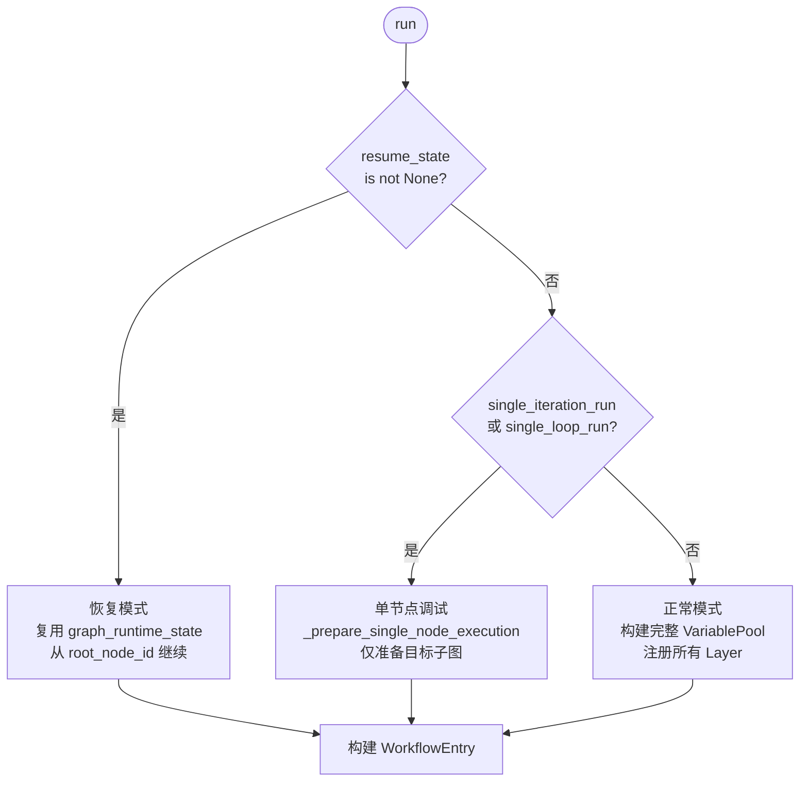

```python
# app_runner.py:77-143 三种模式分流
resume_state = self._resume_graph_runtime_state

if resume_state is not None:
    # 恢复模式：复用传入的 graph_runtime_state（含完整 variable_pool）
    graph_runtime_state = resume_state
    variable_pool = graph_runtime_state.variable_pool
    graph = self._init_graph(..., root_node_id=self._root_node_id, ...)
elif self.application_generate_entity.single_iteration_run or self.application_generate_entity.single_loop_run:
    # 单节点调试：仅准备被调试节点所在的子图
    graph, variable_pool, graph_runtime_state = self._prepare_single_node_execution(...)
else:
    # 正常模式：从零构建 VariablePool + Graph
    system_inputs = build_system_variables(files=..., user_id=..., app_id=..., ...)
    variable_pool = VariablePool()
    add_variables_to_pool(variable_pool, build_bootstrap_variables(...))
    root_node_id = self._root_node_id or get_default_root_node_id(self._workflow.graph_dict)
    add_node_inputs_to_pool(variable_pool, node_id=root_node_id, inputs=inputs, ...)
    graph_runtime_state = GraphRuntimeState(variable_pool=variable_pool, start_at=time.perf_counter())
    graph = self._init_graph(...)
```

三种模式的本质差异：

| 维度 | 正常模式 | 恢复模式 | 单节点调试 |
|------|---------|---------|-----------|
| VariablePool | 从零构建 | 复用快照 | 从零构建（仅环境变量 + 调试输入） |
| Graph | 完整图 | 完整图 | 过滤后的子图（仅目标节点 + 其迭代/循环体内的节点） |
| root_node_id | start / trigger 节点 | 中断点 | 被调试的 iteration/loop 节点 |
| invoke_from | 调用来源 | 调用来源 | 强制 `InvokeFrom.DEBUGGER` |

单节点调试模式的子图过滤逻辑在 `_prepare_single_node_execution`（api/core/app/apps/workflow_app_runner.py:171）中：它通过 `node_type_filter_key`（`iteration_id` 或 `loop_id`）筛选出目标节点及其循环体内的所有节点，再过滤边，最后用 `Graph.init(..., skip_validation=True)` 跳过图完整性校验（workflow_app_runner.py:384-386）。

> 配置组装的细节（`WorkflowAppConfigManager.get_app_config` 从 `Workflow` 模型构造）属于配置层，详见 [02-app-config-layer.md](./dify-02-app-config-layer.md)。

## 二、图定义解析：从 graph_dict JSON 到运行时 Graph

**这一节为什么存在**：工作流的图结构以 JSON 存在数据库里，引擎不能"边读 JSON 边执行"——必须先解析成强类型的运行时 `Graph` 对象，建立节点邻接表和边映射，后续的拓扑排序和调度才有基础。

### 数据模型与图存储

工作流的核心实体关系：

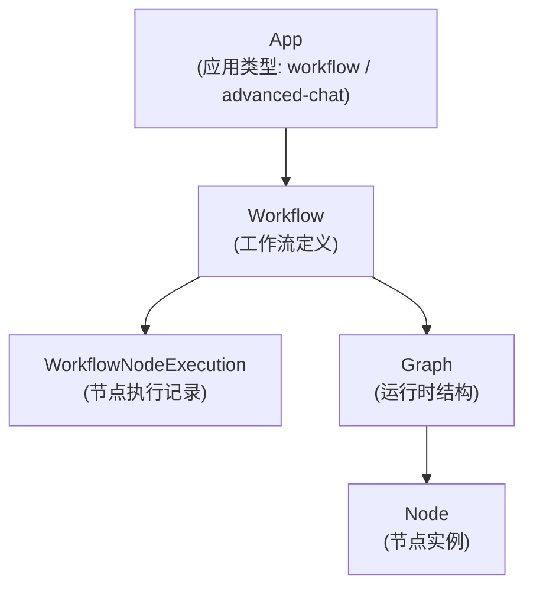

工作流的图结构以 JSON 存储在 `Workflow.graph` 字段中，通过 `graph_dict` 属性惰性解码（api/models/workflow.py:296）：

```python
@property
def graph_dict(self) -> Mapping[str, Any]:
    return json.loads(self.graph) if self.graph else {}
```

> 设计要点：`graph_dict` 不做缓存。源码注释解释了原因——`_get_graph_and_variable_pool_for_single_node_run` 会修改返回的 dict（过滤节点），缓存会导致单节点调试时图被污染（workflow.py:297-313）。

`graph_dict` 的结构是标准的前端 ReactFlow 画布格式：

```json
{
  "nodes": [
    {"id": "start", "type": "custom", "data": {"type": "start", "title": "Start", "version": "1"}},
    {"id": "llm-1", "type": "custom", "data": {"type": "llm", "version": "1", "model": {...}, ...}}
  ],
  "edges": [
    {"source": "start", "target": "llm-1", "sourceHandle": "source", "targetHandle": "target"}
  ]
}
```

每个节点 `data.type` 决定节点类（如 `llm` / `code` / `http-request`），`data.version` 决定版本。`sourceHandle` 字段是条件分支的关键——If/Else 节点的不同分支用不同的 `sourceHandle` 值（如 `"true"` / `"false"`）标识。

### 从 JSON 到运行时 Graph

解析发生在 `_init_graph`（api/core/app/apps/workflow_app_runner.py:113）：

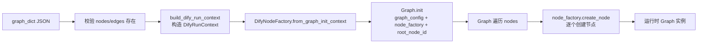

`Graph.init` 是 Graphon 引擎的入口（`from graphon.graph import Graph`），它接收 `graph_config`（JSON dict）、`node_factory`（`DifyNodeFactory` 实例）和 `root_node_id`，内部遍历 nodes 逐个调用 `node_factory.create_node()`，同时建立 edges 的邻接表。

### 节点解析：类型 + 版本 → Node 子类

`DifyNodeFactory.create_node`（api/core/workflow/node_factory.py:375）的核心是"类型 + 版本"解析：

```python
# node_factory.py:110-114 自动发现注册
@lru_cache(maxsize=1)
def register_nodes() -> None:
    _import_node_package("graphon.nodes")        # 内置 Graphon 节点
    _import_node_package("core.workflow.nodes")  # Dify 扩展节点

# node_factory.py:129-140 版本化解析
def resolve_workflow_node_class(*, node_type: NodeType, node_version: str) -> type[Node]:
    node_mapping = get_node_type_classes_mapping().get(node_type)
    latest_node_class = node_mapping.get(LATEST_VERSION)       # "latest" 降级
    matched_node_class = node_mapping.get(node_version)        # 精确版本匹配
    node_class = matched_node_class or latest_node_class
    return node_class
```

注册机制是**自动发现 + 版本化映射**：`register_nodes()` 用 `pkgutil.walk_packages` 遍历 `graphon.nodes` 和 `core.workflow.nodes` 两个包，每个节点模块在 import 时通过类装饰器自注册到 `Node` 基类的映射表。解析时优先精确匹配版本，找不到则降级到 `latest`。

### DifyNodeFactory 的注入职责

`DifyNodeFactory`（node_factory.py:277）是 Dify 层对 Graphon `NodeFactory` 的扩展，负责把 Dify 上下文注入到节点构造过程。它的 `create_node` 方法根据 `node_type` 选择不同的初始化参数工厂（node_factory.py:395-456）：

| 节点类型 | 注入的依赖 |
|---------|-----------|
| `code` | `code_executor` + `code_limits` |
| `template-transform` | `jinja2_template_renderer` + `max_output_length` |
| `http-request` | `http_request_config` + SSRF 代理 + `file_manager` |
| `llm` | `model_instance` + `credentials_provider` + `memory` + `prompt_message_serializer` + `retriever_attachment_loader` |
| `human-input` | `human_input_runtime` + `form_repository` |
| `agent` | `binding_resolver` + `agent_backend_client` + `session_store` + `output_adapter` |
| `tool` | `tool_file_manager` + `tool_runtime` |

这种"按类型注入"的设计让每种节点只拿到它需要的依赖，而不是把所有 Dify 上下文一股脑塞给所有节点——既减少了构造开销，也让节点的依赖关系显式可查。

## 三、变量池：路径寻址的数据总线

**这一节为什么存在**：工作流节点之间的数据传递不能用"局部变量"——节点 A 的输出要给节点 B、C、D 用，但 A 不知道下游有谁。VariablePool 是贯穿整条生命周期的数据总线，理解它的寻址设计才能理解节点间如何解耦通信。

### 路径寻址设计

VariablePool 以**路径寻址**方式存储节点间传递的数据。路径格式为 `[node_id, variable_key, ...]`，支持嵌套访问：

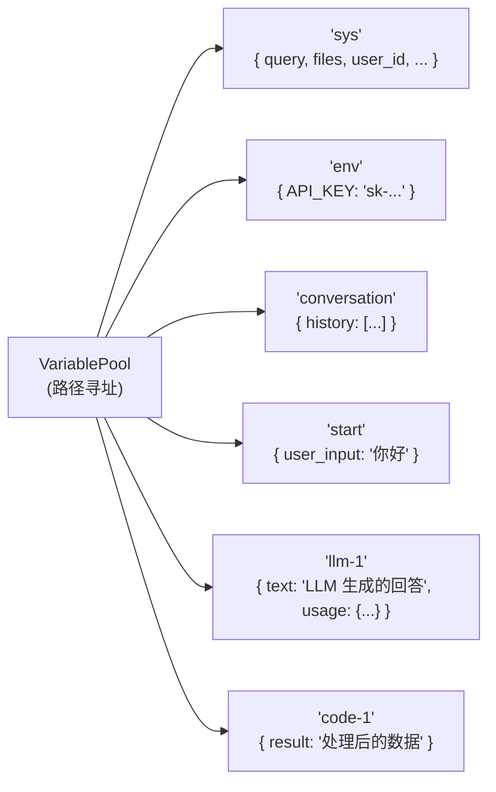

系统变量位于 `sys.*` 命名空间（`SYSTEM_VARIABLE_NODE_ID = "sys"`），环境变量位于 `env.*`（`ENVIRONMENT_VARIABLE_NODE_ID = "env"`），对话变量位于 `conversation.*`（api/core/workflow/variable_prefixes.py:1-4）。

**为什么用路径寻址而不是全局变量名？** 两个核心问题被解决：

1. **命名冲突**——多节点可能输出同名变量（十个 LLM 节点都输出 `text`），路径 `(node_id, key)` 天然消歧。
2. **追溯困难**——下游节点读取 `["llm-1", "text"]` 时，路径本身就包含了来源节点的 ID，语义清晰，UI 上可以直接高亮"这个变量来自哪个节点"。

### 变量注入的五个来源

变量池在生命周期 ③ 阶段被初始化，数据来自五个来源：

| 来源 | 注入函数 | 命名空间 |
|------|---------|---------|
| 系统变量 | `build_system_variables()` → `build_bootstrap_variables()` | `sys.*` |
| 环境变量 | `build_bootstrap_variables(environment_variables=...)` | `env.*` |
| 对话变量 | `build_bootstrap_variables(conversation_variables=...)` | `conversation.*` |
| 启动节点输入 | `add_node_inputs_to_pool(variable_pool, node_id=root_node_id, inputs=...)` | `start.*`（或 trigger 节点 ID） |
| 节点输出 | 节点 `_run()` 完成后引擎自动 `variable_pool.add([node_id, key], value)` | 各节点 ID |

系统变量的键由 `SystemVariableKey` 枚举定义（api/core/workflow/system_variables.py:22-39）：

```python
class SystemVariableKey(StrEnum):
    QUERY = "query"
    FILES = "files"
    CONVERSATION_ID = "conversation_id"
    USER_ID = "user_id"
    DIALOGUE_COUNT = "dialogue_count"
    APP_ID = "app_id"
    WORKFLOW_ID = "workflow_id"
    WORKFLOW_EXECUTION_ID = "workflow_run_id"
    TIMESTAMP = "timestamp"
    # ... 还有 RAG / datasource 相关的键
```

`build_bootstrap_variables`（system_variables.py:109-137）把系统变量、环境变量、对话变量统一打上对应的 selector 前缀，再批量塞进 VariablePool。

### 子图变量继承

当工作流嵌套子工作流（Loop 节点、Iteration 节点）时，子图引擎通过 `_WorkflowChildEngineBuilder.build_child_engine`（api/core/workflow/workflow_entry.py:90-132）构建：

```python
# workflow_entry.py:100-104 关键：variable_pool 可显式传入
child_graph_runtime_state = GraphRuntimeState(
    variable_pool=variable_pool if variable_pool is not None else parent_graph_runtime_state.variable_pool,
    start_at=time.perf_counter(),
    execution_context=parent_graph_runtime_state.execution_context,
)
```

> **设计要点**：子图**默认共享父图 variable_pool**（读共享），通过显式传入独立的 `variable_pool` 参数实现写隔离。这是一种 copy-on-write 语义——Loop 的每轮迭代如果不传独立 pool，就在共享 pool 上写；如果要隔离每轮迭代的中间变量，调用方传入新 pool。这种设计让"父子图数据共享"和"迭代间数据隔离"用同一个参数控制，不需要两套机制。

## 四、引擎装配：GraphEngine 与 Layer 叠加

**这一节为什么存在**：GraphEngine 是图执行的"骨架"，Layer 是叠加在骨架上的"横切关注点"。理解引擎装配阶段——哪些 Layer 被注册、注册顺序为什么重要——才能理解后续节点执行时配额检查、超时保护、可观测性、持久化是如何被织入的。

### WorkflowEntry 的职责

`WorkflowEntry`（api/core/workflow/workflow_entry.py:155）是 Dify 层对 Graphon 引擎的封装。它的构造函数做四件事：

```python
# workflow_entry.py:188-213 核心构造逻辑
# 1. 嵌套调用深度检查
if call_depth > workflow_call_max_depth:
    raise ValueError(f"Max workflow call depth {workflow_call_max_depth} reached.")

# 2. 命令通道（默认 InMemoryChannel，运行时被 RedisChannel 覆盖）
if command_channel is None:
    command_channel = InMemoryChannel()

# 3. 捕获 Flask 上下文（用于子线程传递）
execution_context = capture_current_context()
graph_runtime_state.execution_context = execution_context

# 4. 构建 GraphEngine + Worker Pool 配置
self.graph_engine = GraphEngine(
    workflow_id=workflow_id, graph=graph, graph_runtime_state=graph_runtime_state,
    command_channel=command_channel,
    config=GraphEngineConfig(
        min_workers=dify_config.GRAPH_ENGINE_MIN_WORKERS,
        max_workers=dify_config.GRAPH_ENGINE_MAX_WORKERS,
        scale_up_threshold=dify_config.GRAPH_ENGINE_SCALE_UP_THRESHOLD,
        scale_down_idle_time=dify_config.GRAPH_ENGINE_SCALE_DOWN_IDLE_TIME,
    ),
    child_engine_builder=self._child_engine_builder,
)
```

`GraphEngineConfig` 控制 Worker Pool 的动态伸缩——`min_workers` / `max_workers` 设定线程池上下限，`scale_up_threshold` 是扩容阈值，`scale_down_idle_time` 是空闲多久后缩容。独立节点（入度为 0 且无依赖）会被并行调度到 Worker Pool，这是 DAG 并行执行的物理基础。

### Layer 注册顺序

Layer 的注册分两阶段——`WorkflowEntry.__init__` 注册引擎级 Layer，`WorkflowAppRunner.run` 追加业务级 Layer：

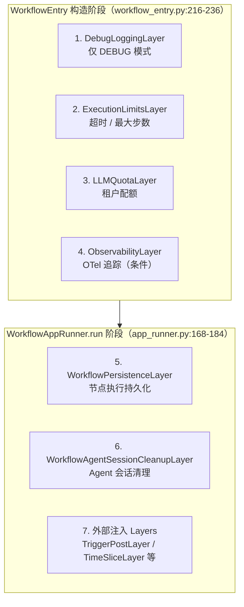

**注册顺序为什么重要？** Layer 的钩子按注册顺序依次调用。`DebugLoggingLayer` 必须最先注册——这样后续所有 Layer 的行为都会被日志记录。`ExecutionLimitsLayer` 要在 `LLMQuotaLayer` 之前——超时检查应先于配额检查，避免"配额扣了但超时了"的不一致。`WorkflowPersistenceLayer` 在 Runner 阶段才追加——因为它依赖 `application_generate_entity` 和仓库实例，这些在 `WorkflowEntry` 构造时还未完全准备好。

### Layer 模式 vs AOP

Graphon 引擎通过**装饰器模式的变体**——图层模式，为所有节点执行添加横切关注点。每个 Layer 实现 `GraphEngineLayer` 接口（来自 `graphon.graph_engine.layers`），钩子包括：

```python
class GraphEngineLayer:
    def on_graph_start(self) -> None: ...
    def on_event(self, event: GraphEngineEvent) -> None: ...
    def on_node_run_start(self, node: Node) -> None: ...
    def on_node_run_end(self, node: Node, error: Exception | None, 
                        result_event: GraphNodeEventBase | None = None) -> None: ...
    def on_graph_end(self, error: Exception | None) -> None: ...
```

**Layer 模式 vs AOP（面向切面编程）的区别**：AOP 通常用 pointcut 表达式织入逻辑，切点语法对开发者不直观——读代码看不到"这个方法被哪些切面包了"。Layer 模式让横切关注点**显式化**——开发者读 `WorkflowEntry.__init__` 就能看到"这个引擎注册了哪几个 Layer"，在 IDE 里可以点进去看实现。代价是新能力需要在引擎代码里追加一句 `engine.layer(XxxLayer())`，但好处是可观测性高，新人第一天就能理清引擎行为。

### 事件流过滤

Graphon 0.5.0 发出的是**原始变量流块**，Dify 通过 `ResponseStreamFilter` 转换为客户端期望的响应顺序（api/core/workflow/workflow_entry.py:49-61）：

```python
def iter_dify_graph_engine_events(engine: GraphEngine) -> Generator[GraphEngineEvent, None, None]:
    yield from filter_graph_events(
        engine.run(),
        context=GraphEventFilterContext.from_engine(engine),
        filters=[ResponseStreamFilter()],
    )
```

`WorkflowEntry.run()`（workflow_entry.py:238-250）在 `try` 块中调用此过滤器，`GenerateTaskStoppedError` 被静默捕获（用户停止），其他异常转为 `GraphRunFailedEvent`。

## 五、DAG 调度与节点执行

**这一节为什么存在**：这是工作流引擎的心脏——GraphEngine 按拓扑序遍历 DAG，每个节点的执行被 Layer 钩子包裹，节点输出写回 VariablePool 供下游读取。理解这一节才能解释"为什么独立节点能并行""为什么条件分支能跳过整条路径"。

### 拓扑排序与并行执行

GraphEngine 自动执行拓扑排序，入度为 0 的节点（无前置依赖）会被并行调度到 Worker Pool：

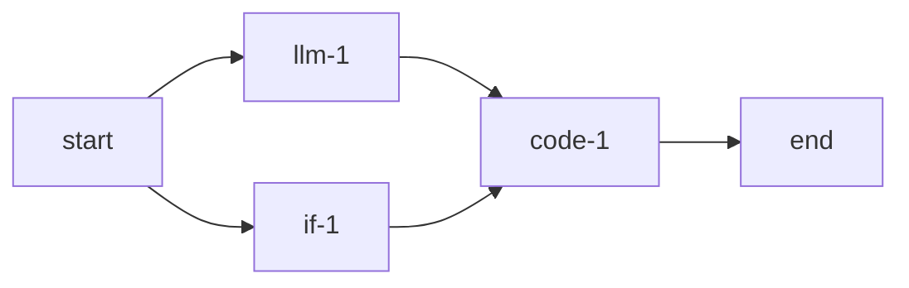

上图的工作流，拓扑排序结果是：`start`（入度=0）→ `llm-1` 和 `if-1`（并行，入度=1 且 start 完成）→ `code-1`（入度=2，两个前置都完成）→ `end`。Worker Pool 在 `[min_workers, max_workers]` 区间动态伸缩，独立节点被分配到不同 worker 并行执行。

### 节点执行的 Layer 包裹

每个节点的执行周期被 Layer 钩子完整包裹：

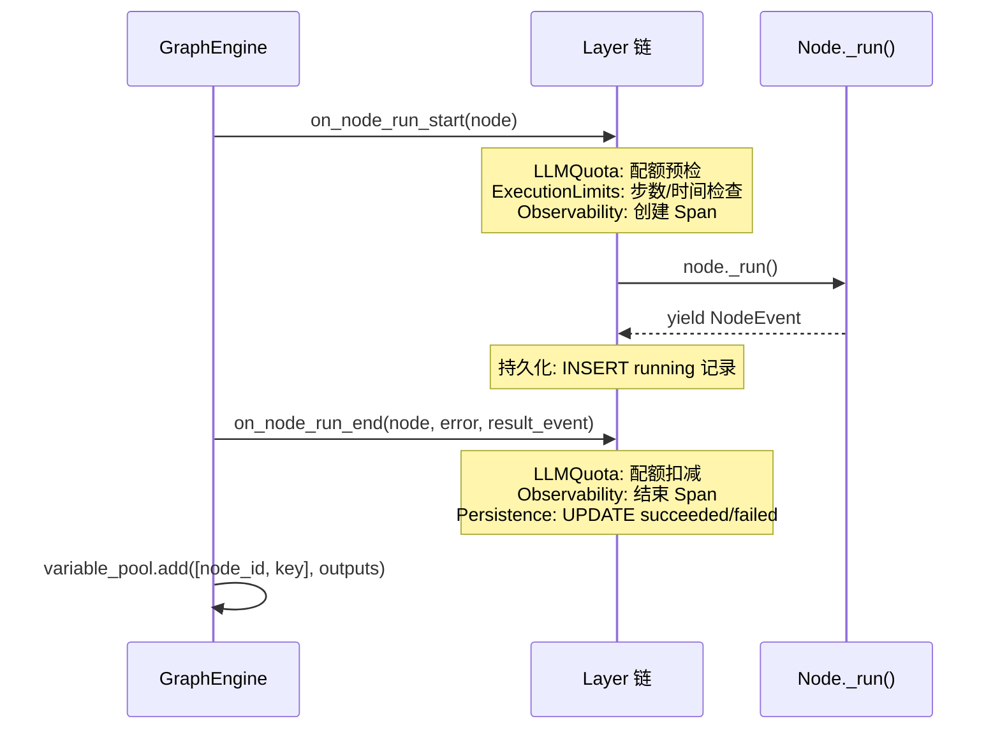

### Layer 详解

#### DebugLoggingLayer（来自 graphon）

仅 `dify_config.DEBUG` 时注册（workflow_entry.py:216-225），记录节点输入、输出、执行时间。`include_process_data=False` 避免 process_data 过于冗长。

#### ExecutionLimitsLayer（来自 graphon）

注册时传入两个限制（workflow_entry.py:228-231）：

```python
limits_layer = ExecutionLimitsLayer(
    max_steps=dify_config.WORKFLOW_MAX_EXECUTION_STEPS,
    max_time=dify_config.WORKFLOW_MAX_EXECUTION_TIME,
)
```

在每个节点执行边界检查累计步数和已耗时间，超限则中止图执行。这是防止"无限循环节点"和"长时间占用 Worker"的第一层保护。

#### LLMQuotaLayer（api/core/app/workflow/layers/llm_quota.py）

租户级 LLM token 配额控制，只作用于三类节点（llm_quota.py:27-33）：

```python
_QUOTA_NODE_TYPES = frozenset([
    BuiltinNodeTypes.LLM,
    BuiltinNodeTypes.PARAMETER_EXTRACTOR,
    BuiltinNodeTypes.QUESTION_CLASSIFIER,
])
```

- **`on_node_run_start`**（llm_quota.py:61）：从节点配置提取 `provider` + `model_name`，调 `ensure_llm_quota_available_for_model` 预检。配额不足时，**替换节点的 `_run` 方法**为一个返回 `FAILED` 状态的函数（llm_quota.py:123-137），并发送 `AbortCommand` 中止图执行。这是一个精巧的设计——不抛异常，而是"偷换"节点的执行逻辑，让图正常走完失败路径。
- **`on_node_run_end`**（llm_quota.py:87）：节点成功后从 `result_event` 提取 `llm_usage`，调 `deduct_llm_quota_for_model` 扣减配额。

#### ObservabilityLayer（api/core/app/workflow/layers/observability.py）

创建 OpenTelemetry Span，建立节点级追踪（observability.py:42）：

- **`on_node_run_start`**（observability.py:91）：`tracer.start_span(node.title)`，`context_api.attach(set_span_in_context(span))` 把 Span 设为当前上下文——这样节点内部自动埋点（HTTP 请求、DB 查询）会自动关联到这个 Span。
- **`on_node_run_end`**（observability.py:124）：按节点类型选 parser（LLM / Tool / KnowledgeRetrieval / Default）解析属性，`span.end()` 结束，`context_api.detach(token)` 恢复上下文。

> OTel 的完整数据字典和集成方式详见 [14-observability.md](./dify-14-observability.md)。

#### WorkflowPersistenceLayer（api/core/app/workflow/layers/persistence.py）

断点恢复的核心，详见 ⑦ 持久化与断点恢复。

#### WorkflowAgentSessionCleanupLayer

在工作流到达终态时清理 Agent 会话快照（api/core/workflow/nodes/agent_v2/session_cleanup_layer.py:31）。监听四个终态事件（session_cleanup_layer.py:69-74）：`GraphRunSucceeded` / `GraphRunPartialSucceeded` / `GraphRunFailed` / `GraphRunAborted`。当前实现只标记本地会话行为 `CLEANED`，不发起 HTTP 清理请求（`_HTTP_CLEANUP_SUPPORTED = False`，session_cleanup_layer.py:67），等 Agent 后端支持 cleanup-only 模式后再开启。

### 节点输出与 VariablePool 写回

节点执行完成后，输出通过 `NodeRunResult` 封装，GraphEngine 自动把 `outputs` 写回 VariablePool：

```python
# NodeRunResult 核心字段
class NodeRunResult:
    outputs: dict                    # 写入 VariablePool 的 [node_id, key]
    metadata: dict                   # 元数据（如 token 消耗）
    edge_source_handle: str | None   # 连接到哪条边（影响后续路由）
    status: RunStatus                # SUCCEEDED / FAILED
    error: str | None
    inputs: dict | None
```

`edge_source_handle` 是条件分支的关键——If/Else 节点执行后，通过设置 `edge_source_handle` 为 `"true"` 或 `"false"`，告诉 GraphEngine 只激活对应的输出边。

## 六、条件分支与循环

**这一节为什么存在**：DAG 的"有向"保证了执行顺序，但真实业务需要"条件跳过"和"重复执行"。这两种控制流不能靠"运行时 if 判断"——那样不执行的节点还是会被调度。Graphon 的解法是"边激活/禁用"和"子图引擎"，这一节解释它们如何工作。

### 条件分支（If/Else）

If/Else 节点根据条件表达式决定执行路径：

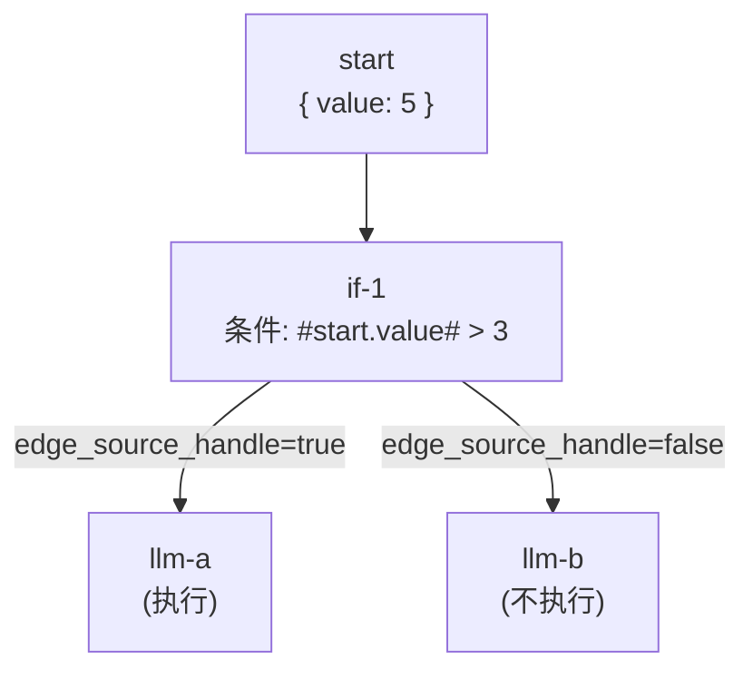

**实现原理**：

1. If/Else 节点从 VariablePool 读取条件变量（如 `["start", "value"]`）
2. 执行条件表达式（如 `{{#start.value#}} > 3`）
3. 根据结果，在 `NodeRunResult.edge_source_handle` 中设置 `"true"` 或 `"false"`
4. GraphEngine 只激活 `sourceHandle` 匹配的输出边
5. **未激活分支的节点不进入调度队列**——它们根本不会被创建为 worker 任务

> **设计要点**：通过**边激活/禁用**实现条件分支，比运行时 if 判断更高效——下游节点根本不进入调度队列，不消耗 Worker Pool 资源，也不触发 Layer 钩子。这是一种"调度层短路"：条件判断的结果直接作用于图的拓扑遍历，而不是在节点执行内部做 if/else。

### 循环执行（Loop）

Loop 节点通过**子图引擎**实现迭代——每轮迭代都构建一个独立的子图引擎执行循环体：

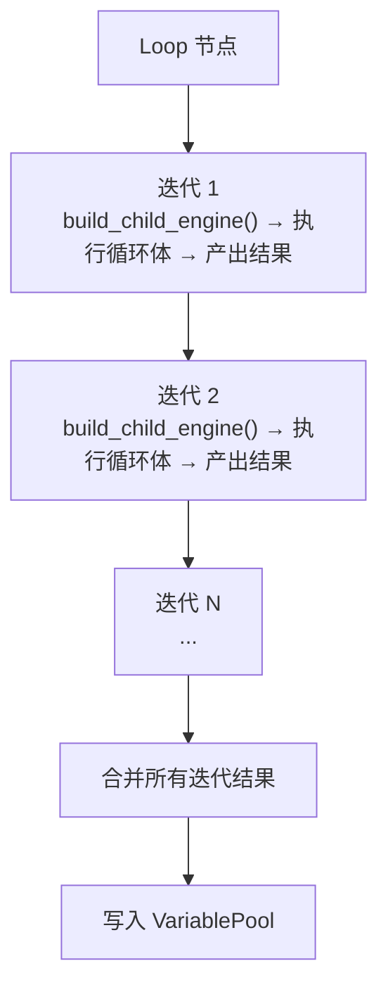

`_WorkflowChildEngineBuilder.build_child_engine`（workflow_entry.py:90-132）每轮迭代创建独立子图：

```python
# workflow_entry.py:121-131 子图引擎与父图的三个关键差异
command_channel = InMemoryChannel()          # ① 子图用内存通道（不需外部控制）
config = GraphEngineConfig()                 # ② 子图用默认配置（不继承父图 Worker Pool）
child_engine = GraphEngine(..., child_engine_builder=self)
child_engine.layer(LLMQuotaLayer(tenant_id=self.tenant_id))  # ③ 只注册配额层
```

> **三个关键差异**：
> - **`InMemoryChannel`**：子图不需要外部控制（停止/恢复），因为停止信号由父图的命令通道统一管理——父图停止时，子图的 Loop 节点 generator 会被 close，子图引擎自然感知。
> - **默认 `GraphEngineConfig`**：子图不继承父图的 Worker Pool 配置，因为子图的并发需求通常远小于父图（循环体内节点数有限）。
> - **只注册 `LLMQuotaLayer`**：子图不重复注册持久化、可观测性等 Layer——这些由父图的 Layer 统一处理（子图节点的事件会冒泡到父图的 Layer 钩子）。但配额必须独立检查，否则子图的 LLM 调用会绕过租户配额限制。

### Trigger 节点作为工作流入口

上面的所有示例都以 `start` 节点为入口，但工作流也可以用 `trigger-plugin` 节点作为入口（Webhook/Schedule/Plugin Event）。此时 `get_default_root_node_id()`（node_factory.py:148-175）会返回 trigger 节点而非 start 节点——因为它扫描所有 `is_start_node_type` 的节点，而 `_START_NODE_TYPES` 包含 `BuiltinNodeTypes.START`、`BuiltinNodeTypes.DATASOURCE` 和 `TRIGGER_NODE_TYPES`（node_factory.py:72-74）。详见 [15-trigger-system.md](./dify-15-trigger-system.md) §6.2。

## 七、持久化与断点恢复

**这一节为什么存在**：长流程工作流（ETL、审批、批量处理）不能因为服务重启或用户暂停就从头跑。Dify 的持久化层在每个节点边界落库执行记录，暂停时序列化完整运行时状态，恢复时反序列化重建——这一节解释这条"中断 → 记录 → 恢复 → 继续"的完整链路。

### WorkflowPersistenceLayer 的事件驱动落库

`WorkflowPersistenceLayer`（api/core/app/workflow/layers/persistence.py:80）不直接实现 `on_node_run_start` / `on_node_run_end`，而是通过统一的 `on_event` 钩子处理所有事件类型（persistence.py:115-141）：

```python
@override
def on_event(self, event: GraphEngineEvent) -> None:
    match event:
        case GraphRunStartedEvent():
            self._handle_graph_run_started()           # 创建 WorkflowExecution
        case GraphRunSucceededEvent():
            self._handle_graph_run_succeeded(event)     # 更新为 SUCCEEDED
        case GraphRunFailedEvent():
            self._handle_graph_run_failed(event)        # 更新为 FAILED
        case GraphRunAbortedEvent():
            self._handle_graph_run_aborted(event)       # 更新为 STOPPED
        case GraphRunPausedEvent():
            self._handle_graph_run_paused(event)        # 更新为 PAUSED
        case NodeRunStartedEvent():
            self._handle_node_started(event)            # INSERT running 记录
        case NodeRunSucceededEvent():
            self._handle_node_succeeded(event)          # UPDATE succeeded
        case NodeRunFailedEvent():
            self._handle_node_failed(event)             # UPDATE failed
        case NodeRunExceptionEvent():
            self._handle_node_exception(event)          # UPDATE exception
        case NodeRunRetryEvent():
            self._handle_node_retry(event)              # UPDATE retry
        case NodeRunPauseRequestedEvent():
            self._handle_node_pause_requested(event)    # UPDATE paused
```

节点执行的落库时序：

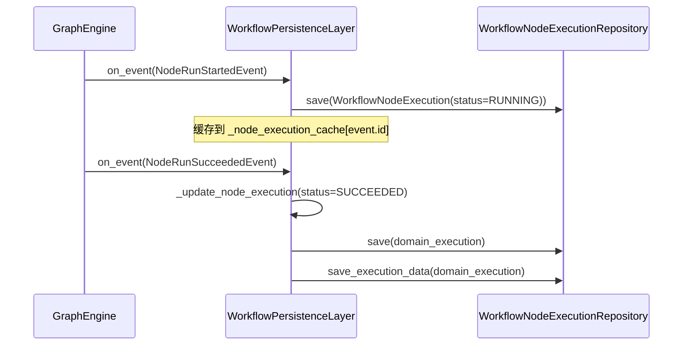

节点开始时 `INSERT` 一条 `RUNNING` 记录（persistence.py:219-254），结束时 `UPDATE` 为 `SUCCEEDED` / `FAILED` / `EXCEPTION`（persistence.py:368-402）。这种"先占位、后回填"的模式与 Agent 的 `MessageAgentThought` 落库策略一致（详见 [05-agent-context.md](./dify-05-agent-context.md)）——即使中途崩溃，已有占位记录可查。

图级别的终态处理还会调用 `_fail_running_node_executions`（persistence.py:404-412）：图失败时把所有还在 `RUNNING` 状态的节点执行记录标记为 `FAILED`，避免"图挂了但节点记录还显示 running"的不一致。

### 暂停与恢复机制

```mermaid
flowchart TD
    subgraph Pause["暂停流程"]
        P1["Human Input 节点请求暂停<br/>NodeRunPauseRequestedEvent"]
        P2["GraphRunPausedEvent<br/>GraphEngine 暂停调度"]
        P3["PauseStatePersistenceLayer<br/>序列化 graph_runtime_state"]
        P4["WorkflowResumptionContext<br/>generate_entity + serialized_state"]
        P1 --> P2 --> P3 --> P4
    end
    P4 --> subgraph Resume["恢复流程"]
        R1["resume_workflow_execution<br/>Celery 任务"]
        R2["GraphRuntimeState.from_snapshot<br/>反序列化恢复状态"]
        R3["WorkflowAppGenerator.resume<br/>传入 graph_runtime_state"]
        R4["WorkflowAppRunner.run<br/>resume_state is not None → 恢复模式"]
        R1 --> R2 --> R3 --> R4
    end
```

`WorkflowResumptionContext`（api/core/app/layers/pause_state_persist_layer.py:36-53）是恢复的完整上下文：

```python
class WorkflowResumptionContext(BaseModel):
    version: Literal["1"] = "1"
    generate_entity: _GenerateEntityUnion    # 完整的生成请求实体
    serialized_graph_runtime_state: str       # 序列化的运行时状态
```

恢复通过 `WorkflowAppGenerator.resume`（app_generator.py:270-313）入口，它把 `graph_runtime_state` 传给 `_generate`，后者传给 `WorkflowAppRunner`，`run()` 检测到 `resume_state is not None` 后走恢复分支——**复用传入的 variable_pool 和 graph_runtime_state**，从 `root_node_id` 继续。

Celery 端的恢复任务是 `resume_workflow_execution`（api/tasks/async_workflow_tasks.py:203），它从数据库读取 pause 状态，反序列化 `GraphRuntimeState.from_snapshot`（async_workflow_tasks.py:234），调用 `generator.resume`。

### 三层保护

| 限制类型 | 配置项 | 检查位置 | 触发时机 |
|----------|--------|---------|---------|
| 最大步数 | `WORKFLOW_MAX_EXECUTION_STEPS` | `ExecutionLimitsLayer` | 防止无限循环节点 |
| 最大时间 | `WORKFLOW_MAX_EXECUTION_TIME` | `ExecutionLimitsLayer` | 防止长时间占用 Worker |
| 调用深度 | `WORKFLOW_CALL_MAX_DEPTH` | `WorkflowEntry.__init__` | 防止工作流无限嵌套 |

调用深度检查在 `WorkflowEntry` 构造函数最前面（workflow_entry.py:189-191）：

```python
workflow_call_max_depth = dify_config.WORKFLOW_CALL_MAX_DEPTH
if call_depth > workflow_call_max_depth:
    raise ValueError(f"Max workflow call depth {workflow_call_max_depth} reached.")
```

这是防止"工作流 A 调用工作流 B，B 又调用 A"的递归死循环——每次嵌套调用 `call_depth + 1`，超过阈值直接拒绝。

### 外部控制：CommandChannel

`RedisChannel(redis_client, f"workflow:{task_id}:commands")`（app_runner.py:147-149）提供**外部控制能力**：

- 前端通过 WebSocket 发送"停止"消息
- 消息写入 Redis 的 `workflow:{task_id}:commands` 键
- GraphEngine 在每次节点边界检查通道，收到 `AbortCommand` 时中断执行
- 中断后 `WorkflowPersistenceLayer` 把图状态标记为 `STOPPED`

`InMemoryChannel` 用于子图引擎和默认场景——子图不需要外部控制，因为停止信号通过父图的 generator close 机制传递。

## 八、事件消费与执行路径

**这一节为什么存在**：后台线程产出的 GraphEngine 事件最终要变成前端的 SSE 流或 blocking 响应。这一阶段是"生产-消费"的消费者侧，理解它才能解释同步和异步执行路径的差异。

### 事件映射：GraphEvent → QueueEvent

`WorkflowBasedAppRunner._handle_event`（api/core/app/apps/workflow_app_runner.py:405）是一个大型 `match/case`，把 Graphon 的图事件和节点事件映射为 Dify 的队列事件：

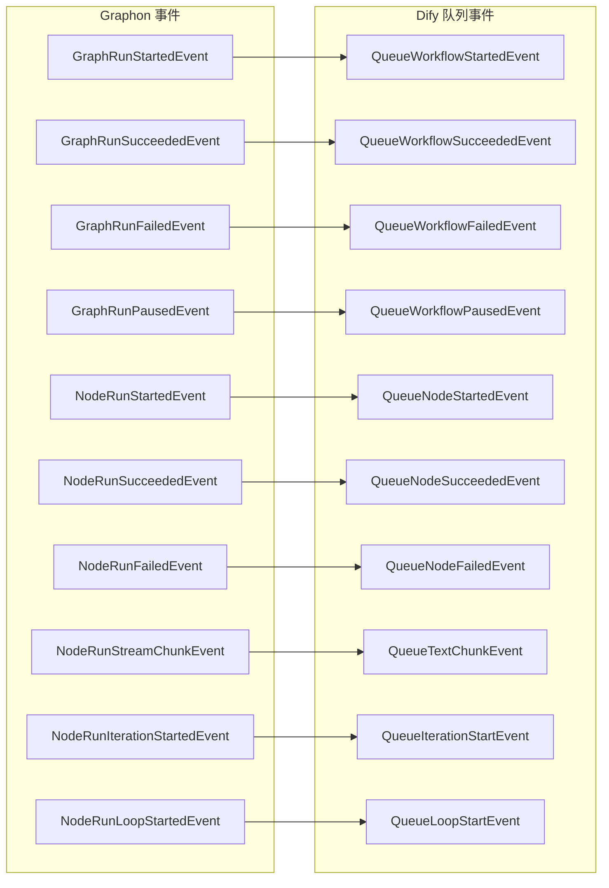

`WorkflowAppQueueManager`（api/core/app/apps/workflow/app_queue_manager.py:17）在 `_publish` 中检查事件类型——收到终态事件（`QueueStopEvent` / `QueueErrorEvent` / `QueueMessageEndEvent` / `QueueWorkflowSucceededEvent` / `QueueWorkflowFailedEvent` / `QueueWorkflowPartialSuccessEvent`）时自动 `stop_listen()`（app_queue_manager.py:35-44），让前台 Pipeline 结束消费。

> 事件类型体系、WebSocket/SSE 推送路径、心跳重连详见 [06-async-tasks-and-events.md](./dify-06-async-tasks-and-events.md)。

### 同步执行路径

简单工作流（在 API 进程内直接执行）：

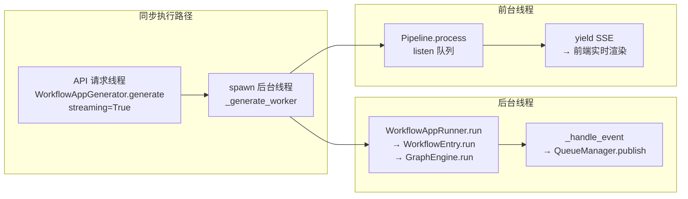

优势：低延迟，适合短工作流和调试。限制：后台线程仍占用 API 进程资源，受 Gunicorn Worker 数量限制。

### 异步执行路径

复杂工作流通过 Celery 异步执行，按订阅层级路由到不同队列（api/services/async_workflow_service.py:36）：

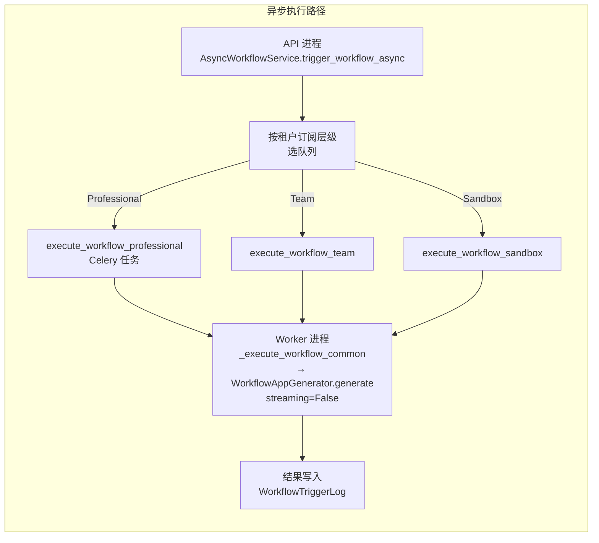

异步路径的 Celery 任务在 api/tasks/async_workflow_tasks.py 中定义：

- `execute_workflow_professional`（async_workflow_tasks.py:53）：`queue=AsyncWorkflowQueue.PROFESSIONAL_QUEUE`
- `execute_workflow_team`（async_workflow_tasks.py:69）：`queue=AsyncWorkflowQueue.TEAM_QUEUE`
- `execute_workflow_sandbox`（async_workflow_tasks.py:85）：`queue=AsyncWorkflowQueue.SANDBOX_QUEUE`

三者都调用 `_execute_workflow_common`（async_workflow_tasks.py:110），内部用 `WorkflowAppGenerator().generate(streaming=False, ...)` 以 blocking 模式执行，并注入 `TriggerPostLayer`（触发器后处理）和可选的 `TimeSliceLayer`（时间片调度）。

异步路径支持：长时间运行的工作流（不被 HTTP 超时影响）、后台批量处理、等待/暂停节点恢复。代价是延迟略高（Celery 调度开销），且不支持流式输出——`streaming=False` 意味着结果是一次性返回。

## 收敛

### 边界：Workflow vs Agent

Workflow 和 Agent 不是"哪个更好"，而是解决不同问题的两类应用模式：

| 维度 | Workflow | Agent |
|------|----------|-------|
| 控制者 | 开发者显式定义（白盒） | LLM 自主决策（黑盒） |
| 节点调度 | 预定义拓扑（GraphEngine DAG 调度） | 动态生成（推理循环） |
| 工具调用 | 节点边显式调用 | `ToolEngine.agent_invoke` 在循环内 |
| 适用场景 | 固定流程、业务自动化 | 开放问题、对话 |
| 可控性 | 高 | 低 |
| 可恢复 | 是（断点恢复） | 否（推理循环不可续跑） |

**不该在这里做的事**：用 Workflow 处理开放对话（缺乏推理灵活性）、用 Agent 跑固定流程（不可重复、难调试）。很多生产场景组合使用——Workflow 里嵌 Agent 节点处理需推理的子任务，Agent V2 已迁移到 Graphon 引擎作为工作流的一类节点。详见 [03-agent-runtime.md](./dify-03-agent-runtime.md) §收敛。

### 扩展点：自定义节点

开发自定义工作流节点的"最少侵入面"是：

1. 继承 `Node[YourNodeData]`（`from graphon.nodes.base.node import Node`）
2. 定义 `_node_type` 和 `_node_type_latest` 类属性
3. 实现 `_run()` 方法，返回 `Generator[NodeEvent, None, None]`
4. 将节点类放在 `api/core/workflow/nodes/` 目录下，`register_nodes()` 会自动发现

节点类通过 `variable_pool.get(["node_id", "key"])` 读输入，通过 `yield NodeSucceededEvent(outputs={...})` 产出输出（GraphEngine 自动把 outputs 写回 VariablePool）。开发详见 [16-practice-and-deployment.md](./dify-16-practice-and-deployment.md)。

### 本章要点

1. **Graphon 是独立 pip 包（v0.5.3）**：Dify 在 `api/core/workflow/` 构建集成层，`WorkflowEntry` 封装 GraphEngine 并注册 Layer 链。
2. **三种执行模式在入口分流**：正常（从零构建 VariablePool）/ 恢复（复用 graph_runtime_state 快照）/ 单节点调试（过滤子图 + skip_validation）。
3. **VariablePool 路径寻址是数据总线**：`(node_id, variable_key)` 消除命名冲突和追溯困难；子图默认共享父图 pool，显式传入实现写隔离。
4. **Layer 叠加横切关注点**：Debug → Limits → Quota → OTel → Persistence → SessionCleanup，注册顺序决定钩子调用顺序，不侵入节点业务逻辑。
5. **条件分支靠边激活**：If/Else 通过 `edge_source_handle` 在调度层直接跳过未激活分支，不消耗 Worker 资源。
6. **循环靠子图引擎**：Loop 每轮迭代用 `_WorkflowChildEngineBuilder` 建独立子图（InMemoryChannel + 默认配置 + 仅 Quota Layer）。
7. **持久化是事件驱动的**：`WorkflowPersistenceLayer.on_event` 在节点开始时 INSERT running、结束时 UPDATE succeeded/failed；暂停时 `PauseStatePersistenceLayer` 序列化完整状态，恢复时 Celery 任务反序列化重建。
8. **三层保护**：最大步数 / 最大时间（ExecutionLimitsLayer）+ 调用深度（WorkflowEntry 构造检查）。
9. **双执行路径**：同步走后台线程 + SSE 流（streaming=True），异步走 Celery 按订阅层级路由（streaming=False，blocking 返回）。

### 推荐源码入口

| 文件 | 职责 |
|------|------|
| api/core/app/apps/workflow/app_generator.py | 入口：构造 GenerateEntity、起后台线程、返回 SSE / blocking |
| api/core/app/apps/workflow/app_runner.py | 三种模式分流、Redis 命令通道、Layer 追加注册 |
| api/core/app/apps/workflow_app_runner.py | `_init_graph`、`_prepare_single_node_execution`、`_handle_event` 事件映射 |
| api/core/workflow/workflow_entry.py | Graphon 引擎封装、Layer 注册、子图引擎构建器 |
| api/core/workflow/node_factory.py | 节点自动发现、版本化解析、Dify 上下文注入 |
| api/core/workflow/system_variables.py | 系统变量定义、bootstrap 变量构建 |
| api/core/workflow/variable_pool_initializer.py | 变量池初始化（系统/环境/节点输入） |
| api/core/workflow/variable_prefixes.py | 命名空间常量（sys / env / conversation / rag） |
| api/core/app/workflow/layers/persistence.py | 持久化层：节点/图执行记录落库 |
| api/core/app/workflow/layers/observability.py | OTel 追踪层：节点级 Span |
| api/core/app/workflow/layers/llm_quota.py | LLM 配额层：预检 + 扣减 |
| api/core/workflow/nodes/agent_v2/session_cleanup_layer.py | Agent 会话清理层 |
| api/core/app/layers/pause_state_persist_layer.py | 暂停状态序列化 / 恢复上下文 |
| api/services/async_workflow_service.py | 异步工作流调度（按订阅层级路由） |
| api/tasks/async_workflow_tasks.py | Celery 任务：执行 + 恢复 |
| api/core/app/apps/workflow/app_queue_manager.py | 队列管理器（终态事件自动 stop_listen） |
| api/models/workflow.py | Workflow 数据模型（graph_dict 属性） |

> Graphon 引擎核心（Graph、GraphEngine、GraphRuntimeState、VariablePool、Node 基类、BuiltinNodeTypes）来自 `graphon` pip 包（`graphon==0.5.3`，api/pyproject.toml:47），不在本仓库源码中。通过 `from graphon.graph import Graph`、`from graphon.graph_engine import GraphEngine` 等路径引用。

---

## 附录

### A. 节点类型体系

#### 内置节点类型（来自 graphon 包）

| 节点类型 | 说明 | 导入路径 |
|----------|------|---------|
| `start` | 工作流入口 | `graphon.nodes.start` |
| `end` | 工作流出口 | `graphon.nodes.end` |
| `llm` | LLM 调用 | `graphon.nodes.llm` |
| `code` | Python/JS 代码执行 | `graphon.nodes.code` |
| `http-request` | HTTP 请求 | `graphon.nodes.http_request` |
| `if-else` | 条件分支 | `graphon.nodes.if_else` |
| `loop` | 循环 | `graphon.nodes.loop` |
| `iteration` | 迭代（数组遍历） | `graphon.nodes.iteration` |
| `parameter-extractor` | 参数提取 | `graphon.nodes.parameter_extractor` |
| `question-classifier` | 问题分类 | `graphon.nodes.question_classifier` |
| `knowledge-retrieval` | 知识检索 | `graphon.nodes.knowledge_retrieval` |
| `template-transform` | 模板转换 | `graphon.nodes.template_transform` |
| `human-input` | 人工介入 | `graphon.nodes.human_input` |
| `document-extractor` | 文档提取 | `graphon.nodes.document_extractor` |
| `tool` | 工具调用 | `graphon.nodes.tool` |
| `agent` | Agent 节点 | `graphon.nodes.agent` |

#### Dify 扩展节点（位于 `api/core/workflow/nodes/`）

```
api/core/workflow/nodes/
├── agent/                # Agent 节点（旧版，ReAct）
├── agent_v2/             # Agent V2 节点（基于 Agent Backend）
├── datasource/           # 数据源触发节点
├── knowledge_index/      # 知识库索引触发节点
├── knowledge_retrieval/  # 知识检索节点（Dify 扩展）
└── trigger_plugin/       # 插件触发节点
    ├── trigger_schedule/ # 定时触发节点
    └── trigger_webhook/  # Webhook 触发节点
```

### B. Graph Config 结构示例

```json
{
  "nodes": [
    {
      "id": "start",
      "type": "custom",
      "data": { "type": "start", "title": "Start", "version": "1" }
    },
    {
      "id": "llm-1",
      "type": "custom",
      "data": {
        "type": "llm",
        "version": "1",
        "model": { "provider": "openai", "name": "gpt-4o" },
        "prompt_template": [
          { "role": "system", "text": "你是一个助手" },
          { "role": "user", "text": "{{#sys.query#}}" }
        ]
      }
    },
    {
      "id": "if-1",
      "type": "custom",
      "data": { "type": "if-else", "version": "1", "conditions": [...] }
    }
  ],
  "edges": [
    { "source": "start", "target": "llm-1", "sourceHandle": "source", "targetHandle": "target" },
    { "source": "if-1", "target": "llm-a", "sourceHandle": "true", "targetHandle": "target" },
    { "source": "if-1", "target": "llm-b", "sourceHandle": "false", "targetHandle": "target" }
  ]
}
```

`sourceHandle` 在条件分支中是关键——If/Else 节点执行后，`NodeRunResult.edge_source_handle` 的值（如 `"true"` / `"false"`）决定哪条边被激活。

### C. 自定义工作流节点示例

```python
from graphon.nodes.base.node import Node
from graphon.entities.base_node_data import BaseNodeData
from graphon.node_events import NodeSucceededEvent
from collections.abc import Generator

class CustomNodeData(BaseNodeData):
    custom_config: str

class CustomNode(Node[CustomNodeData]):
    _node_type = NodeType("custom-node")
    _node_type_latest = NodeType("custom-node")

    def _run(self) -> Generator[NodeEvent, None, None]:
        # 1. 从 VariablePool 读取输入
        user_input = self.graph_runtime_state.variable_pool.get(["start", "user_input"])
        # 2. 执行业务逻辑
        result = do_something(user_input)
        # 3. 产出事件（GraphEngine 自动把 outputs 写回 VariablePool）
        yield NodeSucceededEvent(
            node_id=self.node_id,
            node_type=self.node_type,
            outputs={"result": result},
        )
```

将节点类放在 `api/core/workflow/nodes/` 目录下，`register_nodes()` 会通过 `pkgutil.walk_packages` 自动发现并注册。节点类的 `_node_type` 和 `_node_type_latest` 属性决定它在注册表中的键。

单步调试入口：

```python
# WorkflowEntry.single_step_run（workflow_entry.py:253）
node, generator = WorkflowEntry.single_step_run(
    workflow=workflow,
    node_id="llm-1",
    user_id="xxx",
    user_inputs={"query": "test"},
    variable_pool=variable_pool,
)
for event in generator:
    print(event)
```

### D. 性能调优参考

#### 节点执行时间分解（P50 参考值）

```mermaid
gantt
    title 工作流节点 P50 延迟（参考值）
    dateFormat X
    axisFormat %s ms

    section 轻量节点
    Start/End              :done, 1, 5
    Code (Python)          :code, 5, 30
    Template Transform     :tpl, 5, 20

    section 中等节点
    HTTP Request           :http, 30, 200
    Knowledge Retrieval    :r1, 50, 250
    If/Else                :ife, 5, 10

    section LLM 节点
    LLM (gpt-4o-mini)      :llm1, 500, 2500
    LLM (gpt-4o)           :llm2, 1000, 4000

    section AI Agent 节点
    Agent (简单工具)         :agt, 2500, 8000
    Agent (多工具链)         :agt2, 8000, 20000
```

#### 性能调优 Checklist

- **LLM 节点**：打开 `prompt_cache_key`（OpenAI 支持）；批量相近 prompt
- **HTTP 节点**：用 `timeout` 设置而不是无超时等待；高频端点用连接池
- **知识检索**：HYBRID 检索的 `score_threshold` 适当提高，减少后处理负担
- **If/Else**：能用顺序结构避免 If/Else 嵌套（如条件写在前置 LLM 节点 system 里）
- **Iteration 节点**：避免在迭代体中嵌套 LLM 调用，会导致 O(N) 次 LLM 调用
- **Code 节点**：避免执行耗时函数（如 `requests.get` 到外部服务），改用 HTTP 节点
- **工具节点**：能用并行时用并行（如多知识库 MULTIPLE 检索模式自动并行）

#### 常见性能陷阱

| 陷阱 | 现象 | 解决 |
|------|------|------|
| **Iteration 嵌套 LLM** | 100 行表格每行调一次 LLM = 100x LLM 调用 | 改成批处理 prompt 或 Code 节点预处理 |
| **HTTP 节点不设超时** | 一个端点卡死后整个工作流无限等待 | 设置 `request_timeout` 默认 10s |
| **Knowledge Retrieval 没设 TopK** | top_k=100+ 把所有段都召回了 | 调回 5-10；如需更大用 Rerank 重排序 |
| **Code 节点内 import 慢库** | 每次执行都重新 import numpy/pandas | 改为进程启动时 import 一次，或用 LLM 节点替代 |
| **Workflow 节点过多** | 千级节点的工作流启动慢 | 拆分多个子工作流，用 Iteration 调度 |
| **持久化压力** | 每节点都写库，高 QPS 场景 DB 瓶颈 | 调整 `WorkflowPersistenceLayer` 开启批量写 |

### E. 与 LangGraph 的能力对比

| 能力 | Dify Workflow / Graphon | LangGraph |
|------|------------------------|-----------|
| 可视化编辑器 | 内置 ReactFlow | 无（代码构造图） |
| 30+ 内置节点 | 是 | 否（用户代码实现） |
| 图层模式 | 是（6+ 内置 Layer） | 否 |
| 断点恢复 | 内置（PauseStatePersistenceLayer） | Checkpointer 接口 |
| 异步执行 | Celery 按订阅层级路由 | asyncio |
| 多租户隔离 | 内置（LLMQuotaLayer） | 否 |
| 触发器 | Webhook/Cron/Event | 否 |
| 与 LLM 集成 | 紧密（Agent Node / 配额层） | 通用 |

Dify Workflow 在业务场景的覆盖度上明显优于 LangGraph，但通用灵活性（自定义编排）略差。选择时可按团队需求权衡。

### F. 端到端时序（完整版）

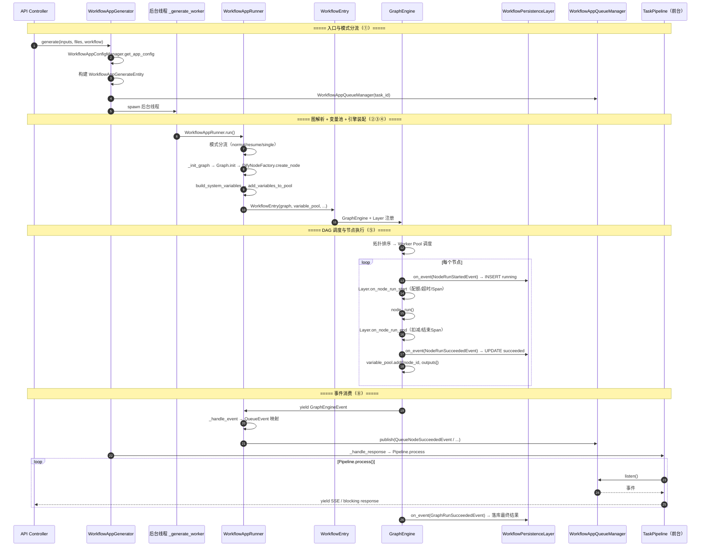

---

> **相关文档**：Agent 运行时与控制流见 [03-agent-runtime.md](./dify-03-agent-runtime.md)；异步任务与事件系统见 [06-async-tasks-and-events.md](./dify-06-async-tasks-and-events.md)；可观测性与 OTel 集成见 [14-observability.md](./dify-14-observability.md)；触发器系统见 [15-trigger-system.md](./dify-15-trigger-system.md)；自定义节点开发与部署见 [16-practice-and-deployment.md](./dify-16-practice-and-deployment.md)；配置层细节见 [02-app-config-layer.md](./dify-02-app-config-layer.md)。
