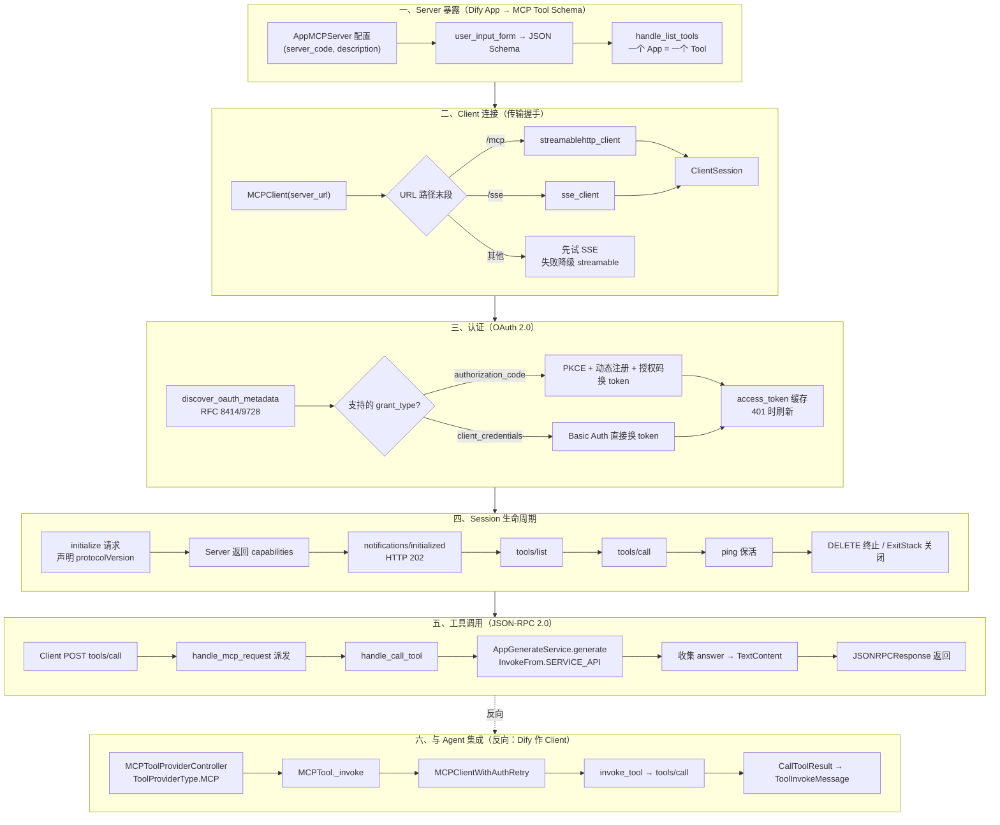
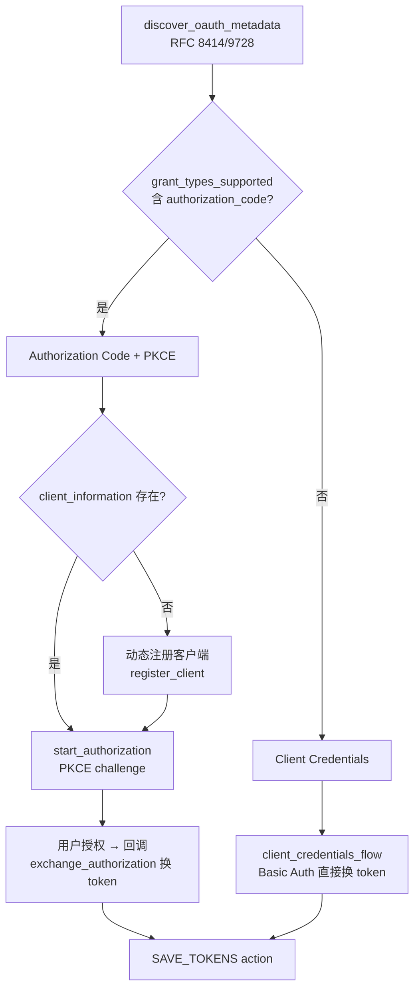
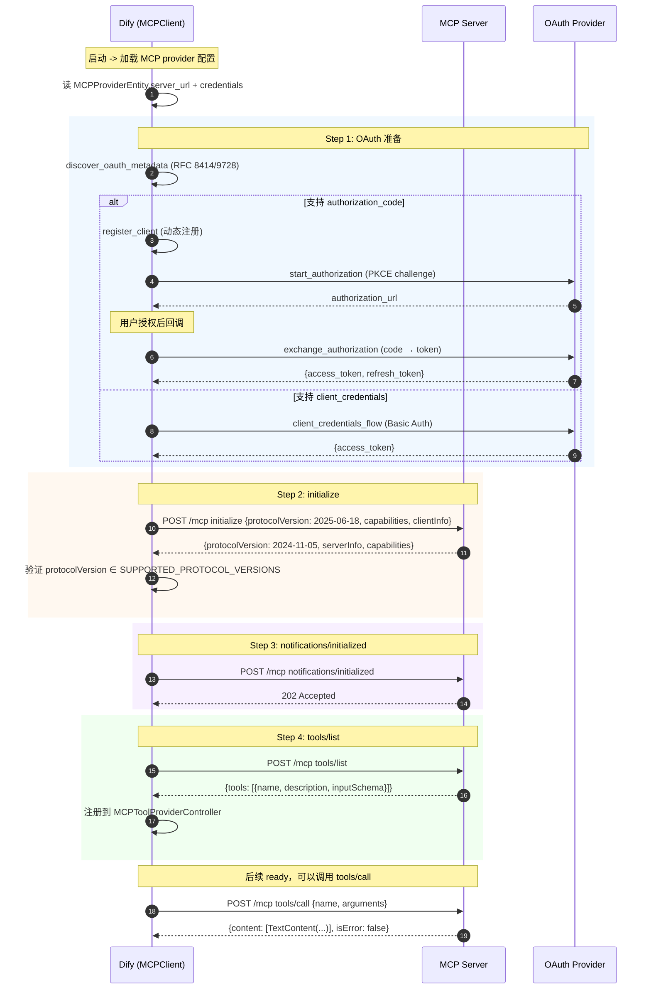

# MCP 协议深度解析

> **学习目标**：理解 Dify 中 Model Context Protocol (MCP) 的完整实现 —— 作为 MCP Server 暴露应用为可远程调用的工具、作为 MCP Client 接入第三方工具、传输协议、OAuth 认证、Session 生命周期。
>
> **读完本章你应该能回答**：
> - MCP（Model Context Protocol）是什么？它在 LLM 应用生态中扮演什么角色？
> - Dify 作为 MCP Server 和 MCP Client 的双重角色，具体怎么实现？
> - 传输协议有哪些选项（stdio / SSE / Streamable HTTP）？各自适合什么场景？
> - Session 生命周期如何管理？请求和响应如何配对？
> - OAuth 2.0 认证和 Identity Forwarding 在 MCP 中如何工作？
> - 远程 MCP 工具如何发现、注册、调用？
> - Streamable HTTP 相比传统 SSE 有什么改进？请求和事件如何共存？
> - MCP 错误处理和重试策略是什么？
> - 在 Dify 工作流中如何使用 MCP 节点？

## 本章要解决的问题

Dify 的工具生态面临一个**双向封闭**的工程矛盾：对内，Dify 的 Chat/Workflow 应用只能被 Dify 自己的前端调用，Claude Desktop、Cursor、自研 Agent 框架等外部客户端无法直接复用这些应用；对外，Dify Agent 想调用 GitHub、Slack、Notion 等第三方工具时，每个工具都要写一遍 API 适配，工具越多适配越爆炸。

如果只有内部工具注册体系（详见 [07-tool-registration.md](./dify-07-tool-registration.md)），Dify 的工具生态是**单向开放**的——能调用别人，但不能被别人调用。每接入一个新的外部 MCP 客户端，就要为它单独写一层 API；每接入一个新的外部工具服务，就要为它单独写一个 Provider。

MCP（Model Context Protocol）是 Anthropic 提出的开放标准，用一套 JSON-RPC 2.0 协议让 LLM 应用**双向互联**。Dify 同时实现 MCP 的两端：作为 **Server** 把自身应用暴露为可远程调用的工具，作为 **Client** 调用任何符合 MCP 标准的远程服务。这样 Dify 既能被 Claude Desktop 当工具用，又能复用社区贡献的 GitHub MCP、Slack MCP 等工具——**网络效应**让 MCP 标准越普及，Dify 越有价值。本章拆解的就是这个双向通道的完整生命周期。

## 宏观架构：一次 MCP 调用的生命周期

下图是一条贯穿全章的主线：从 Dify 应用被暴露为 MCP 工具，到外部 Client 握手、认证、列举、调用，再到 Dify 作为 Client 反向调用外部 MCP Server 的工具。后续每一节对应生命周期的一个阶段。



理解这张图的关键：**Dify 同时是 MCP 的 Server 和 Client**。上半部分（① ② ③ ④ ⑤）是 Server 侧——外部 Client 调用 Dify 暴露的工具；⑥ 是 Client 侧——Dify Agent 调用外部 MCP Server 的工具。两端共享同一套 JSON-RPC 2.0 消息定义（api/core/mcp/types.py）和 Streamable HTTP 传输（api/core/mcp/client/streamable_client.py）。

下面按这六个阶段逐层展开。

## 一、Server 暴露：把 Dify App 变成 MCP Tool

**这一节为什么存在**：MCP Server 的核心职责是把"我能做什么"翻译成标准化的 JSON Schema，让任何 MCP Client 都能理解。没有这一层，Dify 应用就只能被 Dify 自己的前端调用，外部客户端无从发现其能力。

### 1.1 配置入口：AppMCPServer

Dify 通过 `AppMCPServer` 数据模型（api/models/model.py:2125）把一个 Dify App 暴露为 MCP Server。每条记录持有一个 `server_code`（URL 用的短码）、`description`（Server 说明）、`parameters_dict`（参数描述）和 `status`（`ACTIVE`/`INACTIVE`）。一个 App 只能对应一个 AppMCPServer（数据库唯一约束 `unique_app_mcp_server_tenant_app_id`）。

用户在控制台 `/console/api/apps/<app_id>/server` 路径下创建和启停 MCP Server（api/controllers/console/app/mcp_server.py）。一旦 `status=ACTIVE`，外部 Client 就能通过 `POST /mcp/server/<server_code>/mcp` 访问。

### 1.2 工具 Schema 生成：一个 App = 一个 Tool

MCP 协议规定 Server 通过 `tools/list` 返回工具清单。Dify 的实现是 `handle_list_tools`（api/core/mcp/server/streamable_http.py:118）：

```python
def handle_list_tools(app_name, app_mode, user_input_form, description, parameters_dict):
    parameter_schema = build_parameter_schema(app_mode, user_input_form, parameters_dict)
    return mcp_types.ListToolsResult(
        tools=[
            mcp_types.Tool(
                name=app_name,
                description=description,
                inputSchema=cast(dict[str, Any], parameter_schema),
            )
        ],
    )
```

**关键设计决策：一个 App 映射为一个 Tool**。Dify 不把 App 内部的多个节点/能力拆成多个 MCP Tool，而是把整个 App 当作一个黑盒工具暴露。原因是 MCP Client（如 Claude Desktop）期望工具粒度是"一次调用做一件事"，而 Dify App 内部的复杂编排（Workflow 多节点、Agent 多轮推理）是 Dify 自己的事，不应暴露给外部。

### 1.3 Schema 随 AppMode 分叉

`build_parameter_schema`（api/core/mcp/server/streamable_http.py:164）根据 AppMode 决定是否注入 `query` 字段：

| AppMode | inputSchema | 说明 |
|---------|-------------|------|
| `WORKFLOW` / `COMPLETION` | `{properties: 用户表单字段, required: 用户必填字段}` | 纯参数驱动 |
| `CHAT` / `AGENT_CHAT` / `ADVANCED_CHAT` | `{properties: {query: string, ...用户字段}, required: [query, ...]}` | 强制带 `query` 字段 |

chat 类应用必须带 `query`（用户问题），workflow/completion 应用只接受输入变量。这种分叉反映了 Dify 内部"对话型 vs 任务型"应用的天然差异——对话型需要"用户说了什么"，任务型只需要"参数是什么"。

参数类型的映射由 `convert_input_form_to_parameters`（api/core/mcp/server/streamable_http.py:243）完成：

| VariableEntityType | JSON Schema type | 备注 |
|----|----|----|
| `TEXT_INPUT` / `PARAGRAPH` | `string` | |
| `SELECT` | `string` + `enum` | 带 options |
| `NUMBER` | `number` | |
| `CHECKBOX` | `boolean` | |
| `JSON_OBJECT` | `object` + `properties/required` | 嵌套 schema |
| `FILE` / `FILE_LIST` / `EXTERNAL_DATA_TOOL` | 跳过 | MCP 工具暂不支持文件 |

## 二、Client 连接：传输协议与握手

**这一节为什么存在**：MCP 协议支持多种传输（stdio / SSE / Streamable HTTP），Client 必须根据 Server 的能力选对传输，否则握手失败。这一阶段决定"用什么管道通信"。

### 2.1 传输选型：URL 路径说了算

`MCPClient._initialize`（api/core/mcp/mcp_client.py:43）用 URL 路径末段作为传输协议的判据：

```python
def _initialize(self):
    connection_methods = {
        "mcp": streamablehttp_client,    # 默认 Streamable HTTP
        "sse": sse_client,                # 兜底 SSE
    }
    parsed_url = urlparse(self.server_url)
    path = parsed_url.path or ""
    method_name = path.rstrip("/").split("/")[-1] if path else ""
    if method_name in connection_methods:
        self.connect_server(connection_methods[method_name], method_name)
    else:
        try:
            self.connect_server(sse_client, "sse")
        except (MCPConnectionError, ValueError):
            self.connect_server(streamablehttp_client, "mcp")
```

选型逻辑三层：
1. **URL 显式声明**：路径以 `/mcp` 结尾 → Streamable HTTP；以 `/sse` 结尾 → SSE。
2. **隐式协商**：路径不含上述后缀时，先试 SSE，失败再降级 Streamable HTTP。
3. **默认偏好**：现代 MCP Server 推荐用 Streamable HTTP（`/mcp`），SSE 是向后兼容。

### 2.2 Streamable HTTP vs SSE

Dify 的现代 MCP 实现主推 **Streamable HTTP**（api/core/mcp/client/streamable_client.py），相比传统 SSE 的优势：

| 特性 | Streamable HTTP | SSE |
|------|----------------|-----|
| 双向通信 | 客户端可 POST 请求 | 仅 server → client |
| 会话复用 | `mcp-session-id` header 显式管理 | 隐式长连接 |
| 断线重连 | `Last-Event-ID` resume | 复杂 |
| HTTP 兼容性 | 纯 HTTP，普通 LB 可负载 | 需粘性会话 |
| 服务端推送 | GET 流 + POST 响应可共存 | 单一事件流 |

`streamablehttp_client`（api/core/mcp/client/streamable_client.py:482）是一个上下文管理器，内部用 `ThreadPoolExecutor(max_workers=2)` 跑两个线程：
- **post_writer 线程**：从 `client_to_server_queue` 取消息，POST 到 Server，处理 JSON/SSE 响应。
- **get_stream 线程**：在 `notifications/initialized` 后启动，监听 Server 主动推送（GET SSE 流）。

两个线程通过 `server_to_client_queue` 把消息汇给 `ClientSession`。会话 ID 从 Server 响应的 `mcp-session-id` header 提取（streamable_client.py:151），后续请求都带上。

### 2.3 SSE 客户端（向后兼容）

`sse_client`（api/core/mcp/client/sse_client.py）实现旧版 SSE 传输：先 GET 一个 SSE 端点拿到 `endpoint_url`，再 POST 消息到这个端点。它的 `_validate_endpoint_url` 强制校验 endpoint 与连接 URL 同源（sse_client.py:66），防止 Server 把客户端重定向到恶意域。

## 三、认证：OAuth 2.0 与 Identity Forwarding

**这一节为什么存在**：远程 MCP Server 通常需要认证才能调用。没有这一层，Dify 只能访问公开的 MCP Server，无法接入需要授权的企业工具（如 GitHub、Slack）。认证阶段决定"谁能调什么"。

### 3.1 三种 Grant Type 自动协商

Dify 的 OAuth 实现位于 api/core/mcp/auth/auth_flow.py。`auth` 函数（auth_flow.py:538）是统一入口，按以下顺序自动选择 grant type：



三种 grant type 的取舍：

| Grant Type | 触发条件 | 用户交互 | 适用场景 |
|------------|---------|---------|---------|
| `authorization_code` | Server 声明支持 | 需跳转授权页 | 用户级工具（GitHub 个人仓库） |
| `client_credentials` | Server 不支持授权码 | 无交互，直接换 token | 服务级工具（Zapier、企业内部 API） |
| `refresh_token` | token 过期 | 无交互 | token 续期 |

### 3.2 Metadata 发现：RFC 8414/9720

Dify 不硬编码 OAuth 端点，而是用标准发现机制。`discover_oauth_metadata`（auth_flow.py:284）先查 **Protected Resource Metadata**（RFC 9728）拿到 `authorization_servers`，再查 **Authorization Server Metadata**（RFC 8414）拿到 `authorization_endpoint` / `token_endpoint`。

发现 URL 按优先级构造（auth_flow.py:44）：
1. `WWW-Authenticate` header 里的 `resource_metadata` URL
2. `/.well-known/oauth-protected-resource` + 原路径
3. `/.well-known/oauth-protected-resource`（根路径）

这种多级 fallback 让 Dify 能兼容各种 OAuth Provider 部署方式——从标准云服务到自建内网服务。

### 3.3 State 安全：Redis 临时存储

授权码流程用 PKCE 防止 code 被截获。`generate_pkce_challenge`（auth_flow.py:32）生成 `code_verifier` 和 `code_challenge`。`code_verifier` 不能直接放在 state 参数里（state 会暴露在 URL），Dify 用 Redis 临时存储（auth_flow.py:202）：

```python
def _create_secure_redis_state(state_data: OAuthCallbackState) -> str:
    state_key = secrets.token_urlsafe(32)
    redis_key = f"{OAUTH_STATE_REDIS_KEY_PREFIX}{state_key}"
    redis_client.setex(redis_key, OAUTH_STATE_EXPIRY_SECONDS, state_data.model_dump_json())
    return state_key
```

state key 是 32 字节随机串，5 分钟过期，回调时取出后立即删除（防重放）。`OAuthCallbackState` 携带 `provider_id`、`tenant_id`、`server_url`、`metadata`、`client_information`、`code_verifier`、`redirect_uri`——回调时凭这些信息完成 token 交换，无需再查 DB。

### 3.4 Identity Forwarding：把用户身份透传给上游

Dify 特有的**身份转发模式**（`IdentityMode.IDP_TOKEN`）让 Agent 调用 MCP Server 时携带最终用户的身份令牌，而非 Dify 自己的服务凭证。这在"哪个用户调用了哪个工具"的审计场景下关键。

实现上，`MCPTool._inject_forwarded_identity`（api/core/tools/mcp_tool/tool.py:334）调用企业版的 `EnterpriseService.issue_mcp_token` 拿到一个短期 token，放进自定义 header `X-Dify-SSO-Token`：

```python
FORWARDED_IDENTITY_HEADER = "X-Dify-SSO-Token"
# ...
headers[FORWARDED_IDENTITY_HEADER] = token
```

**为什么用自定义 header 而非 `Authorization`？** 因为 Provider 可能同时配了 OAuth token 或自定义 `Authorization` header，转发身份若覆盖 `Authorization` 会静默破坏这些流程。自定义 header 让两者共存——上游 MCP Server 读 `X-Dify-SSO-Token` 拿用户身份，读 `Authorization` 拿服务凭证。

转发开启时，`MCPClientWithAuthRetry` 的 `_handle_auth_error` 会**直接抛出不重试**（api/core/mcp/auth_client.py:80），因为转发身份是一次性的，401 表示上游拒绝该用户，刷新服务 token 无意义。

## 四、Session 生命周期

**这一节为什么存在**：MCP 是有状态协议——Client 和 Server 要先握手、协商版本、交换能力，然后才能调用工具。Session 管理决定"连接何时可用、何时失效"。

### 4.1 握手：initialize → notifications/initialized

`ClientSession.initialize`（api/core/mcp/session/client_session.py:112）是握手入口：

```python
def initialize(self) -> types.InitializeResult:
    result = self.send_request(
        types.ClientRequest(
            types.InitializeRequest(
                method="initialize",
                params=types.InitializeRequestParams(
                    protocolVersion=types.LATEST_PROTOCOL_VERSION,  # "2025-06-18"
                    capabilities=types.ClientCapabilities(...),
                    clientInfo=self._client_info,
                ),
            )
        ),
        types.InitializeResult,
    )
    if result.protocolVersion not in SUPPORTED_PROTOCOL_VERSIONS:
        raise RuntimeError(f"Unsupported protocol version from the server: {result.protocolVersion}")
    self.send_notification(
        types.ClientNotification(types.InitializedNotification(method="notifications/initialized"))
    )
    return result
```

握手两步：
1. **initialize 请求**：Client 声明自己支持的 `protocolVersion`（`LATEST_PROTOCOL_VERSION = "2025-06-18"`，types.py:26）和 `capabilities`（sampling/roots）。
2. **notifications/initialized 通知**：收到 Server 返回的 capabilities 后，Client 发一个无响应的通知，宣告初始化完成。

Server 端的 `handle_initialize`（api/core/mcp/server/streamable_http.py:104）返回 `protocolVersion = SERVER_LATEST_PROTOCOL_VERSION = "2024-11-05"`（types.py:28）——故意用旧版本以兼容 Claude Desktop 等只支持旧版本的客户端。最终协商版本由 `DEFAULT_NEGOTIATED_VERSION = "2025-03-26"`（types.py:29）决定。

`SUPPORTED_PROTOCOL_VERSIONS`（api/core/mcp/entities.py:10）列出三个可接受版本：`["2024-11-05", "2025-03-26", "2025-06-18"]`。Server 返回的版本不在列表里 → 握手失败。

### 4.2 请求/响应配对：id 字段关联

`BaseSession`（api/core/mcp/session/base_session.py:123）用 `request_id` 字段关联请求和响应。核心数据结构：

```python
_response_streams: dict[RequestId, queue.Queue[JSONRPCResponse | JSONRPCError | HTTPStatusError]]
_request_id: int  # 自增计数器
```

`send_request`（base_session.py:199）的工作流：

```python
request_id = self._request_id
self._request_id = request_id + 1

response_queue: queue.Queue[...] = queue.Queue()
self._response_streams[request_id] = response_queue  # 注册等待队列

# 写入请求流（带 id）
jsonrpc_request = JSONRPCRequest(jsonrpc="2.0", id=request_id, ...)
self._write_stream.put(SessionMessage(message=JSONRPCMessage(jsonrpc_request), metadata=metadata))

# 阻塞等响应（默认 1 秒超时）
response_or_error = response_queue.get(timeout=timeout)
```

接收端的 `_receive_loop`（base_session.py:309）跑在一个独立线程（`ThreadPoolExecutor(max_workers=1)`），从 `read_stream` 取消息，按类型派发：
- **JSONRPCResponse / JSONRPCError**：按 `response_root.id` 找到对应的 `response_queue`，put 进去唤醒等待方。
- **JSONRPCRequest**：Server 主动发的请求（如 `sampling/createMessage`），交给 `RequestResponder` 处理。
- **JSONRPCNotification**：如 `notifications/cancelled`，找到 `_in_flight` 里对应的请求并 cancel。

这种"每请求一个 queue"的设计让多个请求可并发发出——`send_request` 不会阻塞接收线程，响应到达时按 id 路由到正确的等待方。

### 4.3 超时与保活

默认响应超时 `DEFAULT_RESPONSE_READ_TIMEOUT = 1.0` 秒（base_session.py:37）。这是个**激进的超时**——比 typical HTTP 超时短得多。设计意图：MCP 工具调用通常很快（毫秒级），1 秒超时能快速暴露网络问题。长任务（如 LLM 推理）应通过 `request_read_timeout_seconds` 参数显式延长：

```python
# client_session.py:249
def call_tool(self, name, arguments, read_timeout_seconds=None):
    return self.send_request(..., request_read_timeout_seconds=read_timeout_seconds)
```

保活靠 `ping` 请求（client_session.py:152），Server 收到后返回 `EmptyResult`。Streamable HTTP 还依赖 SSE 流的 `ping` 事件保持连接（streamable_client.py:198）。

### 4.4 关闭：DELETE 终止会话

Streamable HTTP 的关闭分两步：
1. `transport.stop_event.set()`：通知 post_writer 和 get_stream 线程停止。
2. `transport.terminate_session(client)`（streamable_client.py:460）：发 `DELETE` 请求到 Server，显式销毁会话。Server 返回 405 表示不支持会话终止，Dify 只记录 debug 日志。

`MCPClient.cleanup`（api/core/mcp/mcp_client.py:105）通过 `ExitStack.close()` 统一清理所有上下文（transport、session），保证不泄漏线程和连接。

### 4.5 EndUser 生命周期：首次 initialize 创建

Server 侧的 EndUser 创建发生在首次 `initialize` 请求时。`_handle_mcp_request`（api/controllers/mcp/mcp.py:224）检查：若 `end_user` 不存在且当前是 `InitializeRequest`，就用 `client_info.name@version` 作为用户名创建一个 `EndUser(type=EndUserType.MCP, session_id=mcp_server.id)`（mcp.py:208）。

```python
if not end_user and isinstance(mcp_request.root, mcp_types.InitializeRequest):
    client_info = mcp_request.root.params.clientInfo
    client_name = f"{client_info.name}@{client_info.version}"
    end_user = self._create_end_user(client_name, app.tenant_id, app.id, mcp_server.id, create_session)
```

后续请求通过 `session_id = mcp_server.id` 复用这个 EndUser（mcp.py:197）。这意味着**一个 MCP Server 配置对应一个 EndUser**——所有调用方共享同一身份，不区分具体是哪个 MCP Client 在调。

## 五、工具调用：JSON-RPC 2.0 请求与响应

**这一节为什么存在**：握手和认证都完成后，真正调用工具的环节。这一阶段是 MCP 协议的核心交互——Client 发 `tools/call`，Server 执行 Dify App 并返回结果。

### 5.1 入口派发：handle_mcp_request

Server 端统一入口是 `handle_mcp_request`（api/core/mcp/server/streamable_http.py:28）。它用 `match request.root` 派发四种请求：

```python
match request_root:
    case mcp_types.InitializeRequest():
        return create_success_response(handle_initialize(mcp_server.description))
    case mcp_types.ListToolsRequest():
        return create_success_response(
            handle_list_tools(app.name, app.mode, user_input_form, mcp_server.description, mcp_server.parameters_dict)
        )
    case mcp_types.CallToolRequest():
        return create_success_response(handle_call_tool(app, request, user_input_form, end_user))
    case mcp_types.PingRequest():
        return create_success_response(handle_ping())
    case _:
        return create_error_response(mcp_types.METHOD_NOT_FOUND, f"Method not found: {request_type.__name__}")
```

错误兜底两层（streamable_http.py:91）：
- `ValueError` → `INVALID_PARAMS (-32602)`
- 其他 `Exception` → `INTERNAL_ERROR (-32603)`

### 5.2 工具调用：handle_call_tool

`handle_call_tool`（api/core/mcp/server/streamable_http.py:139）做三件事：参数准备、调 App、提取答案。

```python
def handle_call_tool(app, request, user_input_form, end_user):
    request_obj = cast(mcp_types.CallToolRequest, request.root)
    args = prepare_tool_arguments(app, request_obj.params.arguments or {})

    if not end_user:
        raise ValueError("End user not found")

    response = AppGenerateService.generate(
        app,
        end_user,
        args,
        InvokeFrom.SERVICE_API,
        streaming=app.mode == AppMode.AGENT_CHAT,
    )

    answer = extract_answer_from_response(app, response)
    return mcp_types.CallToolResult(content=[mcp_types.TextContent(text=answer, type="text")])
```

**关键设计决策**：

1. **`InvokeFrom.SERVICE_API` 而非专用 `InvokeFrom.MCP`**：Dify 把 MCP 调用归入 Service API 通道，复用已有的权限、限流、审计机制。这是"不重新发明安全模型"原则的体现——MCP 只是另一种调用入口，不该绕过既有治理。

2. **流式仅对 Agent Chat 开启**：`streaming=app.mode == AppMode.AGENT_CHAT`。Agent Chat 是多轮推理，必须流式才能拿到中间 thought；Workflow / Completion 是一次性执行，阻塞返回即可。

3. **结果不流式回传给 MCP Client**：即便内部用流式跑 Agent，`extract_answer_from_response` 也会把流消费完、拼成单个字符串再返回。MCP 协议的 `CallToolResult` 是单条响应，不支持流式分片——这与 Dify 内部 SSE 流式输出是两回事。

### 5.3 参数映射：prepare_tool_arguments

`prepare_tool_arguments`（api/core/mcp/server/streamable_http.py:188）按 AppMode 把 MCP Client 传来的 `arguments` 映射成 Dify App 的 `inputs`：

```python
match app.mode:
    case AppMode.WORKFLOW:
        return {"inputs": arguments}
    case AppMode.COMPLETION:
        return {"query": "", "inputs": arguments}
    case _:
        args_copy = arguments.copy()
        query = args_copy.pop("query", "")
        return {"query": query, "inputs": args_copy}
```

注意 chat 类应用从 `arguments` 里**弹出 `query`** 单独传，workflow/completion 把所有参数塞进 `inputs`。这与 ① 里的 Schema 分叉对应——Schema 声明 `query` 必填，调用时就从 arguments 里取出来。

### 5.4 答案提取：双模式响应处理

`extract_answer_from_response`（api/core/mcp/server/streamable_http.py:202）按返回类型分叉：

| 返回类型 | AppMode | 提取逻辑 |
|---------|---------|---------|
| `RateLimitGenerator` | `AGENT_CHAT`（流式） | 遍历 generator，解析 `data: ` SSE 行，累加 `agent_thought` 事件的 `thought` 字段 |
| `Mapping` | `CHAT`/`COMPLETION`/`ADVANCED_CHAT` | `response.get("answer", "")` |
| `Mapping` | `WORKFLOW` | `json.dumps(response["data"]["outputs"])` |

Agent Chat 的流式消费逻辑（streamable_http.py:217）值得注意——它只取 `agent_thought` 事件的 `thought` 字段，而非 `message` 事件的完整文本。这意味着 MCP Client 拿到的是 Agent 的"思考过程"摘要，不是逐 token 的完整流。这是个有意的取舍：MCP 工具调用期望"输入→输出"的同步语义，流式 token 反而让 Client 难以处理。

### 5.5 HTTP 响应格式

Controller 层的 `_handle_request`（api/controllers/mcp/mcp.py:122）调 `helper.compact_generate_response` 把 `JSONRPCResponse`（Pydantic 模型）转成 HTTP 响应。由于 `model_dump()` 返回 dict（Mapping），`compact_generate_response`（api/libs/helper.py:401）走 JSON 分支，返回 `application/json` 单条响应。

通知（`notifications/initialized`）走另一条路：`_handle_notification`（mcp.py:114）返回 HTTP 202 Accepted，无响应体——MCP 规范规定通知不需要响应。

### 5.6 错误码与异常映射

Dify 遵循 JSON-RPC 2.0 标准错误码（api/core/mcp/types.py:138）：

| Code | 常量 | 含义 | 触发场景 |
|------|------|------|---------|
| -32700 | `PARSE_ERROR` | JSON 解析失败 | 请求体非合法 JSON |
| -32600 | `INVALID_REQUEST` | 请求格式不合法 | Server 未找到、App 未找到、Server 非 active |
| -32601 | `METHOD_NOT_FOUND` | 方法未实现 | `match` 走到 `_` 分支 |
| -32602 | `INVALID_PARAMS` | 参数校验失败 | `ValueError`、Pydantic `ValidationError` |
| -32603 | `INTERNAL_ERROR` | Server 内部错误 | 其他未分类异常 |

Controller 层额外处理两类错误（mcp.py:20）：`MCPRequestError` 携带 `error_code` 和 `message`，转成对应的 JSON-RPC 错误响应；`ValidationError` 在请求解析阶段抛出，返回 400 HTTP。

## 六、与 Agent 集成：Dify 作为 MCP Client

**这一节为什么存在**：前五节讲的是"Dify 被别人调"，这一节讲"Dify 调别人"。Agent 要用远程 MCP 工具，必须把 MCP 工具适配进 Dify 的工具注册体系（详见 [07-tool-registration.md](./dify-07-tool-registration.md)），让 ToolEngine 能像调内置工具一样调 MCP 工具。

### 6.1 工具适配层：MCPToolProviderController

Dify 的工具体系是 Provider-Controller-Tool 三层架构（见 [07-tool-registration.md](./dify-07-tool-registration.md)）。MCP 工具通过 `MCPToolProviderController`（api/core/tools/mcp_tool/provider.py:21）接入：

```python
class MCPToolProviderController(ToolProviderController[ToolProviderEntityWithPlugin, MCPTool]):
    @property
    def provider_type(self) -> ToolProviderType:
        return ToolProviderType.MCP
```

`provider_type = ToolProviderType.MCP` 让 `ToolManager` 能识别这是一类 MCP Provider。`from_entity`（provider.py:62）把远程 MCP Server 返回的 `tools/list` 结果转成 `ToolEntity` 列表——每个远程工具变成一个 `MCPTool` 实例。

关键转换：`ToolTransformService.convert_mcp_schema_to_parameter` 把 MCP 的 `inputSchema`（JSON Schema）转成 Dify 内部的 `ToolParameter` 格式。这是 MCP 工具能进 Dify 工具体系的"翻译层"。

### 6.2 工具调用：MCPTool._invoke

`MCPTool`（api/core/tools/mcp_tool/tool.py:36）是 `Tool` 的子类，`_invoke` 方法（tool.py:66）调 `invoke_remote_mcp_tool`：

```python
def invoke_remote_mcp_tool(self, tool_parameters, user_id=None, app_id=None):
    # 1. 短 session 读 DB，解密 server_url / headers / tokens
    with Session(db.engine) as session:
        mcp_service = MCPToolManageService(session=session)
        provider_entity = mcp_service.get_provider_entity(self.provider_id, self.tenant_id, by_server_id=True)
        server_url = provider_entity.decrypt_server_url()
        headers = provider_entity.decrypt_headers()
        if not headers:
            tokens = provider_entity.retrieve_tokens()
            if tokens and tokens.access_token:
                headers["Authorization"] = f"{tokens.token_type.capitalize()} {tokens.access_token}"

    # 2. 注入转发身份（如启用）
    if self._forwarding_requested and user_id:
        self._inject_forwarded_identity(headers, user_id=user_id, app_id=app_id, audience=server_url)
        forward_identity_active = True

    # 3. 无 DB session 持有的网络调用
    with MCPClientWithAuthRetry(server_url=server_url, headers=headers, ...) as mcp_client:
        return mcp_client.invoke_tool(tool_name=self.entity.identity.name, tool_args=tool_parameters)
```

**两个关键设计**：

1. **DB session 短生命周期**：解密完凭证就关 session，网络调用不持有 DB 连接。这避免长网络请求占用连接池。
2. **`MCPClientWithAuthRetry` 自动重试 401**：继承 `MCPClient`，捕获 `MCPAuthError` 后刷新 token 重建连接（api/core/mcp/auth_client.py:131）。`_has_retried` 标志保证只重试一次，避免死循环。

### 6.3 结果转 ToolInvokeMessage

MCP 的 `CallToolResult` 可能含多种 content 类型，`MCPTool._invoke` 按类型派发（tool.py:80）：

| Content 类型 | 转换 |
|--------------|------|
| `TextContent` | 尝试 JSON 解析（dict→json message，list→多个 json message，原始→text message） |
| `ImageContent` / `AudioContent` | base64 解码 → `create_blob_message` |
| `EmbeddedResource` (Text) | `create_text_message` |
| `EmbeddedResource` (Blob) | base64 解码 → `create_blob_message` |

此外，`_derive_usage_from_result`（tool.py:149）从 `CallToolResult.meta`（即 `_meta` 字段）递归搜索 `usage` 字段，提取 token 计数和成本信息，回填到 `LLMUsage`。这让 MCP 工具的调用量能进入 Dify 的配额和可观测体系。

### 6.4 ToolManager 集成

`ToolManager.get_agent_tool_runtime`（api/core/tools/tool_manager.py:393）按 `provider_type` 分发，MCP 走 `get_mcp_provider_controller`（tool_manager.py:852）：

```python
case ToolProviderType.MCP:
    mcp_tool = cls.get_mcp_provider_controller(tenant_id, provider_id).get_tool(tool_name)
    runtime = getattr(mcp_tool, "runtime", None)
    if runtime is not None:
        runtime.user_id = user_id
        runtime.invoke_from = invoke_from
        runtime.tool_invoke_from = tool_invoke_from
    return mcp_tool
```

`get_mcp_provider_controller` 从 DB 加载 `MCPToolProvider`，转成 `MCPToolProviderController.from_db`，再 `.get_tool(tool_name)` 拿到具体 `MCPTool` 实例。这与 Builtin/API/Workflow/Plugin Provider 走同一套 `get_agent_tool_runtime` 接口——Agent 调用 MCP 工具的代码路径与调用内置工具完全一致（详见 [04-agent-reasoning.md](./dify-04-agent-reasoning.md)）。

### 6.5 Agent V2 的 MCP 工具过滤

工作流里的 Agent 节点（`agent_v2`）对 MCP 工具有版本兼容处理。`_filter_mcp_type_tool`（api/core/workflow/nodes/agent/runtime_support.py:279）按 `strategy.meta_version` 过滤：

```python
@staticmethod
def _filter_mcp_type_tool(strategy, tools):
    meta_version = strategy.meta_version
    if meta_version and Version(meta_version) > Version("0.0.1"):
        return tools
    return [tool for tool in tools if tool.get("type") != ToolProviderType.MCP]
```

`meta_version <= 0.0.1` 的旧版 Agent 策略不支持 MCP 工具，会被过滤掉。新版策略（>0.0.1）保留全部工具。这是 Agent V2 迁移到 Graphon 引擎过程中的兼容保护（详见 [03-agent-runtime.md](./dify-03-agent-runtime.md) 收敛节）。

## 收敛

### 边界：MCP 不重新发明安全模型

Dify 的 MCP 实现遵循一个核心原则——**MCP 是另一种 invoke_from，不是另一个安全域**。所有现有机制（租户隔离、SSRF 防护、限流、审计）都被 MCP 端点复用，不另起一套：

| 安全机制 | 复用点 |
|---------|--------|
| 租户隔离 | `AppMCPServer.tenant_id` 唯一约束，EndUser 按 tenant 创建 |
| SSRF 防护 | `create_ssrf_proxy_mcp_http_client`（api/core/mcp/utils.py:18）强制走 SSRF proxy |
| 限流 | `AppGenerateService.generate` 内部的 `RateLimit` + `RateLimitGenerator` |
| 审计 | `InvokeFrom.SERVICE_API` 让调用链知道是 MCP 触发 |
| Token 加密 | `MCPProviderEntity.decrypt_*` 复用 `core.helper.encrypter` |

### 扩展点

- **新增传输协议**：在 `connection_methods` dict 里加 entry，实现 `client_factory` 即可（mcp_client.py:47）。
- **新增 OAuth Grant Type**：在 `MCPSupportGrantType` 加枚举，在 `auth` 函数里加分支（auth_flow.py:538）。
- **新增 Identity 模式**：在 `IdentityMode` 加枚举，在 `MCPTool._forwarding_requested` 加判断（tool.py:265）。
- **新增 Tool Content 类型**：在 `MCPTool._invoke` 的 `match content` 里加 case（tool.py:80）。

### 本章要点

1. **Dify 同时是 MCP Server 和 Client**：Server 把 App 暴露为工具（一个 App = 一个 Tool），Client 让 Agent 调用远程 MCP Server 的工具。两端共享 `api/core/mcp/types.py` 的 JSON-RPC 2.0 消息定义。
2. **传输选型看 URL 路径**：`/mcp` → Streamable HTTP，`/sse` → SSE，其他 → 先试 SSE 再降级。Streamable HTTP 用 `mcp-session-id` header 管理会话，支持 GET 流 + POST 响应双通道。
3. **OAuth 三种 grant type 自动协商**：authorization_code（PKCE + 动态注册 + 授权码换 token）、client_credentials（Basic Auth 直接换）、refresh_token（续期）。Metadata 发现走 RFC 8414/9728 多级 fallback。State 存 Redis 防重放。
4. **Session 用 request_id 关联请求/响应**：每请求一个 queue，接收线程按 id 路由。默认 1 秒超时，长任务用 `read_timeout_seconds` 延长。握手两步：initialize → notifications/initialized。
5. **Server 端 `InvokeFrom.SERVICE_API` 复用治理**：MCP 调用不另起安全模型，走 Service API 通道复用限流、审计、权限。Agent Chat 流式跑，其他模式阻塞返回；但结果统一拼成单条 `CallToolResult`，不流式回传 MCP Client。
6. **Client 侧 `MCPClientWithAuthRetry` 自动续 token**：401 时刷新 token 重建连接，只重试一次。转发身份模式（`IDP_TOKEN`）用 `X-Dify-SSO-Token` header，不覆盖 `Authorization`，与服务凭证共存。
7. **MCP 工具进 ToolManager 体系**：`ToolProviderType.MCP` 让 Agent 调 MCP 工具与调内置工具代码路径一致。`MCPToolProviderController.from_entity` 把远程 `inputSchema` 转成 Dify 内部 `ToolParameter`。

### 推荐源码入口

| 文件 | 职责 |
|------|------|
| api/core/mcp/server/streamable_http.py | Server 入口 `handle_mcp_request`、Schema 生成、工具调用 |
| api/controllers/mcp/mcp.py | HTTP 端点 `POST /mcp/server/<server_code>/mcp`、EndUser 创建 |
| api/core/mcp/mcp_client.py | `MCPClient` 高层封装，传输选型与 `ExitStack` 管理 |
| api/core/mcp/auth_client.py | `MCPClientWithAuthRetry` 401 自动重试 |
| api/core/mcp/client/streamable_client.py | Streamable HTTP 传输实现（post_writer + get_stream 双线程） |
| api/core/mcp/client/sse_client.py | SSE 传输实现（向后兼容） |
| api/core/mcp/session/base_session.py | `BaseSession` request_id 关联、`_receive_loop` 接收线程 |
| api/core/mcp/session/client_session.py | `ClientSession.initialize` 握手、`list_tools`/`call_tool` |
| api/core/mcp/auth/auth_flow.py | OAuth 2.0 三种 grant type、Metadata 发现、PKCE、Redis state |
| api/core/mcp/types.py | JSON-RPC 2.0 消息定义、错误码、协议版本常量 |
| api/core/mcp/entities.py | `SUPPORTED_PROTOCOL_VERSIONS`、`OAuthCallbackState` |
| api/core/mcp/utils.py | SSRF proxy HTTP client、SSE 连接封装 |
| api/core/tools/mcp_tool/provider.py | `MCPToolProviderController` 适配进工具体系 |
| api/core/tools/mcp_tool/tool.py | `MCPTool._invoke` 调远程工具、content 转换、usage 提取 |
| api/core/entities/mcp_provider.py | `MCPProviderEntity` 凭证解密、token 管理 |
| api/core/tools/tool_manager.py | `get_mcp_provider_controller` MCP 工具注册入口 |
| api/models/model.py | `AppMCPServer` 数据模型（line 2125） |

---

## 附录

### A. 传输协议对比与选型

Dify 支持 3 种 MCP 传输方式，自动协商。生产部署应根据延迟、可靠性、复杂度选择：

| 维度 | stdio | SSE（已弃用） | Streamable HTTP（推荐） |
|------|-------|---------------|--------------------------|
| 延迟 | 最低（IPC） | 中（HTTP 长连） | 中（HTTP 复用） |
| 跨机器 | 否 | 是 | 是 |
| 双向通信 | 原生 | 单向（server→client） | 双向（POST + GET 流） |
| 断线重连 | N/A | retry 重放 | `Last-Event-ID` resume |
| 负载均衡 | 否 | 需粘性会话 | 普通 LB 可用 |
| 复杂度 | 低（共享进程） | 中（需 keep-alive） | 中（同 HTTP） |
| 适用 | 本地 server 集成 | 内网长连接 | 公网/混合云首选 |

> **运维提示**：服务端部署务必明确 `protocolVersion`。Dify Server 端固定返回 `2024-11-05`（types.py:28）以兼容 Claude Desktop；Client 端默认请求 `2025-06-18`，接受 `["2024-11-05", "2025-03-26", "2025-06-18"]` 三版本（entities.py:10）。

### B. MCP 协议方法一览

| 方法 | 方向 | 用途 | Dify 实现状态 |
|------|------|------|--------------|
| `initialize` | C → S | 握手，声明协议版本与能力 | ✅ Server + Client |
| `notifications/initialized` | C → S | 握手完成通知 | ✅ Server 接收，Client 发送 |
| `ping` | C → S / S → C | 心跳保活 | ✅ Server + Client |
| `tools/list` | C → S | 列出服务器工具 | ✅ Server 返回单工具 |
| `tools/call` | C → S | 调用工具 | ✅ Server 调 AppGenerateService |
| `resources/list` | C → S | 列出可读资源 | ❌ 未实现 |
| `resources/read` | C → S | 读取资源 | ❌ 未实现 |
| `prompts/list` | C → S | 列出提示模板 | ❌ 未实现 |
| `prompts/get` | C → S | 获取提示 | ❌ 未实现 |
| `sampling/createMessage` | S → C | Server 请求 Client 调 LLM | ❌ 默认拒绝（`_default_sampling_callback`） |
| `roots/list` | S → C | Server 请求 Client 的根目录 | ❌ 默认拒绝（`_default_list_roots_callback`） |
| `notifications/tools/list_changed` | S → C | 工具列表变更通知 | ❌ Server 声明 `listChanged=False` |
| `notifications/cancelled` | 双向 | 取消请求 | ✅ `BaseSession._receive_loop` 处理 |
| `notifications/progress` | 双向 | 进度通知 | ✅ `ClientSession.send_progress_notification` |

### C. MCP 客户端握手时序详解

下图展示 Dify 作为 MCP Client 接入远程 MCP Server 的完整握手，每一步都可能出错导致工具列表为空或调用 401。



### D. 各步骤典型错误与排查

| Step | 常见错误 | 原因 | 处理 |
|------|----------|------|------|
| OAuth discover | 404 所有 well-known URL | Server 未部署 OAuth metadata | 检查 Server 是否需认证，或用自定义 header |
| OAuth register | 400 invalid_client_metadata | client_metadata 字段不匹配 | 检查 `grant_types` / `response_types` 配置 |
| OAuth exchange | 400 invalid_grant | code 过期或 code_verifier 不匹配 | 重新发起授权，检查 state Redis 是否过期 |
| initialize | RuntimeError: Unsupported protocol version | Server 返回的版本不在 `SUPPORTED_PROTOCOL_VERSIONS` | 升级 Dify 或让 Server 支持已列版本 |
| notifications/initialized | 非 202 响应 | Server 实现不规范 | 检查 Server 是否严格遵循 MCP 规范 |
| tools/list | 空数组 | Server `listChanged=True` 但工具未就绪 | 等 `notifications/tools/list_changed` 后重试 |
| tools/call | 401 MCPAuthError | access_token 过期 | `MCPClientWithAuthRetry` 自动 refresh，若转发模式则直接抛出 |
| tools/call | isError=true | 参数错或权限不足 | 检查 `CallToolResult.content` 的错误文本 |

### E. Identity Forwarding 模式对比

| 模式 | `IdentityMode` | 行为 | 适用场景 |
|------|----------------|------|---------|
| 关闭 | `OFF` | 用 Provider 自己的 OAuth token 或 header | 服务级工具（Dify 调 GitHub App） |
| 转发 | `IDP_TOKEN` | 调企业版 `issue_mcp_token` 拿用户 token，放 `X-Dify-SSO-Token` | 用户级审计（哪个用户调了哪个工具） |

转发模式的限制：
- 需 `dify_config.ENTERPRISE_ENABLED = True`（tool.py:270），非企业版配置了也视为 OFF。
- 需 `user_id`，否则 fail closed 抛 `ToolInvokeError`（tool.py:279）。
- 401 时不重试（auth_client.py:80），因为用户 token 刷新逻辑由企业版管理，非 `MCPClientWithAuthRetry` 的服务 token 刷新。

### F. 安全缓解检查清单

| 攻击 | 缓解 | 实现位置 |
|------|------|----------|
| 未授权访问 | OAuth 2.0 + Tenant 隔离 | `AppMCPServer.tenant_id` 唯一约束 |
| SSRF | `create_ssrf_proxy_mcp_http_client` 强制走 SSRF proxy | api/core/mcp/utils.py:18 |
| Prompt 注入 | `CallToolResult` 当普通 Observation，不当 system prompt | api/core/tools/mcp_tool/tool.py:108 |
| Token 泄露 | 凭证加密存储，`masked_*` 方法脱敏显示 | api/core/entities/mcp_provider.py:259 |
| State 重放 | Redis 5min 过期 + 取后即删 | api/core/mcp/auth/auth_flow.py:214 |
| DoS | `RateLimit` + `RateLimitGenerator` + 连接超时 | api/services/app_generate_service.py:117 |
| 身份伪装 | 转发 token 由企业版签发，`X-Dify-SSO-Token` 自定义 header | api/core/tools/mcp_tool/tool.py:334 |

> **设计原则**：Dify 作为 MCP Server 时，把 MCP 调用当作"另一种 invoke_from"（`InvokeFrom.SERVICE_API`），复用所有现有安全机制。**不重新发明安全模型**。

---

> **相关文档**：工具注册与 Provider-Controller-Tool 三层架构见 [07-tool-registration.md](./dify-07-tool-registration.md)；Agent 推理策略与工具调用见 [04-agent-reasoning.md](./dify-04-agent-reasoning.md)；Agent 运行时入口与策略分发见 [03-agent-runtime.md](./dify-03-agent-runtime.md)；模型运行时与插件系统见 [08-model-providers-and-extensions.md](./dify-08-model-providers-and-extensions.md)。
