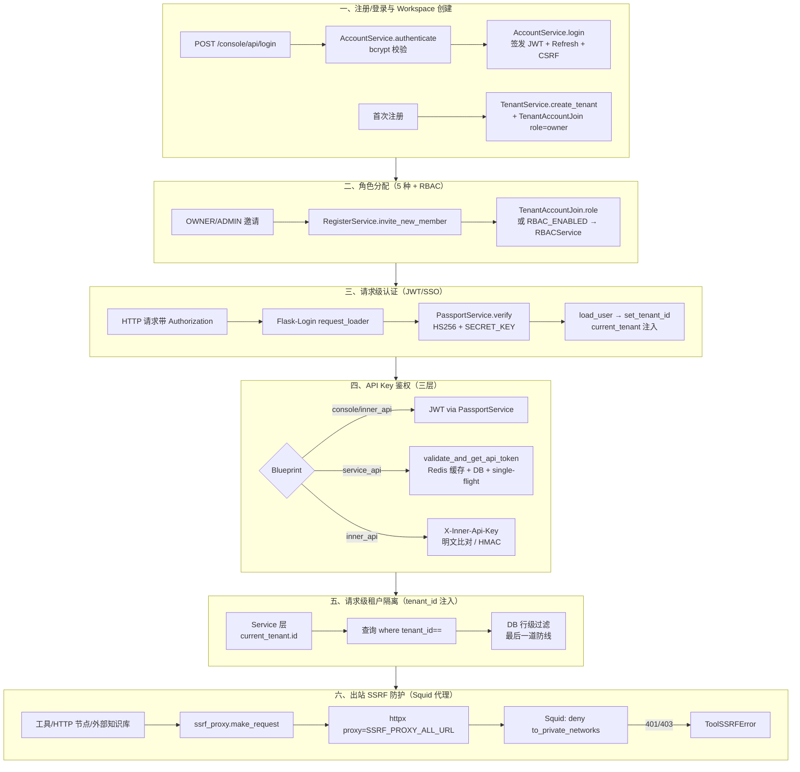
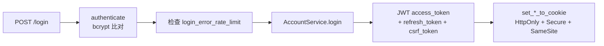
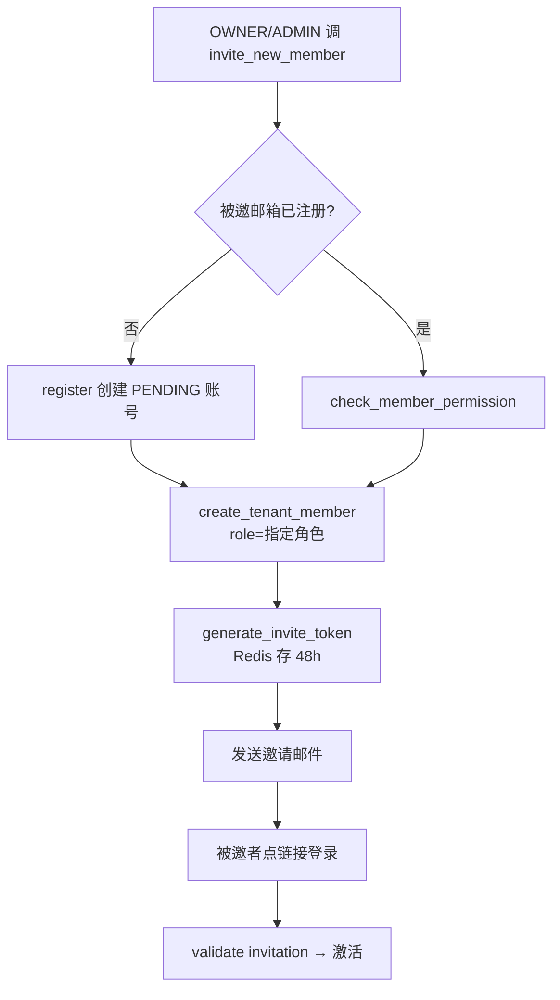
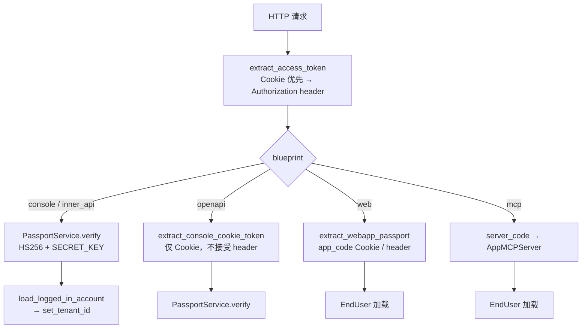
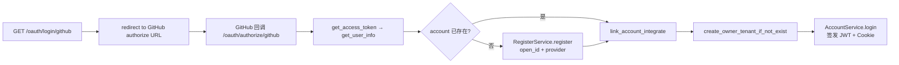
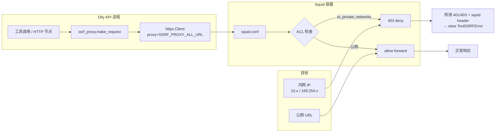

# 多租户、权限与数据隔离

> **学习目标**：理解 Dify 的 SaaS 多租户架构，包括 Workspace 模型、RBAC 权限控制、数据隔离策略、认证体系和安全机制。
>
> **读完本章你应该能回答**：
> - Workspace 在 Dify 多租户架构中扮演什么角色？它和"传统多租户"有什么区别？
> - 一个用户能加入多个 Workspace 吗？同时有多个 workspace 成员关系时如何区分"当前激活"workspace？
> - Dify 的五种角色（OWNER/ADMIN/EDITOR/NORMAL/DATASET_OPERATOR）各自的权限边界是什么？
> - 认证体系有哪四种类型（用户会话/JWT/API Key/Inner API Key）？它们分别在什么场景使用？
> - 端点层、Service 层、数据层三道权限检查分别检查什么？为什么需要多道防御？
> - 数据隔离策略：行级（tenant_id 字段）/ 文件级（OSS 路径前缀）/ 向量库级（集合名）三层怎么配合？
> - SSRF Proxy 在数据隔离中起什么作用？为什么"出站请求必须经过 Squid 代理"是必须的？
> - 凭据加密存储的算法是什么？密钥从哪儿来？为什么"密钥永远不进 LLM"重要？
> - 审计日志覆盖哪些事件？典型排查场景怎么用？
> - 自托管场景下，多租户隔离怎么弱化或关闭？

## 本章要解决的问题

Dify 是一个多租户 SaaS 平台：同一个实例上，A 公司和 B 公司各自创建 Workspace，互不知道对方的存在。这看似简单的需求，落地时却拉扯出一条从"用户注册"到"出站 HTTP 请求"的完整安全链。**任何一个环节失守，整条链作废**。

考虑三个具体场景：

**场景一：跨租户数据泄露。** A 公司的工程师在调试时把 `app_id` 改成从 URL 截来的另一个 UUID，如果后端查询忘了过滤 `tenant_id`，他直接读到了 B 公司的应用配置、对话记录、知识库文档。多租户隔离的意义归零。

**场景二：API Key 泄露拖库。** 用户为了图方便把 OpenAPI 的 Bearer Token 贴到了公开 GitHub gist。如果这个 Token 没有绑定 `tenant_id`、没有 scope 限制、没有限流，攻击者拿它遍历 `/datasets` 端点，把整个 Workspace 的知识库内容拖走。

**场景三：恶意工具扫内网。** 用户装了一个"网页摘要"插件，插件内部向 `http://10.0.0.5/admin` 发请求。如果 Dify 不强制出站流量走代理，云元数据服务（`169.254.169.254`）、内网数据库、Kubernetes API server 全部暴露——一个工具就能完成内网横向移动。

这三个场景对应多租户安全的三条防线：**入站身份认证（谁能进）、请求级租户隔离（进来看什么）、出站流量管控（能去哪儿）**。Dify 用"Workspace 模型 + RBAC + tenant_id 行级过滤 + 三层 API Key + Squid 代理"的组合同时守住三条防线。本章按这条防线的生命周期逐层展开——从用户注册那一刻开始，到最后一次出站 HTTP 请求被 Squid 拦截为止。

## 宏观架构：多租户安全的生命周期

下图是一条请求从"未认证的 HTTP 报文"到"被隔离地执行完业务逻辑"的完整生命周期，也是全文的叙事主线——后续每一节对应生命周期的一个阶段。



理解这张图的关键：**身份不是单点校验，而是层层降级**。登录时拿到的是"你是谁"（Account），进 Workspace 时拿到的是"你能做什么"（role），请求 API 时按 Blueprint 选择不同的鉴权方式（JWT / API Token / Inner Key），最后所有业务查询都强制带 `tenant_id`。即便前面四层全部失守，最后一层的 DB 行级过滤仍能挡住跨租户读取。出站请求再叠一层 Squid 代理，确保即便应用被攻陷，内网也扫不到。

下面按这六个阶段逐层展开。

## 一、注册/登录与 Workspace 创建

**这一节为什么存在**：多租户安全的第一步是"确定你是谁，并把你放进一个隔离的盒子里"。Account 是身份的最小单元，Workspace（Tenant）是资源隔离的盒子。注册时同时创建这两者，并用 `TenantAccountJoin` 把它们绑死——后续所有权限、数据隔离都依赖这条 join 记录。

### 1.1 账号注册与密码存储

注册入口分三种：邮箱密码注册、OAuth（GitHub/Google）注册、邀请注册。三者最终都走 `AccountService.create_account`（account_service.py:419）：

```python
# account_service.py:446-458 密码加盐 + bcrypt
salt = secrets.token_bytes(16)
base64_salt = base64.b64encode(salt).decode()
password_hashed = hash_password(password, salt)
base64_password_hashed = base64.b64encode(password_hashed).decode()
```

密码用 `libs/password.hash_password`（bcrypt 变体）+ 16 字节随机 salt 存储，DB 里只存 `base64_password_hashed` 和 `base64_salt`——明文密码从不落库。`compare_password`（account_service.py:383）在登录时用同样的 salt 重新 hash 再比对，避免时序攻击。

### 1.2 Workspace 自动创建

注册成功后，`AccountService.create_account_and_tenant`（account_service.py:478）调 `TenantService.create_owner_tenant_if_not_exist`（account_service.py:1282）。这里有一个"如果用户已有 Workspace 就跳过"的幂等检查：

```python
# account_service.py:1287-1295 检查是否已有 workspace
available_ta = session.scalar(
    select(TenantAccountJoin)
    .where(TenantAccountJoin.account_id == account.id)
    .order_by(TenantAccountJoin.id.asc())
    .limit(1)
)
if available_ta:
    return  # 已有 workspace，不重复创建
```

`TenantService.create_tenant`（account_service.py:1239）做三件事：建 Tenant 记录、为每个插件类别建 `TenantPluginAutoUpgradeStrategy`、调 `generate_key_pair(tenant.id)` 生成 RSA 密钥对存到 `Tenant.encrypt_public_key`（凭据加密用，见 ⑥）。

### 1.3 登录与 JWT 签发

登录入口 `POST /console/api/login`（login.py:95）：



`AccountService.login`（account_service.py:628）签发三类 Token：

| Token | 生成方式 | 存储 | 用途 |
|-------|---------|------|------|
| `access_token` | `PassportService().issue({user_id, exp, iss, sub})` HS256 | HttpOnly Cookie | 后续请求鉴权 |
| `refresh_token` | `secrets.token_hex(64)` 随机 | Redis `refresh_token:{token}` + HttpOnly Cookie | access_token 过期后换新 |
| `csrf_token` | `PassportService().issue({exp, sub:user_id})` HS256 | 非 HttpOnly Cookie（前端读得到） | 防 CSRF |

JWT payload 关键字段（account_service.py:348-359）：

```python
payload = {
    "user_id": account.id,
    "exp": int(exp_dt.timestamp()),       # ACCESS_TOKEN_EXPIRE_MINUTES 后过期
    "iss": dify_config.EDITION,            # "cloud" / "self-hosted"
    "sub": "Console API Passport",         # 用途标识
}
token: str = PassportService().issue(payload)
```

**为什么 JWT 不放 tenant_id？** 因为一个 Account 可以加入多个 Workspace，当前激活的 Workspace 会切换。JWT 只承载"你是谁"，"你在哪个 Workspace"由 `load_user` 从 `TenantAccountJoin.current=True` 动态加载（见 ③）。这让 Workspace 切换不需要重签 JWT。

### 1.4 限流与防爆破

`AccountService` 内置多个 Redis 限流器（account_service.py:142-157）：

| 限流器 | 窗口 | 上限 | 防御目标 |
|--------|------|------|---------|
| `login_error_rate_limit` | `LOGIN_LOCKOUT_DURATION` | 5 次 | 密码爆破 |
| `reset_password_rate_limiter` | 60s | 1 次 | 邮件轰炸 |
| `email_register_rate_limiter` | 60s | 1 次 | 批量注册 |
| `email_code_login_rate_limiter` | 300s | 3 次 | 验证码爆破 |
| `owner_transfer_rate_limiter` | 60s | 1 次 | OWNER 劫持 |

登录失败时 `add_login_error_rate_limit`（account_service.py:1050）在 Redis 计数，超过 5 次后 `is_login_error_rate_limit` 返回 True，直接拒绝登录。

## 二、角色分配：5 种角色 + 企业版 RBAC

**这一节为什么存在**：登录只解决了"你是谁"，角色决定"你能做什么"。Dify 内置 5 种 Workspace 级角色，企业版还能开启 RBAC 做细粒度资源授权。角色的分配发生在两个时点：注册时自动给 OWNER，邀请成员时由 OWNER/ADMIN 指定。

### 2.1 五种角色与权限矩阵

`TenantAccountRole` 枚举（account.py:21-26）：

```python
class TenantAccountRole(enum.StrEnum):
    OWNER = "owner"                    # 所有者，最高权限，唯一
    ADMIN = "admin"                    # 管理员，可管理成员和资源
    EDITOR = "editor"                  # 编辑者，可编辑应用和知识库
    NORMAL = "normal"                  # 普通成员，可使用应用
    DATASET_OPERATOR = "dataset_operator"  # 知识库操作员，仅管理知识库
```

角色间的权限边界由一组静态工具方法定义（account.py:28-78）：

| 方法 | 包含的角色 | 用途 |
|------|-----------|------|
| `is_privileged_role` | OWNER, ADMIN | 成员管理、Workspace 设置 |
| `is_admin_role` | ADMIN | 仅 ADMIN 能做的操作 |
| `is_non_owner_role` | ADMIN, EDITOR, NORMAL, DATASET_OPERATOR | 排除 OWNER 的所有角色 |
| `is_editing_role` | OWNER, ADMIN, EDITOR | 编辑应用、工作流 |
| `is_dataset_edit_role` | OWNER, ADMIN, EDITOR, DATASET_OPERATOR | 编辑知识库 |

这些方法不是装饰器，而是 Service 层权限检查的基础谓词。例如 `check_member_permission`（account_service.py:1635）在非 RBAC 模式下用 `is_privileged_role` 判断能否加/删成员。

### 2.2 Account 上的角色属性

`Account` 类通过 `current_tenant` setter 动态加载当前角色（account.py:131-152）：

```python
@current_tenant.setter
def current_tenant(self, tenant: "Tenant"):
    # 查 TenantAccountJoin，把 role 灌到 self.role
    tenant_join = session.scalar(select(TenantAccountJoin).where(...))
    if tenant_join:
        self.role = TenantAccountRole(tenant_join.role)
        self._current_tenant = tenant_reloaded
```

`Account` 上还有一组便捷属性，它们都检查 `RBAC_ENABLED` 开关（account.py:191-239）：

```python
@property
def is_admin_or_owner(self):
    if dify_config.RBAC_ENABLED:
        return True  # 企业版 RBAC 自行计算，这里放行
    return TenantAccountRole.is_privileged_role(self.role)
```

**为什么 RBAC_ENABLED 时直接返回 True？** 因为这组属性是社区版的便捷检查，企业版的权限计算下沉到 `RBACService`（见 2.4）。社区版属性放行后，具体的权限校验在 Service 层用 `AccountService.get_workspace_permission_keys`（account_service.py:187）查 RBAC permission_keys 再判断。

### 2.3 邀请成员流程

邀请入口 `RegisterService.invite_new_member`（account_service.py:1996）：



邀请 Token 存 Redis（account_service.py:2096）：`member_invite:token:{uuid}` → JSON `{account_id, email, workspace_id, role, requires_setup}`，TTL = `INVITE_EXPIRY_HOURS`。

角色分配的核心是 `TenantService.create_tenant_member`（account_service.py:1322）：

```python
ta = TenantAccountJoin(
    tenant_id=tenant.id,
    account_id=account.id,
    role=TenantAccountRole(role),  # "normal" / "editor" / ...
)
session.add(ta)
```

有个硬约束：每个 Workspace 只能有一个 OWNER。`create_tenant_member` 在 `role==OWNER` 时检查 `has_roles(tenant, [OWNER])`（account_service.py:1327-1330），已存在就 raise。

### 2.4 企业版 RBAC：角色映射与权限键

`RBAC_ENABLED=true` 时（enterprise/__init__.py:32），5 种内置角色被映射到 RBAC builtin role：

```python
# account_service.py:160-184 把 legacy role 映射到 RBAC role id
expected_tag = {
    TenantAccountRole.OWNER: "owner",
    TenantAccountRole.ADMIN: "admin",
    ...
}[role]
for rbac_role in roles:
    if rbac_role.is_builtin and rbac_role.category == "global_system_default" and rbac_role.role_tag == expected_tag:
        return str(rbac_role.id)
```

`RBACService`（rbac_service.py）提供 `Roles`、`MemberRoles`、`MyPermissions` 三个命名空间。权限检查从"角色枚举比对"变成"permission_keys 集合包含"：

```python
# account_service.py:1646-1655 RBAC 模式下的成员管理权限检查
workspace_permission_keys = AccountService.get_workspace_permission_keys(str(tenant.id), str(operator.id))
required_permission_key = "workspace.member.manage" if action in {"add", "remove"} else "workspace.role.manage"
if required_permission_key not in workspace_permission_keys:
    raise NoPermissionError(f"No permission to {action} member.")
```

这让企业版可以定义自定义角色（如"只读审计员"）并赋予任意 permission_key 组合，而不受 5 种内置角色限制。

### 2.5 Workspace 切换

一个 Account 可加入多个 Workspace，通过 `POST /console/api/workspaces/switch`（workspace.py:340）切换。`TenantService.switch_tenant`（account_service.py:1528）把当前 Workspace 的 `TenantAccountJoin.current` 置 True，其他置 False：

```python
# account_service.py:1549-1554
session.execute(
    update(TenantAccountJoin)
    .where(TenantAccountJoin.account_id == account.id, TenantAccountJoin.tenant_id != tenant_id)
    .values(current=False)
)
tenant_account_join.current = True
tenant_account_join.last_opened_at = naive_utc_now()
```

切换后，下一次 `load_user`（见 ③）会读 `current=True` 的 join 记录，把 `current_tenant` 设到新的 Workspace。这是"JWT 不放 tenant_id"设计的直接收益——切换不需要重签 Token。

## 三、请求级认证：JWT 校验与 SSO

**这一节为什么存在**：登录签发的 JWT 只是一次性的身份证明。每个进来的 HTTP 请求都要重新验证 JWT、加载 Account、注入 `current_tenant`，这样后续的 Service 层才能拿到"当前用户是谁、在哪个 Workspace"的上下文。这一阶段是"身份从 Cookie 到代码上下文"的桥。

### 3.1 Flask-Login 的 request_loader

Dify 用 `DifyLoginManager`（ext_login.py:24）扩展 Flask-Login。核心是 `load_user_from_request`（ext_login.py:47），它按 `request.blueprint` 分四条路径：



**console / inner_api 路径**（ext_login.py:76-88）：

```python
if request.blueprint in {"console", "inner_api"}:
    if not auth_token:
        raise Unauthorized("Invalid Authorization token.")
    decoded = PassportService().verify(auth_token)
    user_id = decoded.get("user_id")
    source = decoded.get("token_source")
    if source:  # 拒绝带 token_source 的 token（防止 scope 混用）
        raise Unauthorized("Invalid Authorization token.")
    logged_in_account = AccountService.load_logged_in_account(account_id=user_id, session=db.session)
    return logged_in_account
```

这里有一个微妙的安全检查：`source = decoded.get("token_source"); if source: raise Unauthorized`。Console JWT 的 payload 里不应该有 `token_source` 字段——这是 OpenAPI device-flow token 的标识。混用 scope 是常见的 Token 伪造攻击面，Dify 在这里显式拒绝。

### 3.2 load_user：注入 current_tenant

`AccountService.load_user`（account_service.py:310）做三件事：

```python
# account_service.py:318-338 加载 current_tenant
current_tenant = session.scalar(
    select(TenantAccountJoin)
    .where(TenantAccountJoin.account_id == account.id, TenantAccountJoin.current == True)
    .limit(1)
)
if current_tenant:
    account.set_tenant_id(current_tenant.tenant_id)  # 注入 current_tenant + role
else:
    # 没有 current=True 的 join，挑一个最早的 workspace 作为 fallback
    available_ta = session.scalar(
        select(TenantAccountJoin)
        .where(TenantAccountJoin.account_id == account.id)
        .order_by(TenantAccountJoin.id.asc())
        .limit(1)
    )
    if not available_ta:
        return None
    account.set_tenant_id(available_ta.tenant_id)
    available_ta.current = True  # 顺便把这个 workspace 标记为 current
```

`account.set_tenant_id`（account.py:158-171）查 `TenantAccountJoin` 拿到 `role`，把 `self.role` 和 `self._current_tenant` 都设上。此后，`current_user.current_tenant.id` 和 `current_user.current_role` 在整个请求生命周期内可用——Service 层的所有权限检查和数据过滤都依赖这两个值。

### 3.3 login_required 装饰器

`libs/login.py` 的 `login_required`（login.py:109）是端点层的入口守卫：

```python
@wraps(func)
def decorated_view(*args, **kwargs):
    if request.method in EXEMPT_METHODS or dify_config.LOGIN_DISABLED:
        return current_app.ensure_sync(func)(*args, **kwargs)
    user = _resolve_current_user()
    if user is None or not user.is_authenticated:
        unauthorized_response = _get_login_manager().unauthorized()
        return unauthorized_response
    g._login_user = user
    check_csrf_token(request, user.id)  # CSRF 校验
    return current_app.ensure_sync(func)(*args, **kwargs)
```

`check_csrf_token`（token.py:182）比对 header 里的 CSRF token 和 Cookie 里的，再用 `PassportService().verify` 验证 JWT 签名和 `sub==user_id`。这是防 CSRF 的双重提交 Cookie 模式。

### 3.4 OAuth / SSO

Dify 内置 GitHub 和 Google OAuth（oauth.py:52-72）：

```python
OAUTH_PROVIDERS = {"github": github_oauth, "google": google_oauth}
```

OAuth 流程（oauth.py:101-221）：



OAuth 不走密码，但仍要绑 Workspace。`_generate_account`（oauth.py:233）先按 `open_id` 或 `email` 找已有 Account，找不到就 `RegisterService.register` 新建。SSO 用户同样会拿到 JWT Cookie——后续请求认证路径和邮箱密码登录完全一致。

> 企业级 SSO（SAML / OIDC）通过插件实现，不在社区版代码内。认证成功后同样落到 `AccountService.login` 签发 JWT，不重复展开。

## 四、API Key 鉴权：三层 Token 体系

**这一节为什么存在**：Console 的 JWT 是给浏览器的，但 Dify 还要服务两类非交互式调用——外部应用调 Dify 的 OpenAPI（用 ApiToken），微服务之间互调（用 Inner API Key）。这三种 Token 的签发方式、存储位置、校验路径完全不同，混用会造成权限放大。Dify 用 Blueprint 路由 + 不同的鉴权装饰器把它们隔开。

### 4.1 三层 Token 对比

| 层级 | 用途 | 签发 | 存储 | 校验入口 |
|------|------|------|------|---------|
| **Console JWT** | 浏览器调用 Console API | `PassportService.issue` HS256 | HttpOnly Cookie | `load_user_from_request` console 分支 |
| **ApiToken** | 外部应用调 OpenAPI（chat-messages / datasets 等） | `ApiToken.generate_api_key` | DB `api_tokens` 表（明文 token） | `validate_and_get_api_token` |
| **Inner API Key** | 微服务间互调（Plugin Daemon → API / Worker → API） | 环境变量 `INNER_API_KEY` | 不落库 | `inner_api_only` 装饰器 |

### 4.2 ApiToken 模型与生成

`ApiToken`（model.py:2236）：

```python
class ApiToken(Base):
    __tablename__ = "api_tokens"
    id = mapped_column(StringUUID, default=lambda: str(uuid4()))
    app_id = mapped_column(StringUUID, nullable=True)       # APP 类 token 绑定 app
    tenant_id = mapped_column(StringUUID, nullable=True)     # 绑定 workspace
    type: Mapped[ApiTokenType] = mapped_column(...)          # "app" | "dataset"
    token: Mapped[str] = mapped_column(String(255))          # 明文存储
    last_used_at = mapped_column(sa.DateTime, nullable=True)
```

`ApiTokenType`（enums.py:367）只有两种：`APP`（应用服务 API）和 `DATASET`（知识库服务 API）。

`generate_api_key`（model.py:2253）生成带前缀的随机字符串，确保 DB 里不重复：

```python
@staticmethod
def generate_api_key(prefix: str, n: int) -> str:
    while True:
        result = prefix + generate_string(n)
        if db.session.scalar(select(exists().where(ApiToken.token == result))):
            continue
        return result
```

> **安全提示**：`token` 字段在 DB 里是明文存储的（不是 hash）。这意味着 DB 泄露 = 所有 ApiToken 泄露。生产部署务必给 `api_tokens` 表加列级加密或用专用密钥管理服务。这是 Dify 当前的已知设计取舍——为了支持按 token 高频查询和 Redis 缓存，hash 存储会让校验时无法按 token 反查。

### 4.3 ApiToken 校验：Redis 缓存 + single-flight

校验入口 `validate_and_get_api_token`（wraps.py:354）：

```mermaid
flowchart TD
    V1[Authorization: Bearer {token}] --> V2[ApiTokenCache.get<br/>Redis: api_token:{scope}:{token}]
    V2 -- 命中 --> V3[record_token_usage<br/>Redis SET 1h]
    V2 -- 未命中 --> V4[fetch_token_with_single_flight]
    V4 --> V5[Redis lock acquire]
    V5 --> V6{lock 拿到?}
    V6 -- 是 --> V7[再查缓存<br/>双重检查]
    V7 --> V8[query_token_from_db]
    V8 --> V9[ApiTokenCache.set<br/>10min TTL]
    V6 -- 否 --> V10[直接查 DB<br/>fallback]
    V9 --> V11[返回 ApiToken]
    V10 --> V11
    V3 --> V11
```

缓存设计有几个关键点：

- **缓存键带 scope**（api_token_service.py:83）：`api_token:{scope}:{token}`。同一个 token 字符串在不同 scope（app/dataset）下是不同的记录，缓存必须隔离。
- **null 缓存短 TTL**（api_token_service.py:57）：不存在的 token 也缓存 60s（`CACHE_NULL_TTL_SECONDS`），防止恶意请求打穿 DB。
- **single-flight**（api_token_service.py:301）：高并发下同一个 token 的 cache miss 只让一个请求查 DB，其他等 Redis lock。lock 超时则 fallback 直查。
- **tenant 索引**（api_token_service.py:78）：`tenant_tokens:{tenant_id}` 集合记录该租户所有缓存的 token key，删 token 时按租户批量失效。

### 4.4 validate_app_token：从 Token 到 App + Tenant + User

`validate_app_token` 装饰器（wraps.py:99）不只是校验 Token，还把 App、Tenant、EndUser 全部加载到请求上下文：

```python
# wraps.py:105-122
api_token = validate_and_get_api_token("app")
app_model = db.session.get(App, api_token.app_id)
if not app_model: raise Forbidden("The app no longer exists.")
if app_model.status != "normal": raise Forbidden("The app's status is abnormal.")
if not app_model.enable_api: raise Forbidden("The app's API service has been disabled.")
tenant = db.session.get(Tenant, app_model.tenant_id)
if tenant.status == TenantStatus.ARCHIVE: raise Forbidden("The workspace's status is archived.")
kwargs["app_model"] = app_model
```

这里有一个**多层防御**的典型例子：即便 ApiToken 校验通过，还要检查 App 是否存在、状态是否正常、API 是否启用、Tenant 是否归档。任何一层失败都 403。这是"信任但不放任"——Token 只证明"调用者有权限调这个 app"，不证明"这个 app 现在还能用"。

如果端点需要 EndUser 上下文（`fetch_user_arg` 指定），还会调 `EndUserService.get_or_create_end_user`（wraps.py:142）按 `user` 参数加载或创建 EndUser。不需要 EndUser 时，会加载 Tenant 的 OWNER Account 作为 `current_user`，让依赖 `current_account_with_tenant()` 的 Service 层能正常工作。

### 4.5 validate_dataset_token：知识库 Token

`validate_dataset_token` 装饰器（wraps.py:285）类似，但额外检查 `dataset.tenant_id == api_token.tenant_id`（wraps.py:313-318）——即便 Token 有效，也只能访问所属 Workspace 的知识库，跨 Workspace 的 dataset_id 直接 404。

### 4.6 Inner API Key

Inner API Key 用于微服务间互调，不走 JWT 也不走 DB。`inner_api_only`（inner_api/wraps.py:21）：

```python
def inner_api_only(view):
    @wraps(view)
    def decorated(*args, **kwargs):
        if not dify_config.INNER_API:
            abort(404)  # 未启用 inner_api 时直接 404，不暴露端点存在
        inner_api_key = request.headers.get("X-Inner-Api-Key")
        if not inner_api_key or inner_api_key != dify_config.INNER_API_KEY:
            raise InnerApiUnauthorizedError()
        return view(*args, **kwargs)
    return decorated
```

Plugin Daemon 调 API 用独立的 key（inner_api/wraps.py:84）：

```python
def plugin_inner_api_only(view):
    # 检查 X-Inner-Api-Key == INNER_API_KEY_FOR_PLUGIN
```

还有 HMAC 变体 `enterprise_inner_api_user_auth`（inner_api/wraps.py:46），用 `HMAC-SHA1(inner_api_key, "DIFY {user_id}")` 做签名，验证后注入 EndUser。这是给需要用户上下文的 inner API 用的。

**为什么 Inner API Key 用明文比对而不是 hash？** 因为它是环境变量配置的，不落 DB，不需要防 DB 泄露。明文比对避免了每次请求算 hash 的开销。代价是：`INNER_API_KEY` 必须通过安全渠道分发（如 K8s Secret），不能进 git。

### 4.7 Admin API Key 后门

`load_user_from_request` 里有一段特殊逻辑（ext_login.py:58-74）：

```python
if dify_config.ADMIN_API_KEY_ENABLE and auth_token:
    admin_api_key = dify_config.ADMIN_API_KEY
    if admin_api_key and admin_api_key == auth_token:
        workspace_id = request.headers.get("X-WORKSPACE-ID")
        if workspace_id:
            # 加载该 workspace 的 owner account，以 owner 身份执行
            ...
            return account
```

这是给运维紧急访问用的——用一个全局 Admin Key + `X-WORKSPACE-ID` header 直接以 OWNER 身份进入任意 Workspace。`ADMIN_API_KEY_ENABLE` 默认关闭，生产环境慎用。`check_csrf_token` 也对 Admin Key 放行（token.py:185-188）。

## 五、请求级租户隔离：tenant_id 注入查询

**这一节为什么存在**：前面四层只解决"调用者有没有权限进这个 API"，没解决"进了之后查的数据是不是自己 Workspace 的"。这一层是最后一道防线——所有业务查询强制带 `tenant_id` 过滤，即便 Service 层漏检查，DB 也不会返回跨租户数据。

### 5.1 行级隔离：tenant_id 字段

Dify 的核心业务表（App、Dataset、Document、Message、Conversation、ApiToken、ProviderCredential、WorkflowRun 等）都有一个 `tenant_id` 字段。这个字段在 `DefaultFieldsMixin`（base.py:27）之外按表显式声明——不是基类强制，而是每个表自己加。这意味着**新增表时必须记得加 `tenant_id`**，否则默认无隔离。

查询模式是固定的：

```python
# 正确：带 tenant_id 过滤
apps = db.session.scalars(
    select(App).where(App.tenant_id == current_tenant.id)
).all()

# 错误：漏 tenant_id，跨租户泄露
apps = db.session.scalars(select(App)).all()
```

`current_tenant.id` 来自 ③ 的 `load_user` 注入。Service 层通过 `current_account_with_tenant()`（login.py:39）拿到 `(account, tenant_id)` 二元组：

```python
def current_account_with_tenant() -> tuple[Account, str]:
    user = _resolve_current_user()
    if not isinstance(user, Account):
        raise ValueError("current_user must be an Account instance")
    assert user.current_tenant_id is not None, "The tenant information should be loaded."
    return user, user.current_tenant_id
```

### 5.2 Service 层权限检查的典型模式

Service 层在数据查询前先做两层检查：成员资格 + 角色。以"获取 App"为例：

```python
# 典型 Service 层模式（伪代码，简化自多个 Service）
def get_app(app_id: str):
    account, tenant_id = current_account_with_tenant()
    # 1. 成员资格检查
    if not TenantService.is_member(account, Tenant(id=tenant_id), session=session):
        raise UnauthorizedError()
    # 2. 角色检查（如果只允许编辑者以上）
    if not account.has_edit_permission:
        raise ForbiddenError()
    # 3. 行级过滤查询
    app = db.session.scalar(
        select(App).where(App.tenant_id == tenant_id, App.id == app_id)
    )
    if not app:
        raise NotFoundError()
    return app
```

`is_member`（account_service.py:1870）和 `get_user_role`（account_service.py:1618）都查 `TenantAccountJoin`，确认调用者确实属于该 Workspace。

### 5.3 资源隔离矩阵

不同资源的隔离维度不同，下表汇总：

| 资源类型 | 隔离维度 | 过滤位置 | 备注 |
|----------|----------|----------|------|
| **App** | `tenant_id` | Service 层 `where(App.tenant_id==)` | App 不能跨租户克隆 |
| **Dataset** | `tenant_id` + `created_by` | DatasetService | 同名允许，但 created_by 不同 |
| **ApiToken** | `tenant_id` + `app_id` | `validate_and_get_api_token` | Token 绑定单一 App |
| **Conversation** | `tenant_id` + `app_id` + `from_account` | ChatService | 三段都必须匹配 |
| **EndUser** | `tenant_id` + `session_id` | EndUserService | 跨租户 ID 复用无碍 |
| **WorkflowRun** | `tenant_id` + `workflow_id` | WorkflowRunRepo | 不存在跨租户查询 |
| **ProviderCredential** | `tenant_id` | ProviderManager | 加密存储（见 ⑥） |
| **UploadFile** | `tenant_id` | 文件存储路径前缀 | OSS 路径含 tenant_id |
| **向量库** | `tenant_id` 派生的集合名 | Dataset 检索时 | 不同租户不同 collection |

### 5.4 跨租户数据访问的禁止模式

```python
# 反例 1: 漏 tenant_id 过滤
apps = db.session.scalars(select(App)).all()  # 跨租户泄露

# 正例
apps = db.session.scalars(
    select(App).where(App.tenant_id == current_tenant.id)
).all()

# 反例 2: 用 account_id 而非 tenant_id 过滤
# 有多 Workspace 成员关系的用户能看到其他 Workspace 的数据
ds = db.session.scalars(
    select(Dataset).where(Dataset.created_by == current_user.id)
).all()

# 正例：tenant_id + created_by
ds = db.session.scalars(
    select(Dataset).where(
        Dataset.tenant_id == current_tenant.id,
        Dataset.created_by == current_user.id,
    )
).all()

# 反例 3: bulk 操作不过滤
db.session.execute(delete(Message))  # 全删

# 正例
db.session.execute(
    delete(Message).where(Message.conversation_id.in_(
        get_authorized_conversation_ids(current_tenant.id, current_user.id)
    ))
)
```

### 5.5 文件级与向量库级隔离

除了 DB 行级过滤，还有两层物理隔离：

**文件级**：上传到 OSS/S3 的文件路径包含 `tenant_id`，如 `upload_files/{tenant_id}/{file_id}`。即便 OSS bucket 共享，路径前缀也保证了不同租户的文件不会碰撞。`UploadFile` 模型（model.py:2262）的 `key` 字段存的就是带租户前缀的存储路径。

**向量库级**：每个 Dataset 在向量库里用独立的 collection / index name，命名包含 `tenant_id` 派生的标识。检索时按 Dataset ID 查对应 collection，不会跨租户召回。详见 [09-rag-indexing.md](./dify-09-rag-indexing.md) 和 [10-rag-retrieval.md](./dify-10-rag-retrieval.md)。

## 六、出站 SSRF 防护：Squid 代理

**这一节为什么存在**：前五层守的是"进来的请求"，但 Dify 自己也会向外发请求——工具调用、HTTP 请求节点、外部知识库检索、网页摘要、模型 provider 调用。如果这些出站请求能任意访问内网，恶意工具/配置就能扫内网、读云元数据、打内网服务。SSRF 防护把所有出站 HTTP 流量强制塞进一个 Squid 代理，由代理按 ACL 拦截内网地址。

### 6.1 SSRF 代理的架构



### 6.2 Python 侧：ssrf_proxy 模块

`api/core/helper/ssrf_proxy.py` 是出站请求的唯一入口。`make_request`（ssrf_proxy.py:145）用 httpx 的代理能力把流量塞进 Squid：

```python
# ssrf_proxy.py:68-83 构建 SSRF 客户端
def _build_ssrf_client(verify: bool) -> httpx.Client:
    if dify_config.SSRF_PROXY_ALL_URL:
        return httpx.Client(
            proxy=dify_config.SSRF_PROXY_ALL_URL,  # 统一代理
            verify=verify,
            limits=_SSRF_CLIENT_LIMITS,
        )
    if dify_config.SSRF_PROXY_HTTP_URL and dify_config.SSRF_PROXY_HTTPS_URL:
        return httpx.Client(
            mounts=_create_proxy_mounts(verify=verify),  # 分协议代理
            verify=verify,
            limits=_SSRF_CLIENT_LIMITS,
        )
    return httpx.Client(verify=verify, limits=_SSRF_CLIENT_LIMITS)  # 无代理 fallback
```

**关键设计决策：Python 侧不做 DNS 解析和 IP 检查**。原版 Dify 曾有过在 Python 侧解析域名 + 检查 IP 段的实现，但当前版本（v1.15.0）把这道防线完全交给 Squid。原因有三：

1. **DNS rebinding 防不住**：Python 侧解析的 IP 和实际连接的 IP 可能不同（TTL=0 的 DNS 记录），检查了也白检查。
2. **Squid 是专业工具**：ACL 配置成熟、性能好、可独立审计。
3. **单一职责**：Python 侧只管"把流量送进代理"，Squid 只管"决定放不放行"。

Python 侧的职责变成**检测 Squid 的拦截结果**（ssrf_proxy.py:190-201）：

```python
# Squid 拦截后返回 401/403，并通过 Server/Via header 标识自己
if response.status_code in (401, 403):
    server_header = response.headers.get("server", "").lower()
    via_header = response.headers.get("via", "").lower()
    if "squid" in server_header or "squid" in via_header:
        raise ToolSSRFError(
            f"Access to '{url}' was blocked by SSRF protection. "
            f"The URL may point to a private or local network address. "
        )
```

这里有一个**误报风险**：如果目标 URL 本身返回 403 且 Server header 恰好含 "squid"（极罕见），会被误判为 SSRF 拦截。但这个权衡是值得的——宁可误报也不漏放。

### 6.3 Squid 侧：ACL 配置

`docker/ssrf_proxy/squid.conf.template` 定义了拦截规则：

```
# 拦截的私有网络段
acl to_private_networks dst 0.0.0.0/8
acl to_private_networks dst 10.0.0.0/8
acl to_private_networks dst 100.64.0.0/10      # CGN
acl to_private_networks dst 127.0.0.0/8
acl to_private_networks dst 169.254.0.0/16     # AWS metadata!
acl to_private_networks dst 172.16.0.0/12
acl to_private_networks dst 192.168.0.0/16
acl to_private_networks dst 224.0.0.0/4        # 多播
acl to_private_networks dst 240.0.0.0/4        # 保留
acl to_private_networks dst ::/128             # IPv6 未指定
acl to_private_networks dst ::1/128            # IPv6 loopback
acl to_private_networks dst fc00::/7           # IPv6 ULA
acl to_private_networks dst fe80::/10          # IPv6 link-local

http_access deny to_private_networks
```

**`169.254.169.254` 是重点防护对象**——这是 AWS/GCP/Azure 的元数据服务 IP，拿到它的响应就能拿到 IMDSv1 的临时凭证。云上部署必须拦。

Squid 还通过 `include /etc/squid/dify_allow_private.conf` 支持白名单（`SSRF_PROXY_ALLOW_PRIVATE_IPS`），用于允许访问特定内网地址（如内网模型服务）。

### 6.4 远程文件抓取：remote_fetcher

`api/core/file/remote_fetcher.py` 是 ssrf_proxy 之上的封装，专门处理"远程文件下载"。`make_request`（remote_fetcher.py:58）先尝试把 Dify 签名的文件 URL 解析成本地存储（HMAC 验证 + DB 查 UploadFile/ToolFile），失败才走 ssrf_proxy：

```python
def make_request(method, url, max_retries=SSRF_DEFAULT_MAX_RETRIES, **kwargs):
    if method.upper() == "GET":
        response = _resolve_dify_signed_file_url("GET", url)
        if response is not None:
            return response  # 本地命中，不走网络
    return ssrf_proxy.make_request(method=method, url=url, max_retries=max_retries, **kwargs)
```

签名 URL 验证用 HMAC-SHA256（remote_fetcher.py:213-232）：

```python
payload = f"{signed_file_url.preview_kind}|{signed_file_url.file_id}|{timestamp}|{nonce}"
recalculated = hmac.new(dify_config.SECRET_KEY.encode(), payload.encode(), hashlib.sha256).digest()
expected = base64.urlsafe_b64encode(recalculated).decode()
return hmac.compare_digest(sign, expected)  # 常量时间比较，防时序攻击
```

### 6.5 哪些出站请求走 SSRF

几乎所有出站 HTTP 都走 ssrf_proxy，包括：

- 工具调用（HTTP 工具、API 工具）
- Workflow 的 HTTP 请求节点
- 外部知识库检索
- 网页摘要工具
- MCP 客户端的 HTTP 传输

Sandbox 和 Plugin Daemon 容器也通过 `HTTP_PROXY`/`HTTPS_PROXY` 环境变量强制走 Squid（见 `docker/docker-compose.yaml` 的 sandbox / plugin-daemon 服务配置）。

## 七、凭据加密与密钥管理

**这一节为什么存在**：Dify 要存储用户的模型 API Key（OpenAI、Anthropic 等）、外部知识库凭据、数据源连接信息。这些凭据如果明文落 DB，DB 泄露 = 所有用户的模型 Key 泄露。Dify 用 RSA 非对称加密存储凭据，私钥按租户隔离。

### 7.1 RSA 加密流程

`api/core/helper/encrypter.py` 是凭据加密的入口。`encrypt_token`（encrypter.py:18）：

```python
def encrypt_token(tenant_id: str, token: str):
    tenant = db.session.get(Tenant, tenant_id)
    assert tenant.encrypt_public_key is not None
    encrypted_token = rsa.encrypt(token, tenant.encrypt_public_key)  # 公钥加密
    return base64.b64encode(encrypted_token).decode()
```

`decrypt_token`（encrypter.py:29）用私钥解密：

```python
def decrypt_token(tenant_id: str, token: str) -> str:
    return rsa.decrypt(base64.b64decode(token), tenant_id)  # 私钥按 tenant_id 索引
```

密钥对在 `TenantService.create_tenant` 时由 `generate_key_pair(tenant.id)`（account_service.py:1273）生成，公钥存 `Tenant.encrypt_public_key`，私钥存哪里？看 `libs/rsa.py`——私钥用 `SECRET_KEY` 加密后存储（或从环境变量派生），确保即便 DB 泄露，没有 `SECRET_KEY` 也解不开私钥。

### 7.2 为什么用 RSA 而不是对称加密

- **公钥可以公开**：`encrypt_public_key` 存 DB，任何 Service 都能加密，但只有持有私钥的进程能解密。
- **密钥隔离**：每个 Tenant 一对密钥，A 租户的私钥解不开 B 租户的凭据。
- **私钥不进 LLM**：解密只在 API 进程内发生，解密后的明文凭据只传给 model runtime，不进 prompt、不进日志、不进 tracing。这是"密钥永远不进 LLM"原则的物理实现。

### 7.3 批量解密优化

`batch_decrypt_token`（encrypter.py:33）预加载 RSA key 和 cipher，避免逐条解密时重复初始化：

```python
def batch_decrypt_token(tenant_id: str, tokens: list[str]):
    rsa_key, cipher_rsa = rsa.get_decrypt_decoding(tenant_id)  # 一次性加载
    return [rsa.decrypt_token_with_decoding(base64.b64decode(token), rsa_key, cipher_rsa) for token in tokens]
```

## 收敛

### 边界：多租户隔离 vs 单租户自托管

Dify 的多租户隔离是为 SaaS 场景设计的。自托管单租户场景下，这层隔离可以弱化：

- `LOGIN_DISABLED=True` 跳过登录检查（仅开发环境）
- `INNER_API_KEY` 留空则 inner API 端点直接 404
- `SSRF_PROXY_ALL_URL` 留空则出站请求不走代理（仅内网部署可接受）
- 单租户场景下 `tenant_id` 过滤仍是好习惯（防止应用 bug 误读其他数据），但不是安全必需

**不该在这里做的事**：用多租户隔离替代应用层权限控制（如"用户 A 不能看用户 B 创建的 App"——这是应用级 ACL，不是租户级隔离）、在自托管公网部署中关闭 SSRF 代理（工具就能扫你的内网）。

### 扩展点

- **自定义角色**：开启 `RBAC_ENABLED` 后通过 `RBACService` 定义自定义角色和 permission_key 组合
- **自定义 OAuth 提供商**：实现 `OAuthProvider` 接口（authorize / callback / link_account），注册到 `OAUTH_PROVIDERS`
- **SSRF 白名单**：通过 `dify_allow_private.conf` 允许特定内网地址（如内网模型服务）
- **审计日志**：通过 `events.tenant_event` 等事件总线订阅 `tenant_was_created`、角色变更等事件，写入审计系统

### 本章要点

1. **Workspace 是租户边界**：Account 是身份，Tenant 是资源盒子，`TenantAccountJoin` 绑定两者并承载 `role` 和 `current` 标记。一个 Account 可加入多个 Workspace，JWT 不放 tenant_id 以支持无感切换。
2. **五种角色 + RBAC 双轨**：社区版用 `TenantAccountRole` 的 5 种枚举 + 静态工具方法判断权限；企业版开启 `RBAC_ENABLED` 后走 `RBACService` 的 permission_keys 动态计算，5 种内置角色被映射到 RBAC builtin role。
3. **三层 Token 体系**：Console JWT（HS256 + Cookie，给浏览器）、ApiToken（DB 明文存储 + Redis 缓存 + single-flight，给外部应用）、Inner API Key（环境变量明文比对，给微服务）。三者按 Blueprint 路由隔离，不可混用。
4. **请求级租户隔离是最后一道防线**：所有业务表带 `tenant_id`，Service 层通过 `current_account_with_tenant()` 拿到当前 Workspace，查询强制 `where tenant_id==`。即便前面四层失守，DB 行级过滤仍能挡住跨租户读取。
5. **SSRF 防护靠 Squid 代理**：Python 侧 `ssrf_proxy.make_request` 把所有出站 HTTP 塞进 Squid，Squid 按 ACL 拦截私有网络段（含 `169.254.169.254` 元数据 IP）。Python 侧只检测 Squid 的 401/403 + squid header 拦截结果，不做 DNS 解析。
6. **凭据加密用 RSA 非对称加密**：每个 Tenant 一对密钥，公钥存 DB 加密凭据，私钥用 `SECRET_KEY` 保护。解密只在 API 进程内发生，明文凭据不进 LLM。

### 推荐源码入口

| 文件 | 职责 |
|------|------|
| api/models/account.py | `Account`、`Tenant`、`TenantAccountJoin`、`TenantAccountRole` 枚举及权限工具方法 |
| api/services/account_service.py | `AccountService`（登录/注册/JWT 签发）、`TenantService`（Workspace 创建/切换/成员管理）、`RegisterService`（邀请流程） |
| api/libs/passport.py | `PassportService`：JWT HS256 签发与校验 |
| api/extensions/ext_login.py | `DifyLoginManager`：按 Blueprint 分路径的 `load_user_from_request` |
| api/libs/login.py | `login_required` 装饰器、`current_account_with_tenant`、CSRF 校验入口 |
| api/libs/token.py | Token 提取（Cookie/header）、Cookie 设置、CSRF token 生成与校验 |
| api/controllers/console/auth/login.py | `POST /login`、`/logout`、`/refresh-token`、`/email-code-login` 端点 |
| api/controllers/console/auth/oauth.py | GitHub / Google OAuth 登录与回调 |
| api/controllers/service_api/wraps.py | `validate_app_token`、`validate_dataset_token`、`validate_and_get_api_token` |
| api/services/api_token_service.py | `ApiTokenCache`（Redis 缓存）、`fetch_token_with_single_flight`、`query_token_from_db` |
| api/controllers/inner_api/wraps.py | `inner_api_only`、`plugin_inner_api_only`、`enterprise_inner_api_user_auth` |
| api/core/helper/ssrf_proxy.py | `make_request`：SSRF 代理客户端，检测 Squid 拦截 |
| api/core/file/remote_fetcher.py | 远程文件抓取：Dify 签名 URL 本地解析 + SSRF fallback |
| api/core/helper/encrypter.py | `encrypt_token` / `decrypt_token`：RSA 凭据加密 |
| api/services/enterprise/rbac_service.py | `RBACService`：企业版 RBAC 角色、成员、权限键管理 |
| api/configs/enterprise/__init__.py | `RBAC_ENABLED`、`ENTERPRISE_ENABLED` 等企业版配置 |
| docker/ssrf_proxy/squid.conf.template | Squid 代理 ACL 配置：拦截私有网络段 |

---

## 附录

### A. 资源隔离矩阵：每类资源落到哪一层

| 资源类型 | 隔离维度 | 索引 | 过滤位置 | 备注 |
|----------|----------|------|----------|------|
| **App** | `tenant_id` | `idx_apps_tenant_id` | Service 层 `load_app()` 必加过滤 | App 不能跨租户克隆 |
| **Dataset** | `tenant_id` + `created_by` | 复合索引 | DatasetService | 同名允许，created_by 不同 |
| **ApiToken** | `tenant_id` + `app_id` | `api_token_tenant_idx` | `validate_and_get_api_token` | Token 绑定单一 App |
| **ProviderCredential** | `tenant_id` | `idx_providers_tenant` | ProviderManager | RSA 加密存储 |
| **Conversation** | `tenant_id` + `app_id` + `from_account` | 复合 | ChatService | 三段都必须匹配 |
| **EndUser** | `tenant_id` + `session_id` | `idx_end_users_tenant_user` | EndUserService | 跨租户 ID 复用无碍 |
| **WorkflowRun** | `tenant_id` + `workflow_id` | `idx_wf_run_tenant_wf` | WorkflowRunRepo | 不存在跨租户查询 |
| **UploadFile** | `tenant_id` | `upload_file_tenant_idx` | 文件路径前缀 | OSS 路径含 tenant_id |
| **向量库** | Dataset ID 派生的集合名 | — | 检索时按 Dataset 查 collection | 不同租户不同 collection |
| **LoginActivity** | `account_id` | `idx_login_activity_account_time` | 审计 | 与租户无关 |

### B. 跨租户数据访问的禁止模式

```python
# 反例 1: 漏 tenant_id 过滤
apps = db.session.scalars(select(App)).all()  # 跨租户泄露

# 正例
apps = db.session.scalars(
    select(App).where(App.tenant_id == current_tenant.id)
).all()

# 反例 2: 用 account_id 而非 tenant_id 过滤
# 多 Workspace 成员关系的用户能看到其他 Workspace 的数据
ds = db.session.scalars(
    select(Dataset).where(Dataset.created_by == current_user.id)
).all()

# 正例：tenant_id + created_by
ds = db.session.scalars(
    select(Dataset).where(
        Dataset.tenant_id == current_tenant.id,
        Dataset.created_by == current_user.id,
    )
).all()

# 反例 3: bulk 操作不过滤
db.session.execute(delete(Message))  # 全删

# 正例
db.session.execute(
    delete(Message).where(Message.conversation_id.in_(
        get_authorized_conversation_ids(current_tenant.id, current_user.id)
    ))
)

# 反例 4: ORM 关系映射没加 filter
dataset.apps  # PropertyDescriptor 不带过滤，必须显式查询
```

### C. OWASP Top 10 (2021) 覆盖表

| OWASP 风险 | Dify 缓解 | 关键实现位置 |
|-----------|----------|--------------|
| **A01 访问控制失效** | `login_required` + Service 层 `tenant_id` 过滤 + `validate_app_token` 多层检查 | `libs/login.py`、`service_api/wraps.py` |
| **A02 加密失效** | JWT HS256 + Refresh Token Redis；RSA 加密凭据 | `libs/passport.py`、`core/helper/encrypter.py` |
| **A03 注入** | SQLAlchemy 参数化（无拼接）；DSL `yaml.safe_load` | `models/*.py` ORM |
| **A04 不安全设计** | Tenant + RBAC + AppMode 多层防御 | `services/account_service.py` |
| **A05 安全配置错误** | `SECRET_KEY` 必填；ENV 严格校验；`is_secure()` 检查 HTTPS | `configs/*`、`libs/token.py` |
| **A06 漏洞组件** | dependabot + pip-audit 扫描 | `.github/dependabot.yml` |
| **A07 认证失效** | OAuth 2.0 + JWT + 邮箱验证 + CSRF token | `controllers/console/auth/` |
| **A08 软件数据完整性失效** | Plugin 签名验证 | `core/plugin/loader.py` |
| **A09 日志监控不足** | 登录失败日志 + 限流计数 + 事件总线 | `libs/helper.py`、`events/` |
| **A10 SSRF** | Squid proxy + 私有网络 ACL | `core/helper/ssrf_proxy.py`、`docker/ssrf_proxy/` |

### D. 审计日志与异常检测

Dify 通过事件总线（`events/`）订阅关键事件。`tenant_was_created`（events/tenant_event.py）在 Workspace 创建时触发，企业版可订阅此事件做审计。

关键审计事件：

| 事件 | 触发位置 | 审计意义 |
|------|---------|---------|
| `tenant_was_created` | `TenantService.create_tenant` | 新 Workspace 创建 |
| 角色变更 | `TenantService.update_member_role` | 越权推广 / OWNER 转让 |
| 成员移除 | `TenantService.remove_member_from_tenant` | 资源重分配给 OWNER |
| ApiToken 创建 | `ApiToken.generate_api_key` | 大权限凭证生成 |
| 登录失败 | `AccountService.add_login_error_rate_limit` | 密码爆破检测 |
| 凭据变更 | Provider credential 更新 | 模型 API Key 变更 |

### E. 常见租户隔离穿透场景与防御

| # | 场景 | 攻击者动作 | 防御 |
|---|------|-----------|------|
| 1 | 越权修改其他租户 App | 改写请求 body 中 `app_id` | `current_tenant.id == app.tenant_id` 检查 |
| 2 | 通过 ID 顺序探测 | 遍历 UUID 找其他租户资源 | UUID v4/v7 足够随机 + 强制 tenant 过滤 |
| 3 | SQL 注入拼接 | `' OR '1'='1` 注入 | SQLAlchemy 参数化 |
| 4 | API key 复用 | 复制自己 API key 到别的租户 | API key 绑定 `tenant_id` 验证 |
| 5 | SSRF 探内网 | 输入内网 URL | Squid proxy + `to_private_networks` ACL |
| 6 | 插件越权 | 装载跨租户恶意 plugin | Plugin 安装需 OWNER 确认 |
| 7 | JWT scope 混用 | 用 OpenAPI token 调 Console API | `load_user_from_request` 检查 `token_source` 字段 |
| 8 | CSRF 伪造 | 诱导浏览器发请求 | 双重提交 Cookie + `check_csrf_token` |
| 9 | 恶意 webhook | 触发向内网发请求 | Webhook URL 走 SSRF 校验 |
| 10 | Admin Key 泄露 | 拿到 `ADMIN_API_KEY` 直接进任意 Workspace | `ADMIN_API_KEY_ENABLE` 默认关闭 + 需 `X-WORKSPACE-ID` |

### F. 安全审计 Checklist（生产部署必过）

- [ ] **强密钥**：`SECRET_KEY` 长度 ≥ 32，禁止默认占位符
- [ ] **HTTPS 强制**：`CONSOLE_WEB_URL` 和 `CONSOLE_API_URL` 都用 https，触发 `is_secure()=True` → Cookie 加 `Secure` flag
- [ ] **HttpOnly Cookie**：access_token / refresh_token 默认 HttpOnly（token.py:100）
- [ ] **SameSite=Lax**：所有 auth Cookie 默认 SameSite=Lax，防 CSRF
- [ ] **CORS 白名单**：生产不要 `*`，配置具体 origin
- [ ] **INNER_API_KEY 强随机**：不用默认值 `inner-api-key`
- [ ] **SSRF 代理启用**：`SSRF_PROXY_ALL_URL` 指向 Squid 容器
- [ ] **限流启用**：`LOGIN_LOCKOUT_DURATION` / `CONSOLE_API_URL` 等配置到位
- [ ] **DB 连接 TLS**：`?sslmode=require` PostgreSQL
- [ ] **Redis Sentinel / Cluster**：避免单点（refresh_token 存 Redis，Redis 挂了无法刷新）
- [ ] **依赖扫描**：dependabot + pip-audit + npm audit
- [ ] **容器扫描**：Trivy
- [ ] **Secret scanner**：gitleaks pre-commit
- [ ] **Backup encryption**：S3 SSE-KMS
- [ ] **日志脱敏**：API Key / Bearer / 邮箱不入日志（`obfuscated_token` encrypter.py:6）

---

> **相关文档**：整体架构与扩展体系见 [01-overview.md](./dify-01-overview.md)；异步任务与事件系统见 [06-async-tasks-and-events.md](./dify-06-async-tasks-and-events.md)；可观测性见 [14-observability.md](./dify-14-observability.md)；实战部署见 [16-practice-and-deployment.md](./dify-16-practice-and-deployment.md)。
