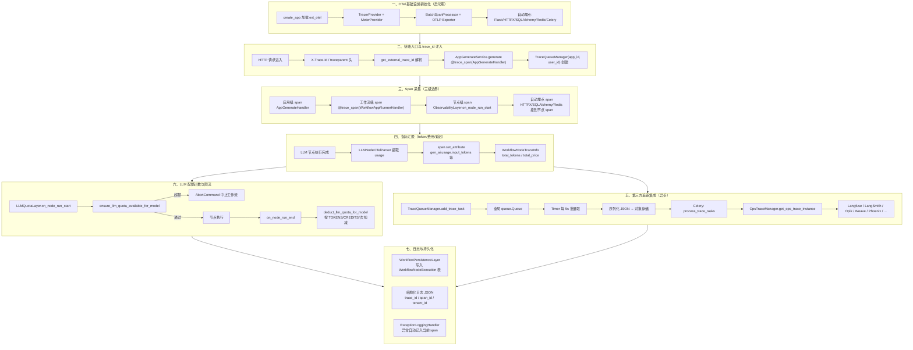
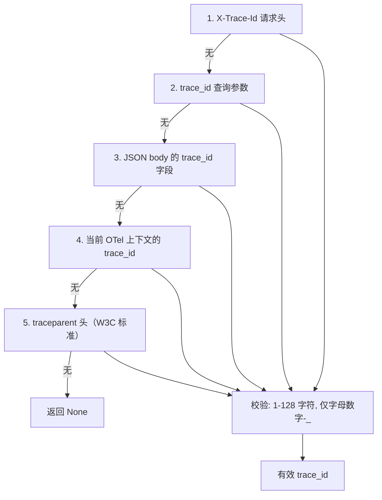
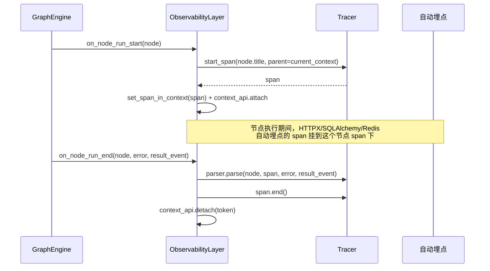
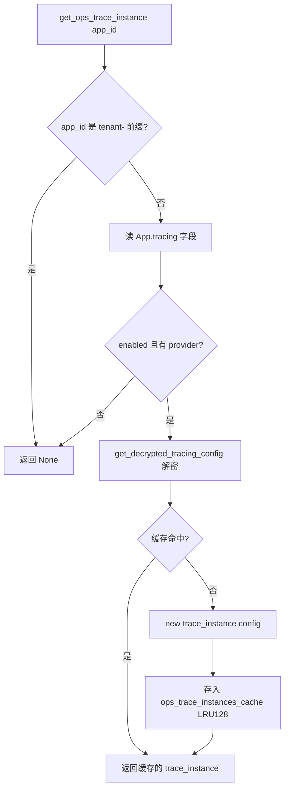
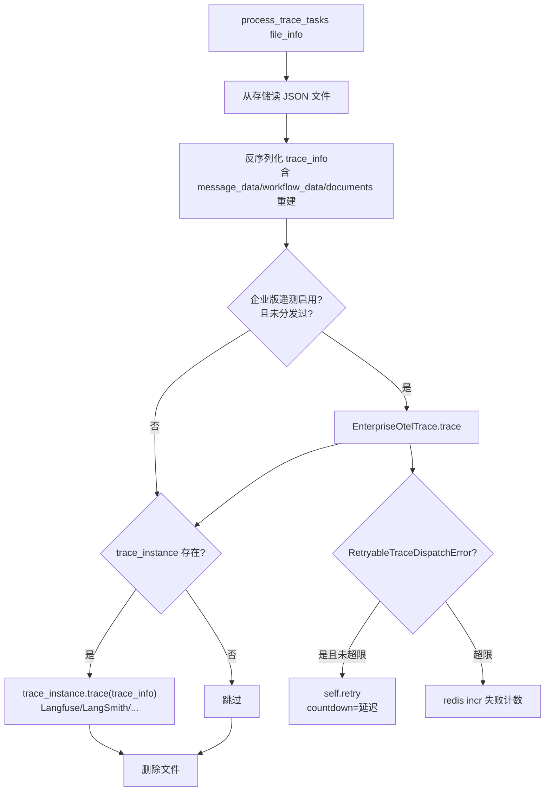
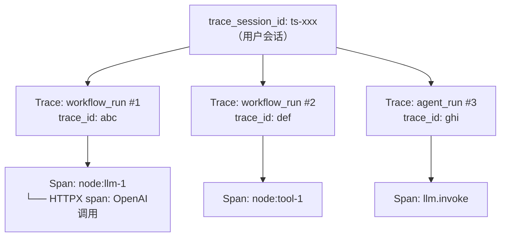
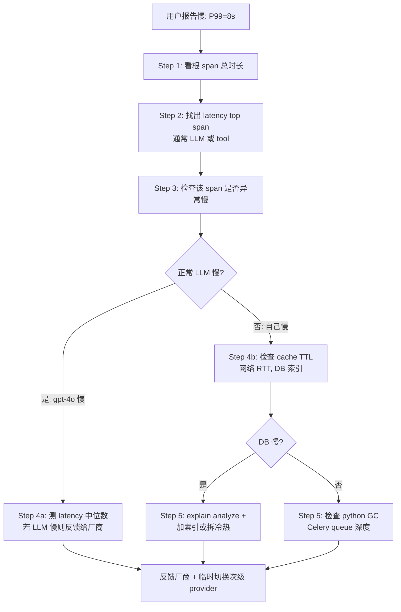

# 可观测性

> **学习目标**：理解 Dify 中 OpenTelemetry 链路追踪、遥测数据、LLM 调用追踪、工作流执行监控的完整实现，以及多种追踪提供商的集成方式。
>
> **读完本章你应该能回答**：
> - 可观测性的三大支柱（Tracing / Metrics / Logging）分别回答什么问题？
> - OpenTelemetry 在 Dify 可观测性体系中扮演什么角色？它和其他追踪提供商（Langfuse / Arize / MLflow）是什么关系？
> - Trace / Span 的层级关系如何设计？为什么工作流 > 节点 > LLM 调用是合适的层级？
> - Trace 的属性（attributes）和事件（events）有什么区别？分别传什么信息？
> - Dify 的 5+1 种追踪提供商集成方式有何不同？
> - LLM 专用追踪需要捕获哪些关键信息（model / tokens / latency / cost）？
> - 工作流节点追踪和 LLM 调用的关系：节点 span 是父，LLM span 是子？
> - 慢请求异常如何检测？告警阈值怎么定？
> - 调试一个"工作流跑得慢"的问题时，按什么顺序看 trace 数据？

## 本章要解决的问题

一次 LLM 应用调用不是一次 HTTP 请求那么简单。一个工作流可能串联十几个节点，每个节点可能调一次 LLM、一次工具、一次知识库检索；一个 Agent 可能在推理循环里跑五轮，每轮调不同工具。当生产环境用户反馈"这次回答慢了""这个应用烧钱太多""工具调用失败了"，如果没有一层专门的可观测基础设施，排查只能靠盲猜——打开日志翻几千行、在代码里加 print、对着数据库的 `message_tokens` 字段做加减法。

更尖锐的矛盾是**成本不可归因 + 配额无人拦截**。LLM 调用按 token 计费，一次工作流跑下来，到底哪个节点烧了 80% 的 token？哪个租户的免费配额已经用超了？没有配额层，一个失控的循环能在几分钟内烧掉一整天的预算。Dify 的可观测性层要同时回答四个问题：**链路怎么追（Tracing）、指标怎么量（Metrics）、日志怎么查（Logging）、配额怎么拦（Quota）**——这四个问题对应四条独立但交织的数据流，本章拆解它们如何在一个请求的生命周期里协同工作。

Dify 的解法是**双轨可观测**：一条轨道是 OpenTelemetry（OTel）实时 span——在进程内用 `TracerProvider` 创建 span 树，通过自动埋点（Flask/HTTPX/SQLAlchemy/Redis/Celery）把 HTTP 请求、DB 查询、LLM 调用都挂到同一棵 span 树上，经 OTLP 协议导出到 Jaeger/Tempo/Phoenix 等后端；另一条轨道是 `TraceQueueManager` 异步队列——把工作流执行、消息、工具调用、知识库检索等业务级 trace 信息序列化成 JSON 文件，丢给 Celery 异步分发到 Langfuse/LangSmith/Opik/Weave 等第三方 LLM 追踪平台。前者是"基础设施级"的分布式追踪，后者是"LLM 应用级"的追踪与成本分析。两条轨道在 `AppGenerateEntity.trace_manager` 字段汇合，共享同一个 `trace_id`。

## 宏观架构：可观测性的生命周期

下图是一次应用调用中可观测性数据从产生到落库的完整生命周期，也是全文的叙事主线——后续每一节对应生命周期的一个阶段。



理解这张图的关键：**两条数据流并行但目的不同**。OTel span 流（③→④）是实时的、进程内的、基础设施级的，回答"这次调用在哪个环节慢了/错了"；`TraceQueueManager` 流（⑤）是异步的、跨进程的、业务级的，回答"这个应用这个月烧了多少 token、哪个工具调用最贵"。配额层（⑥）是唯一有"拦截权"的组件——它能中止工作流；其余都是"只读观察者"。

下面按这七个阶段逐层展开。

## 一、OTel 基础设施初始化

**这一节为什么存在**：所有 span 都需要一个 `TracerProvider` 和导出器才能创建和上报。这个初始化发生在 Flask 应用启动期，是可观测性的物理基础——没有它，后续所有 `start_span` 调用都是空操作（OTel SDK 的 no-op 实现）。

### 1.1 扩展加载与启用条件

OTel 作为 Flask 扩展在 `create_app` 时加载（app_factory.py:203），位于扩展初始化列表的末尾——这保证数据库、Redis、存储等依赖先就绪：

```python
# app_factory.py:178-208 扩展列表（节选）
extensions = [
    ext_logging, ext_database, ext_redis, ext_storage,
    ext_celery, ext_login, ext_sentry,
    ...
    ext_otel,                # OTel 在这里
    ext_enterprise_telemetry,  # 企业版遥测紧跟其后
    ext_request_logging,
]
```

启用条件极其简单——只看一个全局开关（ext_otel.py:143）：

```python
def is_enabled():
    return dify_config.ENABLE_OTEL
```

`ENABLE_OTEL` 默认 `False`（otel_config.py:10），生产部署需显式设为 `True`。这个设计决策背后的逻辑：OTel 自动埋点会给每个 HTTP 请求、每次 DB 查询、每次 Redis 操作都创建 span，性能开销不容忽视；默认关闭让用户在明确需要时才开启，并配合 `OTEL_SAMPLING_RATE`（默认 0.1，即 10% 采样）控制成本。

> **注意**：`is_instrument_flag_enabled()`（runtime.py:100）是另一个独立的开关——它检查环境变量 `ENABLE_OTEL_FOR_INSTRUMENT=true`，用于"第三方非侵入式埋点代理"（如外部 Agent 挂载到 Dify 进程）与 Dify 手动埋点协调。`ObservabilityLayer` 和 `trace_span` 装饰器在判断是否启用时，都检查 `ENABLE_OTEL or is_instrument_flag_enabled()`，两条路径任一开启都生效。

### 1.2 TracerProvider 与导出器

`init_app`（ext_otel.py:14）做四件事：建 Resource、建 TracerProvider、配导出器、装自动埋点。

**Resource 是 span 的"身份证"**（ext_otel.py:57-71），遵循 OTel Semantic Conventions 1.32.0：

```python
resource = Resource(attributes={
    SERVICE_NAME: dify_config.APPLICATION_NAME,
    SERVICE_VERSION: f"dify-{dify_config.project.version}-{dify_config.COMMIT_SHA}",
    PROCESS_PID: os.getpid(),
    DEPLOYMENT_ENVIRONMENT_NAME: f"{dify_config.DEPLOY_ENV}-{dify_config.EDITION}",
    HOST_NAME: socket.gethostname(),
    HOST_ARCH: platform.machine(),
    OS_TYPE: platform.system().lower(),
    ...
})
```

这些属性会附加到该进程产生的每一个 span 上——在后端看 trace 时，能立刻知道"这条链路来自哪个环境、哪个版本、哪台机器"。

**采样器**（ext_otel.py:72）用 `ParentBasedTraceIdRatio(dify_config.OTEL_SAMPLING_RATE)`——`ParentBased` 的含义是：如果当前请求已有父 span 的采样决策（通过 `traceparent` 头传入），则继承父决策；否则按 `OTEL_SAMPLING_RATE` 概率采样。这保证跨服务链路要么全采、要么全不采，不会出现"父 span 有、子 span 没有"的断链。

**导出器**（ext_otel.py:79-120）支持两种协议：

| 配置 | 协议 | 端点来源 | 适用场景 |
|------|------|---------|---------|
| `OTEL_EXPORTER_TYPE=otlp` + `OTEL_EXPORTER_OTLP_PROTOCOL=grpc` | OTLP/gRPC | `OTLP_BASE_ENDPOINT` | 生产环境，吞吐高 |
| `OTEL_EXPORTER_TYPE=otlp` + `OTEL_EXPORTER_OTLP_PROTOCOL=http`（默认） | OTLP/HTTP | `OTLP_TRACE_ENDPOINT` / `OTLP_METRIC_ENDPOINT` | 开发环境，调试方便 |
| `OTEL_EXPORTER_TYPE=console`（其他） | 控制台打印 | — | 本地调试 |

gRPC 模式还自动检测 TLS：endpoint 以 `https://` 开头则用安全传输，否则 insecure（ext_otel.py:83）。若配了 `OTLP_API_KEY`，会以 `Authorization: Bearer <key>` 头注入（ext_otel.py:87-88）。

**BatchSpanProcessor**（ext_otel.py:122-130）是异步批量导出——span 先进队列，每 `OTEL_BATCH_EXPORT_SCHEDULE_DELAY`（默认 5000ms）批量发一次，队列上限 `OTEL_MAX_QUEUE_SIZE`（默认 2048），单批上限 `OTEL_MAX_EXPORT_BATCH_SIZE`（默认 512）。这种设计让 span 上报不阻塞业务线程，代价是最多有 5 秒延迟。

### 1.3 自动埋点

`init_instruments`（instrumentation.py:155）安装五类自动埋点：

| 埋点 | 作用 | Span 产出 |
|------|------|----------|
| FlaskInstrumentor | 每个 HTTP 请求一个 span | `GET /chat-messages` 等 |
| CeleryInstrumentor | 每个 Celery 任务一个 span | `process_trace_tasks` 等 |
| SQLAlchemyInstrumentor | 每条 SQL 查询一个 span | `SELECT ... FROM messages` |
| RedisInstrumentor | 每个 Redis 操作一个 span | `SET / GET / LPUSH` |
| HTTPXClientInstrumentor | 每个出站 HTTP 调用一个 span | LLM API 调用、Webhook |

关键设计：**Celery 埋点在非 worker 进程才装**（instrumentation.py:156），因为 worker 进程通过 `worker_init` 信号单独装（runtime.py:83-97）。这避免了在 worker 启动时重复初始化。

`ExceptionLoggingHandler`（instrumentation.py:58-101）是一个巧妙的设计——它挂到 Python 的 root logger 上，当任何代码 `logger.exception(...)` 时，自动把异常记录到**当前活跃的 span**（而非新建 span）：

```python
span = get_current_span()
if span and span.is_recording():
    span.set_status(StatusCode.ERROR, record.getMessage())
    span.add_event("log.exception", attributes={
        "log.level": record.levelname,
        "log.message": record.getMessage(),
        "log.logger": record.name,
    })
    span.record_exception(record.exc_info[1])
```

这意味着业务代码只需照常 `logger.exception()`，异常就自动出现在 trace 里——无需在每处 try/except 里手动 `span.record_exception()`。

## 二、链路入口与 trace_id 注入

**这一节为什么存在**：trace_id 是贯穿两条可观测轨道的"针"。没有它，OTel span 树和 TraceQueueManager 的异步 trace 任务无法关联，第三方平台看到的只是一堆孤立的 trace。这一阶段决定"一次请求的 trace_id 从哪来、怎么传下去"。

### 2.1 trace_id 的五个来源

`get_external_trace_id`（trace_id_helper.py:28）按优先级解析外部 trace_id：



第 4 个来源（OTel 上下文）值得注意——如果上游服务已经通过 OTel 注入了 trace 上下文（通过 `traceparent` 头自动传播），Dify 会直接复用这个 trace_id，让跨服务链路自然衔接。第 5 个来源是 W3C Trace Context 标准的 `traceparent` 头解析（trace_id_helper.py:191-205），格式为 `version-trace_id-span_id-flags`。

### 2.2 应用级 span 的创建

`AppGenerateService.generate` 是所有应用生成的统一入口，它用 `@trace_span(AppGenerateHandler)` 装饰（app_generate_service.py:89）：

```python
@classmethod
@trace_span(AppGenerateHandler)
def generate(cls, app_model, user, args, invoke_from, streaming=True, ...):
    ...
```

`AppGenerateHandler`（generate_handler.py:15）从方法参数里提取 `app_id`、`tenant_id`、`user_id`、`workflow_id`、`streaming`，作为 span 的起始属性：

```python
attributes = {
    DifySpanAttributes.APP_ID: app_id,
    DifySpanAttributes.TENANT_ID: tenant_id,
    GenAIAttributes.USER_ID: user_id,
    DifySpanAttributes.USER_TYPE: "Account" if isinstance(user, Account) else "EndUser",
    DifySpanAttributes.STREAMING: streaming,
    DifySpanAttributes.WORKFLOW_ID: workflow_id,
}
```

`trace_span` 装饰器（decorators/base.py:21）的关键逻辑：如果 `ENABLE_OTEL` 和 `is_instrument_flag_enabled()` 都未开启，直接调原函数跳过 span 创建——这是性能保护，让关闭 OTel 时零开销。

### 2.3 TraceQueueManager 的创建

在 `AgentChatAppGenerator.generate` 里（app_generator.py:160），紧跟配置组装之后，创建 `TraceQueueManager`：

```python
trace_manager = TraceQueueManager(app_model.id, user.id if isinstance(user, Account) else user.session_id)
```

这个 `trace_manager` 被塞进 `AppGenerateEntity.trace_manager` 字段（app_invoke_entities.py:147），随应用执行全程传递。它的构造（ops_trace_manager.py:1492）做两件事：

1. **解析该应用配置的第三方追踪实例**：`OpsTraceManager.get_ops_trace_instance(app_id)` 读取 `App.tracing` 字段（JSON，含 `enabled` 和 `tracing_provider`），如果启用且配置有效，从 `OpsTraceProviderConfigMap` 懒加载对应的 trace 实例（Langfuse/LangSmith 等）。
2. **启动全局定时器**：`trace_manager_timer` 是进程级单例，每 `TRACE_QUEUE_MANAGER_INTERVAL`（默认 5 秒）触发一次批量上报。

> **设计决策：为什么用全局队列而不是实例队列？** `trace_manager_queue` 是模块级全局变量（ops_trace_manager.py:1486）。所有 `TraceQueueManager` 实例共享同一个队列和同一个定时器。原因是：一个 HTTP 进程同时可能有多个应用在执行（不同 app_id），每个都有自己的 `TraceQueueManager`，但 Celery 上报只需一个批量通道——全局队列避免每个实例各起一个定时器线程。

## 三、Span 采集：三级边界

**这一节为什么存在**：一次应用调用跨越"HTTP 请求 → 应用生成 → 工作流执行 → 节点执行 → LLM 调用"多个层级。如果只有一个大 span，看不出哪个环节慢；如果每行代码一个 span，噪声淹没信号。Dify 设计了三级 span 边界——应用级、工作流级、节点级——刚好对应"一次用户请求"的三个自然边界。

### 3.1 应用级 span

由 `@trace_span(AppGenerateHandler)` 创建（见 ②）。这个 span 是整个请求的根 span，覆盖从 `AppGenerateService.generate` 入口到返回 SSE 流的全过程。属性包括 `dify.app_id`、`dify.tenant_id`、`gen_ai.user.id`、`dify.user_type`、`dify.streaming`、`dify.workflow_id`（generate_handler.py:43-50）。

### 3.2 工作流级 span

`WorkflowAppRunner.run` 和 `AdvancedChatAppRunner.run` 都用 `@trace_span(WorkflowAppRunnerHandler)` 装饰（app_runner.py:64、advanced_chat/app_runner.py:94）。`WorkflowAppRunnerHandler`（workflow_app_runner_handler.py:14）从 runner 实例的 `application_generate_entity` 提取属性：

```python
entity = runner.application_generate_entity
app_config = getattr(entity, "app_config", None)
attributes = {
    DifySpanAttributes.APP_ID: app_config.app_id,
    DifySpanAttributes.TENANT_ID: app_config.tenant_id,
    GenAIAttributes.USER_ID: entity.user_id,
    DifySpanAttributes.STREAMING: entity.stream,
    DifySpanAttributes.WORKFLOW_ID: app_config.workflow_id,
}
```

这个 span 是应用级 span 的子 span，是节点级 span 的父 span——它框定了"一次工作流执行"的完整边界。

### 3.3 节点级 span：ObservabilityLayer

这是可观测性层的核心。`ObservabilityLayer`（observability.py:42）是 GraphEngine 的一个 Layer，在 `WorkflowEntry.__init__` 里被注册到引擎（workflow_entry.py:234-236）：

```python
if dify_config.ENABLE_OTEL or is_instrument_flag_enabled():
    self.graph_engine.layer(ObservabilityLayer())
```

它只做两件事——节点开始时创建 span，节点结束时关闭 span：



**关键设计：为什么用 `context_api.attach` 而非 `with span`？** 因为节点执行是异步的——GraphEngine 调用 `node._run()` 后可能 yield 控制权，自动埋点（HTTPX、SQLAlchemy）发生在 node 执行的任意时刻。`set_span_in_context(span)` + `context_api.attach(token)` 把 span 设为当前上下文的活跃 span，这样自动埋点调 `get_current_span()` 时能拿到正确的节点 span。`on_node_run_end` 里 `context_api.detach(token)` 恢复上下文（observability.py:148-154）。

**为什么按 `node.title` 而非 `node.id` 命名 span？** 因为 `node.title` 是用户在 DSL 里给节点起的名字（如"调用 GPT-4o"），在 trace 可视化时人类可读；`node.id` 是 UUID，无意义。`node.execution_id`（每次执行的唯一 ID）作为 `node.execution_id` 属性记录，用于精确关联（observability.py:104）。

### 3.4 节点类型解析器：parser registry

`ObservabilityLayer` 内建一个 parser 注册表（observability.py:74-80），按节点类型分派不同的属性提取器：

```python
self._parsers = {
    BuiltinNodeTypes.TOOL: ToolNodeOTelParser(),
    BuiltinNodeTypes.LLM: LLMNodeOTelParser(),
    BuiltinNodeTypes.KNOWLEDGE_RETRIEVAL: RetrievalNodeOTelParser(),
}
```

未注册的节点类型走 `DefaultNodeOTelParser`。四个 parser 的职责分工：

| Parser | 适用节点 | 额外提取的属性 |
|--------|---------|---------------|
| `DefaultNodeOTelParser` | 所有未注册类型 | `node.id`、`node.execution_id`、`node.type`、`gen_ai.framework=dify`、`gen_ai.span.kind`、`input.value`、`output.value` |
| `LLMNodeOTelParser` | LLM 节点 | `gen_ai.request.model`、`gen_ai.provider.name`、`gen_ai.usage.input_tokens`、`gen_ai.usage.output_tokens`、`gen_ai.usage.total_tokens`、`gen_ai.prompt`、`gen_ai.completion`、`gen_ai.input.messages`、`gen_ai.output.messages` |
| `ToolNodeOTelParser` | 工具节点 | `gen_ai.tool.name`、`gen_ai.tool.type`、`gen_ai.tool.description`、`gen_ai.tool.call.arguments`、`gen_ai.tool.call.result` |
| `RetrievalNodeOTelParser` | 知识库检索节点 | `retrieval.query`、`retrieval.document`（含 score、id、metadata） |

`DefaultNodeOTelParser`（parser/base.py:96）还根据节点类型设置 `gen_ai.span.kind`：

```python
match node.node_type:
    case BuiltinNodeTypes.LLM:
        span.set_attribute(GenAIAttributes.SPAN_KIND, "LLM")
    case BuiltinNodeTypes.KNOWLEDGE_RETRIEVAL:
        span.set_attribute(GenAIAttributes.SPAN_KIND, "RETRIEVER")
    case BuiltinNodeTypes.TOOL:
        span.set_attribute(GenAIAttributes.SPAN_KIND, "TOOL")
    case _:
        span.set_attribute(GenAIAttributes.SPAN_KIND, "TASK")
```

这个分类遵循 OpenTelemetry GenAI Semantic Conventions，让 Jaeger/Phoenix 等后端能按 span kind 聚合统计。

**内容门控**（parser/base.py:26-33）：`should_include_content()` 在企业版（`ENTERPRISE_ENABLED=True`）且 `ENTERPRISE_INCLUDE_CONTENT=False` 时，不写入 prompt/completion/inputs/outputs 等内容属性——防止敏感数据泄露到 trace 后端。社区版始终写入。

## 四、指标汇聚：token / 费用 / 延迟

**这一节为什么存在**：span 只是"时间区间 + 属性"，但 LLM 应用的核心成本指标是 token 和费用。这一阶段说明这些指标从哪产生、怎么挂到 span 上、怎么传给第三方平台。

### 4.1 token 在 span 上的记录

LLM 节点执行完成后，`LLMNodeOTelParser.parse`（parser/llm.py:101）从 `node_run_result` 的 `process_data` 和 `outputs` 里提取 usage：

```python
usage_data = process_data.get("usage") or outputs.get("usage") or {}
model_name = process_data.get("model_name") or ""
model_provider = process_data.get("model_provider") or ""

if model_name:
    span.set_attribute(LLMAttributes.REQUEST_MODEL, model_name)
if model_provider:
    span.set_attribute(LLMAttributes.PROVIDER_NAME, model_provider)

if usage_data:
    span.set_attribute(LLMAttributes.USAGE_INPUT_TOKENS, usage_data.get("prompt_tokens", 0))
    span.set_attribute(LLMAttributes.USAGE_OUTPUT_TOKENS, usage_data.get("completion_tokens", 0))
    span.set_attribute(LLMAttributes.USAGE_TOTAL_TOKENS, usage_data.get("total_tokens", 0))
```

这些属性名遵循 GenAI Semantic Conventions（semconv/gen_ai.py:67-98）：`gen_ai.usage.input_tokens`、`gen_ai.usage.output_tokens`、`gen_ai.usage.total_tokens`。在 Phoenix/Langfuse 等后端，这些属性会被自动解析成"本次调用的 token 消耗"，可按 model/provider/tenant 聚合统计。

### 4.2 业务级 trace 信息的结构化

OTel span 是"基础设施级"的，而 `TraceQueueManager` 处理的是"业务级"的 trace 信息——后者包含完整的 message 内容、文件列表、工具参数、知识库文档等，结构更丰富。

`TraceTask.preprocess`（ops_trace_manager.py:767）是分发器，按 `trace_type` 路由到具体的 trace 方法。Dify 定义了 11 种 trace 类型（trace_entity.py:279-291）：

| TraceTaskName | 触发场景 | 产出结构 |
|---------------|---------|---------|
| `WORKFLOW_TRACE` | 工作流执行结束 | `WorkflowTraceInfo`：含 inputs/outputs/total_tokens/prompt_tokens/completion_tokens/elapsed_time |
| `MESSAGE_TRACE` | 消息完成 | `MessageTraceInfo`：含 message_tokens/answer_tokens/total_tokens/streaming 指标 |
| `NODE_EXECUTION_TRACE` | 节点执行结束（企业版） | `WorkflowNodeTraceInfo`：含 node_type/elapsed_time/total_tokens/total_price/model_provider/model_name |
| `TOOL_TRACE` | 工具调用完成 | `ToolTraceInfo`：含 tool_name/tool_inputs/tool_outputs/time_cost |
| `DATASET_RETRIEVAL_TRACE` | 知识库检索完成 | `DatasetRetrievalTraceInfo`：含 documents/embedding_models/rerank_model |
| `MODERATION_TRACE` | 敏感词审核 | `ModerationTraceInfo`：含 flagged/action/preset_response |
| `SUGGESTED_QUESTION_TRACE` | 推荐问题生成 | `SuggestedQuestionTraceInfo` |
| `GENERATE_NAME_TRACE` | 对话标题生成 | `GenerateNameTraceInfo` |
| `PROMPT_GENERATION_TRACE` | Prompt 生成（企业版） | `PromptGenerationTraceInfo`：含 latency/total_price/currency |
| `DRAFT_NODE_EXECUTION_TRACE` | 草稿节点执行（企业版） | `DraftNodeExecutionTrace` |
| `CONVERSATION_TRACE` | 对话 | 直接返回 kwargs |

### 4.3 workflow_trace 的 token 拆分

`TraceTask.workflow_trace`（ops_trace_manager.py:803）有一个关键的 token 拆分逻辑——`_calculate_workflow_token_split`（ops_trace_manager.py:668）：

```python
rows = session.execute(
    select(WorkflowNodeExecutionModel.outputs).where(
        WorkflowNodeExecutionModel.tenant_id == tenant_id,
        WorkflowNodeExecutionModel.workflow_run_id == workflow_run_id,
    )
).scalars().all()

for raw in rows:
    outputs = JSON_DICT_ADAPTER.validate_json(raw) if isinstance(raw, str) else raw
    usage = outputs.get("usage", {})
    prompt = usage.get("prompt_tokens")
    completion = usage.get("completion_tokens")
    if isinstance(prompt, (int, float)):
        total_prompt += int(prompt)
    if isinstance(completion, (int, float)):
        total_completion += int(completion)
```

为什么需要这个？因为 `WorkflowExecution.total_tokens` 只是一个总数，但第三方平台（如 Langfuse）需要区分 prompt_tokens 和 completion_tokens 来计算成本（两者价格不同）。这个方法遍历该工作流的所有 `WorkflowNodeExecution` 记录，从 `outputs.usage` 里累加出拆分值。注释说明它特意只 select `outputs` 列而非加载整个 JSON blob——避免加载大字段浪费内存。

### 4.4 流式指标提取

`message_trace` 还提取流式专属指标（ops_trace_manager.py:1466-1482）：

```python
def _extract_streaming_metrics(self, message_data) -> dict[str, Any]:
    metadata = JSON_DICT_ADAPTER.validate_json(message_data.message_metadata)
    usage = metadata.get("usage", {})
    return {
        "gen_ai_server_time_to_first_token": usage.get("time_to_first_token"),
        "llm_streaming_time_to_generate": usage.get("time_to_generate"),
        "is_streaming_request": time_to_first_token is not None,
    }
```

`time_to_first_token`（首 token 延迟）和 `time_to_generate`（总生成时间）是 LLM 应用的关键体验指标——前者影响用户感知的"响应速度"，后者影响吞吐。这些指标在 `MessageTraceInfo`（trace_entity.py:118-120）里携带，最终传给第三方平台。

## 五、第三方追踪提供商集成

**这一节为什么存在**：OTel span 经 OTLP 协议导出，适合 Jaeger/Tempo/Phoenix 等通用 trace 后端。但 LLM 应用生态里有大量专用追踪平台（Langfuse、LangSmith、Opik、Weave、MLflow），它们提供 prompt 管理、成本分析、A/B 测试等 LLM 专属功能。Dify 通过 `OpsTraceManager` 集成这些平台，让用户按应用配置切换。

### 5.1 提供商注册表：OpsTraceProviderConfigMap

`OpsTraceProviderConfigMap`（ops_trace_manager.py:223）是一个惰性加载的注册表，覆盖 **10 种**追踪提供商：

| 枚举值 | 包名 | 配置类 | secret_keys |
|--------|------|--------|-------------|
| `LANGFUSE` | `dify_trace_langfuse` | `LangfuseConfig` | `public_key`, `secret_key` |
| `LANGSMITH` | `dify_trace_langsmith` | `LangSmithConfig` | `api_key` |
| `OPIK` | `dify_trace_opik` | `OpikConfig` | `api_key` |
| `WEAVE` | `dify_trace_weave` | `WeaveConfig` | `api_key` |
| `ARIZE` | `dify_trace_arize_phoenix` | `ArizeConfig` | `api_key`, `space_id` |
| `PHOENIX` | `dify_trace_arize_phoenix` | `PhoenixConfig` | `api_key` |
| `ALIYUN` | `dify_trace_aliyun` | `AliyunConfig` | `license_key` |
| `MLFLOW` | `dify_trace_mlflow` | `MLflowConfig` | `password` |
| `DATABRICKS` | `dify_trace_mlflow` | `DatabricksConfig` | `personal_access_tokens`, `client_secret` |
| `TENCENT` | `dify_trace_tencent` | `TencentConfig` | `token` |

> **注意**：这些 `dify_trace_*` 包是独立的 pip 包（Dify 插件生态的一部分），不在主仓库内。`OpsTraceProviderConfigMap.__getitem__` 用 `try/except ImportError` 包裹懒加载（ops_trace_manager.py:335-336），未安装的包会抛 `ImportError("Provider X is not installed.")`。

### 5.2 配置加密与缓存

追踪配置涉及 API Key 等敏感信息，存储在 `TraceAppConfig` 表里，必须加密。`OpsTraceManager.encrypt_tracing_config`（ops_trace_manager.py:348）在保存配置时：

1. 从 `secret_keys` 列表取出需要加密的字段（如 Langfuse 的 `public_key`、`secret_key`）。
2. 若值里含 `*`（前端回显的掩码），保留原值不动（避免覆盖已有密钥）。
3. 否则调 `encrypt_token(tenant_id, value)` 加密。
4. `other_keys`（如 `host`、`project`）明文存储。
5. 用配置类（如 `LangfuseConfig`）校验后 `model_dump()` 存库。

解密走双重检查锁缓存（ops_trace_manager.py:387-430）——`decrypted_configs_cache` 是 `LRUCache(maxsize=128)`，key 是 `(tenant_id, provider, config_json)`。相同配置的解密只算一次。

### 5.3 trace 实例的获取

`get_ops_trace_instance`（ops_trace_manager.py:486）是入口，按 app_id 解析：



`ops_trace_instances_cache`（ops_trace_manager.py:343）是 `LRUCache(maxsize=128)`——同一个应用相同配置的 trace 实例只创建一次，避免每次请求都 new 一个 Langfuse client。

### 5.4 异步分发：TraceQueueManager → Celery

这是第三方集成的核心数据流。`TraceQueueManager.add_trace_task`（ops_trace_manager.py:1506）只做一件事——把 `TraceTask` 丢进全局 `trace_manager_queue`：

```python
def add_trace_task(self, trace_task: TraceTask):
    if self._enterprise_telemetry_enabled or self.trace_instance:
        trace_task.app_id = self.app_id
        trace_manager_queue.put(trace_task)
```

> **门控条件**：`self._enterprise_telemetry_enabled or self.trace_instance`——只有企业版遥测开启或该应用配了第三方 provider 时才入队，否则直接丢弃，零开销。

定时器每 5 秒触发 `run`（ops_trace_manager.py:1526），批量取最多 `TRACE_QUEUE_MANAGER_BATCH_SIZE`（默认 100）个任务，调 `send_to_celery`（ops_trace_manager.py:1542）：

```python
def send_to_celery(self, tasks: list[TraceTask]):
    with self.flask_app.app_context():
        for task in tasks:
            storage_id = task.app_id or f"tenant-{tenant_id}"
            file_id = uuid4().hex
            trace_info = task.execute()  # 执行 preprocess，构建 trace_info
            task_data = TaskData(
                app_id=storage_id,
                trace_info_type=type(trace_info).__name__,
                trace_info=trace_info.model_dump_json()...
            )
            file_path = f"{OPS_FILE_PATH}{storage_id}/{file_id}.json"
            storage.save(file_path, task_data.model_dump_json().encode("utf-8"))
            process_trace_tasks.delay(file_info)  # 丢给 Celery
```

**为什么先写文件再交 Celery？** 因为 trace 信息可能很大（含完整 prompt、工具输出、文档列表），直接作为 Celery 参数传会有大小限制。写文件后只传 `(file_id, app_id)` 给 Celery，worker 再从存储读回。文件路径 `ops_trace/{app_id}/{file_id}.json`。

### 5.5 Celery worker 的分发逻辑

`process_trace_tasks`（ops_trace_task.py:47）是 Celery 任务，队列名 `ops_trace`：



**可重试分发**（ops_trace_task.py:95-126）：`RetryableTraceDispatchError` 是特殊的可重试异常——例如 Phoenix 嵌套工作流追踪时，外层工作流的父 span context 异步发布，可能比内层 trace 晚到。此时 provider 抛 `RetryableTraceDispatchError` 而非丢弃 trace，Celery 按 `OPS_TRACE_RETRYABLE_DISPATCH_MAX_RETRIES` 重试。这个设计保证 trace 不会因时序问题丢失。

## 六、LLM 配额计数与限流

**这一节为什么存在**：可观测性是"观察"，但配额管理是"拦截"——它是唯一能中止工作流的可观测组件。没有它，一个失控的 Agent 循环能在几分钟内烧光租户的 LLM 预算。这一阶段说明配额如何在节点执行前后被检查和扣减。

### 6.1 LLMQuotaLayer 的工作时机

`LLMQuotaLayer`（llm_quota.py:37）在 `WorkflowEntry.__init__` 里无条件注册（workflow_entry.py:232）——不像 `ObservabilityLayer` 那样受 `ENABLE_OTEL` 控制，因为配额拦截是业务必需，不是可选观察。

它覆盖三类节点（llm_quota.py:27-33）：

```python
_QUOTA_NODE_TYPES = frozenset([
    BuiltinNodeTypes.LLM,
    BuiltinNodeTypes.PARAMETER_EXTRACTOR,
    BuiltinNodeTypes.QUESTION_CLASSIFIER,
])
```

这三类节点背后都会调 LLM，因此都纳入配额管理。

### 6.2 前置检查：on_node_run_start

节点执行前（llm_quota.py:61-84）：

```python
def on_node_run_start(self, node: Node) -> None:
    if not self._supports_quota(node):
        return

    model_identity = self._extract_model_identity_from_node(node)
    if model_identity is None:
        reason = "LLM quota check requires public node model identity before execution."
        self._abort_before_node_run(node=node, reason=reason, error_type="LLMQuotaIdentityError")
        return

    provider, model_name = model_identity
    try:
        ensure_llm_quota_available_for_model(
            tenant_id=self.tenant_id, provider=provider, model=model_name,
        )
    except QuotaExceededError as exc:
        self._abort_before_node_run(node=node, reason=str(exc), error_type=QuotaExceededError.__name__)
```

**关键设计决策：缺身份即中止**。如果节点的 model 配置缺失（`model_identity is None`），不是跳过配额检查，而是**中止执行**并报 `LLMQuotaIdentityError`。注释（llm_quota.py:8-12）解释：从节点的**公开配置**解析 provider/model 身份，而非依赖在工作流层重建 `ModelInstance`——这保证配额处理永远不会被静默跳过。

**中止的方式**不是抛异常（那会中断整个图），而是把节点的 `_run` 替换成一个直接返回 `FAILED` 状态的函数（llm_quota.py:128-137）：

```python
def _abort_before_node_run(self, *, node, reason, error_type):
    self._set_stop_event(node)
    node.node_data.error_strategy = None
    node.node_data.retry_config.retry_enabled = False

    def quota_aborted_run() -> NodeRunResult:
        return NodeRunResult(
            status=WorkflowNodeExecutionStatus.FAILED,
            error=reason,
            error_type=error_type,
        )
    node._run = quota_aborted_run  # 替换节点的 run 方法
    self._send_abort_command(reason=reason)
```

同时发 `AbortCommand`（llm_quota.py:144-157）通知 GraphEngine 中止后续节点调度。`_abort_sent` 标志保证只发一次。

### 6.3 后置扣减：on_node_run_end

节点成功完成后（llm_quota.py:87-115）：

```python
def on_node_run_end(self, node, error, result_event=None):
    if error is not None or not isinstance(result_event, NodeRunSucceededEvent):
        return

    model_identity = self._extract_model_identity_from_result_event(result_event)
    provider, model_name = model_identity

    try:
        deduct_llm_quota_for_model(
            tenant_id=self.tenant_id,
            provider=provider,
            model=model_name,
            usage=result_event.node_run_result.llm_usage,
        )
    except QuotaExceededError as exc:
        self._set_stop_event(node)
        self._send_abort_command(reason=str(exc))
    except Exception:
        logger.exception("LLM quota deduction failed, node_id=%s", node.id)
```

> **注意身份来源不同**：前置检查从 `node.node_data.model`（配置）提取身份；后置扣减从 `result_event.node_run_result.inputs`（执行结果）提取（llm_quota.py:164-169）。因为执行后可能 model 被运行时解析成不同值（如负载均衡选择的实例），用执行结果的身份更准确。

### 6.4 配额扣减的三种计量单位

`deduct_llm_quota_for_model`（quota.py:148）调用 `_resolve_llm_used_quota`（quota.py:51）按配额类型决定扣减量：

| QuotaUnit | 扣减量 | 适用场景 |
|-----------|--------|---------|
| `TOKENS` | `usage.total_tokens` | 按 token 计费（默认） |
| `CREDITS` | `dify_config.get_model_credits(model)` | 按 model 的 credits 系数 |
| 其他 | `1` | 按次计费 |

配额限制为 `-1` 时表示无限制（quota.py:58-60），直接返回 `None` 不扣减。

扣减按 provider 类型分三种路径（quota.py:114-145）：

- **TRIAL / PAID**：调 `CreditPoolService.deduct_credits_capped` 从信用池扣减（带 cap，不会扣成负数）。
- **FREE**：走 `_deduct_free_llm_quota`（quota.py:75），直接在 `Provider` 表的 `quota_used` 字段上 `UPDATE ... WITH FOR UPDATE` 行锁扣减。若扣减后超出限制，标记 `quota_exceeded=True` 并抛 `QuotaExceededError`。
- **非 SYSTEM provider**（用户自配 API Key）：直接 return，不扣减（因为 Dify 不为此付费）。

## 七、日志与持久化

**这一节为什么存在**：span 和 trace 信息是"运行时"的，但生产排查还需要"事后可查"的持久化记录。这一阶段说明可观测性数据如何落到数据库和日志文件。

### 7.1 WorkflowPersistenceLayer：节点执行落库

`WorkflowPersistenceLayer`（persistence.py:80）是 GraphEngine 的另一个 Layer，负责把工作流和节点执行状态写入 `WorkflowExecution` 和 `WorkflowNodeExecution` 表。它与 `ObservabilityLayer` 并行工作——后者写 OTel span，前者写数据库。

它还承担 trace 任务的入队职责。工作流执行完成时（成功/失败/中止），`_enqueue_trace_task`（persistence.py:414）构建 `TraceTask(WORKFLOW_TRACE)` 并交给 `trace_manager`：

```python
def _enqueue_trace_task(self, execution: WorkflowExecution) -> None:
    if not self._trace_manager:
        return

    conversation_id = self._system_variables().get(SystemVariableKey.CONVERSATION_ID.value)
    external_trace_id = extras.get("external_trace_id")
    trace_session_id = extras.get("trace_session_id")
    parent_trace_context = extras.get("parent_trace_context")

    trace_task = TraceTask(
        TraceTaskName.WORKFLOW_TRACE,
        workflow_execution=execution,
        conversation_id=conversation_id,
        user_id=self._trace_manager.user_id,
        external_trace_id=external_trace_id,
        trace_session_id=trace_session_id,
        parent_trace_context=parent_trace_context,
    )
    self._trace_manager.add_trace_task(trace_task)
```

> **跨工作流 trace 关联**：`parent_trace_context`（`ParentTraceContext` 类型，trace_id_helper.py:10）携带 `parent_workflow_run_id` 和 `parent_node_execution_id`，用于工具节点调用嵌套工作流时，把内层工作流的 trace 挂到外层工作流的 span 树下。`BaseTraceInfo.resolved_parent_context`（trace_entity.py:52-78）解析这个上下文，让 Langfuse 等平台能展示嵌套工作流的父子关系。

### 7.2 trace_session_id：多轮对话的关联

`trace_session_id`（trace_id_helper.py:93-112）是一个用户可控的会话标识，通过 `X-Trace-Session-Id` 头、`trace_session_id` 查询参数或 JSON body 传入。它不同于 `trace_id`（单次请求级），而是跨多次请求的会话级标识：



这个标识被写入 `WorkflowTraceInfo.metadata.trace_session_id`（ops_trace_manager.py:883-885）和 `MessageTraceInfo.metadata`，让第三方平台能把同一用户的多次调用关联成一条会话链路。校验规则（trace_id_helper.py:81-90）：必须是字符串，trim 后 1-200 字符，否则抛 `BadRequest`。

### 7.3 结构化日志

Dify 的日志采用 JSON 结构化格式，关键字段与 trace 上下文关联：

```json
{
  "timestamp": "2026-07-04T12:34:56.789Z",
  "level": "INFO",
  "logger": "api.core.workflow.workflow_run",
  "message": "workflow node executed",
  "trace_id": "0af7651916cd43dd8448eb211c80319c",
  "span_id": "b7ad6b7169203331",
  "tenant_id": "tenant-uuid-12345",
  "app_id": "app-uuid-09876",
  "workflow_run_id": "wf-run-uuid-111213",
  "node_id": "node-llm-1",
  "duration_ms": 1234,
  "status": "success"
}
```

`trace_id` 和 `span_id` 由 OTel 上下文注入——当 `ExceptionLoggingHandler`（见 ①）捕获到日志时，它同时把异常记入当前 span，让日志和 trace 双向可查。

### 7.4 DebugLoggingLayer：调试期详细日志

在 `DEBUG` 模式下，`WorkflowEntry.__init__` 还会注册 `DebugLoggingLayer`（workflow_entry.py:216-225）：

```python
if dify_config.DEBUG:
    debug_layer = DebugLoggingLayer(
        level="DEBUG",
        include_inputs=True,
        include_outputs=True,
        include_process_data=False,  # 中间数据太冗长
        logger_name=f"GraphEngine.Debug.{workflow_id[:8]}",
    )
    self.graph_engine.layer(debug_layer)
```

这个 Layer（来自 Graphon 引擎）在节点开始/结束时打印输入输出，logger 名字带 workflow_id 前缀，方便按工作流过滤。`include_process_data=False` 是有意的——process_data 可能包含完整 prompt 和中间变量，打印出来会淹没日志。

### 7.5 企业版遥测

企业版有额外的遥测层，通过 `ext_enterprise_telemetry` 扩展（ext_enterprise_telemetry.py:32）初始化 `EnterpriseExporter` 单例。`TelemetryCase` 枚举定义了两类信号（gateway.py:70-88）：

- **TRACE 类**（CE 也可用）：`WORKFLOW_RUN`、`MESSAGE_RUN`、`TOOL_EXECUTION`、`MODERATION_CHECK`、`DATASET_RETRIEVAL` 等，走 `TraceQueueManager`。
- **METRIC_LOG 类**（仅 EE）：`APP_CREATED`、`APP_UPDATED`、`APP_DELETED`、`FEEDBACK_CREATED`，走独立的 Celery 队列 `process_enterprise_telemetry`。

`emit` 函数（gateway.py:151）是统一路由入口——按 `TelemetryCase` 查 `CaseRoute`，判断是 TRACE 还是 METRIC_LOG，再分流到对应管道。CE 模式下 EE-only 的 case 被静默丢弃（gateway.py:171-173）。

## 收敛

### 边界：两条轨道的分工

| 维度 | OTel span 轨道 | TraceQueueManager 轨道 |
|------|---------------|----------------------|
| 数据级别 | 基础设施级（HTTP/DB/Redis/LLM） | 业务级（工作流/消息/工具/检索） |
| 时效性 | 实时（进程内 span，5s 批量导出） | 异步（Celery 队列，5s 取 + Celery 处理） |
| 协议 | OTLP（gRPC/HTTP） | 自定义 JSON 文件 + Celery |
| 后端 | Jaeger/Tempo/Phoenix/任何 OTLP 兼容 | Langfuse/LangSmith/Opik/Weave/MLflow/... |
| 配置 | 全局 `ENABLE_OTEL` | 按应用 `App.tracing` 字段 |
| 内容 | span attributes（语义约定） | 完整 message/prompt/tool I/O |
| 拦截权 | 无（只读） | 无（只读） |

**不该在这里做的事**：用 OTel span 传完整 prompt 内容（span 有大小限制，且不是为此设计）；用 TraceQueueManager 做实时告警（异步延迟 5s+，不够实时）。两者互补——OTel 答"哪里慢了"，TraceQueue 答"这次调用烧了多少钱"。

### 扩展点

1. **新增追踪提供商**：实现 `dify_trace_*` 包（提供 `Config` 类和 `DataTrace` 类），在 `OpsTraceProviderConfigMap.__getitem__` 加一个 `case` 分支。
2. **新增节点类型 parser**：继承 `NodeOTelParser` Protocol，实现 `parse` 方法，在 `ObservabilityLayer._build_parser_registry` 注册。
3. **新增 span handler**：继承 `SpanHandler`，实现 `wrapper` 方法，用 `@trace_span(YourHandler)` 装饰目标函数。
4. **新增配额节点类型**：在 `llm_quota.py` 的 `_QUOTA_NODE_TYPES` frozenset 里加节点类型。

### 本章要点

1. **双轨可观测**：OTel span（实时、基础设施级）+ TraceQueueManager（异步、业务级），共享 `trace_id` 关联。
2. **OTel 初始化只看 `ENABLE_OTEL` 一个开关**：默认关闭，采样率默认 10%，自动埋点覆盖 Flask/HTTPX/SQLAlchemy/Redis/Celery 五类。
3. **三级 span 边界**：应用级（`AppGenerateHandler`）→ 工作流级（`WorkflowAppRunnerHandler`）→ 节点级（`ObservabilityLayer`），节点 span 用 `context_api.attach` 让自动埋点自动挂载。
4. **节点类型 parser 注册表**：LLM/Tool/Retrieval 三类有专用 parser，其余走 Default，遵循 GenAI Semantic Conventions。
5. **10 种第三方追踪提供商**：通过 `OpsTraceProviderConfigMap` 惰性加载 `dify_trace_*` 包，配置加密存储，trace 实例 LRU 缓存。
6. **异步分发链路**：`add_trace_task` → 全局队列 → 5s 定时器批量取 → 写 JSON 文件 → Celery `process_trace_tasks` → provider.trace()，支持 `RetryableTraceDispatchError` 重试。
7. **LLMQuotaLayer 是唯一有拦截权的组件**：三类节点（LLM/ParameterExtractor/QuestionClassifier）前置 `ensure_llm_quota_available_for_model` 检查，后置 `deduct_llm_quota_for_model` 扣减，超额时替换 `_run` 并发 `AbortCommand`。
8. **配额三计量单位**：TOKENS（按 token）、CREDITS（按 model 系数）、按次；FREE 走行锁扣减，TRIAL/PAID 走信用池。

### 推荐源码入口

| 文件 | 职责 |
|------|------|
| api/extensions/ext_otel.py | OTel 扩展初始化：TracerProvider、导出器、自动埋点 |
| api/extensions/otel/instrumentation.py | 五类自动埋点 + ExceptionLoggingHandler |
| api/extensions/otel/runtime.py | 上下文传播、Celery worker 初始化、`is_instrument_flag_enabled` |
| api/extensions/otel/decorators/base.py | `trace_span` 装饰器 |
| api/extensions/otel/decorators/handlers/generate_handler.py | 应用级 span handler |
| api/extensions/otel/decorators/handlers/workflow_app_runner_handler.py | 工作流级 span handler |
| api/extensions/otel/parser/ | 节点类型 parser：base/llm/tool/retrieval |
| api/extensions/otel/semconv/ | Dify 与 GenAI 语义约定定义 |
| api/core/app/workflow/layers/observability.py | 节点级 OTel span 创建与关闭 |
| api/core/app/workflow/layers/llm_quota.py | LLM 配额前置检查 + 后置扣减 |
| api/core/app/workflow/layers/persistence.py | 工作流/节点执行落库 + trace 任务入队 |
| api/core/ops/ops_trace_manager.py | `OpsTraceManager`、`TraceTask`、`TraceQueueManager`、提供商注册表 |
| api/core/ops/entities/trace_entity.py | 11 种 TraceInfo 数据模型 + TraceTaskName 枚举 |
| api/core/ops/entities/config_entity.py | TracingProviderEnum（10 种提供商）+ BaseTracingConfig |
| api/core/app/llm/quota.py | `ensure_llm_quota_available_for_model` / `deduct_llm_quota_for_model` |
| api/core/helper/trace_id_helper.py | trace_id 解析、trace_session_id 校验、parent_trace_context |
| api/core/telemetry/gateway.py | 企业版遥测统一路由：TelemetryCase → CaseRoute |
| api/tasks/ops_trace_task.py | Celery 任务：异步分发 trace 到第三方 provider |
| api/core/workflow/workflow_entry.py | Layer 注册：DebugLoggingLayer / ExecutionLimitsLayer / LLMQuotaLayer / ObservabilityLayer |
| api/core/callback_handler/agent_tool_callback_handler.py | Agent 工具调用的 trace 回调 |

---

## 附录

### A. OTel 配置项全表

`OTelConfig`（otel_config.py）定义所有 OTel 相关配置：

| 配置项 | 默认值 | 说明 |
|--------|--------|------|
| `ENABLE_OTEL` | `False` | 全局开关 |
| `OTLP_TRACE_ENDPOINT` | `""` | OTLP/HTTP trace 端点（空则用 `OTLP_BASE_ENDPOINT + /v1/traces`） |
| `OTLP_METRIC_ENDPOINT` | `""` | OTLP/HTTP metric 端点 |
| `OTLP_BASE_ENDPOINT` | `http://localhost:4318` | OTLP 基础端点 |
| `OTLP_API_KEY` | `""` | OTLP 鉴权 API Key |
| `OTEL_EXPORTER_TYPE` | `otlp` | 导出器类型（`otlp` 或 `console`） |
| `OTEL_EXPORTER_OTLP_PROTOCOL` | `http` | OTLP 协议（`grpc` 或 `http`） |
| `OTEL_SAMPLING_RATE` | `0.1` | 采样率（0.0-1.0） |
| `OTEL_BATCH_EXPORT_SCHEDULE_DELAY` | `5000` | 批量导出间隔（ms） |
| `OTEL_MAX_QUEUE_SIZE` | `2048` | span 队列上限 |
| `OTEL_MAX_EXPORT_BATCH_SIZE` | `512` | 单批上限 |
| `OTEL_METRIC_EXPORT_INTERVAL` | `60000` | metric 导出间隔（ms） |
| `OTEL_BATCH_EXPORT_TIMEOUT` | `10000` | 批量导出超时（ms） |
| `OTEL_METRIC_EXPORT_TIMEOUT` | `30000` | metric 导出超时（ms） |

### B. GenAI Semantic Conventions 属性表

Dify 遵循的 span 属性命名规范（semconv/gen_ai.py）：

| 类别 | 属性名 | 说明 |
|------|--------|------|
| **通用** | `gen_ai.framework` | 固定 `dify` |
| | `gen_ai.span.kind` | `LLM` / `RETRIEVER` / `TOOL` / `TASK` |
| | `gen_ai.user.id` | 用户 ID |
| **LLM** | `gen_ai.request.model` | 模型名 |
| | `gen_ai.provider.name` | 提供商名 |
| | `gen_ai.usage.input_tokens` | prompt token 数 |
| | `gen_ai.usage.output_tokens` | completion token 数 |
| | `gen_ai.usage.total_tokens` | 总 token 数 |
| | `gen_ai.prompt` | 完整 prompt（JSON） |
| | `gen_ai.completion` | 完整 completion |
| | `gen_ai.input.messages` | 结构化输入消息 |
| | `gen_ai.output.messages` | 结构化输出消息 |
| | `gen_ai.response.finish_reason` | 结束原因 |
| **Tool** | `gen_ai.tool.name` | 工具名 |
| | `gen_ai.tool.type` | 工具类型 |
| | `gen_ai.tool.description` | 工具描述 |
| | `gen_ai.tool.call.arguments` | 工具调用参数 |
| | `gen_ai.tool.call.result` | 工具调用结果 |
| **Retriever** | `retrieval.query` | 检索查询 |
| | `retrieval.document` | 检索文档列表 |
| **Dify 专属** | `dify.app_id` | 应用 ID |
| | `dify.tenant_id` | 租户 ID |
| | `dify.workflow_id` | 工作流 ID |
| | `dify.user_type` | 用户类型（Account/EndUser） |
| | `dify.streaming` | 是否流式 |
| | `dify.invoke_from` | 调用来源 |
| | `dify.invoked_by` | 调用者标识 |

### C. OTel 接入外部系统配置

| 后端 | 协议 | 配置示例 |
|------|------|---------|
| **Arize Phoenix** | OTLP/HTTP | `OTEL_EXPORTER_TYPE=otlp` `OTLP_BASE_ENDPOINT=http://phoenix:6006` |
| **Datadog** | OTLP/HTTP | `OTLP_BASE_ENDPOINT=http://datadog:4317` `OTLP_API_KEY=xxx` |
| **Grafana Tempo** | OTLP/gRPC | `OTEL_EXPORTER_OTLP_PROTOCOL=grpc` `OTLP_BASE_ENDPOINT=tempo:4317` |
| **Jaeger** | OTLP（推荐） | `OTLP_BASE_ENDPOINT=jaeger:4317` |
| **New Relic** | OTLP/HTTP | `OTLP_API_KEY=<license_key>` `OTLP_BASE_ENDPOINT=https://otlp.nr-data.net` |
| **SigNoz** | OTLP | `OTLP_BASE_ENDPOINT=signoz:4317` |

> **迁移提示**：OTLP 是新版标准，原生 Jaeger/Zipkin 协议逐渐退出。生产部署优先 OTLP/gRPC。

### D. Trace 分析：从 Span 到瓶颈的 5 步法

OTel trace 的每一棵 span 树都揭示一个调用链。下面是分析 latency spike 的标准五步法：

```mermaid
gantt
    title 一次 Chat API 调用的 span 分解（3000ms 总）
    dateFormat X
    axisFormat %s s

    section API
    HTTP 接收              :a1, 0, 30
    JWT 认证                :a2, 30, 20
    DB 加载 App            :a3, 50, 40

    section Agent
    ToolManager 加载       :b1, 90, 100
    拼装 prompt            :b2, 190, 80

    section LLM
    嵌入查询编码           :c1, 270, 50
    OpenAI 调用 (gpt-4o)   :crit, c2, 320, 1800
    解码                   :c3, 2120, 100

    section Tool
    google_search 调用      :d1, 2220, 600
    解析 + 回写            :d2, 2820, 80

    section 收尾
    DB 写入 Message        :e1, 2900, 80
    SSE 返回               :e2, 2980, 20
```





### E. 黄金信号（Golden Signals）仪表盘

| Golden Signal | 指标 | 推荐阈值 | 异常排查 |
|----------------|------|----------|----------|
| **Latency** | `histogram_quantile(0.99, http_request_duration_seconds)` | chat P99 <  3s | 看是否 embedding 命中低 / DB 慢 |
| **Traffic** | `rate(dify_http_requests_total[5m])` | 日活 × N | 排 Kubernetes HPA |
| **Errors** | `rate(dify_errors_total[5m]) / rate(dify_http_requests_total[5m])` | <  0.5% | 看 traces 错误 span |
| **Saturation** | `celery_queue_length{queue="ops_trace"}` | <  1000 | 临时加 worker 数 |

### F. 日志搜索 Recipes

```bash
# 1. 找出今天最慢的 100 条 LLM 调用（从 OTel 导出的日志）
jq -r 'select(.duration_ms != null) | [.timestamp, .duration_ms, .node_id] | @tsv' \
    logs/api.log | sort -k2 -nr | head -100

# 2. 统计每个租户 token 消耗
psql -c "SELECT tenant_id, sum(total_price), sum(total_tokens) \
    FROM message_agent_thoughts \
    WHERE created_at > now() - interval '1 day' \
    GROUP BY tenant_id ORDER BY sum(total_price) DESC LIMIT 20;"

# 3. 找出 trace 失败计数（RetryableTraceDispatchError 耗尽）
redis-cli get "FAILED_OPS_TRACE_<app_id>"

# 4. 列出 ERROR 状态的文档批
psql -c "SELECT id, name, error FROM documents \
    WHERE indexing_status='error' AND created_at > now() - interval '1 hour';"

# 5. 找出配额超限事件
jq -r 'select(.message | contains("LLM quota")) | [.timestamp, .tenant_id, .message] | @tsv' \
    logs/api.log | head -20

# 6. 统计 P99 chat API 延迟
jq -r 'select(.path=="/chat-messages" and .status==200) | .duration_ms' logs/api.log \
    | awk '{a[NR]=$1} END{print a[int(NR*0.99)]}'

# 7. 找出反复 401 OAuth 失败
jq -r 'select(.event=="oauth_refresh_failed") | .tenant_id' logs/auth.log | sort | uniq -c | sort -rn
```

### G. 容量告警与压力测试

容量预估公式：

```
peak_qps = (DAU × active_rate × chat_per_active) / 86400
concurrent_needed = peak_qps × P99_latency_seconds
celery_worker_count = (peak_qps × task_p99_seconds) / 60 + slack
api_pod_count = concurrent_needed × safety_factor / max_per_pod
```

压测场景模板（locust）：

```python
class ChatUser(HttpUser):
    wait_time = between(1, 3)

    @task
    def chat_message(self):
        self.client.post(
            "/chat-messages",
            json={
                "inputs": {"query": "今天天气怎么样？"},
                "query": "今天天气怎么样？",
                "user": "load-test-user",
                "response_mode": "streaming",
                "conversation_id": f"conv-{random.randint(1, 100)}",
            },
            headers={"Authorization": f"Bearer {self.api_key}"},
        )
```

| 资源 | 警告阈值 | 紧急阈值 |
|------|----------|----------|
| CPU | > 70% 持续 5min | > 90% 持续 1min |
| Memory | > 80% | > 95% |
| DB 连接 | > 80% pool | > 95% pool |
| Celery ops_trace queue | > 500 | > 1000 |
| Disk | > 80% | > 90% |

### H. 端到端时序：一次工作流请求的可观测性数据流

```mermaid
sequenceDiagram
    autonumber
    participant API as HTTP 请求
    participant Gen as AppGenerateService
    participant TQ as TraceQueueManager
    participant OL as ObservabilityLayer
    participant QL as LLMQuotaLayer
    participant PL as PersistenceLayer
    participant Q as 全局 trace_manager_queue
    participant Celery as Celery worker
    participant Provider as Langfuse/Phoenix/...

    Note over API,Provider: ===== ① OTel 已在启动期初始化 =====
    API->>Gen: generate(app, user, args)
    Gen->>Gen: @trace_span(AppGenerateHandler) 创建应用级 span
    Gen->>TQ: new TraceQueueManager(app_id, user_id)
    TQ->>TQ: get_ops_trace_instance → 解析 trace_instance

    Note over API,Provider: ===== ②③ 工作流执行 =====
    Gen->>OL: WorkflowAppRunner.run @trace_span 创建工作流级 span

    loop 每个节点
        OL->>OL: on_node_run_start → start_span(node.title)
        QL->>QL: on_node_run_start → ensure_llm_quota_available_for_model
        alt 配额超额
            QL->>QL: 替换 _run + AbortCommand
        else 配额通过
            QL->>QL: 节点执行
        end
        OL->>OL: on_node_run_end → parser.parse → span.end
        QL->>QL: on_node_run_end → deduct_llm_quota_for_model
        PL->>PL: 写 WorkflowNodeExecution 表
    end

    Note over API,Provider: ===== ④⑤ 异步 trace 分发 =====
    PL->>TQ: add_trace_task(WORKFLOW_TRACE)
    TQ->>Q: put(TraceTask)

    every 5s
        TQ->>Q: collect_tasks (batch ≤100)
        Q-->>TQ: tasks
        TQ->>TQ: 序列化 JSON → 存储文件
        TQ->>Celery: process_trace_tasks.delay(file_info)
    end

    Celery->>Celery: 读文件 → 反序列化
    Celery->>Provider: trace_instance.trace(trace_info)
    Provider-->>Celery: success / RetryableTraceDispatchError
    Celery->>Celery: 删除文件 / retry
```

---

> **相关文档**：异步任务与事件系统见 [06-async-tasks-and-events.md](./dify-06-async-tasks-and-events.md)；工作流引擎与图层架构见 [11-workflow-engine.md](./dify-11-workflow-engine.md)；模型运行时与插件系统见 [08-model-providers-and-extensions.md](./dify-08-model-providers-and-extensions.md)；多租户与配额的权限模型见 [13-multi-tenancy-and-security.md](./dify-13-multi-tenancy-and-security.md)。
