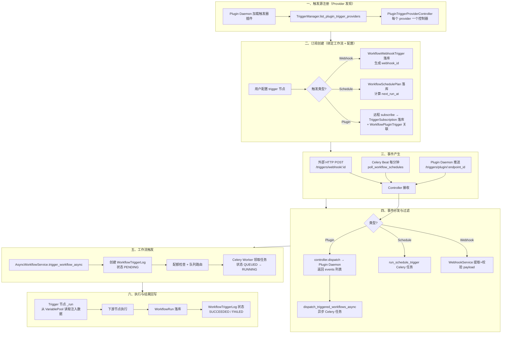
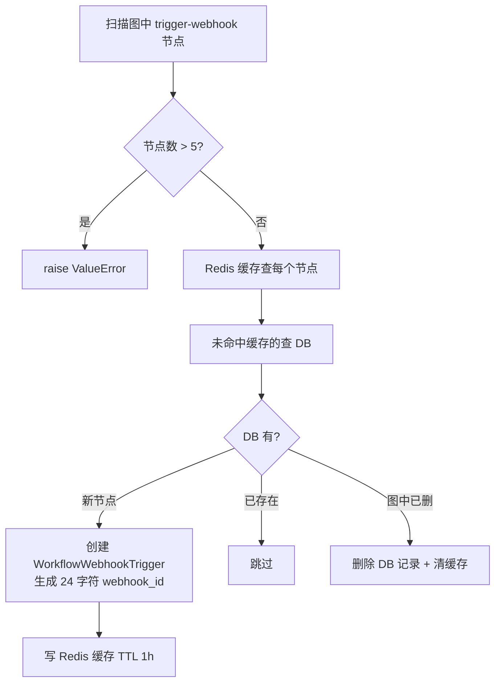
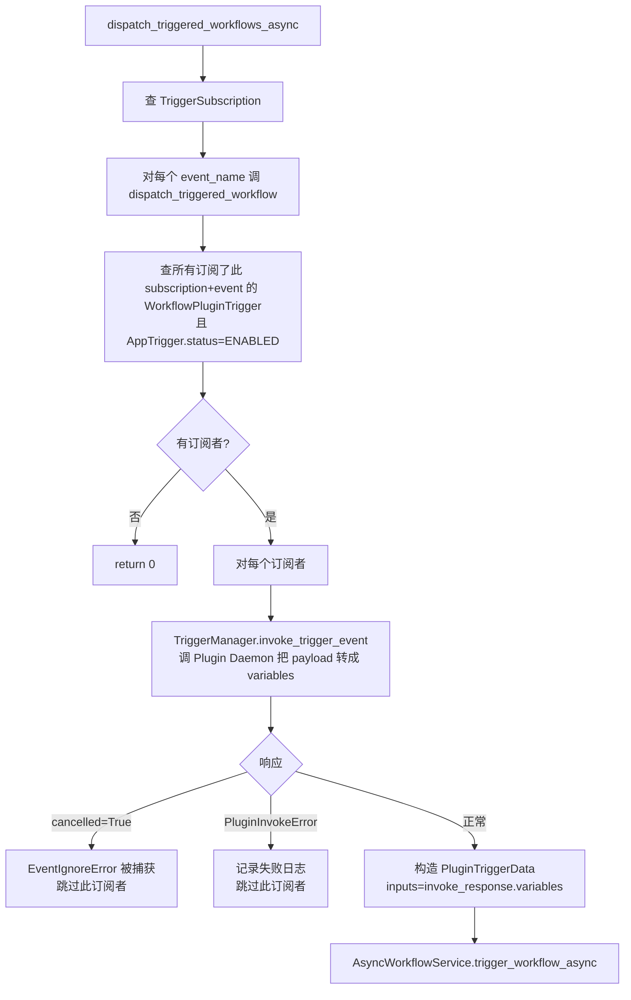
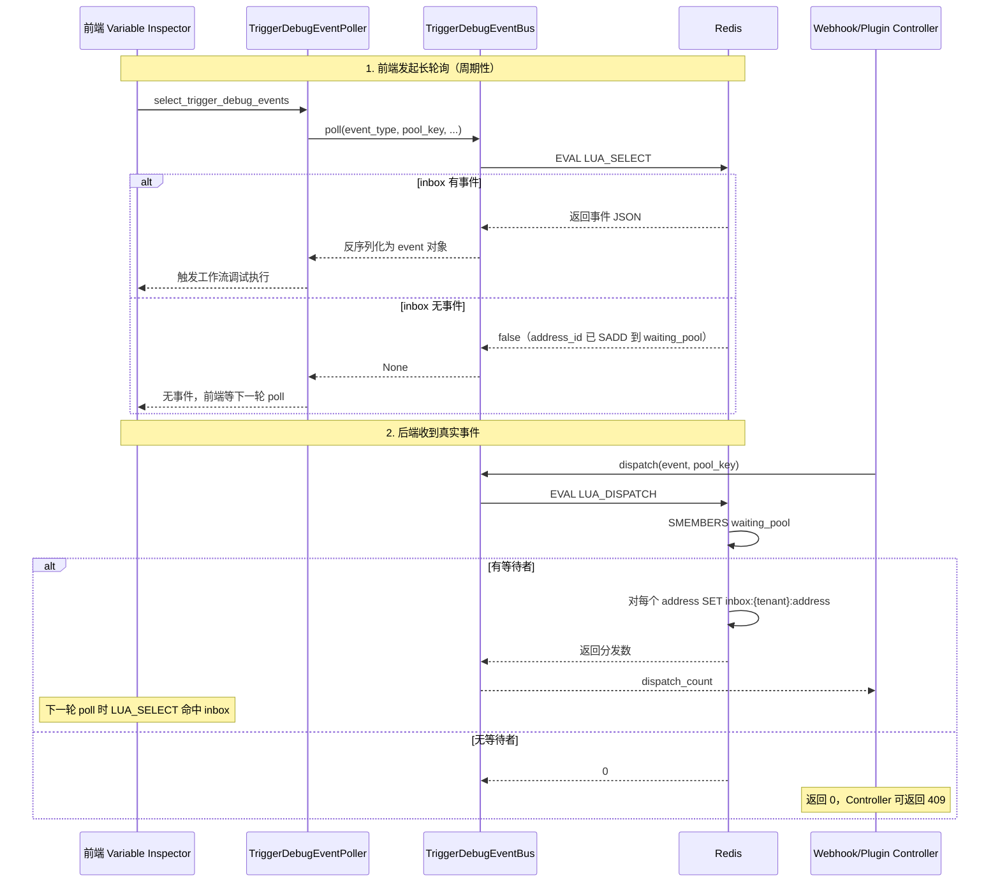
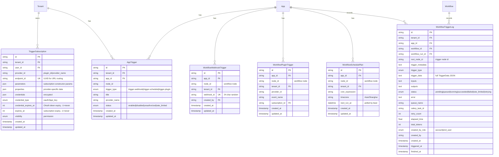
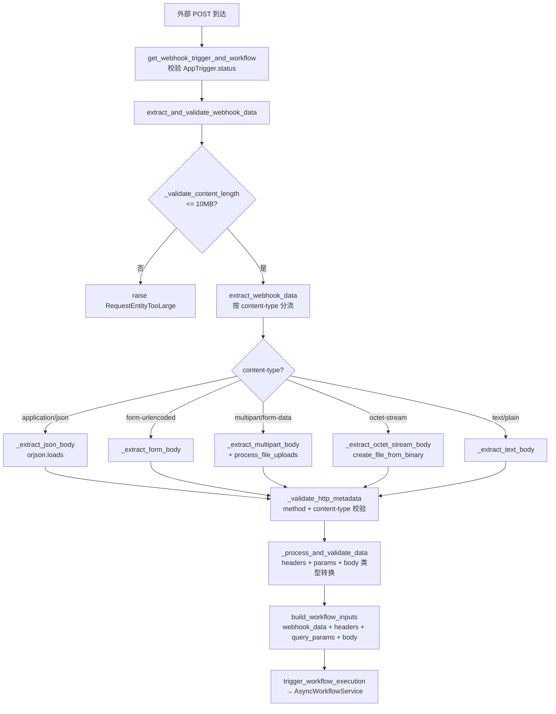
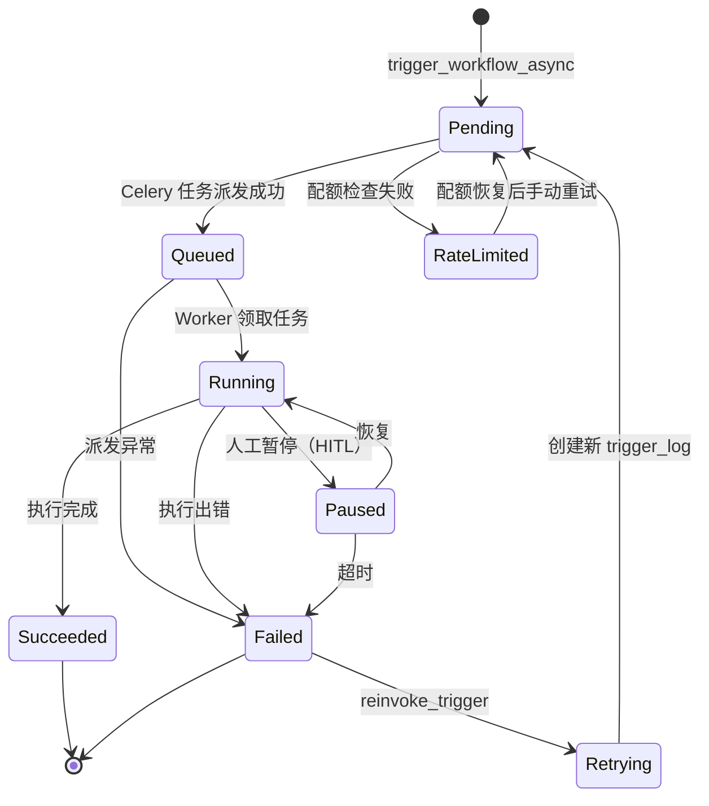
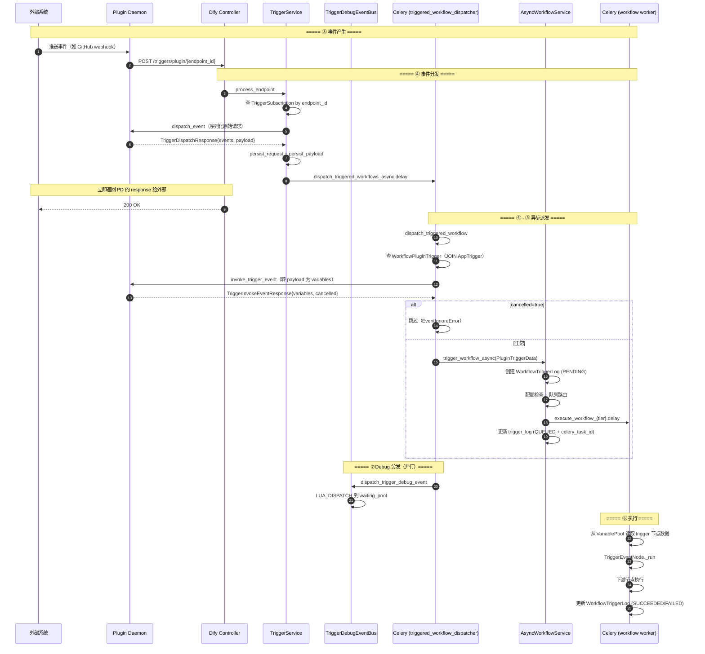

# 触发器 (Trigger) 系统

> **学习目标**：理解 Dify 中事件驱动的 Trigger 系统 —— 三种触发方式（Webhook/Cron/Event Plugin）、Provider 插件模型、订阅生命周期、Debug Event Bus、Trigger 节点在 Workflow 中的集成。
>
> **读完本章你应该能回答**：
> - Trigger 系统为什么让 Dify 工作流从"被动执行"升级为"主动执行"？
> - 三种触发方式（Webhook / Schedule / Plugin Event）的差异和适用场景？
> - Provider 插件模型怎么让 GitHub / Slack 等第三方事件自动接入 Dify？
> - 订阅的生命周期：创建 → 刷新 → 取消订阅的关键路径？
> - Debug Event Bus 怎么用 Redis 长轮询实现"事件流可视化"？
> - Trigger 节点作为工作流入口时，和 start 节点有什么区别？
> - 插件事件接收和 Webhook 接收的认证机制有什么不同？
> - Signature 校验在 Webhook 中扮演什么角色？为什么必须？
> - 触发失败时怎么重试？怎么标记"已死亡"的订阅？
> - 实际生产中如何调试 trigger 流？

## 本章要解决的问题

Dify 的工作流传统上是**被动执行**：用户（或外部系统）发起一次 API 调用，工作流才跑起来。这意味着 Dify 只能做"请求-响应"式的事情——用户问了才答、API 调了才跑。但真实世界的自动化需求远不止于此：每天凌晨 2 点同步数据、GitHub 一开 PR 就自动审查、Slack 被 @mention 就触发客服工作流、Stripe 收到支付就发确认邮件。这些场景的共同特征是"**不是用户主动来调，而是外部事件到了就该跑**"。

没有 Trigger 系统，Dify 只能靠外部调度器（cron job、Zapier、n8n）定期"戳一下" API 来模拟——这有三个硬伤：一是凭据管理散落在外部系统里，安全风险高；二是外部调度器不懂工作流结构，无法把事件 payload 直接注入成工作流变量；三是调试时没有端到端可观测性，出了问题要在 Dify 和外部系统之间来回查日志。更关键的是，插件生态（如 GitHub、Slack provider）产生的事件无法被 Dify 原生感知，只能用轮询 API 这种低效方式弥补。

Dify 的解法是**Trigger 系统**：引入三类统一的触发源（Webhook / Schedule / Plugin Event），每类都做成工作流的"替代入口节点"——与 start 节点同级，但由外部事件而非用户输入驱动。触发器订阅（Subscription）把"哪个事件的 payload 该注入到哪个工作流节点"这条绑定关系持久化到 DB；Plugin Daemon 负责与第三方系统的远程订阅/取消订阅（注册 webhook、刷新 OAuth token）；Debug Event Bus 用 Redis Lua 长轮询让开发者在编辑器里实时看到事件流。这层坏了，Dify 就退回成"只能等用户调 API"的被动系统，丢失定时巡检、Webhook 响应、插件事件驱动全部能力。

## 宏观架构：一次触发事件的完整生命周期

下图是一个外部事件从产生到驱动工作流执行的完整生命周期，也是全文的叙事主线——后续每一节对应生命周期的一个阶段。



理解这张图的关键：**三种触发源的差异只在 ②③④ 三步，从 ⑤ 开始完全统一**——无论事件来自哪里，最终都走 `AsyncWorkflowService.trigger_workflow_async` 这同一个入口，创建同一种 `WorkflowTriggerLog`，被同一种 Celery Worker 消费。这种"多入口、单执行通道"的设计让触发器扩展不影响工作流引擎，也让可观测性统一。

下面按这六个阶段逐层展开。

## 一、触发源注册：Provider 发现

**这一节为什么存在**：Plugin Event 类触发器（如 GitHub、Slack）的"事件从哪来、怎么订阅"逻辑不在 Dify 主进程里，而是分布在 Plugin Daemon 的触发器插件中。Dify 主进程必须先"发现"有哪些 provider 可用，才能让用户在 UI 上选配。这一阶段建立了"Dify ↔ Plugin Daemon"的触发器元数据通道。

`TriggerManager`（trigger_manager.py:30）是触发器的统一管理入口。它本身不存储任何 provider 状态，而是每次调用时通过 `PluginTriggerClient` 向 Plugin Daemon 拉取最新 provider 列表：

```python
# trigger_manager.py:48-74
@classmethod
def list_plugin_trigger_providers(cls, tenant_id: str) -> list[PluginTriggerProviderController]:
    manager = PluginTriggerClient()
    provider_entities = manager.fetch_trigger_providers(tenant_id)  # 远程拉取

    controllers: list[PluginTriggerProviderController] = []
    for provider in provider_entities:
        try:
            controller = PluginTriggerProviderController(
                entity=provider.declaration,
                plugin_id=provider.plugin_id,
                plugin_unique_identifier=provider.plugin_unique_identifier,
                provider_id=TriggerProviderID(provider.provider),
                tenant_id=tenant_id,
            )
            controllers.append(controller)
        except Exception:
            logger.exception("Failed to load trigger provider %s", provider.plugin_id)
            continue
    return controllers
```

`PluginTriggerClient.fetch_trigger_providers`（trigger.py:21）走 Plugin Daemon 的 HTTP 接口 `GET plugin/{tenant_id}/management/triggers`，返回的每个 provider 包含 `declaration`（包含 identity、subscription_constructor、events 三部分）和 `plugin_id`。一个关键处理是 **provider_id 命名空间**（trigger.py:43-48）：provider 的 `identity.name` 被改写为 `plugin_id/provider_name` 的格式，保证跨插件不冲突。

`PluginTriggerProviderController`（provider.py:38）是单个 provider 的控制器，持有 `entity`（`TriggerProviderEntity`）、`plugin_id`、`tenant_id`。它不执行任何远程调用，而是把远程通信委托给 `PluginTriggerClient`——这种"控制器 + 客户端"分离让控制器可以被缓存（`contexts.plugin_trigger_providers`），客户端保持无状态。

**Provider 的三类声明**（entities.py:138-152）：

| 声明部分 | 字段 | 用途 |
|---------|------|------|
| `identity` | name, label, icon, tags | UI 展示 |
| `subscription_constructor` | parameters, credentials_schema, oauth_schema | 订阅时的用户配置表单 + 凭据类型 |
| `events` | list[EventEntity] | provider 能产生哪些事件（如 `issue_opened`、`pr_merged`） |

`subscription_constructor` 决定了订阅创建方式（provider.py:87-92）：

```python
supported_creation_methods = [TriggerCreationMethod.MANUAL]
if subscription_constructor and subscription_constructor.oauth_schema:
    supported_creation_methods.append(TriggerCreationMethod.OAUTH)
if subscription_constructor and subscription_constructor.credentials_schema:
    supported_creation_methods.append(TriggerCreationMethod.APIKEY)
```

三种创建方式对应不同的凭据类型（`CredentialType`）：`MANUAL`（无需凭据，如简单 webhook）、`OAUTH`（OAuth 2.0 流程，如 GitHub 登录授权）、`APIKEY`（API Key 直接填写）。这决定了订阅创建 UI 走哪条路径。

> Webhook 和 Schedule 触发器**不走** Provider 插件模型——它们是 Dify 内置的，直接由 `WorkflowWebhookTrigger` 和 `WorkflowSchedulePlan` 表管理。只有 Plugin Event 触发器才通过 Provider 插件机制接入第三方系统。这是三类触发器的第一个本质差异。

## 二、订阅创建：绑定工作流与配置

**这一节为什么存在**：触发器要工作，必须先把"这个事件的 payload 该注入到哪个工作流的哪个节点"这条关系持久化。三类触发器的订阅创建路径完全不同——Webhook 只需本地落库生成 URL，Schedule 只需计算 cron，Plugin Event 需要远程 subscribe 再落库。这一阶段是三类触发器分叉最大的地方。

用户在工作流编辑器里拖入一个 trigger 节点并发布工作流时，系统根据节点类型走不同的同步逻辑。三种 trigger 节点的共同特征是 `execution_type = NodeExecutionType.ROOT`——它们是工作流的**入口节点**，与 start 节点同级（详见第 ⑤ 节）。

### 2.1 Webhook 订阅：本地生成 URL

Webhook 触发器节点发布时，`WebhookService.sync_webhook_relationships`（webhook_service.py:887）扫描工作流图中的 `trigger-webhook` 节点，与 DB 中已有的 `WorkflowWebhookTrigger` 记录做 diff：



`WorkflowWebhookTrigger`（model.py:335-389）的核心字段是 `webhook_id`（24 字符随机串，全局唯一）和 `(app_id, node_id)` 联合唯一约束。webhook URL 由 `generate_webhook_trigger_endpoint`（endpoint.py:19）生成：`{TRIGGER_URL}/triggers/webhook/{webhook_id}`。无需远程注册——外部系统只要往这个 URL POST 数据即可。

几个关键设计：

- **最多 5 个 webhook 节点/工作流**（`MAX_WEBHOOK_NODES_PER_WORKFLOW`，webhook_service.py:79）：防止滥用。
- **Redis 缓存 + 分布式锁**：避免高频发布时反复查 DB。锁键 `webhook_nodes:apps:{app_id}:lock`（webhook_service.py:929）。
- **webhook_id 无需去重**：DB 有 `uniq_webhook_id` 唯一约束兜底（model.py:355）。

### 2.2 Schedule 订阅：计算 next_run_at

Schedule 触发器节点发布时，`ScheduleService.create_schedule`（schedule_service.py:28）创建 `WorkflowSchedulePlan` 记录。关键字段是 `cron_expression`、`timezone`、`next_run_at`。

`next_run_at` 在创建时由 `calculate_next_run_at(cron_expression, timezone)` 计算（schedule_service.py:46-49）。这个值是后续 Celery Beat 轮询的依据——只有 `next_run_at <= now` 的计划才会被触发。

Schedule 支持两种配置模式（schedule_service.py:183-208）：
- **visual 模式**：用户在 UI 选"每天 12:00""每周一 9:00"，由 `visual_to_cron`（schedule_service.py:270）转成 cron 表达式。
- **cron 模式**：用户直接写 `0 9 * * 1-5`。

`WorkflowSchedulePlan` 的唯一约束是 `(app_id, node_id)`（model.py:509）——一个节点只能有一个计划。

### 2.3 Plugin Event 订阅：远程 subscribe + 本地落库

Plugin Event 触发器的订阅最复杂，分两步：

**第一步：Subscription Builder（凭据采集）**。`TriggerSubscriptionBuilderService`（trigger_subscription_builder_service.py:35）管理一个临时的"订阅构建器"状态，用 Redis 缓存（TTL 30 分钟），走 OAuth 或 API Key 流程采集凭据。构建完成后调 `TriggerManager.subscribe_trigger`（trigger_manager.py:198）。

**第二步：远程 subscribe**。`PluginTriggerProviderController.subscribe_trigger`（provider.py:337）调 `PluginTriggerClient.subscribe`（trigger.py:194），向 Plugin Daemon 发 `POST plugin/{tenant_id}/dispatch/trigger/subscribe`。Plugin Daemon 内部的触发器插件执行真正的远程注册（如向 GitHub 注册 webhook）。返回的 `Subscription` 包含 `endpoint`（Dify 分配的接收 URL）和 `properties`（如 GitHub 的 hook ID）。

```python
# provider.py:358-368
response: TriggerSubscriptionResponse = manager.subscribe(
    tenant_id=self.tenant_id,
    user_id=user_id,
    provider=str(provider_id),
    endpoint=endpoint,
    parameters=parameters,
    credentials=credentials,
    credential_type=credential_type,
)
return Subscription.model_validate(response.subscription)
```

**第三步：本地落库**。`TriggerSubscription`（model.py:68）持久化订阅信息，关键字段：

| 字段 | 用途 |
|------|------|
| `endpoint_id` | 订阅端点 ID（用于 URL 路由），唯一索引 |
| `provider_id` | `plugin_id/provider_name` 格式 |
| `credentials` | 加密存储的凭据（JSON） |
| `credential_type` | `oauth2` / `api_key` |
| `credential_expires_at` | OAuth token 过期时间戳，-1 表示永不过期 |
| `expires_at` | 订阅本身过期时间戳，-1 表示永不过期 |
| `properties` | provider 特定数据（如 GitHub hook ID） |

`is_credential_expired`（model.py:132-137）检查 token 是否在未来 3 分钟内过期——提前量用于触发刷新。

**第四步：工作流关联**。`TriggerService.sync_plugin_trigger_relationships`（trigger_service.py:153）扫描工作流图中的 `trigger-plugin` 节点，创建 `WorkflowPluginTrigger`（model.py:392）记录，把 `(app_id, node_id)` 与 `subscription_id`、`provider_id`、`event_name` 关联。这条记录是事件分发时"找到该通知哪些工作流"的依据。同样有 5 个节点上限（`MAX_PLUGIN_TRIGGER_NODES_PER_WORKFLOW`，trigger_service.py:41）。

### 2.4 AppTrigger：统一的状态开关

除了上述三类节点级的记录，还有 `AppTrigger`（model.py:438）表，是 **app 级别的触发器状态开关**。每个 trigger 节点发布时都会创建对应的 `AppTrigger` 记录，字段 `status` 有四种值（enums.py:70-76）：

| 状态 | 含义 | 触发条件 |
|------|------|---------|
| `ENABLED` | 正常工作 | 默认 |
| `DISABLED` | 用户手动禁用 | UI 开关 |
| `UNAUTHORIZED` | 凭据失效 | OAuth token 刷新失败 |
| `RATE_LIMITED` | 租户配额耗尽 | `AppTriggerService.mark_tenant_triggers_rate_limited` |

`AppTrigger` 是事件分发时的**门控层**——只有 `status == ENABLED` 的触发器才会真正派发事件（详见第 ④ 节）。当租户配额耗尽时，`mark_tenant_triggers_rate_limited`（app_trigger_service.py:24）一次性把该租户所有 `ENABLED` 的触发器批量改为 `RATE_LIMITED`，阻止后续触发。

## 三、事件产生：三种触发源的物理入口

**这一节为什么存在**：三类触发器的"事件从哪来"物理路径完全不同——Webhook 是外部 HTTP 主动 push，Schedule 是 Celery Beat 周期性 poll，Plugin Event 是 Plugin Daemon 转发。这一阶段是生命周期的"物理入口"层。

### 3.1 Webhook：外部 HTTP POST

外部系统往 `POST /triggers/webhook/{webhook_id}` 发请求（webhook.py:43）。`handle_webhook` 做四件事：

1. **加载触发器与工作流**：`WebhookService.get_webhook_trigger_and_workflow`（webhook_service.py:88）查 `WorkflowWebhookTrigger`，校验 `AppTrigger.status` 必须是 `ENABLED`（debug 模式跳过此检查），加载已发布工作流。
2. **提取并校验 payload**：`extract_and_validate_webhook_data`（webhook_service.py:171）按节点配置的 method、content-type、headers、params、body schema 提取并类型转换。
3. **触发工作流执行**：`trigger_workflow_execution`（webhook_service.py:791）异步派发。
4. **返回配置响应**：`generate_webhook_response`（webhook_service.py:853）按节点配置的 status_code 和 response_body 返回。

payload 大小由 `WEBHOOK_REQUEST_BODY_MAX_SIZE`（默认 10MB，feature/__init__.py:199）限制，超出抛 `RequestEntityTooLarge`。

### 3.2 Schedule：Celery Beat 周期轮询

Schedule 不是被 push 进来的，而是 Dify 主动 poll 出来的。两层 Celery 任务：

**第一层：poller**（workflow_schedule_task.py:18）。`poll_workflow_schedules` 由 Celery Beat 每 `WORKFLOW_SCHEDULE_POLLER_INTERVAL`（默认 1 分钟，feature/__init__.py:1287）触发。它分批查询 `next_run_at <= now` 且对应 `AppTrigger.status == ENABLED` 的 `WorkflowSchedulePlan`，用 `with_for_update(skip_locked=True)` 跳过被其他 worker 锁定的行（避免多 worker 重复触发），每批最多 `WORKFLOW_SCHEDULE_POLLER_BATCH_SIZE`（默认 100）条。还有熔断器：`WORKFLOW_SCHEDULE_MAX_DISPATCH_PER_TICK`（默认 0=不限）防止单 tick 跑爆。

```python
# workflow_schedule_task.py:55-86
due_schedules = session.scalars(
    (
        select(WorkflowSchedulePlan)
        .join(AppTrigger, and_(
            AppTrigger.app_id == WorkflowSchedulePlan.app_id,
            AppTrigger.node_id == WorkflowSchedulePlan.node_id,
            AppTrigger.trigger_type == AppTriggerType.TRIGGER_SCHEDULE,
        ))
        .where(
            WorkflowSchedulePlan.next_run_at <= now,
            WorkflowSchedulePlan.next_run_at.isnot(None),
            AppTrigger.status == AppTriggerStatus.ENABLED,
        )
    )
    .order_by(WorkflowSchedulePlan.next_run_at.asc())
    .with_for_update(skip_locked=True)
    .limit(dify_config.WORKFLOW_SCHEDULE_POLLER_BATCH_SIZE)
)
```

**第二层：executor**（workflow_schedule_tasks.py:23）。poller 把每个到期的 schedule 通过 `group(run_schedule_trigger.s(schedule_id))` 并行派发到 `schedule_executor` 队列。`run_schedule_trigger` 做配额检查后调 `AsyncWorkflowService.trigger_workflow_async`。

关键：poller 在派发前就**更新 `next_run_at`**（workflow_schedule_task.py:96-100），即使本次执行失败，下次也不会重复触发同一时间点——这是 Schedule 触发器的幂等保证。

### 3.3 Plugin Event：Plugin Daemon 转发

外部系统（如 GitHub）把事件推给 Plugin Daemon，Plugin Daemon 再转发到 Dify 的 `POST /triggers/plugin/{endpoint_id}`（trigger.py:17）。`endpoint_id` 必须是 UUID 格式（trigger.py:13-14）。

`TriggerService.process_endpoint`（trigger_service.py:77）处理这个请求：

1. **查订阅**：`TriggerProviderService.get_subscription_by_endpoint(endpoint_id)` 查 `TriggerSubscription`。
2. **解密凭据**：`create_trigger_provider_encrypter_for_subscription`（encryption.py:54）创建加密器，解密 `subscription.credentials`。
3. **dispatch 到 Plugin Daemon**：`controller.dispatch`（provider.py:268）调 `PluginTriggerClient.dispatch_event`（trigger.py:157），把原始 HTTP 请求序列化（`binascii.hexlify(serialize_request(request))`）发给 Plugin Daemon。Plugin Daemon 内部的 provider 插件解析请求，返回 `TriggerDispatchResponse`——包含 `events`（事件名列表，如 `["issue_opened"]`）和 `payload`（转换后的事件数据）。
4. **持久化请求**：`TriggerHttpRequestCachingService.persist_request/persist_payload`（trigger_service.py:117-118）把原始请求和转换后 payload 存起来（供后续 Celery 任务取用）。
5. **异步派发**：`dispatch_triggered_workflows_async.delay(dispatch_data)`（trigger_service.py:142）丢到 `triggered_workflow_dispatcher` 队列。
6. **立即返回**：把 Plugin Daemon 返回的 `dispatch_response.response` 直接回给外部系统——**不等工作流执行完**。

这种"接收即返回、异步处理"的设计让外部系统（如 GitHub Webhook）能在几秒内拿到 200 响应，不会因 Dify 内部处理慢而触发重试。

## 四、事件分发与过滤

**这一节为什么存在**：事件到了 Dify 之后，不能直接跑工作流——要经过"找到订阅了这个事件的工作流 → 调用 provider 把原始 payload 转成工作流变量 → 检查配额"这一串预处理。Plugin Event 尤其复杂，因为一个 endpoint 可能关联多个工作流、一个事件可能被 provider 判定为"应忽略"。

### 4.1 Webhook：同步派发

Webhook 在第 ③ 步的 `trigger_workflow_execution` 里**同步**完成派发（webhook_service.py:791）：构造 `WebhookTriggerData`，创建 `EndUser`（类型 `TRIGGER`），配额检查（`QuotaService.reserve(QuotaType.TRIGGER)`），然后调 `AsyncWorkflowService.trigger_workflow_async`。如果配额耗尽，`mark_tenant_triggers_rate_limited` 把该租户所有触发器改为 `RATE_LIMITED` 并抛 `QuotaExceededError`。

### 4.2 Schedule：直接触发

`run_schedule_trigger`（workflow_schedule_tasks.py:23）在配额检查后直接调 `AsyncWorkflowService.trigger_workflow_async`，传入 `ScheduleTriggerData`（inputs 为空，因为 schedule 不携带外部数据）。注意它**不经过** `dispatch_triggered_workflows_async`——schedule 的"找到该触发哪个工作流"在第 ③ 步就已经确定了（通过 `WorkflowSchedulePlan.app_id` + `node_id`）。

### 4.3 Plugin Event：异步派发 + 事件过滤

Plugin Event 的派发最复杂，在 `dispatch_triggered_workflows_async`（trigger_processing_tasks.py:445）Celery 任务里完成：



`dispatch_triggered_workflow`（trigger_processing_tasks.py:232）的核心步骤：

1. **查订阅者**：`TriggerSubscriptionOperatorService.get_subscriber_triggers`（trigger_subscription_operator_service.py:11）JOIN `WorkflowPluginTrigger` 和 `AppTrigger`，只返回 `AppTrigger.status == ENABLED` 的记录。这是 Plugin Event 的门控层。

2. **调用 provider 转换 payload**：`TriggerManager.invoke_trigger_event`（trigger_manager.py:150）调 `PluginTriggerClient.invoke_trigger_event`（trigger.py:81），把原始请求和 payload 发给 Plugin Daemon。Provider 插件执行真正的业务逻辑（如解析 GitHub webhook payload，提取 issue title、body、author 等），返回 `TriggerInvokeEventResponse`——包含 `variables`（工作流输入变量）和 `cancelled`（是否应忽略此事件）。

3. **EventIgnoreError 处理**：如果 provider 抛 `EventIgnoreError`（errors.py:16），`TriggerManager.invoke_trigger_event` 捕获后返回 `cancelled=True`（trigger_manager.py:192-193），订阅者被跳过但不报错。这是 provider 表达"这个事件不相关"的优雅方式——如 GitHub provider 收到一个 `issue_closed` 事件但订阅者只关心 `issue_opened`。

4. **失败日志**：`PluginInvokeError` 时调 `_record_trigger_failure_log`（trigger_processing_tasks.py:126），创建一个 `status=FAILED` 的 `WorkflowRun` + `WorkflowTriggerLog`，让用户在 UI 看到失败原因。

### 4.4 Debug 事件分发

除了"真正触发工作流"的派发，还有一条**调试派发**通道。`dispatch_trigger_debug_event`（trigger_processing_tasks.py:59）把事件推到 `TriggerDebugEventBus`，让正在调试的工作流编辑器能收到事件（详见第 ⑦ 节）。Webhook 的调试派发在 `handle_webhook_debug`（webhook.py:72）里，直接调 `TriggerDebugEventBus.dispatch`，不走 Celery。

## 五、工作流触发：统一入口

**这一节为什么存在**：三类触发器的事件经过各自的分发路径后，最终都要"启动一个工作流"。这一阶段是"多入口、单执行通道"的汇聚点——`AsyncWorkflowService.trigger_workflow_async` 是所有触发器的统一执行入口。

`AsyncWorkflowService.trigger_workflow_async`（async_workflow_service.py:53）做八件事：

```mermaid
flowchart TD
    A["trigger_workflow_async(session, user, trigger_data)"] --> B[1. 校验 App 存在]
    B --> C[2. 获取已发布 Workflow]
    C --> D[3. 队列路由<br/>QueueDispatcherManager 按 tenant 订阅等级选队列]
    D --> E[4. 确定 created_by_role<br/>Account / EndUser]
    E --> F["5. 创建 WorkflowTriggerLog<br/>status=PENDING"]
    F --> G[6. 配额检查<br/>QuotaService.reserve(QuotaType.WORKFLOW)]
    G -- 超限 --> H["status=RATE_LIMITED<br/>raise WorkflowQuotaLimitError"]
    G -- 通过 --> I[7. 派发 Celery 任务<br/>execute_workflow_{professional|team|sandbox}]
    I --> J["8. 更新 trigger_log<br/>status=QUEUED, celery_task_id"]
```

几个关键设计：

**1. `TriggerData` 多态**。三类触发器传入不同的 `TriggerData` 子类（entities.py:28-78）：

| 子类 | `trigger_type` | `trigger_from` | 额外字段 |
|------|---------------|----------------|---------|
| `WebhookTriggerData` | `TRIGGER_WEBHOOK` | `WEBHOOK` | — |
| `ScheduleTriggerData` | `TRIGGER_SCHEDULE` | `SCHEDULE` | — |
| `PluginTriggerData` | `TRIGGER_PLUGIN` | `PLUGIN` | `plugin_id`, `endpoint_id` |

`PluginTriggerData` 还携带 `trigger_metadata`（`PluginTriggerMetadata`，包含 `provider_id`、`event_name`、`icon_filename` 等），用于 UI 展示和追溯。

**2. 队列路由**。`QueueDispatcherManager.get_dispatcher(tenant_id)`（async_workflow_service.py:98）按租户订阅等级选队列：`PROFESSIONAL` / `TEAM` / `SANDBOX`。不同队列对应不同的 Celery 任务：`execute_workflow_professional` / `execute_workflow_team` / `execute_workflow_sandbox`（async_workflow_service.py:163-168）。这是资源隔离机制——高付费租户的触发器不会因免费租户的流量被阻塞。

**3. `WorkflowTriggerLog` 是追踪键**。每条触发记录在执行前就落库（async_workflow_service.py:111-136），`status` 从 `PENDING` → `QUEUED` → `RUNNING` → `SUCCEEDED` / `FAILED`（enums.py:57-67）。`celery_task_id` 在派发后回填，让用户能从 UI 反查 Celery 任务。`retry_count` 支持失败后手动重试（`reinvoke_trigger`，async_workflow_service.py:189）。

**4. 配额两层**。触发器派发时先检查 `QuotaType.TRIGGER`（在第 ④ 步的各分发路径里），工作流执行时再检查 `QuotaType.WORKFLOW`（在 `trigger_workflow_async` 里）。前者限"触发次数"，后者限"工作流执行次数"——两者可独立配额。

## 六、执行与结果回写：Trigger 节点作为入口

**这一节为什么存在**：工作流被触发后，执行从 trigger 节点开始而非 start 节点。这一阶段解释 trigger 节点如何把事件 payload 注入到工作流的变量池，以及它与 start 节点的本质差异。

### 6.1 三种 Trigger 节点

三类触发器各有对应的工作流节点（constants.py:1-17）：

| 节点类型 | 节点类 | 文件 |
|---------|--------|------|
| `trigger-webhook` | `TriggerWebhookNode` | node.py:22 |
| `trigger-schedule` | `TriggerScheduleNode` | trigger_schedule_node.py:13 |
| `trigger-plugin` | `TriggerEventNode` | trigger_event_node.py:13 |

三者都声明 `execution_type = NodeExecutionType.ROOT`——这是它们成为工作流入口的**物理标记**。Graphon 引擎识别到 ROOT 类型节点后，把它作为图执行的起点，而非默认的 start 节点。

三者的 `_run` 方法都很轻量——它们不执行业务逻辑，只做"从变量池读取已注入的数据，转成 outputs"：

```python
# trigger_event_node.py:43-70 (trigger-plugin)
@override
def _run(self) -> NodeRunResult:
    metadata: dict[WorkflowNodeExecutionMetadataKey, Any] = {
        WorkflowNodeExecutionMetadataKey.TRIGGER_INFO: {
            "provider_id": self.node_data.provider_id,
            "event_name": self.node_data.event_name,
            "plugin_unique_identifier": self.node_data.plugin_unique_identifier,
        },
    }
    node_inputs = dict(self.graph_runtime_state.variable_pool.get_by_prefix(self.id))
    system_inputs = self.graph_runtime_state.variable_pool.get_by_prefix(SYSTEM_VARIABLE_NODE_ID)
    for variable_name, value in system_inputs.items():
        node_inputs[f"{SYSTEM_VARIABLE_NODE_ID}.{variable_name}"] = value
    outputs = dict(node_inputs)
    return NodeRunResult(
        status=WorkflowNodeExecutionStatus.SUCCEEDED,
        inputs=node_inputs,
        outputs=outputs,
        metadata=metadata,
    )
```

**关键：数据在节点 `_run` 之前就已经被注入到变量池了**。是谁注入的？是 Celery Worker 在启动工作流执行时，根据 `WorkflowTriggerLog.inputs` 把数据写进 `VariablePool` 的以 trigger 节点 id 为前缀的区域。trigger 节点的 `_run` 只是"读取并暴露"这些数据给下游。

### 6.2 Webhook 节点的输出提取

`TriggerWebhookNode._run` 比 Plugin 节点复杂——它要按节点配置的 headers / params / body schema 从 `webhook_data` 中提取指定字段（node.py:58-79）。`_extract_configured_outputs`（node.py:106-183）做三件事：

- **headers**：按节点配置的 header 列表提取，支持大小写不敏感和 `-`/`_` 互换（node.py:128-136）。
- **query params**：按节点配置的 param 列表从 `query_params` 提取。
- **body**：按 content-type 分流——`text/plain` 整个 body 是一个字符串参数；`application/octet-stream` 是二进制文件；其他类型按 body 参数 schema 逐字段提取，`FILE` 类型走 `generate_file_var`（node.py:81-104）构建文件变量。

### 6.3 Trigger 节点 vs Start 节点

| 维度 | Start 节点 | Trigger 节点 |
|------|-----------|-------------|
| `execution_type` | `ROOT` | `ROOT` |
| 数据来源 | 用户在 API 调用时传入的 `inputs` | 事件 payload（由触发器分发路径注入） |
| 触发方式 | 用户主动调 API | 外部事件 / 定时 / 插件事件自动触发 |
| 节点数量 | 每个工作流 1 个 | 可有多个（但每类最多 5 个） |
| `InvokeFrom` | `API` / `DEBUG` | `TRIGGER` |
| 追踪记录 | `WorkflowRun` | `WorkflowRun` + `WorkflowTriggerLog` |

Trigger 节点存在的根本理由：**让工作流能被"非用户"驱动**。它和 start 节点共享 `ROOT` 执行类型，但数据注入路径完全不同——start 节点的数据来自同步 API 调用的 `inputs` 参数，trigger 节点的数据来自异步事件分发路径的 `WorkflowTriggerLog.inputs`。

> 工作流引擎如何调度 ROOT 节点、变量池如何工作，详见 [11-workflow-engine.md](./dify-11-workflow-engine.md)。

### 6.4 结果回写

工作流执行完成后，`WorkflowTriggerLog` 的 `status` 被更新为最终状态（`SUCCEEDED` / `FAILED`），`workflow_run_id` 回填，`outputs`、`elapsed_time`、`total_tokens` 记录执行结果（model.py:222-332）。`to_dict`（model.py:306-332）把日志转成 API 响应格式，供前端触发器历史页面展示。

失败时可通过 `AsyncWorkflowService.reinvoke_trigger`（async_workflow_service.py:189）重试：原日志标记为 `RETRYING`，`retry_count += 1`，然后用原 `trigger_data` 创建新的 `WorkflowTriggerLog` 并重新派发。

## 七、Debug Event Bus：Redis Lua 长轮询

**这一节为什么存在**：开发者在工作流编辑器里调试 trigger 节点时，需要"发一个测试事件，看工作流怎么跑"。但生产触发器走 Celery 异步执行，无法实时反馈。Debug Event Bus 用 Redis Lua 长轮询实现了一条"旁路"——让草稿工作流能实时收到事件，且不干扰生产执行。

### 7.1 三种 Debug Poller

`select_trigger_debug_events`（event_selectors.py:231）根据节点类型创建不同的 poller（event_selectors.py:209-228）：

| Poller | 事件类型 | 数据来源 |
|--------|---------|---------|
| `WebhookTriggerDebugEventPoller` | `WebhookDebugEvent` | `handle_webhook_debug` 推送到 Event Bus |
| `PluginTriggerDebugEventPoller` | `PluginTriggerDebugEvent` | `dispatch_trigger_debug_event` 推送到 Event Bus |
| `ScheduleTriggerDebugEventPoller` | `ScheduleDebugEvent` | 本地模拟（Redis 缓存 next_run_at） |

Schedule 的 debug poller 最特殊——它**不依赖外部事件**，而是在 Redis 里维护一个 `ScheduleDebugRuntime`（event_selectors.py:150-185），按 cron 表达式计算 `next_run_at`，到期就生成一个 `ScheduleDebugEvent`。这让开发者在编辑器里就能看到"如果这个 schedule 真的触发了会怎样"，无需等待真实定时。

### 7.2 Redis Lua 长轮询实现

`TriggerDebugEventBus`（event_bus.py:14）用两个 Lua 脚本实现原子长轮询：

**LUA_SELECT**（event_bus.py:26-32）——poller 调用，"取或注册"：
```lua
-- KEYS[1] = trigger_debug_inbox:{<tenant_id>}:<address_id>
-- KEYS[2] = trigger_debug_waiting_pool:{<tenant_id>}:...
-- ARGV[1] = address_id
local v = redis.call('GET', KEYS[1])
if v then
    redis.call('DEL', KEYS[1])
    return v          -- 有事件，立即返回
end
redis.call('SADD', KEYS[2], ARGV[1])  -- 无事件，注册到等待池
redis.call('EXPIRE', KEYS[2], 300)     -- 5 分钟 TTL
return false
```

**LUA_DISPATCH**（event_bus.py:38-46）——dispatcher 调用，"广播给所有等待者"：
```lua
-- KEYS[1] = trigger_debug_waiting_pool:{<tenant_id>}:...
-- ARGV[1] = tenant_id
-- ARGV[2] = event_json
local a = redis.call('SMEMBERS', KEYS[1])
if #a == 0 then return 0 end          -- 无等待者
redis.call('DEL', KEYS[1])
for i = 1, #a do
    redis.call('SET',
        'trigger_debug_inbox:{{'..ARGV[1]..'}}'..':'..a[i],
        ARGV[2], 'EX', 300)
end
return #a
```

长轮询的完整时序：



### 7.3 设计要点

- **Hash tags `{tenant_id}`**（event_bus.py:108）：`trigger_debug_inbox:{{{tenant_id}}}:{address_id}` 和 `trigger_debug_waiting_pool:{{{tenant_id}}}:...` 用 `{}` 包裹 tenant_id，保证 Redis Cluster 模式下 inbox key 和 pool key 落在同一 slot——这是 Lua 脚本能跨 key 操作的前提。
- **LUA 原子性**：SELECT 和 DISPATCH 各是单脚本，避免"先 GET 再 SADD"的竞态——如果分两步，可能在 GET 发现无事件后、SADD 前，dispatcher 刚好 DISPATCH 并 DEL 了 pool，导致 poller 永远等不到。
- **TTL 300 秒**（`TRIGGER_DEBUG_EVENT_TTL`，event_bus.py:11）：等待者超过 5 分钟自动从 pool 移除，防止死连接堆积。inbox 里的事件也 5 分钟过期，防止 poller 永不来取时内存泄漏。
- **Address 哈希**（event_bus.py:107）：`sha256(user_id|app_id|node_id)`——即使同一用户对同一节点多次 poll，也合并为一个 address，避免重复注册。
- **dispatch_count == 0 时告警**：Webhook debug 端点在 `dispatch_count == 0` 时返回 409（webhook.py:110-130），提示"没有活跃的调试监听器"——避免开发者误以为调试请求被处理了。

### 7.4 Webhook Debug 端点

`handle_webhook_debug`（webhook.py:72）是 webhook 调试的专用端点 `POST /triggers/webhook-debug/{webhook_id}`。它与生产端点的差异：

| 维度 | 生产端点 `/webhook/:id` | Debug 端点 `/webhook-debug/:id` |
|------|------------------------|-------------------------------|
| 工作流版本 | 已发布 | 草稿（`VERSION_DRAFT`） |
| AppTrigger 状态检查 | 必须 `ENABLED` | 跳过 |
| 执行方式 | Celery 异步 | Event Bus 推送（不执行工作流） |
| 无监听器时 | 正常执行 | 返回 409 |
| 响应 | 配置的 status_code + body | 同左 |

Debug 端点**不执行工作流**——它只把事件推到 Event Bus，由前端的 Variable Inspector poll 后在浏览器里模拟执行。这让开发者可以在不发布工作流、不影响生产的情况下调试 trigger 配置。

## 收敛

### 边界：Trigger 的适用与不适用

Trigger 系统解决的是"工作流如何被外部事件驱动"的问题，但它不是万能的：

**适合用 Trigger**：
- 定时数据同步、日报生成（Schedule）
- 响应第三方 SaaS 事件（GitHub PR、Slack @mention、Stripe 支付）（Webhook / Plugin Event）
- 基于插件事件的自动化（如数据源变更触发处理流程）（Plugin Event）

**不适合用 Trigger**：
- 用户对话式交互（走 Agent Chat / Workflow 的同步 API）
- 需要复杂事件聚合（如"3 次失败内 1 小时触发"）——Trigger 是单事件驱动的，聚合逻辑要在工作流内部实现
- 跨工作流编排（Trigger 是一对一绑定，一对多需用 Plugin Event 的多订阅者机制）

### 扩展点

- **自定义 Trigger Provider**：通过 Plugin Daemon 开发触发器插件，声明 `TriggerProviderEntity`（identity + subscription_constructor + events），实现 subscribe/unsubscribe/dispatch/invoke 远程接口。这是接入新第三方系统的标准路径。
- **自定义 Schedule 模式**：`ScheduleService.visual_to_cron`（schedule_service.py:270）目前支持 hourly/daily/weekly/monthly 四种 visual 模式，可扩展。
- **Debug Event 类型**：`BaseDebugEvent`（events.py:16）是基类，可新增子类支持新的调试场景。

### 订阅刷新与过期

Plugin Event 订阅有两类过期：**credential 过期**（OAuth token）和 **subscription 过期**（如 GitHub webhook 的有效期）。`trigger_provider_refresh`（trigger_provider_refresh_task.py:48）由 Celery Beat 每 `TRIGGER_PROVIDER_REFRESH_INTERVAL`（默认 1 分钟，feature/__init__.py:1315）触发，扫描 `credential_expires_at` 或 `expires_at` 即将到期（阈值 `TRIGGER_PROVIDER_CREDENTIAL_THRESHOLD_SECONDS` / `TRIGGER_PROVIDER_SUBSCRIPTION_THRESHOLD_SECONDS`，默认均 1 小时）的订阅，用 Redis 分布式锁防止重复刷新，分组派发 `trigger_subscription_refresh` 任务。刷新调 `PluginTriggerProviderController.refresh_trigger`（provider.py:396），由 Plugin Daemon 执行真正的 token 刷新或订阅续期。

### 本章要点

1. **三类触发源、单执行通道**：Webhook（外部 push）、Schedule（Celery Beat poll）、Plugin Event（Plugin Daemon 转发）三种入口，最终都走 `AsyncWorkflowService.trigger_workflow_async` 统一执行。
2. **Provider 插件模型仅适用于 Plugin Event**：Webhook 和 Schedule 是 Dify 内置的，不走 Provider 插件机制。Provider 插件通过 Plugin Daemon 远程执行 subscribe/unsubscribe/dispatch/invoke。
3. **订阅创建三路径**：Webhook 本地生成 URL（`WorkflowWebhookTrigger`）；Schedule 本地计算 cron（`WorkflowSchedulePlan`）；Plugin Event 远程 subscribe + 本地落库（`TriggerSubscription` + `WorkflowPluginTrigger`）。
4. **AppTrigger 是门控层**：`status` 四态（ENABLED / DISABLED / UNAUTHORIZED / RATE_LIMITED），只有 ENABLED 的事件才会派发。配额耗尽时批量改为 RATE_LIMITED。
5. **Trigger 节点是 ROOT 类型入口**：与 start 节点同级，数据在 `_run` 前就被注入到变量池，节点本身只做读取和暴露。
6. **Debug Event Bus 用 Redis Lua 长轮询**：LUA_SELECT 原子"取或注册"，LUA_DISPATCH 原子广播，Hash tags 保证 Cluster 兼容，TTL 300 秒防死连接。
7. **EventIgnoreError 是优雅跳过**：provider 用它表达"事件不相关"，不报错、不累计错误计数，只是跳过该订阅者。
8. **WorkflowTriggerLog 是全链路追踪键**：从 PENDING 到 SUCCEEDED/FAILED，`celery_task_id` 关联 Celery 任务，`retry_count` 支持手动重试。

### 推荐源码入口

| 文件 | 职责 |
|------|------|
| api/core/trigger/trigger_manager.py | `TriggerManager`：provider 发现、订阅/取消/刷新/调用的统一入口 |
| api/core/trigger/provider.py | `PluginTriggerProviderController`：单个 provider 的控制器 |
| api/core/plugin/impl/trigger.py | `PluginTriggerClient`：与 Plugin Daemon 的 HTTP 通信层 |
| api/core/trigger/entities/entities.py | `Subscription`、`TriggerProviderEntity`、`EventEntity` 数据模型 |
| api/core/trigger/debug/event_bus.py | `TriggerDebugEventBus`：Redis Lua 长轮询 |
| api/core/trigger/debug/event_selectors.py | 三种 Debug Poller + `select_trigger_debug_events` |
| api/core/trigger/constants.py | 三种 trigger 节点类型常量 |
| api/controllers/trigger/webhook.py | Webhook 生产 + Debug 端点 |
| api/controllers/trigger/trigger.py | Plugin Event endpoint 端点 |
| api/services/trigger/webhook_service.py | `WebhookService`：payload 提取校验、关系同步 |
| api/services/trigger/trigger_service.py | `TriggerService`：Plugin endpoint 处理、关系同步 |
| api/services/trigger/schedule_service.py | `ScheduleService`：schedule CRUD、visual→cron 转换 |
| api/services/async_workflow_service.py | `AsyncWorkflowService`：所有触发器的统一执行入口 |
| api/tasks/trigger_processing_tasks.py | `dispatch_triggered_workflows_async`：Plugin Event 异步派发 |
| api/schedule/workflow_schedule_task.py | `poll_workflow_schedules`：Schedule 轮询器 |
| api/tasks/workflow_schedule_tasks.py | `run_schedule_trigger`：Schedule 执行器 |
| api/schedule/trigger_provider_refresh_task.py | 订阅/凭据刷新扫描器 |
| api/models/trigger.py | `TriggerSubscription`、`WorkflowWebhookTrigger`、`WorkflowPluginTrigger`、`WorkflowSchedulePlan`、`AppTrigger`、`WorkflowTriggerLog` |
| api/core/workflow/nodes/trigger_webhook/node.py | `TriggerWebhookNode` |
| api/core/workflow/nodes/trigger_schedule/trigger_schedule_node.py | `TriggerScheduleNode` |
| api/core/workflow/nodes/trigger_plugin/trigger_event_node.py | `TriggerEventNode` |

---

## 附录

### A. 三类触发器对比

| 维度 | Webhook | Schedule | Plugin Event |
|------|---------|----------|-------------|
| 触发源 | 外部 HTTP POST | Celery Beat 定时 | Plugin Daemon 转发 |
| Provider 模型 | 不适用（内置） | 不适用（内置） | 适用（Plugin Provider） |
| 订阅创建 | 本地生成 webhook_id | 本地计算 cron + next_run_at | 远程 subscribe + 本地落库 |
| DB 表 | `WorkflowWebhookTrigger` | `WorkflowSchedulePlan` | `TriggerSubscription` + `WorkflowPluginTrigger` |
| 事件接收端点 | `POST /triggers/webhook/:id` | 无（内部 poll） | `POST /triggers/plugin/:endpoint_id` |
| 执行方式 | 同步派发到 Celery | Celery 任务直接执行 | 异步 `dispatch_triggered_workflows_async` |
| payload 来源 | 外部请求体 | 空（inputs={}） | Plugin Daemon 转换后返回 |
| 凭据管理 | 无 | 无 | OAuth / API Key（加密存储 + 刷新） |
| 每工作流节点上限 | 5 | 1（唯一约束） | 5 |
| Debug 机制 | webhook-debug 端点 + Event Bus | 本地模拟 cron 到期 | dispatch_trigger_debug_event |

### B. 数据模型 ER 图



### C. Webhook payload 提取流程



### D. 触发器状态流转



### E. 端到端时序（Plugin Event 完整版）



---

> **相关文档**：工作流引擎的图执行、变量池、节点调度详见 [11-workflow-engine.md](./dify-11-workflow-engine.md)；异步任务、Celery 架构、事件系统详见 [06-async-tasks-and-events.md](./dify-06-async-tasks-and-events.md)；生产部署、性能调优、故障排查详见 [16-practice-and-deployment.md](./dify-16-practice-and-deployment.md)。
