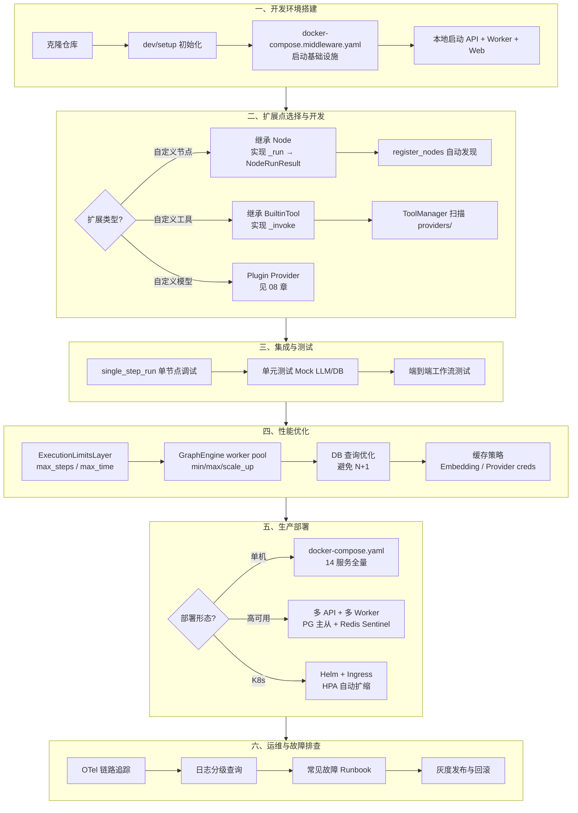
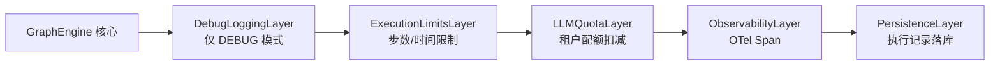
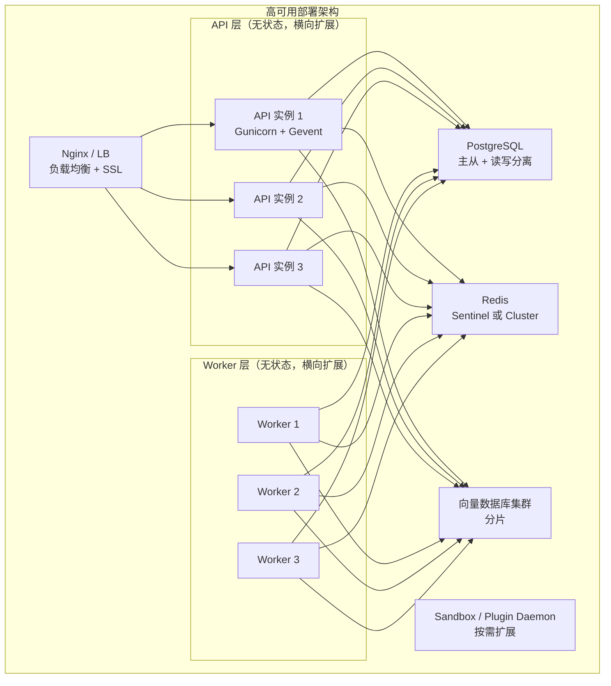
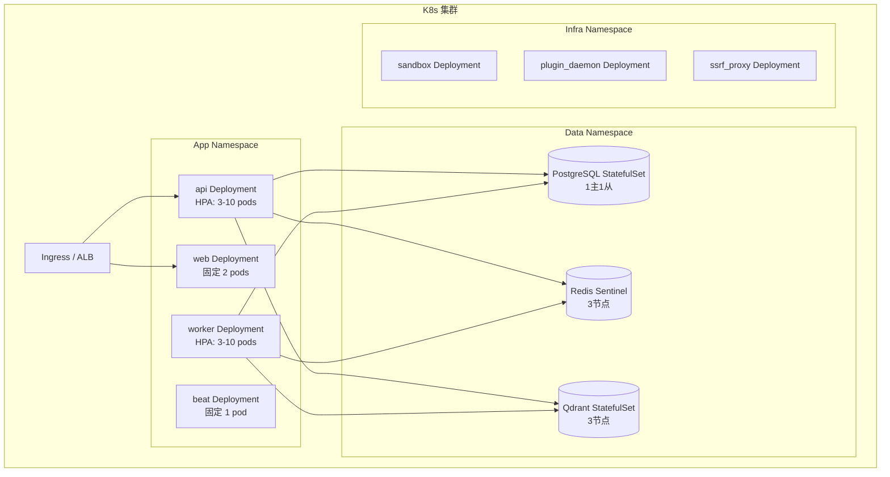
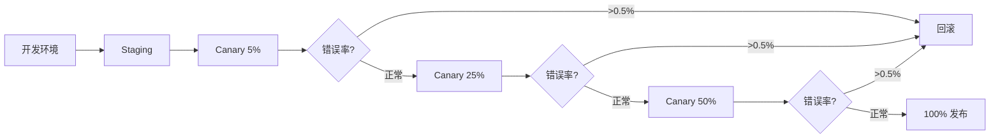
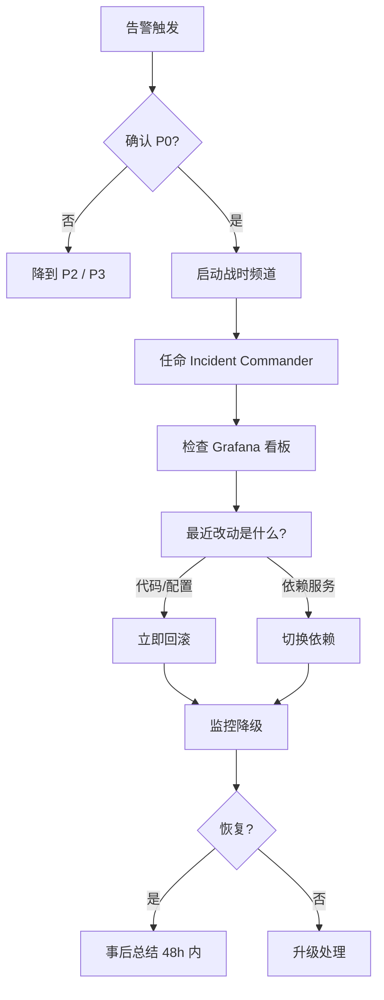

# 实战 — 基于 Dify 的二次开发与部署

> **学习目标**：综合运用前 9 篇的知识，掌握 Dify 的二次开发流程、扩展点、性能优化、生产部署和故障排查方法。
>
> **读完本章你应该能回答**：
> - 二次开发前需要理解的最小核心是什么？"前 9 篇的哪些章节是必读"？
> - 开发环境搭建的关键步骤（环境要求 / 克隆初始化 / 启动开发环境）有哪些坑？
> - 什么时候应该用 Docker Compose？什么时候应该本地启动？
> - 自定义 LLM Provider、自定义工具、自定义 Workflow 节点的扩展点分别在哪里？
> - 性能优化的高频场景（LLM 节点慢、HTTP 请求慢、检索 Top-K 过大）怎么排查？
> - 生产部署需要考虑哪些层面（基础设施 / API 层 / Worker 层 / 数据层）？
> - 监控告警应该采集哪些指标？阈值怎么定？
> - 故障排查的方法论：先查什么、再查什么、怎么用 trace？
> - 升级 Dify 的最佳实践？如何避免升级导致配置丢失？

## 本章要解决的问题

前 15 章拆解了 Dify 的每一条原理——Agent 运行时如何循环、Workflow 引擎如何调度 DAG、RAG 如何索引与检索、工具如何注册与调用。但在真实工程中，原理只是起点。**当 Dify 的内置能力不够用时，团队面临一个抉择：是在 Dify 之上做二次开发，还是绕过 Dify 自建？**

这个抉择背后是一组具体的工程矛盾：Dify 的节点类型有限，业务需要的"调内部 ERP""查私有向量库""执行自定义 Python 逻辑"都没有现成节点；Dify 的工具体系覆盖了 OpenAPI/MCP/Plugin/Builtin 四类，但新增一个 Builtin 工具需要知道 YAML+Python 双文件的约定；开发完成后，Dify 的 GraphEngine 有自己的 worker pool、执行限制、配额扣减层，性能瓶颈在哪里不查源码看不出来；部署到生产时，Dify 的 docker-compose.yaml 拉起了 14 个服务，哪些是必需的、哪些是可选的、哪些要做成高可用，文档散落在 `docker/envs/` 的几十个 env 文件里。

本章的使命是把这些散落的工程实践串成一条闭环：**二次开发需求 → 扩展点选择 → 开发实现 → 集成测试 → 性能优化 → 生产部署 → 运维排查**。这条闭环坏了，团队要么 fork Dify（升级即噩梦），要么在外部搭一层壳（丧失 Dify 的可观测性和配额管理），要么放弃 Dify。本章的每个阶段对应闭环的一段，源码引用落到具体行号，让你拿着这篇文档就能从零跑到生产。

## 宏观架构：二次开发到上线的工程生命周期

下图是二次开发需求从产生到线上稳定运行的完整生命周期，也是全文的叙事主线——后续每一节对应生命周期的一个阶段。



理解这张图的关键：**二次开发不是"写完代码就结束"，而是"从扩展点切入 → 经过性能验证 → 走完部署闭环 → 持续运维"的完整工程**。每个阶段都有 Dify 特定的约定（节点自动发现、Layer 叠加、env 文件分层），跳过任何一个都会在后面踩坑。

下面按这六个阶段逐层展开。

## 一、开发环境搭建

**这一节为什么存在**：Dify 是前后端分离 + Celery 异步 + Plugin Daemon 的多进程架构，本地跑通需要同时启动 API、Worker、Beat、Web 四个进程，外加 Postgres、Redis、Sandbox 等基础设施。环境搭不起来，后面所有开发都无从开始。

### 1.1 环境要求

| 组件 | 版本要求 | 用途 |
|------|----------|------|
| Python | 3.12+ | 后端运行时 |
| Node.js | 18+ | 前端构建 |
| PostgreSQL | 15+ | 主数据库 |
| Redis | 6+ | Celery Broker + 缓存 |
| uv | 最新版 | Python 包管理（替代 pip） |
| pnpm | 最新版 | Node 包管理 |
| Docker & Docker Compose | 最新稳定版 | 基础设施容器化 |

### 1.2 一键初始化：dev/setup

Dify 在 `dev/` 目录下提供了一组封装好的启动脚本，避免开发者手动复制 env 文件和安装依赖。入口是 `dev/setup`（dev/setup:1）：

```bash
# 克隆仓库
git clone https://github.com/langgenius/dify.git
cd dify

# 一键初始化：复制 env 文件 + 安装依赖
./dev/setup
```

`dev/setup` 做了四件事（dev/setup:14-27）：

1. 复制 `api/.env.example` → `api/.env`
2. 复制 `web/.env.example` → `web/.env.local`
3. 复制 `docker/envs/middleware.env.example` → `docker/middleware.env`
4. 安装后端依赖（`uv sync --group dev`）和前端依赖（`pnpm install`）

### 1.3 启动基础设施：docker-compose.middleware.yaml

Dify 的 `docker/docker-compose.yaml` 是生产级全量部署（14 个服务），开发时不需要全拉起来。`docker/docker-compose.middleware.yaml` 只包含基础设施（Postgres、Redis、Sandbox 等），API/Worker/Web 在本地跑以便热重载：

```bash
# 启动基础设施（Postgres + Redis + Sandbox 等）
./dev/start-docker-compose
```

`dev/start-docker-compose`（dev/start-docker-compose:8）实际执行：

```bash
docker compose --env-file middleware.env \
  -f docker-compose.middleware.yaml -p dify up -d
```

### 1.4 本地启动应用进程

基础设施就绪后，用三个终端分别启动 API、Worker、Web：

```bash
# 终端 1：启动 API（含自动迁移 + debug 模式）
./dev/start-api
# 实际执行：uv run flask db upgrade && uv run flask run --host 0.0.0.0 --port=5001 --debug

# 终端 2：启动 Worker（Celery）
./dev/start-worker
# 支持参数：--queues dataset,workflow --concurrency 4 --pool gevent

# 终端 3：启动前端
./dev/start-web
```

`dev/start-worker`（dev/start-worker:127-129）的核心命令：

```bash
uv run celery -A app.celery worker \
  -P ${POOL} -c ${CONCURRENCY} --loglevel ${LOGLEVEL} -Q ${QUEUES}
```

**关键设计决策——为什么开发时用 middleware 而不是全量 docker-compose？** 因为 API 和 Worker 需要频繁改代码重启，放在容器里每次都要重新构建镜像；而基础设施（DB、Redis）几乎不变，放容器里一键起停最省事。这种"基础设施容器化 + 应用本地化"的混合模式是 Dify 开发环境的核心设计。

**Celery 队列分层**：`dev/start-worker` 默认按 `EDITION` 环境变量分配队列（dev/start-worker:103-114）。社区版（SELF_HOSTED）消费 `dataset,workflow,mail,ops_trace,plugin,...` 等队列；云版（CLOUD）则按 `workflow_professional/team/sandbox` 分级。开发时如果不指定 `--queues`，默认消费所有社区版队列。

> 异步任务架构、Celery 队列路由、事件系统详见 [06-async-tasks-and-events.md](./dify-06-async-tasks-and-events.md)。

## 二、扩展点选择与开发

**这一节为什么存在**：Dify 的扩展点不是"一个插件接口"，而是分散在节点、工具、模型三个层面的独立体系。选错扩展点会导致开发量翻倍——比如"调内部 API"可以做成自定义工具（轻量）也可以做成自定义节点（重量），"执行自定义逻辑"可以做成 Code 节点（Sandbox 受限）也可以做成自定义节点（全功能）。这一节帮你选对入口。

### 2.1 自定义 Workflow 节点

当需要执行 Sandbox 不支持的复杂逻辑（如访问内部数据库、调用私有 SDK），或者需要自定义输入输出 Schema 时，开发自定义节点。

**节点基类接口**（已对照源码核验）：

节点继承 `Node[NodeData]`（`from graphon.nodes.base.node import Node`），核心接口：

| 成员 | 类型 | 说明 |
|------|------|------|
| `node_type` | 类属性 | `NodeType("my-node")`，注册表键 |
| `execution_type` | 类属性 | `NodeExecutionType.ROOT` 或 `NODE` |
| `version()` | classmethod | 返回版本字符串，如 `"1"` |
| `_run()` | 实例方法 | **返回 `NodeRunResult`**，不是 Generator |
| `post_init()` | 实例方法 | 节点构造后的初始化钩子 |
| `get_default_config()` | classmethod | 返回节点默认配置 |

以 `TriggerWebhookNode` 为参考实现（api/core/workflow/nodes/trigger_webhook/node.py:22）：

```python
from graphon.nodes.base.node import Node
from graphon.node_events import NodeRunResult
from graphon.enums import NodeExecutionType, WorkflowNodeExecutionStatus

class MyNodeData(BaseNodeData):
    config_value: str

class MyNode(Node[MyNodeData]):
    node_type = NodeType("my-node")
    execution_type = NodeExecutionType.NODE

    @classmethod
    def version(cls) -> str:
        return "1"

    def _run(self) -> NodeRunResult:
        # 1. 从 VariablePool 读取上游输入
        input_value = self.graph_runtime_state.variable_pool.get(
            [self.node_id, "input"]
        )
        # 2. 执行业务逻辑
        result = self._process(input_value)
        # 3. 返回结果（GraphEngine 自动把 outputs 写回 VariablePool）
        return NodeRunResult(
            status=WorkflowNodeExecutionStatus.SUCCEEDED,
            inputs={"input": input_value},
            outputs={"output": result},
        )
```

> **注意**：`_run()` 返回 `NodeRunResult` 对象（`from graphon.node_events import NodeRunResult`），不是 `Generator[NodeEvent, None, None]`，也不需要 `yield NodeSucceededEvent`。这是 Dify v1.15.0 的当前接口。

**自动发现与注册**：把节点类放在 `api/core/workflow/nodes/` 目录下，`register_nodes()` 会通过 `pkgutil.walk_packages` 自动导入所有模块（api/core/workflow/node_factory.py:110-114）：

```python
@lru_cache(maxsize=1)
def register_nodes() -> None:
    """Import production node modules so they self-register with Node."""
    _import_node_package("graphon.nodes")
    _import_node_package("core.workflow.nodes")
```

`_import_node_package`（api/core/workflow/node_factory.py:102-107）遍历包下所有模块并 `importlib.import_module`，触发节点类的 `__init_subclass__` 副作用完成注册。不需要手动写注册代码。

**版本化解析**：`resolve_workflow_node_class`（api/core/workflow/node_factory.py:129-140）按 `node_type` + `node_version` 解析节点类。如果请求的版本不存在，回退到 `LATEST_VERSION`。这让你可以同时维护 v1 和 v2 两套节点实现。

> 节点调度、变量池、Layer 体系详见 [11-workflow-engine.md](./dify-11-workflow-engine.md)。

### 2.2 自定义 Builtin 工具

当需要给 Agent 提供一个可调用的能力（如"查内部工单系统""发送企业微信消息"），自定义工具比重写节点更轻量。

**工具基类接口**（已对照源码核验）：

工具继承 `Tool(ABC)`（api/core/tools/__base/tool.py:20），核心接口：

| 成员 | 类型 | 说明 |
|------|------|------|
| `__init__(entity, runtime)` | 构造器 | 接收 `ToolEntity` + `ToolRuntime` |
| `tool_provider_type()` | 抽象方法 | 返回 `ToolProviderType` |
| `_invoke(...)` | 抽象方法 | 返回 `ToolInvokeMessage` 或其列表/Generator |
| `invoke(...)` | 公开方法 | 包装 `_invoke`，做参数类型转换 |

`_invoke` 签名（api/core/tools/__base/tool.py:97-106）：

```python
@abstractmethod
def _invoke(
    self,
    user_id: str,
    tool_parameters: dict[str, Any],
    conversation_id: str | None = None,
    app_id: str | None = None,
    message_id: str | None = None,
) -> ToolInvokeMessage | list[ToolInvokeMessage] | Generator[ToolInvokeMessage, None, None]:
    pass
```

Builtin 工具的推荐基类是 `BuiltinTool`（api/core/tools/builtin_tool/tool.py:20），它在 `Tool` 之上增加了 `invoke_model()`（调 LLM）和 `create_text_message()`（构造文本消息）等便捷方法。

以 `CurrentTimeTool` 为参考实现（api/core/tools/builtin_tool/providers/time/tools/current_time.py:11）：

```python
from core.tools.builtin_tool.tool import BuiltinTool
from core.tools.entities.tool_entities import ToolInvokeMessage
from collections.abc import Generator
from datetime import UTC, datetime

class CurrentTimeTool(BuiltinTool):
    def _invoke(
        self, user_id: str, tool_parameters: dict[str, Any],
        conversation_id: str | None = None, app_id: str | None = None,
        message_id: str | None = None,
    ) -> Generator[ToolInvokeMessage, None, None]:
        tz = tool_parameters.get("timezone", "UTC")
        fm = tool_parameters.get("format") or "%Y-%m-%d %H:%M:%S %Z"
        yield self.create_text_message(f"{datetime.now(UTC).strftime(fm)}")
```

**双文件约定**：每个 Builtin 工具由一对文件组成：
- `tools/{tool_name}.yaml`：参数 Schema、描述、标签
- `tools/{tool_name}.py`：工具实现类

`BuiltinToolProviderController._load_tools`（api/core/tools/builtin_tool/provider.py:65-80）扫描 `tools/` 目录下的 `.yaml` 文件，用 `load_single_subclass_from_source` 加载对应的 Python 类。

**Provider 自动发现**：`ToolManager._list_hardcoded_providers`（api/core/tools/tool_manager.py:595-624）扫描 `api/core/tools/builtin_tool/providers/` 目录，对每个子目录加载 `{provider_name}.py` 中的 `BuiltinToolProviderController` 子类。Provider 构造时自动加载 `{provider_name}.yaml` 和所有工具。

> 工具注册中心、六种 Provider 类型、ToolManager 完整架构详见 [07-tool-registration.md](./dify-07-tool-registration.md)。

### 2.3 其他扩展点

| 扩展需求 | 扩展点 | 参考文档 |
|---------|--------|---------|
| 自定义模型提供商 | Plugin Provider | [08-model-providers-and-extensions.md](./dify-08-model-providers-and-extensions.md) |
| 自定义 Agent 策略 | Plugin Agent Strategy | [03-agent-runtime.md](./dify-03-agent-runtime.md) §演进方向 |
| 自定义触发器 | Trigger Provider | [15-trigger-system.md](./dify-15-trigger-system.md) |
| MCP 工具集成 | MCP Client | [12-mcp-protocol.md](./dify-12-mcp-protocol.md) |

## 三、集成与测试

**这一节为什么存在**：节点和工具开发完成后，不能直接丢到生产工作流里跑——需要先单独验证节点逻辑，再在工作流上下文中测试集成。Dify 提供了 `single_step_run` 单节点调试入口和分层测试体系。

### 3.1 单节点调试：single_step_run

`WorkflowEntry.single_step_run`（api/core/workflow/workflow_entry.py:252）在不启动完整 GraphEngine 的情况下单独执行一个节点：

```python
@classmethod
def single_step_run(
    cls, *, workflow, node_id, user_id, user_inputs, variable_pool, ...
) -> tuple[Node, Generator[GraphNodeEventBase, None, None]]:
    node_config = workflow.get_node_config_by_id(node_id)
    node_type = node_config_data.type
    node_cls = resolve_workflow_node_class(node_type=node_type, node_version=...)
    # 构造独立 graph_runtime_state，只跑这一个节点
```

它做三件事：解析节点类 → 构造独立运行上下文 → 返回事件 Generator。开发时可以用它快速验证节点逻辑：

```python
node, generator = WorkflowEntry.single_step_run(
    workflow=workflow,
    node_id="my-node-1",
    user_id="xxx",
    user_inputs={"query": "test"},
    variable_pool=variable_pool,
)
for event in generator:
    print(event)  # 实时查看执行事件流
```

### 3.2 测试体系

```
api/tests/
├── unit_tests/          # 单元测试
│   ├── core/            #   核心引擎测试
│   │   ├── agent/
│   │   ├── rag/
│   │   └── workflow/
│   ├── services/        #   服务层测试
│   └── models/          #   模型层测试
├── integration/         # 集成测试
└── test_containers_integration_tests/  # 容器化集成测试
```

```bash
# 后端单元测试
cd api && uv run pytest tests/unit_tests/ -v --tb=short

# 特定模块
uv run pytest tests/unit_tests/core/workflow/ -v

# 前端测试
cd web && pnpm test
```

**Mock 模式**：测试自定义节点/工具时，Mock LLM 和数据库是最常见的诉求：

```python
from unittest.mock import MagicMock, patch

# Mock LLM 调用
@patch("graphon.model_runtime.llm.LLM.invoke")
def test_workflow_with_mock_llm(mock_invoke):
    mock_invoke.return_value = LLMResult(text="mock response")
    # ... 跑工作流，LLM 节点返回 mock response

# Mock 数据库
@patch("extensions.ext_database.db")
def test_my_service(mock_db):
    mock_db.session.scalar.return_value = mock_entity
    service = MyService()
    result = service.get(tenant_id, entity_id)
    assert result == mock_entity
```

### 3.3 数据库操作规范

自定义节点或工具如果需要持久化数据，遵循 Dify 的 SQLAlchemy 模式：

```python
from sqlalchemy.orm import Mapped, mapped_column
from sqlalchemy import select, func
from api.models.types import StringUUID, EnumText
from api.models.base import TypeBase

class MyModel(TypeBase):
    __tablename__ = "my_table"
    id: Mapped[str] = mapped_column(
        StringUUID, insert_default=lambda: str(uuid4()), init=False,
    )
    tenant_id: Mapped[str] = mapped_column(String(255))
    name: Mapped[str] = mapped_column(String(255))
    status: Mapped[MyStatus] = mapped_column(
        EnumText(MyStatus), server_default=sa.text("'active'")
    )
```

**标准查询模式**（所有查询必须带 `tenant_id` 过滤，详见 [13-multi-tenancy-and-security.md](./dify-13-multi-tenancy-and-security.md)）：

```python
# 推荐：typed scalar
result = db.session.scalar(
    select(MyModel).where(MyModel.id == id, MyModel.tenant_id == tenant_id)
)

# 分页
items = db.session.scalars(
    select(MyModel)
    .where(MyModel.tenant_id == tenant_id)
    .order_by(MyModel.created_at.desc())
    .limit(page_size).offset((page - 1) * page_size)
).all()
```

## 四、性能优化

**这一节为什么存在**：Dify 的 Workflow 引擎在默认配置下能扛中小规模流量，但生产场景下三个瓶颈会依次暴露——GraphEngine worker pool 不够用导致节点排队、LLM 调用慢拖垮整个工作流、数据库 N+1 查询吃光连接池。这一节讲怎么定位和解决这些瓶颈。

### 4.1 GraphEngine 并发与执行限制

GraphEngine 的并发模型是"ThreadPool + 命令通道"。每个 WorkflowEntry 实例有自己的 worker pool，配置在构造时注入（api/core/workflow/workflow_entry.py:206-211）：

```python
config=GraphEngineConfig(
    min_workers=dify_config.GRAPH_ENGINE_MIN_WORKERS,      # 默认 3
    max_workers=dify_config.GRAPH_ENGINE_MAX_WORKERS,      # 默认 10
    scale_up_threshold=dify_config.GRAPH_ENGINE_SCALE_UP_THRESHOLD,  # 默认 3
    scale_down_idle_time=dify_config.GRAPH_ENGINE_SCALE_DOWN_IDLE_TIME,  # 默认 5.0s
)
```

| 配置项 | 默认值 | 含义 | 调优建议 |
|--------|--------|------|---------|
| `GRAPH_ENGINE_MIN_WORKERS` | 3 | 每个 GraphEngine 实例最小线程数 | CPU 密集型节点多时调高 |
| `GRAPH_ENGINE_MAX_WORKERS` | 10 | 最大线程数上限 | 并行分支多时调高 |
| `GRAPH_ENGINE_SCALE_UP_THRESHOLD` | 3 | 队列深度达到此值时扩容 | 延迟敏感时调低 |
| `GRAPH_ENGINE_SCALE_DOWN_IDLE_TIME` | 5.0s | 空闲多久后缩容 | 避免频繁伸缩时调高 |

**执行限制层**：`ExecutionLimitsLayer`（`from graphon.graph_engine.layers import ExecutionLimitsLayer`）在 Layer 链中强制两个硬限制（api/core/workflow/workflow_entry.py:228-231）：

```python
limits_layer = ExecutionLimitsLayer(
    max_steps=dify_config.WORKFLOW_MAX_EXECUTION_STEPS,  # 默认 500
    max_time=dify_config.WORKFLOW_MAX_EXECUTION_TIME,    # 默认 1200s (20min)
)
```

| 限制 | 默认值 | 触发后果 | 配置项 |
|------|--------|---------|--------|
| 最大步数 | 500 | 工作流中止，返回错误 | `WORKFLOW_MAX_EXECUTION_STEPS` |
| 最大时间 | 1200s | 工作流超时中止 | `WORKFLOW_MAX_EXECUTION_TIME` |
| 调用深度 | 5 | 嵌套工作流抛 ValueError | `WORKFLOW_CALL_MAX_DEPTH` |
| 变量大小 | 200KB | 写入时截断/报错 | `MAX_VARIABLE_SIZE` |

这三个限制是"安全阀"——防止单个工作流跑飞吃光资源。生产环境如果工作流节点多（如 Loop 场景），需要调大 `MAX_EXECUTION_STEPS`；如果 LLM 调用慢导致超时，调大 `MAX_EXECUTION_TIME` 或优化 LLM 节点的 `max_tokens`。

### 4.2 Layer 链与横切关注点

GraphEngine 的 Layer 链是性能调优的核心抓手。Layer 注册顺序决定钩子调用顺序（api/core/workflow/workflow_entry.py:216-236）：



**LLMQuotaLayer**（api/core/app/workflow/layers/llm_quota.py:37）：在 LLM 类节点（LLM、ParameterExtractor、QuestionClassifier）执行前检查租户配额，执行后扣减。配额不足时发送 `AbortCommand` 中止工作流。这个层是"计费闸门"，不能关掉。

**ObservabilityLayer**（api/core/app/workflow/layers/observability.py:42）：为每个节点创建 OpenTelemetry Span，把节点执行时间、输入输出、错误信息上报到 OTel 后端。生产环境必须开启（`ENABLE_OTEL=true`），否则性能瓶颈无处可查。

> 可观测性、OTel 集成、Langfuse/Phoenix 详见 [14-observability.md](./dify-14-observability.md)。

### 4.3 数据库查询优化

Dify 的高频性能问题之一是 N+1 查询：

```python
# 反模式：N+1 查询——每个 doc 触发一次 segments 查询
for doc in documents:
    segments = doc.segments  # 每次循环一次查询

# 优化：预加载
documents = db.session.scalars(
    select(Document)
    .options(selectinload(Document.segments))  # 一次性加载所有 segments
    .where(Document.dataset_id == dataset_id)
).all()
```

**连接池配置**：PostgreSQL 默认 `max_connections=100`（docker-compose.yaml），API 每个进程默认连接池 `pool_size=10`。生产环境多 API 实例时需要按公式估算：

```
所需 PG 连接数 = (api_instances × pool_size) + (worker_instances × pool_size) + 30_reserved
```

超过 PG `max_connections` 时要么调大 PG 配置，要么引入 pgbouncer 做连接池代理。

### 4.4 缓存策略

Dify 内部已有多个缓存层，二次开发时应复用而非自建：

| 缓存层 | 位置 | TTL | 用途 |
|--------|------|-----|------|
| Embedding 缓存 | `EmbeddingCache` 表 | 永久 | 相同文本不重复调 Embedding API |
| Provider 凭据缓存 | `ToolProviderCredentialsCache` | 进程内 | 避免每次工具调用都查 DB |
| 模型配置缓存 | `ProviderModelCache` | 进程内 | 避免重复加载模型 schema |
| 应用配置缓存 | `AppConfigCache` | 进程内 | 避免每次请求重解析 DSL |

自定义工具如果需要缓存，推荐用 Redis 而非进程内缓存（多 Worker 实例间不共享）：

```python
class CachedProviderManager:
    def get_provider_credentials(self, tenant_id, provider, model):
        cache_key = f"provider_creds:{tenant_id}:{provider}:{model}"
        cached = redis.get(cache_key)
        if cached:
            return json.loads(cached)
        creds = self._query_db(tenant_id, provider, model)
        redis.setex(cache_key, 300, json.dumps(creds))  # 5 分钟 TTL
        return creds
```

## 五、生产部署

**这一节为什么存在**：开发环境跑通的代码，到生产环境要解决三个问题——如何从单机扩展到多实例？14 个 docker-compose 服务哪些要做高可用？配置如何管理不丢失？这一节按"单机 → 高可用 → K8s"三档递进。

### 5.1 单机部署：docker-compose.yaml

`docker/docker-compose.yaml` 是 Dify 的官方单机部署模板，包含 14 个服务（docker/docker-compose.yaml）：

| 服务 | 镜像 | 模式 | 用途 |
|------|------|------|------|
| `init_permissions` | busybox:latest | 一次性 | 修复 storage 权限 |
| `api` | langgenius/dify-api:1.15.0 | MODE=api | Flask API 服务 |
| `api_websocket` | langgenius/dify-api:1.15.0 | collaboration profile | WebSocket 协同服务 |
| `worker` | langgenius/dify-api:1.15.0 | MODE=worker | Celery Worker |
| `worker_beat` | langgenius/dify-api:1.15.0 | MODE=beat | Celery Beat 定时任务 |
| `web` | langgenius/dify-web:1.15.0 | - | Next.js 前端 |
| `db_postgres` | postgres:15-alpine | postgresql profile | 主数据库 |
| `db_mysql` | mysql:8.0 | mysql profile | 备选数据库 |
| `redis` | redis:6-alpine | - | 缓存 + Celery Broker |
| `sandbox` | langgenius/dify-sandbox:0.2.15 | - | 代码执行沙箱 |
| `plugin_daemon` | langgenius/dify-plugin-daemon:0.6.3-local | - | 插件守护进程 |
| `ssrf_proxy` | ubuntu/squid:latest | - | SSRF 防护代理 |
| `nginx` | nginx:latest | - | 反向代理 + SSL |
| `certbot` | certbot/certbot | certbot profile | Let's Encrypt 证书 |

**配置分层架构**：Dify 的 env 文件不是单一 `.env`，而是按类别分散在 `docker/envs/` 下（docker/docker-compose.yaml:8-68）：

```
docker/envs/
├── core-services/       # API/Worker/Web/Sandbox/Plugin 核心配置
│   ├── shared.env       #   API + Worker 共享配置
│   ├── api.env          #   API 专属
│   ├── worker.env       #   Worker 专属
│   └── ...
├── databases/           # PG/MySQL/Redis 连接配置
├── vectorstores/        # 16 种向量库配置（按 profile 启用）
├── infrastructure/      # Nginx/Certbot/SSRF/etcd/minio
└── security.env         # SECRET_KEY 等安全配置
```

`docker/.env`（从 `.env.example` 复制）的值优先级最高，覆盖 `envs/` 下的默认值。这种分层设计让你可以只改 `.env` 里的核心变量（`SECRET_KEY`、`DB_PASSWORD` 等），其余用默认值。

**单机部署步骤**：

```bash
cd docker
cp .env.example .env
# 编辑 .env：设置 SECRET_KEY、DB_PASSWORD、INIT_PASSWORD
docker compose up -d
```

### 5.2 高可用部署

单机部署的瓶颈在三个单点：API 实例、PostgreSQL、Redis。高可用部署的核心是把这三个组件横向扩展：



**API 层扩展**：API 是无状态的（状态在 PG/Redis），直接多实例 + Nginx 负载均衡。Gunicorn 配置（`docker/.env.example`）：

```bash
SERVER_WORKER_AMOUNT=1        # Gunicorn worker 数，生产建议 = CPU 核数
SERVER_WORKER_CLASS=gevent    # 协程模式，提升并发
SERVER_WORKER_CONNECTIONS=10  # 每个 worker 的并发连接数，生产调到 100+
```

**Worker 层扩展**：Celery Worker 也是无状态的，多实例时注意队列分配。生产环境推荐按队列分组部署 Worker（dev/start-worker:103-114 的模式）：

```bash
# Worker 组 1：处理 dataset 队列（IO 密集，高并发）
celery -A app.celery worker -P gevent -c 20 -Q dataset,dataset_summary

# Worker 组 2：处理 workflow 队列（CPU 密集，少并发）
celery -A app.celery worker -P prefork -c 4 -Q workflow,triggered_workflow_dispatcher

# Worker 组 3：处理轻量任务
celery -A app.celery worker -P gevent -c 10 -Q mail,ops_trace,app_deletion
```

**数据库高可用**：
- PostgreSQL：主从复制 + PgBouncer 连接池 + WAL 归档 + PITR
- Redis：Sentinel 自动故障转移 或 Cluster 分片
- 向量库：Qdrant/Weaviate 按各自方案做集群

### 5.3 K8s 部署

K8s 部署的核心是把 docker-compose 的服务映射为 K8s 资源：

| docker-compose 服务 | K8s 资源 | 副本策略 |
|---------------------|---------|---------|
| api | Deployment + Service | HPA（CPU > 70% 扩容） |
| worker | Deployment | HPA（队列深度 > 100 扩容） |
| web | Deployment + Service | 固定 2+ 副本 |
| db_postgres | StatefulSet + PVC | 1 主 1 从 |
| redis | StatefulSet + PVC | Sentinel 3 节点 |
| nginx | Ingress Controller | 固定 2+ 副本 |
| sandbox | Deployment | 固定 2+ 副本 |
| plugin_daemon | Deployment | 固定 2+ 副本 |



**K8s 部署的关键决策**：
- **API 和 Worker 共用镜像**（`langgenius/dify-api`），通过 `MODE` 环境变量区分（`MODE=api` / `MODE=worker` / `MODE=beat`）
- **Beat 必须单实例**：Celery Beat 是单点设计，多实例会重复触发定时任务。K8s 下用 StatefulSet 或加分布式锁
- **Storage 持久化**：API 的 `./volumes/app/storage` 映射为 PVC，多实例时必须共享存储（NFS 或 S3）
- **Plugin Daemon 存储**：插件包存储在 `./volumes/plugin_daemon`，K8s 下用 PVC 或对象存储

### 5.4 部署形态对比

| 形态 | 优点 | 缺点 | 适用 |
|------|------|------|------|
| **Docker Compose 单机** | 上手快，一条命令 | 单点故障 | dev / 小规模 (< 100 DAU) |
| **Docker Compose + 外部 DB** | 中等可用 | 手动运维 | 中小规模 (100-10k DAU) |
| **K8s 单 region** | 自动扩缩，自愈 | 复杂度高 | 中大规模 (10k-1M DAU) |
| **K8s 多 region + CDN** | 高可用，低延迟 | 资源成本高 | 全球业务 (1M+ DAU) |

## 六、运维与故障排查

**这一节为什么存在**：系统上线后，"慢""错""挂"三类问题会交替出现。没有系统化的排查方法论，只能靠重启和祈祷。这一节给出从日志到 trace 到 Runbook 的完整排查路径。

### 6.1 日志体系

Dify 的日志配置（`docker/.env.example`）：

```bash
LOG_LEVEL=INFO              # 生产用 INFO，排查时临时调 DEBUG
LOG_OUTPUT_FORMAT=text       # 生产建议 json（便于 ELK/Loki 解析）
LOG_FILE=/app/logs/server.log
LOG_FILE_MAX_SIZE=20         # MB
LOG_FILE_BACKUP_COUNT=5
```

**日志分析技巧**：

```bash
# 实时跟踪 API 错误
tail -f api/logs/server.log | grep ERROR

# 搜索特定工作流执行
grep "workflow_id:xxx" api/logs/server.log

# 分析 LLM 调用延迟
grep "LLM.*latency" api/logs/server.log | awk '{print $NF}' | sort -n

# 统计错误率
grep -c "ERROR" api/logs/server.log
grep -c "INFO" api/logs/server.log
```

### 6.2 链路追踪

`ObservabilityLayer`（api/core/app/workflow/layers/observability.py:42）为每个节点创建 OTel Span。开启方式：

```bash
ENABLE_OTEL=true
OTEL_EXPORTER_OTLP_ENDPOINT=http://otel-collector:4317
```

开启后，每个节点执行时会产生一个 Span，包含：
- `node.title`：节点标题
- `node.id`：节点 ID
- `node.type`：节点类型
- 执行时间（start → end）
- 错误信息（如果有）
- 节点输入输出（由 `NodeOTelParser` 解析）

不同节点类型有专用 Parser（api/core/app/workflow/layers/observability.py:74-80）：

| 节点类型 | Parser | 额外上报 |
|---------|--------|---------|
| LLM | `LLMNodeOTelParser` | model、tokens、latency |
| Tool | `ToolNodeOTelParser` | tool_name、inputs |
| KnowledgeRetrieval | `RetrievalNodeOTelParser` | query、top_k、scores |
| 其他 | `DefaultNodeOTelParser` | 基础信息 |

### 6.3 常见故障速查表

| 问题 | 第一动作 | 相关日志 |
|------|---------|---------|
| API 启动失败 | 检查 DB/Redis 连接、配置完整性 | `server.log` |
| 工作流执行失败 | 检查节点配置、变量绑定、LLM 凭证 | `server.log` |
| 文档索引卡住 | 检查 Embedding 模型、向量库连接 | `worker.log` |
| 对话无响应 | 检查 WebSocket、LLM 提供商状态 | `server.log` |
| Worker 不消费 | 检查 Celery Broker (Redis) 连接、队列名 | `worker.log` |
| LLM 调用超时 | 检查 SSRF Proxy、提供商 API 状态 | `server.log` |
| 插件加载失败 | 检查插件签名、Plugin Daemon 连接 | `plugin_daemon` |
| 配额超限 | 检查 `LLMQuotaLayer` 配置 | `server.log` |
| 工作流超步数 | 调大 `WORKFLOW_MAX_EXECUTION_STEPS` | `server.log` |

### 6.4 典型故障排查路径

**案例 1：工作流卡在某节点**

```
症状：UI 显示节点一直 "running"
排查路径：
1. 看 server.log 找该节点的最后一次日志
2. 检查是否 LLM 凭证失效 / API 限流
3. 检查是否代码节点抛异常但被 Layer 吞掉
4. 看 Redis generate_task:{task_id} 队列是否堆积
5. 查 OTel trace 定位 span 最长的那个调用
```

**案例 2：文档索引长时间不完成**

```
症状：上传文档后状态一直是 indexing
排查路径：
1. 看 worker.log 中的 document_indexing_task 日志
2. 检查 Embedding 模型连接
3. 检查向量库连接 / 配额
4. 看 celery 队列深度指标
```

**案例 3：WebSocket 频繁断开**

```
症状：长对话中断，前端报 "connection lost"
排查路径：
1. 检查 Nginx 的 proxy_read_timeout（默认 3600s）
2. 检查心跳是否正常发送（QueuePingEvent）
3. 检查 api_websocket 服务是否健康
```

> WebSocket 心跳、重连机制、事件过滤详见 [06-async-tasks-and-events.md](./dify-06-async-tasks-and-events.md)。

### 6.5 灰度发布



灰度判断逻辑（按 tenant_id 哈希分流）：

```python
import hashlib

def should_use_canary(tenant_id: str, percentage: int = 5) -> bool:
    h = int(hashlib.md5(tenant_id.encode()).hexdigest(), 16)
    return (h % 100) < percentage
```

### 6.6 数据库迁移

```bash
# 生成迁移脚本
cd api && flask db migrate -m "add_new_table"

# 应用迁移
flask db upgrade

# 回滚
flask db downgrade
```

**长事务迁移策略**（大表加列时避免锁表）：

```python
# 不要：单条 UPDATE 上百万行
# op.execute("UPDATE messages SET new_col = ...")

# 推荐：分批 + 后台任务
def migrate_messages_batch(batch_size=1000):
    while True:
        updated = db.execute(
            update(Message)
            .where(Message.new_col.is_(None))
            .values(new_col=func.coalesce(Message.old_col, ""))
            .execution_options(synchronize_session=False)
            .returning(Message.id)
            .limit(batch_size)
        )
        if not updated:
            break
        time.sleep(0.1)  # 让出锁
```

## 收敛

### 边界：二次开发 vs 绕过 Dify

不是所有需求都适合在 Dify 内二次开发。判断标准：

| 场景 | 推荐方案 | 原因 |
|------|---------|------|
| 新增一种工作流节点 | 二次开发（自定义节点） | 复用 GraphEngine 调度、Layer、变量池 |
| 新增 Agent 可调工具 | 二次开发（自定义工具） | 复用 ToolEngine、配额、可观测性 |
| 新增模型提供商 | Plugin Provider | 复用 Model Runtime 抽象 |
| 完全独立的 AI 服务 | 绕过 Dify | Dify 的应用/配置/配额体系反而是负担 |
| 需要改 Dify 核心调度逻辑 | fork + PR | 核心逻辑改动不宜做成插件 |

**不该在这里做的事**：用自定义节点绕过 Dify 的配额检查（破坏多租户隔离）、在工具里直接读 PG 而非走 Service 层（绕过权限检查）、fork Dify 但不跟进上游（升级即灾难）。

### 扩展点速查

| 扩展需求 | 入口 | 自动发现机制 | 参考文档 |
|---------|------|-------------|---------|
| 自定义节点 | `api/core/workflow/nodes/` | `register_nodes()` + `pkgutil.walk_packages` | [11-workflow-engine.md](./dify-11-workflow-engine.md) |
| 自定义 Builtin 工具 | `api/core/tools/builtin_tool/providers/` | `ToolManager._list_hardcoded_providers` | [07-tool-registration.md](./dify-07-tool-registration.md) |
| 自定义模型 | Plugin Provider | Plugin Daemon | [08-model-providers-and-extensions.md](./dify-08-model-providers-and-extensions.md) |
| 自定义触发器 | `api/core/trigger/` | Trigger Provider 注册 | [15-trigger-system.md](./dify-15-trigger-system.md) |
| MCP 工具 | MCP Client | 动态连接 | [12-mcp-protocol.md](./dify-12-mcp-protocol.md) |

### 本章要点

1. **开发环境用混合模式**：基础设施容器化（`docker-compose.middleware.yaml`）+ 应用本地化（`dev/start-api` / `dev/start-worker`），兼顾热重载和依赖隔离。
2. **节点接口返回 `NodeRunResult`**：继承 `Node[NodeData]`，实现 `_run() -> NodeRunResult`，放在 `api/core/workflow/nodes/` 下自动发现。不是 Generator，不 yield 事件。
3. **工具接口实现 `_invoke()`**：继承 `BuiltinTool`，实现 `_invoke() -> ToolInvokeMessage | Generator`，YAML + Python 双文件约定，`ToolManager` 扫描 `providers/` 自动注册。
4. **Layer 链是性能调优核心**：Debug → Limits → Quota → OTel → Persistence，注册顺序决定钩子调用顺序。`ExecutionLimitsLayer` 默认 500 步 / 1200s，`GraphEngine` 默认 3-10 workers。
5. **部署分三档**：单机（docker-compose 14 服务）→ 高可用（多 API/Worker + PG 主从 + Redis Sentinel）→ K8s（HPA + StatefulSet + Ingress）。
6. **故障排查走 trace**：`ObservabilityLayer` 为每个节点创建 OTel Span，生产必须开启 `ENABLE_OTEL=true`，配合 Langfuse/Phoenix 可视化定位瓶颈。
7. **所有查询带 `tenant_id`**：多租户隔离是 Dify 的安全底线，自定义代码的每个 DB 查询都必须包含租户过滤。

### 推荐源码入口

| 文件 | 职责 |
|------|------|
| api/core/workflow/node_factory.py | 节点自动发现、版本化解析、`register_nodes()` |
| api/core/workflow/workflow_entry.py | GraphEngine 封装、Layer 注册、`single_step_run` |
| api/core/workflow/nodes/trigger_webhook/node.py | 自定义节点参考实现 |
| api/core/tools/__base/tool.py | `Tool` 基类、`_invoke` 抽象方法 |
| api/core/tools/builtin_tool/tool.py | `BuiltinTool` 基类 |
| api/core/tools/builtin_tool/provider.py | `BuiltinToolProviderController`、YAML 加载 |
| api/core/tools/tool_manager.py | `ToolManager` 注册中心、`_list_hardcoded_providers` |
| api/core/app/workflow/layers/observability.py | `ObservabilityLayer` OTel Span |
| api/core/app/workflow/layers/llm_quota.py | `LLMQuotaLayer` 配额扣减 |
| api/core/app/workflow/layers/persistence.py | `WorkflowPersistenceLayer` 执行记录落库 |
| docker/docker-compose.yaml | 生产单机部署模板（14 服务） |
| docker/docker-compose.middleware.yaml | 开发环境基础设施模板 |
| dev/setup | 开发环境一键初始化 |
| dev/start-worker | Celery Worker 启动脚本（含队列分配） |
| api/configs/feature/__init__.py | 性能相关配置项（`WORKFLOW_MAX_EXECUTION_STEPS` 等） |

---

## 附录

### A. 生产部署完整 Checklist

#### A.1 D-14：环境准备

- [ ] **基础设施**：Terraform/Pulumi 已应用生产环境
- [ ] **数据库**：PostgreSQL 15+ 主从 + WAL 归档 + PITR 启用
- [ ] **Redis**：Cluster 或 Sentinel 配置完成，P99 <  5ms
- [ ] **向量数据库**：Qdrant / Weaviate 集群，健康检查 30s
- [ ] **对象存储**：S3 兼容存储桶，已配 SSE-KMS + 生命周期策略
- [ ] **网络**：VPC + 私有子网 + NAT gateway + 内网 LB
- [ ] **密钥管理**：KMS 或 HashiCorp Vault 注入 `SECRET_KEY`
- [ ] **域名 + TLS**：ACME 证书自动续签，HSTS + OCSP Stapling
- [ ] **CDN**：CloudFront / Cloudflare 缓存静态资源

#### A.2 D-7：压测与调优

- [ ] **基线性能**：500 QPS chat，200 QPS workflow，P99 <  3s
- [ ] **压测报告**：locust / k6 跑完，写明瓶颈与应对
- [ ] **数据库连接池**：pgbouncer 配置合理，pool_size = 100
- [ ] **缓存命中率**：embedding cache > 70%，app config 100%
- [ ] **成本预测**：月度 LLM API cost 估算，告警阈值设置
- [ ] **容量规划**：CPU / 内存 / 磁盘 / QPS / 存储预估

#### A.3 D-3：灾备与监控

- [ ] **监控告警**：Grafana 看板挂上，P99 / Error rate / Queue length
- [ ] **告警渠道**：Slack + 邮件 + PagerDuty（核心）
- [ ] **日志**：ELK/Loki 接入，全字段 JSON，保留 90 天
- [ ] **审计日志**：必查事件已配置（详见 [13-multi-tenancy-and-security.md](./dify-13-multi-tenancy-and-security.md)）
- [ ] **Backup**：每日 DB 备份 + 每小时增量备份 + 跨 region 复制
- [ ] **Runbook**：常见故障处理文档完善

#### A.4 D-1：上线前确认

- [ ] **DB 迁移**：所有 migration 在 staging 上演练过，可回滚
- [ ] **Plugin 锁版本**：所有 Dify Market plugin 钉死 `<id>:<version>+<sha>`
- [ ] **环境变量**：所有必需 ENV 已在生产 secret 中
- [ ] **Linting**：CI 全绿（pylint / eslint / tsc）
- [ ] **安全扫描**：Trivy 无 critical，gitleaks 无密钥泄露
- [ ] **依赖**：pip-audit 无 high，npm audit 无 high

#### A.5 D-Day：灰度发布

- [ ] **Blue-Green**：新版本先切 10% 流量
- [ ] **数据校验**：对比新旧版本输出是否一致
- [ ] **健康检查**：error rate 5min 上升告警
- [ ] **回滚预案**：30 秒内可触发回滚
- [ ] **事件窗口**：非业务高峰（推荐周二上午 10 点）

### B. 容量规划公式

**核心公式**：

```
peak_qps = (DAU × active_rate × chat_per_active) / 86400

# Example: 10万 DAU, 5% active rate, 每人每天 5 次
peak_qps = (100_000 × 0.05 × 5) / 86400 ≈ 0.29 QPS

# 实际峰值 = peak_qps × spike_factor（建议 8-10x）
real_peak_qps = 2.9 QPS (日常)
super_burst_qps = 29 QPS (突发)
```

**各资源容量公式**：

| 资源 | 公式 | 示例 |
|------|------|------|
| API Pod 数 | `peak_qps × P99_latency × safety_factor / pod_capacity` | (29 × 3 × 1.5) / 50 = 2.6 → 3 pods |
| Celery Worker 数 | `(peak_qps × task_p99_latency_sec) / 60 + slack` | (29 × 5) / 60 = 2.4 → 5 workers |
| Postgres 连接 | `(api_pods × 10) + (workers × 5) + 30 reserved` | (3×10)+(5×5)+30 = 85 → 100 max |
| Redis 内存 | `(session_count × 1KB) + (cache_count × 5KB) + (queue × 2KB)` | 100k + 500k + 100 = 4.5GB |
| 向量库 | `segments × avg_vector_dim × 4 bytes × 1.3 (overhead)` | 1M × 1536 × 4 × 1.3 ≈ 8GB |
| 磁盘 | `(daily_uploads × avg_size × 365 retention) + 1.5× safety` | (10GB × 365) × 1.5 = 5.4TB |

**演进路线**：

| 阶段 | 规模 | 部署形态 |
|------|------|----------|
| 0~100 DAU | 单实例 | 1 API pod + 1 worker + docker-compose |
| 100~10k DAU | 中型 | 3 API pod + 3 worker + PG 单实例 + Redis Sentinel |
| 10k~1M DAU | 大型 | 10+ pods + 10+ workers + PG 主从 + Redis Cluster + K8s |
| 1M+ DAU | 超大 | 50+ pods + 50+ workers + PG Shard + 多 region + CDN |

### C. SLO 目标基线

**服务级 SLO**：

| 服务 | SLO 类型 | 目标 | 错误预算 |
|------|----------|------|----------|
| Chat API | 可用性 | 99.9% | 43 分钟/月 |
| Workflow API | 可用性 | 99.5% | 3.6 小时/月 |
| Chat Latency | P99 <  3s | 95% | 5% 超时 |
| Workflow Latency | P95 <  10s | 90% | 10% 超时 |
| Indexing | 95% 文档 <  1h 完成 | 95% | 5% 可晚 |
| Provider API | <  0.5% error | 99.5% | 0.5% 错误 |

**错误预算与发布节奏**：

```
月度错误预算 = (1 - SLO) × 月秒数 = (1 - 0.999) × 30 × 86400 = 2592 秒
即每月允许 43 分钟故障
```

| 错误预算消耗 | 行动 |
|--------------|------|
| <  50% | 正常发布新功能 |
| 50~80% | 只允许打补丁 |
| 80~100% | 暂停发布，排查 |
| >= 100% | 禁止发布，强制事后总结 |

**PromQL 告警示例**：

```promql
# 错误率 SLO 告警
(rate(http_requests_total{status=~"5xx"}[5m]) / rate(http_requests_total[5m])) > 0.001

# 延迟 SLO 告警
histogram_quantile(0.99, rate(http_request_duration_seconds_bucket[5m])) > 3.0

# 队列深度告警
celery_queue_length{queue="default"} > 1000
```

### D. 故障响应 Runbook

**故障分级**：

| 等级 | 影响 | 响应时间 | 通知层级 |
|------|------|----------|----------|
| P0 | 服务完全不可用 | 立即 | 全员 + CTO |
| P1 | 主要功能受限 | 5 min | on-call + TL |
| P2 | 次要功能 bug | 30 min | 团队 |
| P3 | 体验问题 | 24h | 团队 backlog |
| P4 | 文档/UI 缺陷 | 1 周 | 团队 backlog |

**P0 故障处置流程**：



**常见故障快速处置表**：

| 故障现象 | 第一动作 |
|----------|----------|
| API 502/503 | 看 nginx/ingress 日志，看后端 pod 健康 |
| Workflow 超时 | 看 celery worker 状态、看 LLM API |
| Chat 慢 | 看 OpenTelemetry trace，定位主延迟 span |
| DB 连接耗尽 | 限制 pool_size，杀长查询 |
| Redis 抖动 | 切换 sentinel，重新同步 |
| 向量库恢复慢 | 看 qdrant segment 数，可能需要重建 |
| S3 上传 5xx | 看 OSS 健康，给 S3 加速 |
| Webhook 全失败 | 检查 ingress 反代 / SSRF 验证 |

### E. 灾难恢复 RTO/RPO 目标

| 故障等级 | RTO（恢复时长） | RPO（数据丢失） | 实例 |
|----------|-----------------|-----------------|------|
| 单服务 crash | 30s（自动重启） | 0 | API pod OOM |
| 数据库故障 | 5 min（failover） | 5 min（WAL 同步） | primary 挂了 |
| 整个 Region | 1-4 hour | 1 hour（跨 region 复制） | 自然灾害 |
| 数据被误删 | 取决于备份 | 24h（每日 backup） | 误删数据库 |

**Backup 策略**：

- **Postgres**：每日全量 + 每 15 分钟 WAL 归档，保留 30 天
- **Redis**：每小时 RDB + AOF 持久化
- **Vector DB**：每日快照，保留 7 天
- **OSS 对象**：跨 region 复制 24h，GLACIER 归档 1 年

**DR 演练节奏**：

| 演练 | 频率 |
|------|------|
| 数据库恢复演练 | 季度 |
| Redis failover | 半年度 |
| 区域切换演练 | 年度 |
| 备份完整性检查 | 每月 |

### F. 二次开发检查清单

提交 PR 前检查以下事项：

- [ ] **多租户隔离**：所有查询都包含 `tenant_id` 过滤
- [ ] **权限检查**：Service 层做了 role 检查
- [ ] **错误处理**：异常被转换为合适的 error message
- [ ] **日志规范**：使用结构化日志，关键路径加 trace
- [ ] **测试覆盖**：单元测试覆盖率 > 80%
- [ ] **配置校验**：新配置项加入 `config_validate()` 流程
- [ ] **类型安全**：使用 `Mapped[]` / Pydantic v2，禁止 `Any`
- [ ] **事件安全**：发布事件前用 `_check_for_sqlalchemy_models` 校验
- [ ] **SSRF 防护**：所有出站 HTTP 请求走 SSRF Proxy
- [ ] **节点接口**：`_run()` 返回 `NodeRunResult`，不是 Generator
- [ ] **工具接口**：`_invoke()` 返回 `ToolInvokeMessage`，参数签名匹配基类

### G. 前端开发要点

**项目结构**：

```
web/
├── app/                    # Next.js App Router
│   ├── (commonLayout)/     #   公共布局
│   ├── (appDetailLayout)/  #   应用详情布局
│   └── ...
├── features/               # 功能模块
│   ├── app/               #   应用功能
│   ├── dataset/           #   知识库
│   ├── workflow/          #   工作流
│   └── agent-v2/          #   Agent V2
├── components/             # 通用组件
│   ├── base/              #   基础组件
│   ├── markdown/          #   Markdown 渲染
│   └── workflow/          #   工作流节点组件
├── service/                # API 客户端
├── models/                 # TypeScript 类型
└── hooks/                  # 自定义 Hooks
```

**状态管理**（Jotai 原子化 + Zustand 全局）：

```typescript
// Jotai - 原子化状态
const currentDatasetAtom = atom<Dataset | null>(null);
const [dataset, setDataset] = useAtom(currentDatasetAtom);

// Zustand - 全局状态
const useAppStore = create<AppState>((set) => ({
  apps: [],
  setApps: (apps) => set({ apps }),
}));
```

---

> **相关文档**：工具注册与发现见 [07-tool-registration.md](./dify-07-tool-registration.md)；模型运行时与插件系统见 [08-model-providers-and-extensions.md](./dify-08-model-providers-and-extensions.md)；Workflow 引擎与 Graphon 见 [11-workflow-engine.md](./dify-11-workflow-engine.md)；多租户与安全见 [13-multi-tenancy-and-security.md](./dify-13-multi-tenancy-and-security.md)；可观测性与 OTel 见 [14-observability.md](./dify-14-observability.md)；触发器系统见 [15-trigger-system.md](./dify-15-trigger-system.md)。
