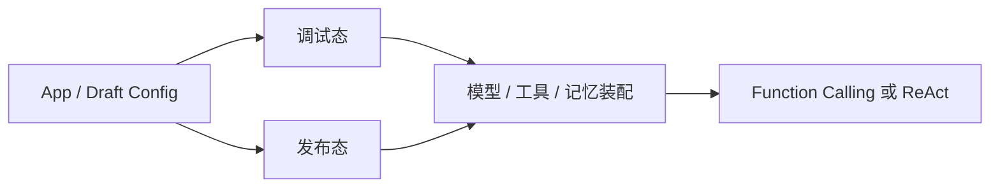
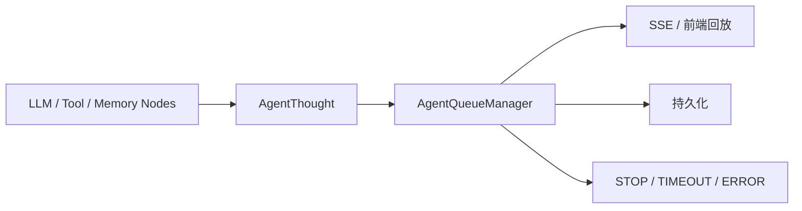

# 平台的核心 Agent 层

我写这一篇时，不想再重复“Agent 很重要”这种空话。我真正想沉淀的是：这个项目里的 Agent 到底怎样从应用配置走到双模式执行、记忆注入、事件流回放和停止控制，最后变成一套能复用的运行时。

## 先说最关键的判断

这个项目里的 Agent 层，真正值钱的不是“双模式”这三个字，而是它把模式差异、配置装配、记忆、事件流和停止控制都压进了同一条执行主线。

我更愿意把它概括成下面这个结构：

- App 配置先决定运行时输入
- 服务层根据模型能力做模式分流
- LangGraph 负责固定执行骨架
- AgentQueueManager 负责事件协议和停止控制

只要这四层没有混掉，这个 Agent 层就不是聊天包装器，而是平台运行时的一部分。

## 我为什么把 Agent 层单独拆出来

这个项目里最容易被讲浅的地方，就是只说“支持 Function Calling 和 ReAct”，但不说它们最后怎么和配置、会话、工具、记忆、事件流连在一起。

我单独拆这一层，就是因为这里同时牵住了几条最关键的主线：

- 调试态和发布态到底吃哪份配置
- 模型能力怎样影响执行模式
- 会话记忆怎样进入每一轮推理
- 工具、知识库和工作流怎样在同一入口汇合
- 事件流和停止控制怎样补成正式运行时协议

如果这些问题分散在别的专题页里，最后反而看不出 Agent 为什么是执行内核。

## App 配置怎么进入调试态和发布态

我先看 Agent，不会从 prompt 模板开始，而是先看 App 配置系统。因为这个项目里的 Agent 从来不是“前端传一堆参数，后端临时拼一个智能体”，它前面先过了一套应用资产体系。



这段模型代码最能说明问题：

```python
class App(db.Model):
    app_config_id = Column(UUID, nullable=True)
    draft_app_config_id = Column(UUID, nullable=True)
    debug_conversation_id = Column(UUID, nullable=True)

    @property
    def draft_app_config(self) -> "AppConfigVersion":
        app_config_version = (
            db.session.query(AppConfigVersion)
            .filter(
                AppConfigVersion.app_id == self.id,
                AppConfigVersion.config_type == AppConfigType.DRAFT,
            )
            .one_or_none()
        )
```

对我来说，这里最重要的不是模型字段本身，而是它明确写出了三件事：

- Agent 前面隔着草稿配置和发布配置两层
- 调试态和线上态不是读同一份配置
- 会话也不是临时变量，而是挂在 App 上的运行资产

后面的配置还会再经过一次清洗和展开，而不是原样下发到 Agent：

```python
def get_draft_app_config(self, app: App) -> dict[str, Any]:
    draft_app_config = app.draft_app_config

    validate_model_config = self._process_and_validate_model_config(
        draft_app_config.model_config
    )
    tools, validate_tools = self._process_and_validate_tools(draft_app_config.tools)
    datasets, validate_datasets = self._process_and_validate_datasets(
        draft_app_config.datasets
    )
```

我会特别记住这一点，因为它说明 Agent 消费的其实已经是一份运行时友好的配置对象，而不是数据库原始结构。

## 双模式分流怎么压在少数节点里

这个项目里双模式的关键，不是“多支持一种推理方式”，而是差异没有扩散到整条链路里。

服务层先做模式分流：

```python
agent_class = (
    FunctionCallAgent if ModelFeature.TOOL_CALL in llm.features else ReACTAgent
)
```

真正的执行骨架却是共用的：

```python
graph = StateGraph(AgentState)  # type: ignore

graph.add_node("preset_operation", self._preset_operation_node)
graph.add_node("long_term_memory_recall", self._long_term_memory_recall_node)
graph.add_node("llm", self._llm_node)
graph.add_node("tools", self._tools_node)
```

这对我来说有两个很实在的价值：

- Function Calling 和 ReAct 的差异被压在模式入口和局部节点里
- 工具循环、条件退出和状态归并都还能走同一条骨架

所以我更愿意把它理解成“一个执行内核支持两种驱动方式”，而不是“两套 Agent 系统拼在一起”。

## 记忆、事件流和停止控制怎么组成运行时

会话记忆在这个项目里不是外挂功能，而是 Agent 运行时装配的一部分。

调试态的一轮执行其实会同时装下面这些东西：

```python
llm = self.language_model_service.load_language_model(
    draft_app_config.get("model_config", {}), account_id=account.id
)

token_buffer_memory = TokenBufferMemory(
    db=self.db,
    conversation=debug_conversation,
    model_instance=llm,
)

tools = self.app_config_service.get_langchain_tools_by_tools_config(
    draft_app_config["tools"]
)
```

我从这段代码里最想记住的是：

- 短期记忆先经过 `TokenBufferMemory`
- 工具和知识库工具一起注入
- 长期记忆会在图节点里再注入系统提示

真正让这套 Agent 开始像“平台运行时”的，是统一事件流这一层：



这里最关键的代码不是某个节点本身，而是 `stream()` 对外暴露的方式：

```python
def stream(
    self,
    input: AgentState,
    config: Optional[RunnableConfig] = None,
    **kwargs: Optional[Any],
) -> Iterator[AgentThought]:
    thread = Thread(target=self._agent.invoke, args=(input,))
    thread.daemon = True
    thread.start()

    yield from self._agent_queue_manager.listen(input["task_id"])
```

这说明三件事：

- LangGraph 图本身只负责执行
- Agent 层自己补了后台线程和前台监听器
- 对外暴露的是统一事件协议，不是框架原生输出

停止控制也不是粗暴杀线程，而是协作式中断：

```python
@classmethod
def set_stop_flag(
    cls, task_id: UUID, invoke_from: InvokeFrom, user_id: UUID
) -> None:
    result = redis_client.get(cls.generate_task_belong_cache_key(task_id))
    if not result:
        return
```

我会特别保留这一层记忆，因为它说明这个项目已经开始把“谁能停这次任务”做成正式运行时协议，而不是前端按钮动作。

## 多入口为什么还能复用同一套运行时

这个项目还有一个我很看重的点：Debugger、WebApp、OpenAPI 虽然有不同的归属和鉴权规则，但进入执行内核之前，做的事情基本是一致的。

它们都会经过下面这些装配动作：

- 校验应用和会话归属
- 读取草稿态或发布态配置
- 装配模型、记忆、工具、知识库工具、工作流工具
- 按模型能力分流到 `FunctionCallAgent / ReACTAgent`

也正因为这条主线已经收住了，我才会把多入口问题视为“入口差异压在最外层”，而不是“三套聊天逻辑并存”。

## 我现在的判断

这个项目里的核心 Agent 层，最值得我下次复用的不是某个 prompt，也不是某个模式名，而是这几个结构选择：

1. 先用 App 配置体系把调试态和发布态切开
2. 再用模型能力把双模式分流压在服务层和少数节点里
3. 用 LangGraph 只承接执行骨架，不强迫它接管整个平台
4. 用 `AgentThought + AgentQueueManager` 把事件流、回放和停止控制补成正式协议

做到这一步，这个 Agent 层才像一个能继续扩、能继续管、也能继续复用的执行内核。