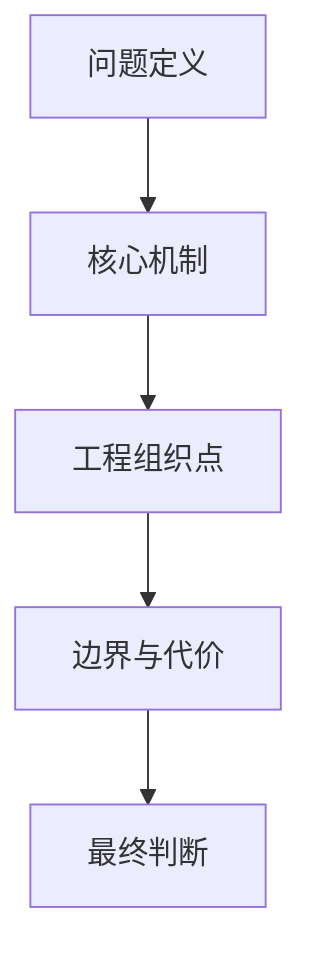

# 怎么把一篇 Agent 平台文档写得真正有用

这一页不是让我去总结某个平台怎么用，而是我给自己定的一套写作约束。我要写的是工程笔记，不是产品说明书，所以我最关心的从来不是“这篇文档看起来全不全”，而是“它以后回头看还有没有复用价值”。

## 我为什么给自己定这套写法

我以前最容易犯的错，是把文档写成下面两种样子：

- 一种是功能清单很完整，但判断很少
- 一种是概念说得很多，但实现边界和代价几乎不碰

这两种写法都有一个共同问题：当我过段时间再回来读时，我还是不知道这个系统到底为什么成立、最值钱的机制是什么、下次还能直接抄走什么。

所以我宁可提前把写法卡死一点，也不想再写一篇“当下看着顺、过后没法复用”的文档。

## 我写这类文档时至少要回答什么

我现在给自己定的最低要求，是每篇正文至少回答下面五个问题：

1. 这个系统最核心的问题定义是什么
2. 它最值钱的体验不是哪个按钮，而是哪一个机制
3. 如果把模型能力当黑盒，真正决定效果的工程组织点是什么
4. 它现在还是 demo，还是已经开始出现平台复杂度
5. 它最容易被高估的地方在哪里

如果这五个问题里有三条都答不清，我宁可先不写正文。

## 哪些写法我会主动删掉

我现在会主动删掉下面这些内容：

- 只是在换说法重复同一个观点的段落
- “功能很多”“能力很强”“体验不错”这种没有信息增量的句子
- 只讲流程、不碰状态、边界和代价的描述
- 通篇都在夸，没有任何保留意见的写法
- 旁观口吻，比如“作者认为”“本文将”“这个平台表明”

我现在更想保留的，是下面这些信息：

- 为什么这么拆
- 这层真正解决什么问题
- 状态、数据流和运行流怎么走
- 哪些地方最容易翻车
- 哪些做法下次可以直接复用

## 我最后怎么自查

我最后会拿下面这条顺序过一遍：

如果一篇文档在这条链上断了，我通常会这样判断：

- 断在前面，说明问题定义和核心机制都还没抓住
- 断在中间，说明实现拆解不够扎实
- 断在最后，说明我其实还没有给出自己的判断

我还有一个更直接的自查方式：如果把项目名字抹掉，这篇文档还能大体成立，那大概率说明我还没把这个项目真正有辨识度的地方写出来。