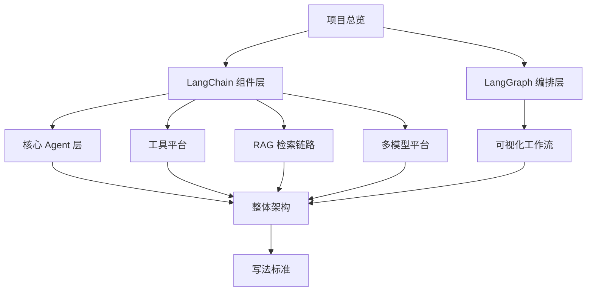

# 一站式 Agent 开发平台拆解

我单独开这一组，不是为了再写一份“大而全”的平台介绍，而是为了把自己手搓这个类 Dify 平台时真正踩过的工程问题拆出来。对我来说，值钱的从来不是“做了多少页面”，而是我最后到底把哪些能力做成了能运行、能发布、能复用的系统模块。

## 我为什么单独开这一组

我写这一组文档，主要是为了把下面几类东西沉淀下来：

- Agent、RAG、Workflow、MCP、多模型这些能力在项目里各自落在什么位置
- 它们最后是怎么被装成同一套运行时的
- 哪些设计是我下次再做类似系统时可以直接复用的
- 哪些地方最容易在 demo 阶段看起来没问题，一扩展就开始失控

如果这些问题讲不清，这组文档就只会变成项目说明书，而不是工程笔记。

## 我建议怎么读

我更推荐按“先总览，再拆组件和编排，最后看核心专题和整体收束”的顺序读。

这个顺序的好处是，我不会一上来就把你扔进某个专题细节里，而是先把“这套平台为什么要这么拆”交代清楚。

## 这一组各篇分别解决什么问题

- [一站式 AI Agent 开发平台项目总览](./one-stop-agent-platform-overview.md)：我先交代这个平台想解决什么问题，以及后面的专题页为什么按现在这个顺序展开。
- [平台的 LangChain 组件抽象](./langchain-component-abstractions.md)：我只看 LangChain 在这个项目里承担的组件协议层，不把它写成泛泛的框架综述。
- [平台的 LangGraph 编排骨架](./langgraph-orchestration-kernel.md)：我只看状态、路由、编译和循环骨架，不把它和工作流画布、运行时外壳混在一起。
- [平台的核心 Agent 层](./core-agent-layer.md)：我把双模式执行、会话记忆、事件流和停止控制都放回真正的运行时主线里讲。
- [平台的工具调用设计](./tool-calling.md)：我重点写三类工具怎么收口到同一套运行时接口，而不是只列一遍来源分类。
- [平台的在线知识库设计](./online-knowledge-base.md)：我把它拆成知识生产链和检索消费链，和会话记忆严格分开。
- [平台的可视化工作流实现](./visual-workflow.md)：我重点讲工作流为什么是正式资产、怎么编译、怎么发布，不只盯着前端画布。
- [平台的多模型集成实现](./multi-model-integration.md)：我关心的是多模型平台怎么被做成配置驱动和统一装配的系统能力。
- [平台的整体架构构建](./overall-architecture.md)：我最后用配置资产主线、执行主线和上下文主线把整个平台重新收束一次。
- [怎么把一篇Agent平台文档写得真正有用](./how-to-write-useful-dify-app-note.md)：这一页不是讲平台，而是我给自己定的写作约束。

## 我写这些文档时会盯住什么

我会主动盯下面几件事：

- 不只写“做了什么”，还要写“为什么这么拆”
- 不只写功能，还要写状态、数据流和运行流
- 不只写效果，还要写边界、代价和后续维护方式
- 不只证明它能跑，还要证明它为什么不是一组临时拼起来的能力

如果一篇文档把名字遮住之后还跟别的项目差不多，那大概率说明我还没把这个项目真正值钱的地方写出来。