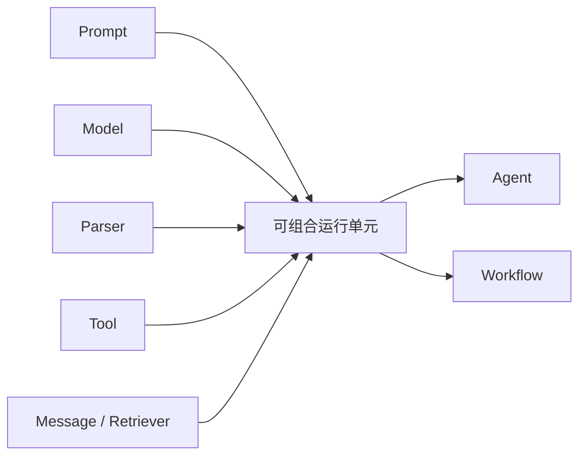

# 平台的 LangChain 组件抽象

我在这个项目里看 LangChain，最重要的一点不是“它能不能帮我快速搭个 Agent”，而是它到底提供了哪些稳定的组件协议。只要这层协议稳定，我上面怎么换模型、怎么拼工具、怎么做 RAG、怎么补运行时外壳，成本都会低很多。

## 先说最关键的判断

我不会把 LangChain 当成这个项目的执行中枢。我更把它当成标准零件库，专门负责下面这些组件协议：

- 模型对象怎么统一
- Prompt 和 Parser 怎么组合
- 工具怎么统一收口
- 消息对象怎么表达
- Retriever 和文本链怎么复用

对我来说，LangChain 真正值钱的地方不是“黑盒能力多”，而是它把这些零件先规范化了。

## 我为什么只把 LangChain 放在组件层

我没有把 LangChain 放到运行时的最上层，原因很直接：这个项目真正难的不是“调一次模型”或者“跑一次工具”，而是状态、路由、事件流、中断、发布门禁和持久化怎么一起成立。

这些问题里，LangChain 最适合负责的是“协议”和“组合单元”，不适合负责的是“整个平台的执行控制权”。

如果我把这层边界划错，后面很容易出现两个问题：

- 要么把平台运行时过度绑死在高层封装上
- 要么所有能力都绕开统一协议，各写各的特例

所以我宁可把 LangChain 定位得克制一点：它负责零件标准化，编排和运行时交给别的层。

## 我会按哪些组件协议往下拆

我后面真正会复用的，是下面这几类组件协议：



### 1. 模型协议

我不希望上层拿到的是一堆厂商 SDK，所以我先用统一的 `BaseLanguageModel` 把消息转换、多模态输入、能力标记这些行为收口。

### 2. Prompt 和 Parser 链

很多局部 AI 能力其实不是完整 Agent，而是 `Prompt | LLM | Parser` 这种短链。摘要、命名、建议问题、结构化分类都适合这样做。

### 3. 工具协议

Builtin Tool、API Tool、MCP Tool、Workflow Tool、Dataset Retrieval Tool 最后都能压进 `BaseTool`，这一步是整个项目后续复用价值最高的 LangChain 落点之一。

### 4. 消息协议

我在 Agent 层能统一处理 `SystemMessage`、`HumanMessage`、`AIMessage`、`ToolMessage`，靠的也是这层协议，而不是自定义一堆字符串拼接。

### 5. RAG 文本链

文档加载、切分、向量化、检索器组合这些动作，放在 LangChain 的文本链组件体系里更稳定，也更容易替换实现。

### 6. 可组合运行单元

`Runnable`、LCEL 和并行组合能力，让平台里的很多局部逻辑都可以用类似的调用方式表达，而不是各写各的执行约定。

## 代码里最能说明问题的证据

### 模型统一协议不是抽象口号

这段基类代码直接说明了，我在这里拿 LangChain 解决的是统一消息协议，而不是单纯套壳某家模型 SDK：

```python
class BaseLanguageModel(LCBaseLanguageModel, ABC):
    features: list[ModelFeature] = Field(default_factory=list)
    metadata: dict[str, Any] = Field(default_factory=dict)

    def convert_to_human_message(
        self, query: str, image_urls: list[str] = None
    ) -> HumanMessage:
        if (
            image_urls is None
            or len(image_urls) == 0
            or ModelFeature.IMAGE_INPUT not in self.features
        ):
            return HumanMessage(content=query)
```

我更看重的是这里的 `HumanMessage` 和 `features`，因为它们让多模态输入和能力判断能走统一对象。

### 短链能力是真的靠 LCEL 组合起来的

摘要链这段代码很短，但它正好说明了我为什么把 LangChain 放在组件层而不是运行时顶层：

```python
prompt = ChatPromptTemplate.from_template(SUMMARIZER_TEMPLATE)
summary_chain = prompt | llm | StrOutputParser()

new_summary = summary_chain.invoke(
    {
        "summary": old_summary,
        "new_lines": f"Human: {human_message}\nAI: {ai_message}",
    }
)
```

这种能力我并不需要专门给它造一套执行框架，组件链就够了。

### 工具统一协议才是后续复用的关键

检索工具这段代码最能说明问题的地方，不是它实现了搜索，而是它最终作为 `@tool` 被压进了同一套工具协议：

```python
@tool(DATASET_RETRIEVAL_TOOL_NAME, args_schema=DatasetRetrievalInput)
def dataset_retrieval(query: str) -> str:
    with flask_app.app_context():
        self.vector_database_service.embeddings_service.initialize_embeddings(account_id)
        documents = self.search_in_datasets(
            dataset_ids=dataset_ids,
            query=query,
            account_id=account_id,
            retrieval_strategy=retrieval_strategy,
            k=k,
            score=score,
            retrival_source=retrival_source,
            source_app_id=source_app_id,
        )
```

我后面之所以能把工具平台、知识库和工作流都接回 Agent，靠的就是这种统一协议，而不是某一类工具本身多强。

## 我现在的判断

这个项目里，LangChain 最值得保留的不是“内置 Agent 很方便”，而是它提供了一层我可以长期依赖的组件协议。

我现在更愿意这样看它：

- 它负责把模型、Prompt、Parser、Tool、Message、Retriever 这些零件先规范化
- 它负责提供低摩擦的组合方式
- 它不负责接管整个平台的执行主线

只要这条边界稳住了，后面不管我是补 LangGraph 编排，还是补 Agent 事件流和发布治理，都有一层足够稳定的底座可以接。