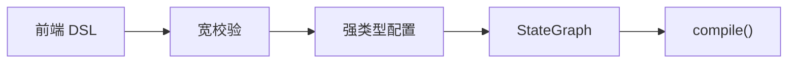
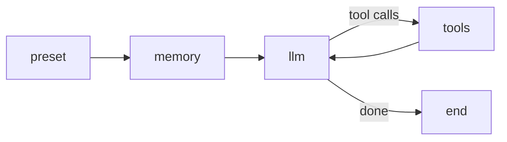

# 平台的 LangGraph 编排骨架

我在这个项目里看 LangGraph，不会把它当成“可视化工作流框架”或者“平台运行时本身”。我更把它当成编排骨架，专门负责状态、路由、循环和图编译，让 Workflow 和 Agent 这两条执行链不至于退化成一堆 if/else 和手工状态拼装。

## 先说最关键的判断

LangGraph 在这里真正承担的是编排责任，不是产品责任。

我更愿意把它的职责压缩成三句话：

- Workflow 侧，它负责把 DSL 编译成可执行图
- Agent 侧，它负责把消息状态和工具循环编成固定骨架
- 再往上的调试回放、事件流、发布门禁和中断控制，都已经是平台层自己补的运行时外壳

只要这条边界不糊，后面的专题页就不会互相抢角色。

## 我为什么把 LangGraph 单独拿出来讲

这层值得单独讲，不是因为它“高级”，而是因为它正好卡在组件层和运行时之间。

如果我不把它单独拎出来，最容易发生两种误解：

- 把前端画布 DSL 直接当成 LangGraph，自以为后端只是顺手执行
- 把 LangGraph 当成整个平台，忽略平台自己补出来的事件流、治理和发布边界

我把它单独拆出来，就是为了把这两个误解都压掉。

## Workflow 编译链

Workflow 这条链最关键的，不是“节点能不能拖”，而是前端 DSL 最后怎么变成一个真正可执行的图。



我真正关心的是这几步有没有分清：

- 前端传来的是业务 DSL，不是 LangGraph 对象
- 草稿保存时做的是宽校验，不应该把编辑过程卡死
- 调试和发布前才做严格图校验
- 最终进入运行时之前，才真正编译成 `StateGraph`

这一步如果边界不清，工作流页就很容易沦为“画布功能说明”。

代码里最能说明问题的是状态定义和编译器入口：

```python
class WorkflowState(TypedDict):
    inputs: Annotated[dict[str, Any], _process_dict]
    outputs: Annotated[dict[str, Any], _process_dict]
    node_results: Annotated[list[NodeResult], _process_node_results]
    intent_condition: str
```

```python
graph = StateGraph(WorkflowState)

for node in nodes:
    node_flag = f"{node.node_type.value}_{node.id}"
    if node.node_type == NodeType.START:
        graph.add_node(
            node_flag,
            NodeClasses[NodeType.START](node_data=node),
        )
```

对我来说，这里最值钱的不是 `StateGraph` 这个名字，而是它明确说明了：前端图一旦进到这里，已经不再是页面状态，而是共享状态机。

## Agent 固定骨架

Agent 这条链里，LangGraph 的角色更纯粹一些：它就是在承接消息状态、工具循环和退出条件。



这个骨架对我来说有两个价值：

- Function Calling 和 ReAct 的差异能被压在少数节点里
- 执行控制不会散落在 service 和 prompt 模板里

真实代码也很直白：

```python
graph = StateGraph(AgentState)  # type: ignore

graph.add_node("preset_operation", self._preset_operation_node)
graph.add_node("long_term_memory_recall", self._long_term_memory_recall_node)
graph.add_node("llm", self._llm_node)
graph.add_node("tools", self._tools_node)

graph.set_entry_point("preset_operation")
graph.add_conditional_edges(
    "preset_operation", self._preset_operation_condition
)
graph.add_edge("long_term_memory_recall", "llm")
graph.add_conditional_edges("llm", self._tools_condition)
graph.add_edge("tools", "llm")
```

我从这里得到的判断很明确：LangGraph 在 Agent 层解决的是执行骨架，不是事件协议，也不是多入口治理。

## LangGraph 不负责什么

这一层最容易被讲空的地方，就是只写“它能编排状态图”，但不写平台自己还补了什么。

我现在会明确把下面这些职责排除在 LangGraph 之外：

- 前端工作流画布 DSL 的定义
- 调试态和发布态的资产隔离
- Agent 事件流、SSE 和停止控制
- 多入口调用方式的归属校验
- 发布门禁、版本快照和治理逻辑

也就是说，LangGraph 当然重要，但它只负责“图内的控制流”，不负责“图外的平台约束”。

## 我现在的判断

我在这个项目里最愿意保留的做法，是把 LangGraph 放在它最合适的位置上：

- 在 Workflow 里，我拿它做 DSL 编译后的执行图内核
- 在 Agent 里，我拿它做消息状态和工具循环的固定骨架
- 在这两条链之外，我不强迫它接管事件流、发布和治理

这条边界对我后面继续扩系统特别重要。因为只要编排骨架和运行时外壳没有混掉，我就还能继续在平台层补控制和治理，而不用回头把状态机全拆一遍。