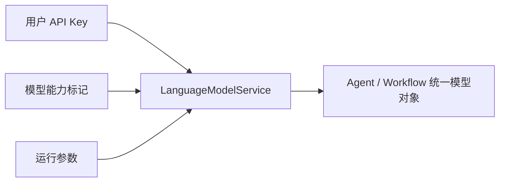

# 平台的多模型集成实现

我写这一篇时，不会把重点放在“接了多少家模型”上。对我来说，真正值钱的是：这个项目有没有把 Provider、模型目录、能力标记、用户级 API Key 和运行时实例装配做成一套稳定的平台能力，而不是一堆 `if/else` 切厂商。

## 先说最关键的判断

这个项目里的多模型能力，不是模型列表管理，而是一套配置驱动、动态加载、统一装配的模型平台。

我更愿意把它压成下面这个结构：

- `providers.yaml` 和模型 YAML 目录负责注册事实
- `ProviderEntity + ModelEntity` 负责描述事实
- `LanguageModelManager` 负责装成内存注册表
- `LanguageModelService` 负责把配置变成可执行模型实例

只要这几层稳住了，上层拿到的就永远是统一模型对象，而不是一堆厂商特例。

## 我为什么把多模型做成配置驱动平台

我不想把多模型做成一个下拉框后面跟很多分支判断，因为那样很快就会出现几个问题：

- provider 和 model 的职责混在一起
- 参数模板没法复用
- 能力标记很难稳定进入运行时判断
- Agent 和 Workflow 只能各自适配不同 SDK

我更希望把“模型接入”变成元数据驱动和运行时装配问题，而不是业务层到处写特判。

## Provider 和 Model 两级结构怎么稳住边界

这套平台真正让我觉得舒服的地方，是它没有把所有模型平铺成一个大列表，而是明确保留了两级结构：

- Provider 负责接入方式、支持模型类型、展示信息
- Model 负责能力标记、上下文长度、参数规则、价格和其他元数据

这种分层不是为了显得规范，而是因为我后面无论做模型目录展示、能力判断还是运行时实例化，都需要这两层边界保持清楚。

## YAML 注册中心和动态加载怎么配合

这个项目里，多模型的事实来源不在数据库，而在仓库里的 YAML 配置目录。


注册中心最直接的代码证据是这段：

```python
with open(providers_yaml_path, encoding="utf-8") as f:
    providers_yaml_data = yaml.safe_load(f)

for index, provider_yaml_data in enumerate(providers_yaml_data):
    provider_entity = ProviderEntity(**provider_yaml_data)
    values["provider_map"][provider_entity.name] = Provider(
        name=provider_entity.name,
        position=index + 1,
        provider_entity=provider_entity,
    )
```

单个 Provider 初始化时，再继续把模型类和模型元数据分别装进内存映射：

```python
values["model_class_map"][model_type_str] = dynamic_import(
    f"internal.core.language_model.providers.{provider_entity.name}.{model_type_str}",
    symbol_name,
)

values["model_entity_map"][model_name] = ModelEntity(**model_yaml_data)
```

我从这里最想保留的判断是：

- YAML 目录在这里不是普通配置文件，而是模型注册中心
- 动态导入不是花哨技巧，而是为了把“模型目录注册”和“运行时实例化”切开

## API Key 和能力标记怎么进入运行时

我在多模型这层最看重的，其实不是 provider 数量，而是运行时约束有没有真正接进去。



运行时装配代码已经把这件事写得很清楚：

```python
provider_name = model_config.get("provider", "")
model_name = model_config.get("model", "")
parameters = model_config.get("parameters", {}).copy()

if account_id:
    api_key = get_api_key_for_provider(provider_name, account_id)
    api_key_param = self._get_api_key_param_name(provider_name)
    parameters[api_key_param] = api_key

provider = self.language_model_manager.get_provider(provider_name)
model_entity = provider.get_model_entity(model_name)
model_class = provider.get_model_class(model_entity.model_type)
```

这段代码对我最重要的意义有三点：

- 用户级 API Key 是运行时约束，不是外部注释
- `Provider -> ModelEntity -> model_class` 的解析链真的进入了服务层
- 最后实例化的是统一模型对象，不是原始配置

能力标记同样不是展示字段，而是直接影响上层执行：

- `TOOL_CALL` 决定 Agent 走 Function Calling 还是 ReAct
- `IMAGE_INPUT` 决定能不能拼多模态消息
- 其他能力标记也可以继续影响前端功能开关和服务层行为

所以这里真正接进运行时的，不只是模型名，而是“带能力约束和用户凭证的模型对象”。

## 我现在的判断

这个项目里的多模型部分，最值得我后面继续沿用的不是“又多接了一家模型”，而是下面这几个结构选择：

1. 用 `ProviderEntity + ModelEntity + BaseLanguageModel` 把模型能力从一开始就建成统一抽象
2. 用 `providers.yaml / positions.yaml / <model>.yaml` 把注册中心放在可版本化的配置目录里
3. 用动态加载把模型目录扩展和运行时实例化切开
4. 用用户级 API Key 和能力标记把模型平台真正接到执行层约束里
5. 用 `LanguageModelService` 把最终消费对象统一成 Agent 和 Workflow 都能无感复用的模型实例

只要这几层不乱，多模型在这个平台里就不是“可选项列表”，而是一块真正可扩展、可治理、可被运行时稳定消费的模型基础设施。