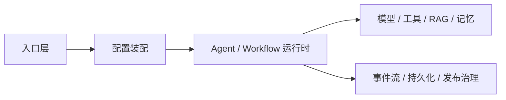
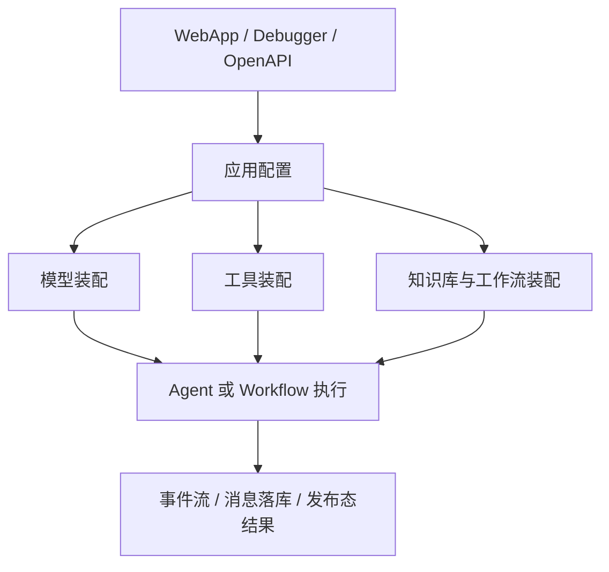

# 一站式 AI Agent 开发平台项目总览

我看这个项目，首先不会把它当成一个“聊天壳子加几个 AI 功能”的应用。我更把它看成一套把模型、工具、知识库、工作流和发布治理接到同一条运行时里的平台型系统。后面这组文档之所以要拆这么多层，也是因为真正难的部分根本不在页面，而在这些能力最后能不能被装成一套稳定的工程主线。

## 先说我的判断

这个项目最值钱的地方，不是它功能列得够多，而是它已经开始显露出“平台运行时”的形状。

我现在更关心下面三件事：

- 应用配置、工作流、知识库、工具和模型配置，最后怎么进入同一套运行时
- Agent 和 Workflow 这两条执行链，怎样共用同一批上下文供给能力
- 调试态、发布态、多入口调用和事件回放，怎样不各写一套逻辑

如果这三件事接不起来，这个项目再像 Dify，也更像一组并排摆着的能力。

## 我为什么把这个平台拆成这些层

我后面把它拆成组件层、编排层、Agent、工具、RAG、Workflow、多模型和整体架构，不是为了显得系统，而是因为这些层各自回答的问题不一样：

- 组件层回答的是：我到底拿什么标准零件来组装平台
- 编排层回答的是：状态、路由、循环和图编译由谁负责
- Agent / Tool / RAG / Workflow / 多模型回答的是：关键专题各自的工程边界在哪里
- 整体架构回答的是：这些专题最后怎么收束成一套能持续维护的平台



我之所以先立这个骨架，是因为后面的专题页如果不回到这张图里看，很容易又退化成分模块介绍。

## 这个平台最难的不是页面，而是运行时

真正让我觉得它开始像平台，而不是 demo 的，是下面这条运行时总链路已经能看清了：



这一条链路背后的关键点不是“有多少节点”，而是：

- 入口差异被压在最外层
- 配置资产先被整理，再进入运行时
- 模型、工具、RAG 和记忆最终在执行入口汇合
- 执行结果不是只回一条答案，而是还能进入事件流、持久化和后续治理

这才是我后面会把重点放在运行时装配和状态流上的原因。

## 一段最能说明它不是 demo 的真实代码

如果只写功能范围，这一页很容易看起来平台感很强，但证据不足。真正能说明问题的，是调试态的一轮对话在后端到底怎么被装起来：

```python
llm = self.language_model_service.load_language_model(
    draft_app_config.get("model_config", {}), account_id=account.id
)

token_buffer_memory = TokenBufferMemory(
    db=self.db,
    conversation=debug_conversation,
    model_instance=llm,
)

tools = self.app_config_service.get_langchain_tools_by_tools_config(
    draft_app_config["tools"]
)

if draft_app_config["datasets"]:
    dataset_retrieval = (
        self.retrieval_service.create_langchain_tool_from_search(
            flask_app=current_app._get_current_object(),
            dataset_ids=[
                dataset["id"] for dataset in draft_app_config["datasets"]
            ],
            account_id=account.id,
            retrival_source=RetrievalSource.APP,
            source_app_id=app.id,
            **draft_app_config["retrieval_config"],
        )
    )
    tools.append(dataset_retrieval)

agent_class = (
    FunctionCallAgent if ModelFeature.TOOL_CALL in llm.features else ReACTAgent
)
```

这段代码对我最有价值的，不是它能跑，而是它把平台的几个核心事实一次性暴露出来了：

- 模型对象是运行时装配的，不是写死的
- 知识库能力最后被做成工具再注入
- Agent 模式选择不是写在页面上，而是由模型能力决定
- 记忆、模型、工具和检索在同一个执行入口汇合

这也是为什么我后面会把 Agent、工具、RAG、多模型单独拆开写。

## 我最想在这组文档里继续追的几条主线

从这页往下，我主要追下面几条主线：

- LangChain 这一层到底只是标准零件库，还是已经开始侵入运行时
- LangGraph 到底是在管状态和控制流，还是被误当成整个平台
- 双模式 Agent 的差异到底被压在多少节点里
- RAG、Workflow 和 Tool 最后怎么一起进入统一运行时
- 发布态到底只是一个状态位，还是一份真正的运行时快照

这几条主线如果都讲清楚了，后面的每篇专题页才不是在重复“我做了哪些功能”。

## 我现在的判断

如果我要用一句话概括这个项目，我会说：我不是在做一个 AI 聊天应用，而是在把 Agent、RAG、Workflow、MCP、多模型和发布治理拼成一套真正能持续扩展的平台运行时。

后面这组文档对我自己的意义，也不是把功能清单写得更完整，而是把这套运行时为什么能成立、哪些地方最难、哪些机制最值得复用，尽量沉淀成我下次还能直接拿来用的工程笔记。