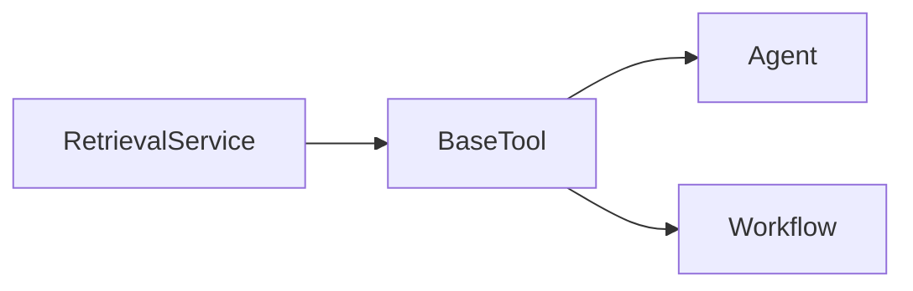

# 平台的 RAG 检索链路设计

我看这个项目里的 RAG，不会把它理解成一个“查向量库的小功能”。我更把它看成一条完整的知识生产链和检索消费链。只有这两条链都立住了，知识库能力才不是某个页面上的附属按钮，而是平台运行时里的正式上下文供给能力。

## 先说最关键的判断

这个项目里的 RAG 真正值钱的地方，不是“检索到了内容”，而是它把文件、规则、片段、索引和检索工具接成了一条可追踪、可复用、可维护的知识链路。

我更愿意把它压成两个部分：

- 生产链：原始文件怎样变成可索引的知识片段
- 消费链：检索能力怎样变成 Agent 和 Workflow 都能共用的运行时工具

会话记忆我继续放在 [平台的核心 Agent 层](./core-agent-layer.md) 里讲，因为那部分属于对话运行时，不属于这条知识生产链。

## 我为什么把会话记忆留在 Agent 页

我特意把这层边界写清，是因为很多项目一讲 RAG，就顺手把短期历史裁剪、长期摘要注入和异步摘要更新都塞进去，最后知识库和会话记忆混成一团。

在这个项目里，我更愿意这样分：

- `UploadFile / Document / Segment / Index` 属于知识资产
- `TokenBufferMemory / Conversation.summary` 属于会话运行时

这两个系统当然会在 Agent 入口汇合，但它们不是同一条链。

## 知识生产链怎么固化中间态

这个项目里我最想记住的一个判断是：上传文件不等于立刻建索引。


我真正看重的是这里的几个中间态：

- `UploadFile` 保留原始文件
- `ProcessRule` 固化处理规则
- `Document` 表示知识库里的文档实体
- `Segment` 表示可被追踪的知识片段

这样做的价值很直接：

- 解析失败可以重试，不会丢原始输入
- 自动模式也能还原成一份真实规则
- 索引构建可以异步做，不必把上传链路卡死

这段代码就是最直接的证据：

```python
process_rule = self.create(
    ProcessRule,
    account_id=account.id,
    dataset_id=dataset_id,
    mode=process_type,
    rule=rule,
)

for upload_file in upload_files:
    document = self.create(
        Document,
        account_id=account.id,
        dataset_id=dataset_id,
        upload_file_id=upload_file.id,
        process_rule_id=process_rule.id,
        batch=batch,
        name=upload_file.name,
    )

build_documents.delay([document.id for document in documents])
```

这段代码对我来说最关键的一点，是“先固化 `ProcessRule + Document`，再异步建索引”，而不是上传后顺手把一切做完。

切分阶段同样不是只吐几个字符串，而是把片段元数据一路保留下来：

```python
segment = self.create(
    Segment,
    account_id=document.account_id,
    dataset_id=document.dataset_id,
    document_id=document.id,
    node_id=uuid.uuid4(),
    content=content,
    token_count=self.embeddings_service.calculate_token_count(content),
    hash=generate_text_hash(content),
)
```

我会特别保留这层记忆，因为后面的追踪、命中统计、启停和删除同步，全都依赖这些中间态和元数据。

## 检索消费链怎么进入 Tool / Agent / Workflow

生产链固然重要，但我更在意的是它最后有没有真的进入统一运行时。



这个项目做得比较对的一点，是先把检索统一收口到服务层，再把它继续做成 `BaseTool`。这样 Agent 和 Workflow 最后拿到的就不是“某个检索接口”，而是同一种可注入能力。

检索服务这段代码最能说明问题：

```python
semantic_retriever = SemanticRetriever(
    dataset_ids=dataset_ids,
    vector_store=self.vector_database_service.vector_store,
    search_kwargs={
        "k": k,
        "score_threshold": score,
    },
)
full_text_retriever = FullTextRetriever(
    db=self.db,
    dataset_ids=dataset_ids,
    jieba_service=self.jieba_service,
    search_kwargs={"k": k},
)
hybrid_retriever = EnsembleRetriever(
    retrievers=[semantic_retriever, full_text_retriever],
    weights=[0.5, 0.5],
)
```

对我来说，重点不是具体权重，而是：

- 语义检索、关键词检索和混合检索都被收在统一服务层
- 检索策略是可替换的
- 上层最后拿到的是统一格式的结果

再往上一层，RAG 真的被做成了工具：

```python
@tool(DATASET_RETRIEVAL_TOOL_NAME, args_schema=DatasetRetrievalInput)
def dataset_retrieval(query: str) -> str:
    with flask_app.app_context():
        documents = self.search_in_datasets(
            dataset_ids=dataset_ids,
            query=query,
            account_id=account_id,
            retrieval_strategy=retrieval_strategy,
            k=k,
            score=score,
            retrival_source=retrival_source,
            source_app_id=source_app_id,
        )
```

我后面之所以敢把知识库能力视为“运行时能力”，靠的就是这一步 Tool 化，而不是知识库页面本身。

## 维护闭环为什么重要

这一层最容易被忽略，但我觉得它其实很能说明系统是不是正式。因为如果文档启停、删除和索引同步都没有闭环，知识库迟早会出现状态漂移。

这个项目已经开始补这些动作了：

- 文档启用/禁用要同步影响索引和关键词表
- 文档删除要同步删关系数据、片段和外部索引
- 查询过程会记录 `DatasetQuery` 这类业务对象，而不是只把结果扔给模型

对我来说，这说明 RAG 在这里已经不是“召回功能”，而是一条被纳入治理的知识链。

## 我现在的判断

这个项目里的 RAG 最值得我以后继续复用的，不是“接了 Weaviate”或者“支持混合检索”，而是下面这几个结构选择：

1. 先用 `UploadFile / ProcessRule / Document / Segment` 固化知识生产链
2. 再用统一服务层把语义、关键词和混合检索收住
3. 最后用 `BaseTool` 把检索能力真正接回 Agent 和 Workflow
4. 同时把启停、删除和统计也纳入这条链的维护闭环

只要这几层不散，RAG 在这个平台里就不是“补充资料功能”，而是一块真正能复用的上下文基础设施。