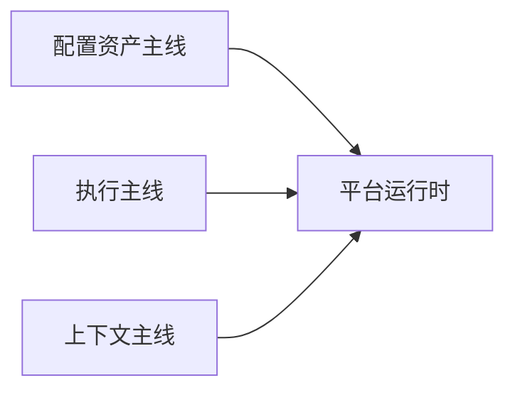

# 平台的整体架构构建

我写完前面几篇专题页之后，最后最需要做的一件事，不是再列一遍模块，而是把那些专题重新收成一套完整系统。对我来说，整体架构页的价值，就在于把“这些能力分别怎么成立”重新翻译成“它们最后怎么协同”。

## 先说最关键的判断

这套架构真正成立，不是因为模块很多，而是因为三条主线能同时接起来：

- 配置资产主线：应用、工作流、知识库、工具和模型配置怎样从编辑态进入运行态
- 执行主线：一次请求怎样穿过编排层、运行层、事件流和持久化层
- 上下文主线：模型、工具、RAG 和记忆怎样一起进入 Agent 或 Workflow

如果这三条主线接不起来，前面那些专题就只是一组并排能力，而不是一套平台架构。

## 我为什么不用模块清单来写整体架构

我不想把这一页写成“后端用什么、前端用什么、数据库用什么”的技术清单，因为那种写法最大的问题是：模块都列对了，但边界、顺序和协作方式还是不清楚。

我现在更关心的是：

- 哪些模块负责资产
- 哪些模块负责编排
- 哪些模块负责运行时
- 哪些模块负责上下文供给
- 哪些模块负责治理和发布

所以我更愿意先把它看成一套六层结构：

这张图对我最重要的意义不是分层本身，而是提醒我：别把专题页里已经拆开的边界，在整体架构页里又重新混回去。

## 配置资产主线

我最先盯的是这条线，因为平台和 demo 最容易分出高下的地方，就在配置资产有没有被认真对待。

在这个项目里，配置资产不是页面上的临时状态，而是一组会进入运行时的正式对象：

- App 草稿配置和发布配置
- Workflow 的 `draft_graph / graph`
- 工具配置 JSON
- 模型配置和知识库元数据

这条主线真正关键的点，是它没有直接从“用户点了什么”跳到“模型开始跑”，而是中间先经过了清洗、展开、校验和发布门禁。

这也是为什么我会把 App 配置系统、工作流双态和工具公共装配都视为架构级设计，而不是实现细节。

## 执行主线

第二条主线是执行本身。

我更在意的是一次请求怎样从入口穿过不同层，而不是某个函数本身写得多复杂。

在这个项目里，一轮执行大致会经过：

- WebApp / Debugger / OpenAPI 这类入口
- 配置读取和运行时装配
- Agent 或 Workflow 编排骨架
- 事件流、持久化和异步任务

执行主线最关键的，不是“会不会调模型”，而是：

- 入口差异有没有被压在最外层
- 图内编排和图外运行时有没有分开
- 慢任务是不是被异步化
- 状态和结果是不是能回流到前端和数据库

如果这条线不清楚，平台很快就会在响应时间、调试和稳定性上一起失控。

## 上下文主线

第三条主线是我最想在整体架构页里重新强调的，因为这是整个平台最像 AI 平台，而不是普通后台的地方。

上下文主线的核心不是某一个模块，而是几类能力最后怎样在运行时汇合：

- 多模型平台提供统一模型对象
- 工具平台把不同来源压成 `BaseTool`
- RAG 链路提供外部知识片段
- Agent 记忆机制提供短期历史和长期摘要

对我来说，这条主线最关键的判断是：这些能力虽然来自不同专题页，但进入运行时之后，必须回答的是同一个问题，即“当前这次推理到底能拿到哪些上下文”。

## 我现在的判断

如果我要用一句话收束这套架构，我会说：这个项目的整体价值，不在于把 Agent、RAG、Workflow、MCP、多模型这些能力都接上了，而在于它已经开始把它们变成一套由配置资产、执行主线和上下文主线共同支撑的平台运行时。

我后面如果还要继续扩这个系统，我最先守住的也还是这几个边界：

1. 配置资产必须先被认真对待，不能直接把页面状态塞进运行时
2. 编排骨架和运行时外壳不能混掉
3. 模型、工具、RAG 和记忆必须在运行时统一汇合
4. 发布、权限、审计和停止控制必须继续被当成正式能力，而不是事后补丁

只要这几条边界还在，这个平台就还能继续往正式系统的方向长，而不是重新退回一组拼起来的功能页面。