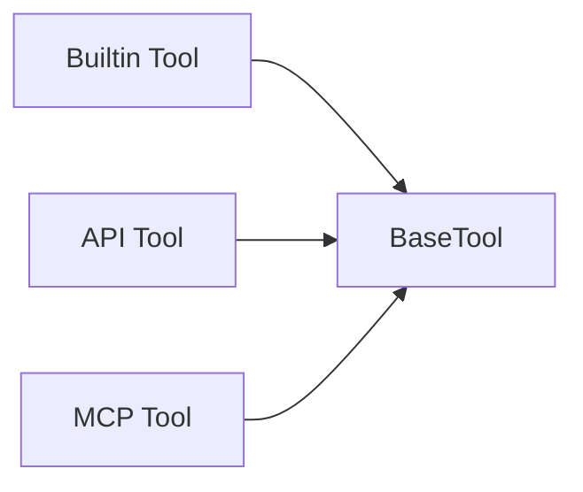
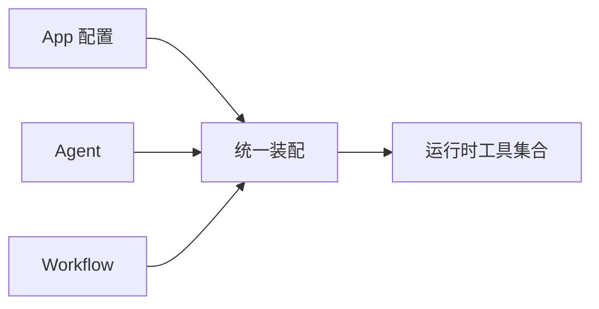

# 平台的工具调用设计

我写这一篇时，最不想做的就是把 Builtin Tool、API Tool、MCP Tool 三类来源再列一遍。对我来说，真正值钱的不是“支持几种工具”，而是这些来源完全不同的能力，最后怎么被压进同一套运行时接口，再被 App、Agent 和 Workflow 一起复用。

## 先说最关键的判断

这个项目真正统一的，不是工具的存储方式，而是工具的运行时接口。

我更愿意把它理解成下面这个结构：

- 三种不同来源
- 三种不同注册方式
- 一套统一的 `args_schema`
- 一套统一的 `BaseTool` 运行时对象
- 一条统一的公共装配路径

只要这五层接起来，这一层就不是“插件列表管理”，而是平台能力。

## 我为什么把三类工具看成一套平台

Builtin、API、MCP 这三类工具看起来差异很大：

- Builtin Tool 来自仓库内的 YAML + Python 实现
- API Tool 来自 OpenAPI 导入后的接口定义
- MCP Tool 来自远程 Server 的 discovery 结果

但上层真正需要的不是知道它们“从哪里来”，而是知道它们“怎样被调用”。

如果这一步不统一，后面会马上裂成三套问题：

- 前端参数面板要各写一份
- Agent 和 Workflow 要各自理解三种调用逻辑
- 调试接口和正式运行路径会越来越偏

所以我更看重的是“来源不同，但执行语义一致”。

## 参数 schema 为什么是共同底座

这层最容易被忽略，但我觉得它反而是整套工具平台最关键的地基。因为没有稳定的参数 schema，前端配置、调试运行、Agent 调用和 Workflow 节点执行都没有共同语言。

三类工具最后都要向上暴露一套可解释的参数协议：

- Builtin Tool：从工具自身的 `args_schema` 反射
- API Tool：从导入参数动态 `create_model(...)`
- MCP Tool：从远程工具目录的 `input_schema` 转成模型

这一层统一之后，我才能拿到一批真正可被平台消费的工具对象，而不是一堆“各自能跑”的实现。

## 三类来源怎么收口到 BaseTool

我最想保留的是这个收口关系，而不是三类工具各自的故事：



Builtin Tool 侧最能说明问题的是文件化注册和工厂装配：

```python
class BuiltinProviderManager(BaseModel):
    provider_map: dict[str, Provider] = Field(default_factory=dict)

    def get_tool(self, provider_name: str, tool_name: str) -> Any:
        provider = self.get_provider(provider_name)
        if provider is None:
            return None
        return provider.get_tool(tool_name)
```

API Tool 侧最关键的不是发请求，而是把接口定义动态压成统一工具对象：

```python
def get_tool(self, tool_entity: ToolEntity) -> BaseTool:
    return StructuredTool.from_function(
        func=self._create_tool_func_from_tool_entity(tool_entity),
        name=f"{tool_entity.id}_{tool_entity.name}",
        description=tool_entity.description,
        args_schema=self._create_model_from_parameters(tool_entity.parameters),
    )
```

MCP Tool 侧最关键的是把远程发现结果适配成同一种运行时对象：

```python
class MCPManagedTool(BaseTool):
    def _run(self, *args: Any, **kwargs: Any) -> Any:
        return self._runtime_manager.execute_tool(
            server_config=self._server_config,
            tool_name=self._tool_name,
            parameters=kwargs,
        )
```

我从这三段代码里读到的共同结论很明确：平台并没有试图统一来源，而是在统一调用协议。

## App / Agent / Workflow 怎么共用注入

只有统一成运行时对象还不够，真正的平台化还要看它们是不是走同一条装配路径。



公共装配器这段代码就是最直接的证据：

```python
def get_langchain_tools_by_tools_config(
    self, tools_config: list[dict]
) -> list[BaseTool]:
    tools = []
    for tool in tools_config:
        if tool["type"] == "builtin_tool":
            ...
        elif tool["type"] == "mcp_tool":
            ...
        else:
            ...
    return tools
```

对我来说，这段代码比任何“支持三类工具”的描述都更关键，因为它说明统一运行时不是一句口号，而是真被写成了一个公共装配点。

Workflow 节点侧也保持了同样的方向：

```python
if self.node_data.tool_type == "builtin_tool":
    ...
elif self.node_data.tool_type == "api_tool":
    ...
elif self.node_data.tool_type == "mcp_tool":
    ...
```

也就是说，在 Workflow 里虽然还是要按来源拿实例，但最后节点持有的依然是同一种可执行工具对象。

## 我现在的判断

这个项目里的工具层，最值得我以后继续抄走的不是“支持 Builtin / API / MCP 三类工具”，而是下面这几个结构选择：

1. 允许三类工具保留各自最合适的注册方式
2. 用 `args_schema` 把参数描述抬成平台共同协议
3. 用 `BaseTool` 把执行语义统一下来
4. 用公共装配器把工具真正接回 App、Agent 和 Workflow

只要这几层不散，这个工具系统就不是几个插件按钮，而是一块能继续扩展、继续治理、也能继续复用的平台底座。