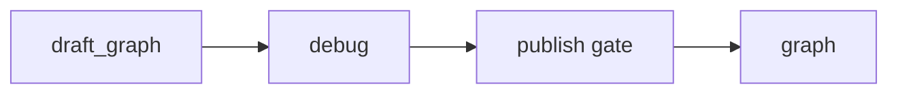
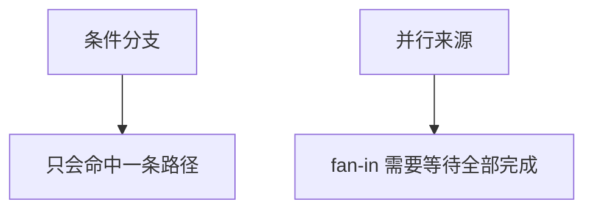

# 平台的可视化工作流实现

我写这一篇时，重点不会放在“前端能拖多少种节点”上。我更关心的是：这个项目里的工作流为什么已经不只是一个画布，而是一份能编辑、能调试、能发布、还能继续被复用的正式运行资产。

## 先说最关键的判断

这个项目里的工作流引擎，真正值钱的不是画布，而是它把前端 DSL、后端校验、编译执行和发布门禁接成了一条闭环。

我更愿意把这条闭环压成下面几个动作：

- 前端维护业务 DSL
- 后端先保存 `draft_graph`
- 调试和发布前再做严格图校验
- 通过后编译成 LangGraph 执行图
- 发布态工作流还能继续变成 `BaseTool`

只要这几步立住，工作流就不再是一个编辑器产物，而是平台资产。

## 我为什么把工作流当成正式资产

我在这个项目里最看重的，不是“支持条件分支”这种表层功能，而是它有没有把编辑态和运行态彻底分开。



这条链路里最关键的不是术语，而是它带来的工程后果：

- 我可以继续改草稿，不会污染已发布版本
- 调试永远针对草稿图
- 发布不是“顺手保存”，而是一次门禁
- 运行时只认 `graph` 这份冻结后的版本

也正因为这条边界明确，我才更愿意把工作流当成正式资产，而不是配置草稿。

## draft_graph 和 graph 为什么必须分开

这件事最能说明问题的，不是解释，而是服务层的真实代码：

```python
validate_draft_graph = self._validate_graph(draft_graph, account)

only_position_changed = self._is_only_position_changed(
    workflow.draft_graph, validate_draft_graph
)

update_data = {"draft_graph": validate_draft_graph}

if not only_position_changed:
    update_data["is_debug_passed"] = False
```

```python
if workflow.is_debug_passed is False:
    raise FailException("该工作流未调试通过，请调试通过后发布")

self.update(
    workflow,
    **{
        "graph": workflow.draft_graph,
        "status": WorkflowStatus.PUBLISHED,
        "is_debug_passed": False,
    },
)
```

我从这里最想保留的判断很简单：

- 编辑态永远落 `draft_graph`
- 发布态永远落 `graph`
- 只要不是单纯位置变更，就必须重新调试

这一步如果没有做好，后面的编译、调试和线上隔离都会变得很脆。

## DSL 怎么编译成执行图

工作流真正值钱的地方不在画布，而在编译器。

前端交过来的并不是 LangGraph 对象，而是一份 `nodes + edges` 的业务 DSL。后端要先做宽校验，再在真正执行前把它强类型化，最后才编译成执行图。

开始节点还有一个经常被忽视、但我很想记住的职责：它最终决定了工作流对外暴露的工具签名。

```python
super().__init__(
    name=workflow_config.name,
    description=workflow_config.description,
    args_schema=self._build_args_schema(workflow_config),
    **kwargs,
)
```

这段代码对我来说非常关键，因为它说明工作流不是只给画布自己用，它从一开始就在往“可复用运行时单元”这个方向设计。

## 条件分支和并行汇聚为什么不是一回事

这一层如果不拆清楚，工作流引擎就很容易在复杂图上出错。



我会特别强调这个区别，是因为它直接决定了编译器该怎么接边。

真实代码也已经把这件事写死了：

```python
graph.add_conditional_edges(
    source_node, create_condition_func(cond_edges), condition_map
)
```

```python
if has_conditional_source or len(source_nodes) == 1:
    for source_node in source_nodes:
        graph.add_edge(source_node, target_node)
else:
    graph.add_edge(source_nodes, target_node)
```

这两段代码最能说明问题的，不是 API 名字，而是编译器已经明确承认这两类汇聚的执行语义不同。

## 我现在的判断

这个项目里的工作流模块，最值得我以后继续沿用的不是“支持很多节点类型”，而是下面这几个结构选择：

1. 用前端 DSL 承接编辑行为，而不是直接暴露底层编排对象
2. 用 `draft_graph / graph` 把编辑态和运行态切开
3. 用宽校验和严格图校验分层守住编辑体验和执行正确性
4. 用编译器去明确区分条件分支和并行汇聚的语义
5. 用 `args_schema` 和 `BaseTool` 把已发布工作流重新接回平台运行时

只要这几层关系不乱，这个工作流模块就不是“能拖节点的页面”，而是一块真正可编辑、可执行、可发布、可复用的编排内核。