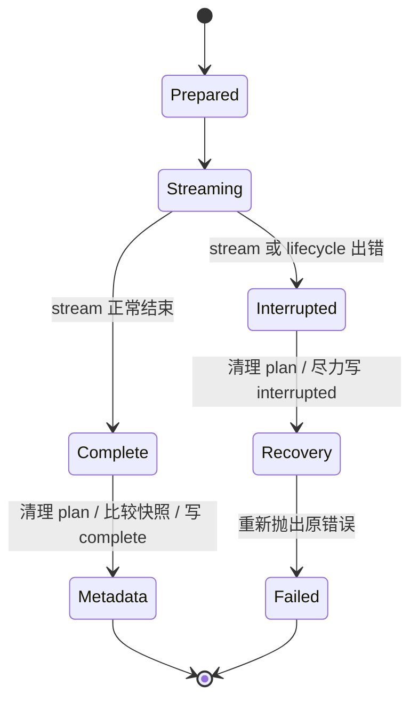

# OpenWiki 03：Wiki 怎样持续维护

> 源码定位
> - Middleware：`src/agent/translation-middleware.ts` / `src/agent/okf-middleware.ts`
> - 运行状态：`src/agent/index.ts` - `resolveCheckpointTarget` / `persistRunMetadataIfChanged`
> - 快照与 no-op：`src/agent/utils.ts` - `createOpenWikiContentSnapshot` / `getUpdateNoopStatus`
> - 索引同步：`src/okf/index-sync.ts` - `synchronizeWikiIndexes`
> - 验证：`test/` / `evals/deepswe/`

LLM Wiki 最难的部分不是第一次生成，而是下一次更新。OpenWiki 把容易漂移的结构工作放到 Agent 生命周期周围：

```text
beforeAgent
  翻译旧页面 / 迁移旧 front matter

Agent loop
  读取证据 / 写入 Markdown

wrapToolCall
  校验刚写入的 front matter

afterAgent
  Mermaid 降级 / index 同步

run 收尾
  删除 _plan.md / 比较快照 / 写 metadata
```

Middleware 能稳定处理结构，却不能替模型证明正文结论正确。

## 一、Middleware 是 Wiki 规则的生命周期适配层

OpenWiki 使用两个自定义 Middleware：

| Middleware | 主要 hook | 负责什么 |
| --- | --- | --- |
| `OpenWikiTranslationMiddleware` | `beforeAgent` | 语言切换、pending 页面重试 |
| `OpenWikiIndexMiddleware` | `beforeAgent` / `wrapToolCall` / `afterAgent` | OKF 迁移、写后校验、Mermaid 和 index |

它们由 `langchain.createMiddleware` 创建，再通过 `createDeepAgent({ middleware })` 交给 Deep Agents。

Middleware 的价值在于把确定性代码放到 Agent loop 的固定位置。它不是让模型多收到一段提示，而是让程序可以在 Agent 开始前、工具执行包裹层和 Agent 结束后自动运行逻辑：

```text
createMiddleware({
  beforeAgent,
  wrapToolCall,
  afterAgent,
})
        ↓
createDeepAgent({ middleware })
        ↓
Deep Agents 在生命周期中调用这些 hook
```

OpenWiki 的装配顺序也很重要：`update` 先挂翻译 Middleware，再挂 OKF/index Middleware。翻译在 `beforeAgent` 阶段完成，主 Agent 开始工作时看到的已经是目标语言或带有明确 pending 标记的 Wiki；OKF/index Middleware 再负责整个运行的结构收尾。

### 翻译不是每次 update 都重新翻译全文

`resolveTranslationPlan` 对每次 `update` 都返回计划，但计划不一定触发模型调用：

- 语言主子标签切换时，`translateAll: true`，处理所有 eligible 页面；
- 普通 update 只重试带 `openwiki_translation_pending` 的页面；
- 没有 pending 页面时，只做枚举和判断。

单页翻译失败不会阻断整个 run。页面会保留原内容并写入 pending 标记，下次 update 继续尝试。翻译调用带 `langsmith:nostream` 标签，避免把大段译文刷进 Agent 的普通文本流。

### OKF Middleware 让结构规则可重复执行

它把几个动作分开：

- `beforeAgent` 为旧页面补齐最小 OKF front matter；
- `wrapToolCall` 读取 Backend 记录的实际变更路径，校验刚写入的页面；发现问题时追加 warning，让模型下一轮修正；
- `afterAgent` 先把无效 Mermaid fence 降级为 `text`，再按当前文件树同步各级 `index.md`。

这些动作处理的是结构，不是内容判断：它们能让 index 反映当前目录，也能报告 front matter 不合法，但不能保证架构解释没有误读源码。

## 二、Backend 和 Middleware 怎样接力

这两个扩展点不是各自独立的。Backend 负责把写入限制在允许的范围内，并把变更路径传给 Middleware；Middleware 再读取已经落盘的文件，做结构校验。

一次 Agent 写页面的过程大致是：

```text
Agent 调用 write_file/edit_file
        ↓
Deep Agents 调用 OpenWikiLocalShellBackend
        ↓
Backend 检查 .openwikiignore 和 docs-only 边界
        ↓
通过后调用 LocalShellBackend 写入真实文件
        ↓
结果 metadata 记录 openwikiMutationPath
        ↓
wrapToolCall 读取该路径并校验 front matter
        ↓
发现问题就把 WARNING 追加到 ToolMessage
        ↓
Agent 下一轮看到 warning，修正页面
```

这条链体现了一个很实用的设计：Backend 不需要知道 OKF 规则，Middleware 也不需要重新实现文件写入。Backend 负责“能不能触碰这个文件”和“实际改了哪个文件”，Middleware 负责“这个文件的结构是否合规”。两者通过工具结果 metadata 连接起来。

翻译 Middleware 的路径略有不同：

```text
update 开始
  ↓
beforeAgent 枚举 Wiki 中的 Markdown
  ↓
代码判断全量翻译还是只重试 pending 页面
  ↓
Middleware 直接调用 model.invoke(翻译 Prompt)
  ↓
通过 Backend.edit 写回页面
  ↓
失败则写入 openwiki_translation_pending
  ↓
主 Agent 开始处理源码更新
```

也就是说，翻译不是主 Agent 自己决定“顺便做一下”，而是代码在生命周期中强制安排的一段独立流程。模型仍然参与翻译，但页面枚举、排除哪些文件、失败怎样重试，以及结果怎样写回，都由 Middleware 控制。

## 三、一次写入不是一次事务

Agent 在 stream 中边读边写。页面写入发生后，即使后续模型调用、Middleware 或 metadata 操作失败，已经落盘的文件也不会自动回滚。

失败路径大致是：



`interrupted` 不代表回滚，也不保存完整的执行位置。它的作用是阻止下一次 repository `update` 被 no-op 判断直接跳过，让下一轮重新检查可能已经部分写入的 Wiki。

## 四、四类状态，四种恢复含义

| 状态 | 存在哪里 | 能否跨进程 | 作用 |
| --- | --- | --- | --- |
| Run context | 内存对象 | 否 | 当前运行的 Prompt 和证据背景 |
| Graph checkpoint | SQLite | chat 可持久化；init/update 是内存 | 当前 graph 的状态 |
| Wiki Markdown | `openwiki/` 或个人 Wiki | 是 | 真正的业务结果 |
| `.last-update.json` | JSON 文件 | 是 | 下次 update 的变化判断和运行标记 |

`chat` 使用 `~/.openwiki/openwiki.sqlite`，`init/update` 使用 `:memory:`。因此，初始化或更新任务即使在当前进程内有 checkpoint，进程退出后也不能从上次节点续跑。跨进程留下的是页面和 metadata。

内容快照用于回答“Wiki 是否真的变化了”。如果运行只改了临时 `_plan.md` 或没有改变页面内容，OpenWiki 通常不会刷新 `.last-update.json`。如果 stream 中途出错，代码会尽力写入 `status: "interrupted"`。

## 五、no-op 是维护机制，不是模型判断

在 repository `update` 进入 Agent 前，`getUpdateNoopStatus` 会检查：

- 是否有上次成功更新的 Git HEAD；
- 上次是否被标记为 `interrupted`；
- 工作树是否有有效变化；
- 当前 HEAD 之后的提交是否只改了 Wiki 或被 ignore 的路径。

满足条件时，OpenWiki 直接返回 skipped，不创建模型和 graph。这个判断避免了“更新自己生成的 Wiki，又触发一轮更新”的循环。

带用户消息的 update 不会被当作普通 no-op，因为用户已经明确提出了新的任务。

## 六、验证也要分层

源码、测试和评测回答的不是同一个问题：

| 验证层 | 能说明什么 | 不能说明什么 |
| --- | --- | --- |
| 单元测试 | no-op、路径判断、front matter 等局部规则 | 真实模型能否写出好 Wiki |
| 集成测试 | Backend、Middleware、SQLite 和工具组合后的边界 | 外部 provider 当前一定可用 |
| 真实 E2E | SDK、认证、网络和真实服务能否接通 | Wiki 对下游任务的长期价值 |
| DeepSWE paired eval | 注入 Wiki 后 coding agent 结果是否变化 | 单次结果之外的普遍结论 |

所以，测试覆盖 front matter，不等于 Wiki 内容准确；DeepSWE harness 能运行，也不等于 Wiki 已经提高了 coding agent 的成功率。

## 七、这条维护闭环值得复用什么

OpenWiki 的可复用部分不是某个具体的 Markdown 模板，而是维护闭环：

```text
模型负责开放式内容判断
代码负责可重复的结构收尾
文件和 metadata 保存业务结果
失败状态阻止错误跳过
测试分别验证局部规则、组合边界和真实效果
```

如果要把 Deep Agents 用在别的知识库项目里，可以优先复用这条分工。不要让模型独自承担目录同步、状态判断和失败恢复，也不要把所有运行信息都写进 Prompt 后就认为系统已经具备长期记忆。
