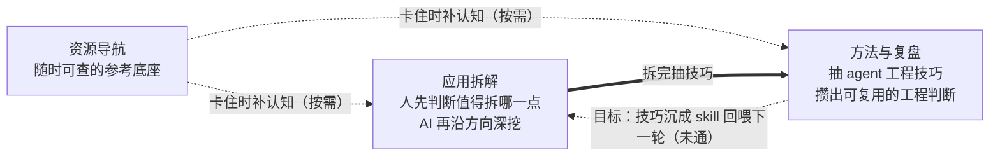

# Nice AI 学习沉淀

<section className="home-lead">

  
把优秀学习资源和真实开源项目，变成人能复用、AI 能调用的工程判断。

  
能交给 AI 做的交给 AI，方向和判断留在人手里：人先判断这个项目值得拆哪一点，AI 沿方向把广度铺满，人验真伪再入库。

</section>

## 三栏各做什么

<section className="home-loop-thesis">
  
为什么这么分工：AI 存着海量专业知识、能预测能梳理，但要人给特定输入才激活对应那部分，而且它按概率把最像的东西铺出来，越顺越可能在自信地出错；人反过来能判断真伪却知识有限。两者缺口互补，所以是<strong>人定方向、AI 铺广度、人验真伪</strong>——判断的入口和出口都在人手里，AI 把中间那段做得又快又全。

  
方法与复盘里产出的技巧，按目标要逐步封成被下一轮调用的 skill，让工程判断越攒越准。这条回灌现在还没落地：skill 还没封、工作流还没搭，图里标成「未通」就是这个意思。

</section>

## 三个入口

<section className="home-route-list">
  

    <h3>资源导航 — 值得反复回看的，人来筛</h3>
    
值得反复回看的学习资源，人筛出值得进库的，作为后续拆解和复盘的参考底座。现收录 11 条，按"拿它干什么"分通用系统教程、模式与生产参考、AI 编程上手、Coding Agent 机制拆解、真实系统源码五组。 <a href="./resources/">进入资源导航 →</a>

  

  

    <h3>应用拆解 — 人先判断值得拆哪一点，再让 AI 沿方向深挖</h3>
    
不套一个万能模板：先由人判断这个项目的价值点在哪——是工程实现做得好，是某个功能做得绝，还是商业模式、AI 在业务里的落点——定下这次拆的方向，AI 再沿方向把广度铺满、人验真伪。现有 Dify v1.15.0（16 篇）和 Claude Code CLI（18 篇）两组源码拆解，商业项目线在建。 <a href="./application-notes/">进入应用拆解 →</a>

  

  

    <h3>方法与复盘 — 抽技巧、沉 skill</h3>
    
从应用拆解里提炼能带到下一次的判断、模式和 agent 工程技巧，目标是逐步封成能被下一轮调用的 skill，让工程判断越攒越准。skill 那一步现在还没落地。 <a href="./notes/">进入方法与复盘 →</a>

  

</section>

## 怎么用这个站

- 找资源学：从资源导航的地图按缺口选一条。
- 看系统怎么拆：进应用拆解，对照 Dify 或 Claude Code 的实现，看它为什么这样拆。
- 沉淀方法论：方法与复盘里的跨项目判断和 agent 工程技巧，可对照自己的实践。

内容在，商业项目线刚起步，skill 和工作流还没落地。首页写的是这个站要长成的样子和为什么这么建，等最小这条回线（人定方向 → AI 沿方向拆 → 抽 skill → 下一轮真调用它）跑通一圈，再把 skill 那一步从方向升级成事实。

想知道这个站是谁在写，看 <a href="./about/">关于我</a>；想一起补资源或复用写作骨架，看 <a href="./templates/">共建与模板</a>。

## 这个站怎么写

<section className="home-principles">
  <ul>
    <li>能交给 AI 做的交给 AI，方向和判断留给人；AI 铺出来的东西，人要验真伪再入库。</li>
    <li>产物为复用而结构化：人能读懂，AI 能抽取、能调用，同一份东西两种读法。</li>
    <li>不追求全，收录认为值得反复回看的东西。</li>
    <li>不写平均用力的总结，每篇都尽量给出明确判断。</li>
    <li>不搬运原文，优先留下对应的理解、取舍和以后还会回看的笔记。</li>
  </ul>
</section>
