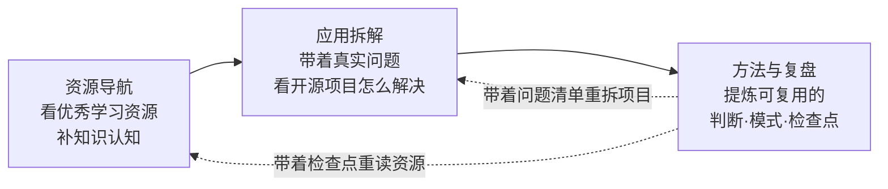

# Nice AI 学习沉淀

<section className="home-lead">

  
把优秀学习资源和真实开源项目，变成自己能复用的工程判断。

  
这个站由三个专栏构成一个闭环：资源导航补知识认知，应用拆解带着真实会遇到的问题去开源项目里看人家怎么解决，方法与复盘提炼出能带到下一次的判断和模式。

</section>

## 三栏怎么构成一个闭环

<section className="home-loop-thesis">
  Loop Engineer
  
不把资源、项目、方法堆成线性管道，而是让方法层的产出——检查点与问题清单——反过来改变下一轮怎么读资源、怎么拆项目。每跑一轮，下一轮的输入质量就高一截，所以是螺旋上升，不是原地转圈。

  
能螺旋上升的前提是回箭头真的在修正前两步：方法层不能只记录“又看了什么”，要能推翻上一轮的判断。回箭头一旦断掉，这个 loop 就退化成只进不出的堆料仓库。

</section>

## 三个入口

<section className="home-route-list">
  

    <h3>资源导航 — 知识认知补充</h3>
    
看优秀学习资源，建立概念和模式认知。现在收录 9 条资源，分入门路径、Coding Agent、架构治理、源码系统四组。 <a href="./resources/">进入资源导航 →</a>

  

  

    <h3>应用拆解 — 带着真实问题看开源项目</h3>
    
不是无目的拆解，是带着真实会遇到的问题，去真实开源项目里看人家怎么解决。现有 Dify v1.15.0（16 篇）和 Claude Code CLI（18 篇）两组源码拆解。 <a href="./application-notes/">进入应用拆解 →</a>

  

  

    <h3>方法与复盘 — 提炼可复用</h3>
    
从前两步沉淀出能带到下一次的判断、模式和检查点：跨项目的思考、踩坑复盘、学习路径的阶段判断。 <a href="./notes/">进入方法与复盘 →</a>

  

</section>

## 怎么用这个站

- 找资源学：从资源导航的地图按缺口选一条。
- 看系统怎么拆：带着真实问题进应用拆解，对照 Dify 或 Claude Code 的实现。
- 沉淀方法论：方法与复盘里的跨项目判断和学习路径复盘，可对照自己的实践。

想知道这个站是谁在写，看 <a href="./about/">关于我</a>；想一起补资源或复用写作骨架，看 <a href="./templates/">共建与模板</a>。

## 这个站怎么写

<section className="home-principles">
  <ul>
    <li>不追求全，收录认为值得反复回看的东西。</li>
    <li>不写平均用力的总结，每篇都尽量给出明确判断。</li>
    <li>不搬运原文，优先留下对应的理解、取舍和以后还会回看的笔记。</li>
    <li>在这些学习的资源基础上，完善对应知识缺口的同时，在实践中还能留下一些自己的理解。</li>
  </ul>
</section>
