# Claude Code 引擎透视篇：Agent 循环与上下文管理的内部机制

> 本文是 [Claude Code 用户视角使用篇](./agent-claude-code-user-perspective.md) 的姊妹篇——那篇从"用户能看到什么"出发,这篇从"引擎在干什么"出发。两篇互为镜像,形成完整闭环。

Claude Code 的每项用户功能(Slash 命令、子 Agent、Skill、Hook、MCP...),背后都是 **Agent Loop + 上下文管理** 的具体实现。

本文将所有用户可见的功能,映射到 Agent 系统的理论框架上:

1. **先建立理论坐标系** —— Agent Loop 的三个阶段(Reason/Act/Observe) + 上下文的七个层次
2. **再拆解每项功能** —— 它改变了循环的哪个部分、管理了哪层上下文
3. **最后形成设计模式库** —— 当你自己造 Agent 时,能直接复用的架构决策

读完你应该能回答三个问题:

- 看到 Claude Code 的某项功能,能立刻定位它"在循环的哪一步生效"
- 理解为什么 Claude Code 要这样设计(不是为了炫技,是为了解决 Agent 的本质问题)
- 自己设计 Agent 时,能从 Claude Code 的实现里**抄到哪些架构模式**

---

## 理论坐标系:Agent Loop 的三个阶段

Agent 的核心不是模型,而是**循环**。不管你用不用框架,本质都是:

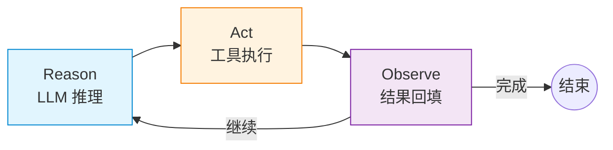

**Reason(思考)** —— 分析当前上下文,决定下一步做什么
**Act(行动)** —— 调用工具,执行具体操作
**Observe(观察)** —— 把执行结果写回上下文,供下一轮推理使用

这个循环会一直跑,直到满足退出条件(LLM 说完成、预算耗尽、达到最大轮数)。

---

## 理论坐标系:上下文的七个层次

Agent 每一轮推理需要的"信息环境"是分层的:

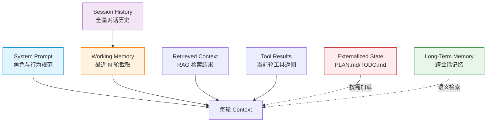

| 层次 | 时间跨度 | Claude Code 对应 |
|------|---------|-----------------|
| **System Prompt** | 整个会话 | CLAUDE.md + Rules + Skill 描述 |
| **Session History** | 当前会话 | `projects/<cwd>/<session-id>.jsonl` |
| **Working Memory** | 当前任务 | `/compact` 压缩后的消息列表 |
| **Retrieved Context** | 当前轮 | MCP 工具返回、Skill 附加文件 |
| **Tool Results** | 当前轮 | Bash/Read/Edit 等工具的输出 |
| **Externalized State** | 当前任务 | Plan Mode 下的 PLAN.md/TODO.md |
| **Long-Term Memory** | 跨会话 | Auto Memory(`memory/*.md`) |

每一层都有自己的生命周期,Claude Code 的每项功能都在管理其中一层或多层。

---

## 映射一:Slash 命令 —— 循环的入口与出口控制

### 用户视角

在 [用户视角篇·维度一](./agent-claude-code-user-perspective.md#维度一slash-命令用户直接敲的那些) 中,Slash 命令是"用户直接敲的那些"——`/commit`、`/review`、`/init`...

### 引擎视角:两类命令的本质区别

Slash 命令分两类,它们的底层机制完全不同:

| 类型 | 命令例子 | 引擎行为 | 改变了循环的什么 |
|------|---------|---------|----------------|
| **inline** | `/clear` `/compact` `/help` | 把命令对应的 Prompt **塞进主 Agent 上下文** | **Reason 阶段前**注入新指令 |
| **fork** | `/commit` `/review` `/loop` | 派生**独立上下文**的子 Agent,结果只回传摘要 | **整轮循环**隔离,主 Agent 不污染 |


**为什么需要 fork?**

`/review` 会产生大量只读工具调用(Read/Grep/Glob),如果把所有调用历史都塞进主 Agent 上下文,会:
- Token 消耗暴涨(可能 10 万+ token)
- 主 Agent 的注意力被审查细节稀释
- 后续任务可能因为上下文太长被迫 `/clear`

fork 把审查的整个循环隔离在子 Agent 里,主 Agent 只收到"发现了 5 个问题"的摘要,上下文保持精简。

**inline 的副作用**

`/compact` 是 inline,它的 Prompt 进了主上下文。虽然命令目的是"压缩上下文",但命令本身的 Prompt 占了位置。如果连续多次 `/compact`,每次的 Prompt 都会累积,反而增加上下文负担。

设计原则:**有大量工具调用、产生大量观测结果的,用 fork;只改变 Agent 行为指令的,用 inline。**

---

## 映射二:子 Agent 系统 —— 上下文隔离的规模化应用

### 用户视角

在 [用户视角篇·维度三](./agent-claude-code-user-perspective.md#维度三子-agent-系统内置--自定义) 中,子 Agent 是"独立上下文窗口中运行的专门 AI 助手"。

### 引擎视角:上下文隔离的三种模式

子 Agent 解决的核心问题是:**有些任务会产生大量中间过程,但这些过程不值得留在主上下文里。**

Claude Code 实现了三种隔离模式:

```mermaid
flowchart TB
    subgraph Mode1[模式 1: Explore<br/>只读调研]
        E1[Explore 子 Agent] --> L1[Haiku 模型<br/>低成本]
        L1 --> T1[只读工具集<br/>Read/Grep/Glob]
        T1 --> S1[结果摘要<br/>精简回传]
    end
    
    subgraph Mode2[模式 2: general-purpose<br/>完整隔离]
        E2[general-purpose] --> L2[继承主对话模型]
        L2 --> T2[全套工具<br/>含 Write/Edit]
        T2 --> S2[结果摘要<br/>精简回传]
    end
    
    subgraph Mode3[模式 3: Plan<br/>调研 + 方案]
        E3[Plan 子 Agent] --> L3[只读工具<br/>跳过 CLAUDE.md/git]
        L3 --> S3[方案文档<br/>写入 plans/]
    end
    
    style Mode1 fill:#e8f5e9,stroke:#388e3c
    style Mode2 fill:#fff3e0,stroke:#f57c00
    style Mode3 fill:#e1f5fe,stroke:#0288d1
```

**关键设计:只读工具集**

Explore 和 Plan 都是只读工具集。这是 Claude Code 的强制安全设计——给"调研类" Agent 限定最小权限。

如果 Explore 有 Write 权限,它可能在搜索过程中"顺手改了代码",而主 Agent 上下文里只有摘要,看不到改动细节,后续决策会基于错误的前提。

**上下文管理的三层策略**

子 Agent 的上下文管理比主 Agent 更激进:

| 子 Agent 类型 | 跳过 CLAUDE.md | 跳过 git 状态 | 跳过 Auto Memory | 上下文策略 |
|--------------|---------------|--------------|-----------------|-----------|
| **Explore** | ✅ 是 | ✅ 是 | ✅ 是 | 极简,只留当前任务 |
| **Plan** | ✅ 是 | ✅ 是 | ✅ 是 | 极简,只留当前任务 |
| **general-purpose** | ❌ 否 | ❌ 否 | ❌ 否 | 继承主 Agent 级别 |

为什么 Explore 要跳过 CLAUDE.md?CLAUDE.md 可能很长(几千 token),Explore 的职责是"找到代码在哪",不需要项目规范。跳过可以节省 token,让 Explore 专注于当前搜索词。

**子 Agent 的 Skill 预加载**

子 Agent 可以通过 `skills` frontmatter 预加载 Skill:

```markdown
---
name: api-developer
description: Implement API endpoints
skills:
  - api-conventions
  - error-handling-patterns
---
```

引擎行为:**子 Agent 启动时,把 Skill 的完整内容注入 System Prompt,而不是只加载描述。**

这与主 Agent 的 Skill 加载不同——主 Agent 在运行时通过 Skill 工具发现和调用,子 Agent 在启动时就拿到了完整指令。

设计意图:子 Agent 的上下文窗口有限,运行时去发现 Skill 会增加不确定性。预加载保证子 Agent 一开始就有完整的领域知识。

---

## 映射三:Skill 系统 —— Prompt 的结构化封装

### 用户视角

在 [用户视角篇·维度二](./agent-claude-code-user-perspective.md#维度二自定义命令系统slash-command-vs-skill) 中,Skill 是"既可手动调用,也可模型自动触发"的命令封装。

### 引擎视角:Skill 改变了 System Prompt 的构造方式

Skill 的本质是:**把原本散落在各处的 Prompt,结构化为一个可引用的模块。**

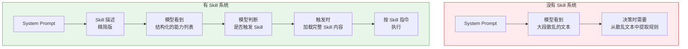

**Skill 的上下文生命周期**

Skill 内容作为**单条消息**进入对话,会话期间**不会重新读取**文件。

这意味着:
- Skill 被调用后,内容固定在上下文里
- 即使磁盘上的 SKILL.md 文件被修改,当前会话仍用旧版本
- 自动压缩后,最近调用的 Skill 会被重新附加(前 5,000 token)

**动态上下文注入的预处理机制**

Skill 支持在内容发送给 Claude **之前**运行 shell 命令,把输出替换到提示中:

```markdown
---
name: pr-summary
---

## Pull request context
- PR diff: !`gh pr diff`
- PR comments: !`gh pr view --comments`
```

引擎执行顺序:
1. 立即执行 `gh pr diff` 命令
2. 输出替换 `!` 占位符
3. Claude 收到的是实际数据,不是命令本身

这是**预处理**,不是 Claude 执行的内容。它解决了"Skill 需要实时数据,但 Claude 不能直接调 Bash"的问题。

**Skill 与 Rules 的上下文加载差异**

| 维度 | Skill | Rules |
|------|-------|-------|
| 加载时机 | 模型判断触发 / 用户调用 | Claude 操作匹配文件时 |
| 加载内容 | 完整 SKILL.md | 匹配的 rules 文件 |
| 上下文位置 | 作为消息追加 | 作为 System Prompt 条件性附加 |
| 生命周期 | 会话期间固定 | 按文件类型动态加载 |

Rules 的设计更节省上下文——长规范不会每次都占位置,只在 Claude 改特定文件时才出现。

---

## 映射四:Hook 系统 —— 循环的确定性控制点

### 用户视角

在 [用户视角篇·维度八](./agent-claude-code-user-perspective.md#维度八hook事件驱动的自动化) 中,Hook 是"事件驱动的自动化"——在工具调用前后自动跑脚本。

### 引擎视角:Hook 是对 Agent 透明的强制约束

Hook 的关键特性:**Agent 不知道 Hook 跑了什么。**

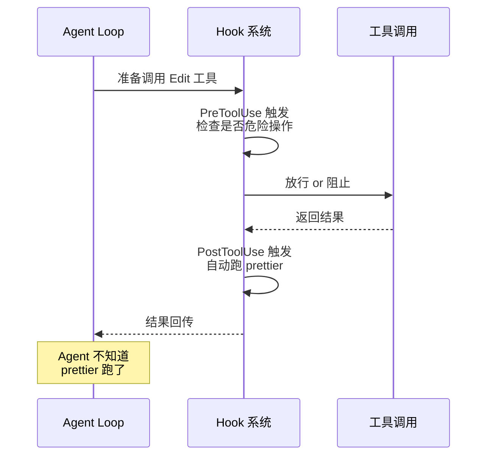

**Hook 改变了循环的哪一步?**

| Hook 事件 | 触发时机 | 改变的循环阶段 | 典型用途 |
|----------|---------|---------------|---------|
| **PreToolUse** | 工具调用前 | **Act 阶段前** | 拦截危险命令、参数校验 |
| **PostToolUse** | 工具调用成功后 | **Observe 阶段后** | 自动格式化、日志记录 |
| **Stop** | Agent 完成响应时 | **循环结束前** | 强制质量检查 |
| **UserPromptSubmit** | 用户提交消息后 | **Reason 阶段前** | 注入附加上下文 |
| **SessionStart** | 会话开始时 | **循环启动前** | 初始化环境 |
| **PreCompact** | 上下文压缩前 | **Working Memory 管理前** | 保存关键信息 |

**Hook 的退出码控制**

Hook 通过退出码控制循环行为:

| 退出码 | 含义 | 循环行为 |
|--------|------|---------|
| **0** | 无异议 | Act 正常执行,Observe 正常回填 |
| **2** | 阻止 | Act 被取消,Observe 得到错误反馈 |
| **其他** | 错误 | Act 正常执行,但显示 hook error 通知 |

退出码 2 是 Hook 的核心能力——它可以在 Act 阶段前"砍掉"工具调用,让 Agent 重新 Reason 选择其他路径。

**Hook vs Skill 的本质区别**

Hook 是**对 Agent 透明的**,Skill 是**Agent 主动读到的**。

需要强制约束用 Hook(如"绝不允许删 .git"),需要引导 Agent 行为用 Skill(如"审查时关注性能")。

---

## 映射五:MCP 集成 —— 工具集的动态扩展

### 用户视角

在 [用户视角篇·维度九](./agent-claude-code-user-perspective.md#维度九mcp-集成外部工具的标准化接入) 中,MCP 是"外部工具的标准化接入"。

### 引擎视角:MCP 改变了 Act 阶段的能力边界

MCP 的核心机制:**在循环启动时,把外部工具注入工具集。**

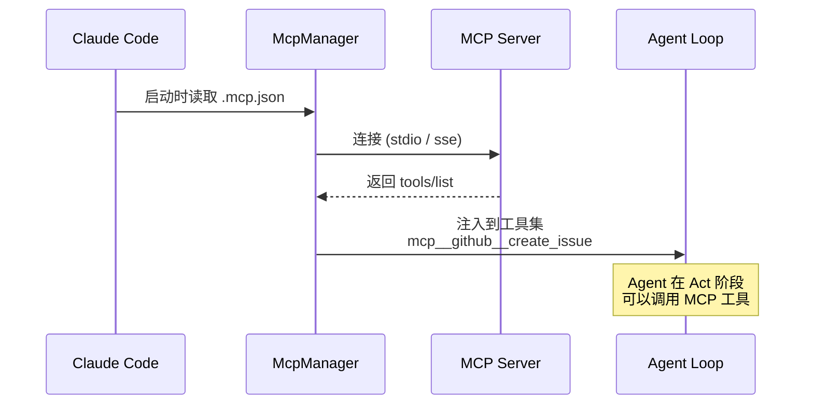

**MCP 工具在循环中的位置**

MCP 工具与内置工具(Bash/Read/Edit)在循环中地位相同:

- **Reason 阶段**:LLM 在上下文中看到 MCP 工具的 Schema,决定是否调用
- **Act 阶段**:如果 LLM 输出 MCP 工具调用,引擎通过 JSON-RPC 执行
- **Observe 阶段**:MCP 工具的返回值写回上下文,格式与内置工具一致

**MCP 的上下文管理**

MCP 工具返回值可能很长(如 GitHub PR 的完整 diff),引擎需要做截断或压缩。

Claude Code 的默认策略:
- Tool Result 超过 10,000 字符时,提示 LLM"输出过长,建议分段读取"
- 不自动截断,保留完整结果让 LLM 自己判断如何处理

这与内置工具 `read_file` 的策略一致——信任 LLM 的判断,而不是引擎强制丢弃。

---

## 映射六:Plan Mode —— System Prompt 的动态组装

### 用户视角

在 [用户视角篇·维度七](./agent-claude-code-user-perspective.md#维度七协作范式plan--goal--spec--loop) 中,Plan Mode 是"先出方案,approve 后执行"的协作范式。

### 引擎视角:Plan Mode 改变了 System Prompt 的构造逻辑

Plan Mode 的本质:**在 System Prompt 中注入强制 SOP(标准作业程序)。**

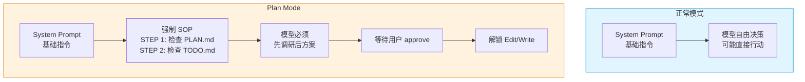

**System Prompt 的动态组装**

Plan Mode 开启时,引擎在 System Prompt 末尾追加一段强制指令:

```python
def build_system_prompt(self, work_dir: str) -> str:
    base = "# 核心身份\n你是一个高级软件工程师助手。\n\n"
    
    if self.plan_mode:
        base += """
# 长程任务强制规范 (Plan Mode: ON)

收到指令后,你必须、且只能按照以下顺序执行:

**[STEP 1: 强制环境嗅探]**
- 使用 bash 检查工作区根目录下是否已存在 PLAN.md 和 TODO.md
- 分支 A (全新任务):文件不存在 → 依次创建
- 分支 B (断点续传):文件已存在 → 绝对不要覆盖

**[STEP 2: 严格的单步执行]**
- 每完成一个子任务,必须立即停下来,用 edit_file 将 TODO.md 中对应的行修改为 - [x]
"""
    return base
```

**Plan Mode 与外部化状态的配合**

Plan Mode 的上下文管理依赖**外部化状态**(PLAN.md/TODO.md):

| 上下文层次 | 正常模式 | Plan Mode |
|----------|---------|----------|
| **System Prompt** | 基础指令 | 基础指令 + 强制 SOP |
| **Working Memory** | 最近 N 轮 | 最近 N 轮 + PLAN.md/TODO.md(按需) |
| **Tool Results** | 所有工具调用 | 调研阶段只读工具,执行阶段解锁写工具 |

**上下文切换点**

Plan Mode 有两个明确的切换点:

1. **调研 → 方案**:Plan 子 Agent 完成调研,主 Agent 输出方案
2. **方案 → 执行**:用户 approve,主 Agent 解锁 Edit/Write 工具

每个切换点都伴随着上下文重组——调研阶段的只读工具调用被压缩或丢弃,方案阶段的 System Prompt 被替换为执行阶段的指令。

---

## 映射七:代理团队 —— 多循环的并行与协调

### 用户视角

在 [用户视角篇·维度四](./agent-claude-code-user-perspective.md#维度四代理团队agent-teams--让多个-claude-互相协作) 中,代理团队是"让多个 Claude 互相协作"。

### 引擎视角:代理团队是多循环的并行执行

代理团队的本质:**多个独立的 Agent Loop 同时跑,通过共享任务列表协调。**

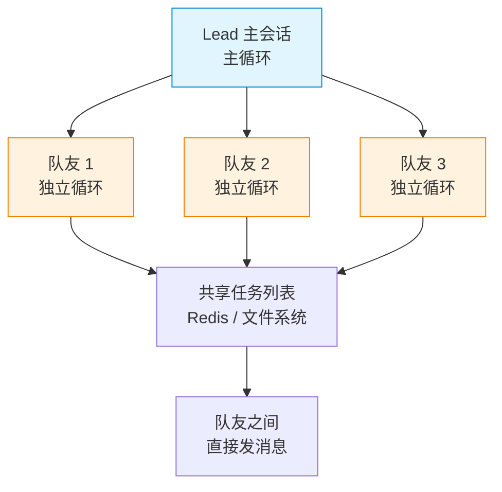

**代理团队 vs 子 Agent**

| 维度 | 子 Agent | 代理团队 |
|------|---------|---------|
| 循环数 | 1 个主循环 + 1 个子循环 | 1 个主循环 + N 个队友循环 |
| 上下文 | 子循环独立,结果回传主循环 | 所有循环独立,共享任务列表 |
| 协调 | 主 Agent 管理子 Agent | 队友之间互相发消息 |
| Token 成本 | 子循环成本 + 摘要回传成本 | 所有循环成本线性叠加 |

**代理团队的上下文隔离**

每个队友是完全独立的 Agent Loop:

- 有自己的 System Prompt(从项目 CLAUDE.md 加载)
- 有自己的 Working Memory(不继承主会话历史)
- 有自己的工具集(可以与主会话不同)

协调机制:**共享任务列表 + SendMessage 工具。**

队友之间通过 SendMessage 工具直接通信,不需要主 Agent 中转。这带来了并行优势,也带来了协调复杂度——如果两个队友同时改同一文件,会冲突。

**上下文管理的代价**

代理团队的 Token 消耗是线性叠加:

| 队友数 | 相对 Token 消耗 | 原因 |
|--------|----------------|------|
| 1 个 | 1× | 单循环 |
| 3 个 | 3× | 三个独立循环 |
| 5 个 | 5× | 五个独立循环 |

设计原则:**能用子 Agent 解决的,不要用代理团队。代理团队是为了"互相协作、互相验证",不是为了"并行干活"。**

---

## 映射八:动态工作流 —— 循环的确定性编排

### 用户视角

在 [用户视角篇·维度五](./agent-claude-code-user-perspective.md#维度五动态工作流workflow--把计划移出主上下文) 中,动态工作流是"把计划移出主上下文"。

### 引擎视角:动态工作流是把循环的控制权交给脚本

动态工作流的本质:**用确定性的 JS 脚本编排不确定性的 Agent Loop。**

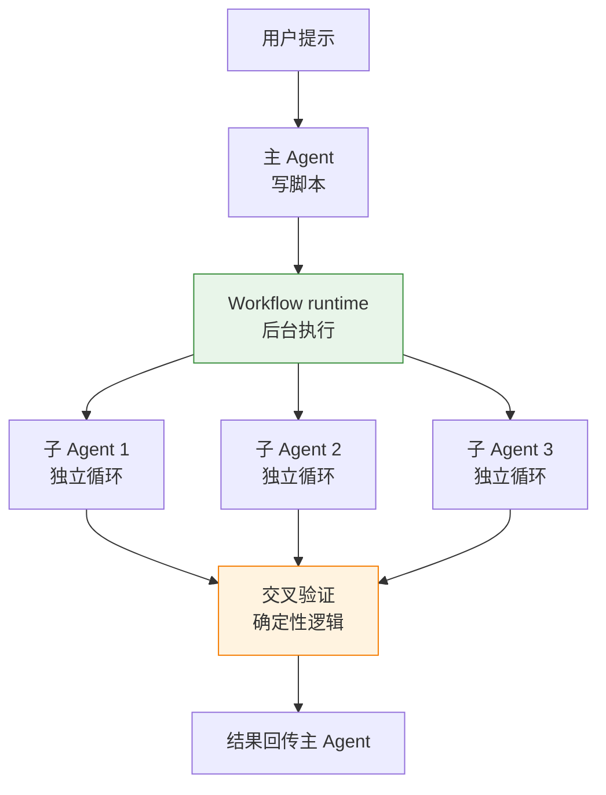

**动态工作流 vs 代理团队 vs 子 Agent**

| 维度 | 子 Agent | 代理团队 | 动态工作流 |
|------|---------|---------|-----------|
| 控制权 | Claude 逐轮决定 | Claude 逐轮决定 | **脚本确定性决定** |
| 并行度 | 单个子循环 | 3-5 个队友循环 | 每次数十到数百个子循环 |
| 上下文 | 子循环独立 | 所有循环独立 | 所有循环独立 |
| 可重复性 | Claude 决定 | Claude 决定 | **脚本可保存复用** |

**脚本的作用:把"下一步做什么"从 LLM 概率性判断变成代码确定性判断。**

```javascript
// 工作流脚本示例
export const meta = {
  name: 'review-changes',
  description: 'Review changed files across dimensions',
}

const DIMENSIONS = ['bugs', 'perf', 'security']
const results = await pipeline(
  DIMENSIONS,
  d => agent(`Review for ${d}`, {schema: FINDINGS_SCHEMA}),
)

const verified = await parallel(
  results.flat().map(f => () =>
    agent(`Verify: ${f.title}`, {schema: VERDICT_SCHEMA})
  )
)

return { confirmed: verified.filter(v => v.isReal) }
```

脚本决定了:
- 派多少个子 Agent
- 每个 Agent 用什么 Schema
- 结果如何聚合
- 验证逻辑是什么

Claude 只负责执行脚本里定义的每一步,不需要自己判断"下一步做什么"。

**上下文管理的极致隔离**

动态工作流的上下文隔离比代理团队更彻底:

- 主 Agent 只持有脚本和最终结果
- 所有子 Agent 的中间过程在脚本变量中,不进主上下文
- 脚本可以在暂停后恢复,子 Agent 结果缓存

设计意图:**当任务大到超出单次协调能力(500 文件级),靠 Claude 逐轮判断会失控。脚本提供确定性框架,Claude 在框架内执行。**

---

## 映射九:Auto Memory —— 跨会话的长期记忆管理

### 用户视角

在 [用户视角篇§ 5.2](./agent-claude-code-user-perspective.md#52-auto-memory让-claude-跨会话学习) 中,Auto Memory 是"让 Claude 跨会话学习"。

### 引擎视角:Auto Memory 是上下文的第七层(Long-Term Memory)

Auto Memory 的本质:**在 Session 启动时,自动加载跨会话记忆索引。**

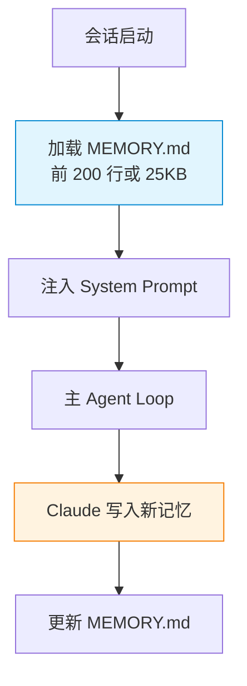

**Auto Memory 的上下文位置**

Auto Memory 加载的是**索引文件**(MEMORY.md),不是所有记忆文件:

| 上下文层次 | 加载时机 | 加载内容 | Token 成本 |
|----------|---------|---------|-----------|
| **CLAUDE.md** | Session 启动 | 完整文件 | 全部计入 |
| **Auto Memory 索引** | Session 启动 | MEMORY.md 前 200 行 | 固定约 2,000 token |
| **Auto Memory 详细文件** | 按需 | Claude 用 Read 工具读取 | 仅读取时计入 |

设计意图:**保持索引精简,详细内容按需加载。**

MEMORY.md 是一个轻量目录,列出"记忆了哪些主题",不包含具体内容。Claude 在 Reason 阶段看到索引,决定是否需要 Read 详细文件。

**Auto Memory vs CLAUDE.md 的职责边界**

| 维度 | CLAUDE.md | Auto Memory |
|------|----------|------------|
| 谁写 | 用户主动写 | Claude 被动写 |
| 内容 | 项目约定、规范 | 调试经验、模式发现 |
| 生命周期 | 永久,进 Git | 永久,本机私有 |
| 加载方式 | 每次完整加载 | 索引始终加载,详情按需 |

**Auto Memory 的写入触发**

Claude 在 Observe 阶段发现"值得记录的信息"时,会调用 Write 工具更新 `memory/*.md`:

- 非显而易见的构建命令
- 已解决的重要 bug 的根本原因
- 项目特有的代码规范(与行业惯例不同的)

写入时,引擎不做校验——信任 Claude 的判断。用户可以手动编辑或删除不想要的记忆。

---

## 映射十:worktree 隔离 —— 文件冲突维度的解决方案

### 用户视角

在 [用户视角篇·维度六](./agent-claude-code-user-perspective.md#维度六worktree-隔离让并行会话不会改到同一份文件) 中,worktree 是"让并行会话不会改到同一份文件"。

### 引擎视角:worktree 是 Act 阥段的物理隔离

worktree 的本质:**在 Act 阶段,让每个 Agent 在独立的文件副本上操作。**

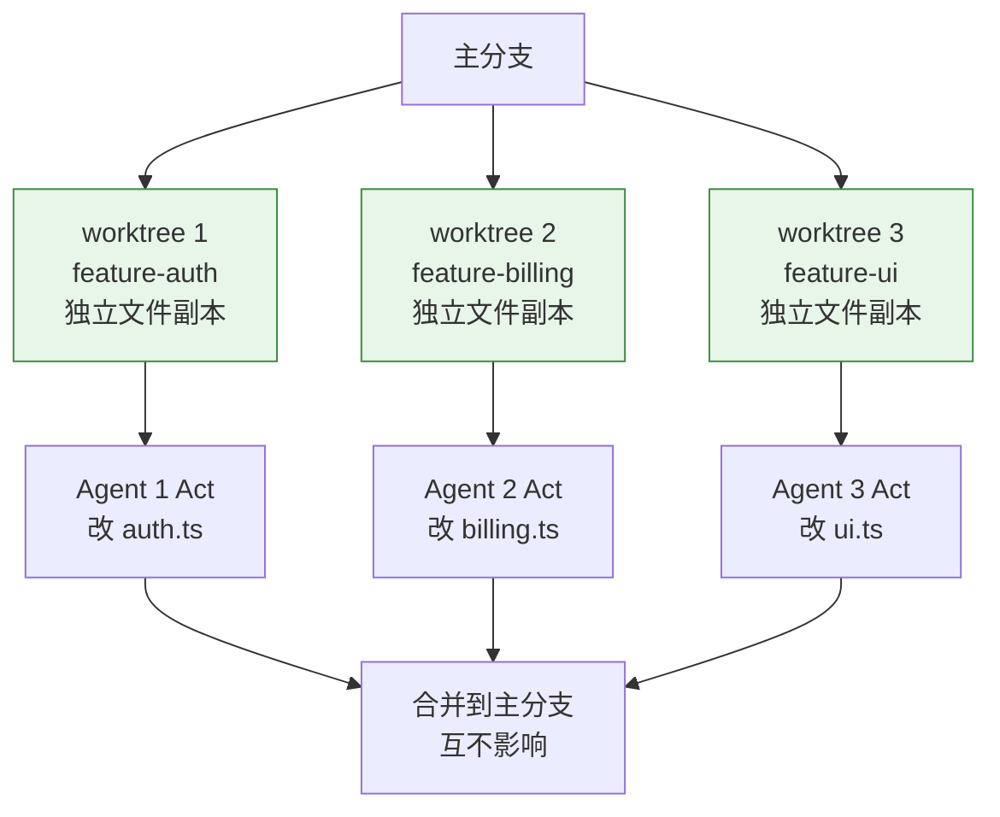

**worktree 与 Agent Loop 的关系**

worktree 不改变循环结构,只改变 Act 阥段的**文件路径映射**:

| 循环阶段 | 无 worktree | 有 worktree |
|---------|------------|------------|
| **Reason** | 在主分支上下文推理 | 在 worktree 上下文推理 |
| **Act** | 在主分支文件上操作 | **在 worktree 文件上操作** |
| **Observe** | 观察主分支文件变化 | 观察 worktree 文件变化 |

**worktree 的生命周期管理**

worktree 的创建和清理由引擎自动管理:

| 场景 | 行为 | 上下文影响 |
|------|------|-----------|
| 子 Agent `isolation: "worktree"` | 启动时创建 worktree | 子 Agent 循环在 worktree 里跑 |
| 子 Agent 无改动完成 | worktree 自动删除 | 主 Agent 上下文无影响 |
| 子 Agent 有改动完成 | 提示用户保留或删除 | 改动合并回主分支 |
| 手动 `--worktree` | 长期存在,用户管理 | 独立 Session,与主 Session 无关 |

**worktree 与上下文隔离的正交关系**

worktree 解决的是**文件冲突维度**,与**上下文隔离维度**正交:

| 维度 | 解决的问题 | 工具 |
|------|----------|------|
| **上下文隔离** | Token 爆炸、注意力稀释 | 子 Agent / 代理团队 / 动态工作流 |
| **文件冲突** | 并行改同一文件 | worktree |

两者可以叠加:动态工作流的子 Agent 可以设 `isolation: "worktree"`,实现上下文隔离 + 文件隔离。

---

## 映射十一:Goal/Loop 范式 —— 退出条件的自动化

### 用户视角

在 [用户视角篇·维度七](./agent-claude-code-user-perspective.md#维度七协作范式plan--goal--spec--loop) 中,Goal 是"设完成条件,Claude 持续推进",Loop 是"按时间间隔重复执行"。

### 引擎视角:Goal/Loop 改变了循环的退出判断

Goal 和 Loop 的本质:**把"什么时候退出"从 LLM 判断变成外部条件判断。**

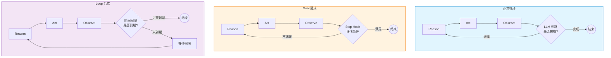

**Goal 的退出判断机制**

Goal 是 Stop hook 的包装器:

```python
# Goal 的内部实现
def goal_stop_hook(state: dict, condition: str) -> bool:
    """每个回合后,用小模型评估条件是否满足"""
    history = state["messages"]
    
    # 调用 Haiku 评估(不调工具,只看对话内容)
    evaluation = llm.invoke([
        {"role": "system", "content": "你是一个条件评估器。只回答 YES/NO。"},
        {"role": "user", "content": f"对话历史:\n{history}\n\n条件:\n{condition}\n\n是否满足?"}
    ])
    
    return evaluation == "YES"
```

关键设计:**评估用 Haiku(便宜),不调用工具(只读对话历史),每个回合后触发。**

**Loop 的退出判断机制**

Loop 是时间驱动的 Cron 任务:

```python
# Loop 的内部实现
def loop_cron(interval: str, prompt: str, ttl_days: int = 7):
    """创建周期性 Cron 任务"""
    cron_expr = parse_interval(interval)  # "5m" -> "*/5 * * * *"
    
    CronCreate(
        cron=cron_expr,
        prompt=prompt,
        recurring=True,
        expires_at=datetime.now() + timedelta(days=ttl_days),
    )
```

关键设计:**Loop 不改变循环结构,只在循环结束后等待间隔再触发新循环。**

**Goal vs Loop 的本质区别**

| 维度 | Goal | Loop |
|------|------|------|
| 驱动方式 | 条件驱动 | 时间驱动 |
| 退出判断 | Stop hook + Haiku 评估 | Cron 调度器 + TTL |
| 上下文 | 单个回合的对话历史 | 不涉及上下文判断 |
| 适用场景 | "做到满足这个条件为止" | "每隔多久查一次" |

---

## 映射十二:Settings 三级覆盖 —— System Prompt 的分层管理

### 用户视角

在 [用户视角篇·维度十一](./agent-claude-code-user-perspective.md#维度十一settings-的四级覆盖) 中,Settings 是"全局/项目/本地三级覆盖"。

### 引擎视角:Settings 改变了 System Prompt 的加载优先级

Settings 的本质:**按优先级合并多层配置,构造最终的 System Prompt。**

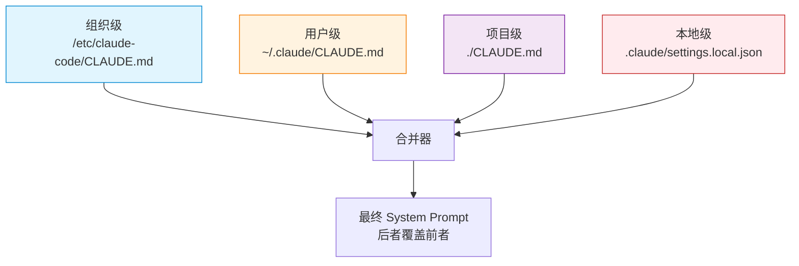

**Settings 的合并策略**

Settings 的合并不是简单拼接,而是**分层覆盖**:

| 配置类型 | 覆盖策略 | 典型配置项 |
|---------|---------|-----------|
| **CLAUDE.md** | 后者覆盖前者(组织→用户→项目) | System Prompt 内容 |
| **permissions.allow** | 并集(所有层级都生效) | Bash 白名单 |
| **permissions.deny** | 并集(所有层级都生效) | Bash 黑名单 |
| **hooks** | 按事件类型合并(同事件多个 hook 并行) | PreToolUse/PostToolUse |
| **model** | 后者覆盖前者 | 使用的模型 |
| **skills** | 并集(所有层级都加载) | 预加载 Skill 列表 |

**Settings 的上下文管理影响**

Settings 的三级覆盖决定了 System Prompt 的**稳定性**:

| 稳定性层级 | Settings 来源 | Prompt Cache 影响 |
|----------|-------------|------------------|
| **最稳定** | 组织级(IT 部署) | Cache 前缀极稳定 |
| **较稳定** | 用户级(跨项目) | Cache 前缀跨项目复用 |
| **项目稳定** | 项目级(进 Git) | Cache 前缀项目内复用 |
| **不稳定** | 本地级(不进 Git) | Cache 可能失效(本地改动) |

设计意图:**把最通用的规则放最高层级(组织/用户),保证 Cache 前缀稳定;把项目特有的规则放项目级,允许团队定制。**

---

## 设计模式库:从 Claude Code 抄架构决策

读完前面十二个映射,你应该能回答"看到 Claude Code 的某项功能,能立刻定位它在循环的哪一步生效"。

现在把所有映射抽象成**可复用的设计模式**——当你自己造 Agent 时,能直接用。

### 模式一:上下文隔离的三种模式

| 模式 | 适用场景 | 实现方式 | Claude Code 例子 |
|------|---------|---------|-----------------|
| **子 Agent 隔离** | 单个深度任务,中间过程不值得保留 | fork 独立循环,结果摘要回传 | Explore / general-purpose |
| **代理团队隔离** | 多 Agent 协作,需要互相验证 | 多循环并行 + 共享任务列表 | Agent Teams |
| **动态工作流隔离** | 大规模任务(500 文件级),需要确定性编排 | 脚本编排 + 子 Agent 池 | Workflow |

### 模式二:上下文管理的四策略

| 策略 | 核心思想 | Claude Code 实现 |
|------|---------|-----------------|
| **Write** | 把信息写到上下文之外 | PLAN.md/TODO.md(外部化状态) |
| **Select** | 把相关信息检索回来 | Auto Memory 按需加载、Rules 条件性加载 |
| **Compress** | 压缩上下文 | `/compact`、SummarizationMiddleware |
| **Isolate** | 隔离上下文 | 子 Agent、代理团队、动态工作流 |

### 模式三:退出条件的五种判断

| 判断方式 | 优先级 | Claude Code 实现 |
|---------|--------|-----------------|
| **用户中断** | 最高 | Ctrl+C、`/stop` |
| **硬护栏** | 高 | MaxIterations、TokenBudget、Timeout |
| **LLM 判断** | 中 | 无 tool_calls 输出 |
| **外部条件判断** | 中 | Goal(Stop hook + Haiku 评估) |
| **时间判断** | 低 | Loop(Cron 调度 + TTL) |

### 模式四:System Prompt 的分层管理

| 层级 | 作用域 | 稳定性 | Claude Code 实现 |
|------|--------|--------|-----------------|
| **组织级** | 所有用户、所有项目 | 极稳定(IT 部署) | `/etc/claude-code/CLAUDE.md` |
| **用户级** | 单用户、所有项目 | 较稳定(个人偏好) | `~/.claude/CLAUDE.md` |
| **项目级** | 单项目、所有成员 | 项目稳定(进 Git) | `./CLAUDE.md` |
| **Rule 级** | 特定文件类型 | 动态加载 | `.claude/rules/*.md` |
| **Skill 级** | 特定任务触发 | 按需加载 | `.claude/skills/*/SKILL.md` |

### 模式五:工具调用的可靠性保障

| 保障方式 | 作用阶段 | Claude Code 实现 |
|---------|---------|-----------------|
| **参数校验** | Act 阶段前 | `safe_tool_call`、工具 Schema 定义 |
| **权限控制** | Act 阶段前 | `permissions.allow/deny`、PreToolUse hook |
| **错误隔离** | Act 阶段 | 工具异常捕获、ToolMessage(status="error") |
| **Recovery Hints** | Observe 阶段 | 错误注入、RecoveryManager |
| **死循环检测** | Observe 阶段后 | System Reminders、连续失败指纹检测 |

---

## 总结:Claude Code 不是黑盒,是 Agent 理论的参考实现

把全文十二个映射浓缩成一句话:**Claude Code 的每项功能,都是 Agent Loop + 上下文管理的具体实现。**

当你自己造 Agent 时,不需要从头设计:

- 需要上下文隔离 → 抄子 Agent / 代理团队 / 动态工作流
- 需要上下文压缩 → 抄 `/compact` + Compactor
- 需要长期记忆 → 抄 Auto Memory + 分层检索
- 需要确定性约束 → 抄 Hook + Settings 三级覆盖
- 需要退出控制 → 抄 Goal/Loop 的外部条件判断

Claude Code 不是炫技,是把 Agent 理论的所有关键问题(上下文爆炸、循环失控、退出判断、工具可靠性、长期记忆)都解决了一遍,并且给出了生产级的实现。

**把它当教科书拆,比读 10 篇 Agent 综述都有用。**

---

## 相关阅读

- [Claude Code 用户视角使用篇](./agent-claude-code-user-perspective.md) —— 本篇的姊妹篇,从用户能看到什么出发
- [Agent Loop 循环设计篇](./agent-loop-design.md) —— 循环的理论框架与原始代码实现
- [上下文管理篇](./agent-context-management.md) —— 上下文的理论框架与分层管理
- [工具调用篇](./agent-tool-calling.md) —— 工具的本质与可靠性设计
- [MCP 与 Skill 设计篇](./agent-mcp-skill-design.md) —— Skill 与 MCP 的设计原理