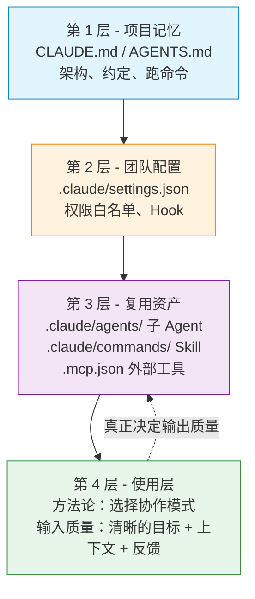
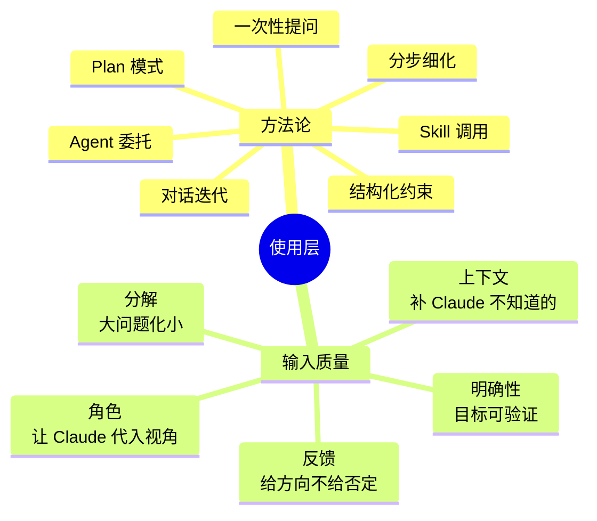
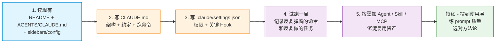

# Claude Code 项目级集成篇

上一篇 ([Claude Code 用户视角使用篇](./agent-claude-code-user-perspective.md)) 把 Claude Code **当产品拆开** —— 从用户视角看 `~/.claude/` 目录结构、各能力的位置与协同。

这一篇反过来 —— 讲**怎么把 Claude Code 接到一个新项目里**，让 Claude 真正成为这个项目的"长期协作者"，而不是每次都从零开始。

目标读者：

- 接手一个新项目、要让 Claude Code 立刻 productive 的工程师
- 想给团队建一套"Claude Code 接入规范"
- 想搞清楚 `.claude/` 目录到底该放什么的任何人

> **本文的核心观点**：Claude Code 的项目集成不是"配完就完事"，**配置只是门槛，使用层才是真正的杠杆**。CLAUDE.md / settings.json / Hooks / Skills / Agents / MCP 全部加起来，都只是让 Claude "能干活"；让它"干得好"的是你选择的方法论；让它"干成什么样"的最终决定因素是**你的输入质量**。本文的篇幅大半在讲前三层配置，但请记住 —— 真正值得长期投入的，是第四层。

---

## 先建立坐标系：项目集成的四个层次

Claude Code 的项目级集成可以分**四个层次**，前三个是配置层，第四个是使用层：



**关键判断**：这四层**投入产出比完全不同** ——

| 层级 | 一次成本 | 长期收益 | 边际收益 |
|------|---------|---------|---------|
| 第 1 层 | 写 CLAUDE.md，约 30 分钟 | 每次新会话立刻有上下文 | 写完即稳态，**递减** |
| 第 2 层 | 调权限 + 写 Hook，约 1 小时 | 减少每次会话的弹窗 | 加一条 Hook 边际成本固定，**快速递减** |
| 第 3 层 | 按场景攒 Skill / Agent | 团队"工具箱"沉淀 | 单个 Skill 复用价值有限，**递减** |
| 第 4 层 | 持续练习写好 prompt / 选对方法论 | **真正决定每次对话的输出质量** | **持续递增**（人的判断力是复利） |

**反直觉的一点**：前 3 层是**必要条件**（不做 Claude 干不了活），但不是**充分条件**。同样一套配置，新手和老手用出来天差地别 —— 差别几乎完全在第 4 层。

新项目**先做第 1 层**就能解锁 80% 的"可干活"价值；**剩余的时间和精力，应该至少有 50% 投到第 4 层**。这是本文最想传达的一句话。

---

## 第 1 层：项目记忆（CLAUDE.md）

### 1. CLAUDE.md vs AGENTS.md vs README.md

这三份文件内容会重叠，但**目标读者不同**：

| 文件 | 给谁看 | 进 git | 典型内容 |
|------|--------|--------|----------|
| `README.md` | 人（新成员、用户） | ✅ | 项目介绍、快速开始、部署 |
| `CLAUDE.md` | Claude（自动加载） | ✅ | 架构、约定、跑命令、禁区 |
| `AGENTS.md` | 跨 Agent 工具（Cline、Aider、Cursor） | ✅ | 与 CLAUDE.md 几乎一致 |

**实操建议**：

- 如果团队只用 Claude Code：直接写 `CLAUDE.md`
- 如果团队混用多种 AI 工具：**写一个、用 symlink 同步另一个**（`ln -s CLAUDE.md AGENTS.md`）或者 CI 里跑同步脚本

### 2. CLAUDE.md 该写什么、不该写什么

**应该写**（高信号、低重复）：

- **架构**：模块怎么划分，关键目录的职责
- **关键约定**：命名、错误处理、日志规范
- **跑命令**：dev / build / test / lint 的精确命令
- **禁区**：不能改的路径、需要审批的操作
- **调试入口**：日志在哪、metrics 在哪、常见问题排查路径

**不该写**（容易腐烂或误导）：

- ❌ "提供友好错误信息" —— AI 已经知道
- ❌ "给每个工具写单测" —— 通用建议，没价值
- ❌ "不要在 commit 里写密钥" —— 这是默认常识
- ❌ 文件结构全列 —— `ls` 就能看到，会过时
- ❌ 详细的 API 文档 —— 应该写在代码注释或专门的 docs/

**判断口诀**：每条规则问自己 —— **"如果 Claude 不知道这条，会犯什么具体错误？"** 想不出来就别写。

### 3. 模板

CLAUDE.md 的完整模板（项目级 + 用户级）见上一篇 [§ 5.1 类型一/二](./agent-claude-code-user-perspective.md#51-claudemd-的四个作用域)。项目级模板的核心结构：

```markdown
# CLAUDE.md

This file provides guidance to Claude Code (claude.ai/code) when working with code in this repository.

## Architecture
- `src/api/` —— HTTP handlers
- `src/domain/` —— 业务逻辑（无外部依赖）
- `src/infra/` —— 数据库 / 外部 API 适配
- 跨层调用通过 `src/di/` 的容器注入，不要直接 import

## Conventions
- 命名：文件名 snake_case，类 PascalCase
- 错误：领域错误用 `DomainError` 子类，不要直接抛字符串
- 日志：用 `pkg/logger`，禁止 `fmt.Println`

## Commands
- Dev：`make dev`（启动本地服务 + DB）
- Test：`make test`（单测）/ `make test-int`（集成测试，需本地 DB）
- Lint：`make lint`
- Build：`make build`

## Don'ts
- 不要直接改 `migrations/` 下的旧文件，新加一个新文件
- 不要在 `src/domain/` 里 import 任何 `src/infra/`
- 不要 commit 任何 `.env*` 文件

## Debugging
- 日志：`/var/log/app/app.log`
- Metrics：`http://localhost:9090/metrics`
- 常见 5xx 排查：先看 `pkg/middleware/recover.go` 的 panic handler
```
### 4. 自动加载 vs 手动加载

Claude Code **启动时自动加载** `CLAUDE.md`（项目根目录）和 `~/.claude/CLAUDE.md`（个人全局）。

更细粒度：可以在子目录里放 `CLAUDE.md`，Claude 进入该目录时会自动叠加。但**默认推荐只在根目录放一份**，子目录覆盖会增加维护成本。

---

## 第 2 层：团队配置（.claude/settings.json）

CLAUDE.md 是"告诉 Claude 怎么做"，settings.json 是"约束 Claude 能做什么"。

### 1. 三级 Settings 的取舍

四级 settings 的覆盖关系图见上一篇 [§ 维度十一](./agent-claude-code-user-perspective.md#维度十一settings-的四级覆盖)。本文只讲**项目集成时的判断口诀**：

- **团队约束**（共享权限白名单、强制 Hook）→ `.claude/settings.json`
- **个人偏好**（自定义 model、statusline 脚本、试用中的功能开关）→ `.claude/settings.local.json`
- **跨项目习惯**（shell 别名、UI 主题）→ `~/.claude/settings.json`

⚠️ **必须做的事**：把 `.claude/settings.local.json` 加进 `.gitignore`，否则会泄露个人配置。

### 2. 权限白名单

详见上一篇笔记的 [权限系统章节](./agent-claude-code-user-perspective.md#维度十权限系统减少弹窗的核心机制)。这里只说**项目集成的最小集**：

```json
{
  "permissions": {
    "allow": [
      "Bash(make test*)",
      "Bash(make lint*)",
      "Bash(make build*)",
      "mcp__github__list_pulls",
      "mcp__github__create_issue"
    ]
  }
}
```

**写权限白名单的三个原则**：

1. **只加团队真的会用的高频只读命令**。Claude Code 已经自动放行了 `grep`/`find`/`git status` 等 90% 的常用命令，别重复加。
2. **永远不要加解释器 / 包执行器的通配符**（`Bash(python*)`、`Bash(npm run *)`），精确形式如 `Bash(make test)` 是 OK 的。
3. **危险操作加 `ask` 或 `deny`**，让 Claude 必须弹窗确认：

   ```json
   {
     "permissions": {
       "deny": ["Bash(rm -rf *)"],
       "ask":  ["Bash(git push *)", "Bash(git reset --hard*)"]
     }
   }
   ```

### 3. 关键 Hook

Hook 是**对 Agent 透明**的自动化 —— Claude 不知道 prettier 跑了，只知道"文件被写完了"。

新项目最值得先加的几条 Hook：

```json
{
  "hooks": {
    "PostToolUse": [
      {
        "matcher": "Edit|Write",
        "hooks": [
          { "type": "command", "command": "prettier --write \"$CLAUDE_FILE_PATHS\"" }
        ]
      }
    ],
    "Stop": [
      {
        "matcher": "*",
        "hooks": [
          { "type": "command", "command": "scripts/post-session-cleanup.sh" }
        ]
      }
    ]
  }
}
```

**集成时容易踩的坑**：

- Hook 命令路径用**绝对路径**或**相对于项目根的相对路径**，不要依赖 `cwd`
- 在 Windows 上注意路径分隔符；Git Bash 环境下用 `/` 即可
- 如果 Hook 失败，不要让它阻塞 Claude —— 用 `|| true` 兜底，或者在 Hook 脚本里 `exit 0`

---

## 第 3 层：复用资产（agents / commands / mcp）

这一层是把"团队的领域知识"沉淀成可复用的资产。

### 1. 什么时候建子 Agent（`.claude/agents/`）

**判断标准**：这个任务**会反复出现**，并且**有明确的输出格式/质量标准**。

反例：

- ❌ "帮我跑测试" —— 这是临时任务，不需要 Agent
- ❌ "修一下这个 bug" —— 太个性化，复用价值低

正例：

- ✅ "审查 PR diff" —— 团队每次都需要，输出格式固定
- ✅ "扫描代码找 XSS 漏洞" —— 明确的检查清单
- ✅ "把 SQL 转成 ORM 调用" —— 机械重复，规则明确

**最小可用模板**：

```markdown
<!-- .claude/agents/code-reviewer.md -->
---
name: code-reviewer
description: 审查当前 diff 的可读性、性能、安全问题。PR 前自查或重构后验证时调用。
tools: Read, Grep, Glob, Bash
model: sonnet
---

你是只读的代码审查 agent：
- 按"严重性 / 文件:行号 / 问题 / 建议"格式输出
- 不修改任何文件
- 不寒暄、不总结
```

详见上一篇的 [维度三](./agent-claude-code-user-perspective.md#维度三子-agent-系统内置--自定义)。

**关键安全原则**：调研类 Agent 一定要**限定只读工具集**（`tools: Read, Grep, Glob`），不给 Bash/Edit。这是防止 Agent 误删文件的最简手段。

### 2. 什么时候建 Skill（`.claude/commands/`）

**判断标准**：用户**会主动**反复触发它，并且每次的输入是固定的"格式 / 路径 / 上下文"。

反例：

- ❌ "把这个文件翻译成英文" —— 用户每次想翻译的目标不同，不如让 Claude 主对话做
- ❌ "生成 API 文档" —— 应该做成 CI 自动生成

正例：

- ✅ "/review-daily" —— 团队每天要跑的日检
- ✅ "/deploy-staging" —— 用户主动触发，需要确认清单

**Skill vs Agent 的取舍**：

| 维度 | Skill（`commands/`） | Agent（`agents/`） |
|------|---------------------|--------------------|
| 触发方式 | 用户输入 `/xxx` | Claude 按 description 自动派发 |
| 上下文 | inline 进主 Agent | fork 独立上下文 |
| 适用场景 | 重复动作、确认清单 | 深度调研、独立思考 |

### 3. 什么时候加 MCP Server（`.mcp.json`）

**判断标准**：团队**高频依赖某个外部服务**，并且 Claude Code 自带的工具不够用。

新项目最常见的 MCP：

- `github` —— PR / Issue / Actions（团队协作流）
- `filesystem` —— 跨目录读文件（Docusaurus 这种多目录文档站特别需要）
- `postgres` / `sqlite` —— 直接查数据库（数据分析）
- `slack` —— 团队通知
- `puppeteer` —— 浏览器自动化（E2E 测试场景）

**项目级 vs 用户级**：

| 位置 | 作用域 | 何时用 |
|------|--------|--------|
| `.mcp.json`（项目根） | 团队共享，进 git | 项目流程强依赖（GitHub、CI DB） |
| `~/.claude.json` 的 `mcpServers` | 个人全局 | 个人工具偏好（个人 Slack workspace） |

**最小配置**（GitHub 为例）：

```json
{
  "mcpServers": {
    "github": {
      "command": "npx",
      "args": ["-y", "@modelcontextprotocol/server-github"],
      "env": { "GITHUB_TOKEN": "${GITHUB_TOKEN}" }
    }
  }
}
```

⚠️ **不要把 token 明文写进 `.mcp.json`**。用环境变量占位符 `${GITHUB_TOKEN}`，每个开发者本地自己 export。

---

## 第 4 层：使用层（真正决定输出质量的那一层）

前三层是"配置层"—— 决定 Claude 能不能干活。这一层是"使用层"—— 决定 Claude 干得**好不好**、**多准**、**多快**。

使用层又分两部分：



### 1. 方法论：不同问题用不同协作模式

**核心观点**：没有银弹方法论，**只有匹配问题的方法论**。

主流协作模式（按问题类型分）：

| 方法论 | 适用问题 | 关键特征 |
|--------|----------|----------|
| 一次性提问 | 小问题、查询、解释 | 短 prompt，期望短回答 |
| 分步细化 | 中等复杂任务 | "先给我 X，我看完再决定下一步" |
| 结构化约束 | 已知规则的重复任务 | "按 [格式] 输出 [X]" |
| 对话迭代 | 模糊需求的探索 | 多轮对话，逐步收敛 |
| Agent 委托 | 调研类、扫描类 | "用 Explore 子 agent 扫一下" |
| Plan 模式 | 实现类、设计类 | 先看方案，approve 后执行 |
| Skill 调用 | 团队复用的固定动作 | `/review` / `/commit` |

**怎么选？问自己三个问题**：

```
Q1: 我已经知道答案长什么样吗？
   - 知道 → 一次性提问 / 结构化约束
   - 不知道 → 进入 Q2

Q2: 这是探索还是实现？
   - 探索 → 对话迭代 / Agent 委托
   - 实现 → 进入 Q3

Q3: 实现路径明确吗？
   - 明确 → 直接让 Claude 干
   - 不明确 → Plan 模式
```

### 2. 输入质量：决定一切的胜负手

（在 393 行删除输入质量论断 — 已有 intro + layer table 承载）

#### 高质量输入的 5 个维度

| 维度 | 关键问题 | 错误示例 | 改进示例 |
|------|----------|----------|----------|
| **明确性** | 目标可被验证吗？ | "帮我优化这段代码" | "把 time complexity 从 O(n²) 降到 O(n)，不改变 API 签名" |
| **上下文** | 给了 Claude 它不知道的？ | 把 README 全文塞进 prompt | "看 CLAUDE.md 第 2 节，我们要加新功能 X" |
| **分解** | 任务粒度合适吗？ | "帮我写用户管理 CRUD" | "分三步：1) domain model + 单元测试 2) Repository 3) HTTP handler" |
| **反馈** | 错的时候反馈具体吗？ | "不对，重来" | "你说的 X 错了（正确是 Y，来自 doc/...）。Z 部分我没说清楚 — 我想的是 W" |
| **角色** | 给了视角和输出格式吗？ | "写段 API 文档" | "你是 API 文档撰写者，输出会被自动化测试解析，必须用 OpenAPI 3.0 YAML" |

#### 关键判断口诀

写完 prompt 之后问自己：**"如果 Claude 完全按字面意思理解，能不能给出让我满意的答案？"** 不能就补明确性。

#### 学会"引用而不是粘贴"

- ❌ 把 CLAUDE.md 全文复制到 prompt
- ✅ "看 CLAUDE.md 第 X 节"
- ❌ 把错误日志完整粘进 prompt
- ✅ "运行时 panic，关键 stack 在第 3 行（已贴在下方），完整日志在 `app.log` 第 1234 行附近"

引用让 Claude 自己去读，**省你的输入时间 + 省 Claude 的上下文窗口**。

#### 反馈要给方向

Claude 答错时给"否定 + 正确方向 + 原因"，不要只给否定。**Claude 没法从"不对"里学到东西**。

### 3. 配置层 vs 使用层的边界判断

不是所有问题都该走"提升输入质量"这条线。判断原则：

| 频率 | 通用性 | 该投到哪 |
|------|--------|----------|
| 高 | 高 | **配置层**（沉淀成 Skill / Agent） |
| 高 | 低 | **使用层**（每次写好 prompt） |
| 低 | 高 | **配置层**（写到 CLAUDE.md） |
| 低 | 低 | 一次性任务，简单 prompt 即可 |

**反模式**：把低频低通用性的任务硬抽成 Skill —— 维护成本 > 复用收益。

### 4. 自我审计：你现在该投到哪？

拿最近 10 个跟 Claude 的对话，逐条问：

- 我的 prompt 能被验证吗？（明确性）
- Claude 需要的背景我给了吗？（上下文）
- 任务粒度合适吗？（分解）
- 错的时候反馈具体吗？（反馈）
- 给了视角和输出格式吗？（角色）

**如果多数都答不上来**：先在**输入质量**上花两周，再考虑加 Skill / Agent。
**如果输入质量已经稳定**：可以考虑沉淀到 Skill / Agent，复用你的好 prompt。

### 5. 三周训练计划

**第 1 周：明确性**
- 每个任务写成"可验证目标"
- 跑完后看哪条 prompt 真的能验证、哪条还在"模糊"

**第 2 周：上下文**
- 学会"引用而不是粘贴"
- 学会"区分 Claude 知道 vs 不知道" —— 给背景时只给必要的

**第 3 周：反馈**
- 错的时候给具体方向（"X 应该改成 Y，因为 Z"）
- 连续 3 次不满意时，停下来反思 prompt，而不是继续要求 Claude 改

**建立"prompt 习惯"而不是"prompt 库"**：

- ❌ 收集一堆"好 prompt 模板" → 套用时容易脱离实际
- ✅ 形成"好 prompt 的判断力" → 每个新场景自己写合适的

---

## 集成流程：五步上手一个新项目

按这个顺序接入一个新项目，能避免大多数坑：



> **关键提醒**：第 1-5 步是"配置层"，一次性投入。**第 6 步（持续投到使用层）才是长期主线**。很多人做完第 1-5 步就以为"集成完了"，其实真正的工作才刚开始。

### 第 1 步：读现有

不要急着写文件。先读：

- `README.md` —— 项目做什么、怎么跑
- `AGENTS.md` 或 `CLAUDE.md`（如果有）—— 前人沉淀的约定
- 顶层配置（`package.json` / `pyproject.toml` / `Cargo.toml`）—— 技术栈和脚本

### 第 2 步：写 CLAUDE.md

花 30 分钟写一份**精简版** CLAUDE.md，覆盖：

- 架构（每个顶层目录的职责）
- 关键约定（命名、错误处理、日志）
- 跑命令（dev / test / lint / build 的精确命令）
- 禁区（不能动的路径 / 文件）

不要追求完美 —— **第一版够用就好**，后续迭代。

### 第 3 步：写 .claude/settings.json

只放两类东西：

- **权限白名单**：团队高频只读命令
- **关键 Hook**：格式化、提交前检查

不要在第一版就堆一堆 Hook —— 每加一条都增加维护成本。

### 第 4 步：试跑一周

把 Claude Code 当日常工具用一周，**记下反复弹窗的命令**和**反复做的任务**。

反复弹窗的命令 → 加入权限白名单
反复做的任务 → 写成 Skill 或 Agent
反复需要查的外部服务 → 接入 MCP

### 第 5 步：按需沉淀

**不要预先设计 10 个 Skill / Agent**。需求没出现之前都是过度设计。

按"出现频次 × 复用价值"排序，每两周评估一次：

- 一个 Skill 一个月用不到 3 次 → 删
- 一个 Agent 写完后再没用过 → 删

---

## 团队上规模：从单人配置到团队规范

一个人用 Claude Code，跟团队一起用，需要考虑的事不一样：

### 1. 单人配置 → 团队约定的迁移

| 单人 | 团队 | 迁移方式 |
|------|------|----------|
| `.claude/settings.local.json` 里写的偏好 | 哪些该进 `.claude/settings.json`？ | 跟团队成员对齐哪些是"团队规范"，哪些是"个人偏好" |
| 临时跑的 Hook 脚本 | 是否值得固化？ | 一个月还在用 → 进 `scripts/hooks/`，进 git |
| 个人建的 Skill | 是否全团队需要？ | 高频通用 → 进 `.claude/commands/`；个人专属 → 留在 `~/.claude/commands/` |

### 2. 团队约定的最小集

新成员入职第一天，应该能**通过 `CLAUDE.md` + `.claude/settings.json` + `.claude/agents/` + `.claude/commands/` 直接 productive**，不需要任何人讲解"我们用 Claude 的哪些命令"。

**实操**：把"Claude Code 的使用规范"放进 `ONBOARDING.md` 或 `CONTRIBUTING.md`，新成员走通用 onboarding 流程时自然就吸收了。

### 3. 维护节奏

| 频率 | 动作 |
|------|------|
| 每周 | 翻 `CLAUDE.md`，删过时内容、补新约定 |
| 每月 | 清理不用的 Skill / Agent |
| 每季度 | 检查权限白名单是否还合理，Hook 是否还在生效 |

---

## 反模式：常见的过度集成

新项目接入时容易踩的几个坑，提前避开：

### 0. ❌ 还没练好输入质量就堆配置

**这是最常见的反模式**。很多人在 prompt 写得很差的情况下，寄希望于"加个 Agent / Skill 解决"。

但 Skill 本质就是"一段 prompt"。**你的 prompt 能力就是写 Skill 的能力**。如果主对话里写不好 prompt，写成 Skill 也救不了你。

**判断**：每次 Claude 的输出不满意时，先反思 prompt，再考虑加配置。

### 1. ❌ 一开始就堆 10 个 Agent

Agent 应该是"**需求验证后**"的产物，不是"可能用到"的预防性配置。每个 Agent 都是长期维护成本。

### 2. ❌ 把 README 当 CLAUDE.md 用

README 是给**人**看的（外部用户、新成员）。CLAUDE.md 是给**AI**看的（架构、约定、禁区）。混在一起会导致内容互相污染。

### 3. ❌ 把 Hook 写得太复杂

Hook 是无状态的 shell 命令，不应该装业务逻辑。复杂逻辑应该写成 MCP 工具、Skill 或子 Agent。

### 4. ❌ 权限白名单放得太宽

`Bash(npm *)` 看起来方便，等于允许 Claude 跑任何 npm 命令（包括 `npm publish`）。精确到 `Bash(npm test)`。

### 5. ❌ 把 `.claude/settings.local.json` 提交进 git

这会泄露每个开发者的个人配置（model 选择、statusline 脚本、实验性功能开关）。第一时间加进 `.gitignore`。

### 6. ❌ 写了一份"百科全书"式 CLAUDE.md

CLAUDE.md 是**上下文预算**的一部分 —— 越长，每次对话的可用空间越少。控制在 100-200 行以内，只写"不写就会犯大错"的内容。

---

## 集成清单（Checklist）

把本文压缩成一张可勾选的清单：

**第一周（必做，配置层）：**

- [ ] 写一份精简 `CLAUDE.md`（架构 + 约定 + 跑命令 + 禁区，< 200 行）
- [ ] 创建 `.claude/settings.json`，加团队高频只读命令的白名单
- [ ] 跑通 `npm test` / `npm run build` 等关键命令，验证 CLAUDE.md 写的是对的

**第一个月（按需，配置层深化）：**

- [ ] 记录反复弹窗的命令，补进白名单
- [ ] 记录反复做的任务，沉淀成 Skill 或 Agent
- [ ] 加 1-2 条关键 Hook（格式化、提交前检查）
- [ ] 接入项目强依赖的 MCP（如 GitHub）

**持续投入（使用层 —— 真正的主线）：**

- [ ] 每周复盘 2-3 次"哪些 prompt 让 Claude 输出特别好 / 特别差"
- [ ] 每月把"反复用的好 prompt"沉淀成 Skill（从使用层回到配置层）
- [ ] 每月把"反复跑的方法论"写成团队内部经验帖
- [ ] 持续练习：明确性 / 上下文 / 分解 / 反馈 / 角色 5 个维度的判断力
- [ ] 季度自审：最近 10 次不满意输出，是 prompt 问题还是配置问题？

**持续维护：**

- [ ] 每月清理不用的 Skill / Agent
- [ ] 季度检查权限白名单和 Hook
- [ ] 团队新成员入职时同步更新 ONBOARDING.md

> **精力分配建议**：配置层任务每周 1-2 小时，**剩余时间投到使用层**。配置是门槛，使用是主线。

---

## 一句话总结

> **配置让 Claude 能干活，方法论让 Claude 干得好，输入质量决定 Claude 干成什么样。**
>
> 配置层 20%（一次性）+ 方法论 30%（持续练习）+ 输入质量 50%（每天都在用）。
>
> 不要追求一开始就完美集成 —— **先让它能干活，再让它干得更好，最后让它干成你要的样子**。最后那一步靠的不是配置，是你的判断力和 prompt 能力。

---

## 相关阅读

- [Claude Code 用户视角使用篇](./agent-claude-code-user-perspective.md) —— 上一篇，从用户视角拆解 `~/.claude/` 目录结构与各能力的协同
- [MCP 与 Skill 设计篇](./agent-mcp-skill-design.md) —— Skill 设计原理的深入解析
- [Agent Loop 循环设计篇](./agent-loop-design.md) —— 主循环机制，理解 Hook 为什么"对 Agent 透明"
- [工具调用篇](./agent-tool-calling.md) —— 工具的本质，理解 MCP 工具的注册逻辑
- [上下文管理篇](./agent-context-management.md) —— CLAUDE.md 的长度预算参考
- [AI 工具使用方式的阶段复盘](./ai-coding-learning-method-stage-review.md) —— 学习方法论层面的复盘