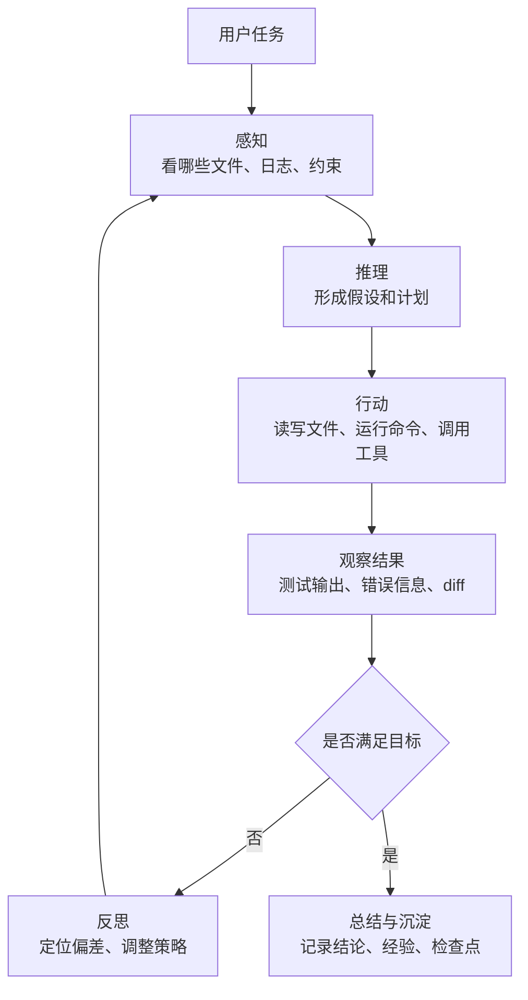
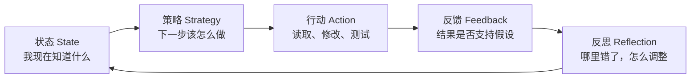
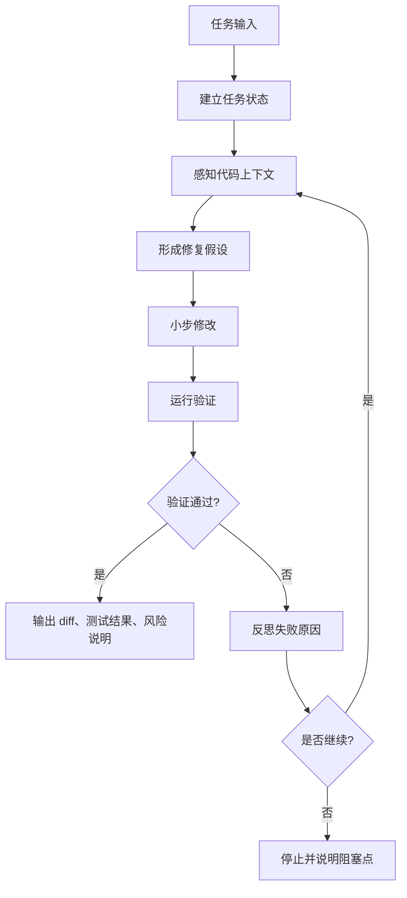

# 建立 Agent 设计模式元认知

最近看 Agent 设计模式相关资料时，我逐渐意识到一个问题：很多时候我不是缺少概念，而是缺少一套能把概念放对位置的判断框架。

比如一谈到 Agent，很容易马上进入这些词：

- ReAct
- Tool Use
- Memory
- Reflection
- Multi-Agent
- Workflow
- MCP
- Context Engineering
- Agent Harness

这些词都重要，但如果只是把它们当成概念清单去记，最后还是会乱。

真正需要建立的不是“我知道多少 Agent 名词”，而是：

> 当我看到一个 Agent 系统时，我能不能判断它在解决哪类工程问题？  
> 当我看到一个设计模式时，我能不能判断它应该落在系统的哪一层？  
> 当我看到一个 coding agent 时，我能不能拆清楚它是怎么感知、怎么决策、怎么行动、怎么反思的？

这篇文章不是要总结某一个框架，也不是要复述某一套模式名词。

它更像一次元认知整理：我想先把 Agent 设计模式背后的几个核心问题想清楚，尤其是放到 AI Coding 场景里，看一个代码 Agent 到底应该怎么被分析。

## 真正的变化：决策权从代码转移到了运行时

传统软件系统里，大部分关键决策是在设计阶段完成的。

工程师写好分支，定义好策略，规定好流程。运行时只是按规则执行。

比如一个传统代码修复流程，可能是：

```plain
用户提交问题
  -> 根据错误类型选择处理器
  -> 读取固定日志
  -> 执行固定诊断脚本
  -> 输出修复建议
```

这里的控制流基本是工程师写死的。

但 Agent 不一样。

一个 coding agent 修 bug 时，它可能先 grep，发现线索不够；再 read 文件，形成假设；再跑测试，被失败结果打脸；再换一个假设；再沿着调用链继续搜索；最后改代码、跑测试、总结结果。

这不是一条设计期写死的流程。

这是模型在运行时根据“我现在看到了什么”动态决定下一步。

参考资料里有一句判断很关键：GoF 时代是编译期决策 + 运行时执行；Agent 时代是运行时决策 + 运行时执行。

这句话落到 coding agent 上，就是：

> 工程师不再只是写流程，而是在设计一个能约束模型动态决策的运行时。

所以 Agent 设计模式的重点，不是又发明一批新名词，而是回答一个新问题：

> 当一部分决策权交给模型以后，系统怎么让这些决策稳定、可控、可复盘？

这就是 Harness 的意义。

## Agent Harness 才是 coding agent 的主体

很多人看 coding agent，第一反应是看模型能力。

模型能不能读懂代码？能不能写 patch？能不能修测试？能不能理解大型仓库？

这些当然重要，但它们只是入场券。

真正决定 coding agent 能不能进入工程流程的，是模型周围的 Harness：

- 它怎么构造上下文
- 它怎么选择工具
- 它怎么记录状态
- 它怎么处理失败
- 它怎么限制权限
- 它怎么让修改可审计
- 它怎么把一次经验沉淀到下一次

如果没有 Harness，模型只是一个聪明的代码生成器。

有了 Harness，模型才被放进了一个可以行动、可以回滚、可以复盘、可以治理的工程轨道。

可以把 coding agent 的运行时先简化成这样：



这张图里，模型不是简单地从输入生成输出。

它是在一个循环里不断感知、推理、行动、观察、反思。

因此，coding agent 的设计重点不是“让模型一次写对”，而是“让模型写错之后能被系统拉回来”。

## 看 coding agent，先看五条主线

参考《逆向五步法》里有一个很实用的判断：读 Agent 框架源码，不要被 README 和关键词带着走，要先知道一个 Agent Harness 理论上应该长什么样。

放到 coding agent，我现在会先看五条主线。

### 第一，主循环

主循环是 Agent 的心脏。

它负责把一次任务推进成多轮循环：

```plain
用户输入
  -> 构造上下文
  -> 调用模型
  -> 解析模型输出
  -> 分发工具
  -> 收集观察结果
  -> 更新状态
  -> 决定继续还是停止
```

如果看不清主循环，就看不清这个 Agent 是怎么工作的。

很多项目 README 写得很热闹：支持工具调用、支持多 Agent、支持记忆、支持 MCP。可是只看功能清单没有用。真正要问的是：

- 谁决定下一轮要不要继续？
- 工具结果怎么回到模型上下文？
- 测试失败以后是重试、换策略，还是直接结束？
- 用户中途打断时，状态如何处理？
- 一次任务结束的标准是什么？

主循环回答的是：这个 Agent 如何一轮一轮推进。

### 第二，上下文装配

coding agent 最容易失败的地方，不是不会写代码，而是没看对代码。

一个仓库可能有几千个文件，模型不可能全看。它必须决定：先看什么，后看什么，哪些只看摘要，哪些必须精读。

这就是感知问题。

参考资料里有一句话很重要：感知是在找出“使下一次推理质量最大化的最小高信号 token 集合”。

放到 coding agent 上，就是：

- 不要一上来把整个仓库塞进去
- 先看目录结构、README、入口文件、错误日志
- 再沿着符号、调用链、测试失败点逐步深入
- 对无关文件、历史噪声、低价值日志做降噪
- 对长任务历史做压缩，但不能压掉关键证据

好的 coding agent 不只是会 grep。

它应该像工程师一样，先建立仓库地图，再沿着线索深入。

这也是为什么 repo map、LSP、diagnostics、symbol reference 这些能力很关键。grep 告诉你字符串在哪里，LSP 告诉你符号真正指向哪里。对代码 Agent 来说，语言服务器就是一种更高级的感知器官。

### 第三，工具系统

coding agent 的行动能力来自工具。

它能读文件、改文件、跑测试、查 git diff、执行命令、调用浏览器、访问 issue 或 PR 信息。

但工具不是越多越好。

工具越多，行动空间越大，错误空间也越大。

所以工具系统要回答三个问题：

- 这个 Agent 有哪些工具？
- 什么情况下应该调用哪个工具？
- 哪些工具需要权限、确认或隔离？

一个能改代码的 Agent，如果没有工具边界，本质上就是一个会写 shell 的不确定执行器。

真正的工程设计不是“让它什么都能干”，而是让它知道：

- 读操作和写操作不同
- 本地测试和生产操作不同
- 普通命令和破坏性命令不同
- 自动执行和人工确认不同
- 沙箱环境和真实环境不同

工具系统回答的是：模型能对世界产生多大影响。

### 第四，状态和事件记录

coding agent 做的不是一次性问答，而是长任务。

长任务一定会有状态。

它至少需要知道：

- 当前任务目标是什么
- 已经看过哪些文件
- 形成过哪些假设
- 哪些假设被测试推翻了
- 改过哪些文件
- 跑过哪些命令
- 哪些测试通过了，哪些失败了
- 当前还剩什么没验证

如果这些状态只存在模型上下文里，就很脆。

上下文会膨胀，会被压缩，会丢信息，也会被新信息冲淡。

所以 coding agent 需要事件记录，类似一条任务账本：

```plain
read src/cache.py
hypothesis race condition
run pytest tests/test_cache.py
result failed: stale data
revise hypothesis
edit src/cache.py
run pytest tests/test_cache.py
result passed
```

这条账本不只是为了展示过程。

它是失败恢复、调试、审计、复盘的基础。

没有状态记录，Agent 一旦跑偏，就很难知道它从哪一步开始错。

### 第五，治理边界

coding agent 能行动，就必须被治理。

治理不是企业合规部门最后贴上去的标签，而是工具调用同一层的运行时机制。

它要回答：

- 哪些文件不能改？
- 哪些命令不能跑？
- 哪些操作必须确认？
- 是否允许访问网络？
- 是否允许写入环境变量或密钥文件？
- 是否允许 push、merge、部署？
- 所有修改能不能通过 diff、commit、日志回放？

代码 Agent 的风险不在于它回答错，而在于它能把错误写进仓库、写进配置、写进生产流程。

所以 Git 是 coding agent 里非常关键的最小可靠账本。

Agent 改了什么，diff 能看到；改坏了，commit 能回退；谁让它改、为什么改、改了哪些文件，都能进入审计轨道。

一个好的 coding agent，不一定要有很大的平台，但必须抓住 Git、测试、权限、日志这些工程不变量。

## 状态、策略、反思：coding agent 的三个关键问题

如果把上面五条线再压缩，我现在会特别关注三个词：状态、策略、反思。

它们决定了 coding agent 是一次性代码生成器，还是一个能完成长任务的工程助手。



### 状态：我现在知道什么

状态不是聊天记录。

聊天记录只是原始材料，状态是经过整理后的任务进度。

coding agent 的状态应该包括几类东西：

- 任务目标：用户到底要解决什么问题
- 代码地图：当前相关模块和文件在哪里
- 假设集合：当前怀疑的原因有哪些
- 证据集合：哪些日志、测试、代码片段支持或反驳假设
- 修改集合：已经改过哪些文件，为什么改
- 验证集合：跑过哪些测试，结果如何
- 风险集合：还有哪些没有验证、不能确定、需要人工确认

没有状态，Agent 就会变成“看到哪里想到哪里”。

它可能重复读同一个文件，忘记刚刚测试失败的原因，也可能在上下文被压缩后忘记最初目标。

状态让 Agent 不至于在长任务里失忆。

### 策略：下一步该怎么做

策略不是固定流程。

在 coding agent 里，策略经常是在运行时动态切换的。

比如：

- 信息不足时，策略是继续感知：grep、read、看调用链
- 有明确错误时，策略是形成假设：定位可能根因
- 有修改方案时，策略是小步行动：只改最相关文件
- 测试失败时，策略是反思：判断是假设错了，还是改法错了
- 风险变大时，策略是停下来：请求用户确认

传统 Strategy 模式是工程师在代码里预设策略切换点。

Agent 的策略切换则发生在模型推理过程中。

这不意味着工程师失去控制。工程师要做的是设计策略边界：

- 什么时候允许继续探索
- 什么时候必须先跑测试
- 什么时候不能再扩大修改范围
- 什么时候应该请求人工确认
- 什么时候应该停止循环

策略的核心不是让模型“自由发挥”，而是让模型在有边界的空间里动态选择。

### 反思：哪里错了，怎么调整

反思不是让模型多写一段自我批评。

真正有工程价值的反思，是把行动结果变成下一轮策略调整。

比如测试失败以后，反思应该回答：

- 是代码改错了，还是测试暴露了新的问题？
- 是原假设不成立，还是验证方式不充分？
- 是否需要读取更多上下文？
- 是否应该回滚刚才的修改？
- 是否应该缩小问题范围？
- 是否已经进入无效循环，需要停下来？

反思最怕没有外部信号。

如果只是让模型自己判断自己对不对，很容易自我合理化。coding agent 的反思必须尽量绑定外部事实：测试结果、类型检查、lint、diff、日志、用户反馈。

所以反思的关键不是“再想一想”，而是：

> 用新的观察结果，更新状态，修正策略。

没有这一步，Agent 就只能生成初稿；有了这一步，它才开始像一个会返工的工程师。

## 一个 coding agent 的最小可靠闭环

如果把这些判断落到工程里，一个 coding agent 至少要有一个最小可靠闭环。



这条闭环里有几个很重要的工程约束。

第一，先建状态，再开始行动。

不要一上来就改文件。先明确目标、边界、当前证据和计划。否则模型很容易用第一个看起来合理的解释直接动手。

第二，感知要渐进，不要一次性吞仓库。

先看最小线索，再沿着调用链、测试失败点、类型信息逐步深入。coding agent 的上下文不是越大越好，而是越高信号越好。

第三，修改要小步。

一次改太多文件，验证失败时很难定位是哪一步引入了问题。小步修改让反思有对象，diff 也更容易审计。

第四，验证必须外部化。

能跑测试就跑测试，能跑类型检查就跑类型检查，能看 diff 就看 diff。不要让模型只靠自信判断自己是否成功。

第五，循环必须有停止条件。

没有停止条件的反思循环会变成自我消耗。比如最多尝试几轮、失败后是否回滚、是否需要转人工，这些都应该被设计出来。

这条闭环不是最复杂的 Agent 架构，但它是从“会写代码”走向“能修问题”的起点。

## 我现在看 Agent 设计模式会问的几个问题

有了上面的框架，再看 Agent 设计模式，我会先问几个更底层的问题。

### 1. 这个模式解决的是哪一类不确定性

Agent 系统的不确定性至少有三种：

- 输出不确定：同一个 prompt 可能给出不同答案
- 行为不确定：模型会动态决定要不要调用工具、先做什么
- 环境不确定：代码仓库、依赖、测试、外部服务都可能变化

一个模式如果说不清自己解决哪类不确定性，就很容易变成概念装饰。

比如 Reflection 解决的是行动之后的校正问题；Context Triage 解决的是输入不确定问题；Approval Gate 解决的是行动风险问题；State/Event Log 解决的是长任务可恢复和可复盘问题。

### 2. 这个模式落在哪条认知功能上

参考双轴框架，Agent 至少有七类认知功能：感知、记忆、推理、行动、反思、协作、治理。

这七类不是术语表，而是七种预算：

- 感知是注意力预算
- 记忆是连续性预算
- 推理是不确定性预算
- 行动是不可逆预算
- 反思是校正预算
- 协作是分工预算
- 治理是信任预算

一个 coding agent 缺哪一类能力，就会在哪一类预算上失控。

缺感知，会看错文件；缺记忆，会忘记进度；缺推理，会形成错误假设；缺行动边界，会乱改；缺反思，会重复犯错；缺协作，会把大任务全塞给一个上下文；缺治理，就无法进入真实工程流程。

### 3. 这个模式采用了哪种执行拓扑

同一个认知功能，可以用不同拓扑组织。

比如反思可以是：

- Chain：生成后接一个审查步骤
- Loop：生成、测试、修复循环
- Parallel：多个 reviewer 并行找问题
- Route：低风险问题自动修，高风险问题转人工

不同拓扑意味着不同的错误传播方式。

Chain 容易错误级联；Route 容易分派错误；Parallel 容易合并噪声；Loop 容易越改越偏；Hierarchy 容易责任和权限放大。

所以我现在不再只问“要不要加 reflection”。

我会继续问：

> 这个 reflection 是放在链路后面做一次审查，还是进入循环做自愈？  
> 它的评价标准是什么？  
> 它什么时候停止？  
> 它依赖模型自评，还是依赖测试、lint、diff 这些外部信号？

这样问题才进入工程层。

### 4. 这个模式有没有留下 trace

没有 trace 的 Agent 设计，很难复盘。

尤其是 coding agent，必须能回答：

- 它为什么读了这些文件？
- 它为什么丢弃了那些线索？
- 它为什么形成这个假设？
- 它为什么调用这个工具？
- 它为什么改了这个文件？
- 它为什么认为验证通过？

Perception Trace 记录它看见了什么；Action Trace 记录它做了什么；Reflection Trace 记录它如何从失败中调整。

Trace 不一定让 Agent 更聪明，但能让工程师知道它为什么不聪明。

这就是从 demo 到工程系统的区别。

## 学 Agent 设计模式，不是为了背模式名

到这里，我对“学习 Agent 设计模式”的理解发生了一些变化。

以前我容易把重点放在：这个模式叫什么、对应哪篇论文、在哪个框架里怎么写。

现在我更关心：

- 它解决什么不确定性
- 它消耗哪种资源预算
- 它在主循环里的位置是什么
- 它对状态有什么要求
- 它对工具边界有什么要求
- 它有没有外部验证信号
- 它失败时怎么停止、回滚或转人工

模式名只是沟通入口。

真正有价值的是它背后的工程判断。

如果一个 coding agent 只是能根据 prompt 写代码，它还只是代码生成器。

如果它能感知代码上下文、维护任务状态、动态切换策略、基于测试反思、记录行动轨迹、在权限边界里小步修改，它才开始接近工程助手。

这也是我现在理解的 Agent 设计模式元认知：

> Agent 设计不是让模型更自由，而是让模型的自由行动进入可感知、可约束、可验证、可复盘的轨道。

## 结尾：从看功能，转向看运行时

看一个 Agent 系统，不能只看它支持什么功能。

支持工具调用，不代表工具边界设计好了。

支持 Memory，不代表状态和经验真的能沉淀。

支持 Reflection，不代表系统真的会从失败中改进。

支持 Multi-Agent，不代表任务边界和责任边界清楚。

支持 coding，不代表它能安全地进入真实仓库。

真正要看的，是它把模型放进了一个怎样的运行时。

这个运行时能不能让模型看对东西、记住进度、选择策略、小步行动、基于反馈反思，并在必要时停下来。

这才是 Agent 设计模式真正要解决的问题。
