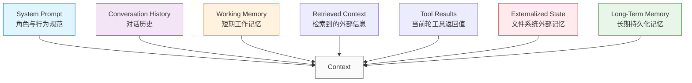
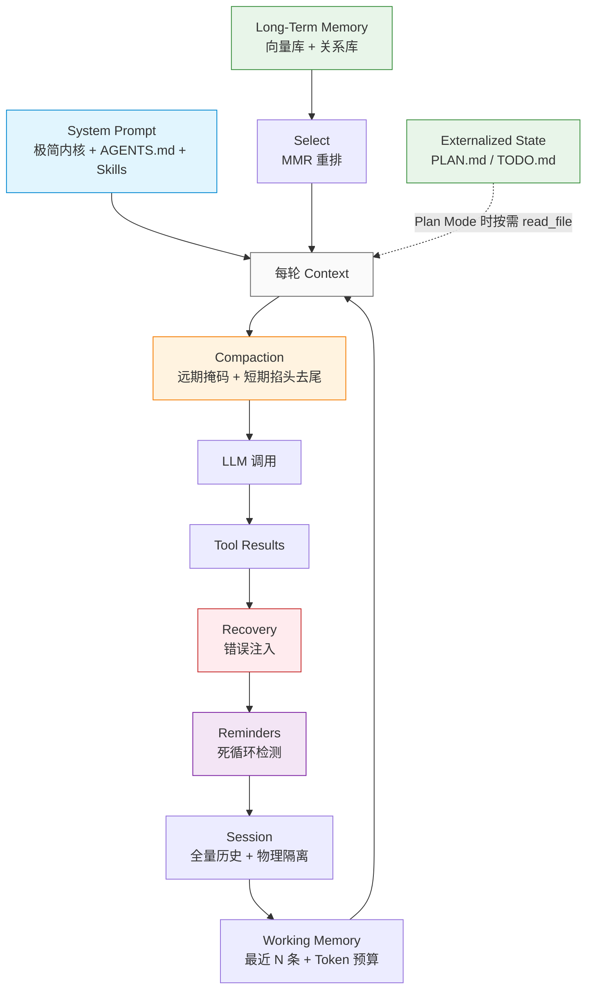

# 上下文管理篇

> 本文讨论的是 Agent 系统中的"上下文设计"，而非 LLM 本身的上下文窗口机制。上下文窗口是硬件限制，上下文设计是软件策略。

Agent 的每一轮 LLM 调用，都需要构造一段"当前任务需要看到的信息"。这段信息就是上下文。

但**"构造上下文"远不止"把消息拼起来"那么简单**——你需要管理 Session 隔离、Working Memory 截断、超长上下文压缩、Token 预算、长期记忆分层、错误自愈、循环打断、状态外部化、PII 脱敏、Prompt Cache 优化……每一项都直接决定了 Agent 的连贯性、成本和可靠性。

本文从五个部分展开：

1. **用原始代码管理上下文**——不依赖框架，自己手写上下文管理的完整体系
2. **用框架管理上下文**（LangChain 1.0 / LangGraph）
3. **上下文的工程细节**——PII 脱敏、Prompt Cache、分层预算
4. **状态外部化与持久化**——基于文件系统的长程记忆
5. **常见陷阱**

最后覆盖设计检查清单。

---

## 先建立坐标系：上下文的层次

Agent 系统里的"上下文"是分层的。理解分层，才能理解每一层的设计目标：



| 层次 | 时间跨度 | 存储位置 | 管理策略 |
|------|---------|---------|---------|
| **System Prompt** | 整个会话 | 引擎硬编码 + 文件动态加载 | 每次必带，前缀稳定 |
| **Conversation History** | 当前会话 | 内存 + 可选持久化 | 滑动窗口 + 压缩 |
| **Working Memory** | 当前会话 + 当前任务 | 从 History 中截取 | 截取最近 N 轮 |
| **Retrieved Context** | 当前轮 | RAG 检索结果 | 按需注入，用后丢弃 |
| **Tool Results** | 当前轮 | 消息列表 | 短期完整，长期掩码 |
| **Externalized State** | 当前任务 | 文件系统（PLAN.md/TODO.md） | 显式读写，断点续传 |
| **Long-Term Memory** | 跨会话 | 向量数据库 / KV 存储 | 语义检索，分层融合 |

每一层都有自己的生命周期和管理策略，不能混为一谈。

---

## 维度一：用原始代码管理上下文

### 核心矛盾

上下文设计始终在解决一个矛盾：

**更多上下文 → 模型理解更准，但成本更高、注意力被稀释、KV Cache 更大**

**更少上下文 → 成本更低、响应更快，但模型可能"失忆"或理解偏差**

传统软件开发中几乎不存在这个问题——变量作用域是编译器管的。但在 Agent 系统中，每轮上下文需要你亲手构造。

### 1. 从最小化上下文管理开始

不依赖框架，核心逻辑可以拆成多个独立组件，每个组件管一件事：

```python
@dataclass
class ContextConfig:
    """上下文管理的完整配置"""
    # Working Memory 参数
    working_memory_limit: int = 6      # 截取最近 N 条消息
    working_memory_token_budget: int = 4000  # Token 上限

    # Compaction 参数
    compaction_threshold: int = 12000  # 触发压缩的字符阈值
    compaction_retain: int = 6        # 短期保护区大小

    # 长期记忆参数
    enable_externalized_state: bool = True  # 是否启用 PLAN.md/TODO.md
    plan_mode: bool = False            # 是否开启 Plan 模式

    # Session 参数
    session_max_history: int = 500    # Session 最大消息数
    session_ttl_days: int = 30        # Session 过期时间

    # PII 脱敏
    enable_pii_redaction: bool = True
```

这套配置将作为参数传入所有上下文管理组件，保证它们对"截取多少、保留什么、脱敏哪些"有统一的判断。

### 2. Working Memory：短期工作记忆的截取

#### 滑动窗口截取

最朴素的策略：从 Session 的全量历史中截取最近 N 条消息。

```python
def get_working_memory(history: list, limit: int = 6) -> list:
    """截取最近 N 条消息作为 Working Memory。

    关键：必须处理 ToolResult 孤儿问题。
    大模型 API 强制要求消息连续性——如果 ToolCall 被截断丢弃，
    但 ToolResult 还在，API 会直接报 400 Bad Request。
    """
    total = len(history)
    if total <= limit or limit <= 0:
        return list(history)

    # 截取最近 limit 条
    result = list(history[total - limit:])

    # 边界处理：丢弃断头的 ToolResult
    # 如果第一条是带有 ToolCallID 的 tool result，
    # 但对应的 ToolCall 已被截断，必须丢弃
    while result:
        if result[0].get("role") == "tool" and result[0].get("tool_call_id"):
            result = result[1:]
        else:
            break

    return result
```

`get_working_memory` 的核心职责是"截取 + 兜底"。它不修改原始 history，只返回当前轮 LLM 需要的子集。

**为什么需要 ToolResult 孤儿处理？**

OpenAI / Anthropic 的 API 都要求消息按严格顺序排列：每条 `tool` 角色的消息必须有一条对应的 `assistant` 消息（携带 `tool_calls`）。如果 LLM 在第 10 轮调用了 `read_file`，到第 16 轮时你把 assistant 那条截掉了，但 tool result 还在，API 会报错："messages with role 'tool' must be a response to a preceeding message with 'tool_calls'"。

这是"调包开发"时绝对接触不到的底层智慧，但它是从根源上杜绝 400 报错的关键。

#### Token 感知的双维度截取

按条数截取有一个明显问题：如果其中一条消息是 1 万行的 `read_file` 返回结果，即使 `limit=6` 也可能让总 Token 数瞬间超标。

更稳健的做法是**条数 + Token 双维度截断**：

```python
def get_working_memory_with_budget(
    history: list,
    msg_limit: int = 20,
    token_budget: int = 8000,
) -> list:
    """双维度截取：先按条数，再按 Token 预算。

    从最新的消息开始往前填，填满预算为止。
    """
    result = []
    current_tokens = 0

    # 从最新到最旧遍历
    for msg in reversed(history):
        msg_tokens = estimate_tokens(msg)
        if current_tokens + msg_tokens > token_budget:
            break  # 预算用完
        result.insert(0, msg)  # 前插保持顺序
        current_tokens += msg_tokens

    # 最后处理一次孤儿
    while result and result[0].get("role") == "tool" and result[0].get("tool_call_id"):
        result = result[1:]

    return result


def estimate_tokens(msg: dict) -> int:
    """粗略估算单条消息的 Token 数。
    英文 ~4 字符/token，中文 ~1.5 字符/token，加 10% 安全边际。
    """
    content = msg.get("content", "")
    tool_calls = msg.get("tool_calls", [])
    base = len(content) / 4
    for tc in tool_calls:
        base += len(tc.get("name", "")) / 4 + len(str(tc.get("args", ""))) / 4
    return int(base * 1.1) + 5  # +5 是消息格式开销
```

### 3. Session 管理：物理隔离与持久化

#### Session 实体结构

```python
from dataclasses import dataclass, field
from datetime import datetime
from typing import List, Dict, Any
import threading


@dataclass
class Session:
    """会话实体：维护一次人机交互的完整历史"""
    id: str
    work_dir: str = ""              # 绑定的物理工作区
    tenant_id: str = ""             # 多租户隔离字段
    user_id: str = ""
    created_at: datetime = field(default_factory=datetime.now)
    updated_at: datetime = field(default_factory=datetime.now)
    expires_at: datetime = None    # TTL 过期

    history: List[Dict[str, Any]] = field(default_factory=list)
    context: Dict[str, Any] = field(default_factory=dict)   # 会话变量（标题、偏好等）
    metadata: Dict[str, Any] = field(default_factory=dict)  # 元数据

    total_tokens_used: int = 0
    total_cost_usd: float = 0.0

    _lock: threading.RLock = field(default_factory=threading.RLock)

    def append(self, *msgs: Dict[str, Any]) -> None:
        """线程安全地追加消息"""
        with self._lock:
            self.history.extend(msgs)
            self.updated_at = datetime.now()
```

#### 全局 SessionManager

```python
class SessionManager:
    """全局会话管理器：负责多用户/多终端的物理隔离"""
    def __init__(self):
        self._sessions: Dict[str, Session] = {}
        self._lock = threading.RWMutex()

    def get_or_create(self, session_id: str, work_dir: str) -> Session:
        """获取或创建会话"""
        with self._lock:
            if session_id in self._sessions:
                return self._sessions[session_id]
            sess = Session(id=session_id, work_dir=work_dir)
            self._sessions[session_id] = sess
            return sess

    def get(self, session_id: str, current_tenant_id: str = "") -> Session:
        """获取会话（带租户隔离检查）"""
        sess = self._sessions.get(session_id)
        if sess is None:
            return None

        # 租户隔离：返回 ErrSessionNotFound 而非 ErrUnauthorized
        # 不泄露 Session 是否存在的信息，防止攻击者枚举 SessionID
        if current_tenant_id and sess.tenant_id != current_tenant_id:
            return None  # 不是 raise Unauthorized

        return sess
```

**关键设计原则：**

- **Session ID 是隔离边界**：每个用户、每个终端、每个飞书群聊对应独立 Session，互不干扰
- **返回 None 而非抛异常**：当租户不匹配时，返回"不存在"而非"无权限"，防止攻击者通过错误类型判断 Session 是否存在
- **读写锁保证并发安全**：飞书后台 N 个群聊同时请求，每个 Session 内部用 `RLock` 保护 history 列表

#### Session 的滑动窗口裁剪

```python
def append_with_window(self, *msgs: Dict[str, Any], max_history: int = 500) -> None:
    """追加消息并按滑动窗口裁剪"""
    with self._lock:
        self.history.extend(msgs)
        # 滑动窗口裁剪
        if len(self.history) > max_history:
            self.history = self.history[len(self.history) - max_history:]
```

`max_history=500` 是一个平衡点：太小上下文不够，太大 Redis 存储压力大、加载慢。

### 4. Compaction：阶梯降级的上下文压缩

Working Memory 防的是"消息条数爆炸"，但防不住"单条消息暴击"——一次 `read_file` 读了个 1MB 的日志，即使 Working Memory 只取 6 条，其中一条 1MB 也能瞬间打穿上下文窗口。

这时候需要 **Compactor（上下文压缩器）**。

#### 双重降级压缩策略

```python
class Compactor:
    """上下文压缩器：防止单次大文件输出导致 OOM"""
    def __init__(self, max_chars: int = 12000, retain_last: int = 6):
        self.max_chars = max_chars   # 触发压缩的字符阈值（水位线）
        self.retain_last = retain_last  # 短期保护区大小

    def compact(self, msgs: list) -> list:
        """对消息数组执行阶梯降级压缩

        三道防线：
        1. System Prompt 永远保留
        2. 远期历史：ToolResult 全量掩码 + Thinking 折叠
        3. 短期保护区：超长 ToolResult 掐头去尾截断
        """
        if self.estimate_length(msgs) < self.max_chars:
            return msgs  # 大多数情况的快速路径

        compacted = []
        protect_start = max(0, len(msgs) - self.retain_last)

        for i, msg in enumerate(msgs):
            # 防线 1：System Prompt 绝对不动
            if msg.get("role") == "system":
                compacted.append(msg)
                continue

            new_msg = dict(msg)  # 拷贝，避免污染原始引用
            in_working_memory = i >= protect_start

            # 防线 2：远期历史的 ToolResult 全量掩码
            if msg.get("role") == "tool" and not in_working_memory:
                if len(msg.get("content", "")) > 200:
                    new_msg["content"] = (
                        f"...[早期的工具输出已被系统强制清理。"
                        f"原始长度: {len(msg['content'])} 字节]..."
                    )

            # 防线 3：短期保护区内仍超长的 ToolResult 掐头去尾
            elif msg.get("role") == "tool" and in_working_memory:
                content = msg.get("content", "")
                max_keep = 1000
                if len(content) > max_keep:
                    head = content[:500]
                    tail = content[-500:]
                    new_msg["content"] = (
                        f"{head}\n\n...[内容过长，中间 {len(content) - max_keep} "
                        f"字节已被系统截断]...\n\n{tail}"
                    )

            # 远期 Thinking 折叠
            elif msg.get("role") == "assistant" and not in_working_memory:
                if len(msg.get("content", "")) > 200:
                    new_msg["content"] = "...[早期的推理思考过程已折叠]..."

            compacted.append(new_msg)

        return compacted

    def estimate_length(self, msgs: list) -> int:
        return sum(len(m.get("content", "")) for m in msgs)
```

**关键设计原则：**

- **死死保住 ToolCall 意图**：压缩 ToolResult 时，`tool_calls` 字段（模型的行动证据）必须保留。如果删了，模型会困惑"我刚才调过这个工具吗？"然后陷入重复调用的死循环
- **保留 URL 和文件路径**：压缩时不要做不可逆丢弃，让 Agent 还能通过工具重新读取原始源
- **保留错误上下文**：不要清除 Agent 的失败尝试，这些错误是宝贵的学习信号

#### 为什么不能简单粗暴地删长消息？

新手的第一反应："历史消息太长，直接把字数超过阈值的删掉不就行了？"

**绝对不行。**

ReAct 循环依赖长程逻辑链：模型在第 3 轮调了 `read_file`，结果在第 15 轮才用到。如果你把第 3 轮的 `ToolResult` 删了，模型会陷入困惑——它以为命令没发出去，会重新发起调用，从而陷入死循环。

Compaction 的目标是：**丢弃冗余数据（释放内存），但死死保住意图和逻辑链**。

### 5. Prompt Cache 优化

Agent 系统的输入/输出 Token 比例可以高达 100:1——每生成一个回答 token 可能需要处理 100 个输入 token。**输入成本远高于输出成本**。

**Prompt Cache** 是解决这个问题的关键基础设施。它的原理是把每次 LLM 计算时生成的 KV Cache 中间结果缓存起来，下次遇到相同前缀时直接复用，跳过重复计算。

要让 Prompt Cache 真正生效，需要遵守几个原则：

**1. 保持提示前缀稳定**

```python
# 错误：在 System Prompt 开头放秒级时间戳
system_prompt = f"当前时间: {datetime.now()}\n你是助手..."

# 正确：时间戳放到末尾，或者干脆不放
system_prompt = "你是助手...\n\n（用户消息中的时间戳会变化，但前缀不变）"
```

**2. 上下文只追加（Append-Only）**

```python
# 错误：在循环中重排历史消息
messages.sort(key=lambda m: m["priority"])

# 正确：永远只在末尾追加
messages.append(new_msg)
```

**3. 工具定义保持稳定**

不要在运行时动态增删工具定义。需要控制工具可用性时，用 **logit 掩蔽**（在解码时屏蔽某些工具的输出概率）而不是删除工具定义——这样缓存不受影响。

**4. 注意 TTL**

Claude 的 Cache TTL 是 5 分钟。对于高频请求场景，保持请求间隔在 TTL 以内。

### 6. PII 脱敏

上下文里如果包含用户的敏感信息（信用卡号、SSN、API Key），会随着摘要、向量库、日志永久泄露。

```python
import re

PII_PATTERNS = [
    (re.compile(r"\b\d{4}[-\s]?\d{4}[-\s]?\d{4}[-\s]?\d{4}\b"), "[REDACTED_CC]"),  # 信用卡
    (re.compile(r"\b\d{3}-\d{2}-\d{4}\b"), "[REDACTED_SSN]"),                       # SSN
    (re.compile(r"(?i)api[_-]?key[\s:=]+[\w-]{20,}"), "[REDACTED_API_KEY]"),       # API Key
    (re.compile(r"(?i)(password|secret|pwd)[\s:=]+\S{8,}"), "[REDACTED_SECRET]"),  # 密码
    (re.compile(r"\b(?:\d{1,3}\.){3}\d{1,3}\b"), "[REDACTED_IP]"),                # IP
]

def redact_pii(text: str) -> str:
    """在压缩摘要、存入向量库之前调用"""
    for pattern, replacement in PII_PATTERNS:
        text = pattern.sub(replacement, text)
    return text
```

**关键插入点：**

1. 压缩成摘要时
2. 存入向量数据库时
3. 写入日志时

**局限性：** 正则脱敏不是万能的。`192.168.1.1` 可能是代码里的常量不是 IP；复杂的 PII 格式可能漏报。生产建议：正则作为基础防线，敏感场景用专业服务（AWS Comprehend / Google DLP）。

### 7. 状态外部化（Plan Mode）：用文件系统做长程记忆

短期记忆（Working Memory）解决了"单次对话内的信息管理"，但解决不了"跨越好几天、几十个子模块重构"的超长任务。

传统的 AI 框架会在内存里维护复杂的状态机或图数据库，但这太重了，而且人类无法干预。

**驾驭工程的解法：把状态写到文件系统里。**

```python
class PlanModeComposer:
    """Plan Mode 下的 Prompt 组装器：强制 Agent 使用 PLAN.md / TODO.md"""

    def build_system_prompt(self, work_dir: str) -> str:
        base = "# 核心身份\n你是一个高级软件工程师助手。\n\n"

        if self.plan_mode:
            base += """
# 长程任务强制规范 (Plan Mode: ON)

收到指令后，你必须、且只能按照以下顺序执行：

**[STEP 1: 强制环境嗅探 (Bootstrapping)]**
- 使用 bash 检查工作区根目录下是否已存在 PLAN.md 和 TODO.md
- 分支 A (全新任务)：文件不存在 → 依次创建
  1. 先创建 PLAN.md，写下你的理解、架构设计、技术选型
  2. 再创建 TODO.md，拆解具体的可执行步骤（使用 Markdown Checkbox）
- 分支 B (断点续传)：文件已存在 → 绝对不要覆盖
  1. 立即 read_file 阅读 PLAN.md 了解全局目标
  2. 阅读 TODO.md 找到第一个未完成的 [ ] 任务，从那里继续

**[STEP 2: 严格的单步执行与实时打勾]**
- 每完成一个子任务，必须立即停下来，用 edit_file 将 TODO.md
  中对应的行修改为 - [x]
- 绝对不允许"一口气写完所有代码最后再打勾"

**[STEP 3: 迷失时的自救]**
- 如果遇到报错或不知道下一步，立即 read_file 重新读取 TODO.md 确认位置
"""
        return base
```

**为什么用文件做记忆？**

| 优势 | 说明 |
|------|------|
| **透明可观测** | VS Code 直接打开 TODO.md，Agent 当前在干嘛、接下来做啥一目了然 |
| **零成本 HITL** | Agent 走偏了？手动改 TODO.md，Agent 下次读取时就接受纠偏 |
| **天然持久化** | 进程崩溃 100 次，TODO.md 还在，重启后无缝恢复 |
| **极致省 Token** | 长程规划不塞上下文，需要时一次 read_file 唤醒 |

**Plan Mode 是开关而非强制**：简单任务（"帮我查天气"）不要开启 Plan Mode，否则 Agent 会变成"繁文缛节的官僚"——任何命令都先创建 PLAN.md 写"我的计划是运行 date"。

### 8. 错误自愈：上下文感知的 Recovery Hints

当 Agent 工具调用失败时，传统框架只返回原始报错。LLM 面对生硬的错误信息，要么机械道歉直接放弃，要么陷入盲目试错（连续三次生成相同的错误参数）。

**错误自愈**：在工具报错时，引擎层拦截并注入"锦囊妙计"。

```python
class RecoveryManager:
    """错误自愈：在工具执行失败时注入恢复建议"""

    def analyze_and_inject(self, tool_name: str, raw_error: str) -> str:
        hints = {
            ("edit_file", "在文件中未找到 old_text"): (
                "你提供的 old_text 与文件当前内容不一致，或缺少缩进。"
                "请先使用 read_file 重新读取该文件，获取最新内容后再发起编辑。"
            ),
            ("read_file", "no such file or directory"): (
                "路径似乎不正确。请不要凭空猜测，"
                "先使用 bash 执行 `ls -la` 或 `find . -name` 查找正确路径。"
            ),
            ("bash", "command not found"): (
                "系统中未安装该命令。请思考：是否有替代命令？"
                "或者你是否需要先编写脚本安装？"
            ),
            ("bash", "DeadlineExceeded"): (
                "该命令被超时强杀。如果它是常驻服务（如 web server），"
                "请转入后台执行（如 nohup ... &），不要阻塞主线程。"
            ),
        }

        for (tool, keyword), hint in hints.items():
            if tool == tool_name and keyword.lower() in raw_error.lower():
                return f"{raw_error}\n\n[系统救援指南]: {hint}"

        return raw_error  # 未匹配则原样返回
```

**关键设计原则：**

- **使用祈使句**：锦囊中明确写"请先使用 read_file"，LLM 看到高权重指令执行的顺从度会大幅上升
- **基于稳定特征匹配**：匹配 Go 原生的 POSIX 错误（`no such file or directory`）或工具内部固定报错格式，避免被版本更新打破
- **生产建议**：基于错误码（Domain Error Codes）而非字符串匹配。依赖模糊的中文报错做逻辑分支是脆弱的反模式

### 9. 防死循环：System Reminders

你可能会问：System Prompt 写在上下文最前面，LLM 怎么会忘记？

LLM 确实没"忘记"——字面意义上还在那里。但有两个行为陷阱导致它"装看不见"：

1. **上下文内容分布偏移**：连续几次遇到相同错误时，末尾堆满结构相似的 ToolResult，这些高重复度 token 强力牵引模型的下一步生成
2. **近因偏差（Recency Bias）**：模型对距离最近的信息响应权重最高，泛泛而谈的系统规则被末尾的错误信息淹没

**解法：在决策点（Point of Decision）注入提醒。**

```python
import hashlib

class ReminderInjector:
    """防死循环：在每次 LLM 调用前检测重复模式，必要时注入打断指令"""

    def __init__(self):
        self.consecutive_failures: Dict[str, int] = {}

    def check_and_inject(self, tool_name: str, args: dict, is_error: bool) -> dict | None:
        """根据上轮结果决定是否注入打断消息"""
        # 用 tool_name + args 哈希作为指纹
        fingerprint = hashlib.md5(
            (tool_name + str(args)).encode()
        ).hexdigest()

        if not is_error:
            # 执行成功，清空失败计数器
            self.consecutive_failures.clear()
            return None

        # 累加失败次数
        self.consecutive_failures[fingerprint] = self.consecutive_failures.get(fingerprint, 0) + 1
        fail_count = self.consecutive_failures[fingerprint]

        # 阈值 3 次：触发打断
        if fail_count >= 3:
            return {
                "role": "user",  # 必须是 user，借助 Recency Bias
                "content": (
                    f"[SYSTEM REMINDER 警告]\n"
                    f"你似乎陷入了死循环。你刚刚连续 {fail_count} 次使用相同的参数"
                    f"调用了 '{tool_name}' 工具，并且都失败了。\n"
                    f"请立即停止无效的重试！你需要：\n"
                    f"1. 停止猜测参数。跳出当前的局部思维。\n"
                    f"2. 彻底改变你的策略。\n"
                    f"3. 如果无法通过工具解决，直接结束任务并向用户说明你需要什么人工帮助。"
                )
            }

        return None
```

**关键设计原则：**

- **指纹识别**：`MD5(tool_name + args)` 作为唯一指纹，连续三次相同才触发
- **必须以 user 角色注入**：借助 LLM 的 Recency Bias，让这条消息成为模型"看到的最后一条"，获得最高响应权重
- **参数规范化（进阶）**：模型会用 `read_file{"path": "/tmp/a.txt"}` 和 `read_file{"path": "/tmp/a.txt "}`（末尾多空格）来绕过检测。生产实现需要对参数做规范化（如 trim、绝对路径化）才能识别"本质上的"死循环

### 10. 长期记忆的分层管理

Working Memory 解决了"单次对话内的信息管理"。跨会话怎么办？

把记忆分成四层：

| 类型 | 时间跨度 | 例子 | 存储方式 |
|------|---------|------|---------|
| **工作记忆** | 秒-分钟级 | 正在处理的代码片段 | 上下文窗口 |
| **会话记忆** | 分钟-小时级 | 这次对话的历史 | Session（内存+Redis） |
| **长期记忆** | 天-月级 | 用户偏好、成功模式 | 关系数据库 |
| **语义记忆** | 永久 | 相关历史问答、知识库 | 向量数据库 |

会话记忆已经由 Session 覆盖。这一层重点讲**长期 + 语义的混合检索**。

```python
def fetch_hierarchical_memory(
    query: str,
    session_id: str,
    recent_top_k: int = 5,
    semantic_top_k: int = 3,
    summary_top_k: int = 2,
) -> List[dict]:
    """分层融合检索：Recent + Semantic + Summary，去重合并"""
    items = []
    seen_ids = set()

    # 第一层：时间维度（最近 N 条）
    for item in fetch_session_memory(session_id, recent_top_k):
        item["_source"] = "recent"
        items.append(item)
        seen_ids.add(item["id"])

    # 第二层：语义维度（相关 N 条）
    for item in fetch_semantic_memory(query, semantic_top_k):
        if item["id"] not in seen_ids:
            item["_source"] = "semantic"
            items.append(item)
            seen_ids.add(item["id"])

    # 第三层：摘要维度（长期压缩）
    for item in fetch_summaries(query, summary_top_k):
        item["_source"] = "summary"
        items.append(item)

    # 限制总数防止上下文爆炸
    return items[:10]
```

**为什么分层？**

- **Recent**：用户说"刚才那个"，需要最近的对话
- **Semantic**：用户问相关话题，需要历史中语义相关的
- **Summary**：长对话的压缩摘要，快速建立上下文

三层融合、去重合并。`_source` 标记很重要——后续处理时可以根据来源决定优先级。

### 11. 语义去重：MMR 重排序

纯相似度检索可能返回一堆重复内容。MMR（Maximal Marginal Relevance）平衡相关性和多样性：

```
MMR(d) = λ * Sim(d, query) - (1-λ) * max(Sim(d, d_selected))

λ = 0.7：偏向相关性（默认）
λ = 0.5：平衡
λ = 0.3：偏向多样性
```

```python
def mmr_reorder(query_vec, items: list, top_k: int, lambda_: float = 0.7) -> list:
    """贪心选择：每步选相关性高且与已选结果相似度低的项"""
    if len(items) <= top_k:
        return items

    selected = []
    remaining = set(range(len(items)))

    while len(selected) < top_k and remaining:
        best_idx = -1
        best_score = -1e9

        for i in remaining:
            relevance = cosine_sim(query_vec, items[i]["vector"])
            # 与已选结果的最大相似度作为惩罚项
            max_sim = max(
                (cosine_sim(items[i]["vector"], items[s]["vector"]) for s in selected),
                default=0.0,
            )
            score = lambda_ * relevance - (1 - lambda_) * max_sim
            if score > best_score:
                best_score = score
                best_idx = i

        selected.append(best_idx)
        remaining.remove(best_idx)

    return [items[i] for i in selected]
```

实践用法：需要 5 条结果，先取 15 条候选，MMR 重排到 5 条。

### 12. 把所有组件装到循环里

把所有上下文管理组件集成到 `react_loop`（详见 [Agent Loop 设计篇](agent-loop-design)）中：

```python
def react_loop_with_context(
    prompt: str,
    session: Session,
    tools: dict,
    config: ContextConfig,
    compactor: Compactor,
    recovery: RecoveryManager,
    reminder: ReminderInjector,
    planner: PlanModeComposer,
) -> str:
    """完整上下文管理的 ReAct 循环"""

    # 1. System Prompt 动态组装（Plan Mode 时注入外部化指令）
    system_msg = {
        "role": "system",
        "content": planner.build_system_prompt(session.work_dir)
    }

    # 2. 追加用户输入
    session.append({"role": "user", "content": prompt})

    for step in range(config.max_iterations):
        # 3. 提取 Working Memory（双维度截取 + 孤儿处理）
        recent = get_working_memory_with_budget(
            session.history,
            msg_limit=20,
            token_budget=config.working_memory_token_budget,
        )

        # 4. 拼装当前轮上下文
        context = [system_msg] + recent

        # 5. Compaction 压缩（防 OOM）
        context = compactor.compact(context)

        # 6. 调用 LLM
        response = llm.invoke(context)

        # 7. 解析并执行工具
        tool_calls = response.get("tool_calls", [])
        if not tool_calls:
            break

        # 8. 执行工具（带 Recovery 注入）
        for tc in tool_calls:
            result = safe_tool_call(tc["name"], tc["args"], tools)
            content = (
                recovery.analyze_and_inject(tc["name"], str(result))
                if result.get("error")
                else str(result)
            )
            session.append({
                "role": "tool",
                "content": content,
                "tool_call_id": tc["id"]
            })

        # 9. System Reminders 检测（防死循环）
        last_tool_call = tool_calls[-1]
        reminder_msg = reminder.check_and_inject(
            last_tool_call["name"],
            last_tool_call["args"],
            is_error=bool(last_tool_call.get("error")),
        )
        if reminder_msg:
            session.append(reminder_msg)  # 作为 user 注入，借助 Recency Bias

    return extract_final_answer(session.history)
```

关键设计要点：

- **System Prompt 每次重新组装**：确保 Plan Mode 状态变化时生效
- **Working Memory 先截取再压缩**：截取是逻辑筛选，压缩是物理降级，两层都不可少
- **Recovery 在工具返回时立即生效**：不能等到下一轮 Reason 阶段
- **Reminder 在 Observe 阶段尾部注入**：作为 user 消息写入 Session，下一轮 Reason 时凭借 Recency Bias 生效

---

## 维度二：用框架管理上下文（LangChain 1.0 / LangGraph）

### LangChain 1.0 的上下文机制

LangChain 1.0 的 `create_agent`（`langchain/agents/factory.py`）底层基于 LangGraph 构建，上下文管理的核心是 `AgentState` 类型与 `add_messages` reducer（来自 LangGraph）。

**LangChain v1 提供的标准中间件（`langchain.agents.middleware`）：**

| 中间件 | 用途 |
|--------|------|
| `SummarizationMiddleware` | Token 阈值触发，调用 LLM 对早期消息生成摘要 |
| `ContextEditingMiddleware` | Anthropic 风格的 tool result 清理，达到阈值后用占位符替换 |
| `PIIMiddleware` | 检测并处理 Email / 信用卡 / IP / MAC / URL 等敏感信息 |
| `HumanInTheLoopMiddleware` | 在工具执行前挂起，等待人工审批 |
| `TodoListMiddleware` | 让 LLM 维护 TODO 列表追踪任务进度 |
| `FilesystemFileSearchMiddleware` | 提供对本地文件系统的检索能力 |
| `ShellToolMiddleware` | 安全执行 shell 命令（带沙箱策略） |
| `ModelRetryMiddleware` / `ToolRetryMiddleware` | 模型/工具调用的指数退避重试 |
| `ModelCallLimitMiddleware` / `ToolCallLimitMiddleware` | 调用次数限制（防失控循环） |
| `ModelFallbackMiddleware` | 主模型失败时降级到备用模型 |
| `LLMToolSelectorMiddleware` / `ProviderToolSearchMiddleware` | 工具选择/检索 |

> 源码位置：`D:\open_code\langchain\libs\langchain_v1\langchain\agents\middleware\`

#### MessagesState：消息列表的自动管理

LangChain Agent 的状态定义基于 LangGraph 的 `add_messages` reducer（源码：`langchain/agents/middleware/types.py`）：

```python
from langgraph.graph.message import add_messages
from typing_extensions import Annotated, Required, NotRequired
from typing import TypedDict, Generic, Any
from langchain_core.messages import AnyMessage
from langgraph.channels.ephemeral_value import EphemeralValue


class AgentState(TypedDict, Generic[ResponseT]):
    """LangChain Agent 的核心状态定义"""
    messages: Required[Annotated[list[AnyMessage], add_messages]]
    jump_to: NotRequired[Annotated[Literal["tools", "model", "end"] | None,
                                  EphemeralValue, PrivateStateAttr]]
    structured_response: NotRequired[Annotated[ResponseT, OmitFromInput]]
```

关键在于 `Annotated[..., add_messages]`——这个 reducer 定义了 `messages` 字段在两个节点之间怎么合并。

**`add_messages` 的工作机制：**

1. **新消息默认追加到末尾**——大部分情况下，节点返回的是一条新消息（AIMessage 或 ToolMessage），它有新 ID，所以被直接 append
2. **同 ID 的消息替换**——如果返回的消息有 ID，且列表中已有同 ID 的消息，旧消息被替换而非追加
3. **删除消息**——通过 `RemoveMessage(id=xxx)` 按 ID 删除指定消息（`RemoveMessage` 来自 `langchain_core.messages.modifier`）
4. **清空全部**——通过 `RemoveMessage(id=REMOVE_ALL_MESSAGES)`（常量来自 `langgraph.graph.message`）

> ⚠️ **注意**：LangChain v1 没有 `MessagesState` 这个名字——LangGraph 的 `MessagesState` 仍可用，但 `create_agent` 默认使用 `AgentState`。

#### 消息压缩：RemoveMessage 的正确用法

LangChain v1 中删除消息的标准方式（源码：`langchain_core/messages/modifier.py`）：

```python
from langchain_core.messages import RemoveMessage
from langgraph.graph.message import REMOVE_ALL_MESSAGES

# 删除指定 ID 的消息
RemoveMessage(id="msg_abc123")

# 清空全部消息（实际用法见 SummarizationMiddleware）
RemoveMessage(id=REMOVE_ALL_MESSAGES)
```

`RemoveMessage` 通过 `add_messages` reducer 处理——返回包含 `RemoveMessage` 的状态更新即可触发删除。

#### State 中的上下文管理字段

LangChain v1 的 `AgentState`（源码：`langchain/agents/middleware/types.py:347`）只有三个字段：

- **`messages`**：核心消息列表，由 `add_messages` reducer 管理
- **`jump_to`**：路由覆盖信号，中间件可以设置此字段要求路由到特定节点。它是 `EphemeralValue`——值不会跨步骤保留，用完即消失
- **`structured_response`**：结构化输出标记，存在此字段时循环结束

如果需要扩展上下文管理字段（如摘要、长期记忆），可以在继承 `AgentState` 的自定义 State 类中添加：

```python
from langchain.agents.middleware import AgentState
from typing import Annotated
from langgraph.graph.message import add_messages

class CustomAgentState(AgentState):
    summary: str = ""                          # 历史摘要
    working_memory_limit: int = 6              # 截取限制
    externalized_plan: str = ""                # PLAN.md 内容（Plan Mode）
    long_term_memory: list[dict] = []          # 检索到的长期记忆
```

#### 中间件机制：动态注入上下文

LangChain v1 的中间件是上下文管理的核心入口。中间件有六种钩子（源码：`types.py`）：

| 钩子 | 触发时机 | 用途 |
|------|---------|------|
| `before_agent` | Agent 执行开始前 | 初始化、检查前置条件 |
| `before_model` | 每次 LLM 调用前 | 上下文压缩、动态 Prompt、PII 检查 |
| `wrap_model_call` | 包裹 LLM 调用 | 重试、降级、改写请求/响应 |
| `after_model` | 每次 LLM 响应后 | PII 输出检查、限流 |
| `wrap_tool_call` | 包裹工具调用 | Recovery Hints、重试、超时控制 |
| `after_agent` | Agent 执行结束后 | 清理、日志、状态持久化 |

**装饰器风格的中间件**（源码：`types.py:1821-1991`）：

```python
from langchain.agents.middleware import (
    AgentMiddleware, AgentState,
    before_model, after_model, wrap_tool_call, dynamic_prompt,
)
from langchain_core.messages import SystemMessage, RemoveMessage
from langchain.agents import create_agent
from langchain_core.tools import tool
from langgraph.runtime import Runtime


@before_model
def compress_context(state: AgentState, runtime: Runtime) -> dict | None:
    """在每次 LLM 调用前压缩上下文（before_model 钩子）"""
    messages = state["messages"]

    # Compaction 触发条件：估算 token 超阈值
    if estimate_total_tokens(messages) > 12000:
        # 保留最近 6 条，删除中间消息并插入摘要
        to_compress = messages[1:-6]
        if to_compress:
            summary = llm.summarize(to_compress)
            summary_msg = SystemMessage(content=f"历史对话摘要: {summary}")
            # 通过 RemoveMessage 删除，用 SystemMessage 插入新摘要
            return {
                "messages": [
                    *[RemoveMessage(id=m.id) for m in to_compress if m.id],
                    summary_msg,
                ]
            }
    return None


@wrap_tool_call
def inject_recovery_hints(request, handler):
    """在工具调用失败时注入恢复建议（wrap_tool_call 钩子）"""
    try:
        return handler(request)
    except Exception as e:
        hint = recovery_manager.analyze_and_inject(
            request.tool_call["name"], str(e)
        )
        return ToolMessage(
            content=f"{str(e)}\n\n[系统救援指南]: {hint}",
            tool_call_id=request.tool_call["id"],
            status="error",
        )


# 通过 create_agent 接入
agent = create_agent(
    model="openai:gpt-5",
    tools=[...],
    middleware=[compress_context, inject_recovery_hints],
)
```

中间件的核心优势：上下文管理的所有逻辑（压缩、Recovery、PII 脱敏、限流）都以**模块化、可插拔**的方式接入，不需要改动核心循环。

#### 关键的内置中间件用法

**1. SummarizationMiddleware（基于 LLM 的摘要）**

源码（`summarization.py:208`）通过 `trigger` 触发，调用 `model.invoke()` 生成摘要，默认 prompt 包含 `SESSION INTENT`/`SUMMARY`/`ARTIFACTS`/`NEXT STEPS` 四个固定 section。

```python
from langchain.agents.middleware import SummarizationMiddleware
from langchain.agents import create_agent

agent = create_agent(
    model="openai:gpt-5",
    tools=[...],
    middleware=[
        # 当 token 数达到 4000 时触发摘要，保留最近 20 条消息
        SummarizationMiddleware(
            model="openai:gpt-4o-mini",  # 用便宜的模型做摘要
            trigger=("tokens", 4000),
            keep=("messages", 20),
        ),
    ],
)
```

`trigger` 支持三种形式（源码 `summarization.py:123-134`）：
- `("fraction", 0.8)`：达到模型最大输入 token 的 80%
- `("tokens", 4000)`：达到指定 token 数
- `("messages", 50)`：达到指定消息数

它特别处理了 **AI/Tool 消息配对完整性**（`_find_safe_cutoff_point` 函数）——确保 cut off 时不会把 `AIMessage.tool_calls` 和对应的 `ToolMessage` 拆散。

**2. ContextEditingMiddleware（Anthropic 风格的 tool result 清理）**

源码（`context_editing.py:187`）实现了 Anthropic 的 `clear_tool_uses_20250919` 行为：token 超阈值后，把早期的 tool result 内容清空为占位符（默认 `[cleared]`）。

```python
from langchain.agents.middleware import ContextEditingMiddleware, ClearToolUsesEdit

agent = create_agent(
    model="anthropic:claude-sonnet-4-6",
    tools=[...],
    middleware=[
        ContextEditingMiddleware(
            edits=[
                ClearToolUsesEdit(
                    trigger=100_000,         # token 阈值
                    clear_at_least=0,        # 至少释放多少 token
                    keep=3,                  # 保留最近 3 个 tool result
                    clear_tool_inputs=False, # 是否同时清空对应 ToolCall 的 args
                    exclude_tools=(),        # 排除的 tool 名单
                ),
            ],
            token_count_method="approximate",  # 或 "model"（精确但慢）
        ),
    ],
)
```

`ClearToolUsesEdit` 的关键设计：**绝不删除 ToolMessage 对象本身**，只把 `content` 字段替换为占位符。这样对应的 `AIMessage.tool_calls` 完整保留——模型依然能"看到"自己调过什么工具，只是看不到工具的原始返回值。`response_metadata` 中标记 `context_editing.cleared=True`，防止重复清理。

**3. PIIMiddleware（敏感信息处理）**

源码（`pii.py:492`）内置的 PII 检测类型和策略：

```python
from langchain.agents.middleware import PIIMiddleware
from langchain.agents import create_agent

agent = create_agent(
    model="openai:gpt-5",
    tools=[...],
    middleware=[
        # 不同类型用不同策略
        PIIMiddleware("email",       strategy="redact"),
        PIIMiddleware("credit_card", strategy="mask"),    # 显示后四位：****-****-****-1234
        PIIMiddleware("ip",          strategy="hash"),    # 确定性哈希：<email_hash:a1b2c3d4>
        PIIMiddleware("url",         strategy="block"),   # 直接抛异常中断运行

        # 自定义正则检测
        PIIMiddleware(
            "api_key",
            detector=r"sk-[a-zA-Z0-9]{32}",
            strategy="redact",
        ),
    ],
)
```

内置检测类型（源码 `pii.py:560`）：`email`/`credit_card`（Luhn 算法校验）/`ip`（stdlib 校验）/`mac_address`/`url`。

四种策略（源码 `pii.py:562`）：

| 策略 | 行为 | 适用 |
|------|------|------|
| `block` | 抛 `PIIDetectionError` 中断 | 严格合规场景 |
| `redact` | 替换为 `[REDACTED_TYPE]` | 一般合规、日志清理 |
| `mask` | 部分掩码（如 `****-1234`） | 人类可读、客服 UI |
| `hash` | 确定性哈希（`<type_hash:digest>`） | 分析、调试 |

PIIMiddleware 有三个粒度（源码 `pii.py:556-567`）：
- `apply_to_input`：检查用户输入
- `apply_to_output`：检查 AI 输出（启用流时还会装入 `_PIIStreamTransformer`）
- `apply_to_tool_results`：检查 tool 结果

`strategy="block"` 时，流式 transformer 在检测到完整 PII pattern 的瞬间抛 `PIIDetectionError`，通过 `StreamMux.afail` 直接失败 run（源码 `pii.py:212,277,385`）。

### LangGraph Checkpointer：Session 持久化

LangGraph 通过 Checkpointer 原生支持 Session 持久化（来自 LangGraph 标准库，本仓库内未包含，本节给出 LangGraph 官方推荐用法）：

```python
from langgraph.checkpoint.memory import MemorySaver          # 内存版（测试用）
from langgraph.checkpoint.sqlite import SqliteSaver          # SQLite 持久化
from langgraph.checkpoint.postgres import PostgresSaver      # PostgreSQL 持久化

# 内存版
memory = MemorySaver()

# SQLite 持久化
sqlite = SqliteSaver.from_conn_string("sessions.db")

# PostgreSQL 持久化（多租户生产）
pg = PostgresSaver.from_conn_string("postgresql://...")

# 编译时挂载 Checkpointer
agent = graph.compile(checkpointer=sqlite)

# 使用 thread_id 标识 Session
config = {"configurable": {"thread_id": "user_123_session_456"}}

# 调用时，LangGraph 自动加载 / 保存状态
result = agent.invoke({"messages": [user_msg]}, config)

# 中断后可以从 Checkpoint 恢复
state = agent.get_state(config)
```

LangGraph 的 Checkpointer 自动处理：

- **状态序列化**：把当前 State（包括 messages、自定义字段）写入存储
- **thread_id 隔离**：不同 thread_id 对应不同 Session
- **中断恢复**：进程崩溃后，从最后一个 Checkpoint 恢复执行
- **跨设备同步**：基于 PostgreSQL 的 Checkpointer 支持分布式部署

### 在 LangChain 中接入上下文压缩中间件

LangChain v1 推荐用中间件方式实现 Working Memory + Compaction，而不是手写图节点：

```python
from langchain.agents.middleware import (
    SummarizationMiddleware,
    ContextEditingMiddleware,
    ClearToolUsesEdit,
)
from langchain.agents import create_agent

agent = create_agent(
    model="openai:gpt-5",
    tools=[...],
    middleware=[
        # 1. Token 阈值触发 LLM 摘要（防 OOM）
        SummarizationMiddleware(
            model="openai:gpt-4o-mini",
            trigger=[("fraction", 0.8), ("messages", 100)],  # OR 语义
            keep=("messages", 20),
        ),

        # 2. Anthropic 风格的 tool result 清理（极端场景兜底）
        ContextEditingMiddleware(
            edits=[
                ClearToolUsesEdit(
                    trigger=100_000,
                    keep=3,
                ),
            ],
        ),
    ],
)
```

中间件执行顺序：第一个声明的最外层。`SummarizationMiddleware.before_model` 在每次 LLM 调用前先跑，做 token 估算和摘要；`ContextEditingMiddleware.wrap_model_call` 在调用 LLM 之前清掉已经过期的 tool result 内容。

### LangGraph Subgraph：上下文隔离

当一个任务太复杂时，可以用 Subgraph 隔离上下文——子 Agent 在自己的 State 中工作，只把精华结果返回给主 Agent。

```python
from langgraph.graph import StateGraph, START, END
from typing import TypedDict, Annotated
from langgraph.graph.message import add_messages
from langchain_core.messages import HumanMessage, AIMessage


# 子 Agent 的独立状态
class SubAgentState(TypedDict):
    messages: Annotated[list, add_messages]
    findings: str  # 子 Agent 的核心产出


def research_subagent(state: dict) -> dict:
    """研究子 Agent：在自己的窗口里探索，最后只返回精华"""
    # 调用子图
    subgraph_input = {"messages": [HumanMessage(content=state["task"])]}
    result = research_subgraph.invoke(subgraph_input)

    # 只把精华返回给主 Agent，不暴露所有中间过程
    return {"messages": [AIMessage(content=result["findings"])]}


# 接入主图
main_graph = StateGraph(AgentState)
main_graph.add_node("research", research_subagent)
main_graph.add_node("synthesize", synthesize_results)
main_graph.add_edge(START, "research")
main_graph.add_edge("research", "synthesize")
main_graph.add_edge("synthesize", END)
```

**上下文隔离的价值**：

- **Token 压缩比**：子 Agent 可能探索了几万 token 的信息，但最终只返回 1000-2000 token 的精华
- **并行化**：多个子 Agent 同时探索不同方向，各自独立窗口互不干扰
- **专业化**：每个子 Agent 最多 5 个工具，让它们各自专精

### "有框架" vs "无框架"在上下文管理上的根本区别

| 对比维度 | 框架（LangChain/LangGraph） | 无框架 |
|---------|---------------------------|--------|
| Session 隔离 | Checkpointer + thread_id | 手动 SessionManager + Map |
| 消息合并 | `add_messages` reducer | 手动 `messages.append()` |
| 消息删除 | `RemoveMessage(id=xxx)` | 手动切片 |
| 上下文压缩 | `SummarizationMiddleware` / `ContextEditingMiddleware` | 手动 Compactor |
| 长期记忆 | Store + Retriever | 自己接向量数据库 |
| 持久化 | Checkpointer 原生 | 自己序列化 + Redis |
| HITL 集成 | `HumanInTheLoopMiddleware` | 手动挂起 + channel |
| PII 处理 | `PIIMiddleware`（六种策略 + 流式 transformer） | 手写正则分类器 |
| 工具重试 | `ToolRetryMiddleware`（指数退避） | 手写 retry 循环 |
| 调用限制 | `ModelCallLimitMiddleware` / `ToolCallLimitMiddleware` | 手写计数器 |

选型建议：

- **该用框架的情况**：标准 ReAct + 需要持久化 + 跨设备同步 + 团队已有 LangChain 工程实践 + 想用现成的中间件组合
- **该用原始代码的情况**：循环逻辑不标准 + 需要深度自定义上下文管理逻辑 + 需要嵌入框架没有的特殊能力（如 WASI 沙箱、Temporal 持久化）

---

## 维度三：上下文的工程细节

### 1. 上下文工程的四策略框架

LangChain 在 2025 年提出了一个简洁框架，把上下文工程的所有操作归纳为四种策略：

| 策略 | 核心思想 | 典型实践 |
|------|---------|---------|
| **Write** | 把信息写到上下文之外 | Scratchpad 模式、PLAN.md / TODO.md |
| **Select** | 把相关信息检索回来 | RAG、按需加载、渐进式暴露 |
| **Compress** | 压缩上下文 | 摘要、Masking、掐头去尾 |
| **Isolate** | 隔离上下文 | Sub-Agent、Multi-Agent |

Agent 的失败本质上是上下文的失败——失败不是模型的失败，是信息环境的失败。

### 2. Token 估算

精确计算 Token 需要调用 tokenizer，太慢了。生产中用字符数估算：

| 组成部分 | 估算方式 | 说明 |
|---------|---------|------|
| 英文文本 | 字符数 / 4 | 标准 GPT 估算 |
| 中文文本 | 字符数 / 1.5 | 中文 Token 密度更高 |
| 代码 | 字符数 / 3 | 代码 Token 密度更高 |
| 消息格式 | 每条 +5 | role/content 结构开销 |
| 安全边际 | +10% | 防止估算偏小 |

```python
def estimate_tokens(messages: list) -> int:
    total = 0
    for msg in messages:
        content = msg.get("content", "")
        # 中文按 1.5 字符/token 估算
        total += len(content) / 1.5
        total += 5  # 消息格式开销
    return int(total * 1.1)  # 加 10% 安全边际
```

误差在 10-15% 以内，对预算控制够用了。

### 3. Context Rot：更大的窗口不是万能药

你可能想：既然窗口大小是问题，用更大的窗口不就行了？

Chroma 的研究揭示了一个关键现象——**Context Rot（上下文腐蚀）**：随着上下文中 Token 数量增加，模型准确回忆和利用信息的能力递减。

原因在 Transformer 架构本身：自注意力的计算量与 Token 数量呈 n² 关系。10K Token 约 1 亿次注意力计算，50K Token 约 25 亿次。这创造的不是"硬悬崖"，而是**性能梯度**——信息检索的准确率随上下文长度逐渐下滑。

**核心结论：上下文是有限资源，具有递减的边际回报。往里塞更多信息，不一定能让模型表现更好。**

| 模型 | 上下文窗口 | 换算成字数（粗估） |
|------|-----------|------------------|
| GPT-4o | 128K tokens | ~50 万字 |
| Claude Sonnet 4 | 200K tokens | ~80 万字 |
| Gemini 2.5 Pro | 1M tokens | ~400 万字 |

窗口看起来很大，但实际场景中的消耗远超想象。

### 4. Prompt Cache：让上下文工程可负担

Claude 的实现：

| Token 类型 | 相对费用 | 说明 |
|-----------|---------|------|
| 标准输入 | 1x | 每次都完整计算 |
| Cache 写入（5 分钟 TTL） | 1.25x | 首次写入稍贵 |
| Cache 读取 | 0.1x | **节省 90%** |

对于 100K Token 的缓存对话，成本降低 90%，延迟降低 79%。

**Agent 系统的 Cache 优化原则：**

1. **保持提示前缀稳定**：System Prompt 放最前面且不频繁变动。不要在开头放秒级时间戳或随机 ID
2. **上下文只追加（Append-Only）**：不要修改或重排历史消息
3. **工具定义保持稳定**：不要动态增删工具定义，用 logit 掩蔽控制可用性
4. **注意 TTL**：高频请求场景保持间隔在 TTL 内（Claude 5 分钟）

### 5. 分层 Token 预算

隔离策略（Multi-Agent）中，Token 预算需要分层管理：

```python
class BudgetManager:
    """Session → Task → Agent 三级预算"""

    def check_budget(self, session_id: str, estimated_tokens: int) -> dict:
        budget = self.session_budgets[session_id]

        if budget.task_used + estimated_tokens > budget.task_budget:
            if budget.hard_limit:
                return {"can_proceed": False, "reason": "Task budget exceeded"}
            else:
                return {"can_proceed": True, "require_approval": True}

        # 警告阈值
        usage_percent = budget.task_used / budget.task_budget
        if usage_percent > 0.8:
            self.emit_warning(session_id, usage_percent)

        return {"can_proceed": True}
```

三种预算执行模式：

| 模式 | 行为 | 适用场景 |
|------|------|---------|
| 硬限制 | 超预算直接拒绝 | 成本敏感、对外 API |
| 软限制 | 超预算发警告，继续执行 | 任务优先、内部工具 |
| 审批模式 | 超预算暂停，等人工确认 | 关键任务需要人工把关 |

### 6. 背压机制：渐进式限流

预算压力增大时，不应突然停止，而是渐进式限流：

```python
def calculate_backpressure_delay(usage_percent: float) -> int:
    """根据预算使用率返回延迟（毫秒）"""
    if usage_percent >= 0.95:
        return 1500   # 重度限流
    elif usage_percent >= 0.9:
        return 750
    elif usage_percent >= 0.85:
        return 300
    elif usage_percent >= 0.8:
        return 50     # 轻微限流
    else:
        return 0      # 正常执行
```

背压的好处：响应变慢让用户感知到"预算在消耗"，实现平滑降级而非突然断掉，用量下来后自动恢复正常。

---

## 维度四：状态外部化与持久化（深入）

### 为什么需要状态外部化？

Working Memory 解决了"单次对话内的信息管理"。但对于跨越好几天、包含几十个子模块重构的超大型任务，它就捉襟见肘了。

传统的 AI 框架在内存里维护复杂的 State Machine（状态机）或图数据库。但这有两个问题：

1. **维护成本高**：状态转换的逻辑复杂
2. **人类无法干预**：藏在黑盒里，开发者调试时看不到

**驾驭工程的解法：Externalized State（状态外部化）**——把状态写入文件系统。

### 标准的外部化文件

顶级 Coding Agent 通常用两个约定俗成的文件：

1. **`PLAN.md`**：宏大的架构设计、重构思路、全局约束
2. **`TODO.md`**：细颗粒度的待办事项（Checklist）和当前进度

```markdown
# PLAN.md 示例

# 用户服务重构计划

## 目标
将基于 Python 的用户服务重构为 Go 语言，补充单元测试和 Makefile。

## 架构决策
- 使用 Gin 框架处理 HTTP
- 使用 GORM 操作 PostgreSQL
- 使用 testify 写单元测试

## 约束
- 不允许破坏现有 API 兼容性
- 必须保留所有现有用户数据
```

```markdown
# TODO.md 示例

# 用户服务重构任务清单

## 项目初始化
- [x] 创建 go.mod 文件
- [x] 创建 main.go 主程序文件
- [ ] 创建 models/user.go
- [ ] 创建 routes/user.go

## 核心代码实现
- [ ] 实现用户注册接口
- [ ] 实现用户登录接口
- [ ] 实现用户信息查询接口

## 测试与验证
- [ ] 编写单元测试
- [ ] 创建 Makefile
- [ ] 编译验证
```

### Plan Mode 的强制 SOP

Plan Mode 开启时，System Prompt 注入强制的执行 SOP：

```python
PLAN_MODE_SOP = """
# 长程任务强制规范 (Plan Mode: ON)

**[STEP 1: 强制环境嗅探 (Bootstrapping)]**
- 收到指令后，使用 bash 检查工作区根目录下是否已存在 PLAN.md 和 TODO.md
- 分支 A (全新任务)：文件不存在 → 依次创建
  1. 先创建 PLAN.md，写下你的理解、架构设计、技术选型
  2. 再创建 TODO.md，拆解具体的可执行步骤
- 分支 B (断点续传)：文件已存在 → 绝对不要覆盖
  1. 立即 read_file 阅读 PLAN.md 了解全局目标
  2. 阅读 TODO.md 找到第一个未完成的 [ ] 任务，从那里继续

**[STEP 2: 严格的单步执行与实时打勾]**
- 每完成一个子任务，必须立即用 edit_file 将 TODO.md 中对应的行修改为 - [x]
- 绝对不允许"一口气写完所有代码最后再打勾"

**[STEP 3: 迷失时的自救]**
- 如果遇到报错或不知道下一步，立即 read_file 重新读取 TODO.md 确认位置
"""
```

### 状态外部化 vs 内存状态机

| 对比维度 | 状态外部化（文件） | 内存状态机 |
|---------|------------------|-----------|
| 可观测性 | 直接看文件 | 需要打印日志或调试器 |
| HITL 成本 | 手动改文件保存即可 | 需要调用 API 修改内部状态 |
| 持久化 | 天然，文件即存储 | 需要额外序列化机制 |
| Token 成本 | 低，按需 read_file | 高，全量加载到上下文 |
| 跨进程 | 文件不变即可恢复 | 进程崩溃状态丢失 |
| 复杂度 | 极低（Markdown 文本） | 高（State Machine 代码） |

文件即状态。Markdown 即协议。这是驾驭工程最反直觉、也最优雅的设计哲学。

### Plan Mode vs 慢思考（Thinking Phase）

这两种机制在初学者看来很像，但其实分属不同维度：

- **Plan Mode 是宏观导航**：解决"战略方向"问题。配合 PLAN.md / TODO.md 等外部记忆文件，保证 Agent 在跨越数十 Turn 的长跑中，不会因上下文压缩导致的失忆而跑偏
- **Thinking Phase 是微观手术刀**：解决"推理跳步"问题。即使 Agent 已经在 TODO.md 里写好了重构计划，没有每一轮的慢思考约束，它依然可能在选择具体实现路径时走捷径

关掉慢思考只靠 Plan Mode，Agent 会变成"眼高手低"的建筑师——蓝图很漂亮，但每块砖可能砌得歪歪扭扭。

---

## 维度五：常见陷阱

### 陷阱 1：ToolResult 孤儿导致的 400 报错

**症状**：调用 API 时直接报 `400 Bad Request: messages with role 'tool' must be a response to a preceeding message with 'tool_calls'`。

**原因**：按条数截断 Working Memory 时，把 ToolCall 截掉了，但 ToolResult 还在。

**解决**：在 `get_working_memory` 中做边界处理，丢弃断头的 ToolResult：

```python
while result and result[0].get("role") == "tool" and result[0].get("tool_call_id"):
    result = result[1:]
```

### 陷阱 2：单条大文件打穿上下文窗口

**症状**：Working Memory 只取 6 条，但其中一条是 1MB 的 read_file 返回结果，API 报 OOM。

**原因**：按条数截断防不住单条消息暴击。

**解决**：Compactor 的双重降级——远期 ToolResult 全量掩码，短期超长 ToolResult 掐头去尾。

### 陷阱 3：压缩时删掉了 ToolCall 意图

**症状**：压缩历史后，模型困惑地重新发起已经调用过的工具，陷入死循环。

**原因**：压缩 ToolResult 时，连带把 `tool_calls` 字段也删了。

**解决**：永远保留 ToolCall 的 `tool_calls` 字段（模型的行动证据），只压缩 `content` 字段。

### 陷阱 4：LLM 陷入死循环不退出

**症状**：模型连续 10 次调用同一个工具并失败，Token 烧光。

**原因**：System Prompt 写在最前面，但近因偏差让模型被末尾的错误信息牵引，忽略系统规则。

**解决**：ReminderInjector 检测连续失败指纹（`MD5(tool_name + args)`），阈值触发后以 `user` 角色注入打断消息。

### 陷阱 5：把 PII 写进了向量数据库

**症状**：用户的信用卡号被永久存储在长期记忆里，可能被其他用户召回。

**原因**：压缩摘要、存入向量库前没做 PII 脱敏。

**解决**：在压缩和入库前调用 `redact_pii` 处理 Email、电话、信用卡、SSN、API Key 等敏感信息。

### 陷阱 6：缓存命中率归零

**症状**：用了 Claude Prompt Cache，但账单没省。

**原因**：System Prompt 开头放了秒级时间戳，每次请求前缀都不同。

**解决**：保持提示前缀稳定——时间戳放到末尾、上下文只追加（Append-Only）、工具定义不动态增删。

### 陷阱 7：Session 跨用户串了

**症状**：用户 A 看到了用户 B 的对话历史。

**原因**：SessionManager 没有租户隔离检查，或者租户不匹配时返回了 `ErrUnauthorized` 泄露了 Session 存在性。

**解决**：统一返回 `ErrSessionNotFound`（不存在），不区分"不存在"和"无权限"，防止攻击者通过错误类型枚举 SessionID。

### 陷阱 8：长程任务进程崩溃后全部丢失

**症状**：跑了 2 小时的任务，进程崩溃后从零开始。

**原因**：Session 只在内存中维护，没做持久化；TODO.md 也没启用。

**解决**：启用 Plan Mode + 外部化状态（PLAN.md/TODO.md）。进程崩溃 100 次，只要 TODO.md 还在，重启后无缝恢复。

### 陷阱 9：MMR 参数不当导致检索质量差

**症状**：检索到的内容全是一堆重复。

**原因**：相似度阈值太低，或者没用 MMR 重排序。

**解决**：相似度阈值从 0.7 开始调，启用 MMR（λ=0.7）平衡相关性和多样性。

### 陷阱 10：把"存了"当成"记住了"

**症状**：把信息存进向量库后，每轮都全量加载到上下文。

**原因**：混淆了"记忆存储"和"上下文使用"。存储是后台行为，上下文是当前轮使用。

**解决**：记忆存储了 ≠ 每一轮都要放进上下文。只放当前任务需要的，分层检索后做 MMR 去重。

---

## 设计检查清单

当你设计一个 Agent 的上下文管理系统时，逐一检查以下问题：

1. **Session 是否物理隔离？**（多用户/多终端是否独立存储，租户隔离是否检查）
2. **Working Memory 是否处理了 ToolResult 孤儿？**（边界处理避免 400 报错）
3. **是否有 Token 感知的双维度截断？**（条数 + Token 预算）
4. **Compaction 是否保留 ToolCall 意图？**（绝不删除 tool_calls 字段）
5. **单条超长消息是否有兜底？**（Compactor 掐头去尾 / Masking）
6. **PII 脱敏覆盖了哪些类型？**（Email、电话、信用卡、SSN、API Key、密码）
7. **Prompt Cache 的前缀是否稳定？**（避免秒级时间戳、动态 ID）
8. **上下文是否 Append-Only？**（不重排历史消息）
9. **是否有租户隔离检查？**（不泄露 Session 是否存在）
10. **是否有防死循环机制？**（System Reminders / 连续失败检测）
11. **错误恢复是否有 Recovery Hints？**（不只是返回原始报错）
12. **长程任务是否启用了 Plan Mode？**（PLAN.md / TODO.md 外部化记忆）
13. **跨进程持久化机制是什么？**（文件系统 / Checkpointer / 关系数据库）
14. **长期记忆检索是否分层？**（Recent + Semantic + Summary 融合）
15. **是否有 MMR 去重？**（避免相似度检索返回一堆重复内容）

---

## 附件：上下文管理的层次全景

把全文涉及的所有上下文层次串起来：



每一层都有自己的生命周期和管理策略：

- **System Prompt**：每轮必带，前缀稳定（Cache 友好）
- **Session**：长期持久化，物理隔离
- **Working Memory**：从 Session 截取最近 N 条 + Token 预算
- **Compaction**：在 Working Memory 上做物理降级
- **Tool Results**：短期完整，长期掩码
- **Recovery**：工具返回时立即注入
- **Reminders**：Observe 阶段尾部检测，写入 Session 末尾
- **Long-Term Memory**：跨会话持久，分层检索
- **Externalized State**：Plan Mode 时按需 read_file

记住一句话：**"Agent 的失败本质上是上下文的失败，而不是模型的失败。"**

每一层都做好了，Agent 才能在长程任务中保持连贯性、可靠性和成本可控。