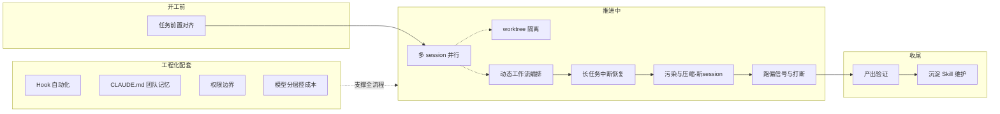

# 实操落地篇：真实任务里会遇到的问题和应对

前面已经记录了 AI 工具的配置、使用方式，以及 Loop / Context / Tool / RAG / MCP / Skill 这一批范式。那批文档回答的是"这些机制是什么、为什么这样设计"。

这篇回答另一个问题：**真实拿这些工具去完成任务时，会遇到什么情况，每种情况该怎么应对。**

它不是范式总结，是一份持续追加的复盘。每一条都是"遇到 X 情况 → 用 Y 应对 → 这样落地 → 别犯 Z 错"。后续遇到新的真实场景和技巧，会继续往里加。

## AI 的边界和使用者的杠杆

AI 的输出本质是概率采样。同一个任务跑十次，可能有一次特别好，几次平庸，几次跑偏。这像抽卡——你没法保证每次都抽到 SSR，但可以通过一些手段提高抽到 SSR 的概率。

**客观因素：好的模型强在哪里**

模型不是凭空生成的。它本质是训练时灌进去的海量数据——代码、文档、知识、模式——压缩后的产物。训练完成那一刻，里面"有什么可被引导出来"就固定了。这是使用者改变不了的客观边界：

- **训练数据的覆盖与质量**：模型见过哪些代码、哪些领域、哪些模式，决定了它"有什么能被激活"
- **理解与推理**：能读懂代码、形成假设、跨文件追踪调用链
- **生成能力**：能写代码、改代码、输出结构化文本
- **上下文窗口**：一次能容纳多少信息
- **概率采样的随机性**：同一个输入，每次激活的区域略有差异，输出也就不同——这正是"抽卡"的来源

模型强，本质是训练数据更全、质量更高，能被引导出来的高质量区域更多。但这是固定的——训练完就定了。使用者改变不了模型里有什么，能做的是通过输入，把模型里已经有的高质量能力引导出来。

这就解释了为什么人是"引导"而不是"指挥"：模型里已经存了大量高质量数据，你不需要教它怎么做，你需要的是用对的输入，把那部分高质量数据激活出来。

**主观因素：人能用来引导工具的技巧**

模型里有高质量数据，不代表每次都能激活。真正决定"这一次"能不能把高质量部分引导出来、抽到 SSR 的，是使用者的输入和操作。这些是这篇文章要讲的：

- **输入质量**：任务理解、分解、提示词——最大的杠杆
- **上下文装配**：塞什么、不塞什么、什么时候隔离
- **范式选择**：Plan / Goal / Spec / Loop 选对没有
- **工具与脚手架**：用 Loop 让 agent 多轮推进、用工具系统让它能读能改能验证、用 git 和状态文件让过程可回滚可复盘——这些能力是工具提供的，但用不用、什么时候用、怎么组合，是使用者的判断
- **介入时机**：什么时候打断、接力、放手
- **反馈信号**：给不给外部验证、怎么给
- **沉淀**：把一次好结果变成可复用的 Skill / 规划文件，并在使用中持续改进维护，让它越来越适配真实场景

这里有个认知要先建立：像开子 agent 探索、组多 agent 团队、上动态工作流这些机制，不是只能靠人手动指定。大多数支持这些功能的 agent（比如 Claude Code）接到任务后，会自己判断任务的复杂度和规模——简单的在主对话里直接做，复杂的自动派子 agent，超大的自动上工作流。人的角色因此不是"每次手动选机制"，而是：知道这些机制存在、各自适合什么，判断 agent 有没有自动用对，在该主动时主动指定，该放手时让 agent 自己跑。

> 客观模型决定能力上限，主观技巧决定单次能不能落在好结果上。

## 输入质量从哪来

前面说输入质量是最大的杠杆。但高质量输入不是一种能单独"搞到"的东西——它是你思考质量的外化。你能提升的不是"输入"本身，而是几个支撑它的能力。

**1. 想清楚的程度——这是输入质量的上限**

模型里有通用数据，但"这一次具体要什么、边界在哪、什么算 done"只有你知道。自己没想清楚，输入再精致也激活不到模型里对的区域。

怎么判断自己想清楚了？试着回答四个问题：
- 目标能用一句话说清吗（不是"做个好用的功能"这种模糊话）
- done 的判定是什么（怎么验证算完成）
- 边界在哪（做什么、不做什么）
- 有什么约束（不能动什么、必须保持什么）

回答不出来就是还没想清楚。一个自检：试着把任务讲给一个不了解项目的人，他能不能复述出来；讲不清，就是自己没想清。

对照：
- 没想清楚："把暗色模式做好"
- 想清楚了："给博客加暗色模式，覆盖正文、代码块、图片；跟随系统偏好；不动导航栏结构；done = 所有页面切换暗色无残留亮色元素"

**2. 和 agent 对齐迭代——把粗输入打磨成精输入**

别指望一次写对。先给一个粗的，然后让 agent 复述它理解的目标，对照找差距。

具体怎么做：
- 给完任务后问："你复述一下你理解的目标、边界、done 标准"
- 看复述里缺什么、错什么
- 缺的补、错的纠，再让它复述一次，直到它说的和你心里一致

几个有用的追问：
- "你打算先动哪些文件？为什么？"
- "这个任务有什么你没看到的约束？"
- "你觉得做到什么程度算完成？"

agent 复述和你的目标对不上的地方，往往就是你输入里没说清的地方——这个对照比闷头写输入更能发现问题。后面第一节"任务前置对齐"做的就是这个。

**3. 从复盘里提炼——沉淀"什么输入有效"**

每次跑完，问自己三个问题：
- 这次输入里哪一句让 agent 做对了关键决策？
- 哪个表述导致它跑偏了？
- 跑偏时它是怎么误解的？这个误解暴露了我输入里什么没说清？

提炼的不是"prompt 模板"，而是"这类任务必须说清楚的几个点"。比如发现每次重构都要说"不能改公共 API"，下次写输入时就先列这条。时间长了会沉淀出一套按任务类型分的"必须说清清单"。

这比抄任何 prompt 模板都有用，因为它是你自己场景里长出来的。

**4. 把模型里没有的东西写进去——这是差异化的部分**

模型有通用知识，但没有你这个项目的具体上下文、你的意图、你踩过的坑。判断一个信息模型有没有，问自己：换一个不了解这个项目的人，他知道吗？不知道，就该写进输入。

四类该写进去的：
- **项目特有的**：目录结构、包管理器、命名约定、构建命令（共享的进 `CLAUDE.md`，一次写长期生效）
- **你这次的意图**：为什么这样做、为什么不用另一种方案（模型不知道你的取舍理由）
- **你踩过的坑**："注意：之前这块因为 X 出过问题"（模型没有你的经验）
- **隐性约束**：这个文件不能动、这个 API 是稳定的别改、这个测试有原因别删（模型看不到这些约束）

这部分是别人替代不了的，也是输入质量里真正的护城河。

**5. 警惕"输入质量 = 输入格式"的误区**

不是越长越好、不是套模板就好、不是堆结构化就好。信号准确度 > 格式精美。一句话能说清的别写三段。格式是为信号服务的，不是反过来。

常见的格式误区：
- **堆背景**：和这次任务无关的项目历史、技术栈介绍——噪声
- **套模板**：每次先来一段"你是一个资深工程师..."——agent 已经知道，就是浪费
- **过度结构化**：把简单任务拆成 10 个小节——结构比内容还重

---

读完这五点，一个现实的问题：真正用的时候想得起来吗？

大概率想不起来。这很正常——方法论不会自动变成反应，看过的东西不等于用的时候想得起。

所以这五点的真正价值不是"用的时候查"，而是**"复盘的时候对照"**。用的时候靠机制，不靠记忆：把最关键的一两条（比如"开工前过一遍 done 标准""让 agent 复述目标"）固化成检查点，写进 `CLAUDE.md` 或做成 Skill，让工具替你记、到点触发。你不需要想起来，只需要按流程走。

> 像 superpowers 这类 skill 集合做的就是这个：把工作流方法论封装成 Skill，让工具识别到对应任务时自动调用，使用者不用记、只用走流程。

内化靠复盘倒逼：每次跑完，对照这五条看哪条没做到——几次下来，下次用的时候自然就想起来了。肌肉记忆是复盘出来的，不是背出来的。

也别追求五条全想起。抓住最关键的一两条练成肌肉记忆，已经能挡掉大部分返工；剩下的几条，留在复盘时对照就够了。

> 核心转变是从"找好的 prompt"转向"提升自己的思考和对齐能力"——想清楚了、对齐对了，输入质量自然就有；直接追着输入质量跑，反而容易陷入抄模板、堆格式。

下面 13 条实操，就是把这些主观技巧——包括怎么想清楚、怎么对齐、怎么复盘——落到具体场景里。

## 这些场景的全景

按一个任务的生命周期，会遇到的问题大致分四段：

下面逐条展开。每条按"落地步骤 / 反模式 / 一个真实例子"来写。

## 一、开工前：任务前置对齐

拿到任务直接丢给 agent 开跑，是大多数返工的来源——它理解的任务和你以为的不是同一个。开工前先和 agent 做一轮前置讨论：定范式、对提示词、落规划文件。

**落地步骤**

1. 先口述任务背景，让 agent 复述它理解的目标，对照你心里那个目标找差距
2. 一起判断该用哪种协作范式——看你想回答的核心问题是什么：

| 范式 | 核心问题 | 适合什么 | 退出机制 |
|------|----------|----------|----------|
| Plan | 怎么做？ | 设计不明确，想先看方案再决定做不做 | 方案 approve 后才执行 |
| Goal | 达成什么？ | 有清晰可验证的完成标准，让它自己推到达成 | 条件满足自动停 |
| Spec | 做什么/不做什么？ | 有清晰规范、需多次迭代的工程任务 | 规范贯穿迭代，归档完成 |
| Loop | 多久做一次？ | 需要按固定间隔重复做某件事 | 手动停或过期 |

这四个是组合关系，不是互斥——一个 Plan 任务可以派给 Explore 子 Agent 做调研，一个 Goal 任务可以用 Loop 周期性触发。这里判断的是"人怎么跟 agent 协作"，和"用哪个子 Agent 跑"是两个独立维度，别混在一起选。

3. 把对齐结果写进规划文件（`PLAN.md` / `spec.md` / `TODO.md`），让后续有据可依
4. 提示词定稿后再正式开工

**反模式**

任务没对齐就开跑，跑出来不对，再回头改需求、改提示词重来。一次对齐的成本，远低于一次返工。

**一个真实例子**

需求是"把这个博客的暗色模式做好"。

直接开跑的话，agent 会按自己的理解做一版，大概率和你要的不一样——它可能只改了背景色，没管代码块、图片、引用块。

前置对齐时先问 agent："你理解的好是什么？"它会列出来。你再补："代码块要换成深色主题、图片要加透明背景处理、跟随系统偏好。"这些写进 `spec.md`，然后再动手，一次到位。这其实就是在用 Spec 范式——先把"做什么/不做什么"对齐成规范，再按规范实现。

## 二、多任务并行：多 session

同时有好几个独立任务（改文档、调研选型、修个小 bug），串行做太慢。开多个 session 并行，每个 session 一个独立任务。

**落地步骤**

1. 先确认任务之间真的独立——不改同一批文件、不依赖彼此的产出
2. 每个 session 给清晰的单任务边界，不要在一个 session 里塞两件事
3. 用一份外部的 TODO 清单跟踪哪个 session 在做什么、进度到哪了

**反模式**

任务之间有依赖却并行，结果后一个任务基于前一个还没完成的产出在跑，互相覆盖。并行只对真正独立的任务有意义。

**一个真实例子**

同时要做三件事：改一篇文档、调研某个 API 的用法、修一个无关模块的小 bug。这三个互不干涉，开三个 session 并行。三件事的完成时间取决于最慢的那个，而不是三者之和。

## 三、文件冲突隔离：worktree

多 session 并行时，如果两个任务可能改同一批文件，会出现互相覆盖、改了被冲掉的问题。用 worktree 给冲突的任务各自开一个独立工作树，物理隔离。

**落地步骤**

1. 识别哪些任务可能改同一片代码（同一模块、同一文件）
2. 给这些任务开 worktree，每个 worktree 一个独立分支和工作目录
3. 各自完成后，按顺序合并回主分支，冲突在合并时解决，而不是在执行时互相踩

**反模式**

在同一个工作目录里并行跑两个会改文件的任务，你改完它又改回去，diff 一团乱。

**一个真实例子**

同时重构一个组件的"样式层"和"逻辑层"。两者都会动到同一个组件文件。开两个 worktree：一个改样式、一个改逻辑，互不干扰。各自测完，先合并样式，再合并逻辑（逻辑 rebase 到样式之后），冲突在最后一步统一处理。比在同一个目录里来回切安全得多。

## 四、超大任务编排：动态工作流

任务大到单个 session 跑不动——比如给一整个文档站每篇都补一节、给全仓库统一替换某种模式、一次迁移几十个文件。塞给一个 session，上下文会爆，而且大部分时间在串行等。用动态工作流（Workflow）把大任务拆成可并行的子任务，多个 agent 同时推进。

**落地步骤**

1. 把大任务拆成"同构、可并行"的子任务（每篇文档一个 agent、每类文件一个 agent）
2. 用 Workflow 编排：fan-out 并行 + 必要时 pipeline 串行
3. 主流程只收集各 agent 的汇总结果，不进入子任务的细节上下文
4. 设定清晰的退出条件，避免工作流无限跑

**反模式**

把超大任务硬塞给单个 session。要么上下文爆掉，要么前面改的到后面已经被压缩忘了，前后不一致。

**一个真实例子**

给一个有 30 篇笔记的文档站，每篇都补一段"可观测性"相关内容。单 session 跑：改到第 10 篇上下文就开始失忆，前后风格不统一。动态工作流：写一个工作流脚本，每篇文档派一个 agent，每个 agent 拿到同样的指令但只处理一篇。30 个 agent 并行（受并发上限约束分批跑），主流程只收"改完了/没改完/哪里有问题"的汇总。主上下文干净，子任务各自独立。

## 五、长任务中断恢复

长任务跑到一半，session 断了、或者上下文被压缩了关键信息。重新接上时，agent 已经忘了之前做到哪、为什么这么决策。从一开始就把状态落到文件里，不要只存在上下文里。

**落地步骤**

1. 任务开工就建状态文件，写下目标、子任务、当前进度。形式按任务选：`PLAN.md` / `TODO.md` 适合人读的进度记录；JSON 适合结构化数据（已处理/未处理条目、带字段的状态），方便程序化读取和更新；如果在用 Spec 范式，proposal / design / specs / tasks 这套产物本身就是状态记录，每阶段产出就是断点续做的依据
2. 每完成一步，更新状态文件（这一步要显式做，不能假设 agent 会自动维护）
3. 中断后新开 session，第一步先读状态文件，再决定从哪接
4. 关键决策（为什么选 A 不选 B）也写进去，不只是写"做了什么"

**反模式**

状态只存在上下文里。session 一断、一压缩，agent 就失忆，要么重做、要么继续往前错。

**一个真实例子**

一个跨 8 个文件的重构，做到第 5 个文件时 session 到了上限。如果状态只在上下文里：新 session 不知道前 4 个文件改了什么、整体计划是什么，要么从头来，要么瞎接。如果中途维护了 `TODO.md`：新 session 先读 TODO，看到"已完成 1-4，正在做 5，5 的方案是 X 因为 Y"，直接从 5 接上。差距是几分钟和几个小时的差别。

## 六、上下文污染与会话压缩：什么时候该开新 session

开新 session 不只是"跑偏了"才需要。有两个常见触发点。

**触发一：上下文污染**

session 跑偏了——试了好几个假设都没成，上下文里堆了一堆失败尝试、被推翻的路径、无关报错。继续在这个 session 里跑，新方向会被旧噪声拖累。

**触发二：会话压缩的成本**

上下文长了，agent 会自动压缩（compaction）来腾空间。但压缩本身要花 token——模型要读旧上下文、生成摘要，这一来一回都是成本。更关键的是，压缩会丢信息：它保留"看起来重要"的，丢掉"看起来不重要"的，而被丢掉的有时恰恰是后面需要的。一个 session 跑得越久，压缩次数越多，累计的 token 成本和信息损失越大。

到了该压缩的临界点，与其让它压缩后继续跑，不如新开一个干净 session，只带必要的结论和状态过去——既省了压缩的 token，也避开了压缩丢信息的风险。

**落地步骤**

1. 识别该开新 session 的信号：
   - 污染信号：3 轮以上失败尝试、agent 重复之前试过的方法、自我合理化
   - 压缩信号：上下文接近上限、已经触发过一次以上压缩、任务还有很长一段没做完
2. 把"已经确认的事实"和"待验证的假设"单独写出来（不要把整个失败过程或长历史带过去）
3. 新开 session，只带确认的事实和当前目标，不带失败历史和冗长上下文
4. 探索性、调研性的任务，从一开始就用子 agent 做，结果回主 session——主上下文从一开始就不接噪声，也推迟压缩的到来

**反模式**

两种都要避免：一是在污染的 session 里"再试一次"，token 烧完越试越偏；二是任由 session 反复压缩硬撑，压缩的 token 成本和信息损失累计下来，比新开一个 session 还贵。

**一个真实例子**

调试一个缓存 bug，在同一个 session 里试了三个假设：竞态、序列化、TTL。三个都失败，过程全留在上下文里。第四个假设其实是对的，但 agent 在前三个的噪声里反复绕，跑不出来。而且上下文已经长到触发了两次压缩，每次压缩又花了一批 token。

正确做法：把"已确认不是竞态、不是序列化、不是 TTL""当前怀疑是失效策略"这几句写出来，新开 session 只带这些。干净上下文下，第四个假设很快验证通过，还省掉了继续压缩的 token。

## 七、早期跑偏信号与打断

agent 跑着跑着偏了，但不会主动告诉你"我偏了"。等完全错才发现，已经烧了一大段 token。盯早期信号，及时打断并重置。

**落地步骤**

1. 盯这几个早期信号：
   - 重复读同一批文件，假设却没有更新
   - 修改范围不断扩散（从改一个函数变成改一片文件）
   - 验证一直不通过，但没有换策略
   - 开始"解释"为什么之前的方法其实没问题（自我合理化征兆）
2. 信号出现就打断，打断时做三件事：
   - 指出卡点（"你已经在同一个假设上试了三轮"）
   - 给一个新方向或新信号（"先放下这个假设，去看 X"）
   - 明确让它放弃已被推翻的路径，而不是"再试一次"

**反模式**

"再给它一轮机会"。跑偏的 session 不会自己修正，多给一轮通常只是多烧一轮 token。

**一个真实例子**

让 agent 修一个测试失败。它一直认为是测试本身写错了，反复读测试文件、改测试断言，越改越远。早期信号：它已经改了三次断言，每次改完测试还是失败，但它没去读被测代码。打断："你一直在改测试，没看过被测的 `cache.py`。先放下测试断言这条线，去读 `cache.py` 的失效逻辑。"——方向一换，很快就定位到真正的 bug。

## 八、产出验证

agent 说"完成了"。但怎么确认真的对了？光信它的话，很容易收到一个看起来对、实际有问题的产出。用外部信号验证，不要只靠 agent 自评。没有现成测试的任务，人为造一个信号出来。

**落地步骤**

1. 优先用现成的外部信号：测试、类型检查、lint、build
2. 没有现成测试时，人为构造验证：
   - 给检查清单（要覆盖哪几个点，逐条对照）
   - 给对照标准（达到某个参照物的程度算够）
   - 阶段性产出审查（不要等全部写完才看）
3. 验证不通过，把失败信号丢回 agent，让它修，而不是自己上手替它改

**反模式**

agent 说 done 就信，尤其对没有测试的任务（写文档、重构、调研）。这种任务最容易交付一个"看起来对"的结果。

**一个真实例子**

让 agent 写一篇技术文档。没有测试可跑。如果它说"写完了"就交差，大概率漏掉关键点、或者某一段深度不够。人为造信号：给它一份清单——"要覆盖原理、要有一个代码例子、要有一段踩坑、要和已有文档的风格一致"。逐条对照，哪条没达到就打回去补哪条。这比"再检查一下"有用得多，因为检查标准是具体的。

## 九、高频套路沉淀成 Skill + 持续维护

某个任务流程你反复在做——每次发版前的一套检查、每次新建一个模块的套路、每次写完文档的一套校对。每次都重新描述一遍，既慢又容易漏。把它编成 Skill。但 Skill 不是写完就完，要靠每次使用持续维护更新，让它越来越适配你的真实场景。

**落地步骤**

1. 先判断是否值得封装：用过 3 次以上、流程相对稳定、有明确的输入输出
2. 写成 Skill：提示词（说清楚怎么做）+ 必要的权限配置
3. 每次用完复盘：这次哪里 Skill 没覆盖到、哪里提示词不够准，回去更新
4. 警惕过度封装：一次性的、还在探索的任务别封装成 Skill，否则维护成本超过收益

**反模式**

两种都要避免：一是把一次性任务也封装成 Skill，越积越多最后自己都不记得有哪个；二是写完 Skill 就不管了，用着不顺手也不更新，最后还是回到手动描述。

**一个真实例子**

每次发版都要走一套流程：跑测试、更新版本号、写 changelog、打 tag、推送。第一次手动带着 agent 走一遍。第二次又走一遍，发现步骤一样。第三次封装成 `release` Skill：提示词里写清楚每一步、禁区（不能直接 push 到 main）、确认点。之后每次发版直接调 `release`。某次发现忘了更新 changelog 的某个格式——回去补进 Skill。再某次发现 tag 命名规则变了——再更新。Skill 不是一次性产物，是跟着任务场景一起演进的。

## 十、重复动作自动化：Hook

每次改完代码都要手动跑 lint、每次保存都要格式化、每次提交前都要跑测试。这些是规则明确的重复动作，手动做既烦又容易漏。用 Hook 在特定事件自动触发，把规则明确的重复动作交给机制。

**落地步骤**

1. 识别"规则明确、不需要判断"的重复动作（格式化、lint、测试、构建）
2. 配 Hook 在合适的时机触发（编辑后、提交前、工具调用后）
3. 区分清楚：需要判断的（要不要改这段逻辑）不适合自动化，仍要人来

**反模式**

把需要判断的事也塞进 Hook。Hook 越配越多，互相干扰，最后不知道哪个 Hook 在什么时候触发了什么。Hook 只该承接"确定的事"。

**一个真实例子**

每次改完 Python 文件都要跑 ruff 格式化和 lint。手动跑：经常忘，代码风格不统一。配一个 Hook：编辑 `.py` 文件后自动跑 ruff fix。从此不用记这件事，风格自动统一。但"这段逻辑要不要重构"这种判断，不进 Hook，仍然人来决定。

## 十一、团队共享记忆：CLAUDE.md

团队里每个人都在重复教 agent 同一套项目约定：用 pnpm 不用 npm、提交信息要带前缀、这个目录不能动、测试用这个命令。把团队级的项目约定写进 `CLAUDE.md`，让所有人在所有 session 里共享这套记忆。

**落地步骤**

1. 区分个人套路和团队共享：团队约定进 `CLAUDE.md`，个人偏好留在本地配置
2. `CLAUDE.md` 里写：技术栈和包管理器、目录结构和禁区、提交和代码规范、测试和构建命令、项目特定的注意事项
3. 把它当活文档，项目约定变了就更新

**反模式**

把个人偏好塞进团队 `CLAUDE.md`——比如你个人喜欢某种命名风格，但团队没这个约定。这会污染所有人的 session。团队记忆只放团队共识。

**一个真实例子**

项目用 pnpm，但 agent 默认会跑 npm install。不写进 `CLAUDE.md`：每个人第一次用都要纠正一次 agent，纠正完那一次也就只在那次 session 里有效。写进 `CLAUDE.md`："本项目的包管理器是 pnpm，所有 install/run 命令用 pnpm。"——所有人、所有 session 默认就知道。一次写入，长期生效。

## 十二、破坏性操作的权限边界

agent 能跑命令、能改文件、能 push。其中有些操作是破坏性的——删文件、force push、改生产配置、跑数据库迁移。一旦做错，回滚成本极高。给破坏性操作配权限边界，高危操作永远要求人工确认。

**落地步骤**

1. 识别破坏性操作类别：删除、覆盖、push/merge、部署、生产环境操作、密钥和环境变量修改
2. 配 permission：这些操作必须确认，不能自动执行
3. 高危的（force push、生产部署、删数据库）永远人工确认，不图省事全开
4. 让所有修改尽量可回滚——优先 git 管理，diff 可见、commit 可退

**反模式**

为了"让 agent 跑得顺"，把权限全开。顺是顺了，直到有一天它执行了一个你没想到的破坏性命令，而你没有确认机会。

**一个真实例子**

agent 在跑一个清理任务时，决定删掉一批它认为"没用"的临时文件——其中包含一个其实还在用的配置文件。如果删除操作没配确认：文件直接没了，得从 git 找回来，浪费半小时。配了确认：删除前弹确认，你看到那个配置文件在列表里，喊停。代价是多点一次确认，收益是挡掉了一次真实事故。

## 十三、成本控制：模型分层

长任务、大任务 token 烧得很快。全程用最强模型，很多 token 其实花在了不需要那么强的事情上——读文件、grep、简单判断。模型分层：感知类、廉价判断类的活用便宜模型或子 agent，关键决策才用强模型。

**落地步骤**

1. 识别任务里哪些是"廉价感知"：读文件、grep、初筛、格式判断、简单分类
2. 这些用便宜模型，或者派给子 agent 做（主 agent 只收汇总）
3. 关键决策——架构选择、复杂逻辑修改、提示词设计——用强模型
4. 监控 token 消耗，发现某类任务稳定烧钱就考虑分层优化

**反模式**

全程用最贵模型做读文件这种事。能力强是能力强，但花在最贵模型上的 token，大部分本可以用便宜模型覆盖。

**一个真实例子**

大仓库里调研"哪些地方用了某个 deprecated API"。全程强模型：它一个文件一个文件读，每个都要算 token，几十个文件下来成本很高。分层：派一个便宜模型的子 agent 做初筛，只回"哪些文件可能用了、哪些肯定没用"。主 agent（强模型）只看子 agent 汇总出来的几个候选文件，做精确判断。总成本是原来的几分之一，结论一样准。

## 把这些场景用起来

这 13 条不是清单，是一套配合关系。一个真实任务通常会穿过好几条：

- 开工时先**前置对齐**（一），定范式、落规划文件
- 任务独立就**多 session 并行**（二），可能冲突就开 **worktree**（三）
- 任务超大就上**动态工作流**（四）
- 长任务靠**规划文件保状态**（五），污染或压缩了靠**开新 session**（六），跑偏了靠**打断重置**（七）
- 收尾时做**产出验证**（八），高频套路**沉淀成 Skill**（九）
- 全程靠 **Hook 自动化**重复动作（十）、**CLAUDE.md** 共享团队记忆（十一）、**权限边界**挡破坏性操作（十二）、**模型分层**控成本（十三）

配套那四条（十到十三）不是某个阶段才用，而是开工前一次性配好、全程生效的底座。

## 落地的本质

回头看整篇的认知链：客观上模型是训练数据的压缩，能力上限固定，人是引导不是指挥；主观上输入质量是最大的杠杆，它从想清楚、对齐迭代、复盘提炼、写入隐性知识里来；方法论不会自动变成反应，要靠机制固化、复盘内化；13 条实操是把这些落到具体场景的脚手架。

这些都做到之后，剩下的差距就不是技巧能补的了——是人的品味、认知、经历和见识。这些决定了你看到问题时能不能想到对的角度、写输入时知不知道什么是好的、复盘时能不能看出门道。

这部分没法靠方法论速成，但有具体的积累路径：从好项目里吸收。看一个用得好的开源项目、一个设计精良的 Agent 实现、一份写得清楚的 spec，去拆它为什么好——结构、判断、取舍。吸取精华，弃其糟粕，慢慢沉淀成自己的判断力。

方法论可以一次学会，机制可以一次搭好，但品味和见识只能靠这样一点点攒。而这，才是"抽到 SSR"最后一层、也是最难替代的杠杆。

这篇复盘会持续更新——后面遇到新的真实场景和技巧，会接着往里加。
