# Agent Loop 循环设计篇

Agent 的核心不是模型，而是**循环**。

不管你用不用框架，AI Agent 的本质都是一个自主决策循环：

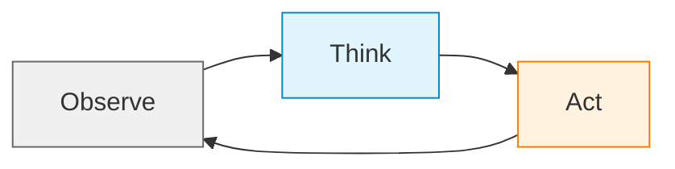

这个循环怎么设计，决定了 Agent 的行为边界、可靠性、可观测性和可维护性。

本文从五个部分来记录：

1. **用原始代码编排循环**——不依赖框架，自己手写循环的完整思路
2. **用框架编排循环**（LangChain 1.0 / LangGraph）
3. **循环设计的核心细节**（消息历史、观测窗口、工具可靠性、错误恢复、配置体系）
4. **退出条件体系**——整个循环设计里最重要也最容易缺陷的部分
5. **慢思考**——从快思考到深度推理的策略集合
6. **常见陷阱**

最后再覆盖几种 Agent 设计模式在循环中的位置，以及一份设计检查清单。

---

## 先建立坐标系：Agent 的自主性等级

在讨论循环设计之前，先明确一个坐标系。Agent 不是非黑即白的概念，而是从 L0 到 L5 的谱系：

| 等级 | 名称 | 特征 | 循环复杂度 |
|------|------|------|-----------|
| **L0** | Chatbot | 你说一句它答一句 | 无循环 |
| **L1** | Tool Agent | 你让它查，它调 API 返回 | 单轮调用 |
| **L2** | ReAct Agent | 思考→行动→观察，多轮循环 | 基础循环 |
| **L3** | Planning Agent | 先拆任务，再逐项执行 | 嵌套循环 |
| **L4** | Multi-Agent | 多个专业 Agent 协作 | 多循环 + 协调层 |
| **L5** | Autonomous | 长期自主运行，环境自适应 | 复杂自适应循环 |

本文聚焦 **L2-L4**。L0-L1 不需要复杂的循环设计，L5 目前还没有真正可靠的实现。

---

## 维度一：用原始代码编排循环

### 理解 Agent 的核心组件

任何 Agent 系统，无论是否用框架，都包含四个核心组件：

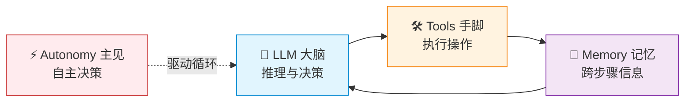

- **LLM（大脑）**：负责推理和决策。它决定下一步做什么
- **Tools（手脚）**：执行具体操作。LLM 只会"想"，Tools 让它能"做"
- **Memory（记忆）**：保持跨步骤的信息。短期记忆是当前消息列表，长期记忆是跨会话的持久化知识
- **Autonomy（主见）**：自己做决定的能力。这是 Agent 和普通 Chatbot 的根本区别——需要你在循环中赋予它"自己判断下一步"的逻辑

这四个组件的关系决定了循环的结构：LLM 在 Memory 的上下文中推理，决定调用什么 Tool，Tool 执行后把结果写回 Memory，然后 LLM 再次推理。

还有一个常被忽略的组件——**护栏（Guardrails）**。它不是 Agent 的组成部分，但它决定 Agent 能不能上生产：预算控制、权限边界、审批流程、审计日志。没有护栏的 Agent，迟早从"自己干活"变成"自己闯祸"。

### 理解与传统软件的根本区别

传统软件是**确定性**的：给定输入 A，必然产出 B。

Agent 是**概率性**的：给定输入 A，它会"思考"该怎么做，可能产出 B，也可能产出 C。每次运行的路径可能不同。

这带来灵活性，也带来不确定性。循环设计的核心挑战就是**在不牺牲灵活性的前提下，约束不确定性**。

### 从最小化 Agent Loop 开始

不用框架，核心逻辑可以控制在 100-200 行内完成。

在写循环之前，先定义一个贯穿所有代码的配置对象，这样每一部分都基于同一套参数工作：

```python
@dataclass
class AgentConfig:
    """ReAct 循环的完整配置"""
    # 循环参数
    max_iterations: int = 10       # 最大轮数，防无限循环
    min_iterations: int = 1        # 最小轮数，防第一轮就偷懒
    observation_window: int = 3    # 上下文管理：保留最近几轮的消息
    
    # 预算护栏（与循环模式无关，通用约束）
    token_budget: int = 100000     # 单次任务最大 token 消耗
    timeout_seconds: int = 300     # 端到端超时
```

这个配置会作为参数传入所有函数，保证它们对"什么情况下该停、该保留多少上下文"有统一的判断。

#### 工具调用：safe_tool_call

```python
def safe_tool_call(tool_name: str, tool_args: dict, tools: dict) -> dict:
    """带校验的工具调用：校验通过则执行，失败则返回错误原因让 LLM 自己修正"""
    # 1. 校验工具名是否存在
    if tool_name not in tools:
        return {"error": f"工具 '{tool_name}' 不存在", "available_tools": list(tools.keys())}
    
    # 2. 参数校验
    tool = tools[tool_name]
    try:
        # 假设工具通过 schema 描述其参数要求，比如 Pydantic model 或 JSON Schema
        validated_args = validate_with_schema(tool_args, tool.schema)
    except ValidationError as e:
        return {"error": f"参数校验失败: {e}", "expected_schema": tool.schema}
    
    # 3. 执行工具。失败则返回错误信息，由 LLM 自行判断如何修正
    try:
        return tool(**validated_args)
    except Exception as e:
        return {"error": f"工具执行异常: {type(e).__name__}: {str(e)}"}
```

关键设计理念：**校验层不重试**。把错误信息返回给 LLM 让它自己修正，而不是框架在底层默默重试。重试的决策权在 LLM，循环的上层已经有 MaxIterations 兜底。

#### 上下文管理：build_messages

```python
def build_messages(messages: list, config: AgentConfig) -> list:
    """构建本轮 LLM 调用需要的上下文。
    
    两层策略：
    1. 窗口限制：只保留最近 N 轮的消息
    2. 预算裁剪：仍超限则对早期部分做摘要压缩
    """
    # 第一层：按 observation_window 截取
    recent = messages[-(config.observation_window * 2):]
    
    # 第二层：按 token_budget 压缩
    if count_tokens(recent) > config.token_budget:
        keep_latest = messages[-4:]  # 至少保留最后两轮
        early = messages[:-4]
        summary = llm.summarize(early)
        return [
            {"role": "system", "content": f"以下是之前对话的摘要: {summary}"}
        ] + keep_latest
    
    return recent
```

`build_messages` 的输入是原始消息列表，输出是经过裁剪的上下文。它不修改原始消息列表——修改由循环的 Observe 阶段负责。

#### 退出判断：should_stop

```python
def should_stop(state: dict, config: AgentConfig) -> bool:
    """
    综合判断是否退出循环。
    判断顺序：用户中断 → 硬护栏 → 兜底上限 → 最小轮数 → 软判断
    """
    # 0. 用户中断（最高优先级）
    if state.get("user_canceled"):
        return True
    
    # 1. 硬护栏：预算/超时（不依赖 LLM 判断）
    if state.get("total_tokens", 0) >= config.token_budget:
        return True
    if state.get("elapsed_seconds", 0) >= config.timeout_seconds:
        return True
    
    # 2. 达到最大轮数（兜底硬限）
    if state["step"] >= config.max_iterations:
        return True
    
    # 3. 还没到最小轮数（防第一轮偷懒，继续）
    if state["step"] < config.min_iterations:
        return False
    
    # 4. LLM 完成任务 + 至少执行过一次工具（软判断）
    if state["last_output"].get("is_final") and state["tools_executed"] > 0:
        return True
    
    # 5. 结果收敛（连续观察没有新进展）
    if is_converged(state.get("observations", [])):
        return True
    
    return False
```

#### 串联：react_loop

前面定义的 `safe_tool_call`、`build_messages`、`should_stop` 在下面的 `react_loop` 中汇合——`build_messages` 在 Reason 阶段前裁剪上下文，`safe_tool_call` 替代工具调用的裸调用，`should_stop` 在每轮开始前检查是否应该提前退出：

```python
def react_loop(
    prompt: str,
    tools: dict,
    config: AgentConfig
) -> str:
    """ReAct 循环：Reason → Act → Observe 迭代，串联 build_messages、
       safe_tool_call、should_stop 三个组件"""

    messages = [{"role": "user", "content": prompt}]

    # 状态跟踪（供 should_stop 读取）
    state = {
        "step": 0,
        "total_tokens": 0,
        "tools_executed": 0,
        "user_canceled": False,
        "elapsed_seconds": 0.0,
        "last_output": {},
        "observations": [],
    }
    start_time = time.time()

    for step in range(config.max_iterations):
        state["step"] = step
        state["elapsed_seconds"] = time.time() - start_time

        # ========== Phase 1: Reason（思考）==========
        # 调用 build_messages 裁剪上下文，控制 token 总量
        context = build_messages(messages, config)
        response = llm.invoke(context)
        messages.append({"role": "assistant", "content": response})
        state["last_output"] = response
        state["total_tokens"] += count_tokens(response)

        # 解析 LLM 输出：有 tool_calls 表示要执行工具，否则表示直接回答
        tool_calls = response.get("tool_calls", [])

        if not tool_calls:
            # LLM 选择直接回答，判为任务完成
            # 但在返回前需要经过 should_stop 的硬限检查
            state["last_output"]["is_final"] = True
            if not should_stop(state, config):
                return response.get("content", "")
            break  # 硬限触发，走循环底部的降级返回

        # ========== Phase 2: Act（行动）==========
        # 用 safe_tool_call 替代裸调用，获得参数校验和错误隔离
        tool_results = []
        for tc in tool_calls:
            result = safe_tool_call(tc["name"], tc["args"], tools)
            tool_results.append(result)
            state["tools_executed"] += 1
            state["observations"].append(result)

        # ========== Phase 3: Observe（观察）==========
        # 把工具结果写回消息列表，供下一轮 Reason 使用
        for tc, result in zip(tool_calls, tool_results):
            messages.append({
                "role": "tool",
                "content": str(result),
                "tool_call_id": tc["id"]
            })

        # 每轮结束时检查应否提前退出（硬护栏 + 软判断）
        if should_stop(state, config):
            break

    # 硬限触发或循环正常结束：返回已有成果而不是抛异常
    return extract_partial_result(messages)
```

关键的设计要点：

- **`tool_calls` 统一在 Reason 阶段后解析一次**，Act 和 Observe 阶段共用同一个列表，避免了 `response.get("tool_calls")` 和 `response.tool_calls` 混用的问题
- **`should_stop` 在两个位置调用**——Reason 阶段 LLM 表示完成后检查一次（确认硬限没有触发再返回），Observe 阶段结束后再检查一次（覆盖收敛检测和软判断）。两次检查覆盖的场景不同
- **硬限触发时不抛异常**，调用 `extract_partial_result(messages)` 返回已有的产出。预算耗尽的场景下用户不应看到报错，而是看到"做了多少事"

这个循环已经体现了 ReAct 的核心价值：**把"猜答案"变成了"查证据 + 可追溯"**。它依然会犯错，但你能看到错在哪，也能把它拉回来。

相比你常见到的"一句话调接口"的 demo，这个循环多了三层你没看到的东西：
- **错误隔离**：`safe_tool_call` 捕获所有工具异常并以消息形式返回给 LLM，循环不会因为一个工具挂掉就整体崩溃
- **上下文管理**：`build_messages` 在每轮 Reason 前控制消息数量，避免无限增长吃光预算
- **分层退出**：`should_stop` 的六层判断覆盖了从用户中断到结果收敛的全场景

### 拆解 ReAct 的三个阶段

每个 Agent 循环都可以拆成三个阶段性操作。理解它们，你就知道循环的每一步在干什么。

**Reason（思考）——分析当前情况，决定下一步**

```
输入：用户目标 + 历史观察结果
输出：下一步要做什么，为什么
```

设计原则：**只想一步**。不要让 LLM 想太远，它会发散。告诉它"基于当前信息，你的下一个动作是什么？"

**Act（行动）——调用工具，执行动作**

```
输入：思考阶段决定的动作
输出：执行结果
```

设计原则：**一轮只推进一个关键动作**。前期调试时尤其重要，动作越小越容易定位问题。等流程跑顺再考虑并行调用。

**Observe（观察）——记录执行结果**

```
输入：行动的执行结果
输出：结构化的观察记录
```

设计原则：**观察要客观**。不要在这个阶段做判断，只记录事实。判断留给下一轮的 Reason。

### 在原始代码中处理工具、记忆与循环

不依赖框架时，你需要自己处理以下问题：

**消息历史的管理**

每一轮循环都会产生新消息。最简单的做法是全部保留，但有三个问题：
- Token 消耗持续增长
- 早期不相关的消息稀释注意力
- 对话太长时模型可能忽略中间内容

上面的 `react_loop` 示例中已经通过 `build_messages` 做了两层管理——窗口限制（保留最近 N 轮）和预算裁剪（超限时做摘要压缩）。生产中同样适用这个策略。

**工具调用的可靠执行**

LLM 输出的工具调用不一定正确，常见错误模式：

- LLM 传了不存在的参数名
- LLM 拼错了工具名（尤其是工具列表过长时）
- 工具 B 需要工具 A 的输出，但 LLM 直接编了一个值

上面的 `safe_tool_call` 通过三层校验（存在性→参数 Schema→执行）解决了这些问题。关键设计理念是**校验层不重试**——把错误信息返回给 LLM 让它自己修正，而不是框架在底层默默重试。这样做的原因是 LLM 可能需要换一个工具而不是重试同一个，重试的决策权在 LLM 不在代码，循环的上层由 `should_stop` 的 MaxIterations 兜底。

**循环的退出判断**

上面的 `should_stop` 集中了所有退出判断，判断顺序为：用户中断 → 预算/超时硬护栏 → 最大轮数 → 最小轮数检查 → LLM 自主判断 → 结果收敛检测。和上面 `react_loop` 中的 `state` 对象配合使用。

在生产环境中，一些容易被忽略的经验：

- **MinIterations 可以防过早退出**：你遇到过 Agent 第一轮就说"完成了"但什么都没干吗？真实案例——用户问"查明天天气"，Agent 回答"明天晴 25°C"，但根本没调天气 API。`config.min_iterations = 1` 强制至少做一次工具调用
- **结果收敛检测不需要复杂语义分析**：连续两次观察结果完全相同或者文本相似度很高，基本就是卡住了。一个简单的字符串比较就够了
- **要求"完成"的判断必须伴随至少一次工具执行**：Agent 说完成了但一个工具都没调过，说明在凭训练数据编答案。`should_stop` 中的 `state["tools_executed"] > 0` 就是这道闸

### 在原始代码中搭建更复杂的循环

ReAct 模式是基础。在此基础上，你可以通过调整循环结构来支持更复杂的行为。

**Plan-and-Execute 的循环结构**

外层循环负责"计划→执行→评估"，内层循环负责执行具体步骤：

```python
def planning_agent_loop(task: str, max_iterations: int = 3):
    """Plan-and-Execute 循环：分解 → 执行 → 评估覆盖度 → 迭代补充"""
    # 1. 分解任务：把模糊需求变成具体的子任务列表
    #    每个子任务声明 Produces/Consumes 来定义依赖关系
    plan = decompose_task(task)
    
    # 2. 按拓扑顺序执行子任务（无依赖的可并行，有依赖的串行）
    def execute_subtask(subtask):
        """子任务内部可以是一个独立的 ReAct 循环"""
        if subtask.type == "search":
            return search_and_summarize(subtask.query)
        elif subtask.type == "analyze":
            return analyze_data(subtask.inputs)
        else:
            return react_loop(subtask.instruction, tools)
    
    results = {}
    for subtask in topological_sort(plan.subtasks):
        result = execute_subtask(subtask)
        results[subtask.id] = result
    
    # 3. 综合当前结果，生成初稿
    synthesis = synthesize(task, results)
    
    # 4. 评估覆盖度，决定是否补充
    #    评估由 LLM 完成，但用确定性规则兜底
    for iteration in range(max_iterations):
        coverage = evaluate_coverage(
            query=task,
            current_synthesis=synthesis,
            iteration=iteration,
            max_iterations=max_iterations
        )
        
        # 确定性护栏：覆盖 LLM 判断的不稳定区域
        # 规则 1：第一次迭代 + 低覆盖度 → 必须继续
        if iteration == 0 and coverage.overall_coverage < 0.5:
            should_continue = True
        # 规则 2：存在关键缺口 + 还有次数 → 必须继续
        elif len(coverage.critical_gaps) > 0 and iteration < max_iterations - 1:
            should_continue = True
        # 规则 3：达到最大迭代次数 → 必须停止
        elif iteration >= max_iterations - 1:
            should_continue = False
        else:
            should_continue = coverage.should_continue
        
        if not should_continue:
            break
        
        # 生成补充查询，填补覆盖缺口
        subqueries = generate_subqueries(task, coverage.critical_gaps)
        for sq in subqueries:
            result = execute_search(sq)
            results[sq.id] = result
        synthesis = synthesize(task, results)
    
    return synthesis
```

关键点：评估覆盖度时不能只靠 LLM 判断，需要确定性规则覆盖——比如结果太短但声称高覆盖度应标记不可信，存在关键缺口且有迭代次数时必须继续。

**Reflection 的循环结构**

在主循环的特定节点嵌入评估+重试子循环。评估标准根据场景定制，重试次数要有硬限制，并且失败时降级返回原始结果而不是报错：

```python
def generate_with_reflection(
    query: str,
    criteria: list[str],
    max_retries: int = 2,
    confidence_threshold: float = 0.7
) -> str:
    """生成结果 → 评估质量 → 不达标则带反馈重试"""
    result = llm.generate(query)
    last_score = 0.0
    
    for attempt in range(max_retries):
        # 1. 评估当前结果：由 LLM 按指定标准打分
        score, feedback = evaluate_quality(
            query=query,
            response=result,
            criteria=criteria
        )
        last_score = score
        
        # 2. 达标就返回
        if score >= confidence_threshold:
            return result
        
        # 3. 带反馈重新生成：把评估结果作为上下文注入
        result = llm.generate(
            f"原始问题: {query}\n\n"
            f"之前的回答: {result}\n\n"
            f"需要改进: {feedback}\n\n"
            f"请根据以上反馈重新回答。"
        )
    
    # 优雅降级：重试完返回当前最好的结果
    # Reflection 是优化不是核心功能，失败时返回原始结果
    return result
```

注意成本权衡：Reflection 会使 Token 消耗翻倍。实践中只对高价值输出启用，且评估用小模型（GPT-3.5 级别）来降低开销。

**Chain-of-Thought 在循环中的位置**

CoT 不是独立的循环模式，而是在 Reason 阶段内部使用的推理策略：

```
纯 ReAct：问题 → 短期思考 → 行动 → 观测 → 短期思考 → 行动 → ...
ReAct+CoT：问题 → 逐步推理 → 行动 → 观测 → 逐步推理 → 行动 → ...
```

CoT 解决的是 LLM 默认"一口气说完"的问题——它不会停下来验证自己的推理。通过强制逐步输出中间步骤，可以减少跳跃性错误。但 CoT 不适用于所有场景：需要计算和逻辑链的场景收益明显，简单的查询场景不需要。

### 有框架 vs 无框架：切换成本

无框架最大的优势不是"更自由"，而是每一步对你完全可见。遇到一个诡异的 LLM 行为时，你可以在自己的代码中逐行检查，而不是去读框架源码。

无框架最大的劣势也不是"工作量"，而是你需要自己处理框架已经解决好的问题：消息历史的自动合并、工具执行的错误隔离、状态的可序列化。

选型建议：

**该用框架的情况**
- 快速验证 Agent 原型
- 循环逻辑是标准的 tool-calling
- 不需要深度定制循环行为
- 团队已有框架的工程实践

**该用原始代码的情况**
- 循环逻辑不标准（不是简单的 Think→Act→Observe）
- 需要对循环的每一步完全可见和可控
- 工具集合有复杂的权限和状态依赖
- 需要嵌入框架没有的生产级特性（如 Temporal 持久化、WASI 沙箱）

---

## 维度二：用框架编排循环

### 先理解 LangGraph 的状态与消息机制

LangChain 1.0 和 LangGraph 的循环都围绕一个核心概念：**State（状态）**。理解状态机制是理解循环的前提。

#### MessagesState：消息列表的自动管理

LangGraph 最基本的 Agent 状态定义是 `MessagesState`（源码：`langgraph/graph/message.py`）：

```python
class MessagesState(TypedDict):
    messages: Annotated[list[AnyMessage], add_messages]
```

就这么一行。关键在于 `Annotated[..., add_messages]`——这个 `add_messages` 是一个 **reducer 函数**，它定义了 `messages` 字段在两个节点之间怎么合并。

**`add_messages` 的工作机制（源码：`langgraph/graph/message.py`）：**

每次节点执行返回一个状态更新，LangGraph 都会调用 reducer 把"当前状态"（left）和"节点返回的新状态"（right）合并。`add_messages` 的合并逻辑：

1. **新消息默认追加到末尾**——大部分情况下，节点返回的是一条新消息（AIMessage 或 ToolMessage），它有新 ID，所以被直接 append 到消息列表末尾
2. **同 ID 的消息替换**——如果返回的消息有 ID，且列表中已有同 ID 的消息，旧消息被替换而非追加
3. **删除消息**——通过 `RemoveMessage(id=xxx)` 可以按 ID 删除指定消息；`RemoveMessage(id="__remove_all__")` 清空全部

**对循环的影响：**

这就是为什么 Agent Loop 中消息列表可以自动增长。`model` 节点输出一个新的 AIMessage → `add_messages` 把它追加到消息列表末尾。`tools` 节点输出 ToolMessage → 同样追加。节点不需要手动维护消息列表，reducer 负责了合并逻辑。

> 这和无框架代码中手动 `messages.append()` 的本质是一样的，只是 LangGraph 在框架层面保证了合并逻辑的确定性和可追溯性。

#### StateSchema 的三种形式

LangGraph 的 `StateGraph` 支持三种状态定义方式：

| 方式 | 写法 | 特性 |
|------|------|------|
| **TypedDict** | `class State(TypedDict): msgs: Annotated[list, add_messages]` | 最常用，类型提示完整 |
| **Pydantic BaseModel** | `class State(BaseModel): msgs: list[Message]` | 需要 Pydantic 校验时 |
| **无注解单值** | 直接传 `list` 或 `dict` | 整个状态只有一个值，始终替换 |

每种字段的更新策略由注解中的 reducer 决定：

- **`add_messages`**（`Annotated[list[T], add_messages]`）：按 ID 合并追加
- **`LastValue`**（无 reducer）：简单覆盖，最后写入的胜出
- **`EphemeralValue`**：值不跨步骤持久化，只存在当前步

---

### LangChain 1.0 的 Agent 循环

LangChain 1.0 的核心 Agent 创建函数是 `create_agent`，底层直接基于 LangGraph 构建（源码：`langchain/agents/factory.py`）。

```python
from langchain import create_agent

agent = create_agent(model=llm, tools=tools)
```

返回的就是一个 `CompiledStateGraph`——真实的 LangGraph 编译图对象。你可以直接调用 `.invoke()` 运行、`.get_graph().print_ascii()` 看拓扑图、`.get_state(config)` 看当前状态。

#### 图的构造过程

`create_agent` 内部做了这几件事（按顺序）：

**Step 1：创建 StateGraph**

```python
from langgraph.graph.state import StateGraph

graph = StateGraph(state_schema=merged_state_schema)
```

状态 schema 由中间件和基础 `AgentState` 合并而成。基础 `AgentState` 定义（源码：`langchain/agents/middleware/types.py`）：

```python
class AgentState(TypedDict, Generic[ResponseT]):
    messages: Required[Annotated[list[AnyMessage], add_messages]]
    jump_to: NotRequired[Annotated[JumpTo | None, EphemeralValue, PrivateStateAttr]]
    structured_response: NotRequired[Annotated[ResponseT, OmitFromInput]]
```

除了管理消息的 `messages` 字段，还有两个辅助字段：
- **`jump_to`**：路由覆盖信号，中间件可以设置此字段要求路由到特定节点（`"model"`/`"tools"`/`"end"`）。注意它是 `EphemeralValue`——值不会跨步骤保留，用完即消失
- **`structured_response`**：结构化输出标记，存在此字段时循环结束

**Step 2：添加 `model` 节点**

```python
graph.add_node("model", RunnableCallable(model_node, amodel_node, trace=False))
```

`model` 节点内部执行 LLM 调用：
1. 从 state 中取出 `messages`
2. 将 tools 绑定到 LLM（通过 `model.bind_tools(tools)`）
3. 调用 LLM，返回一个包含 `tool_calls` 的 `AIMessage`
4. 状态更新为 `{"messages": [AIMessage]}`——通过 `add_messages` reducer 追加到消息列表

**Step 3：添加 `tools` 节点**

```python
from langgraph.prebuilt import ToolNode

tool_node = ToolNode(tools=available_tools)
graph.add_node("tools", tool_node)
```

`ToolNode` 的工作方式（源码：`langgraph/prebuilt/tool_node.py`）：

1. **解析输入**：从 state 中提取最后一条 AIMessage，读取其 `.tool_calls` 列表
2. **并行执行**：每个 tool_call 独立执行，通过 `executor.map` 并发调用。每个工具调用通过 `tool.invoke(call_args, config)` 执行
3. **错误处理**：默认策略 `handle_tool_errors=True`——工具异常时返回 `ToolMessage(status="error")`，不会抛出异常导致循环中断。工具级别的错误会被捕获为消息反馈给 LLM，由其决定如何修复
4. **输出组合**：所有工具的输出被合并为 `ToolMessage` 列表，返回 `{"messages": [ToolMessage, ...]}`

**Step 4：添加条件边**

这是循环的核心——两条条件边决定了 Agent 的"思考-行动"循环何时继续、何时结束。

```python
# 从 model 节点出来的路由
graph.add_conditional_edges("model", model_to_tools, ...)

# 从 tools 节点出来的路由
graph.add_conditional_edges("tools", tools_to_model, ...)
```

两条条件边的具体逻辑见下文。

**Step 5：编译**

```python
agent = graph.compile(checkpointer=checkpointer, ...)
```

编译后的图默认 `recursion_limit=9999`，等价于 MaxIterations 的兜底硬限。

#### 循环全景图

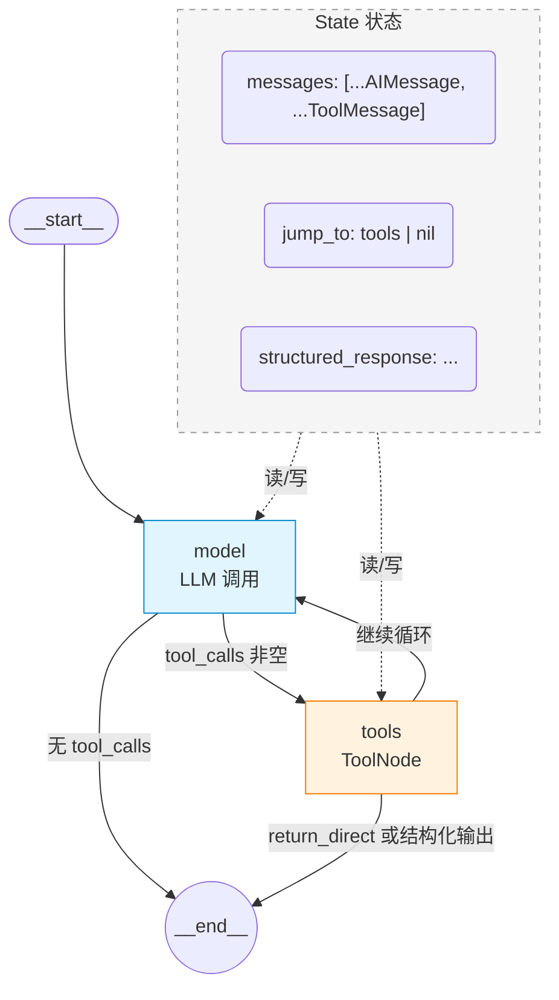

#### 条件边 1：`model_to_tools`（model 节点后执行）

完整判断逻辑（源码：`factory.py` 中 `_make_model_to_tools_edge`）：

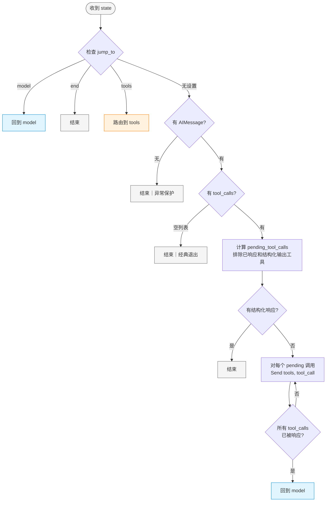

**关键要点：**

1. **`jump_to` 优先级最高**——中间件可以通过它强制覆盖路由方向
2. **一个 tool_calls=[] 就结束**——这就是 ReAct 循环的"软判断退出"。LLM 选择不调工具，框架就认为任务完成了。这是框架层面默认的退出条件
3. **多个 tool_calls 并行执行**——通过 `Send("tools", [tool_call])` 扇出，每个工具调用独立成一个并行任务。LangGraph 的 `_control_branch` 函数将这些 `Send` 转换为图任务，所有任务执行完后结果合并回 state
4. **结构化响应是特殊退出条件**——当 LLM 返回结构化输出（如 JSON Schema 定义的结果），即使有 tool_calls 也直接结束

#### 条件边 2：`tools_to_model`（tools 节点后执行）

完整判断逻辑（源码：`factory.py` 中 `_make_tools_to_model_edge`）：

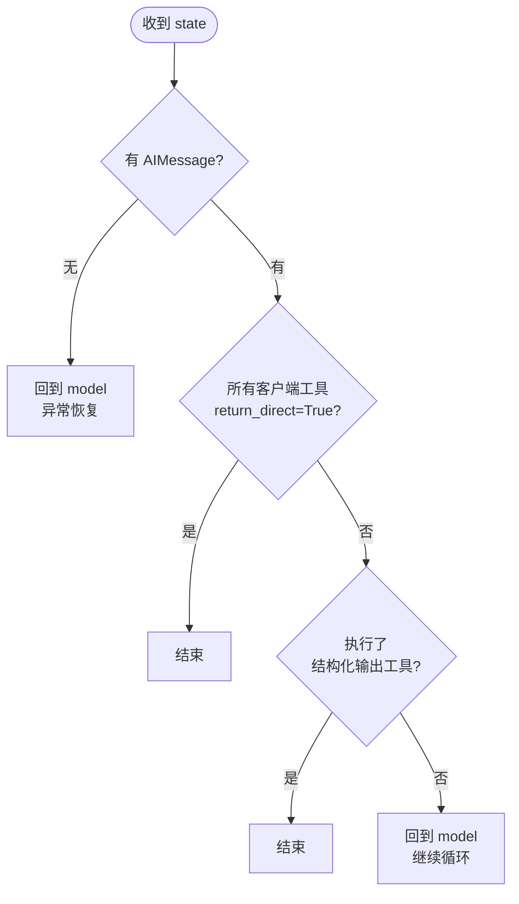

**关键要点：**

1. **默认回到 model**——这就是"观察→思考"的连接，工具执行完成后默认回到 LLM 做下一轮推理
2. **`return_direct=True` 是绕过 LLM 的快捷方式**——某些工具（如`final_answer`）的输出可以直接作为最终结果返回，不需要 LLM 再做一轮推理。所有工具都设了此标记时，循环直接结束
3. **结构化输出工具执行后自动结束**——当模型使用专门的结构化输出工具来提供最终响应时，没必要再返回 LLM

#### 消息在循环中传递的完整路径

以一个 Agent 搜索信息并回答为例，看一条消息在循环中怎么流动：

```python
# 用户输入
{"role": "user", "content": "查询今天的天气"}
```

```
Round 1

1. __start__ → model
   - State: {"messages": [用户消息]}
   
2. model 节点执行 LLM 调用
   - LLM 返回：AIMessage(tool_calls=[{name: "get_weather", args: {city: "北京"}}])
   - State update: {"messages": [AIMessage]}
   - 合并后 State: {"messages": [用户消息, AIMessage(tool_calls)]}

3. model → (条件边 model_to_tools)
   - 检测到 tool_calls 非空 → 路由到 tools
   - 针对 tool_calls[0] 发送 Send("tools", [tool_call_0])  → 并行

4. tools 节点执行
   - 解析输入：取最后一条 AIMessage.tool_calls
   - 执行 get_weather(city="北京") → 返回 "晴，25°C"
   - State update: {"messages": [ToolMessage(content="晴，25°C")]}
   - 合并后 State: {"messages": [用户消息, AIMessage(tool_calls), ToolMessage]}

5. tools → (条件边 tools_to_model)
   - return_direct=False，无结构化输出 → 回到 model

Round 2

6. model 节点再次执行
   - 此时 State.messages 包含：用户消息 + 上一轮 AIMessage + ToolMessage
   - LLM 看到完整的思考链，决定直接回答
   - 返回：AIMessage(content="北京今天天气晴朗，温度 25°C")，无 tool_calls
   - State update: {"messages": [AIMessage(无 tool_calls)]}
   - 合并后 State: {"messages": [..., ToolMessage, AIMessage(无 tool_calls)]}

7. model → (条件边 model_to_tools)
   - tool_calls 为空 → 结束
```

这个过程中 `add_messages` reducer 自动处理了所有合并，每条新消息都被正确追加到历史中，且保留了消息 ID 用于后续可能的替换。

#### `create_agent` 对比自定义 LangGraph

| 对比维度 | create_agent | 自定义 LangGraph |
|---------|-------------------|-----------------|
| 代码量 | 1 行 | 10+ 行 |
| 循环拓扑 | 标准 ReAct 往返 | 任意拓扑 |
| LLM 节点 | 单一 Agent | 多节点多 LLM |
| Human-in-the-Loop | 通过 checkpointer 加中断 | 任意位置加等待节点 |
| 调试难度 | 默认图 + LangSmith | 需要自验证

### 什么时候需要亲自写 LangGraph

默认的 `create_agent` 覆盖了大多数"标准 tool-calling"场景。以下情况需要直接使用 LangGraph 自定义图：

1. **需要多个 LLM 节点**（不是同一个 Agent 反复调用，而是不同职责的 LLM 轮流处理）
2. **需要人工审批节点**（在工具执行前插入 Human-in-the-Loop）
3. **需要并行执行**（同时调用多个工具，聚合结果再继续）
4. **需要条件分支**（不只是"继续还是结束"，还需要走不同的子流程）
5. **需要在循环中间做状态转换**（如在 Plan → Execute → Evaluate 之间切换状态）

直接使用 LangGraph 的模板：

```python
from langgraph.graph import StateGraph, MessagesState, START, END
from langgraph.prebuilt import ToolNode, tools_condition

# 1. 定义状态
class AgentState(MessagesState):
    step_count: int  # 自定义计数器

# 2. 定义图
graph = StateGraph(AgentState)

# 3. 添加节点
def call_llm(state):
    messages = state["messages"]
    response = llm.invoke(messages)
    return {"messages": [response], "step_count": state["step_count"] + 1}

tool_node = ToolNode(tools=[...])
graph.add_node("model", call_llm)
graph.add_node("tools", tool_node)

# 4. 添加边
graph.add_edge(START, "model")

# 使用内置的 tools_condition 作为条件边
# tools_condition 判断最后一条 AIMessage 是否有 tool_calls
# 有 → "tools"，无 → "__end__"
graph.add_conditional_edges("model", tools_condition, {
    "tools": "tools",
    "__end__": END
})

graph.add_edge("tools", "model")  # 始终回到 model

# 5. 编译
app = graph.compile()
```

`tools_condition` 是 LangGraph prebuilt 提供的内置条件函数（源码：`langgraph/prebuilt/tool_node.py`），它做的判断很简单：读取最后一条 AIMessage，有 `tool_calls` 就返回 `"tools"`，否则返回 `"__end__"`。`create_agent` 内部的条件边逻辑比 `tools_condition` 更丰富，多出了 `jump_to` 处理、结构化输出判断、`return_direct` 处理等。当你需要这些额外能力时，要么用 `create_agent`，要么自己实现类似的条件边。

### "有框架" vs "无框架"在循环设计上的根本区别

| 对比维度 | 框架（create_agent / LangGraph） | 无框架 |
|---------|-------------------------------|--------|
| 循环构造 | 声明式（定义节点 + 边，框架执行） | 命令式（手写 for/while 循环） |
| 状态管理 | State + Reducer 自动合并 | 手动 messages.append() |
| 退出条件 | 条件边判断，由图结构决定 | 自定义 if/return 逻辑 |
| 并行工具 | ToolNode 自动并行，Send() 扇出 | 需要手动 ThreadPool |
| 可观测性 | 图拓扑 + LangSmith Trace + 中间件 | 需要自己埋点 |
| 断点续传 | Checkpointer 原生支持 | 需要自己序列化状态 |

---

## 维度三：循环设计的核心细节

不管用不用框架，以下问题是每一个 Agent Loop 都绕不开的。

### 1. 消息历史管理

每一轮循环都会产生新的消息（工具调用、工具结果、LLM 回复），这些都会累加到消息列表中。

**核心问题**：消息列表无限增长。

**解决方案：**

| 策略 | 做法 | 适用场景 |
|------|------|---------|
| 固定窗口 | 只保留最近 N 轮 | 简单对话，任务间独立 |
| Token 预算 | 当总 token 超限时压缩/丢弃早期消息 | 长对话，需要前文但不需要全部 |
| 语义摘要 | 定期对早期消息做摘要 | 需要长期记忆但又不能丢上下文 |
| 分片管理 | 按轮次/主题分段，只加载当前段 | 复杂多步骤任务 |
| 混合策略 | 摘要 + 最近 N 轮完整保留 | 大多数生产场景 |

### 2. 观测窗口（ObservationWindow）

这是一个容易忽略但极其重要的参数。

每一轮循环中，工具调用的返回值（Observations）会不断累积。如果不加控制，几轮之后上下文就会充满历史观测结果，既浪费 token 又稀释注意力。

**核心做法：** 只保留最近 N 条观测结果，更早的结果可以压缩成摘要或直接丢弃。

```python
# 只保留最近 N 条观察
recent_observations = observations[max(0, len(observations) - OBSERVATION_WINDOW):]

# 或者：如果观察结果过长，压缩摘要
if total_tokens(observations) > BUDGET:
    early_obs = observations[:-KEEP_LATEST]
    summary = llm.summarize(early_obs)
    observations = [{"summary": summary}] + observations[-KEEP_LATEST:]
```

**为什么重要：**
- 控制 token 消耗（最直接的收益）
- 防止注意力被大量历史观测稀释
- 让 LLM 聚焦在当前步骤最相关的信息上

### 3. 工具调用的可靠性

LLM 输出的工具调用不一定正确。常见的错误模式：

- **参数错误**：传了不存在的参数、缺失必选参数、参数类型错误
- **幻觉工具**：LLM 生成了一个不存在的工具名（尤其当 tool 列表过长时）
- **多步工具依赖**：工具 B 需要工具 A 的输出，但 LLM 在 B 的参数里填了"等待 A 的结果"

**应对策略：**

- 参数校验 + 重试（第一次错了，把错误信息返回给 LLM 让它修正）
- 工具列表过长时分组（不要一次性暴露 20+ 个工具）
- 对于工具依赖，把依赖链放进工具描述里（"请在调用此工具前先调用 tool_A 获取 user_id"）

### 4. 错误恢复

循环中的每一步都可能出错：

- LLM 调用超时 / token 耗尽 / 服务不可用
- 工具执行异常 / 返回格式不预期
- 循环陷入死循环（LLM 反复调用同一个工具不推进）

**关键设计原则：** 每一步都有可恢复路径。

```
循环中的每一步都应该回答三个问题：
1. 这步失败了，已知信息是否还有效？
2. 可以重试吗？重试几次？重试前需要调整什么？
3. 如果不可恢复，优雅退出的逻辑是什么？
```

### 5. 配置参数的完整体系

生产环境中，循环的参数不应该只有 MaxSteps。一个完整的循环配置应该包含两类：

| 参数类型 | 例子 | 作用 |
|---------|------|------|
| 循环参数 | MaxIterations, MinIterations, ObservationWindow | 控制循环行为 |
| 预算护栏 | TokenBudget, Timeout, CostBudget | 跨模式通用，与具体模式无关 |

区分的原因：预算护栏不是 ReAct 专属的，Planning、Reflection、Chain-of-Thought 全都受同一套预算约束。它们应该被设计成通用配置，而不是塞进某个模式的配置中。

---

## 维度四：退出条件体系（重中之重）

Agent Loop 的设计中，**什么时候停比什么时候走更难设计**。

一个设计不良的退出条件可能导致：无限循环烧光预算、Agent 第一轮就偷懒放弃、或者反复做同一件事无法推进。

### 六种终止条件（按优先级排序）

| 优先级 | 条件 | 类型 | 说明 |
|--------|------|------|------|
| **最高** | 用户中断 | 外部信号 | 用户主动停止 |
| **高（护栏）** | 预算耗尽 | 硬护栏 | 达到 token/成本上限，强制停止 |
| **高（护栏）** | 超时 | 硬护栏 | 达到端到端时延上限，强制停止 |
| **中** | 任务完成 | 软判断 | LLM 明确表示任务已完成 |
| **中** | 结果收敛 | 软判断 | 连续观测结果高度相似，无新进展 |
| **兜底** | 最大轮数 | 硬限 | MaxIterations 到达 |

**关键区分：硬护栏 vs 软判断**

- **硬护栏**（预算、超时、最大轮数）：强制执行，不可绕过。这些是系统的安全底线。
- **软判断**（任务完成、结果收敛）：由 LLM 判断，可能有误判。需要硬护栏兜底。

不能把预算当成"错误条件"来设计。预算耗尽应该返回当前已完成的结果和进度说明，而不是抛异常。

### 两种收敛检测方式

| 方式 | 原理 | 成本 | 可靠性 |
|------|------|------|--------|
| 文本相似度 | 连续两步的观测结果字符串相似度 | 极低 | 中等 |
| 语义相似度 | embedding 距离 | 中 | 较高 |

生产环境中建议先试文本相似度，简单便宜，已经能覆盖大多数"卡在同一个结果上重复"的场景。

---

## 维度五：慢思考（Slow Thinking）

### 问题：当工具可用时，模型倾向于迅速行动而非深入思考

如果你在系统提示词里写"请你先仔细规划，然后再调用工具"，大模型往往会无视这句话。只要它在上下文中看到了诱人的工具 Schema，它的预测概率就会瞬间坍塌，转而生成工具调用参数去行动——而不是停下来深入思考。

这不是提示词能解决的问题。**提示词管不住模型的"手"，需要用架构锁住它。**

### 解法：Two-Stage ReAct（两阶段 ReAct）

工业级 Agent 的解法是在循环的每一轮中，将 Thinking 和 Action 物理拆分为两个独立的阶段：

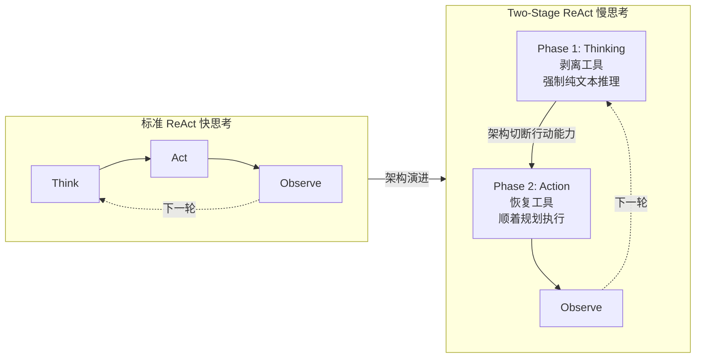

核心机制是：**在 Phase 1 中剥夺模型的工具访问权**，让它不得不输出纯文本的推理过程。等它想清楚了，再把这段推理追加到上下文中，然后进入 Phase 2 恢复工具访问，让模型顺着自己的规划去执行。

### 架构实现

在原始代码中，这个改动只涉及循环内的 LLM 调用方式——不是改 prompt，而是改调用参数：

```python
class TwoStageConfig:
    """两阶段循环配置"""
    enabled: bool = True        # 慢思考开关
    thinK_prefix: str = "【推理】"  # 思考内容的前缀标记（用于追踪或显示）
```

在 `react_loop` 中的改造（只展示循环体部分，完整逻辑复用维度一的配置和辅助函数）：

```python
# ========== 循环体中的核心改造 ==========

for step in range(config.max_iterations):
    state["step"] = step
    state["elapsed_seconds"] = time.time() - start_time
    context = build_messages(messages, config)

    # ====================================================================
    # Phase 1: 慢思考阶段 - 剥夺工具，强制纯文本推理
    # ====================================================================
    if config.two_stage_enabled:
        # 传入 available_tools = None，模型看不到任何工具 Schema
        # 被迫只能输出纯文本的思考过程
        think_response = llm.invoke(context, tools=None)
        if think_response.content:
            # 将思考轨迹追加到上下文，供 Phase 2 使用
            # 模型在 Phase 2 看到自己说过的话，
            # 会顺着推理逻辑发起精准的工具调用
            messages.append({
                "role": "assistant",
                "content": f"{think_prefix}{think_response.content}"
            })
            # 更新 context 让下一阶段也能看到推理内容
            context = build_messages(messages, config)

    # ====================================================================
    # Phase 2: 行动阶段 - 恢复工具，顺着规划执行
    # ====================================================================
    response = llm.invoke(context, tools=available_tools)
    messages.append({"role": "assistant", "content": response})
    state["last_output"] = response
    state["total_tokens"] += count_tokens(response)

    # 解析并执行工具（与标准 ReAct 一致）
    tool_calls = response.get("tool_calls", [])

    if not tool_calls:
        state["last_output"]["is_final"] = True
        if not should_stop(state, config):
            return response.get("content", "")
        break

    # Act + Observe 与标准 ReAct 相同
    for tc in tool_calls:
        result = safe_tool_call(tc["name"], tc["args"], tools)
        state["tools_executed"] += 1
        state["observations"].append(result)
        messages.append({
            "role": "tool",
            "content": str(result),
            "tool_call_id": tc["id"]
        })

    if should_stop(state, config):
        break

return extract_partial_result(messages)
```

**为什么有效：**

1. **自回归特性**：模型在 Phase 2 看到自己在 Phase 1 写下的推理内容（"我应该先用 bash 看看系统日志"），会顺理成章、毫无幻觉地生成对应的工具调用。它不需要"猜"要做什么——它已经想好了

2. **物理层面的隔离**：`tools=None` 这个参数的改变，比任何 prompt 层面的"请先思考再行动"都有效。模型看不到工具 Schema，就不可能输出 tool_calls——它别无选择，只能输出纯文本推理

3. **可开关**：简单任务（查天气）可以关闭慢思考以节省 token，复杂任务（分析架构、重构代码）开启它。同一个循环，两种行为模式

### Two-Stage ReAct 与 CoT 的关系

不需要把 CoT、Self-Consistency、Tree-of-Thoughts 放在这里对比。它们在解决的问题层面不同：

- **Two-Stage ReAct** 是循环架构层面的改变——把每一轮的"一次 LLM 调用"拆成了"两次调用"。它决定的是"模型在行动前有没有机会先思考"
- **CoT** 是单次 LLM 调用内部的技术——让 LLM 在输出答案前先把推理步骤写出来。它决定的是"模型输出的思考过程是否可见"
- **Self-Consistency / ToT** 是多次 LLM 调用层面的策略——多次生成然后投票或探索分支

它们可以组合：在一个 Two-Stage 的 Phase 1 中，你可以同时使用 CoT prompt 让模型的思考更结构化。但 Two-Stage 是架构层面的改变，CoT 是 prompt 层面的增强，两者不冲突。

### 局限性

**静态开关的浪费**：当前实现中 `two_stage_enabled` 是一个全局开关。一旦开启，每一轮都必须经历 Thinking → Action 两个阶段。对于复杂的开局（"帮我分析整个订单模块并重构"），强制慢思考确实能提升成功率。但当任务进行到中后期，模型只需要完成一些简单的子任务时，每轮仍强制思考会浪费大量 token。

**思考质量的保障**：如果模型在 Phase 1 想出的计划本身就是错误的，Phase 2 直接去执行依然会导致失败。一个更完善的架构可以在 Phase 1 和 Phase 2 之间插入自我审查（Self-Critique）微循环，但这是 Reflection 模式的范畴，不在本节讨论。

---

## 维度六：常见陷阱

### 陷阱 1：无限循环

**症状**：Agent 反复做同一件事，停不下来。

**原因**：搜索词不变，结果不变，但 Agent 没意识到自己在重复。

**解决**：
- 加 MaxIterations 硬限制
- 加相似性检测：如果连续两次观察结果高度相似，强制停止或换策略
- 在 Prompt 里提醒："如果你发现结果和上一次一样，请换一个方法"

### 陷阱 2：过早放弃

**症状**：Agent 第一轮就说"完成了"，其实啥都没干。

**原因**：LLM 偷懒，直接用已有知识编答案。

**解决**：
- 加 MinIterations，强制至少做一次工具调用
- 在 Prompt 里明确："你必须使用工具获取信息，不能直接回答"
- 在退出逻辑里检查 `hasExecutedAtLeastOneTool`

### 陷阱 3：Token 爆炸

**症状**：几轮下来，上下文长度暴涨，费用失控。

**原因**：每次观察都完整保留，历史越积越长。

**解决**：
- 限制 ObservationWindow，只看最近几条
- 对老的观察做摘要压缩
- 设置预算护栏（TokenBudget / CostBudget）

### 陷阱 4：思考与行动脱节

**症状**：LLM 想的是一回事，做的是另一回事。

**原因**：Reason 和 Act 阶段的 Prompt 没有衔接好。

**解决**：在 Act 阶段明确引用 Reason 的输出——"你刚才的思考是：`{thought}`，请根据这个思考执行对应的行动。"

### 陷阱 5：预算耗尽时只报错

**症状**：预算到了，直接抛异常，用户拿不到任何结果。

**原因**：把预算当成"错误条件"而不是"终止条件"。

**解决**：预算耗尽时应返回当前已完成的结果和进度说明，而不是抛异常。

---

## 附件：五种 Agent 模式在循环中的位置

### 1. ReAct（Reasoning + Acting）

这是最基础的 Agent Loop 设计。循环就是 ReAct 本身。

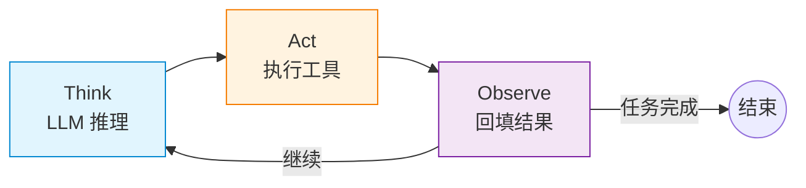

在原始循环中，ReAct 就是默认路径：

```
LLM 调用（Think）→ 解析输出 → 工具执行（Act）→ 结果回填（Observe）
```

ReAct 的关键不在于"能让 LLM 调工具"，而在于**把"猜答案"变成了"查证据 + 可追溯"**。它依然会犯错，但你能看到错在哪，也能把它拉回来。

### 2. Plan-and-Execute

循环中嵌套子循环。

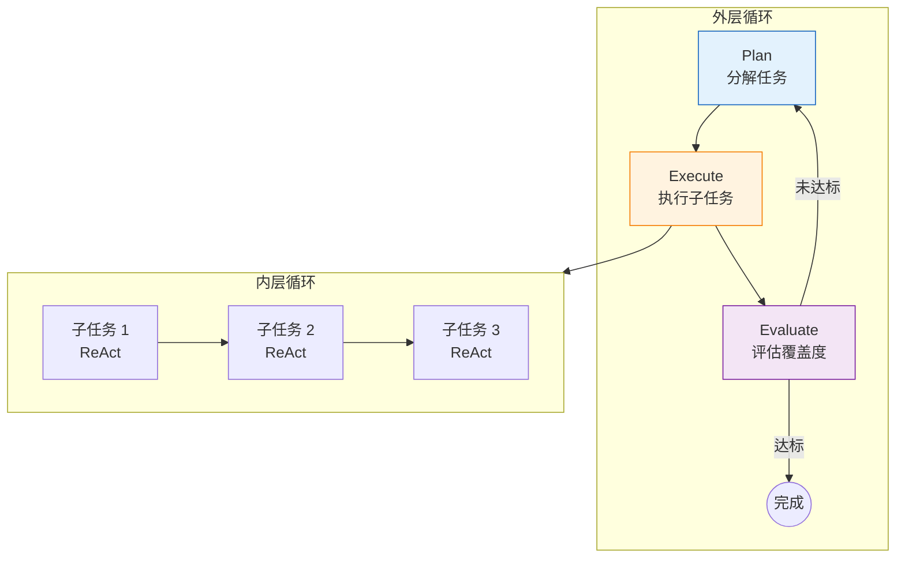

关键设计点：

- **Plan 节点**在循环开始时运行，产物是步骤列表。子任务应该声明 Produces/Consumes 来建立依赖关系、声明 Boundaries 来防止子任务之间范围重叠。
- **Execute 节点**是内层循环，按拓扑排序逐一执行步骤（无依赖可并行，有依赖按 DAG 执行）。
- **Evaluate 节点**评估"够不够"，决定继续还是结束。评估不能只靠 LLM 判断，需要确定性护栏作双保险：

```go
// 关键：LLM 判断 + 确定性规则覆盖
coverage = llm_evaluate(...)

// 规则 1：第一次迭代 + 低覆盖度 → 必须继续
if iteration == 1 && coverage < 0.5 {
    should_continue = true
}
// 规则 2：存在关键缺口 + 还有次数 → 必须继续
if critical_gaps > 0 && iteration < max_iterations {
    should_continue = true
}
// 规则 3：达到最大迭代次数 → 必须停止
if iteration >= max_iterations {
    should_continue = false
}
// 规则 4：结果太短但声称高覆盖度 → 不可信
if len(synthesis) < 500 && coverage > 0.7 {
    confidence = "low"
}
```

### 3. Multi-Agent

多个循环并行或协作。

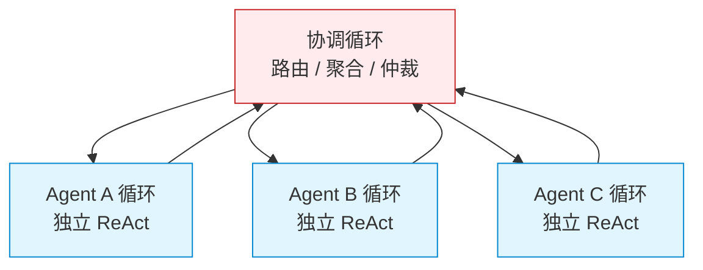

关键设计点：

- **各 Agent 循环**之间通过共享状态或消息队列通信
- **协调循环**负责路由、聚合、仲裁
- 每个 Agent 循环可以有不同的退出条件（有的完成后挂起，等待别的 Agent）

### 4. Reflection / Self-Critique

主循环内嵌反思子循环。

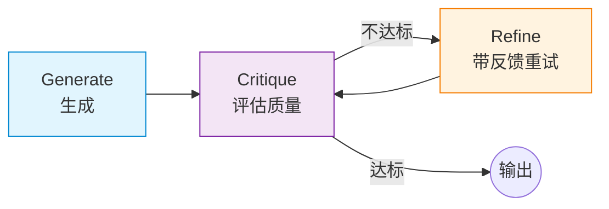

关键设计点：

- **Critique 节点**评估当前输出的质量，给出具体反馈。评估本身也是 LLM 调用，有成本。
- **成本权衡**：Reflection 会翻倍 token 消耗。无 Reflection 约 8000 tokens，一次 Reflection 约 17000 tokens（+112%）。
- **降低成本策略**：只对高价值输出启用、评估用小模型（GPT-3.5 级）、限制重试次数（MaxRetries=1 通常够）、合理的阈值（0.7 不是 0.95）。
- **优雅降级**：Reflection 失败时返回原始结果，不抛异常。它是优化，不是核心逻辑。
- **评估的评估**：LLM 评 LLM 存在偏见、过度自信、校准偏差。解决方法：加入确定性规则（"太短的回答不应得高分"）、多评估者投票（成本高）、或用不同模型评估。

### 5. Two-Stage Thinking（在循环结构中的角色）

Two-Stage Thinking（慢思考）是将标准 ReAct 循环的"一次 LLM 调用"拆分为"Thinking → Action 两次独立调用"的架构模式。

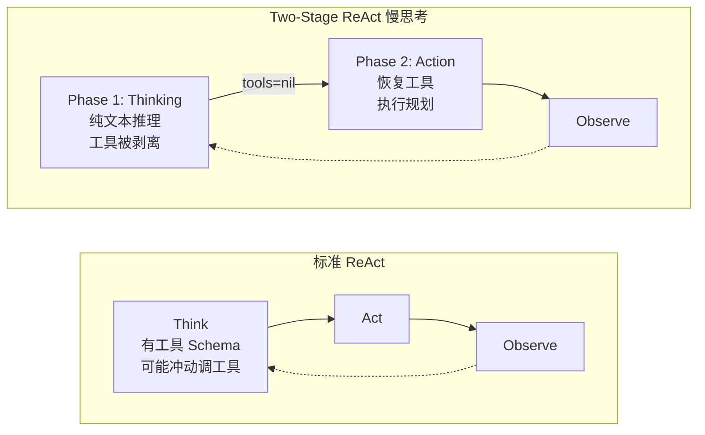

关键差异：

| 维度 | 标准 ReAct | Two-Stage ReAct |
|------|-----------|----------------|
| LLM 调用次数 | 每轮 1 次 | 每轮 2 次（Thinking + Action） |
| 工具 Schema | 始终挂载 | Phase 1 剥离，Phase 2 挂载 |
| 模型行为 | 可能冲动调工具 | 必须先推理，再行动 |
| Token 成本 | 较低 | 较高（额外一次 Thinking 调用） |
| 适用场景 | 简单查询、确定任务 | 复杂推理、长程代码任务 |

Two-Stage Thinking 是在架构层面解决问题，而 CoT 是在 Prompt 层面增强单次 LLM 调用的推理质量，两者可以组合使用。

---

## 设计检查清单

当你设计一个 Agent Loop 时，逐一检查以下问题：

1. **退出条件是否完备？**（至少有硬护栏 + 软判断两层，且硬护栏优先级更高）
2. **有没有 MinIterations？**（防止 Agent 第一轮就偷懒不调工具）
3. **预算耗尽时返回什么？**（不应该抛异常，应该返回已有进度）
4. **观测窗口有没有限制？**（不能无限累积观测结果）
5. **错误恢复是否有深度限制？**（不能无限重试同一件事）
6. **工具列表是否过长？**（建议单次暴露不超过 10-15 个工具）
7. **人在环路是否可选？**（关键决策点是否有暂停/确认机制）
8. **可观测性是否到位？**（每一步的输入/输出是否可追踪）
9. **循环是否有明确的语义边界？**（一个循环只做一件事）
10. **如果这是个 Reflection 循环，成本翻倍你接受吗？**（只对高价值输出启用）
