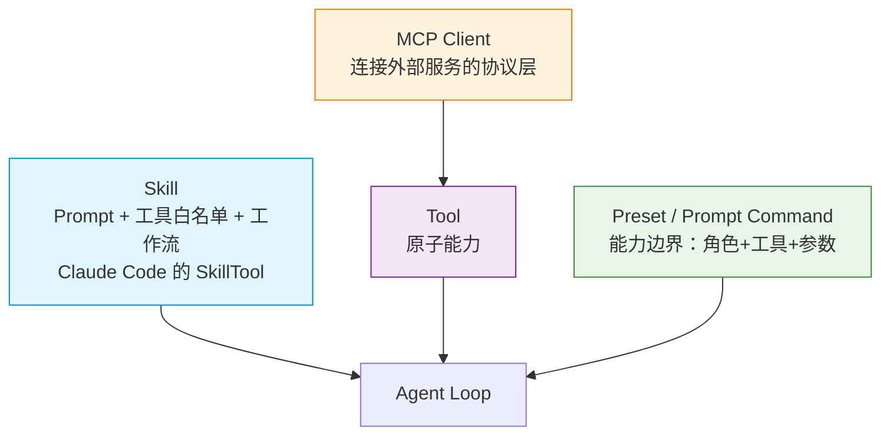
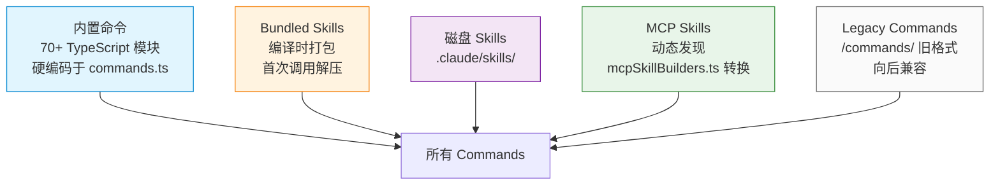

# MCP 与 Skill 设计篇

当 Agent 工具从几个膨胀到几十、几百、上千个时，问题来了：**怎么管理这些工具？怎么让工具可复用？怎么让 Agent 知道什么时候该用哪个工具？**

本文从三个层面展开：

1. **MCP 协议**——让工具像 USB 一样即插即用，基于 Claude Code 的 `mcp-client` 真实源码（`packages/mcp-client/src/`）解析其底层实现
2. **Skill 系统**——基于 Claude Code 的 `SkillTool` 真实实现（`packages/builtin-tools/src/tools/SkillTool/`）理解它的全链路设计
3. **用框架做集成**（LangChain 1.0）——官方 MCP 适配器的使用方式

---

## 先建立坐标系：MCP 与 Skill 的关系



**Skill 的本质洞见**（来自 Claude Code 内部文档）：复杂任务的关键不在代码逻辑，而在 Prompt 质量。一个代码审查 Skill 不需要审查引擎，只需告诉 Agent"审查什么、按什么顺序、输出什么格式"——Skill 把这种"经验"封装为可复用的 Markdown。

| 概念 | 本质 | Claude Code 实现 |
|------|------|-----------------|
| **Tool** | TypeScript 执行逻辑 | `src/tools.ts` 的 `call()` |
| **Skill** | **Prompt + 权限配置**的声明式封装 | `SkillTool.call()` 分流到 inline/fork |
| **MCP** | 外部服务的标准化协议 | `packages/mcp-client/src/manager.ts` |

**关键区别：**

- **Tool 是原子操作**——一个具体的可执行函数（读文件、执行命令）
- **MCP 是 Tool 的协议化**——让 Tool 跨进程、跨语言、跨项目标准化
- **Skill 是 Prompt 的封装**——教 Agent 如何**组合**多个 Tool 完成一个领域任务

---

## 维度一：MCP 协议与 Claude Code 的真实实现

### 1. MCP 是什么：工具的 USB 接口

**问题：**

Agent 需要接入 GitHub、Slack、Jira、数据库……传统做法是每个服务单独集成，重复造轮子。

**MCP 的解法：**

MCP（Model Context Protocol，Anthropic 2024-11 开源）把工具调用协议标准化——JSON-RPC 格式传输，所有 Client 自动支持所有 Server。

### 2. Claude Code 的 MCP Client 架构

Claude Code 的 MCP 实现位于 `packages/mcp-client/src/`，核心模块：

| 文件 | 职责 |
|------|------|
| `manager.ts` | 连接生命周期管理、事件通知、工具缓存 |
| `connection.ts` | 协议级助手（超时包装、stderr 捕获、信号升级清理） |
| `discovery.ts` | 工具发现（`tools/list` → `CoreTool`） |
| `execution.ts` | 工具调用、超时控制、进度回调 |
| `sanitization.ts` | Unicode 净化 |
| `errors.ts` | 错误类型（`McpConnectionError`/`McpAuthError`/`McpTimeoutError`/`McpToolCallError`） |

**关键常量**（`connection.ts`）：

```typescript
const DEFAULT_CONNECTION_TIMEOUT_MS = 30_000    // 连接超时 30 秒
const MCP_REQUEST_TIMEOUT_MS = 60_000          // 请求超时 60 秒
const MAX_MCP_DESCRIPTION_LENGTH = 2048        // MCP 描述最大长度 2048 字符
const MAX_ERRORS_BEFORE_RECONNECT = 3          // 连续 3 次终端错误触发重连
```

**McpManager 公开 API**（`manager.ts:41-58`）：

```typescript
interface McpManager {
  connect(name: string, config: McpServerConfig): Promise<MCPServerConnection>
  disconnect(name: string): Promise<void>
  disconnectAll(): Promise<void>
  getConnections(): Map<string, MCPServerConnection>
  getTools(serverName: string): CoreTool[]
  getAllTools(): CoreTool[]
  callTool(serverName: string, toolName: string, args: unknown): Promise<unknown>
  on<E>(event: E, handler: McpManagerEvents[E]): void   // connected / disconnected / toolsChanged / error / authRequired
}
```

**事件驱动的设计**——McpManager 通过 `on/off` 暴露 5 类事件，host 订阅这些事件做响应。

### 3. 连接生命周期管理

#### 3.1 连接建立

`connect()` 方法（`manager.ts:97-127`）做了四件事：

```typescript
async connect(name, config) {
  if (!this.connectFn) throw new Error('connectFn not set')

  const scopedConfig: { ...config, scope: 'dynamic' }
  const connection = await this.connectFn(name, scopedConfig)
  this.connections.set(name, connection)

  if (connection.type === 'connected') {
    this.emit('connected', name)
    await this.refreshTools(name, connection)   // 自动发现工具
  } else if (connection.type === 'needs-auth') {
    this.emit('authRequired', name)
  }

  return connection
}
```

**设计要点：**

- **Host 注入 `connectFn`**——传输层逻辑（stdio / HTTP / SSE）由 host 提供，manager 负责高层生命周期
- **`scope: 'dynamic'`**——所有通过 manager 连接的 server 标记为动态连接
- **连接成功自动 `refreshTools()`**——不必 host 手动调用

#### 3.2 信号升级清理

`connection.ts` 中的 `terminateWithSignalEscalation()` 是 Claude Code 实现的一个关键细节——清理 stdio 子进程时不只是 `kill -9`：

```typescript
// 渐进式信号升级：
// SIGINT (100ms) → SIGTERM (400ms) → SIGKILL
// 总最大清理时间：~500ms
```

```typescript
await sleep(100)              // 等 SIGINT
process.kill(childPid, 0)     // 还在？
// 还在 → SIGTERM
await sleep(400)
process.kill(childPid, 0)
// 还在 → SIGKILL
```

**为什么这样设计？** SIGINT 让进程有机会做优雅清理（如 flush 日志），SIGTERM 是次优选择，SIGKILL 是最后手段。如果一开始就 `kill -9`，MCP Server 可能留下损坏的临时文件或未刷新的状态。

#### 3.3 连接监控（自动重连）

`installConnectionMonitor()` 在客户端安装 error/close 处理器：

```typescript
// 识别"终端错误"——这类错误意味着连接已损坏
function isTerminalConnectionError(msg: string): boolean {
  return (
    msg.includes('ECONNRESET') ||
    msg.includes('ETIMEDOUT') ||
    msg.includes('EPIPE') ||
    msg.includes('EHOSTUNREACH') ||
    msg.includes('ECONNREFUSED') ||
    msg.includes('SSE stream disconnected')
  )
}

// 识别 session 过期——HTTP 404 + JSON-RPC -32001
function isMcpSessionExpiredError(error: Error): boolean {
  // 检查 error.code === 404 && error.message 包含 '"code":-32001'
}
```

**重连触发逻辑：**

- 远程传输（sse / http / claudeai-proxy）：连续 **3 次**终端错误触发重连（`MAX_ERRORS_BEFORE_RECONNECT = 3`）
- Session 过期：HTTP 404 + JSON-RPC -32001 立即触发
- SSE 重连耗尽：立即触发

### 4. 工具发现：从 MCP 协议到 CoreTool

`discoverTools()`（`discovery.ts`）做了 5 件事：

```typescript
async function discoverTools(options) {
  // 1. capabilities 预检——避免无用的 RPC 调用
  if (!capabilities?.tools) return []

  // 2. tools/list 请求
  const result = await client.request({ method: 'tools/list' }, ListToolsResultSchema)

  // 3. Unicode 净化——防御控制字符攻击
  const toolsToProcess = recursivelySanitizeUnicode(result.tools)

  // 4. 转换为 CoreTool，注入 mcpInfo 元数据
  return toolsToProcess.map(tool => ({
    name: buildMcpToolName(serverName, tool.name),  // 命名空间化：mcp__<server>__<tool>
    mcpInfo: { serverName, toolName: tool.name },
    isMcp: true,
    inputJSONSchema: tool.inputSchema,
    // 描述获取——超过 2048 字符自动截断
    prompt() { return desc.length > 2048 ? desc.slice(0, 2048) + '… [truncated]' : desc },
    // annotations 转化为 CoreTool 的语义属性
    isReadOnly: () => tool.annotations?.readOnlyHint ?? false,
    isDestructive: () => tool.annotations?.destructiveHint ?? false,
    isOpenWorld: () => tool.annotations?.openWorldHint ?? false,
    // 结果大小限制——防止恶意大响应 OOM
    maxResultSizeChars: 100_000,
  }))
}
```

**`recursivelySanitizeUnicode()`**（`sanitization.ts`）的真实实现：

```typescript
function recursivelySanitizeUnicode(data) {
  if (typeof data === 'string') {
    return data
      .replace(/[\x00-\x08\x0B\x0C\x0E-\x1F\x7F]/g, '')  // 移除控制字符
      .replace(/�/g, '')                                    // 移除替换字符
      .normalize('NFC')                                     // Unicode 归一化
  }
  if (Array.isArray(data)) return data.map(recursivelySanitizeUnicode)
  if (data !== null && typeof data === 'object') {
    // 递归处理对象
    return Object.fromEntries(
      Object.entries(data).map(([k, v]) => [k, recursivelySanitizeUnicode(v)])
    )
  }
  return data
}
```

**为什么需要 Unicode 净化？** 恶意 Server 可能在返回值里塞入零宽字符、控制字符等隐形攻击向量。

#### LRU 缓存

`createCachedToolDiscovery()`（`discovery.ts:122`）：

```typescript
const MCP_FETCH_CACHE_SIZE = 20   // 默认缓存 20 个 server 的工具列表
```

缓存以 server name 为 key（跨重连保持稳定），避免每次调用都重新 `tools/list`。

### 5. 工具调用：超时、进度与 401 处理

`callMcpTool()`（`execution.ts`）的关键设计：

```typescript
const DEFAULT_MCP_TOOL_TIMEOUT_MS = 100_000_000  // ~27.8 小时，effectively infinite

async function callMcpTool(options, deps) {
  const effectiveTimeout = options.timeoutMs
    ?? parseInt(process.env.MCP_TOOL_TIMEOUT || '', 10)
    ?? DEFAULT_MCP_TOOL_TIMEOUT_MS

  // 每 30 秒打印进度（长任务监控）
  const progressInterval = setInterval(() => {
    deps.logger.debug(`[${serverName}] Tool '${tool}' still running`)
  }, 30_000)

  try {
    const result = await Promise.race([
      mcpClient.callTool({ name, arguments, _meta }, CallToolResultSchema, {
        signal, timeout: effectiveTimeout, onprogress
      }),
      createTimeoutPromise(serverName, tool, effectiveTimeout)
    ])

    // 处理 isError:true——转成 McpToolCallError
    if (result.isError) throw new McpToolCallError(serverName, tool, ...)

    return { content: result, _meta, structuredContent }
  } catch (e) {
    // 401 → McpAuthError（自动触发重新授权流程）
    if (e.code === 401) throw new McpAuthError(serverName, 'token expired')
    throw e
  } finally {
    clearInterval(progressInterval)
  }
}
```

**几个值得注意的设计：**

1. **默认超时是 27.8 小时**——这是有意为之，因为很多 MCP 工具（数据库迁移、批处理）是长任务。通过 `MCP_TOOL_TIMEOUT` 环境变量可缩短
2. **30 秒进度日志**——管理员能看到 "Tool 还在跑"，避免误判卡死
3. **401 自动转换 `McpAuthError`**——触发 host 的 auth 重试流程，而不是直接抛错给用户

### 6. 自己实现一个 MCP Client（简化版）

上面的真实源码是 TypeScript 版本。要理解核心机制，可以用 Python 简化复刻核心安全设计：

```python
import httpx
import time
import asyncio
from dataclasses import dataclass, field
from urllib.parse import urlparse


# Claude Code 真实采用的常量
DEFAULT_CONNECTION_TIMEOUT = 30.0      # 连接超时 30 秒
DEFAULT_REQUEST_TIMEOUT = 60.0        # 请求超时 60 秒
MAX_MCP_DESCRIPTION_LENGTH = 2048     # 描述最大长度
MAX_ERRORS_BEFORE_RECONNECT = 3       # 连续错误触发重连


@dataclass
class MCPServerConfig:
    name: str
    url: str
    headers: dict = field(default_factory=dict)

    # 安全配置
    allowed_domains: list[str] = field(default_factory=lambda: ["localhost", "127.0.0.1"])
    max_response_bytes: int = 10 * 1024 * 1024   # 10MB
    max_result_chars: int = 100_000                # CoreTool 的 maxResultSizeChars

    # 重试与超时（参考 Claude Code 的设计）
    retries: int = 3
    request_timeout_seconds: float = 60.0
    tool_timeout_seconds: float = 100_000_000.0   # 默认 ~27.8 小时
```

#### 6.1 SSRF 防护（域名白名单）

```python
def validate_url(url: str, allowed_domains: list[str]) -> None:
    host = urlparse(url).hostname or ""
    if "*" in allowed_domains:  # 开发模式
        return
    if not any(host == d or host.endswith("." + d) for d in allowed_domains):
        raise ValueError(f"MCP URL host '{host}' not in allowed domains")
```

#### 6.2 终端错误识别（参考 `isTerminalConnectionError`）

```python
TERMINAL_ERROR_PATTERNS = [
    "ECONNRESET", "ETIMEDOUT", "EPIPE",
    "EHOSTUNREACH", "ECONNREFUSED",
    "Body Timeout Error", "terminated",
    "SSE stream disconnected",
]

def is_terminal_error(msg: str) -> bool:
    return any(p in msg for p in TERMINAL_ERROR_PATTERNS)
```

#### 6.3 重连计数器

```python
class ConnectionMonitor:
    """连续终端错误触发重连"""
    def __init__(self, max_errors: int = MAX_ERRORS_BEFORE_RECONNECT):
        self.consecutive_errors = 0
        self.max_errors = max_errors

    def record_error(self, msg: str) -> None:
        if is_terminal_error(msg):
            self.consecutive_errors += 1
        else:
            self.consecutive_errors = 0

    def should_reconnect(self) -> bool:
        return self.consecutive_errors >= self.max_errors
```

#### 6.4 Unicode 净化（参考 `recursivelySanitizeUnicode`）

```python
import re

CONTROL_CHARS = re.compile(r"[\x00-\x08\x0b\x0c\x0e-\x1f\x7f]")

def sanitize_unicode(data):
    """递归净化 Unicode——移除控制字符、替换字符、NFC 归一化"""
    if isinstance(data, str):
        return CONTROL_CHARS.sub("", data).replace("�", "").encode("utf-8", "ignore").decode("utf-8")
    if isinstance(data, list):
        return [sanitize_unicode(item) for item in data]
    if isinstance(data, dict):
        return {k: sanitize_unicode(v) for k, v in data.items()}
    return data
```

#### 6.5 完整的 MCP Client 实现

```python
class SimpleMCPClient:
    def __init__(self, config: MCPServerConfig):
        self.config = config
        self._monitor = ConnectionMonitor()
        validate_url(config.url, config.allowed_domains)

    async def invoke(self, tool_name: str, args: dict) -> dict:
        payload = {
            "jsonrpc": "2.0", "id": 1,
            "method": "tools/call",
            "params": {"name": tool_name, "arguments": args},
        }

        async with httpx.AsyncClient(timeout=self.config.request_timeout_seconds) as client:
            for attempt in range(1, self.config.retries + 1):
                try:
                    resp = await client.post(
                        self.config.url, json=payload, headers=self.config.headers,
                    )
                    resp.raise_for_status()

                    # 响应大小限制（参考 maxResultSizeChars=100_000）
                    if len(resp.content) > self.config.max_result_chars:
                        raise ValueError(f"Response exceeds {self.config.max_result_chars} chars")

                    # 净化（防控制字符攻击）
                    data = sanitize_unicode(resp.json())

                    self._monitor.record_error("")  # 重置
                    return data

                except httpx.HTTPStatusError as e:
                    # 401 → 触发重新授权（参考 McpAuthError）
                    if e.response.status_code == 401:
                        raise PermissionError(f"MCP server requires re-authorization")
                    self._monitor.record_error(str(e))
                    if self._monitor.should_reconnect():
                        raise ConnectionError("max consecutive errors, reconnect")
                except Exception as e:
                    self._monitor.record_error(str(e))
                    if attempt >= self.config.retries:
                        raise
                    await asyncio.sleep(min(2.0 ** (attempt - 1) * 0.5, 5.0))
```

### 7. MCP Server 设计要点

#### 能力边界要单一

一个 MCP Server 只做一件事。把数据库、文件、搜索引擎塞进一个 Server 会让 LLM 选择准确率断崖下跌（30+ 工具时尤其明显）。

#### Resource vs Tool 的区分

| 方式 | 场景 | HTTP 类比 |
|------|------|---------|
| Resource | 提供数据给模型读取 | GET |
| Tool | 让模型触发操作 | POST |

设计判断：**只是"读到"用 Resource；"触发"用 Tool**。混用导致 LLM 行为混乱。

#### annotations 字段——Tool 的语义元数据

Claude Code 把 MCP 的 `annotations` 映射到 `CoreTool` 的语义属性：

```typescript
isReadOnly: () => tool.annotations?.readOnlyHint ?? false
isDestructive: () => tool.annotations?.destructiveHint ?? false
isOpenWorld: () => tool.annotations?.openWorldHint ?? false
```

**Server 端应该如实设置**——比如 `delete_file` 应该设 `destructiveHint: true`，这样 Client 可以做权限决策（[HumanInTheLoop](agent-tool-calling.md#四人在环路human-in-the-loop)）。

### 8. MCP 的安全问题

| 问题 | 缓解 |
|------|------|
| **Prompt Injection** | 工具输出用特殊 role 隔离（LangChain `ToolMessage`），过滤 `[SYSTEM]` 等标记 |
| **Tool 组合攻击** | `read_file` + `http_request` 组合应警告，最小权限原则 |
| **Lookalike Tools** | 用 MCP Registry 验证 Server 身份 |
| **Unicode 攻击** | 净化返回值（控制字符、零宽字符、NFC 归一化） |
| **响应体 OOM** | `maxResultSizeChars` 限制（默认 100,000 字符） |
| **SSRF** | 域名白名单 |
| **Token 过期** | 自动识别 401 → 触发重新授权 |

### 9. MCP 的生产配置清单

| 配置 | Claude Code 默认值 | 作用 |
|------|-----------|------|
| 连接超时 | 30s | 防止启动卡死 |
| 请求超时 | 60s | 防止单次调用卡死 |
| 工具调用超时 | ~27.8h（可通过 `MCP_TOOL_TIMEOUT` 覆盖） | 长任务支持 |
| 描述最大长度 | 2048 字符 | 防超大 description |
| 结果最大字符 | 100,000 字符 | 防 OOM |
| 连续错误重连 | 3 次 | 防雪崩 |
| 进度日志间隔 | 30s | 监控长任务 |
| 工具缓存 | LRU 20 条 | 减少重复 `tools/list` |

---

## 维度二：Skill 系统与 Claude Code 的真实实现

### 1. Skill 的本质：Prompt + 权限配置的封装

Claude Code 内部文档对 Skill 的定义：

> Skill = Prompt + 权限配置的声明式封装。SkillTool 的 call() 注入 Prompt 到对话流，并修改权限上下文（允许的工具、模型覆盖、努力级别）。

**与 Tool 的对比：**

| 维度 | Tool | Skill |
|------|------|-------|
| 粒度 | 单个原子操作 | 一套完整的工作流 |
| 本质 | TypeScript 执行逻辑 | Prompt + 配置的封装 |
| 注册位置 | `src/tools.ts` | `src/commands.ts` |
| 执行 | `Tool.call()` | `SkillTool.call()` → inline / fork |

### 2. Skill 的五个来源

Claude Code 的 Skill 不是单一来源，而是合并自五个不同路径：



#### 磁盘 Skills 路径（最重要的来源）

由 `loadSkillsFromSkillsDir()` 加载，按优先级合并：

```
管理策略: $MANAGED_DIR/.claude/skills/     (policySettings)
用户全局: ~/.claude/skills/                 (userSettings)
项目级:   .claude/skills/                   (projectSettings, 向上遍历至 home)
附加目录: --add-dir 指定的路径下 .claude/skills/
```

**加载协议**：

1. `readdir` 扫描目录 → 仅保留 `isDirectory()` 或 `isSymbolicLink()` 的条目
2. 在每个子目录中查找 `SKILL.md`，未找到则跳过
3. `parseFrontmatter()` 解析 YAML 头部，提取 16 个字段
4. `realpath()` 去重——避免符号链接或重叠父目录导致的重复加载

**注意：只识别 `skill-name/SKILL.md` 目录格式，不支持单文件 `.md`。**

#### Bundled Skills 的特权

Bundled Skills（编译时打包）有重要特性：

- **延迟文件提取**：如果 Skill 声明了 `files`（参考文件），首次调用时才解压到临时目录
- **`O_NOFOLLOW | O_EXCL` 防止符号链接攻击**（`safeWriteFile`）
- **闭包级 memoize**：并发调用共享同一个 extraction promise
- **截断时不可被截断**——预算不够时只截断非 bundled 的

#### MCP Skills 的安全边界

MCP Skills 的 Prompt 内容**禁止执行内联 shell 命令**（`loadedFrom !== 'mcp'` 守卫）：

```typescript
// loadSkillsDir.ts:374
// 守卫逻辑：远程 MCP 内容不可信，禁止 !`command` 替换
if (loadedFrom !== 'mcp') {
  // 允许 shell 命令替换
} else {
  // 跳过——MCP 内容可能有恶意 shell 命令
}
```

### 3. Frontmatter 的 16 个字段

一个完整的 `SKILL.md` frontmatter（来自 `parseSkillFrontmatterFields`）：

```yaml
---
name: code-review                    # 显示名称（覆盖目录名）
description: 系统性代码审查           # 描述（或从 Markdown 首段提取）
when_to_use: "用户说审查代码、找 bug"  # AI 自动匹配依据
allowed-tools:                       # 工具白名单
  - Read
  - Grep
  - Glob
argument-hint: "<file-or-directory>" # 参数提示
arguments: [path]                    # 声明式参数名（用于 $ARGUMENTS 替换）
model: opus                          # 模型覆盖
effort: high                         # 努力级别
context: fork                        # 执行模式：inline（默认）| fork
agent: code-reviewer                 # 指定 Agent 定义文件
user-invocable: true                 # 用户是否可 /调用
disable-model-invocation: false      # 禁止 AI 自主调用
version: "1.0"                       # 版本号
paths:                               # 条件激活的文件路径模式
  - "src/**/*.ts"
hooks:                               # Hook 配置
  PreToolUse:
    - command: ["echo", "checking"]
shell: ["bash"]                      # Shell 执行环境
---
```

执行时，`allowedTools` / `model` / `effort` 通过 `contextModifier` 动态修改 `toolPermissionContext`。

### 4. Prompt 预算与三级降级

Skill 列表注入 System Prompt 时有严格的字符预算（`formatCommandsWithinBudget`，`prompt.ts`）：

```typescript
const SKILL_BUDGET_CONTEXT_PERCENT = 0.01     // 1% 的上下文窗口
const CHARS_PER_TOKEN = 4
const DEFAULT_CHAR_BUDGET = 8_000             // 200k × 4 × 1%
const MAX_LISTING_DESC_CHARS = 1536           // 单条硬上限（v2.1.117 从 250 提升）
```

**三级降级策略**：

```
1. 尝试完整描述 → 超预算？
2. Bundled 保留完整，非 bundled 均分剩余预算 → 每条描述 < 20 字符？
3. 非 bundled 仅保留名称（bundled 仍保留完整描述）
```

**为什么 bundled 不可截断？** bundled 是 Claude Code 官方的高频常用技能（commit/review/compact 等），截断它们会让核心体验退化。

**为什么 `MAX_LISTING_DESC_CHARS = 1536` 而非更小？** 注释直接说明：listing 只用于发现，verbose 的 `whenToUse` 浪费 turn-1 的 cache_creation tokens 而不提升匹配率。但太低又会丢失核心用例，所以 1536 是经验值。

### 5. 两条执行路径：Inline vs Fork

`SkillTool.call()` 根据 `command.context` 分流：

```typescript
// SkillTool.ts:626
if (command?.type === 'prompt' && command.context === 'fork') {
  return executeForkedSkill(command, commandName, args, context, canUseTool, parentMessage, onProgress)
}
// 否则走 inline 路径
```

#### Inline 模式（默认）

Skill 的 Prompt 内容被注入为 **UserMessage**，在主对话流中继续执行：

1. `processPromptSlashCommand()` 处理参数替换（`$ARGUMENTS`）和 shell 命令展开（`` !`...` ``）
2. `${CLAUDE_SKILL_DIR}` 替换为 Skill 所在目录的绝对路径
3. `${CLAUDE_SESSION_ID}` 替换为当前会话 ID
4. 返回 `newMessages`（注入到对话流）+ `contextModifier`（修改权限上下文）

`contextModifier` 做了三件事：

- **工具白名单注入**：`allowedTools` 合并到 `alwaysAllowRules.command`
- **模型切换**：`resolveSkillModelOverride()` 处理模型覆盖，**保留 `[1m]` 后缀**（避免 200K 窗口截断）
- **努力级别覆盖**：修改 `effortValue`

```typescript
// 关键设计：保留 [1m] 后缀
const resolveSkillModelOverride = (model, currentMainModel) => {
  // skill 写 model: opus，会话是 opus[1m]
  // 结果保留 opus[1m]，否则 200K 窗口变成 200K
  // 这会触发 autocompact，破坏长 Skill 的执行
}
```

#### Fork 模式（`context: fork`）

Skill 在**独立子 Agent** 中执行（`executeForkedSkill`，`SkillTool.ts:122`）：

1. `prepareForkedCommandContext()` 构建隔离的 Agent 定义和 Prompt
2. `runAgent()` 启动子 Agent 循环，拥有独立的 token 预算
3. 通过 `onProgress` 回调报告工具使用进度
4. 结果通过 `extractResultText()` 提取，**子 Agent 的全部消息在提取后被释放**（`agentMessages.length = 0`）
5. 通过 `clearInvokedSkillsForAgent()` 清理状态

**Fork 模式适用于强隔离场景**（长时间运行的审查任务），避免污染主对话的上下文。

### 6. 五层权限检查

`SkillTool.checkPermissions()` 实现了一个正向安全的权限检查：

```typescript
async checkPermissions({ skill, args }, context) {
  // 1. Deny 规则匹配（支持精确匹配和 prefix:* 通配符）
  //    例如 "dangerous:*" 匹配 "dangerous-deploy"
  for (const [ruleContent, rule] of denyRules) {
    if (ruleMatches(ruleContent)) return { behavior: 'deny' }
  }

  // 2. 远程 canonical Skill 自动放行（experimental + ant 用户）
  if (feature('EXPERIMENTAL_SKILL_SEARCH') && process.env.USER_TYPE === 'ant') {
    const slug = remoteSkillModules.stripCanonicalPrefix(commandName)
    if (slug !== null) return { behavior: 'allow' }
  }

  // 3. Allow 规则匹配
  for (const [ruleContent, rule] of allowRules) {
    if (ruleMatches(ruleContent)) return { behavior: 'allow' }
  }

  // 4. Safe Properties 白名单检查
  //    正向安全：未来新加的属性默认需要权限
  if (commandObj?.type === 'prompt' && skillHasOnlySafeProperties(commandObj)) {
    return { behavior: 'allow' }
  }

  // 5. Ask 用户确认
  return { behavior: 'ask', suggestions: [...] }
}
```

**Safe Properties 白名单**包含 30 个属性名（覆盖 `PromptCommand` 和 `CommandBase` 的所有安全属性）。**任何不在白名单中有意义值的属性都触发权限请求**——这是正向安全设计。

### 7. 条件激活：基于文件路径的动态发现

带有 `paths` 模式的 Skill 在加载时不会立即可用，而是存入 `conditionalSkills` Map：

```typescript
// discoverSkillDirsForPaths() 在文件操作时触发
// 1. 从被操作的文件路径开始，向上遍历至 CWD（不包含 CWD 本身）
// 2. 在每层查找 .claude/skills/ 目录
// 3. 使用 realpath 去重，git check-ignore 过滤
// 4. 按路径深度排序（深层优先）
```

**当被操作的文件路径匹配某个 Skill 的 paths 模式时**（使用 `ignore` 库做 gitignore 风格匹配），该 Skill 才被**激活**——从 `conditionalSkills` 移入 `dynamicSkills`。

**例子：** 一个只在 `*.test.ts` 上激活的测试 Skill，平时完全不可见，只有当 Agent 读取或编辑测试文件时才会出现。

### 8. 使用频率排名

`recordSkillUsage()` 使用指数衰减算法：

```
score = usageCount × max(0.5^(daysSinceUse / 7), 0.1)
```

- **7 天半衰期**：一周前的使用权重减半
- **最低 0.1 保底**：避免老但高频的 Skill 完全沉底
- **60 秒去抖**：同一 Skill 在 1 分钟内的多次调用只计一次

排名数据持久化在全局配置的 `skillUsage` 字段。

### 9. 远程技能加载（Experimental）

通过 `EXPERIMENTAL_SKILL_SEARCH` feature flag 控制，从 AKI/GCS/S3 加载 `_canonical_<slug>` 格式的 Skill：

1. `validateInput()` 中 `stripCanonicalPrefix()` 拦截 canonical 名称
2. `executeRemoteSkill()` 从远程 URL 加载 SKILL.md
3. 支持 `gs://`、`https://`、`s3://` 等 URL 协议
4. 内容经过 frontmatter 剥离、`${CLAUDE_SKILL_DIR}` 替换后直接注入
5. **通过 `addInvokedSkill()` 注册到 compaction 保留状态**——确保压缩后仍可恢复

远程 Skill 不经过 `processPromptSlashCommand`——无 `!command` 替换、无 `$ARGUMENTS` 展开。

### 10. Skill 的完整生命周期

```
磁盘 SKILL.md
  ↓ parseFrontmatter()
  ↓ parseSkillFrontmatterFields() → 16 个字段
  ↓ createSkillCommand() → Command 对象
  ↓ 去重（realpath + seenFileIds）
  ↓ 条件 Skill → conditionalSkills Map（等待路径匹配激活）
  ↓ getSkillDirCommands() memoize 缓存
  ↓ getAllCommands() 合并 local + MCP
  ↓ formatCommandsWithinBudget() → 截断后的 Skill 列表注入 System Prompt
  ↓ AI 选择匹配的 Skill
  ↓ SkillTool.validateInput() → 名称校验 + 存在性检查
  ↓ SkillTool.checkPermissions() → 五层权限检查
  ↓ SkillTool.call() → inline 或 fork 执行
  ↓ contextModifier() → 注入 allowedTools + model + effort
  ↓ recordSkillUsage() → 更新使用频率排名
```

### 11. 自己实现一个 Skill Loader

```python
from pathlib import Path
from dataclasses import dataclass, field


@dataclass
class SkillMetadata:
    name: str
    description: str
    path: Path
    allowed_tools: list[str] = field(default_factory=list)


class SkillLoader:
    """Discovery 阶段只解析元数据，Activation 阶段才加载正文"""

    def __init__(self, skills_dir: Path):
        self.skills_dir = skills_dir
        self._skills: dict[str, Skill] = {}

    def discover(self) -> list[SkillMetadata]:
        """扫描目录，解析所有 SKILL.md 的 frontmatter"""
        if not self.skills_dir.exists():
            return []

        metadata_list = []
        for skill_md in self.skills_dir.rglob("SKILL.md"):
            content = skill_md.read_text(encoding="utf-8")
            metadata = self._parse_frontmatter(content)
            if metadata:
                metadata.path = skill_md.parent
                metadata_list.append(metadata)

        return metadata_list

    def load_body(self, name: str) -> str:
        """按需加载 Skill 的完整正文"""
        # 参考 Claude Code 的设计：bundled 有特权，正文可截断
        skill_md = self.skills_dir / name / "SKILL.md"
        if not skill_md.exists():
            raise KeyError(f"Skill '{name}' not found")
        content = skill_md.read_text(encoding="utf-8")
        return self._strip_frontmatter(content)

    @staticmethod
    def _parse_frontmatter(content: str) -> SkillMetadata | None:
        """极简 YAML frontmatter 解析"""
        if not content.startswith("---\n"):
            return None
        parts = content.split("---", 2)
        if len(parts) != 3:
            return None

        metadata = {"name": "unknown", "description": ""}
        allowed_tools = []
        for line in parts[1].strip().splitlines():
            line = line.strip()
            if line.startswith("name:"):
                metadata["name"] = line[len("name:"):].strip()
            elif line.startswith("description:"):
                metadata["description"] = line[len("description:"):].strip()
            elif line.startswith("allowed-tools:"):
                tools = line[len("allowed-tools:"):].strip()
                allowed_tools = [t.strip() for t in tools.split(",") if t.strip()]
            # 注：完整实现应支持 16 个字段

        return SkillMetadata(
            name=metadata["name"],
            description=metadata["description"],
            path=Path(),
            allowed_tools=allowed_tools,
        )
```

### 12. Preset 实现：Python 字典方案

不基于文件的、框架级的轻量 Skill 系统：

```python
_PRESETS: dict[str, dict] = {
    "analysis": {
        "system_prompt": "You are an analytical assistant. Provide concise reasoning...",
        "allowed_tools": ["web_search", "file_read"],
        "caps": {"max_tokens": 30000, "temperature": 0.2},
    },
    "research": {
        "system_prompt": "You are a research assistant. Gather facts from authoritative sources...",
        "allowed_tools": ["web_search", "web_fetch", "web_crawl"],
        "caps": {"max_tokens": 16000, "temperature": 0.3},
    },
    "generalist": {  # 兜底
        "system_prompt": "You are a helpful AI assistant.",
        "allowed_tools": [],
        "caps": {"max_tokens": 8192, "temperature": 0.7},
    },
}

def get_role_preset(name: str) -> dict:
    """安全降级：未知名 → generalist；返回副本防污染"""
    key = (name or "").strip().lower() or "generalist"
    return _PRESETS.get(key, _PRESETS["generalist"]).copy()  # 必须 .copy()
```

Prompt 模板渲染（变量替换）：

```python
import re

def render_system_prompt(prompt: str, params: dict) -> str:
    """把 ${variable} 替换成实际值——类似 Skill 的 ${CLAUDE_SKILL_DIR}"""
    def substitute(match):
        return str(params.get(match.group(1), ""))
    return re.sub(r"\$\{(\w+)\}", substitute, prompt)
```

---

## 维度三：MCP + Skill 在 Multi-Agent 编排中的角色

在 Multi-Agent 系统里，Orchestrator 需要决策：任务应该交给单 Agent 按 Skill 执行，还是拆分给多个 Agent 协作？

**Skill 自声明执行模式：**

```python
@dataclass
class SkillMetadata:
    name: str
    description: str
    requires_role: str | None = None     # 指定 Preset/角色 → 单 Agent 执行
    dangerous: bool = False
    budget_max: int | None = None        # 单次 Token 上限
```

- **`requires_role` 非空** → Orchestrator 跳过 LLM 任务分解，单 Agent 按 Skill 工作流执行
- **`requires_role` 为空** → Orchestrator 调用 LLM 任务分解，DAG 并行执行

**安全设计三层叠加：**

1. **谁能用**：`dangerous: true` 的 Skill 需要 admin/owner 权限
2. **能用什么工具**：`requires_role` 指向的 Preset 限制工具白名单
3. **花多少 Token**：`budget_max` 限制单次执行上限

---

## 维度四：用框架做集成（LangChain 1.0）

### LangChain 1.0 的 MCP 适配

通过 `langchain-mcp-adapters` 包提供：

```python
from langchain_mcp_adapters.tools import load_mcp_tools
from langgraph.prebuilt import create_react_agent
from mcp import ClientSession, StdioServerParameters
from mcp.client.stdio import stdio_client


async def main():
    server_params = StdioServerParameters(command="python", args=["weather_server.py"])

    async with stdio_client(server_params) as (read, write):
        async with ClientSession(read, write) as session:
            await session.initialize()                          # 标准 MCP 握手
            tools = await load_mcp_tools(session)              # MCP Tool → LangChain BaseTool

            agent = create_react_agent(model, tools)
            result = await agent.ainvoke({"messages": [("user", "Tokyo weather?")]})
```

**`load_mcp_tools` 内部做了：**

1. 调用 `session.list_tools()` 发现工具
2. 把每个 MCP Tool 的 `name`/`description`/`inputSchema` 转换为 LangChain `BaseTool`
3. 包装 `session.call_tool()` 为 LangChain 工具的 `_arun`
4. Schema 自动从 MCP `inputSchema` 推导为 Pydantic model

### LangChain 1.0 的 Skill 相关中间件

LangChain v1 没有"Skill 系统"概念，但有几个中间件可以模拟 Skill 行为：

#### `dynamic_prompt` 装饰器

动态生成 System Prompt——非常适合加载 Skill 元数据：

```python
from langchain.agents.middleware import dynamic_prompt


@dynamic_prompt
def skill_registry_prompt(request) -> str:
    """每次调用 LLM 时动态注入 Skill 列表"""
    base = "你是 go-tiny-claw，一个骨灰级研发助手。\n\n"

    skills = skill_loader.discover()  # 只加载元数据
    if not skills:
        return base

    # 参考 Claude Code 的 MAX_LISTING_DESC_CHARS=1536 截断
    registry = "## Available Skills\n"
    for skill in skills:
        desc = skill.description[:1536]
        registry += f"- **{skill.name}**: {desc}\n"

    return base + registry
```

#### 集成示例

```python
from pathlib import Path
from langchain.agents import create_agent
from langchain_core.tools import tool


# 1. Skill Loader（前面已实现）
skill_loader = SkillLoader(Path(".claude/skills"))


# 2. dynamic_prompt 中间件：动态注入 Skill 元数据
@dynamic_prompt
def skill_registry_prompt(request) -> str:
    skills = skill_loader.discover()
    # ... 同上
    pass


# 3. 自定义 load_skill 工具：按需激活（对应 Claude Code 的 SkillTool.call()）
@tool
def load_skill(skill_name: str, args: str = "") -> str:
    """按需加载 Skill 完整正文。Agent 匹配到 Skill 描述后调用。"""
    skill = skill_loader.load_body(skill_name)
    # 简单的参数替换
    body = skill.body.replace("$ARGUMENTS", args or "")
    return f"# Skill: {skill_name}\n\n{body}"


# 4. 创建 Agent
agent = create_agent(
    model="openai:gpt-5",
    tools=[load_skill],
    middleware=[skill_registry_prompt],
)
```

**完整工作流：**

1. Agent 启动时，`skill_registry_prompt` 注入 Skill 元数据列表（参考 Claude Code 的 1536 字符单条上限）
2. 用户提问"帮我审查这段代码"
3. Agent 看到元数据里 `code-review` 匹配
4. Agent 调用 `load_skill("code-review")` 工具
5. `SkillLoader.load_body` 加载完整正文注入上下文
6. Agent 按 Skill 指令执行

**Token 效率：** 即使装 100 个 Skill，启动时只消耗约 5000 Token（100 × 50）。只有真正用到的 Skill 才加载正文。

---

## 维度五：常见陷阱

### 陷阱 1：硬编码 API Key

```yaml
# 危险
headers:
  Authorization: "ghp_xxxxxxxxxxxxxxxxxxxx"

# 安全 - 用环境变量
headers:
  Authorization: "${GITHUB_TOKEN}"
```

### 陷阱 2：忽略 Unicode 净化

Claude Code 净化实现的注释明确说："防御控制字符攻击"。**不净化 = 给恶意 Server 留下隐形攻击向量**。零宽字符、替换字符（`�`）、NFC 归一化差异都是真实威胁。

### 陷阱 3：响应体无限大

Claude Code 的 `maxResultSizeChars = 100_000`（约 25k 中文字符）。恶意 Server 可以返回 1GB 数据直接 OOM。

### 陷阱 4：设置过短的调用超时

Claude Code 的工具调用默认超时是 27.8 小时（effectively infinite），这是有意为之——很多 MCP 工具是长任务。设置 30 秒超时会让数据库迁移、批处理任务频繁中断。

但**对外暴露的子任务应该设短超时**（10-30 秒）防止请求卡死。

### 陷阱 5：Skill 描述太长

Claude Code 注释直接说明："verbose `whenToUse` 浪费 turn-1 的 cache_creation tokens 而不提升匹配率"。`MAX_LISTING_DESC_CHARS = 1536` 是经验值，超过会被截断。

### 陷阱 6：System Prompt 太通用

```python
# 太通用 = 什么任务都做不好
"system_prompt": "You are a helpful assistant."

# 具体 = 明确角色、规则、输出格式
"system_prompt": """You are a senior code reviewer with 10+ years experience.
## Severity Levels
1. CRITICAL: Security vulnerabilities
2. HIGH: Logic errors, race conditions
"""
```

### 陷阱 7：工具权限太宽

```python
# 太宽
"allowed_tools": ["web_search", "file_write", "shell_execute", "database_query"]

# 最小权限
"allowed_tools": ["web_search", "web_fetch"]  # 研究任务只需搜索
```

### 陷阱 8：忽视 bundled vs 磁盘 Skills 的区别

Claude Code 把 bundled Skills 视为不可截断特权——它们是官方高频技能。如果你把所有 Skill 都视为同等优先级，关键 Skill 可能在长项目中失去描述。

### 陷阱 9：用 `model: opus` 不保留 `[1m]` 后缀

Claude Code 的 `resolveSkillModelOverride` 注释明确警告：保留 `[1m]` 后缀，否则 200K 窗口变成 200K，触发 autocompact，破坏长 Skill 执行。这是真实踩过的坑。

### 陷阱 10：远程 MCP Skill 启用 shell 命令展开

Claude Code 的安全边界：`loadedFrom === 'mcp'` 时**禁止执行 `!`command``**——远程内容不可信。如果你允许 MCP Skill 内容执行 shell 命令，等于给恶意 Server 后门。

### 陷阱 11：每次都全量加载 Skill 正文

93 个 GitHub 工具的 Schema 占 ~55k Token。还没开始干活，上下文已满。

**解决：** 用渐进式披露——元数据常驻 System Prompt，正文按需加载。

### 陷阱 12：忽略路径感知的条件激活

普通 Skill 加载后永远可见。但 `paths` frontmatter 允许 Skill 只在特定文件路径下激活（如 `*.test.ts`）——这是精细化控制加载噪音的关键。

### 陷阱 13：不记录 Skill 使用频率

Claude Code 的 `recordSkillUsage()` 用 7 天半衰期排名 Skill。不做排名 = 高频 Skill 不会自动浮现到显眼位置。

### 陷阱 14：MCP 401 错误处理不当

Claude Code 把 401 自动转换为 `McpAuthError` 触发重新授权。如果你只把 401 当普通错误抛出，user 会看到神秘的 "token expired" 但不会触发 OAuth 刷新流程。

### 陷阱 15：不区分 inline 和 fork

长 Skill（如代码审查）走 inline 会污染主对话上下文。Claude Code 的 fork 模式让 Skill 在独立子 Agent 中执行，结果回来后 `agentMessages.length = 0` 释放——**长任务必须 fork**。

---

## 设计检查清单

### MCP 部分

1. **域名白名单是否配置？**（防 SSRF）
2. **响应大小是否限制？**（Claude Code 默认 100k chars）
3. **超时是否合理区分连接/请求/调用？**（30s / 60s / 长任务 27.8h）
4. **连续错误重连阈值？**（Claude Code 用 3 次）
5. **Unicode 净化是否实现？**（控制字符、替换字符、NFC 归一化）
6. **敏感信息是否用环境变量？**
7. **401 错误是否触发重新授权？**（不是直接抛错）
8. **进度日志是否间隔打印？**（长任务监控）
9. **capabilities 是否预检？**（避免无用 RPC 调用）
10. **工具发现结果是否 LRU 缓存？**

### Skill 部分

11. **frontmatter 字段是否完整？**（Claude Code 用了 16 个）
12. **预算是否限制？**（1% 上下文窗口，单条 1536 字符）
13. **bundled Skills 是否享有不可截断特权？**
14. **三级降级策略是否实现？**（完整 → 均分 → 仅名称）
15. **是否区分 inline 和 fork？**（长任务必须 fork）
16. **permission 模型是否分级？**（Claude Code 五层）
17. **Safe Properties 白名单是否用？**（正向安全设计）
18. **`[1m]` 后缀是否在 model override 时保留？**
19. **MCP Skill 是否禁止 shell 展开？**（远程内容不可信）
20. **使用频率是否记录？**（7 天半衰期）

---

## 附件：MCP、Tool、Skill 的统一视角

**本质：** Tool、MCP、Skill 都是往 Agent 的上下文里注入信息，补充 Agent 的能力。

| 机制 | 注入什么 | Claude Code 实现 | 加载时机 |
|------|---------|----------------|---------|
| **Tool** | 函数定义 + 执行逻辑 | `src/tools.ts` 的 `Tool` | Agent 启动时全量加载 |
| **MCP** | Tool 的协议化暴露 | `mcp-client` 包 | 启动时 `tools/list` 发现 |
| **Skill** | Prompt + 权限配置 | `SkillTool` + `Command` | 元数据注入预算，正文按需 |

四者的关系：

```
Tool ← 基础能力单元
  ↑
MCP ← 外部服务暴露 Tool 的标准方式
  ↑
Skill ← 教 Agent 如何组合 Tool 完成任务（按需加载）
  ↑
Preset / Prompt Command ← 定义 Agent 的能力边界
```

**设计上的共同约束：** 上下文窗口是稀缺资源。

无论怎么变化，设计上都要：

1. **按需加载**——不用的别塞进去
2. **最小化 Token 消耗**——元数据先行，内容延迟
3. **可组合**——小模块拼成大能力
4. **最小权限**——只给完成任务必需的工具

这四条原则贯穿整个 Agent 工具链的设计。

---

## 延伸阅读

- [Agent Loop 设计篇](agent-loop-design.md)——Agent 循环的核心设计
- [工具调用篇](agent-tool-calling.md)——Tool Registry、ToolNode、HITL
- [上下文管理篇](agent-context-management.md)——System Prompt 组装、Working Memory、Compaction
- [Anthropic Agent Skills 规范](https://agentskills.io/)——官方标准
- [Model Context Protocol](https://modelcontextprotocol.io/)——MCP 官方文档