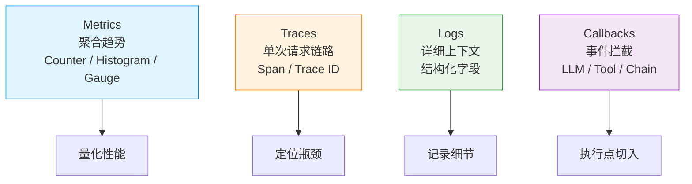
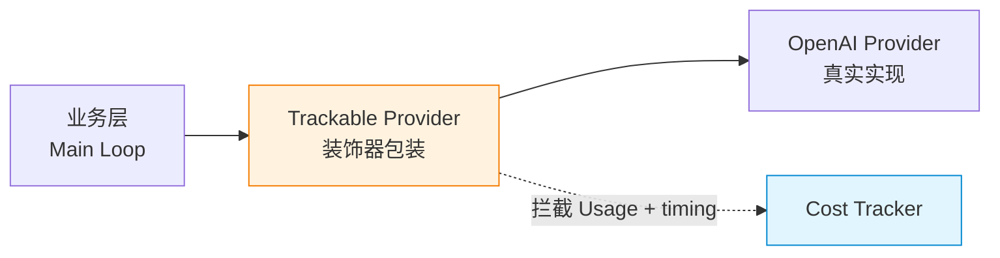
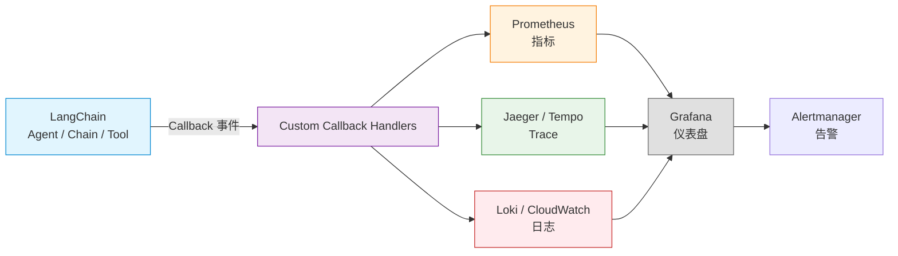

# 可观测性篇

Agent 跑在生产环境之后，你迟早要面对这些问题：

- 老板问"这个月 API 账单为什么这么高"
- 用户投诉"Agent 响应上周还挺快，这周怎么变慢了"
- 凌晨两点告警"成功率掉到 80%"
- 复盘一个失败决策——"它为什么调那个工具？基于什么判断？"

没有可观测性，这些问题都答不上来，只能靠猜。

可观测性（Observability）让你的 Agent 像玻璃一样透明——**用指标量化性能、用追踪定位瓶颈、用日志记录细节、用回调拦截所有事件**。但过度观测也有代价：指标爆炸、存储成本、性能开销。**选择观测什么，比观测本身更重要**。

本文从五个部分展开：

1. **可观测性四支柱**——Metrics / Traces / Logs / **Callbacks（事件拦截）**
2. **用原始代码实现成本与耗时追踪**——不依赖框架，手写装饰器拦截
3. **用 LangChain 1.0 实现追踪**——`BaseCallbackHandler` + `UsageMetadataCallbackHandler` 真实接口
4. **核心细节**——Prompt Cache、模型路由、健康检查、告警分级
5. **常见陷阱与设计检查清单**

---

## 先建立坐标系：可观测性的四个支柱

在动手之前，先明确可观测性不是单一概念，而是四个互补的支柱：



| 支柱 | 强项 | 弱项 | 典型问题 |
|------|------|------|---------|
| **Metrics** | 聚合、趋势、告警 | 不知道单次请求细节 | "失败率是多少？" |
| **Traces** | 单次请求全链路 | 存储成本高 | "这个请求卡在哪里？" |
| **Logs** | 详细上下文 | 难以聚合分析 | "报错时参数是什么？" |
| **Callbacks** | 拦截执行点，提取元数据 | 需要埋点到框架 | "这次 LLM 调用用了多少 Token？" |

**重要**：在 LangChain v1 中，**Callback 是最基础的可观测性原语**——所有 LLM / Tool / Chain 的执行都会触发回调，从回调中提取的数据再喂给 Metrics / Traces / Logs。理解 Callback 是理解 LangChain 可观测性的关键。

---

## 维度一：用原始代码实现成本与耗时追踪

### 1. 三个核心数据结构

不依赖框架，你需要的最小数据模型：

```python
from dataclasses import dataclass, field
from time import time
from typing import Optional


@dataclass
class Usage:
    """单次 LLM 调用的 Token 消耗"""
    prompt_tokens: int = 0       # 输入 Token
    completion_tokens: int = 0   # 输出 Token（通常比输入贵 3-5 倍）
    total_tokens: int = 0        # 总计

    @property
    def cost_usd(self) -> float:
        """按模型定价估算成本（GPT-4o 输入 $2.5/M, 输出 $10/M）"""
        input_cost = self.prompt_tokens / 1_000_000 * 2.5
        output_cost = self.completion_tokens / 1_000_000 * 10.0
        return input_cost + output_cost


@dataclass
class TimingBreakdown:
    """单次循环的时间分解"""
    llm_inference_ms: float = 0.0    # LLM 推理耗时
    tool_execution_ms: float = 0.0   # 工具执行耗时
    retrieval_ms: float = 0.0        # 检索耗时
    total_ms: float = 0.0


@dataclass
class SessionMetrics:
    """会话级累计指标"""
    session_id: str
    total_usage: Usage = field(default_factory=Usage)
    total_timing: TimingBreakdown = field(default_factory=TimingBreakdown)
    step_count: int = 0
    tool_call_count: int = 0
    error_count: int = 0
    start_time: float = field(default_factory=time)
```

**关键设计点**：

- **`Usage` 拆解 input / output**——大模型 API 通常对输入和输出 Token 计费不同（输出贵 3-5 倍），只算总数会丢失成本细节
- **`TimingBreakdown` 按阶段分类**——LLM 推理、工具执行、检索是三个不同的时间来源，必须分开计时
- **`SessionMetrics` 累积而非单次**——会话可能持续几小时，需要累计统计

### 2. 为什么必须在 Provider 适配层拦截？

**反例：业务层手动埋点**

```python
# 错误：每个调用 LLM 的地方都要重复这段
start = time.time()
resp = llm.generate(messages)
elapsed = time.time() - start
cost = (resp.usage.prompt_tokens / 1e6) * 2.5 + ...
log.info(f"耗时: {elapsed:.2f}s, 花费: ${cost:.4f}")
```

**致命缺陷**：如果有 10 个地方调用 LLM，你得复制 10 次这段代码。任何漏掉的点都会成为可观测性的盲区。

**正解：装饰器模式（Decorator Pattern）**

在 Provider 适配器的**最底层**拦截——上层业务完全无感知：



业务层调用 `tracked_llm.generate(messages)`——它完全不知道被监控了，像往常一样工作。而 Token 和耗时数据，都在 Tracker 中被截获并记录。

### 3. 实现 Cost Tracker 装饰器

```python
from typing import Callable
from functools import wraps
import time


class CostTracker:
    """拦截 LLM 调用，记录 Token 消耗和执行耗时

    通过装饰器模式包装 Provider，无需修改业务代码。
    """

    def __init__(self, session_metrics: SessionMetrics):
        self.metrics = session_metrics

    def wrap(self, llm_provider):
        """装饰 LLM Provider——所有调用都自动被追踪"""
        return TrackedProvider(llm_provider, self.metrics)


class TrackedProvider:
    """透明包装——对外接口与原 Provider 完全一致"""

    def __init__(self, inner, tracker: CostTracker):
        self._inner = inner
        self._tracker = tracker

    def generate(self, messages: list[dict], **kwargs) -> dict:
        # 计时
        start = time.time()
        try:
            # 调用真实 Provider
            response = self._inner.generate(messages, **kwargs)
            elapsed_ms = (time.time() - start) * 1000

            # 提取 Usage（不同 Provider 的字段名可能不同）
            usage = self._extract_usage(response)

            # 累加到 Session 指标
            self._tracker.metrics.total_usage.prompt_tokens += usage.prompt_tokens
            self._tracker.metrics.total_usage.completion_tokens += usage.completion_tokens
            self._tracker.metrics.total_usage.total_tokens += usage.total_tokens
            self._tracker.metrics.total_timing.llm_inference_ms += elapsed_ms
            self._tracker.metrics.step_count += 1

            return response

        except Exception as e:
            self._tracker.metrics.error_count += 1
            raise

    def _extract_usage(self, response) -> Usage:
        """适配不同 Provider 的 Usage 字段"""
        # OpenAI 风格
        if "usage" in response:
            u = response["usage"]
            return Usage(
                prompt_tokens=u.get("prompt_tokens", 0),
                completion_tokens=u.get("completion_tokens", 0),
                total_tokens=u.get("total_tokens", 0),
            )
        # Anthropic 风格
        if "usage" in response and "input_tokens" in response["usage"]:
            u = response["usage"]
            return Usage(
                prompt_tokens=u.get("input_tokens", 0),
                completion_tokens=u.get("output_tokens", 0),
                total_tokens=u.get("input_tokens", 0) + u.get("output_tokens", 0),
            )
        return Usage()
```

**关键设计**：

- **`TrackedProvider` 透明包装**——业务代码调用 `tracked.generate()` 完全感知不到被监控
- **`_extract_usage` 适配不同 Provider**——OpenAI / Anthropic / 国产模型的 Usage 字段命名不同，需要归一化
- **异常时也累加 error_count**——失败的成本也是成本，必须记录

### 4. 在 Main Loop 中集成

```python
def tracked_react_loop(prompt, tools, llm, config, session_metrics):
    """带追踪的 ReAct 循环"""

    # 包装 LLM Provider
    tracked_llm = CostTracker(session_metrics).wrap(llm)

    # 主循环（业务代码完全无感知）
    messages = [{"role": "user", "content": prompt}]

    for step in range(config.max_iterations):
        # ========== Phase 1: Reason（自动追踪）==========
        # TrackedProvider 自动累加 llm_inference_ms 和 prompt/completion_tokens
        response = tracked_llm.generate(messages)
        messages.append({"role": "assistant", "content": response["content"]})

        if not response.get("tool_calls"):
            break

        # ========== Phase 2: Act（手动追踪工具耗时）==========
        for tc in response["tool_calls"]:
            tool_start = time.time()
            result = tools[tc["name"]](**tc["args"])
            tool_elapsed = (time.time() - tool_start) * 1000

            session_metrics.total_timing.tool_execution_ms += tool_elapsed
            session_metrics.tool_call_count += 1

            messages.append({
                "role": "tool",
                "content": str(result),
                "tool_call_id": tc["id"],
            })

    # 打印最终统计
    m = session_metrics
    print(f"""
=== Session [{m.session_id}] Metrics ===
Steps:        {m.step_count}
Tool calls:   {m.tool_call_count}
Errors:       {m.error_count}
Total tokens: {m.total_usage.total_tokens} (in={m.total_usage.prompt_tokens}, out={m.total_usage.completion_tokens})
Cost:         ${m.total_usage.cost_usd:.4f}
LLM time:     {m.total_timing.llm_inference_ms:.0f}ms
Tool time:    {m.total_timing.tool_execution_ms:.0f}ms
""")
```

**关键设计**：

- **业务代码（`react_loop`）不需要任何埋点**——只需在 LLM 调用处换成 `tracked_llm.generate()`，其他逻辑完全不动
- **工具耗时需要手动追踪**——Provider 装饰器只能拦截 LLM 调用，工具执行需要单独计时
- **循环结束时打印汇总**——方便本地调试看到完整账单

### 5. 拆解可观测性的三个阶段

每个观测系统都可以拆成三个阶段。

**Instrument（埋点）——在执行点插入观察代码**

```
输入：被观测的代码（Provider / Tool / Chain）
输出：携带元数据的执行点
```

设计原则：**无侵入**。装饰器模式 / 回调机制 / AOP 都行，但绝不能侵入业务逻辑。

**Collect（采集）——把数据从执行点汇集到存储**

```
输入：分散在各处的观测数据
输出：集中存储（Prometheus / Jaeger / Loki）
```

设计原则：**异步非阻塞**。观测不能阻塞业务。批量上报、本地缓冲、采样都是常用手段。

**Aggregate（聚合）——把原始数据变成可行动的洞察**

```
输入：时序数据
输出：仪表盘 / 告警 / 报表
```

设计原则：**业务指标优先**。"Token 用尽率"比"系统 CPU 使用率"更能反映业务健康度。

---

### 在原始代码中处理跨服务追踪

跨服务调用时（Agent → LLM API → Tool → DB），需要传递 Trace Context 把所有调用串联起来。

```python
import uuid
from contextvars import ContextVar
from typing import Optional


# Trace Context 用 ContextVar 传递（兼容 asyncio）
current_trace_id: ContextVar[Optional[str]] = ContextVar("trace_id", default=None)
current_span_id: ContextVar[Optional[str]] = ContextVar("span_id", default=None)


class SpanContext:
    """W3C Trace Context 的简化版"""

    def __init__(self, trace_id: str = None, span_id: str = None):
        self.trace_id = trace_id or str(uuid.uuid4()).replace("-", "")
        self.span_id = span_id or str(uuid.uuid4())[:16]
        self.parent_span_id: Optional[str] = None

    def __enter__(self):
        # 保存 parent
        self.parent_span_id = current_span_id.get()
        # 设置当前
        self._trace_token = current_trace_id.set(self.trace_id)
        self._span_token = current_span_id.set(self.span_id)
        return self

    def __exit__(self, *args):
        # 恢复 parent
        current_trace_id.reset(self._trace_token)
        current_span_id.reset(self._span_token)

    def child(self, name: str):
        """创建子 Span"""
        child = SpanContext(trace_id=self.trace_id)  # 继承 trace_id
        child.parent_span_id = self.span_id
        return child


# 在追踪点使用
def tracked_http_call(url, payload):
    """发 HTTP 请求——自动注入 Trace Context"""
    span = SpanContext()
    with span:
        headers = {
            "traceparent": f"00-{span.trace_id}-{span.span_id}-01",
        }
        response = httpx.post(url, json=payload, headers=headers)
        return response
```

**W3C Traceparent 格式**：`{version}-{trace_id}-{span_id}-{flags}`——跨服务调用时把这个 header 传下去，所有调用都能串联到同一个 Trace。

**关键设计**：

- **`ContextVar` 而不是全局变量**——`asyncio` 环境下必须用 `ContextVar`，否则多个并发请求会串号
- **`SpanContext.__enter__` 保存 parent**——嵌套调用时每个 Span 都知道自己的父 Span
- **`child()` 继承 trace_id 但生成新 span_id**——这是 Trace（一次完整调用）和 Span（调用中的每一跳）的本质区别

---

## 维度二：用框架做追踪（LangChain 1.0）

### LangChain 的回调机制：`BaseCallbackHandler`

LangChain v1 把可观测性抽象成**回调系统**。核心接口在 `langchain_core/callbacks/base.py`：

**30+ 个事件钩子**（按层级分组）：

| 层级 | 钩子 | 触发时机 |
|------|------|---------|
| **LLM** | `on_llm_start` / `on_llm_end` / `on_llm_error` / `on_llm_new_token` | 每次 LLM 调用的开始/结束/错误/流式 token |
| **Chat Model** | `on_chat_model_start` / `on_chat_model_end` / `on_chat_model_error` | v2 协议的 chat model 调用 |
| **Chain** | `on_chain_start` / `on_chain_end` / `on_chain_error` | 每次 Chain（Runnable 序列）的开始/结束/错误 |
| **Tool** | `on_tool_start` / `on_tool_end` / `on_tool_error` | 每次工具调用的开始/结束/错误 |
| **Retriever** | `on_retriever_start` / `on_retriever_end` / `on_retriever_error` | 每次检索的开始/结束/错误 |
| **Agent** | `on_agent_action` / `on_agent_finish` | Agent 决策点 |
| **Stream** | `on_stream_event` | v3 流式协议事件 |

**实现自定义回调处理器：**

```python
from langchain_core.callbacks import BaseCallbackHandler


class MyCallbackHandler(BaseCallbackHandler):
    """实现任意钩子的子集——只关心你需要的"""

    def on_llm_start(self, serialized, prompts, *, run_id, parent_run_id=None, **kwargs):
        print(f"[LLM Start] {run_id} | prompts: {prompts}")

    def on_llm_end(self, response, *, run_id, **kwargs):
        # response.generations[0][0].message.usage_metadata 有 Token 信息
        usage = response.generations[0][0].message.usage_metadata
        print(f"[LLM End] {run_id} | tokens: {usage}")

    def on_tool_start(self, serialized, input_str, *, run_id, **kwargs):
        print(f"[Tool Start] {run_id} | input: {input_str}")

    def on_tool_end(self, output, *, run_id, **kwargs):
        print(f"[Tool End] {run_id} | output: {output}")

    def on_chain_error(self, error, *, run_id, **kwargs):
        print(f"[Chain Error] {run_id} | {error}")
```

**关键设计**：

- **不需要实现所有钩子**——只关心什么就实现什么，其余的默认空实现
- **`run_id` / `parent_run_id` 串联调用链**——可以重建完整的执行树
- **`BaseCallbackHandler` 是 Pydantic BaseModel**——所有字段都可配置

### 官方提供的 `UsageMetadataCallbackHandler`

LangChain v1 内置了一个开箱即用的 Token 追踪器（`callbacks/usage.py`）：

```python
from langchain_core.callbacks import UsageMetadataCallbackHandler
from langchain.agents import create_agent

# 1. 创建追踪器
callback = UsageMetadataCallbackHandler()

# 2. 在 invoke 时传入 callbacks
agent = create_agent(model="openai:gpt-5", tools=[...])
result_1 = agent.invoke({"messages": [...]}, config={"callbacks": [callback]})
result_2 = agent.invoke({"messages": [...]}, config={"callbacks": [callback]})

# 3. 查看累计用量（按 model_name 分组）
print(callback.usage_metadata)
# {"openai:gpt-5": UsageMetadata(input_tokens=350, output_tokens=240, ...)}
```

**源码实现**（`callbacks/usage.py:50-77`）：

```python
class UsageMetadataCallbackHandler(BaseCallbackHandler):
    def __init__(self) -> None:
        super().__init__()
        self._lock = threading.Lock()
        self.usage_metadata: dict[str, UsageMetadata] = {}  # 按 model_name 分组

    def on_llm_end(self, response: LLMResult, **kwargs) -> None:
        # 提取 AIMessage.usage_metadata 和 model_name
        generation = response.generations[0][0]
        if isinstance(generation, ChatGeneration):
            message = generation.message
            if isinstance(message, AIMessage):
                usage_metadata = message.usage_metadata
                model_name = message.response_metadata.get("model_name")

        # 按 model_name 累加（线程安全）
        if usage_metadata and model_name:
            with self._lock:
                if model_name not in self.usage_metadata:
                    self.usage_metadata[model_name] = usage_metadata
                else:
                    self.usage_metadata[model_name] = add_usage(
                        self.usage_metadata[model_name], usage_metadata
                    )
```

**关键设计**：

- **按 `model_name` 分组累加**——同一个 callback 跨多次调用、不同模型，分别统计
- **`threading.Lock` 保护共享状态**——并发调用时安全累加
- **`add_usage` 函数合并 UsageMetadata**——多个 Provider 的 usage 字段可能不同，需要合并

### 使用 context manager 跨调用追踪

如果想在**不显式传 callbacks** 的情况下追踪所有 LLM 调用，用 `get_usage_metadata_callback`：

```python
from langchain_core.callbacks import get_usage_metadata_callback
from langchain.agents import create_agent

# 创建两个不同模型的 Agent
llm_1 = init_chat_model(model="openai:gpt-5")
llm_2 = init_chat_model(model="anthropic:claude-haiku-4-5")

# 用 context manager 包裹所有调用
with get_usage_metadata_callback() as cb:
    llm_1.invoke("Hello")  # 自动追踪
    llm_2.invoke("World")  # 自动追踪

print(cb.usage_metadata)
# 跨两个模型分别累加
```

**源码实现**（`callbacks/usage.py:81-119`）：

```python
@contextmanager
def get_usage_metadata_callback(name="usage_metadata_callback"):
    usage_metadata_callback_var: ContextVar[...] = ContextVar(name, default=None)
    register_configure_hook(usage_metadata_callback_var, inheritable=True)
    cb = UsageMetadataCallbackHandler()
    usage_metadata_callback_var.set(cb)
    yield cb
    usage_metadata_callback_var.set(None)
```

**关键设计**：

- **`ContextVar` + `register_configure_hook`**——LangChain 内部用 `ContextVar` 在调用链中传递 callback，无需每个调用显式传
- **`inheritable=True`**——子任务（subagent）自动继承父上下文的 callback
- **不用修改业务代码**——所有在 context 内的 LLM/Agent/Chain 调用都被自动追踪

### `AIMessage.usage_metadata`：消息级别的 Token 用量

LangChain v1 把 Token 用量直接挂在消息上（`messages/ai.py:104-180`）：

```python
from langchain_core.messages.ai import UsageMetadata, InputTokenDetails, OutputTokenDetails


class UsageMetadata(TypedDict):
    """跨模型统一的 Token 用量表示"""
    input_tokens: int                              # 输入 Token 总数
    output_tokens: int                             # 输出 Token 总数
    total_tokens: int                              # input + output
    input_token_details: NotRequired[InputTokenDetails]    # 输入细粒度分类
    output_token_details: NotRequired[OutputTokenDetails]  # 输出细粒度分类


class InputTokenDetails(TypedDict, total=False):
    audio: int                # 音频输入 Token
    cache_creation: int       # Prompt Cache 写入
    cache_read: int           # Prompt Cache 命中


class OutputTokenDetails(TypedDict, total=False):
    audio: int                # 音频输出
    reasoning: int            # 推理 Token（CoT）
```

**为什么这个细节重要？**

1. **`cache_read` 字段**——区分 Prompt Cache 命中和未命中。命中缓存的 Token 通常**便宜 90%**（Anthropic Claude），不区分会导致成本估算偏差巨大
2. **`reasoning` 字段**——区分"模型实际回答的 Token"和"思考过程的 Token"。o1 / Claude with Extended Thinking 的 reasoning Token 是隐藏成本
3. **`audio` 字段**——多模态场景下音频 Token 通常单独计价

**关键设计**（来自源码注释）：

> "This is a standard representation of token usage that is consistent across models."

跨模型统一表示，开发者不用关心每个 Provider 的字段命名差异。

### 自定义回调：把 LangChain 事件接到 Prometheus

```python
from langchain_core.callbacks import BaseCallbackHandler
from prometheus_client import Counter, Histogram


# 1. 定义 Prometheus 指标
LLM_CALLS = Counter(
    "langchain_llm_calls_total",
    "Total LLM calls",
    ["model", "status"],
)
LLM_DURATION = Histogram(
    "langchain_llm_duration_seconds",
    "LLM call duration in seconds",
    ["model"],
)
TOKEN_USAGE = Counter(
    "langchain_tokens_total",
    "Total tokens used",
    ["model", "type"],  # type: input / output
)


class PrometheusCallback(BaseCallbackHandler):
    """把 LangChain 事件转换为 Prometheus 指标"""

    def on_llm_start(self, serialized, prompts, *, run_id, parent_run_id=None, **kwargs):
        # 记录开始时间（在 run_id 上挂载）
        self._start_times[run_id] = time.time()

    def on_llm_end(self, response, *, run_id, **kwargs):
        model = response.llm_output.get("model_name", "unknown")
        duration = time.time() - self._start_times.pop(run_id)

        LLM_CALLS.labels(model=model, status="success").inc()
        LLM_DURATION.labels(model=model).observe(duration)

        usage = response.generations[0][0].message.usage_metadata
        if usage:
            TOKEN_USAGE.labels(model=model, type="input").inc(usage["input_tokens"])
            TOKEN_USAGE.labels(model=model, type="output").inc(usage["output_tokens"])

    def on_llm_error(self, error, *, run_id, **kwargs):
        LLM_CALLS.labels(model="unknown", status="error").inc()
        self._start_times.pop(run_id, None)

    def __init__(self):
        super().__init__()
        self._start_times = {}
```

**关键设计**：

- **LangChain 不知道 Prometheus 的存在**——只负责触发回调，监控系统由用户决定
- **`run_id` 作为关联 key**——把 start 和 end 事件配对，统计耗时
- **`labels` 控制基数**——`model` × `status` × `type` 是有限组合（几十种），不会触发 cardinality explosion

### 完整的可观测性架构



**关键原则**：

- **LangChain 只做事件触发**——不绑定任何具体监控系统
- **Callback Handler 做转换**——把事件转成你需要的格式（Prometheus / Jaeger / OTLP / 自定义）
- **可观测性后端独立选型**——不同团队用不同后端（Dynatrace / Datadog / 自建），不需要 LangChain 适配

---

## 维度三：核心细节

### 1. 提示词缓存（Prompt Cache）的成本影响

大模型 API 提供 Prompt Cache 机制（Anthropic 5 分钟 TTL，OpenAI 类似的自动缓存），命中缓存的输入 Token 通常**便宜 90%**。

| 状态 | 成本倍数 |
|------|---------|
| 标准输入 | 1x |
| Cache 写入 | 1.25x |
| **Cache 命中** | **0.1x** |

`UsageMetadata.input_token_details.cache_read` 字段记录了**缓存命中**的 Token 数。**没区分 cache_read 的成本统计会严重高估账单**。

```python
def calculate_real_cost(usage: UsageMetadata, model: str = "claude-sonnet-4-6") -> float:
    """考虑 Prompt Cache 的真实成本计算"""
    # 假设 Anthropic Sonnet 定价：$3/M 输入, $15/M 输出, $0.3/M 缓存命中
    input_cost = (usage["input_tokens"] - usage.get("input_token_details", {}).get("cache_read", 0)) / 1_000_000 * 3
    cache_cost = usage.get("input_token_details", {}).get("cache_read", 0) / 1_000_000 * 0.3
    output_cost = usage["output_tokens"] / 1_000_000 * 15
    return input_cost + cache_cost + output_cost
```

**关键设计**：成本追踪**必须支持 cache_read 字段**，否则长上下文的 Agent 系统账单永远算不对。

### 2. 指标设计：四类分类

一个完整的 Agent 系统需要哪些指标？按层级分类：

**1. 工作流级指标**

```python
# 工作流完成计数（CounterVec）
workflows_completed.labels(workflow_type="research", mode="sync", status="success").inc()

# 工作流延迟分布（Histogram）
workflow_duration.labels(workflow_type="research").observe(elapsed_seconds)
```

**2. Token / 成本指标**

```python
# 每任务 Token 消耗（Histogram）—— 用直方图不是 Counter，因为要算分布
task_tokens_used.observe(prompt_tokens + completion_tokens)

# 成本直方图
task_cost_usd.observe(estimated_cost)
```

**3. 记忆系统指标**

```python
# 记忆获取 hit/miss
memory_fetches.labels(type="semantic", source="qdrant", result="hit").inc()

# 压缩比率
compression_ratio.observe(original_size / compressed_size)
```

**4. 向量搜索指标**

```python
# 向量搜索延迟
vector_search_latency.labels(collection="docs").observe(elapsed_seconds)
```

**关键设计**：

- **用 `Histogram` 不用 `Counter` 记录分布**——Counter 只反映总量，Histogram 能算 P50/P95/P99 百分位
- **按层级打 label**（workflow / agent / tool / memory / vector）——这样可以下钻分析
- **标签基数控制在 1000 以内**——避免 Prometheus OOM

### 3. 指标爆炸（Cardinality Explosion）

```python
# 错误示例：高基数标签
agent_executions.labels(
    user_id="user_12345",      # 几十万用户
    task_id="task_67890",     # 无数任务
    timestamp="2026-06-24",   # 无限时间戳
).inc()
# 组合数 = 几十万 × 无数 × 无数 = 无限
# Prometheus 会 OOM

# 正确示例：有限基数
agent_executions.labels(
    agent_type="code_reviewer",  # 几十种
    mode="async",                # 3 种
).inc()
```

**经验法则**：每个指标的标签组合数 **不超过 1000**。高基数数据应该走日志或 Trace，不要进指标。

### 4. 健康检查：Critical vs Non-Critical

不是所有依赖失败都该让服务不健康。

```python
class HealthStatus:
    HEALTHY = "healthy"
    DEGRADED = "degraded"  # 降级但可用
    UNHEALTHY = "unhealthy"


def calculate_overall_status(checks: list) -> str:
    """整体健康状态计算

    关键设计：只有关键依赖失败才报 UNHEALTHY
    """
    critical_failures = sum(1 for c in checks if c.status == "unhealthy" and c.critical)
    non_critical_failures = sum(1 for c in checks if c.status == "unhealthy" and not c.critical)

    if critical_failures > 0:
        return HealthStatus.UNHEALTHY  # 关键依赖挂了
    if non_critical_failures > 0:
        return HealthStatus.DEGRADED  # 降级但可用
    return HealthStatus.HEALTHY


# 注册检查器
def register_checks():
    # 关键依赖——失败立即报不健康
    register(DatabaseHealthChecker(critical=True))    # 数据库
    register(LLMServiceHealthChecker(critical=True))  # LLM API

    # 非关键依赖——失败只是降级
    register(RedisHealthChecker(critical=False))        # 缓存
    register(MetricsServerHealthChecker(critical=False)) # 监控服务
```

**Kubernetes 集成**：

```bash
# 存活检查（liveness）—— 失败重启 Pod
GET /health/live   # 进程还活着吗？

# 就绪检查（readiness）—— 失败从 Service 摘除
GET /health/ready  # 准备好接收流量吗？
```

**关键设计**：

- **区分 critical 和 non-critical**——Redis 缓存挂了不应该让 K8s 重启 Pod
- **DEGRADED 状态可用**——LLM 主 API 挂了但有 fallback，可以继续服务
- **`/health/live` 不依赖任何外部服务**——否则外部服务全挂时整个服务都被重启

### 5. 告警分级

不是所有告警都需要立即响应。

| 级别 | 触发条件 | 响应时间 | 通知渠道 |
|------|---------|---------|---------|
| **Critical** | 关键依赖宕机、失败率 >10% | 立即 | PagerDuty / 电话 |
| **Warning** | 延迟上升、非关键依赖问题 | 1 小时内 | Slack |
| **Info** | 资源使用接近阈值 | 下个工作日 | 邮件 |

**示例 Alertmanager 规则**：

```yaml
groups:
  - name: agent-alerts
    rules:
      # 失败率过高（Critical）
      - alert: HighFailureRate
        expr: |
          sum(rate(workflows_completed_total{status="failed"}[5m]))
          / sum(rate(workflows_completed_total[5m])) > 0.1
        for: 5m
        labels:
          severity: critical

      # LLM 延迟过高（Warning）
      - alert: SlowLLMResponse
        expr: histogram_quantile(0.95, sum(rate(llm_duration_seconds_bucket[5m])) by (le)) > 30
        for: 10m
        labels:
          severity: warning

      # Token 消耗异常（Warning）
      - alert: TokenSpike
        expr: sum(rate(tokens_total[1h])) > 1000000
        for: 1h
        labels:
          severity: warning

      # 关键依赖宕机（Critical）
      - alert: CriticalDependencyDown
        expr: health_check_status{critical="true"} == 0
        for: 2m
        labels:
          severity: critical
```

### 6. 仪表盘设计

不要把所有指标堆在一个仪表盘上。**按业务问题组织**：

| 行 | 面板 | 回答的问题 |
|----|------|----------|
| **概览** | 活跃工作流数、QPS、成功率 | "系统现在健康吗？" |
| **性能** | P50/P95/P99 延迟、Pattern 执行时间 | "慢在哪里？" |
| **资源** | Token 趋势、成本趋势、Pattern 分布 | "成本在涨吗？" |
| **错误** | 错误率、错误类型分布、最近错误列表 | "哪里坏了？" |

---

## 维度四：常见陷阱

### 陷阱 1：业务层手动埋点

**症状**：10 个地方调用 LLM，需要在 10 处都加计时和计费代码，漏掉 1 处就是可观测盲区。

**解决**：用装饰器模式（`TrackedProvider`）在 Provider 适配层拦截，业务代码完全无感知。

### 陷阱 2：忽略 Prompt Cache

**症状**：账单显示 Token 消耗巨大，但实际成本远低于显示值。

**解决**：成本计算**必须**用 `UsageMetadata.input_token_details.cache_read` 区分缓存命中。Anthropic Claude 的 cache_read 价格是标准输入的 **1/10**，错算会导致成本高估 10 倍。

### 陷阱 3：用 `Counter` 记录延迟分布

**症状**：知道平均延迟 5s，但不知道 P99 是 50s 还是 5.1s。

**解决**：用 **`Histogram`** 记录延迟。`Counter` 只反映增量，Histogram 可以算百分位（`histogram_quantile()`）。

### 陷阱 4：高基数标签

**症状**：用 `user_id`、`task_id`、`timestamp` 当标签，Prometheus OOM。

**解决**：标签基数 ≤ 1000。高基数数据走日志 / Trace / 数据仓库。

### 陷阱 5：健康检查过严

**症状**：Redis 临时抖动，整个服务被 K8s 判定不健康，所有 Pod 都被重启——雪崩。

**解决**：区分 critical 和 non-critical。Redis 是缓存（critical=false），挂了只是降级。

### 陷阱 6：日志和追踪不关联

**症状**：日志报错说"请求失败"，但找不到对应的 Trace ID，无法定位。

**解决**：日志必须带 `trace_id`：

```python
logger.error("Request failed",
    extra={
        "trace_id": current_trace_id.get(),
        "span_id": current_span_id.get(),
        "error": str(err),
    })
```

### 陷阱 7：追踪采样 100%

**症状**：生产存储成本爆炸，Trace 后端磁盘写满。

**解决**：**概率采样**——生产 10-20%，错误请求全采样：

```python
from opentelemetry.sdk.trace import TracerProvider
from opentelemetry.sdk.trace.sampling import TraceIDRatioBased, ParentBased

provider = TracerProvider(
    sampler=ParentBased(TraceIDRatioBased(0.1))  # 10% 采样 + 错误继承
)
```

### 陷阱 8：循环中逐条打印日志

**症状**：处理 10000 条数据，每条都打一条 `logger.Info("Processing item")`，日志系统崩溃。

**解决**：批量汇总：

```python
logger.info("Processing items",
    extra={"count": len(items), "total_duration": total_duration})
```

### 陷阱 9：用全局变量传递 Trace Context

**症状**：asyncio 环境下多个并发请求串号，Trace ID 错乱。

**解决**：用 `ContextVar` 传递 Trace Context，兼容 asyncio 的协程切换。

### 陷阱 10：LangChain Callback 没实现 on_llm_error

**症状**：自定义 Callback Handler 只实现 `on_llm_end`，没实现 `on_llm_error`。LLM 调用失败时，错误没被记录，告警失灵。

**解决**：实现所有相关的 `_error` 钩子。回调系统是**可选**的——只实现你关心的钩子，但**你关心的都要实现完整**（包括错误路径）。

### 陷阱 11：用 UsageMetadata 总数算成本

**症状**：账单对不上——显示成本比真实成本低。

**解决**：必须**区分 input / output / cache_read**：

```python
# 错误：只看 total_tokens
cost = usage["total_tokens"] / 1e6 * price

# 正确：分别计算
input_cost = (usage["input_tokens"] - cache_read) / 1e6 * standard_price
cache_cost = cache_read / 1e6 * cache_price  # 通常便宜 90%
output_cost = usage["output_tokens"] / 1e6 * output_price  # 通常贵 3-5 倍
cost = input_cost + cache_cost + output_cost
```

---

## 设计检查清单

当你设计一个 Agent 系统的可观测性时，逐一检查以下问题：

### 成本追踪

1. **Token 消耗是否在 Provider 适配层拦截？**（装饰器模式，非业务层）
2. **是否区分 input / output / cache_read Token？**（cache_read 通常便宜 90%）
3. **是否支持 reasoning Token？**（o1 / Extended Thinking 的隐藏成本）
4. **成本估算是否按模型定价分别计算？**（不同模型价格不同）

### 追踪与指标

5. **指标是否按层级分类？**（workflow / agent / tool / memory / vector）
6. **标签基数是否控制在 1000 以内？**（避免 cardinality explosion）
7. **延迟分布是否用 Histogram？**（Counter 算不了百分位）
8. **追踪是否做概率采样？**（生产 10-20%，错误请求全采样）
9. **W3C Trace Context 是否在跨服务调用时传递？**
10. **Trace ID 是否注入日志？**（方便从日志跳转追踪）

### 健康检查

11. **是否区分 critical 和 non-critical 依赖？**（Redis 缓存挂了不应重启）
12. **/health/live 是否不依赖任何外部服务？**（避免雪崩）
13. **DEGRADED 状态是否能正常服务？**（关键依赖失败才报 UNHEALTHY）

### 告警

14. **告警是否分级？**（Critical / Warning / Info）
15. **告警是否有响应时间要求？**（Critical 立即，Warning 1 小时，Info 次日）
16. **告警是否基于 SLO？**（如失败率 >10% 持续 5 分钟）

### LangChain 集成

17. **是否使用 `UsageMetadataCallbackHandler`？**（官方提供的 Token 追踪器）
18. **自定义 Callback 是否实现了所有错误路径？**（`_error` 钩子）
19. **是否使用 `get_usage_metadata_callback` context manager？**（避免每个调用显式传 callback）
20. **AIMessage.usage_metadata 是否被消费？**（消息级别的标准表示）

---

## 附件：可观测性的层次全景

讲完四个支柱，可以退一步看看整个可观测性生态是怎么关联的。

**本质**：可观测性是 **Instrument → Collect → Aggregate** 三阶段的循环。

```
执行点（LLM / Tool / Chain）
    ↓ Callback 钩子触发
采集器（LangChain Callback Handler）
    ↓ 转换数据格式
存储后端（Prometheus / Jaeger / Loki）
    ↓ PromQL / TraceQL / LogQL 查询
聚合层（Grafana / 自建仪表盘）
    ↓ 阈值告警
响应层（PagerDuty / Slack / Email）
```

**关键设计原则**：

1. **无侵入埋点**——装饰器 / 回调机制，业务代码不应该感知监控的存在
2. **异步非阻塞**——观测不能拖累业务
3. **采样策略**——全采样烧成本，关键路径全采 + 正常路径比例采
4. **标准化格式**——W3C Trace Context、UsageMetadata 跨模型统一
5. **分级告警**——Critical 立即响应，Info 次日处理
6. **关联分析**——日志带 trace_id、指标带 workflow_id，方便从现象追到根因

记住一句话：**Agent 跑进生产才算开始，没有可观测性的 Agent 是失控的 Agent**。

---

## 延伸阅读

- [Agent Loop 设计篇](agent-loop-design.md)——Agent 循环的核心设计
- [工具调用篇](agent-tool-calling.md)——Tool Registry、ToolNode、HITL
- [上下文管理篇](agent-context-management.md)——System Prompt 组装、Working Memory、Compaction
- [MCP 与 Skill 设计篇](agent-mcp-skill-design.md)——MCP 协议、Skill 系统
- [Agent RAG 设计篇](agent-rag-design.md)——RAG 全链路