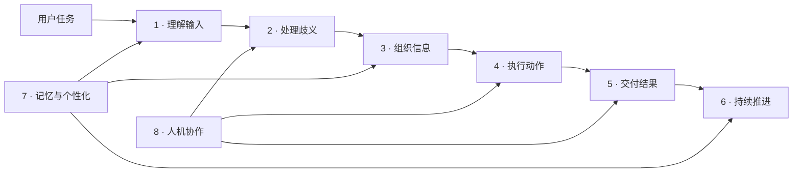

# Agent 产品功能形态图谱：从理解输入到持续推进任务

Agent 产品思维需要记录具体产品会长成什么样，Agent 工程技巧则解释这些形态靠什么实现。两边不是各自展开的清单：**产品形态提出工程要求，工程能力反过来决定产品边界。**

这篇按用户任务链积累 Agent 的产品功能形态。记录单位不是“某产品有某功能”，而是一段可复用的工作闭环：谁在什么场景下输入什么，AI 如何理解和执行，结果以什么形式交付，人在何处判断，系统依赖哪些工程能力。

## 一、记录边界

[理解 + AI 与 AI Native](./plus-ai-and-ai-native.md) 判断产品形态，[AI Native 产品怎么设计](./ai-native-product-design.md) 讨论人机分工、不确定性和系统接入。本文继续回答：这些判断落到产品里，会形成哪些用户可见的功能形态。

一条记录必须包含：

- 用户任务和触发条件
- 输入、处理、执行和结果形成的闭环
- AI 承担的工作与人保留的判断
- 适用场景和失败边界
- 对应的 Agent 工程技巧
- 已观察样本或待补证据

只有名称，没有闭环，不进入图谱。“视频回复”“智能搜索”“自动跟进”都只是功能名；只有说明它们如何进入任务、如何使用上下文、如何执行和如何交付，才构成产品形态。

## 二、整体坐标



前六类构成任务主链，记忆与人机协作横切整条链路。同一产品功能通常组合多种形态。例如视频回复位于“交付结果”，但要成为业务闭环，还可能依赖输入理解、历史记忆、人工预览和发送工具。

| # | 产品功能形态 | 用户可见的变化 | 主要工程依赖 |
|---|---|---|---|
| 1 | 理解输入 | 不再先找功能，直接表达目标或提交多模态材料 | 意图识别、Context、多模态模型 |
| 2 | 处理歧义 | 系统追问、给候选或说明无法判断 | 意图识别、Agent 大脑、评测 |
| 3 | 组织信息 | 把分散资料转成可判断的摘要、关系和风险 | Context、RAG、GraphRAG、结构化输出 |
| 4 | 执行动作 | 从提供建议进入真实系统操作 | Tool、MCP、权限、Agent 大脑 |
| 5 | 交付结果 | 结果按文本、卡片、报告、界面、音视频等媒介直接交付 | 结构化输出、多模态生成、异步任务 |
| 6 | 持续推进 | 系统等待事件、跟踪状态并继续处理 | 状态、事件、调度、可观测性 |
| 7 | 记忆与个性化 | 历史事实和稳定偏好参与当前任务 | Context、检索、记忆、隐私与遗忘 |
| 8 | 人机协作 | 人只在责任、风险和价值判断处介入 | 权限、审批、预览、回滚、审计 |

## 三、关键判断

- 形态按任务链分类，不按模型能力或页面功能分类。
- 一个功能可以组合多种形态，一种形态也可以出现在多个行业。
- 输出媒介只有改变了结果消费或业务交付方式，才值得单独记录。
- “Agent”不等于多步调用；关键是系统是否根据上下文和中间结果推进任务。
- 产品形态提出工程要求，但不要求每个产品装入全部工程组件。
- 工程图谱应持续总结完整，单个产品只选择能解决真实问题的部分。
- 没有真实样本时标记“待补”，不为了完整性编造产品行为。

## 四、产品功能形态

### 1. 理解输入

**一句话定义**：用户直接表达目标、提供材料或引用当前对象，系统负责把输入转换成可处理任务。

**常见形态**：

- 自然语言任务入口
- 图片、文档、音频和视频输入
- 引用当前页面、记录、消息或文件
- 从已有草稿或未完成任务继续
- 根据用户角色解释同一句请求

**核心张力**：低操作门槛 ↔ 输入信息不足。

**产品要求**：

- 能从工作现场补充的上下文，不重复向用户索取。
- 影响结果的歧义不能靠模型猜测。
- 输入转换后的任务范围需要对用户可见。
- 多模态输入要保留来源与引用位置。

**工程依赖**：[意图识别](../agent-system-design/01-task/agent-intent-recognition.md)、[上下文管理](../agent-system-design/03-view/agent-context-management.md)、多模态解析。

**何时不该用**：任务字段少且高度确定时，表单通常比自然语言更快、更可靠。

**样本状态**：自然语言入口已有大量通用 Agent 样本；业务系统中的多模态任务入口待补具体应用拆解。

### 2. 处理歧义

**一句话定义**：系统发现目标、对象、范围或风险不明确时，不直接执行，而是追问、给候选或转人工。

**常见形态**：

- 针对关键缺口追问
- 展示多个可能对象供选择
- 低风险场景采用默认值并明确说明
- 高风险场景停止执行
- 超出能力或权限后转人工

**核心张力**：减少打断 ↔ 防止错误理解。

**产品要求**：追问只针对会改变结果的信息；可以从上下文确定的内容不再询问；高风险任务不能用低置信度猜测推进。

**工程依赖**：[意图识别](../agent-system-design/01-task/agent-intent-recognition.md)、[Agent 大脑](../agent-system-design/04-decision/agent-brain.md)、[Agent 评测](../agent-system-design/06-observation/agent-evaluation.md)。

**何时不该用**：所有细节都追问会把自然语言入口退化成逐字段表单。

**样本状态**：待从客服、CRM 和 Coding Agent 的澄清流程补充对照样本。

### 3. 组织信息

**一句话定义**：AI 把分散、非结构化或跨系统的信息组织成用户能够直接判断的结果。

**常见形态**：

- 摘要和重点提取
- 多来源汇总与差异对比
- 时间线还原
- 关系链和因果线索整理
- 异常、风险和遗漏发现
- 根据角色调整排序与信息密度

**核心张力**：压缩信息 ↔ 保留关键证据。

**产品要求**：结论能回到来源；摘要不能替代事实记录；个性化改变重点但不能改变事实；结果结构要服务后续判断或执行。

**工程依赖**：[上下文管理](../agent-system-design/03-view/agent-context-management.md)、[RAG 工程](../agent-system-design/03-view/rag-engineering.md)、[GraphRAG 工程](../agent-system-design/03-view/graph-rag-engineering.md)、[Agent 评测](../agent-system-design/06-observation/agent-evaluation.md)。

**何时不该用**：精确核对、原文审阅和结构化查询场景不能只给生成式摘要。

**样本状态**：[CordysCRM Skill 拆解](../market-observation/cordys-crm-skill-breakdown.md) 已包含跨模块链路和角色化输出。

### 4. 执行动作

**一句话定义**：AI 不只提供建议，还调用真实系统完成查询、创建、修改、发送或编排。

**常见形态**：

- 单步工具调用
- 多系统连续操作
- 根据中间结果选择下一步
- 写入前预览，写入后读回核验
- 失败后重试、换路径或回退

**核心张力**：执行杠杆 ↔ 权限和错误影响。

**产品要求**：动作继承真实身份和权限；参数可验证；写操作有幂等与审计；不可逆动作由人明确批准；执行结果必须读回确认。

**工程依赖**：[工具调用](../agent-system-design/05-action/agent-tool-calling.md)、[Agent 大脑](../agent-system-design/04-decision/agent-brain.md)、[Skill](../agent-system-design/03-view/agent-skill-design.md)、MCP 与权限机制。

**何时不该用**：只需要分析和建议时，不要为了体现 Agent 而增加系统写权限。

**样本状态**：[CordysCRM Skill 拆解](../market-observation/cordys-crm-skill-breakdown.md) 已包含查询、写入预览和禁止删除边界。

### 5. 交付结果

**一句话定义**：系统根据任务和消费场景，把结果交付为可直接阅读、编辑、传播或继续操作的媒介。

**输出形态谱系**：

```text
纯文本
→ 结构化卡片 / 表格 / 图表
→ 可编辑文档 / 报告
→ 可交互界面
→ 音频 / 视频
→ 已执行的业务动作
```

**核心张力**：表达丰富度 ↔ 信息密度、生成成本和可核验性。

**产品要求**：媒介由任务决定，不由模型能力决定；事实与来源在转换媒介后仍可核验；生成时间和成本符合场景；对外内容保留预览与确认。

**工程依赖**：结构化输出、多模态生成、异步任务、文件存储、内容审核和成本控制。

**何时不该用**：内部数据核对、精确引用和快速扫描场景通常不适合视频输出。

**样本状态**：视频回复作为组合案例记录于下一节，真实项目样本待补。

### 6. 持续推进

**一句话定义**：系统在一次响应后继续跟踪任务，等待时间或外部事件，并在条件满足后推进下一步。

**常见形态**：

- 长任务进度和阶段结果
- 定时执行与事件触发
- 等待审批或外部回复后续做
- 催办、提醒和回访
- 失败恢复与断点续做
- 完成后自动生成复盘

**核心张力**：持续负责 ↔ 失控执行和状态过期。

**产品要求**：每个任务有明确状态、下一步、退出条件和责任人；后台动作可暂停；上下文过期后重新确认；用户能看到系统为什么仍在运行。

**工程依赖**：[Agent 大脑](../agent-system-design/04-decision/agent-brain.md)、状态持久化、事件系统、调度和[可观测性](../agent-system-design/06-observation/agent-observability.md)。

**何时不该用**：一次生成即可完成的任务不需要引入长期状态和调度系统。

**样本状态**：Coding Agent 的长任务续做已有样本；企业业务事件驱动样本待补。

### 7. 记忆与个性化

**一句话定义**：历史事实、稳定偏好和经过验证的经验进入当前任务，改变系统的检索、判断或交付方式。

**常见形态**：

- 记住稳定输出偏好
- 根据角色调整关注点
- 检索相似历史任务
- 复用已验证工作流程
- 主动发现未完成事项
- 把反复成功的方法沉淀成 Skill

**核心张力**：持续个性化 ↔ 错误固化、隐私和遗忘。

**产品要求**：事实、偏好和系统推断分开；每条长期信息有来源和范围；一次性指令不自动固化；用户可以查看、修改和删除。

**工程依赖**：[上下文管理](../agent-system-design/03-view/agent-context-management.md)、检索、记忆系统、[Skill](../agent-system-design/03-view/agent-skill-design.md) 与隐私机制。

**何时不该用**：低频一次性任务或敏感信息无法获得长期保存授权时，不应建立用户画像。

**样本状态**：通用 Agent 的记忆和 Skill 沉淀已有项目观察，企业个性化效果评测待补。

功能形态图谱记录“任务被完成的样子”，自进化记录“完成方式如何沉淀到下一轮”——见 [Agent 自进化：让使用经验进入下一轮](./agent-self-evolution.md)。

### 8. 人机协作

**一句话定义**：人不逐步操作系统，而是在目标、歧义、责任和价值取舍节点介入。

**常见形态**：

- AI 先执行低风险准备工作
- 关键动作前提供预览
- 人修改方案后继续执行
- 高风险或证据不足时人工接管
- 多角色审批与任务交接
- AI 记录决策依据和后续状态

**核心张力**：放大执行杠杆 ↔ 保留责任边界。

**产品要求**：确认点放在责任变化处；人工修改能进入后续上下文；接管后不与后台 Agent 并发冲突；操作和批准分别留痕。

**工程依赖**：权限、审批、状态同步、回滚、审计、[可观测性](../agent-system-design/06-observation/agent-observability.md) 与[多 Agent 编排](../agent-system-design/04-decision/agent-multi-agent-orchestration.md)。

**何时不该用**：没有风险或价值判断的机械步骤不需要人工逐项批准。

**样本状态**：写操作确认已有样本；多人协作和跨角色 Handoff 待补。

## 五、组合案例：AI 生成视频回复

“AI 生成带视频的回复”不是孤立功能，而是多种形态组成的交付链：

```text
用户指定回复对象和目的
→ 系统读取当前消息、历史关系和业务事实
→ 识别是解释、跟进还是营销表达
→ 生成回复结构与事实草稿
→ 选择语气、声音、画面或数字人模板
→ 异步生成视频
→ 人预览事实和表达
→ 发送并记录结果
```

它至少组合五类形态：

| 链路 | 对应形态 | 关键问题 |
|---|---|---|
| 读取消息和历史 | 理解输入、记忆 | 当前回复对象和上下文是否准确 |
| 判断回复目的 | 处理歧义 | 是解释、跟进还是促销 |
| 组织表达内容 | 组织信息 | 事实是否完整，表达顺序是否合适 |
| 生成音视频 | 交付结果 | 视频是否比文本更适合当前场景 |
| 预览并发送 | 人机协作、执行动作 | 谁确认，发送后如何留痕 |

适合视频回复的场景通常需要情绪、人格化表达、对外传播或低阅读负担。需要精确引用、快速核对或高信息密度的场景，文本和结构化卡片更合适。

工程上不能只接一个视频生成模型。还需要 Context、多模态生成、异步任务、内容审核、成本控制、预览确认和发送工具。产品形态先定义完整交付链，工程技巧再逐项支撑。

## 六、产品形态与工程技巧如何互相回流

产品侧和工程侧分别记录不同问题：

| 产品功能形态回答 | Agent 工程技巧回答 |
|---|---|
| 用户任务以什么入口开始 | 意图和上下文如何构造 |
| AI 在任务中承担哪些工作 | 大脑如何循环、选择和退出 |
| 结果以什么形式交付 | 输出、工具和异步任务如何实现 |
| 人在什么节点介入 | 权限、审批、回滚和审计如何约束 |
| 任务如何持续推进 | 状态、事件和可观测性如何支撑 |
| 个性化从哪里形成 | 记忆、检索和 Skill 如何组织 |

观察真实 Agent 项目时，先把业务行为记录到本图谱，再回到 [Agent 工程技巧总览](../agent-system-design/index.md) 判断依赖。研究一项工程技巧时，也要回来看它能支撑哪些产品形态，避免只积累技术结构而没有产品出口。

## 七、反模式

- 按“聊天、RAG、视频、工作流”罗列技术名词，没有用户任务链。
- 把模型能生成某种媒介直接当成产品价值。
- 为了体现 Agent，让一次生成任务进入复杂循环。
- 只设计正常路径，不记录歧义、失败和人工接管。
- 只写产品体验，不标注权限、状态、成本和评测依赖。
- 没有真实样本时编造产品案例填满图谱。
- 看到一项工程技巧，就为产品增加一个对应功能。

## 八、持续维护模板

后续发现新的产品形态，按以下结构补充：

```markdown
### 形态名称

**一句话定义**：用户可感知的行为变化。

**用户任务与触发**：谁在什么场景下发起。

**工作闭环**：输入 → AI 判断/执行 → 用户可见过程 → 最终结果。

**核心张力**：需要平衡的两端。

**产品要求**：真正落地必须满足的条件。

**工程依赖**：对应 Agent 工程技巧。

**何时不该用**：边界和更简单的替代方案。

**样本状态**：已拆解样本 / 已知待拆 / 待补证据。
```

新增记录后，同时检查工程技巧总览是否已有对应能力；新增工程技巧后，也检查本图谱是否需要补充产品出口。图谱追求持续完整，单个产品仍按真实任务选择必要形态与组件。
