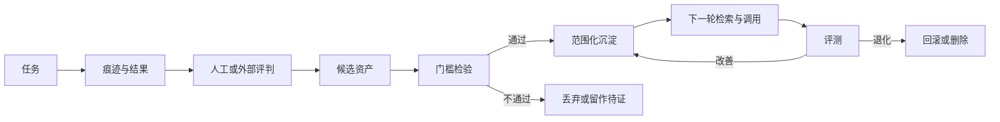

# Agent 自进化：让使用经验进入下一轮

Agent 自进化指：跨任务使用让产品或 harness 状态发生**受控**变化，下一轮我只需要更少的输入，Agent 就能更准、更稳、更省力地完成类似任务。它不是模型训练，也不是把所有对话历史塞进上下文。

[AI Native 产品怎么设计](./ai-native-product-design.md) 已经讨论过“把历史记录变活”。本文继续回答：什么样的经验可以沉淀、怎样沉淀、怎样在下一轮被引用，以及如何避免越用越偏。

## 一、定义与非目标

自进化必须满足三个条件：

- 跨任务、跨会话持续生效，而不是单次对话内的临时上下文。
- 产品或 harness 的状态发生变化，而不是模型权重重新训练。
- 变化受规则约束：来源、范围、生命周期、删除责任都明确。

不属于自进化的常见误解：

- **不是模型训练**：不修改基座模型，也不进行微调。
- **不是对话缓存**：原始聊天记录并不直接进入下一轮。
- **不是隐式学习**：沉淀必须经过显式评判和规则筛选。
- **不是自动修改代码**：除非按工程实践批准并可回滚，否则 Agent 不应自行重写自身配置。

实际效果是：我给同样的目标，Agent 推进得更多、问得更少；我把任务换到下一个项目或下一个角色，部分偏好仍能复用。

## 二、三类资产

只有三种材料值得沉淀。

| 资产 | 含义 | 写入触发 | 对下一轮的作用 | 何时删除 |
|---|---|---|---|---|
| **稳定偏好** | 风格、语言、范围、表达约束等长期一致的设定 | 在多个任务中重复出现且未被我纠正 | 影响输出格式、详略、判断倾向 | 偏好失效、范围改变或来源无效 |
| **可复用流程** | 经过验证的多步处理方法，被封装为 Skill 或 SOP | 成功完成且具有通用性 | 在新任务中按触发条件直接执行 | 流程过期、API 变化或失败率上升 |
| **被评判过的任务历史** | 任务上下文、采用路径、最终结果、人工或外部评价 | 任务被显式标记为“值得记住” | 检索后作为判断依据参与下一轮 | 隐私过期、范围外或被显式撤回 |

未评判的原始历史、私下修改的小动作、一次性的临时要求都不属于这三类。让这三类资产保持纯净，是自进化能否成立的前提。

详细的产品形态描述见 [功能形态图谱 §7 记忆与个性化](./agent-product-functional-form-atlas.md)；记忆后端和检索实现见 [Context 上下文管理](../agent-system-design/03-view/agent-context-management.md)；流程沉淀形式见 [Skill 经验封装](../agent-system-design/03-view/agent-skill-design.md)。

## 三、受控反馈回路



关键点：

- **评判必须先于沉淀**。没有评价结果的任务不应被自动转成资产。
- **门槛是显式规则**。重复度、稳定性、敏感信息、作用范围都需通过检查。
- **检索不是全文回放**。下一轮只取与当前任务相关的资产。
- **评测不只是成功**。需要同时关注纠正率、回归和成本。

## 四、写入与晋升门槛

一个素材从痕迹到沉淀，至少要回答以下问题：

- **明文还是推断**：偏好是否由我明确说过，还是 Agent 自行归纳。
- **重复与稳定**：在多少任务中重复出现，是否被纠正过。
- **可评判性**：结果是否经过人工评价或外部验证。
- **敏感信息**：是否包含隐私、凭证、客户数据或模型推测。
- **置信度**：依据多少，错误代价多大。

模型自评只作辅助，不作唯一依据。当 Agent 表示“感觉这个偏好可以推广”，默认应当保守。真正能晋升的资产，往往已经经过多次一致表现。

## 五、最简进化记录契约

每条沉淀资产应至少包含以下字段：

```text
kind         # 类型：preference / procedure / judged_history
content      # 资产内容或引用
source       # 来源：哪一次任务、哪一次反馈、哪一段历史
evidence     # 评价证据：成功、修正、采纳次数
scope        # 作用范围：session / user / project / team / domain / global
status       # 状态：candidate / approved / deprecated
confidence   # 置信度
version      # 版本号
valid_from   # 生效时间
valid_until  # 失效时间
derived_from # 派生关系：是否基于其他资产
delete_owner # 删除责任方
```

字段不是越多越好。最小契约的目的是让一条资产在被检索、被引用、被回滚时都有据可查。当字段缺失时，资产不应当被自动晋升。

## 六、下一轮调用规则

沉淀的资产进入下一轮必须遵守以下规则：

- **最小作用范围**：默认只在当前 session 或 project 生效，跨项目需显式批准。
- **当前指令优先**：我刚说出口的指令压倒所有历史偏好。
- **已批准规则先于推断**：approved 状态资产压倒 candidate 状态推断。
- **只检索相关记录**：不把全部资产都塞进上下文，检索只看与当前任务相关的部分。
- **记录影响来源**：当一条资产改变了 Agent 的输出，应当在日志中记录是哪一条。
- **防止循环自证**：用过往的 Agent 输出作为未来偏好，等同于自评自证，应当禁止。

调用规则的核心是避免让沉淀成为负担，而不是帮助。

## 七、删除、衰减、回滚是一等公民

自进化最容易失控的是删除机制不完善。一条资产一旦沉淀，就可能被反复引用；如果源头已经失效，错误会被持续放大。

设计上需要：

- **源头失效即级联清理**：当某条历史被撤回，所有从它派生的偏好和流程应同步进入 candidate 状态，等待复审。
- **索引和缓存同步清理**：检索索引、向量缓存、Skill 加载表都不能保留陈旧条目。
- **版本回退**：每次晋升都保留前一版本，允许快速回到上一可用状态。
- **过期复审**：长期不使用的资产主动进入复审流程，而不是无限期保留。
- **隐私硬删**：当用户行使删除权，相关记录必须在所有位置消失，且不可仅靠“标记删除”跳过检索。

可以这样表述：**没有删除能力的自进化，不是自进化，是错误累积。**

## 八、度量

自进化的价值需要可观察的指标，否则只是感觉更好。

| 指标 | 含义 | 计算方向 |
|---|---|---|
| 任务成功率 | 在相似任务中沉淀前后是否成功 | 沉淀后应提升 |
| 纠正率 | Agent 输出被人工修改的频率 | 沉淀后应下降 |
| 误个性化率 | 与当前任务无关的资产被错误调用 | 应保持低位 |
| 流程触发精度 | Skill 流程被触发后是否真的适用 | 应持续提升 |
| 回归率 | 沉淀后引入新错误的频率 | 应保持低位 |
| 人工介入次数 | 完成同一任务需要人参与的次数 | 应逐步下降 |
| 成本 | 完成任务的 token、时间和金钱 | 应下降或维持 |

每一次晋升或删除都应记录指标变化。指标既是改进的依据，也是判断沉淀是否过度的依据。

## 九、反模式与边界

- **一次性指令被固化**：把临时要求当作长期偏好。
- **推断冒充事实**：模型归纳被当成我明确表达的偏好。
- **原始历史塞入上下文**：把所有日志、聊天、文件都丢给模型。
- **只取成功证据**：用成功结果证明偏好有效，忽略失败。
- **跨用户或跨项目泄露**：个人偏好被带入团队场景，或 A 项目的经验混入 B 项目。
- **规则不可改**：沉淀后无法删除或更新，错误持续放大。
- **自评自证**：用 Agent 自己的判断作为晋升依据。
- **过度个性化**：偏好过多导致每轮检索成本高于执行成本。

## 十、关系图与一个克制样本

自进化位于产品形态与工程能力之间，是把“被记录下的使用经验”变成“被产品持续使用的能力”的机制。

| 已有内容 | 解决的问题 |
|---|---|
| [功能形态图谱](./agent-product-functional-form-atlas.md) §7 | 用户可见的“记忆与个性化”形态 |
| [AI Native 产品怎么设计](./ai-native-product-design.md) §6 | 历史如何参与当前任务 |
| [Context 上下文管理](../agent-system-design/03-view/agent-context-management.md) | 记忆如何存储与检索 |
| [Skill 经验封装](../agent-system-design/03-view/agent-skill-design.md) | 流程沉淀如何被调用与维护 |
| [Agent 评测](../agent-system-design/06-observation/agent-evaluation.md) | 沉淀后的结果如何被验证 |
| [实操落地篇](../tool-mastery/agent-from-paradigm-to-practice.md) | 真实使用中沉淀与维护的具体做法 |
| [演变趋势观察：从 Prompt 到 Loop](../evolution-trends/agent-engineering-evolution-prompt-to-loop.md) | 工程层如何随模型能力演进 |

一个克制的现实样本：[Hermes 自学习 Agent](../market-observation/agent-harness-engine-comparison.md) 实现了 learning loop，会在任务完成后自动创建 Skill、改进 Skill、周期性持久化知识。它是自进化机制在产品形态上的具体体现，但同时也是反例——agent 自创 Skill 在企业场景中需要额外的治理，否则会把临时偏好固化成规则。详细对比见该文 §三 路径三。

## 结论

自进化的目的不是让 Agent 看起来更聪明，而是让我越来越省力。要让这个目的成立，需要三件事：

- 沉淀必须是经过评判的资产，不是原始历史。
- 沉淀必须有显式规则，包括作用范围、生效时间和删除机制。
- 沉淀必须有可观察的效果，否则只是占用上下文的装饰。

满足这三点，使用经验才会真正成为下一轮的能力，而不是成为下一轮的负担。
