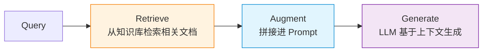
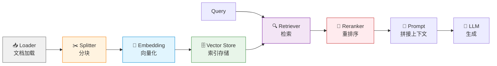
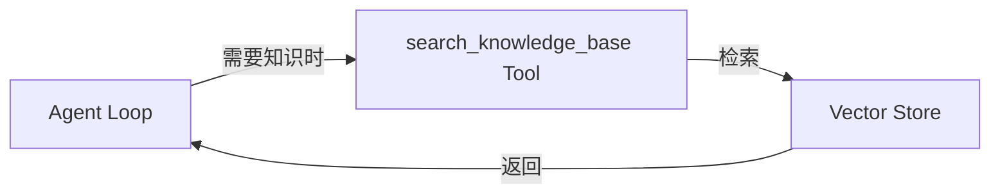
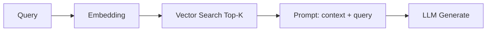
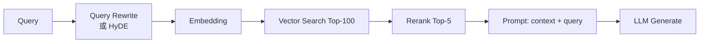
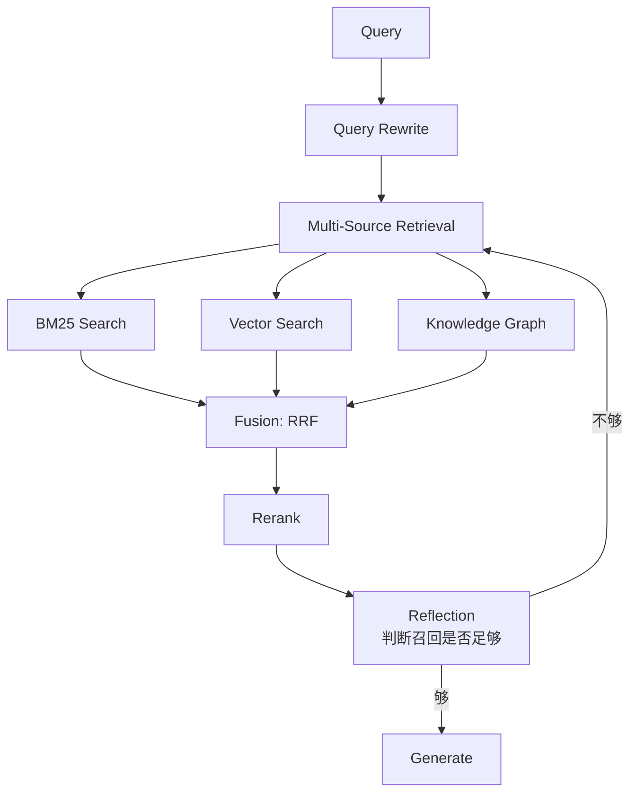
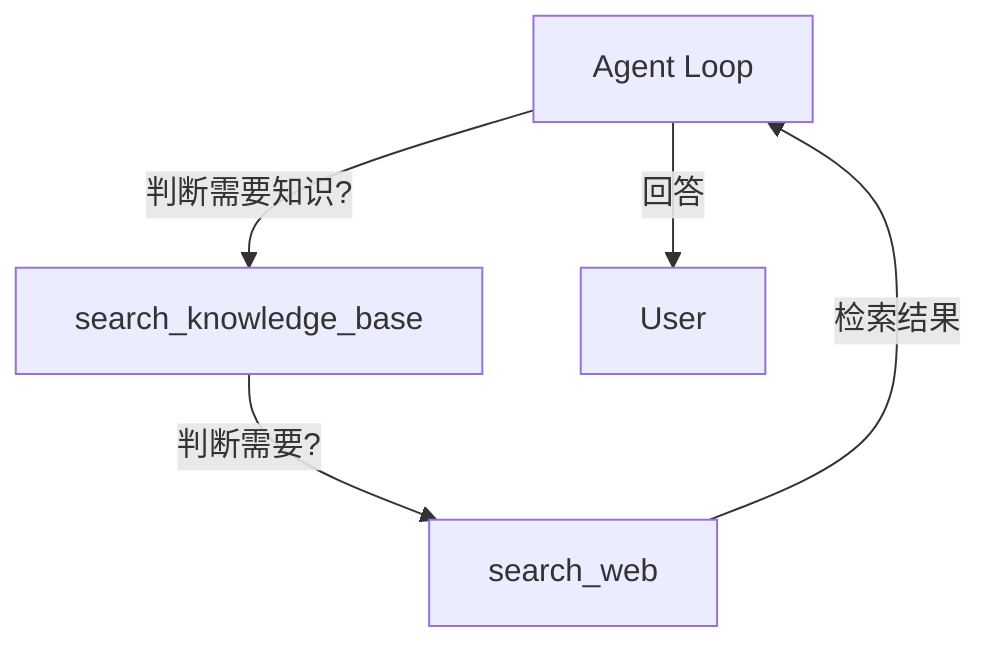

# Agent RAG 设计篇

Agent 不能凭空回答。当用户问"我们公司的退款政策是什么"、"上周那次故障的根因"、"这段代码在干嘛"——LLM 没有这些信息。

RAG（Retrieval-Augmented Generation，检索增强生成）是 Agent 接入"私域知识"的标准方式。它的本质是**检索 → 增强 → 生成**



这个流程怎么设计——文档怎么切、Embedding 怎么选、检索怎么评、生成怎么注入上下文——决定了 Agent 的知识准确率和回答质量。

本文从五个部分来记录：

1. **RAG 全景**——先建立坐标系，理解 RAG 不是"向量检索"那么简单
2. **用原始代码编排 RAG 链路**——不依赖框架，自己实现文档加载→分块→Embedding→索引→检索→生成
3. **用框架编排 RAG 链路**（LangChain 1.0）——VectorStore、Retriever、ContextualCompressionRetriever 的真实接口
4. **RAG 的核心细节**——分块策略、混合检索、重排序、评估
5. **常见陷阱**

最后覆盖几种 RAG 模式（Naive RAG、Advanced RAG、Modular RAG）在 Agent 中的位置，以及一份设计检查清单。

---

## 先建立坐标系：RAG 的演化谱系

在动手之前，先明确一个坐标系。RAG 不是一种技术，而是从 R0 到 R3 的谱系：

| 等级 | 名称 | 特征 | 何时够用 |
|------|------|------|---------|
| **R0** | Naive RAG | 切块→Embedding→Top-K→拼接 | 单一文档集、问答案明确 |
| **R1** | Advanced RAG | 加 Query Rewrite / HyDE / Re-rank | 问法多样，需要语义对齐 |
| **R2** | Modular RAG | 多路召回 + Rerank + Reflection | 大规模、多源、需要判断 |
| **R3** | Agentic RAG | Agent 决定"何时检索、检索什么" | 复杂任务、混合多源知识 |

本文聚焦 **R0-R2**。R3 还在演进，主流框架的 API 还在快速变化。

---

## 维度一：用原始代码编排 RAG 链路

### RAG 的核心组件

任何 RAG 系统，无论是否用框架，都包含六个核心组件：



- **Loader（加载器）**：把各种格式的文件（PDF / Markdown / HTML / 数据库）转成统一的 `Document` 列表
- **Splitter（分块器）**：把长文档切成合适大小的 chunks
- **Embedding（嵌入模型）**：把文本转成向量
- **Vector Store（向量库）**：存向量 + 元数据，支持相似度检索
- **Retriever（检索器）**：根据 query 返回相关文档
- **Reranker（重排序）**：对初检结果二次排序，提升精度

理解这六个组件的关系，你就知道 RAG 链路的每一步在干什么。

### 理解 RAG 与传统搜索的根本区别

传统搜索是**关键词匹配**——用户输入"退款"，匹配包含"退款"的文档。

RAG 是**语义匹配**——用户输入"我不满意想把钱拿回来"，匹配语义相近的"退款政策"。

带来的差异：

| 维度 | 传统搜索 | RAG |
|------|---------|-----|
| 匹配方式 | 关键词 + 倒排索引 | 向量相似度 |
| 处理查询 | 字面匹配 | 语义理解 |
| 排序依据 | BM25 / TF-IDF | Cosine 距离 |
| 优势 | 精确词匹配快 | 模糊语义召回好 |
| 劣势 | 词不匹配就漏 | 向量检索可能语义漂移 |

**混合检索**——关键词检索 + 向量检索，再用 Rerank 融合排序。

### 从最小化 RAG 链路开始

不用框架，核心逻辑可以拆成四个独立组件，每个组件管一件事。

#### 配置对象：贯穿所有步骤的统一参数

```python
@dataclass
class RAGConfig:
    """RAG 链路的完整配置"""
    # 文档加载
    supported_extensions: tuple = (".md", ".txt", ".pdf", ".html")

    # 分块
    chunk_size: int = 1000          # 每块字符数
    chunk_overlap: int = 200        # 块之间重叠字符数
    min_chunk_size: int = 100       # 小于此值的块会被合并

    # Embedding
    embedding_dim: int = 1536       # OpenAI text-embedding-3-small 维度
    embedding_batch_size: int = 64

    # 检索
    top_k: int = 5                  # 初检返回数量
    similarity_threshold: float = 0.7  # 低于此分丢弃

    # 重排序
    rerank_top_n: int = 3           # 重排后保留数量

    # 生成
    max_context_tokens: int = 4000  # 拼到 Prompt 的最大 token 数
    prompt_template: str = """基于以下参考文档回答问题：

{context}

问题：{query}
"""
```

这个配置会作为参数传入所有函数，保证它们对"切多大切多少重叠、检索多少、保留几条"有统一的判断。

#### 1. 文档加载：loader

```python
from pathlib import Path
from dataclasses import dataclass, field
from typing import Iterator


@dataclass
class Document:
    """RAG 的统一文档格式"""
    page_content: str                              # 文本内容
    metadata: dict = field(default_factory=dict)    # 元数据：source / page / title


def load_documents(docs_dir: Path, config: RAGConfig) -> list[Document]:
    """加载目录下的所有支持格式文档

    返回的 Document.metadata 必须包含 source 字段（文件路径），
    后续生成答案时可用于引用溯源。
    """
    documents = []
    for file_path in docs_dir.rglob("*"):
        if file_path.suffix.lower() not in config.supported_extensions:
            continue

        # 根据扩展名选择 loader
        if file_path.suffix == ".md":
            content = file_path.read_text(encoding="utf-8")
        elif file_path.suffix == ".pdf":
            content = extract_pdf_text(file_path)
        elif file_path.suffix == ".html":
            content = extract_html_text(file_path)
        else:
            content = file_path.read_text(encoding="utf-8")

        documents.append(Document(
            page_content=content,
            metadata={"source": str(file_path), "filename": file_path.name},
        ))

    return documents
```

**关键设计：** `metadata.source` 必须保留原始文件路径。RAG 系统的可解释性来自答案溯源——用户问"这条信息从哪来"，必须能回到原文。

#### 2. 分块：splitter

```python
def split_documents(
    documents: list[Document],
    config: RAGConfig,
) -> list[Document]:
    """把长文档切成 chunks。

    分块是 RAG 最容易被低估的环节。切太大 → 检索召回不精准；
    切太小 → 语义不完整，LLM 拿到碎片。
    """
    chunks = []
    for doc in documents:
        text = doc.page_content
        # 按段落优先切分（保留段落完整性）
        paragraphs = text.split("\n\n")

        current_chunk = ""
        for para in paragraphs:
            # 当前块加上新段落是否超限
            if len(current_chunk) + len(para) > config.chunk_size and current_chunk:
                # 提交当前块
                chunks.append(Document(
                    page_content=current_chunk.strip(),
                    metadata={**doc.metadata, "chunk_index": len(chunks)},
                ))
                # 重叠部分：保留最后 chunk_overlap 字符
                overlap_start = max(0, len(current_chunk) - config.chunk_overlap)
                current_chunk = current_chunk[overlap_start:] + "\n\n" + para
            else:
                current_chunk += "\n\n" + para

        # 收尾：最后一块
        if current_chunk.strip() and len(current_chunk) >= config.min_chunk_size:
            chunks.append(Document(
                page_content=current_chunk.strip(),
                metadata={**doc.metadata, "chunk_index": len(chunks)},
            ))

    return chunks
```

**关键设计原则：**

- **chunk_overlap 不是浪费**——它解决"边界问题"。如果关键句子正好被切在两个块的边界上，没有 overlap 就检索不到
- **保留段落完整性**——按 `\n\n` 切而不是按字符切，能避免把一个段落切得支离破碎
- **`min_chunk_size` 过滤碎块**——避免产生大量短块拉低检索质量

#### 3. Embedding：向量化

```python
import hashlib
import numpy as np
from typing import Protocol


class Embeddings(Protocol):
    """Embedding 模型接口（不依赖具体实现）"""
    def embed_documents(self, texts: list[str]) -> list[list[float]]:
        """批量向量化文档"""
        ...

    def embed_query(self, text: str) -> list[float]:
        """向量化单条 query"""
        ...


class CachedEmbeddings:
    """带本地缓存的 Embedding 包装器

    同样的文本不需要重复计算 embedding。
    """
    def __init__(self, base: Embeddings, cache_size: int = 2048):
        self.base = base
        self._cache: dict[str, list[float]] = {}
        self._cache_size = cache_size

    def _key(self, text: str) -> str:
        return hashlib.md5(text.encode()).hexdigest()

    def embed_documents(self, texts: list[str]) -> list[list[float]]:
        results = []
        to_compute = []
        indices = []
        for i, text in enumerate(texts):
            key = self._key(text)
            if key in self._cache:
                results.append(self._cache[key])
            else:
                results.append(None)
                to_compute.append(text)
                indices.append(i)

        # 批量计算未缓存的
        if to_compute:
            computed = self.base.embed_documents(to_compute)
            for idx, vec in zip(indices, computed):
                results[idx] = vec
                # LRU 简单实现：满了清空一半
                if len(self._cache) >= self._cache_size:
                    self._cache.clear()
                self._cache[self._key(to_compute[indices.index(idx)])] = vec

        return results

    def embed_query(self, text: str) -> list[float]:
        key = self._key(text)
        if key in self._cache:
            return self._cache[key]
        vec = self.base.embed_query(text)
        self._cache[key] = vec
        return vec
```

**关键设计：**

- **embed_documents 和 embed_query 是不同的入口**——某些模型（如 OpenAI）对两类调用有不同优化
- **批量调用**——单条调用 API 太慢且贵，批量调用既快又省
- **缓存是必须的**——同一段文本（公司名称、产品描述）会被多次检索，不缓存就是烧钱

#### 4. 向量库：存储与检索

```python
import numpy as np
from typing import Protocol


class VectorStore(Protocol):
    """向量库接口（最简化版）

    真实的向量库（Chroma / Weaviate / Qdrant）实现这个接口。
    """
    def add_documents(
        self,
        documents: list[Document],
        embeddings: list[list[float]],
    ) -> list[str]:
        """添加文档 + 向量，返回 IDs"""
        ...

    def similarity_search(
        self,
        query_embedding: list[float],
        k: int = 5,
    ) -> list[tuple[Document, float]]:
        """相似度检索，返回 (Document, score) 列表"""
        ...


class InMemoryVectorStore:
    """最简实现：用 numpy 计算 cosine 相似度

    生产环境用 Chroma / Weaviate / Qdrant 等专用库。
    """
    def __init__(self):
        self.docs: list[Document] = []
        self.vectors: list[list[float]] = []

    def add_documents(
        self,
        documents: list[Document],
        embeddings: list[list[float]],
    ) -> list[str]:
        ids = []
        for doc, vec in zip(documents, embeddings):
            doc_id = f"doc_{len(self.docs)}"
            doc.metadata["id"] = doc_id
            self.docs.append(doc)
            self.vectors.append(vec)
            ids.append(doc_id)
        return ids

    def similarity_search(
        self,
        query_embedding: list[float],
        k: int = 5,
    ) -> list[tuple[Document, float]]:
        if not self.vectors:
            return []

        # 一次性计算所有向量的 cosine 相似度
        matrix = np.array(self.vectors)
        query = np.array(query_embedding)

        # Cosine 相似度 = dot / (||a|| * ||b||)
        query_norm = np.linalg.norm(query)
        doc_norms = np.linalg.norm(matrix, axis=1)
        similarities = (matrix @ query) / (doc_norms * query_norm + 1e-8)

        # 取 top-k
        top_indices = np.argsort(similarities)[::-1][:k]
        return [
            (self.docs[i], float(similarities[i]))
            for i in top_indices
        ]
```

**关键设计：**

- **返回 (Document, score) 元组**——下游需要分数做过滤和重排序，不能只返回 Document
- **`+1e-8` 防 0 除**——零向量会导致 NaN
- **相似度范围 [-1, 1]**——向量归一化后，1 = 完全相同，-1 = 完全相反，0 = 正交

#### 5. 检索器：retriever

```python
def retrieve(
    query: str,
    vector_store: VectorStore,
    embeddings: Embeddings,
    config: RAGConfig,
) -> list[Document]:
    """完整检索流程：query → embedding → top-k → 过滤低分 → 返回"""
    # 1. 把 query 转成向量
    query_vec = embeddings.embed_query(query)

    # 2. 向量库检索
    raw_results = vector_store.similarity_search(query_vec, k=config.top_k)

    # 3. 过滤低分（低于阈值丢弃）
    filtered = [
        (doc, score) for doc, score in raw_results
        if score >= config.similarity_threshold
    ]

    # 4. 返回纯 Document 列表（去掉 score）
    return [doc for doc, _ in filtered]
```

#### 6. 完整 RAG 链路：问答案

```python
def answer_question(
    query: str,
    vector_store: VectorStore,
    embeddings: Embeddings,
    llm,
    config: RAGConfig,
) -> str:
    """完整 RAG 链路：检索 → 增强 → 生成"""

    # ========== Phase 1: Retrieve（检索）==========
    docs = retrieve(query, vector_store, embeddings, config)

    if not docs:
        return "未找到相关文档，无法回答。"

    # ========== Phase 2: Augment（增强 Prompt）==========
    # 把检索结果拼到 Prompt 中
    context_parts = []
    total_chars = 0
    for i, doc in enumerate(docs):
        # 控制总长度，避免撑爆上下文
        if total_chars + len(doc.page_content) > config.max_context_tokens * 4:
            break
        source = doc.metadata.get("source", "未知")
        context_parts.append(
            f"[文档{i+1}] 来源: {source}\n{doc.page_content}"
        )
        total_chars += len(doc.page_content)

    context = "\n\n".join(context_parts)
    prompt = config.prompt_template.format(context=context, query=query)

    # ========== Phase 3: Generate（生成）==========
    response = llm.invoke(prompt)
    return response
```

关键设计要点：

- **空结果处理**——没找到文档时不要硬编答案。明确告诉用户"未找到"，比给错误信息好
- **按引用编号拼接**——`[文档1] [文档2]` 让 LLM 知道每段来自哪里，也方便后续溯源
- **Token 预算控制**——检索结果可能很多，需要按字符数限制，超出部分截断

---

### 拆解 RAG 的三个阶段

每个 RAG 系统都可以拆成三个阶段性操作。

**Retrieve（检索）——从知识库找到相关文档**

```
输入：用户 query
输出：top-k 相关文档列表 + 相似度分数
```

设计原则：**先召回后排序**。初检用向量相似度快速召回候选集（速度优先），重排序用更复杂的模型二次精排（精度优先）。

**Augment（增强）——把文档拼到 Prompt**

```
输入：query + 检索结果
输出：完整的 Prompt（带上下文）
```

设计原则：**显式标记来源**。每段文档都标注 `[文档N] 来源: ...`，让 LLM 知道信息的出处，也方便生成答案时引用。

**Generate（生成）——LLM 基于上下文回答**

```
输入：增强后的 Prompt
输出：自然语言回答
```

设计原则：**让 LLM 知道边界**。在 Prompt 里明确"如果文档中没有答案，请回答'我不知道'"，避免 LLM 在文档之外编造内容。

---

### 在原始代码中处理检索质量与边界

#### 检索质量：混合检索

最朴素的做法只有向量检索。但实际场景中，向量检索在以下情况会失败：

- 专有名词（产品名 / 错误码 / API 名）：向量表示弱
- 数字 ID / 版本号：向量无法精确匹配
- 短查询（"v2.3 修复了什么"）：向量表示弱

解决：**混合检索——BM25 关键词检索 + 向量检索，结果融合**。

```python
class HybridRetriever:
    """BM25 + 向量检索的混合检索器"""

    def __init__(self, vector_store: VectorStore, bm25_index, embeddings: Embeddings):
        self.vector_store = vector_store
        self.bm25_index = bm25_index
        self.embeddings = embeddings

    def retrieve(self, query: str, k: int = 5) -> list[Document]:
        # 1. 向量检索：召回 top-2k（多召为后续融合留空间）
        query_vec = self.embeddings.embed_query(query)
        vector_results = self.vector_store.similarity_search(query_vec, k=k * 3)

        # 2. BM25 检索：关键词命中
        bm25_results = self.bm25_index.search(query, k=k * 3)

        # 3. 融合：使用 RRF (Reciprocal Rank Fusion)
        fused = reciprocal_rank_fusion(
            vector_results=[(doc, score) for doc, score in vector_results],
            bm25_results=bm25_results,
            k=60,  # RRF 常数
        )

        return [doc for doc, _ in fused[:k]]


def reciprocal_rank_fusion(
    vector_results: list[tuple[Document, float]],
    bm25_results: list[tuple[Document, float]],
    k: int = 60,
) -> list[tuple[Document, float]]:
    """RRF 融合算法：score(d) = Σ 1 / (k + rank_i(d))"""
    scores: dict[str, float] = {}
    doc_map: dict[str, Document] = {}

    for rank, (doc, _) in enumerate(vector_results):
        doc_id = doc.metadata.get("id", doc.page_content[:50])
        scores[doc_id] = scores.get(doc_id, 0) + 1.0 / (k + rank + 1)
        doc_map[doc_id] = doc

    for rank, (doc, _) in enumerate(bm25_results):
        doc_id = doc.metadata.get("id", doc.page_content[:50])
        scores[doc_id] = scores.get(doc_id, 0) + 1.0 / (k + rank + 1)
        doc_map[doc_id] = doc

    sorted_ids = sorted(scores.keys(), key=lambda x: scores[x], reverse=True)
    return [(doc_map[doc_id], scores[doc_id]) for doc_id in sorted_ids]
```

**为什么用 RRF 而不是简单加权？**

- **不依赖分数绝对值**——向量相似度（0-1）和 BM25 分数（0-∞）尺度完全不同，加权融合需要归一化
- **对单路失败鲁棒**——如果某路召回差，只贡献低分不会拖垮整体
- **简单可调**——只需调整 k 常数，不需要学习权重

#### 检索边界：返回空结果时怎么办

```python
def retrieve_with_fallback(
    query: str,
    vector_store: VectorStore,
    embeddings: Embeddings,
    config: RAGConfig,
) -> list[Document]:
    docs = retrieve(query, vector_store, embeddings, config)

    if not docs:
        # 三层兜底策略
        # 1. 降低阈值重试
        config.similarity_threshold *= 0.8
        docs = retrieve(query, vector_store, embeddings, config)
        if docs:
            return docs

        # 2. 改写 query 后重试
        rewritten = rewrite_query(query)  # 用 LLM 改写 query
        docs = retrieve(rewritten, vector_store, embeddings, config)
        if docs:
            return docs

        # 3. 返回空，让上层处理
        return []

    return docs
```

**关键设计：** 不要在 RAG 内部硬扛。返回空 → 上层 Agent 决定"转人工 / 换个知识库 / 改写问题"。

---

### 在原始代码中搭建更复杂的 RAG

#### Multi-Query RAG

单一 query 可能因表达偏差导致检索失败。解法：让 LLM 生成多个改写 query，并行检索后合并。

```python
def multi_query_retrieve(
    query: str,
    vector_store: VectorStore,
    embeddings: Embeddings,
    llm,
    config: RAGConfig,
) -> list[Document]:
    """多 query 并行检索后融合"""
    # 1. LLM 生成多个改写 query
    rewrite_prompt = f"""请基于以下问题生成 3 个不同角度的改写版本，用于向量检索：
原问题：{query}

要求：
- 保持原意但用不同表达
- 覆盖同义词、不同切面
- 每行一个改写"""

    rewritten = llm.invoke(rewrite_prompt)
    queries = [query] + [q.strip() for q in rewritten.split("\n") if q.strip()]

    # 2. 并行检索
    all_results: list[tuple[Document, float]] = []
    for q in queries:
        docs = retrieve(q, vector_store, embeddings, config)
        all_results.extend([(doc, 1.0) for doc in docs])  # 简化：每个结果 1 分

    # 3. 去重 + RRF 融合
    unique_docs = deduplicate_by_id(all_results)
    return [doc for doc, _ in unique_docs[:config.rerank_top_n]]


def deduplicate_by_id(results: list) -> list:
    seen = {}
    for doc, score in results:
        doc_id = doc.metadata.get("id", doc.page_content[:50])
        if doc_id not in seen:
            seen[doc_id] = (doc, score)
        else:
            # 同一文档被多路召回，累加分数
            old_doc, old_score = seen[doc_id]
            seen[doc_id] = (doc, old_score + score)
    return sorted(seen.values(), key=lambda x: x[1], reverse=True)
```

#### HyDE（Hypothetical Document Embeddings）

让 LLM 先"假设性"回答问题，再把这个假设答案去检索——比用 query 直接检索效果好。

```python
def hyde_retrieve(
    query: str,
    vector_store: VectorStore,
    embeddings: Embeddings,
    llm,
    config: RAGConfig,
) -> list[Document]:
    """HyDE：用假设性回答代替 query 做检索"""
    # 1. 让 LLM 假设性回答（不基于文档，纯靠预训练知识）
    hyde_prompt = f"""请用 2-3 段话回答以下问题。即使你不确定，也要给出最可能的回答。

问题：{query}

回答："""

    hypothetical_answer = llm.invoke(hyde_prompt)

    # 2. 用假设答案做向量检索
    #    假设答案的向量空间比 query 更接近真实文档
    answer_vec = embeddings.embed_query(hypothetical_answer)
    results = vector_store.similarity_search(answer_vec, k=config.top_k)

    return [doc for doc, _ in results]
```

**HyDE 为什么有效？**

- **Query 和 Document 的语义空间不同**——query 通常很短、信息稀疏；document 通常长、信息密集。直接匹配存在 gap
- **假设答案是"假文档"**——它处于 query 和 document 的中间空间，匹配更精准
- **代价**：多一次 LLM 调用。适合对召回质量要求高的场景

---

## 维度二：用框架编排 RAG 链路（LangChain 1.0）

LangChain 1.0 把 RAG 拆成四个核心抽象：`Document` / `Embeddings` / `VectorStore` / `Retriever`。理解这些抽象就能理解整个 RAG 框架。

**重要前提**：LangChain 已**不推荐**老的 RAG chains（如 `MapRerankDocumentsChain`、`create_retrieval_chain`）。这些 API 在源码里都被 `@deprecated` 标注（`map_rerank.py:21-29`）：

```python
@deprecated(
    since="0.3.1",
    removal="2.0.0",
    alternative="langchain.agents.create_agent",
    addendum=(
        "Build new RAG flows with `create_agent` and a retrieval tool. "
        "See https://docs.langchain.com/oss/python/langchain/rag"
    ),
)
```

新方向是 **RAG 工具 + Agent**——把 retriever 包装成 Agent 的工具（详见本文末尾"把 RAG 包装成 Tool"）。这也是 LangChain v1 把所有"高级 RAG"功能降级为`@deprecated` 的根本原因。

### LangChain v1 的 RAG 抽象

#### Document：统一文档格式

```python
from langchain_core.documents import Document

doc = Document(
    page_content="LangChain 是一个用于构建 LLM 应用的框架。",
    metadata={"source": "https://langchain.com", "page": 1},
)
```

`Document` 是 LangChain RAG 链路的统一格式。所有 Loader 输出 `list[Document]`，所有 Retriever 返回 `list[Document]`。

#### Embeddings：Embedding 接口

`langchain_core/embeddings/embeddings.py` 定义了 `Embeddings` 抽象类：

```python
class Embeddings(ABC):
    """Interface for embedding models.

    This abstraction contains a method for embedding a list of documents and a method
    for embedding a query text. The embedding of a query text is expected to be a single
    vector, while the embedding of a list of documents is expected to be a list of vectors.

    Usually the query embedding is identical to the document embedding, but the
    abstraction allows treating them independently.
    """

    @abstractmethod
    def embed_documents(self, texts: list[str]) -> list[list[float]]:
        """Embed search docs."""

    @abstractmethod
    def embed_query(self, text: str) -> list[float]:
        """Embed query text."""

    # 默认异步实现用 run_in_executor 包装，子类可覆盖为 async native 版本
    async def aembed_documents(self, texts):
        return await run_in_executor(None, self.embed_documents, texts)

    async def aembed_query(self, text):
        return await run_in_executor(None, self.embed_query, text)
```

**关键设计点**：

- **两个入口的语义**：`embed_documents(texts)` 输出 `list[list[float]]`（每个文本一个向量），`embed_query(text)` 输出 `list[float]`（单个向量）
- **同步抽象 + 异步默认实现**：同步方法是 `@abstractmethod`，异步方法有默认实现（用 `run_in_executor`），子类可以**选择性覆盖**异步版以获得原生异步性能
- **query 和 document 通常相同，但允许独立**：源码注释明确说"Usually the query embedding is identical to the document embedding, but the abstraction allows treating them independently."——这就是 HyDE 这种"对 query 特殊处理"的实现基础

实际通过 `init_embeddings` 工厂函数创建：

```python
from langchain.embeddings import init_embeddings

embeddings = init_embeddings("openai:text-embedding-3-small")
```

#### VectorStore：向量库接口

`langchain_core/vectorstores/base.py` 定义了 `VectorStore` 抽象类。**核心方法签名：**

```python
class VectorStore(ABC):
    @abstractmethod
    def similarity_search(
        self, query: str, k: int = 4, **kwargs: Any
    ) -> list[Document]:
        """返回最相似的 k 个文档"""

    def search(self, query: str, search_type: str, **kwargs) -> list[Document]:
        """统一入口，支持三种搜索类型：
        - 'similarity'                    普通相似度搜索
        - 'mmr'                           最大边际相关性（多样性 + 相关性）
        - 'similarity_score_threshold'    相似度阈值过滤
        """
```

**关键设计：** `search()` 是统一入口，通过 `search_type` 参数路由到具体策略。这让上层代码可以配置化切换检索方式。

**`_select_relevance_score_fn` 的设计提示**（源码注释）：

> "正确的相关性函数可能取决于几件事：
> - 向量库使用的距离/相似度度量
> - Embedding 的尺度（OpenAI 的归一化，许多其他没有）
> - Embedding 维度
> - 等等"

这是为什么相似度分数需要根据具体存储实现来归一化——OpenAI 文本嵌入是单位向量，但 BGE / 其他模型可能不是。LangChain 提供了三种 `_relevance_score_fn` 静态方法处理不同距离度量：

```python
@staticmethod
def _cosine_relevance_score_fn(distance: float) -> float:
    """Normalize the distance to a score on a scale [0, 1]."""
    return 1.0 - distance

@staticmethod
def _euclidean_relevance_score_fn(distance: float) -> float:
    """Return a similarity score on a scale [0, 1]."""
    return 1.0 - distance / math.sqrt(2)  # normalized embeddings: 0=same, sqrt(2)=opposite

@staticmethod
def _max_inner_product_relevance_score_fn(distance: float) -> float:
    if distance > 0:
        return 1.0 - distance
    return -1.0 * distance
```

#### BaseRetriever：检索器抽象

`langchain_core/retrievers.py` 定义了 `BaseRetriever` 抽象类，**它继承自 `Runnable`**：

```python
class BaseRetriever(RunnableSerializable[str, list[Document]], ABC):
    """Retriever 是一个 Runnable，可以 invoke / ainvoke / batch"""

    @abstractmethod
    def _get_relevant_documents(
        self, query: str, *, run_manager: CallbackManagerForRetrieverRun
    ) -> list[Document]:
        """子类实现：返回相关文档"""
```

**关键设计：** 因为继承 `Runnable`，Retriever 自动获得：

- `invoke()` / `ainvoke()` 同步异步接口
- `batch()` / `abatch()` 批量调用
- `with_config()` 配置回调和追踪
- `with_retry()` / `with_fallbacks()` 重试和降级

子类只需实现 `_get_relevant_documents` 一个方法。

源码注释提供了一个最简单的 retriever 实现示例：

```python
class SimpleRetriever(BaseRetriever):
    docs: list[Document]
    k: int = 5

    def _get_relevant_documents(self, query: str) -> list[Document]:
        return self.docs[:self.k]
```

### 用框架实现完整 RAG

#### 文档加载和分块

```python
from langchain_community.document_loaders import DirectoryLoader, TextLoader
from langchain_text_splitters import RecursiveCharacterTextSplitter

# 1. 加载文档
loader = DirectoryLoader(
    "docs/",
    glob="**/*.md",
    loader_cls=TextLoader,
)
documents = loader.load()  # list[Document]

# 2. 分块（RecursiveCharacterTextSplitter 的默认参数：
#    chunk_size=4000, chunk_overlap=200）
text_splitter = RecursiveCharacterTextSplitter(
    chunk_size=1000,
    chunk_overlap=200,
    separators=["\n\n", "\n", "。", "！", "？", " ", ""],  # 优先按段落/句子切
)
chunks = text_splitter.split_documents(documents)
```

**RecursiveCharacterTextSplitter 的核心思路：** 按分隔符优先级递归切分。先按 `\n\n` 切；如果块还太大，按 `\n` 切；再不行，按 `。` 切……直到每块都在 `chunk_size` 之内。

#### 向量化和索引

```python
from langchain_core.vectorstores import InMemoryVectorStore

# 创建向量库（生产环境用 Chroma / Weaviate / Qdrant）
vector_store = InMemoryVectorStore(embeddings)

# 索引：自动调用 embeddings.embed_documents + add_documents
ids = vector_store.add_documents(chunks)
```

`InMemoryVectorStore` 是 LangChain 1.0 内置的零依赖向量库，适合开发和小规模场景。生产换其他实现只需替换这一行。

#### 检索

```python
# 把向量库转成 Retriever（继承 Runnable）
retriever = vector_store.as_retriever(
    search_type="mmr",  # 使用最大边际相关性
    search_kwargs={"k": 5, "fetch_k": 20},  # 取 5 个最终结果，从 20 个候选中选
)

# 像调用函数一样用
docs = retriever.invoke("LangChain 是什么？")
```

**`as_retriever()` 把任何 VectorStore 转成 Retriever 接口**，这是 LangChain 设计的灵活性。

### 检索后压缩：DocumentCompressor 体系

最朴素的 RAG 是"检索 → 拼接 → 生成"。但检索到的文档里可能 80% 是无关信息。

LangChain 的解法是 **BaseDocumentCompressor + DocumentCompressorPipeline**，在检索后增加一道压缩步骤。

#### BaseDocumentCompressor 抽象接口

`langchain_core/documents/compressor.py` 定义了压缩器的核心抽象：

```python
class BaseDocumentCompressor(BaseModel, ABC):
    """Base class for document compressors.

    This abstraction is primarily used for post-processing of retrieved documents.

    `Document` objects matching a given query are first retrieved.
    Then the list of documents can be further processed.
    For example, one could re-rank the retrieved documents using an LLM.
    """

    @abstractmethod
    def compress_documents(
        self,
        documents: Sequence[Document],
        query: str,
        callbacks: Callbacks | None = None,
    ) -> Sequence[Document]:
        """Compress retrieved documents given the query context."""

    async def acompress_documents(self, documents, query, callbacks=None):
        # 默认实现：run_in_executor 包装同步版
        return await run_in_executor(None, self.compress_documents, documents, query, callbacks)
```

**重要提示**（来自源码 docstring）：

> "Users should favor using a `RunnableLambda` instead of sub-classing from this interface."

也就是说，**新代码优先用 `RunnableLambda` 而不是继承 `BaseDocumentCompressor`**。LangChain 提供的几个具体 compressor 是为了兼容性。

#### 四种核心 Compressor 的真实差异

LangChain 提供了四种核心 compressor 实现（`langchain_classic/retrievers/document_compressors/`），它们的工作模式截然不同：

| Compressor | 工作模式 | 输出 | 适用场景 |
|------------|---------|------|---------|
| **LLMChainExtractor** | LLM 从每个文档**提取**相关内容 | 截短/提取后的文档 | 需要保留原文档结构但去除无关部分 |
| **LLMChainFilter** | LLM 判断每个文档**是否相关** | 完整保留或丢弃 | 噪声文档较多，需要严格过滤 |
| **EmbeddingsFilter** | Embedding 相似度过滤 | 完整保留或丢弃 | 快速、低成本去冗余 |
| **LLMListwiseRerank** | LLM **整体排序**所有文档 | top-N 排序后的文档 | 候选集不大，需要精排 |

源码（`chain_extract.py`）—— **LLMChainExtractor** 用 LLM 抽取：

```python
class LLMChainExtractor(BaseDocumentCompressor):
    llm_chain: Runnable  # prompt | llm | parser

    def compress_documents(self, documents, query, callbacks=None):
        compressed_docs = []
        for doc in documents:
            _input = self.get_input(query, doc)  # {"question": query, "context": doc.page_content}
            output = self.llm_chain.invoke(_input, config={"callbacks": callbacks})
            if len(output) == 0:  # LLM 说"NO_OUTPUT"表示提取不出相关内容
                continue
            compressed_docs.append(Document(page_content=output, metadata=doc.metadata))
        return compressed_docs

    @classmethod
    def from_llm(cls, llm, prompt=None, get_input=None, llm_chain_kwargs=None):
        """from_llm 类方法：自动用 prompt | llm | parser 构建链"""
        _prompt = prompt if prompt is not None else _get_default_chain_prompt()
        parser = _prompt.output_parser or StrOutputParser()
        llm_chain = _prompt | llm | parser
        return cls(llm_chain=llm_chain, get_input=get_input or default_get_input)
```

**关键设计**：

- **同步逐个 invoke，异步批量 abatch**——`acompress_documents` 用 `self.llm_chain.abatch(inputs, ...)` 并行处理所有文档
- **`NO_OUTPUT` 标记**——默认 prompt 让 LLM 输出 `NO_OUTPUT` 表示"提取不到相关内容"，用 `NoOutputParser` 解析为空字符串跳过
- **`from_llm` 类方法**——LangChain 1.0 推荐用类方法构造而非直接 `__init__`

源码（`chain_filter.py`）—— **LLMChainFilter** 用 boolean 过滤：

```python
class LLMChainFilter(BaseDocumentCompressor):
    llm_chain: Runnable
    # llm_chain 的 prompt 必须用 BooleanOutputParser

    def compress_documents(self, documents, query, callbacks=None):
        # 用 batch 并行处理
        config = RunnableConfig(callbacks=callbacks)
        outputs = zip(
            self.llm_chain.batch([self.get_input(query, doc) for doc in documents], config=config),
            documents,
        )
        filtered_docs = []
        for output_, doc in outputs:
            include_doc = self._parse_bool(output_)  # 解析 boolean
            if include_doc:
                filtered_docs.append(doc)
        return filtered_docs
```

**关键设计**：

- **BooleanOutputParser**——filter 类的 compressor 强制要求 prompt 用 `BooleanOutputParser`，否则校验失败（`model_validator` 检查）
- **批量并行**——所有文档一次性 batch 处理
- **完全丢弃 vs 提取**——与 Extract 不同，Filter 直接丢弃不相关文档，不修改内容

源码（`embeddings_filter.py`）—— **EmbeddingsFilter** 用 Embedding 相似度去冗余：

```python
class EmbeddingsFilter(BaseDocumentCompressor):
    embeddings: Embeddings
    similarity_fn: Callable = cosine_similarity
    k: int | None = 20
    similarity_threshold: float | None = None

    @pre_init
    def validate_params(cls, values):
        # 关键校验：k 和 similarity_threshold 必须指定一个
        if values["k"] is None and values["similarity_threshold"] is None:
            raise ValueError("Must specify one of `k` or `similarity_threshold`.")
        return values

    def compress_documents(self, documents, query, callbacks=None):
        # 1. 把每个文档 embed
        embedded_documents = self.embeddings.embed_documents([d.page_content for d in documents])
        embedded_query = self.embeddings.embed_query(query)

        # 2. 计算相似度
        similarity = self.similarity_fn([embedded_query], embedded_documents)[0]

        # 3. 排序/阈值过滤
        included_idxs = np.argsort(similarity)[::-1][:self.k]
        if self.similarity_threshold is not None:
            similar_enough = np.where(similarity[included_idxs] > self.similarity_threshold)
            included_idxs = included_idxs[similar_enough]

        # 4. 把相似度分存到 document.state
        for i in included_idxs:
            documents[i].state["query_similarity_score"] = similarity[i]
        return [documents[i] for i in included_idxs]
```

**关键设计**：

- **`k` 和 `similarity_threshold` 必须指定一个**——这是 `pre_init` validator 强制保证的
- **不需要 LLM**——纯 Embedding 计算，速度快、成本低
- **存相似度到 `document.state["query_similarity_score"]`**——下游可以通过 metadata 访问

源码（`listwise_rerank.py`）—— **LLMListwiseRerank** 用 LLM 整体排序：

```python
class LLMListwiseRerank(BaseDocumentCompressor):
    reranker: Runnable[dict, list[Document]]
    top_n: int = 3

    def compress_documents(self, documents, query, callbacks=None):
        results = self.reranker.invoke({"documents": documents, "query": query})
        return results[:self.top_n]

    @classmethod
    def from_llm(cls, llm, *, prompt=None, **kwargs):
        # 关键：检查 LLM 是否实现 with_structured_output
        if type(llm).with_structured_output == BaseLanguageModel.with_structured_output:
            raise ValueError(f"llm of type {type(llm)} does not implement `with_structured_output`.")

        # 用 Pydantic 模型约束 LLM 输出
        class RankDocuments(BaseModel):
            ranked_document_ids: list[int] = Field(
                ..., description="排序后的文档 ID 列表，从最相关到最不相关"
            )

        # Prompt 把所有文档塞进一个 Prompt，让 LLM 一次性排序
        _DEFAULT_PROMPT = ChatPromptTemplate.from_messages([
            ("system", "{context}\n\nSort the Documents by their relevance to the Query."),
            ("human", "{query}"),
        ])

        reranker = RunnablePassthrough.assign(
            ranking=RunnableLambda(_get_prompt_input) | _prompt | llm.with_structured_output(RankDocuments),
        ) | RunnableLambda(_parse_ranking)
        return cls(reranker=reranker, **kwargs)
```

**关键设计**：

- **强制要求 LLM 实现 `with_structured_output`**——这是 Listwise 与 pairwise 的核心差异：Listwise 把所有文档**塞进一个 Prompt** 一次性排序，输出必须结构化才能解析
- **Pydantic `RankDocuments` 约束输出**——避免 LLM 输出自由格式导致解析失败
- **Listwise vs Pairwise**——Pairwise（如 Cohere Rerank）是逐对比较，速度慢但精度高；Listwise 是一次排序，速度快但精度依赖 LLM 能力
- **`_get_prompt_input` 把所有文档格式化成"Document ID: 0, ..., N"**——让 LLM 引用 ID 而不是复制内容

#### DocumentCompressorPipeline：链式压缩

`document_compressors/base.py` 提供了**多 compressor 串联**的能力：

```python
class DocumentCompressorPipeline(BaseDocumentCompressor):
    """Document compressor that uses a pipeline of Transformers."""

    transformers: list[BaseDocumentTransformer | BaseDocumentCompressor]

    def compress_documents(self, documents, query, callbacks=None):
        for transformer in self.transformers:
            if isinstance(transformer, BaseDocumentCompressor):
                # 用 inspect 反射判断是否接受 callbacks 参数
                accepts_callbacks = (
                    signature(transformer.compress_documents).parameters.get("callbacks") is not None
                )
                if accepts_callbacks:
                    documents = transformer.compress_documents(documents, query, callbacks=callbacks)
                else:
                    documents = transformer.compress_documents(documents, query)
            elif isinstance(transformer, BaseDocumentTransformer):
                documents = transformer.transform_documents(documents)
        return documents
```

**关键设计**：

- **混合 BaseDocumentTransformer + BaseDocumentCompressor**——Transformer 不需要 query（如冗余过滤），Compressor 需要 query（如 LLM rerank）
- **`inspect.signature` 反射判断**——自动适配接受/不接受 callbacks 的 compressor
- **串联顺序很重要**——通常是 `[EmbeddingsFilter, LLMChainFilter, LLMChainExtractor]`，先低成本过滤，再高精度处理

#### ContextualCompressionRetriever：把 retriever 和 compressor 组合

`retrievers/contextual_compression.py` 把 base retriever 和 compressor 组合：

```python
class ContextualCompressionRetriever(BaseRetriever):
    """Retriever that wraps a base retriever and compresses the results."""

    base_compressor: BaseDocumentCompressor
    base_retriever: RetrieverLike

    def _get_relevant_documents(self, query, *, run_manager, **kwargs):
        # 1. 用基础检索器召回
        docs = self.base_retriever.invoke(query, config={"callbacks": run_manager.get_child()})
        # 2. 用压缩器精筛
        if docs:
            compressed_docs = self.base_compressor.compress_documents(
                docs, query, callbacks=run_manager.get_child()
            )
            return list(compressed_docs)
        return []
```

**完整用法**：

```python
from langchain.retrievers import ContextualCompressionRetriever
from langchain_classic.retrievers.document_compressors import LLMChainExtractor

# 1. 基础检索器（粗筛）
base_retriever = vector_store.as_retriever(search_kwargs={"k": 10})

# 2. 压缩器（用 LLM 从每个文档中提取与 query 相关的部分）
compressor = LLMChainExtractor.from_llm(llm)

# 3. 组合：粗筛 + 精筛
compression_retriever = ContextualCompressionRetriever(
    base_compressor=compressor,
    base_retriever=base_retriever,
)

# 使用
docs = compression_retriever.invoke("LangChain 是什么？")
# docs 内容已被 LLM 提取，只保留与 query 相关的部分
```

**优势：** 用户拿到的不是"原始 chunk"，而是"针对 query 提取的相关内容"。Token 利用率大幅提升。

#### HyDE：Hypothetical Document Embedder

`chains/hyde/base.py` 实现了 arxiv:2212.10496 论文：

```python
class HypotheticalDocumentEmbedder(Chain, Embeddings):
    """Generate hypothetical document for query, and then embed that.

    Based on https://arxiv.org/abs/2212.10496
    """

    base_embeddings: Embeddings
    llm_chain: Runnable  # prompt | llm | StrOutputParser()

    def embed_documents(self, texts):
        """HyDE 对文档不做特殊处理，透传给 base_embeddings"""
        return self.base_embeddings.embed_documents(texts)

    def embed_query(self, text):
        """HyDE 的关键：先让 LLM 生成假设文档，再用 base_embeddings embed"""
        var_name = self.input_keys[0]
        result = self.llm_chain.invoke({var_name: text})
        documents = [result[self.output_keys[0]]] if isinstance(self.llm_chain, LLMChain) else [result]

        # 用 base_embeddings embed 假设文档
        embeddings = self.embed_documents(documents)
        return self.combine_embeddings(embeddings)

    def combine_embeddings(self, embeddings):
        """把多个 embedding 平均成单个向量"""
        try:
            import numpy as np
            return list(np.array(embeddings).mean(axis=0))
        except ImportError:
            # numpy 不可用时的纯 Python fallback
            num_vectors = len(embeddings)
            return [
                sum(dim_values) / num_vectors
                for dim_values in zip(*embeddings)
            ]

    @classmethod
    def from_llm(cls, llm, base_embeddings, prompt_key=None, custom_prompt=None, **kwargs):
        """prompt_key 必须在 PROMPT_MAP 中"""
        if custom_prompt is not None:
            prompt = custom_prompt
        elif prompt_key is not None and prompt_key in PROMPT_MAP:
            prompt = PROMPT_MAP[prompt_key]
        else:
            raise ValueError(f"Must specify prompt_key. Should be one of {list(PROMPT_MAP.keys())}.")
        llm_chain = prompt | llm | StrOutputParser()
        return cls(base_embeddings=base_embeddings, llm_chain=llm_chain, **kwargs)
```

**关键设计**：

- **继承 `Chain` 和 `Embeddings` 两个基类**——这意味着 HyDE 既可以当 Chain 调用，也可以**当作 Embeddings 注入到 VectorStore**！这是它和普通 LLM 改写 query 的本质差异
- **`embed_query` 替换为"生成假设文档 + embed"**——`embed_documents` 透传给 base embeddings
- **`PROMPT_MAP` 多领域 prompt**——web search / sci-fi / Chinese / etc.，不同领域用不同 prompt 让 LLM 生成更准确的假设文档
- **`combine_embeddings` 求平均**——支持 batch 生成多个假设文档再平均

**用法：当作 Embeddings 注入 VectorStore**

```python
from langchain_classic.chains.hyde.base import HypotheticalDocumentEmbedder

# 1. 创建 HyDE embeddings（内部包了 LLM 和 base embeddings）
hyde_embeddings = HypotheticalDocumentEmbedder.from_llm(
    llm=llm,
    base_embeddings=base_embeddings,
    prompt_key="web_search",  # 或 "sci-fi" / "chinese" / ...
)

# 2. 注入 VectorStore——和普通 Embeddings 用法一样
vector_store = InMemoryVectorStore(hyde_embeddings)

# 3. 检索时自动走 HyDE：query → LLM 生成假设 → embed → 检索
docs = vector_store.similarity_search("LangChain 是什么？")
```

#### 完整 RAG 链路

```python
from langchain.agents import create_agent
from langchain.tools import tool


# 1. 定义 retriever 工具
@tool
def search_knowledge_base(query: str) -> str:
    """搜索公司内部知识库。当用户询问公司政策、产品信息、流程规范时调用。"""
    docs = compression_retriever.invoke(query)
    if not docs:
        return "未找到相关文档。"
    # 拼接检索结果，每段标注来源
    parts = [
        f"[来源: {doc.metadata.get('source', '未知')}]\n{doc.page_content}"
        for doc in docs
    ]
    return "\n\n".join(parts)


# 2. 创建 Agent（详情参考 Agent Loop 篇）
agent = create_agent(
    model="openai:gpt-5",
    tools=[search_knowledge_base],
    system_prompt="""你是企业知识助手。
当用户问到公司政策、产品信息、流程规范时，使用 search_knowledge_base 工具检索知识库。
回答时必须标注信息来源（[文档N]）。如果知识库中没有答案，明确说"我不知道"，不要编造。""",
)
```

**关键设计：**

- **把 RAG 包装成 Tool**——Agent 可以决定"何时检索、检索什么"。这是 R3 (Agentic RAG) 的雏形
- **强制标注来源**——Prompt 里要求 LLM 标注 `[文档N]`，保证可解释性
- **明确"不知道"边界**——避免 LLM 在文档之外编造内容

#### 已被 deprecate 的旧 API

LangChain 在源码中**明确 deprecate** 了几个老 RAG API（`langchain_classic/chains/`）：

- **`MapRerankDocumentsChain`**（`map_rerank.py:21-29`）：

```python
@deprecated(
    since="0.3.1",
    removal="2.0.0",
    alternative="langchain.agents.create_agent",
    addendum="Build new RAG flows with `create_agent` and a retrieval tool.",
)
```

它本质是 map-reduce 模式：每个文档用 LLMChain 独立评估（map），然后按分数选最高（rerank）。但它依赖 `LLMChain`（老 Chain API），不灵活且无法结构化输出。

- **`CohereRerank`**（`document_compressors/cohere_rerank.py:14-19`）：

```python
@deprecated(
    since="0.0.30",
    removal="2.0.0",
    alternative_import="langchain_cohere.CohereRerank",
)
```

被新版 `langchain_cohere.CohereRerank` 替代（功能更完整）。

**重要**：新代码不要用这些 deprecate 的 API，应该用 `LLMListwiseRerank`（结构化输出）或外部 Rerank 服务。

---

## 维度三：RAG 的核心细节

### 1. 分块策略

分块是 RAG 最容易被低估的环节。没有"最好"的分块策略，只有"匹配场景"的策略。

| 策略 | chunk_size | 适用场景 |
|------|-----------|---------|
| **固定字符数** | 500-2000 | 通用文本 |
| **按段落** | 段落自然长度 | 结构化文档 |
| **按句子** | 单句 50-200 | 法律、医疗等需要精确引用 |
| **按 Markdown 标题** | 按章节 | 技术文档 |
| **按语义** | 动态 | 高质量但昂贵 |

**经验值：** 500-1000 字符是最常用的区间。太大检索不精准，太小语义不完整。

### 2. Metadata 的力量

`Document.metadata` 是 RAG 的隐藏武器。常见用法：

| 字段 | 用途 |
|------|------|
| `source` | 溯源：用户可点击查看原文 |
| `title` / `chapter` | 在 Prompt 中标注"来自哪一章" |
| `date` | 按时间过滤：只检索最近 3 个月的文档 |
| `category` | 按分类过滤：只检索技术文档 |
| `author` | 按作者过滤 |

**示例：按时间过滤**

```python
# 只检索最近 30 天的文档
def filter_by_date(docs: list[Document], days: int = 30) -> list[Document]:
    cutoff = datetime.now() - timedelta(days=days)
    return [
        doc for doc in docs
        if datetime.fromisoformat(doc.metadata.get("date", "1970-01-01")) >= cutoff
    ]
```

### 3. 重排序（Rerank）

向量检索的 top-5 不一定是最相关的 5 个。LangChain 提供两种重排序实现，**新代码用 Listwise**：

| 实现 | 工作模式 | 适用 |
|------|---------|------|
| **LLMListwiseRerank**（推荐） | 把所有文档塞进单个 Prompt 让 LLM 一次性排序 | 中等候选集（< 50），需要结构化输出 |
| **CohereRerank**（已 deprecate） | 用 Cohere Rerank API 逐对比较 | 大规模、高精度场景 |

`LLMListwiseRerank` 的核心约束（来自源码）：

```python
if type(llm).with_structured_output == BaseLanguageModel.with_structured_output:
    raise ValueError(f"llm of type {type(llm)} does not implement `with_structured_output`.")
```

**必须用支持 `with_structured_output` 的 LLM**——这是 Listwise 模式能输出可解析排序结果的前提。

**典型流程：** 向量检索 top-100 → LLM Listwise Rerank → 保留 top-5。

参考论文：*Zero-Shot Listwise Document Reranking*（arxiv:2305.02156）。

### 4. 评估：你的 RAG 好不好？

RAG 评估比传统软件难——答案可能正确但表达不同。

**核心指标：**

| 指标 | 衡量 | 计算方式 |
|------|------|---------|
| **Context Precision** | 检索的文档里有多少相关 | relevant / retrieved |
| **Context Recall** | 相关文档有多少被检索到 | retrieved_relevant / all_relevant |
| **Faithfulness** | 答案是否忠于上下文 | LLM 判断答案能否从上下文推出 |
| **Answer Relevancy** | 答案是否回答了问题 | LLM 判断 |

**最简评估脚本：**

```python
def evaluate_rag(test_cases: list[dict]) -> dict:
    """test_cases: [{query, expected_answer, expected_keywords}]"""
    scores = {"context_precision": [], "context_recall": [], "faithfulness": []}

    for case in test_cases:
        docs = retrieve(case["query"], vector_store, embeddings, config)
        answer = answer_question(case["query"], vector_store, embeddings, llm, config)

        # Context Precision：检索结果是否包含 expected_keywords
        all_text = " ".join(d.page_content for d in docs)
        hits = sum(1 for kw in case["expected_keywords"] if kw in all_text)
        precision = hits / max(len(case["expected_keywords"]), 1)
        scores["context_precision"].append(precision)

        # Faithfulness：LLM 判断答案是否编造
        faithful = llm.judge(
            f"以下答案是否完全基于提供的上下文？\n上下文: {all_text[:1000]}\n答案: {answer}\n回答 yes/no:",
        )
        scores["faithfulness"].append(1 if "yes" in faithful.lower() else 0)

    return {k: sum(v) / max(len(v), 1) for k, v in scores.items()}
```

---

## 维度四：常见陷阱

### 陷阱 1：分块太大

**症状**：检索召回 5 个文档，但 LLM 拿到的信息密度低，关键句子淹没在无关内容中。

**解决**：chunk_size 调小（500-800），保留 overlap（100-200）。

### 陷阱 2：分块太小

**症状**：检索召回的文档语义不完整，LLM 拿到碎片信息拼不出答案。

**解决**：chunk_size 调大，或按段落/章节切而不是按字符切。

### 陷阱 3：忽略 Embedding 模型差异

**症状**：换了个 Embedding 模型，向量库要全部重建。

**解决**：选定模型前做小规模测试，验证召回质量。一旦上线就别换。

### 陷阱 4：只存向量不存原文

**症状**：检索到相似向量，但拿不到原文内容（向量库丢失原文）。

**解决**：向量库必须存原文 + 向量 + metadata。LangChain 的 `Document.page_content` 就是这个用途。

### 陷阱 5：不标注来源

**症状**：用户问"这条信息从哪来"，Agent 答不上来。

**解决**：`Document.metadata["source"]` 必须保留文件路径，Prompt 要求 LLM 标注 `[文档N]`。

### 陷阱 6：硬撑不返回空

**症状**：检索召回 0 个文档，强行用 LLM 训练数据回答，编造内容。

**解决**：明确告诉用户"未找到相关文档"，或者触发上层 Agent 的 fallback（转人工 / 改写 query）。

### 陷阱 7：忽略混合检索

**症状**：专有名词、错误码、数字 ID 检索召回率低。

**解决**：BM25 + 向量混合检索，RRF 融合。

### 陷阱 8：Prompt 没限制 LLM 自由发挥

**症状**：LLM 在文档之外补充信息，把猜测当成事实。

**解决**：Prompt 里明确"如果文档中没有答案，回答'我不知道'"，并配合 `Faithfulness` 评估。

### 陷阱 9：忽略 metadata 过滤

**症状**：检索结果里有过期文档、错误版本，LLM 拿过时信息回答。

**解决**：用 metadata 字段（date / version / category）做硬过滤。

### 陷阱 10：每次重新 embedding

**症状**：同样的 query 被多次 embedding，浪费钱。

**解决**：用 `CachedEmbeddings` 包装器缓存 query embedding。

### 陷阱 11：检索策略选错

**症状**：所有问题都用向量检索，专有名词、错误码查不到。

**解决**：根据场景选择——精确匹配用 BM25，语义理解用向量，二者用 RRF 融合。

### 陷阱 12：忽略重排序

**症状**：向量检索 top-5 的第 1 名其实相关性低，第 3-5 名反而更相关。

**解决**：向量检索 → top-100 → `LLMListwiseRerank` → 保留 top-5（确保 LLM 支持 `with_structured_output`）。

### 陷阱 13：用已 deprecate 的 API

**症状**：用 `MapRerankDocumentsChain` / `CohereRerank`（langchain_classic），收到 deprecation warning，且无法用结构化输出。

**解决**：新代码用 `LLMListwiseRerank`（结构化输出 + Zero-Shot Listwise）。Cohere Rerank 改用 `langchain_cohere.CohereRerank`。LangChain 1.0 推荐 **Agent + Retrieval Tool** 模式，详见文档末尾。

### 陷阱 14：混淆 Extract 和 Filter 的语义

**症状**：用 `LLMChainFilter` 期望"提取相关内容"，结果文档直接被丢弃丢失细节。

**解决**：理解四种 compressor 的真实差异：
- **LLMChainExtractor** = LLM 从文档抽取相关部分（保留原结构、修改内容）
- **LLMChainFilter** = LLM 决定文档是否相关（完全保留或丢弃）
- **EmbeddingsFilter** = Embedding 相似度去冗余（纯 Embedding 计算）
- **LLMListwiseRerank** = LLM 对所有文档整体排序（输出 top-N）

### 陷阱 15：把 Compressor 当 Runnable 用

**症状**：自己实现 Compressor 时，没实现 `acompress_documents`，导致异步场景下退化为 `run_in_executor` 同步阻塞。

**解决**：参考 LangChain 真实接口设计——同步版是 `@abstractmethod` 必须实现，异步版有默认 `run_in_executor` fallback，但子类可以覆盖为原生 async 提升性能。**新代码优先用 `RunnableLambda` 而不是继承 `BaseDocumentCompressor`**（这是源码 docstring 的明确建议）。

### 陷阱 16：HyDE 配置不当

**症状**：用 HyDE 但效果差，因为 `prompt_key` 选错了领域。

**解决**：`HypotheticalDocumentEmbedder.from_llm` 接收 `prompt_key`，必须在 `PROMPT_MAP` 中（web_search / sci-fi / chinese / 等）。不同领域的 prompt 让 LLM 生成的假设文档质量差异很大，选错领域会导致假设文档和真实文档分布不一致，反而降低召回。

### 陷阱 17：InMemoryVectorStore 用在生产

**症状**：用 `InMemoryVectorStore` 跑生产，重启后数据丢失；查询慢（无索引优化）。

**解决**：开发用 `InMemoryVectorStore`，生产换 Chroma / Weaviate / Qdrant / Milvus。LangChain 提供了数十种 `VectorStore` 实现，切换只需换 import。

---

## 附件：RAG 在 Agent 中的位置

讲完 RAG 链路，可以退一步看看 RAG 在 Agent 整体架构中的角色。

### RAG vs Agent 工具的关系

RAG 本质上是 Agent 的**特殊工具**：



把 RAG 包装成 Tool 后，Agent 可以决定：
- **何时检索**——用户问题是否需要私域知识
- **检索什么**——用什么 query 去检索
- **如何使用**——基于检索结果回答 / 决定再检索一次 / 切换到其他工具

这就是 **R3 (Agentic RAG)** 的核心思想。

### 何时用 RAG，何时用 Fine-tuning

| 场景 | 推荐 |
|------|------|
| 知识频繁更新（如产品文档、政策） | **RAG** |
| 需要溯源（"这条信息从哪来"） | **RAG** |
| 大模型需要学习特定写作风格 | **Fine-tuning** |
| 数据量太大（>100GB）且相对静态 | **预训练** |

实际生产中两者常结合：基础能力靠 Fine-tuning，最新知识靠 RAG。

---

## 设计检查清单

当你设计一个 RAG 系统时，逐一检查以下问题：

1. **Loader 是否覆盖所有数据源？**（PDF / Markdown / HTML / 数据库）
2. **metadata.source 是否保留？**（用于溯源）
3. **chunk_size 是否合理？**（500-1000 字符是常用区间）
4. **chunk_overlap 是否设置？**（避免边界问题）
5. **Embedding 模型是否选定？**（不要频繁切换）
6. **向量库是否同时存原文 + 向量？**（不能只存向量）
7. **top_k 是否合理？**（5-10 是常用区间）
8. **是否有相似度阈值过滤？**（避免召回无关文档）
9. **是否使用混合检索？**（BM25 + 向量）
10. **是否使用 Rerank？**（向量检索后二次精排）
11. **Prompt 是否强制标注来源？**（`[文档N]`）
12. **Prompt 是否明确"不知道"边界？**（避免编造）
13. **是否有评估机制？**（Context Precision / Faithfulness / Answer Relevancy）
14. **是否有缓存？**（避免重复 embedding）
15. **是否支持 metadata 过滤？**（date / version / category）

---

## 附件：RAG 模式的演化

讲完基础链路，覆盖几种 RAG 模式在 Agent 中的位置。

### 1. Naive RAG（朴素 RAG）

最基础的链路：切块 → Embedding → Top-K → 拼接 → 生成。



**适用**：单一文档集、问答案明确的小规模场景。

**局限**：语义对齐差、召回不准、答案忠实度低。

### 2. Advanced RAG（高级 RAG）

在 Naive RAG 基础上增加 Query Rewrite / HyDE / Rerank：



**适用**：问法多样、需要语义对齐的中等规模场景。

**关键改进**：Query Rewrite 解决"用户表达 ≠ 文档表达"的问题；Rerank 提升 top-k 的精度。

### 3. Modular RAG（模块化 RAG）

把 RAG 拆成可组合的模块，支持多路召回 + 融合：



**适用**：大规模、多源知识、需要多次检索的复杂场景。

**关键改进**：多源融合（向量 + BM25 + 知识图谱）；Reflection 决定"是否需要再检索"。

### 4. Agentic RAG（智能体 RAG）

把 RAG 包装成 Agent 的工具，让 Agent 自己决定何时检索：



**适用**：复杂任务、混合多源、需要多步推理的场景。

**关键改进**：Agent 自主决策——"这个问题是查内部知识、查 web、还是直接回答"。

这是 RAG 的未来方向，但 API 还在快速演进。

---

## 总结

RAG 的本质是一个**检索 → 增强 → 生成**的循环。这个循环怎么设计——文档怎么切、Embedding 怎么选、检索怎么评、生成怎么注入上下文——决定了 Agent 的知识准确率和回答质量。

记住一句话：**RAG 的失败不是模型的失败，是检索质量的失败。**

LLM 拿到错误的文档，编出来的答案就是错的。所以：
- 文档分块要合理（chunk_size、overlap）
- 检索要精准（混合检索 + Rerank）
- Prompt 要标注来源、明确边界

每一环都做好了，RAG 才能真正成为 Agent 接入私域知识的桥梁。

---

## 延伸阅读

- [Agent Loop 设计篇](agent-loop-design.md)——Agent 循环的核心设计
- [工具调用篇](agent-tool-calling.md)——Tool Registry、ToolNode、HITL
- [上下文管理篇](agent-context-management.md)——System Prompt 组装、Working Memory、Compaction
- [MCP 与 Skill 设计篇](agent-mcp-skill-design.md)——MCP 协议、Skill 系统