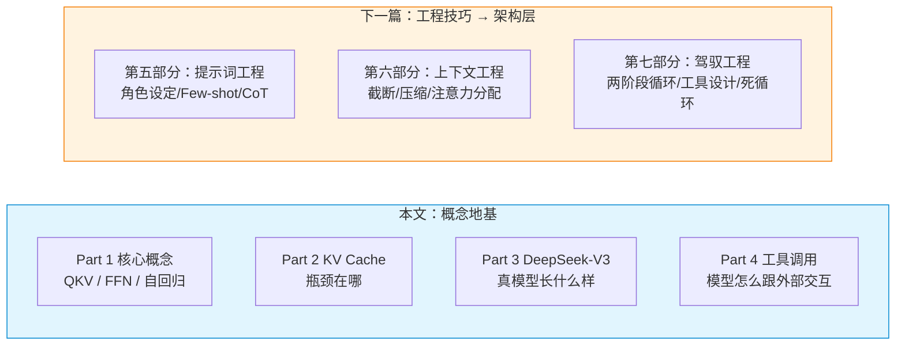
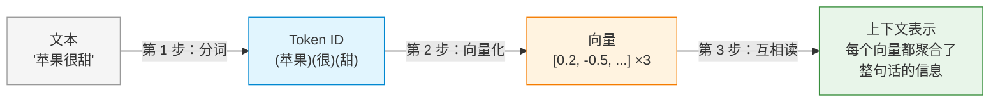
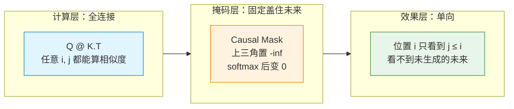
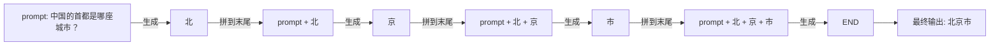
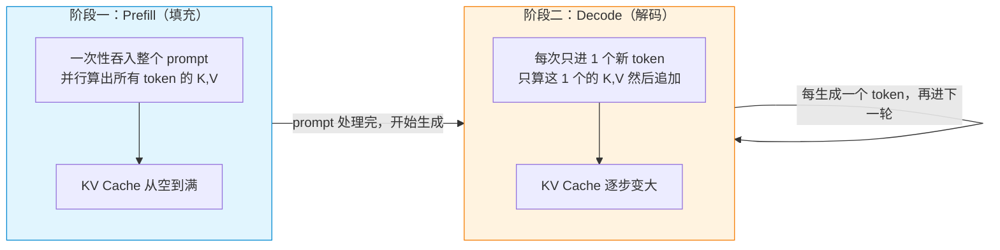
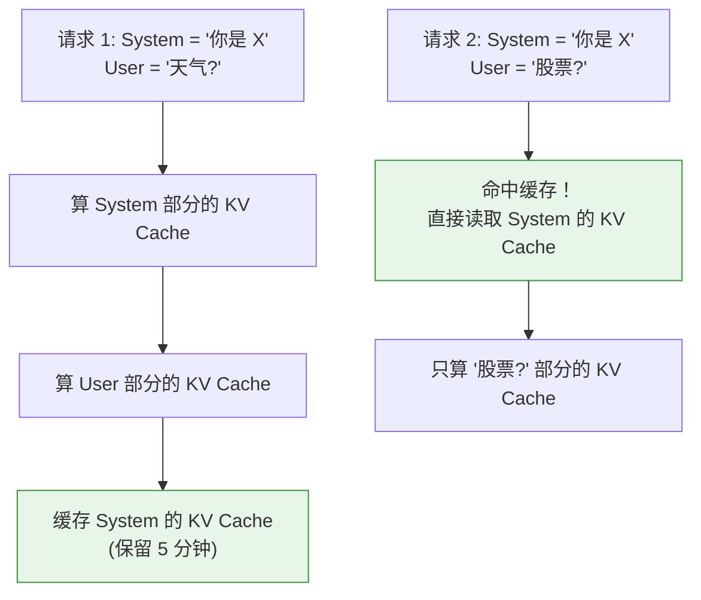
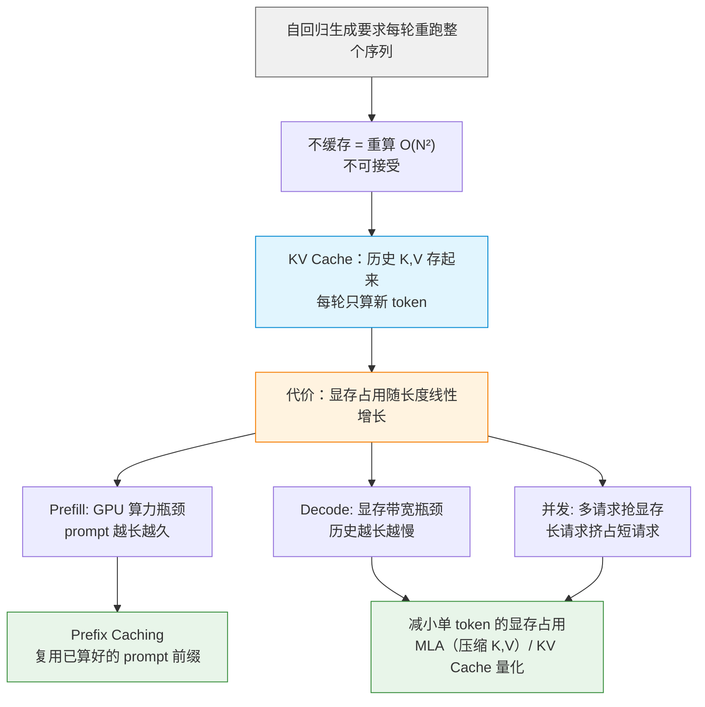
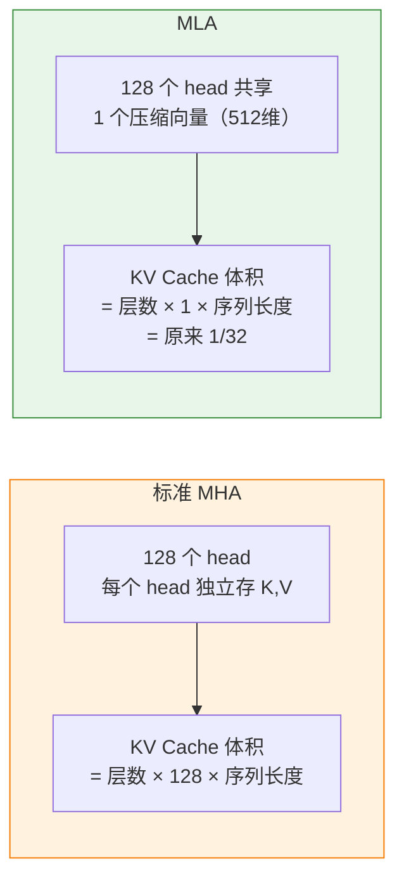
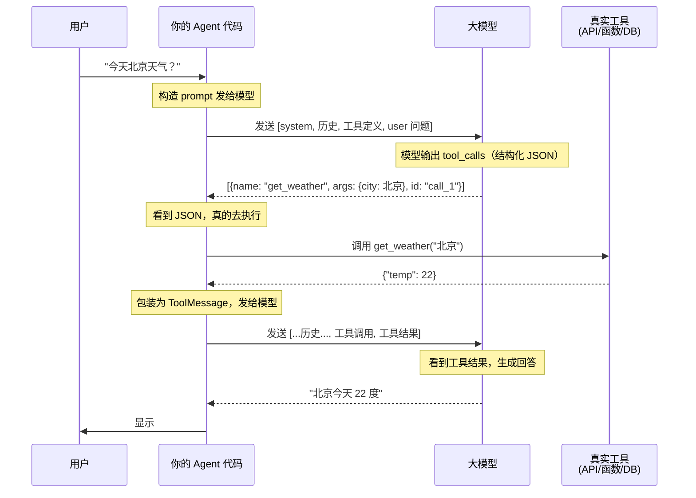

# 从AI应用开发者的角度去理解 Transformer 架构

如果你已经在做 AI 应用开发（提示词工程、上下文工程、驾驭工程），你大概率不需要从数学推导去理解 Transformer——你需要的是**理解那些工程技巧为什么会起作用**。

但大多数讲 Transformer 的文章要么是论文重述（对你没用），要么只有概念缩写（看了等于没看）。这篇另起炉灶：**本文替你建立概念地基，本文和下一篇共同组成"从盲试到理解"的两步。**

## 读这篇文章之前，先看清它和下一篇怎么分工



没有连线，因为不是一一对应。真实关系是：

| 本文建立的概念 | 被下一篇的哪些部分用到 |
|---|---|
| Part 1（QKV/FFN/自回归） | 第五、六、七部分全部——是最底层的基础，提示词工程靠它、上下文工程靠它、驾驭工程也靠它 |
| Part 2（KV Cache） | 第六部分（上下文工程）——截断、压缩、注意力分配这些技巧的物理约束都来自 KV Cache |
| Part 3（DeepSeek-V3） | 不直接对应某个工程技巧，是拓展——让你知道真实模型怎么改造教科书架构、MLA 为什么让长上下文变便宜、MoE 为什么让 API 性价比高 |
| Part 4（工具调用） | 第七部分（驾驭工程）中跟工具设计相关的部分——模型只是输出 JSON 而非真的调用，这个事实是理解中间件拦截和 Recovery Hints 的前置条件 |

> 每种工程技巧对应到架构的哪一层、为什么起作用，放在 [《工程技巧 → 架构层》](./agent-engineering-to-architecture.md)。

---

## 视角转换：你不是模型研究者

平时做 AI 应用开发，你接触到的概念是：

- **提示词工程**：角色设定、Few-shot、CoT、分隔符、负面提示
- **上下文工程**：截断、压缩、Working Memory、KV Cache
- **驾驭工程**：两阶段循环、Plan Mode、状态外部化

这些技巧在 Transformer 里都有具体的"落地点"。理解这些对应关系比理解数学公式更关键——它能让你**从"瞎试 prompt"升级到"基于架构理解做主动优化"**。

---

## 第一部分：理解 Transformer 的核心概念

在讲"工程技巧对应哪一层"之前，必须先弄清楚几个核心概念。这部分用最朴素的方式解释，不写数学。

### 先定调：本文讲的是哪一类 Transformer

Transformer 不是只有一种"长相"。按"编码"（把输入变成模型能算的表示）和"解码"（从表示生成文本）怎么分工，主流有三类：

- **编码器 Encoder**：只编码、不生成。把输入文本变成向量表示。代表：BERT、各类 text-embedding 模型。用途：分类、检索、RAG 的向量化——下一篇讲 RAG 时会专门用到这一类
- **解码器 Decoder**：只解码、自回归生成。从已有文本一个接一个"解码"出后续 token。代表：GPT、DeepSeek、Claude。用途：聊天、Agent、工具调用——**本文通篇讲的就是这一类**
- **编码-解码器 Encoder-Decoder**：先编码输入、再解码输出，适合"输入→输出"映射明确的任务。代表：T5、翻译 / 摘要模型

"编码"和"解码"在本文数据管道里的位置：**主题一（怎么读）= 编码**，把字符串变成"聚合了上下文的向量表示"；**主题三（怎么写）= 解码**，从这个表示里生成下一个 token。

一句话定调：**本文聊的是 Decoder-Only 自回归模型**。你后面看到的 Causal Mask、自回归、LM Head 都是它特有的。遇到"Encoder 类模型"（比如 RAG 里的 embedding 模型）别混淆——它只编码、不生成，是另一类东西。

按数据在模型里的"流动顺序"组织——**怎么读 → 怎么处理 → 怎么写**：

1. **怎么读（输入端，即编码）**：Token → Embedding → Positional Encoding → Self-Attention（QKV）
2. **怎么处理（模型内部）**：Transformer Block（Multi-Head + FFN）× N 层
3. **怎么写（输出端，即解码）**：自回归 + Softmax + Sampling

这跟实际数据流向一致，比按概念分类更符合"应用开发者的工程直觉"。

> **先记住两条贯穿全局的约束（细节在主题一展开）**：
> - **上下文窗口**——模型一次能处理的最大 token 数，prompt 和输出共享（主题一第 1 步）
> - **有效上下文 ≠ 标称窗口**——窗口里不是所有位置都被平等使用，中间易被忽略（主题一第 3 步）

---

### 主题一：模型怎么"读"输入

> 你的 prompt 是一段字符串。"苹果很甜"——四个汉字。模型不认识汉字，只认识数字。这一节跟着数据走完整条流水线：从字符串到 token，到向量，到聚合了上下文的内部表示。每一步，数据长什么样？在做什么？



三步走：先拆成 token，再把每个 token 变成向量，最后让向量之间"互相看"——看完之后的向量就不再是孤立的坐标了，它聚合了整句话的上下文。这就是"读"。

---

#### 第 1 步：分词（Tokenization）——把字符串拆成模型认识的最小单位

在拆之前，先立一个贯穿全文的约束——**上下文窗口（Context Window）：模型一次能同时处理的最大 token 数**。窗口本身按 token 计数，所以这一节先讲 token 是什么。

> **一个帮你建立直觉的框架：模型有两支独立的"大小"轴**
>
> 描述一个模型，常被混为一谈的两个数字其实是正交的：
> - **上下文窗口（工作台面多大）**：一次能摊开多长的对话 / 文档，单位是 token（常见 8K / 32K / 128K）。由 **MLA / 位置编码外推** 这类机制优化——第三部分 DeepSeek-V3 会拿 128K 举例
> - **参数规模（脑容量多大）**：模型总共有多少参数，单位是 B（十亿，常见 7B / 70B / 671B）。由 **MoE** 这类机制优化——同一个 DeepSeek-V3 总参数 671B、每次只激活 37B
>
> 一个是"一次能处理多长"，一个是"模型本身多大"。后面讲 KV Cache、讲真模型时，会反复回到这两根轴。**窗口 ≠ 参数，别混。**

两个关于窗口的关键事实：

- **prompt 和生成输出共享同一个窗口**——常见误区是以为"8K 上下文 = 能输出 8K"。实际是 prompt 占掉的部分 + 生成的部分，加起来不能超过 8K。prompt 占了 6K，你最多只能生成 2K
- **窗口就是 token 预算**——分词按 token 计数，窗口大小就是 token 数

窗口是后面所有概念的"物理边界"：KV Cache（第二部分）随窗口内的 token 数线性增长、位置编码有它自己的有效范围（超出训练长度的 token 模型用不好）、上下文工程（下一篇第六部分）本质就是在固定窗口里决定什么进、什么出、什么放哪里。

窗口里装的是按角色组织的对话：system 定规则、user 提需求、assistant 回、tool 回工具结果——后面讲工具调用（第四部分）会频繁用到这些角色。

记住一句话：**窗口是预算，不是无限画布。**

---

LLM 不认汉字、不认英文单词、不认标点。它只认 **token（词元）**。

Token 是模型自己的"字"：

```
英文: "Hello world"    → ["Hello", " world"]      → 2 tokens
中文: "你好世界"        → ["你好", "世", "界"]      → 3 tokens（每个汉字约 1.5 token）
代码: "if (x == 5)"    → ["if", " (", "x", " ==", " 5", ")"] → 6 tokens
emoji: "😀"             → 1-2 tokens
```

**关键事实**：

- **同一个词，不同模型可能切成不同数量的 token**——GPT 用 BPE，LLaMA 用 SentencePiece
- **窗口大小用 token 数衡量**——不是字符数（窗口的定义见本节开头）
- **不同语言 token 效率不同**——中文比英文多消耗 30-50% 的 token

**估算公式**：

```python
# 英文: 字符数 / 4 ≈ token 数
# 中文: 字符数 / 1.5 ≈ token 数
# 代码: 字符数 / 3 ≈ token 数
estimated = (len(content) / 4) * 1.1 + 5  # +10% 安全边际，+5 是消息格式开销
```

分词之后，你得到一串 token ID（整数）。`"苹果很甜"` → `[5921, 2918, 10668]`（假设的编号）。**模型还没"读"任何东西**——它只是把字符串拆成了它认识的编号。

---

#### 第 2 步：向量化（Embedding + 位置）——给每个 token 一个"坐标"和一个"位置标签"

拿到了 token ID，模型做两件事：**查语义坐标、加位置标签**。

##### 2a. Embedding：查语义坐标

每个 token ID 对应一个**高维向量**（比如 4096 维的浮点数）。这就是 **embedding**。

本质：**embedding 是一个巨大的 lookup table**——token ID → 向量。训练完成后固定不变。你不能通过 prompt 改变某个词的 embedding。

向量空间的直观：

```
        "国王" ──── "皇后"
           │         │
        "男人" ──── "女人"
           │         │
        "王子" ──── "公主"

语义相近的词距离近：
- "国王" 和 "王后" 距离很近
- "猫" 和 "狗" 比 "猫" 和 "汽车" 距离近
```

**为什么这对你重要？**

- **"苹果"在 embedding 空间里同时靠近"水果"和"苹果公司"**——embedding 自己是分不清的。怎么区分？靠下一步 Self-Attention 看上下文。
- **专业术语如果不在训练数据里，embedding 就是随机的**——这时候给它一个**定义**比反复使用术语更有效。

##### 2b. Positional Encoding：加上位置标签

Transformer 没有循环结构，它本身不知道 token 的顺序。"我打你"和"你打我"——token 完全一样，不加位置信息就全乱了。

Positional Encoding 在 embedding 向量上加一个"位置标记"：第一个 token 是位置 0，第二个是位置 1……

**对应用开发者重要的点**：

- **位置编码有它自己的有效范围**——超出训练长度的 token，位置信号衰减，模型用不好。这正是"有效上下文 ≠ 标称窗口"的成因之一（主题一第 3 步展开）
- **往已有对话中间插内容，比在末尾追加更容易出错**——插入会打乱已有内容的相对位置关系，末尾追加不会。不管是加 RAG 结果、系统指令还是多轮对话拼接，能放末尾就放末尾

---

**关键：到这一步，每个 token 还是一个孤立的向量。**

它知道"我是什么词"（embedding）、"我在第几个位置"（position），但不知道"我跟其他 token 有什么关系"。`苹果` 的向量和 `很` 的向量**还没有任何交互**。

真正的"读"在下一步：让这些孤立的向量**互相看**。

---

#### 第 3 步：互相读（Self-Attention / QKV）——token 之间开始"对话"

Self-Attention 是 Transformer 理解语言的核心。一句话：

**每个 token 看向所有其他 token，然后从最相关的那些 token 身上拉取信息，更新自己的表示。**

具体怎么实现？每个 token 先算出三个向量：**Query、Key、Value**。以"苹果"为例，输入句子是 `我 昨天 买 了 一个 苹果 ， 很 甜 。`：

```
"苹果" 的向量（Embedding + Position 之后的结果，4096 维）
   ↓ × Wq 矩阵  → Query   —— "苹果"在问：谁跟我有关？
   ↓ × Wk 矩阵  → Key     —— "苹果"告诉别人：我能提供什么？
   ↓ × Wv 矩阵  → Value   —— "苹果"实际带的内容
```

句子有 8 个 token，每个都走相同的三组矩阵乘法，产出 8 组 (Q, K, V)。

**然后"苹果"用它自己的 Query，去跟所有 token 的 Key 做匹配**——这就是注意力分数的来源：

```
"苹果".Query · "我".Key   → 相似度很低（主语跟宾语关联弱）     → 0.05
"苹果".Query · "昨天".Key → 相似度低（时间修饰，不太相关）      → 0.10
"苹果".Query · "买".Key   → 相似度中（动作和受事关联）         → 0.15
"苹果".Query · "一个".Key → 相似度低（量词，弱关联）           → 0.08
"苹果".Query · "苹果".Key → 相似度高（自己跟自己当然像）       → 0.20
"苹果".Query · "很".Key   → 相似度高（"很"修饰了描述苹果的词）  → 0.20
"苹果".Query · "甜".Key   → 相似度中高（直接描述苹果的味道）    → 0.15
```

softmax 归一化后（把差异拉开，总和 = 1），得到注意力权重。

**最后，用这些权重对所有 Value 加权求和**，得到"苹果"的新表示：

```
"苹果"的新向量 = 0.05 × "我".Value + 0.10 × "昨天".Value + 0.15 × "买".Value
               + 0.08 × "一个".Value + 0.20 × "苹果".Value + 0.20 × "很".Value
               + 0.15 × "甜".Value
```

"甜"和"很"的 Value 被大量拉进了"苹果"——模型据此推断这里的"苹果"是水果。

**这正是 embedding 做不到的事。** Embedding 只存了一个词的平均语义——"苹果"处于水果和公司之间的模糊地带。Self-Attention 靠看**这一句**的上下文，动态地把"苹果"拉到了"水果"那一侧。

**一句话记住各角色的分工**：**Query 决定"我要找谁"，Key 决定"我是谁（供别人匹配）"，Value 决定"我手里有什么内容（被拉走）"。** Q·K 算出注意力权重，按权重去拉别人的 Value。每个 token 都这样走一遍，句子里所有 token 就互相看过了。

**两个关键特性**：

- **动态**——权重是每次输入实时算出来的。同一个"苹果"换一个句子（"苹果发布了新手机"），它自己的 Query 不变，但其他 token 的 Key 全变了，Q·K 结果全变了——新句子里会指向"公司"
- **计算上全连接**——公式能算任意两个位置的相似度。Decoder 固定加 Causal Mask 把全连接约束成单向（下面展开）

---

##### 方向约束（Causal Mask）："不能看还没生成的东西"

> Self-Attention 的公式能算任意两个位置的相似度。但 Decoder 生成下一个 token 时，后面的 token 根本还不存在。Causal Mask 强制把"未来位置"屏蔽掉。

**一句话**：Self-Attention 计算本身是**全连接**的（任意 i, j 都能算），但 Decoder 在前向传播时**固定**盖了一层因果掩码——上三角（j > i）的分数强制设成 0，实际生效的注意力被约束成"只看自己和之前"。

分三层看：



- **计算层**：`Q @ K.T` 对任意 (i, j) 都能算分数——公式不挑方向
- **掩码层**：上三角（j > i）的分数设成 `-inf`，softmax 后变 0。mask **写死在计算图里**，训练和推理都带
- **效果层**：位置 i 实际看到的只有 j ≤ i

**三个常被讲混的说法**：

| 容易混的说法 | 准确的表述 |
|------|------|
| "mask 是可选约束，去掉就能双向" | mask 固定在计算图里，主流 API 不暴露开关。Decoder 天生就是单向的 |
| "训练用双向 attention，生成才加 mask" | Decoder 训练也带 Causal Mask，否则位置 i 偷看答案 |
| "Decoder-Only 能做理解，靠去掉 mask 做双向 attention" | 归因错误。做分类/抽取靠的是把任务塞进 prompt，用单向生成输出结果 |

**对应用开发者最重要的三个结论**：

1. **提示词开头很关键**——生成第一个 token 时，attention 被 mask 限制只能看前面的 prompt，开头的 token 是整段上下文的"根"
2. **每生成一个 token 都要重算 attention**——新 token 加入后 mask 矩阵多了一行，必须重算。这就是 KV Cache 要解决的问题（第二部分展开）
3. **训练和推理都带 mask**——做"理解"任务时仍然带 mask，靠 prompt 引导单向生成输出结果

##### 有效上下文 ≠ 标称窗口：窗口里不是所有位置都被平等使用

窗口规定了"能装多少"（见第 1 步开头的上下文窗口），但装进去不等于"能用上"。

实证事实：模型对窗口内不同位置的关注度不均——**靠近开头和结尾的 token 被用得最充分，中间的大段容易被忽略**。这就是 Lost in the Middle。所以标称 128K 的模型，放在 100K 位置的关键指令可能根本没被有效利用。

两条实践规则：

- **重要信息往首尾放**——system 指令、核心约束放开头，最新上下文或结论放结尾，别埋在中间
- **能末尾追加就别中间插入**——插入会打乱已有 token 的相对位置关系，末尾追加不会。加 RAG 结果、系统指令、多轮对话拼接都同理

为什么中间弱？跟 Self-Attention 的注意力分配和位置编码的有效范围都有关：中间位置离首尾都远，注意力被稀释；位置编码在超长范围也会衰减。

---

**读完之后的成果**：`苹果` 的向量不再是孤立的——它包含了 `甜`、`很`、`买` 的信息。三个孤立的 token 向量变成了三个**互相聚合了上下文信息的表示**。

这就是模型对输入的"读"——从字符串，到 token，到向量，到互相看过之后的上下文表示。有了这个表示，模型下一步（主题二）才能开始真正的"处理"——Multi-Head 多角度分析，FFN 调取储存的知识。

---

### 主题二：模型怎么处理（Transformer Block 内部）

> Self-Attention 让 token 看到了上下文，但这只是"看"。接下来模型要对看到的东西做"处理"：多角度分析（Multi-Head）、调取知识（FFN）、逐层抽象（Layer 堆叠）。

#### 先补一个前提：主题一讲的 Self-Attention 其实是简化版

主题一里我们说"苹果"产出一组 (Q, K, V)，和其他 token 交互。实际模型里不是 1 组，是**32-128 组并行**——这就是 **Multi-Head Attention**。一组就是"一个头"。

```
一个 token 进入 Self-Attention 层的实际流程：

输入向量（4096 维）
  ↓ × Wq₁, Wk₁, Wv₁  → Head 1 的 (Q₁, K₁, V₁)  → 算 attention₁ → 产出 128 维
  ↓ × Wq₂, Wk₂, Wv₂  → Head 2 的 (Q₂, K₂, V₂)  → 算 attention₂ → 产出 128 维
  ...
  ↓ × Wq₃₂, Wk₃₂, Wv₃₂ → Head 32 的 (Q₃₂, K₃₂, V₃₂) → 算 attention₃₂ → 产出 128 维

32 × 128 = 4096 维 → 拼接 → 最终 Self-Attention 输出（4096 维）
```

每组 head 有自己的 QKV 权重矩阵，训练中自然分化出不同的关注模式：有的 head 专看语法关系（主语-谓语），有的专看指代（"它"指谁），有的专看长距离依赖（开头的指令和三百行后的输出）。

**对应用开发者来说**：模型同时从多个角度读你的 prompt。如果你的指令说"简短"但示例很长，不同 head 会各自关注不同的信号，可能产生矛盾。

#### 第 4 步：调取知识（FFN）

Self-Attention 的输出进入 **FFN（前馈神经网络）**。Attention 是从上下文拉信息，FFN 是基于拉来的信息调取模型储存的知识。

```
FFN(x) = gelu(x @ W1) @ W2
         ↑升维 4 倍    ↑降维回原维度
```

W1 和 W2 是两张大矩阵，占模型约 2/3 的参数。这些权重是**训练阶段学来的，推理阶段冻结不变**——每次调用 API，模型只是用固定权重跑前向计算，不会边用边学。"北京是中国的首都""水在 100 度沸腾"这些事实，存在 FFN 的权重里，不在 Attention 层。

**Attention 和 FFN 的协作**——以"中国的首都是？"为例：

```
"首都" 在 Self-Attention 里重点关注了 "中国"
  → Attention 的输出告诉 FFN："激活中国首都相关的知识"
  → FFN 中对应的权重通路被激活
  → 输出高分给 "北京"
```

**对应用开发者来说**：few-shot 不是教模型新知识（FFN 训练完就不变了），是帮 Attention 找到正确的 FFN 通路。模型幻觉 = Attention 指错了路，FFN 激活了错误的通路。

#### 第 5 步：逐层抽象（Layer 堆叠）

**Attention + FFN = 一个 Transformer Block。这个 Block 重复 32-80 次。**

```
Block 1: Multi-Head Attention → FFN → 输出向量
  Block 2: Multi-Head Attention → FFN → 输出向量
    ...
      Block N: Multi-Head Attention → FFN → 最终向量
```

越深的层处理越抽象的信息：底层（1-10 层）关注词汇和表面语法，中层（10-30 层）关注语义和实体关系，高层（30+ 层）关注指令意图和任务结构。

**CoT 有效的原因之一**：它把需要高层推理的复杂问题，拆成多个底层+中层可以处理的简单步骤。

> **下一篇会用到**：Multi-Head 解释了为什么 prompt 的不同维度会被分开处理；FFN 解释了为什么 few-shot 有效（不是教知识，是引路）；Layer 堆叠解释了为什么 CoT 拆步骤管用。

---

### 主题三：模型怎么"写"输出

> 回到前面那条管线——每个 token 在一层层的 Self-Attention + FFN 中不断聚合上下文信息。**对"下一个 token 该是什么"这个问题，模型只需要看最后一个位置的输出向量。** 因为 Causal Mask 的作用，这个向量已经通过每一层的 Attention 聚合了它前面所有 token 的信息——整段 prompt 被逐层提炼后，浓缩在了这 4096 维里。下面是把它变成具体下一个 token 的机械流程：投影到词表 → 转成概率 → 选一个 → 拼回输入循环。

#### 第 6 步：投影到词表（LM Head）

最后一个 token 的向量（4096 维，以 LLaMA-3 8B 为例）需要变成词表中每个候选 token 的得分。词表通常有 10-20 万个 token，靠一层矩阵乘法完成：

```
最后一个 token 的向量（4096 维）
  ↓ × W_lm_head（4096 × 128256 的大矩阵）
  → logits（128256 维）——每个位置 = 一个候选 token 的原始得分
```

这一步叫 **LM Head（语言模型头）**，就是把模型内部表示翻译成每个候选 token 的得分。

#### 第 7 步：从得分到概率（Softmax + Temperature）

logits 是原始分数，值有大有小。Softmax 把它们转成总和 = 1 的概率分布：

```
logits: [2.5, 1.8, 1.2, 0.5, -1.0]     ← 5 个候选 token 的原始分数
  ↓ softmax
probs:  [0.65, 0.32, 0.18, 0.09, 0.02]  ← 概率分布，总和 = 1
```

**Temperature** 控制分布的集中度：T 越低，高分 token 的优势被放大，输出更确定；T 越高，分布更平均，更多候选有机会被选中。

#### 第 8 步：选一个 token（Sampling）

按概率随机选——得分最高的最可能被选中，但**不是 100%**。这正是同样的 prompt 每次输出可能不同的原因。

实际 API 通常叠加 top_p（累积概率截断，候选概率累加到 p 后截断）和 top_k（只保留前 k 个候选），避免选中概率极低的离谱 token。

#### 第 9 步：拼回输入，循环（自回归）

选中的 token 拼到输入末尾，整个序列重新跑一遍模型，生成下一个：



每一步的输入 = 上一步的输入 + 上一步的输出。这就是"自回归"——用自己的输出来决定下一步。

这个循环什么时候停？有三个机制，优先级从模型自身到调用方：

- **EOS（End of Sequence）**：模型在训练时学会了输出一个特殊的"结束符" token。一旦生成 EOS，循环自然终止——图里的 `END` 就是它
- **max_tokens**：调用方设的硬上限。哪怕模型还没输出 EOS，达到这个上限也强制截断——你看到的"输出被截断"多半是撞了这个
- **stop sequences**：你指定的停止串（如换行、某个 JSON 结束符）。模型一旦生成这个串就停，常用来精确控制输出格式

> **对开发者的意义**：输出"没说完"通常不是模型 bug，是 max_tokens 太小或 EOS 提前触发；想让它在某处停，用 stop sequences 比靠 prompt 求它更可靠。

#### 对应用开发者来说，这四步串在一起意味着什么

1. **输出越长越慢**——每个新 token 都要把整段序列重跑一遍模型
2. **CoT 有效**——中间的推理 token 进入上下文，后续生成能看到前面的推理步骤
3. **prompt 开头影响每一个后续输出**——每个 token 都依赖前面所有 token
4. **T 值控制输出风格**——代码/数学用 T=0（确定），对话用 T=0.7-1.0（自然），创意写作用 T=1.5+（多样）

> **下一篇会用到**：角色设定、Few-shot、CoT、分隔符等提示词工程技巧，本质上都是在引导 QKV/Attention/FFN/自回归运作。看完这篇前，确认你理解了这四样东西各自在管线里的位置。

---

## 第二部分：理解"什么是 KV Cache"

**KV Cache 是 LLM 推理的核心性能瓶颈，是连接架构和工程的关键概念。**

### 从自回归推导出 KV Cache 的必然性

KV Cache 不是"一个可选的性能优化"——它是**自回归生成 + Self-Attention 数学特性的必然产物**。

**推理链条**：

```
自回归生成决定了：
  → 每步生成 1 个新 token
  → 新 token 拼到 prompt 末尾作为下一步的输入

Self-Attention 的计算方式决定了：
  → 每步都要算"新 token 和所有旧 token 的 attention"
  → 每个 token 的 attention 分数 = Q · K（query 和所有 key 的相似度）

结合起来：
  第 1 轮：输入 [t1, t2, t3]，算 K[t1], K[t2], K[t3]
  第 2 轮：输入 [t1, t2, t3, t4]
     → 需要 K[t1], K[t2], K[t3], K[t4]
     → 但 K[t1], K[t2], K[t3] 在第 1 轮已经算过了！

结论：如果不缓存，每轮都要重算所有历史的 K 和 V。
```

这个"重算"的成本有多大？

第 1 轮：算 K[t1], K[t2], K[t3]                         → 3 次 K 投影
第 2 轮（没缓存）：重算 K[t1], K[t2], K[t3] + 算 K[t4]     → 4 次 K 投影
第 3 轮（没缓存）：重算 K[t1..t4] + 算 K[t5]              → 5 次 K 投影
...
第 N 轮（没缓存）：算 N+2 个 K 投影
总计算量：3 + 4 + 5 + ... + (N+2) = O(N²)  ← 不可接受

有 KV Cache：
第 1 轮：算 K[t1], K[t2], K[t3] → 缓存
第 2 轮：只算 K[t4] → 追加到缓存
第 3 轮：只算 K[t5] → 追加到缓存
...
总计算量：≈ N   ← 可接受

KV Cache 用一个显存问题换掉了一个计算问题——**代价和收益都是 O(N) 级别的**。这就是为什么它叫"连接架构和工程的关键概念"。

### Prefill 和 Decode：KV Cache 生命周期中的两个阶段

KV Cache 不是"一直匀速增长"——它的生命周期分为两段：



两个阶段的瓶颈完全不同：

| | Prefill | Decode |
|---|---|---|
| **做什么** | 一次处理整个 prompt | 一轮生成一个 token |
| **计算量** | 所有 token 并行算，GPU 跑满 | 只算 1 个 token，GPU 大部分时间闲着 |
| **真正的瓶颈** | **GPU 算力**——prompt 越长越久 | **显存带宽**——历史 KV Cache 越大，从显存搬到计算单元越慢 |
| **延迟感受** | 一次性开销（长 prompt 会明显） | 每个 token 都慢一点，越往后越慢 |
| **复杂度** | **O(N²)**（N 个 token 两两算 attention） | **O(N)**（每步算 1 个 token，但要读全部历史） |

三笔账要分开看，别以为"有了 KV Cache 一切都线性了"：

- **Prefill 计算量 O(N²)**：prompt 里 N 个 token 两两算 attention 相似度，N 翻倍成本约翻 4 倍——这就是 input token 也收费、长文档首 token 明显卡顿（TTFT 高）的原因
- **Decode 每步 O(N)**：每生成一个 token，要和它前面的全部历史做 attention，历史越长单步越慢
- **KV Cache 显存 O(N)**：缓存体积随历史 token 数线性增长（见上面的公式）

Prefill 的 O(N²) 是 KV Cache 救不了的——缓存解决的是"重算"，不是"首次算"。这也是为什么长 prompt 的首 token 延迟天然高，跟 MLA 压缩 KV Cache 不是一回事。

Decode 阶段为什么越往后越慢？每生成一个 token，"已生成的 token 数"就 +1，KV Cache 体积就大一圈。生成第 100 个 token 时要读 99 个历史的 K,V；生成第 1000 个时要读 999 个。计算量不大（Q 只有 1 个），但**搬运数据的时间越来越长**——GPU 大部分时间在等数据，不是在算。

> **对你来说这意味着什么**：尽量让模型输出精炼。不是怕 token 贵，是每多生成一个 token 都让下一个 token 更慢——不是因为模型在想，是因为显存在搬。

### KV Cache 的显存成本公式

```
KV Cache 显存 = 2 × L × H × D × S × bytes_per_element
```

| 参数 | 含义 | 典型值 |
|------|------|--------|
| L | Transformer 层数 | 32-80 |
| H | 注意力头数 | 32-96 |
| D | head 维度 | 64-128 |
| S | 序列长度（token 数） | 4K-128K |
| bytes | 每个浮点数字节数 | 2（FP16）或 1（FP8 量化） |

**典型实例**（GPT-4 估计配置 120 层）：

```
2 × 120 × 96 × 128 × S × 2 = 5.9 MB / token

100K tokens ≈ 590 GB
```

你调用 API 时，这个 590GB 由**服务商承担**，这就是为什么：
- 长上下文 API 价格高（需要的显存是短上下文的 10-100 倍）
- 你的并发请求会**共享服务商的显存池**——每个请求的 KV Cache 占掉一部分可用显存

> 上面的公式告诉你**一个请求占多少显存**。下一个问题自然就是：**多个请求同时跑，显存怎么分？** 这就引出了连续批处理——现代推理服务用来管理多请求 KV Cache 竞争的调度策略。

### 连续批处理：为什么并发越多，响应越慢

现代推理服务（vLLM、SGLang、TGI）不会等一个请求完全生成完才处理下一个——它们用**连续批处理**：一个请求算完 1 个 token，立刻切到另一个请求算它的下一个 token，来回轮转。

**但这跟 KV Cache 有什么关系？** 每个并发请求都需要自己在 GPU 显存里的一份 KV Cache。连续批处理意味着多个请求的 KV Cache **同时占着同一张 GPU 的显存**。

```
一张 A100 GPU 有 80GB 显存

10 个请求，每个 20K token：
  每个请求的 KV Cache ≈ 5.9 MB × 20K ≈ 118 GB
  总计 ≈ 1180 GB → 远超 80GB → 放不下，必须排队

5 个请求，每个 2K token：
  每个请求的 KV Cache ≈ 5.9 MB × 2K ≈ 12 GB
  总计 ≈ 60 GB → 可以在 80GB 里同时处理
```

**结论**：并发限制的本质不是 CPU 不够用，是**显存放不下那么多份 KV Cache**。所以：
- **长上下文请求不仅自己贵，还挤占其他请求的显存空间**
- **大量短请求并发比少量长请求并发更实际**
- **服务商限制 max_concurrency 的根源就在这里**

### Prompt Cache / Prefix Caching

**Prompt Cache**（也叫 Prefix Caching）：把已经算过的 KV Cache 保留一段时间（通常 5 分钟到几小时），下次同样的 prompt 前缀来时**直接复用**前缀部分的 KV，只算新部分的 K, V。



**不同缓存策略的差异**：

| 策略 | 缓存粒度 | 典型 TTL | 适用场景 |
|------|---------|---------|---------|
| **系统级 cache** | 所有请求共享 | 5-60 分钟 | System Prompt 稳定 |
| **用户会话级 cache** | 同用户请求共享 | 会话生命周期 | 多轮对话复用早期上下文 |
| **前缀精确匹配** | 完全相同的前缀 | 按需要 | 缓存命中率高 |
| **语义近似匹配** | 相似内容（NLP 匹配） | 按需要 | 命中率更高但实现复杂 |

**对应用开发者的启示**：

- **System Prompt 越稳定越好**——不要在 system 消息里塞时间戳、随机 ID。`[System: "你是 X, 当前时间: 2026-06-24"]` 每次不同，缓存永远命中不了
- **工具定义放在 system 消息里**——所有请求都共享这一段 KV Cache
- **长 system prompt 是"一次性投资"**——第一次调用贵，后续缓存命中后几乎免费
- **前缀稳定的 KV Cache 复用**是 vLLM / SGLang 等推理服务的标准特性
- **生产环境部署时建议预热 KV Cache**——把 system prompt 提前跑一次，建立缓存

### 现代 LLM 的 KV Cache 优化（减少显存占用）

除了 Prefix Caching 这种"复用"思路，业界还从另外两个方向降 KV Cache 显存：

#### 1. 减少单 token 存储量

MLA（DeepSeek-V3）、GQA（Llama 3）都是通过共享或压缩 KV 来减少每 token 的显存占用。MLA 能把 KV Cache 压到标准 MHA 的 1/32，是 DeepSeek-V3 支持 128K 上下文的物理前提。**详见第三部分。**

#### 2. 提高显存利用率：PagedAttention（vLLM）

把 KV Cache 切成固定大小的"页"（类似操作系统的虚拟内存），消除碎片——**显存利用率从 ~40% 提升到 ~90%**。同时支持 Prefix Caching（多请求共享 system prompt 的 KV Cache 页）和动态调度。

#### 3. 压缩精度：KV Cache 量化

把 FP16 压缩为 INT8 或 INT4：

```
FP16:  5.9 MB / token  →  基线
INT8:  2.9 MB / token  →  质量损失很小，生产环境默认
INT4:  1.5 MB / token  →  质量可接受
```

---

**第二部分收束**：KV Cache 的整条逻辑链



> **下一篇会用到**：Working Memory 截断、Lost in the Middle、压缩早期消息、Plan Mode 状态外部化等上下文工程技巧，都是围绕着 KV Cache 的显存限制和注意力分配做文章。看下一篇 Part 6 前，确认你理解了"为什么 KV Cache 是瓶颈"。

---

## 第三部分：教科书架构 → 真实模型

Part 1 讲了"数据在模型里怎么走"——管道里有 Tokenization、Embedding、Positional Encoding、Self-Attention、FFN、LM Head 这些零件。但在单个零件层面讲完之后，还需要退一步看**整张设计图**：一个"教科书级"的 Transformer 到底长什么样？真实模型又在哪些零件上动了手脚？

### 先明确基线：教科书 Transformer 长什么样

下表是 Part 1 各零件收束成的一张规范——这是后续对照真实模型时的"锚点"：

| 组件 | 教科书做法 | Part 1 对应位置 |
|------|-----------|---------------|
| **Tokenization** | BPE 分词 | 第 1 步 |
| **Embedding** | token → 固定维度向量（如 4096） | 第 2a 步 |
| **位置编码** | 绝对位置编码（或 RoPE），训练多长就只能用多长 | 第 2b 步 |
| **Self-Attention** | **MHA**：每头独立 K,V，KV Cache = 层数 × 头数 × 序列长度 | 第 3 步 |
| **FFN** | **Dense**（全连接），每次推理激活 100% 参数 | 第 4 步 |
| **层数** | 32-80 层 Multi-Head + Dense FFN 堆叠 | 第 5 步 |
| **训练精度** | FP16 / BF16 | — |
| **上下文窗口** | 4K-8K tokens | — |

这个基线的核心矛盾在 Part 2 已经暴露了：**序列越长，KV Cache 越大，显存扛不住。** 而且 FFN 是 Dense 的——模型多大，每次推理就算多少参数，不长的上下文也挺贵。

### DeepSeek-V3 改了教科书的哪些地方

| 组件 | 教科书 | DeepSeek-V3 | 为什么改 |
|------|--------|-------------|---------|
| Tokenization | BPE | SentencePiece | 多语言统一词表，但切 GPT 时 token 数 +20-30% |
| 位置编码 | 训练多长用多长 | **YaRN**（RoPE 外推）：训练 4K，推理 128K | 超长上下文 |
| Self-Attention | MHA | **MLA**：K,V 压缩到共享低维向量 | KV Cache 减小 32x，长上下文从物理上变得可行 |
| FFN | Dense（100% 激活） | **MoE**：256 专家，每 token 只激活 8 个（3.5%） | 总参数 671B，激活仅 37B，推理成本大幅下降 |
| 层结构 | 全部 Dense FFN | 前 3 层 Dense + 后 58 层 MoE | 底层通用特征用 Dense 更稳定 |
| 训练精度 | FP16/BF16 | **FP8** 混合精度 | 训练成本约 558 万美元（对比 GPT-4 推测超 1 亿） |
| 上下文窗口 | 4K-8K | **128K** | 长文档/长对话不用截断 |

Tokenization、层结构、训练精度这三行是背景信息，你知道了就行。真正值得深入的是下面两个——它们跟你每天用模型时的"成本和能力边界"直接相关。

### 核心创新 1：MLA——接住 Part 2 的 KV Cache 瓶颈

回忆 Part 2 的结论：KV Cache 显存随序列长度线性增长，生成越长越慢，长上下文贵得离谱。

MLA 干了一件事：**不存完整的 K,V，存压缩版**。

标准 MHA 中 128 个 head 各自存各自的 K,V——每条 K 和 V 都是完整的向量。MLA 的做法是把所有 head 的 K,V 压缩到一个共享的低维向量（latent_dim=512），Attention 计算时再从压缩向量恢复出各 head 需要的 K,V。**存的是压缩版，算的时候临时展开**——相当于 K,V 在显存里的体积缩小了 32 倍。



**效果**：100K tokens 的 KV Cache 从 ~400 GB 压到 ~12 GB，一张 A100（80GB）就能装下。长上下文 API 不再需要"天价显存"，价格才降得下来。

**边界**：MLA 只解决"能不能装下"的问题，不解决"能不能用好"的问题。Lost in the Middle（中间信息被忽略）是注意力机制的固有特性，跟 K,V 存多大无关。

### 核心创新 2：MoE——为什么 API 便宜

教科书 Transformer 的 FFN 是 Dense 的：每次推理所有参数都参与计算。参数越大，算一次越贵。

MoE 把 FFN 拆成了 256 个"专家"：

```
标准 Dense:
  token 进来 → FFN（100% 参数参与计算）

MoE:
  token 进来 → Router 打分 → 选得分最高的 8 个专家 → 只这 8 个参与计算
```

**账是这样算的**：

- DeepSeek-V3 总参数 671B，但每次推理只激活 8/256 = 3.5% 的 FFN 参数
- 加上 Attention 等固定开销，实际激活约 37B
- 推理成本 ∝ 激活参数 → 37B 的成本跑 671B 的模型

这就像一个大楼里有 256 个部门，但每个问题只需要找最相关的 8 个部门回答。大楼的总规模可以很大，单次回答的成本却不高。**API 便宜的根本原因不是训练便宜，是推理只跑一小部分参数。**

> **两个创新优化的是两个不同的"大小"，别混了**：
> - **671B 是参数规模（脑容量）**——MoE 优化它，让你用 37B 的激活成本跑 671B 的模型
> - **128K 是上下文窗口（工作台面）**——MLA 优化它，让长上下文的 KV Cache 从天价变可行
>
> 一个是"模型多大"，一个是"一次能处理多长"，正交的两个维度，各自被不同机制优化。下面三条结论要分清哪条对应哪根轴。

### 这跟你有什么关系

三条可以带走的结论：

1. **长上下文不再是你需要回避的东西**。MLA 让 128K 上下文在成本上可行，你不必为了省钱而刻意压缩 system prompt 或多轮历史
2. **但注意力的物理特性没变**。MLA 解决的是显存问题，不是注意力衰减问题——关键信息仍然要放靠近开头或结尾，避开中间的 Lost in the Middle
3. **看任何新模型的报告，用同一套框架**：对着教科书基线的 8 行，看新模型改了哪几行、为什么改、对你有何影响。骨架没变，变的只是个别零件的工程实现

> **下一篇会用到**：驾驭工程中的长程任务设计（两阶段循环、Plan Mode），底层都依赖于真实模型的工程边界——MLA 让长上下文便宜、MoE 让推理成本低、128K 让长对话可行。这一部分是为看懂驾驭工程的"为什么能这么做"打基础。

## 第四部分：工具调用（Tool Calling）——大模型原生支持的特殊机制

你每天在用的 Agent 能力（让模型"调工具"）看起来像模型主动操作了外部系统。**实际上模型没有调用任何东西——它只是输出了一段结构化的 JSON，由你的代码看到后去执行。** 这是模型训练时学会的一种"特殊输出格式"，不是魔法。

## 1. 工具调用 vs 结构化输出：别混

两者都输出 JSON，但约束不同：

| 概念 | 特点 | 例子 |
|------|------|------|
| **结构化输出**（JSON mode） | 格式约束为 JSON，**内容自由** | `{"summary": "..."}` |
| **工具调用**（Tool Calling） | 格式约束为 JSON，**且内容必须匹配工具 Schema**（name+args+类型） | `{"name": "get_weather", "arguments": {"city": "北京"}}` |

关键区别：支持 tool_calls 的模型必然支持结构化输出，反之不一定——有些小模型能靠 prompt 吐 JSON，但不会被正确路由到指定工具。

当模型"说要调 search"时，它输出的就是这样的 JSON：

```json
{"name": "search", "arguments": {"query": "Transformer 架构"}}
```

**你的代码**（LangChain、Agent 框架或自己写的逻辑）看到这段 JSON 才去真的执行。模型只负责生成，不负责调用外部 API。

## 2. 大模型怎么支持工具调用——训练到推理的全链路

### 2.1 核心本质：工具调用 = 模型在 SFT 阶段学会的"结构化输出"

大模型支持工具调用**不是靠提示词**，而是靠**训练时专门做的微调（SFT，Supervised Fine-Tuning）**。

**训练阶段做了什么？**

让模型看大量这样的样本，学会在"需要查信息"的场景输出 JSON 而非自然语言：

```
用户: "今天北京天气？"
↓ 期望输出（训练时的标准答案）
assistant: {"name": "get_weather", "arguments": {"city": "北京"}}
↓ 然后给工具结果
tool: {"温度": 22, "天气": "晴"}
↓ 最后输出自然语言
assistant: "北京今天 22 度，晴天。"
```

模型看到几万条这样的样本后，就学会了：
1. **什么时候该输出 tool_calls**（用户问实时信息时）
2. **tool_calls 的 JSON 结构长什么样**（`{"name": ..., "arguments": ...}`）
3. **输出的 JSON 必须与工具的 JSON Schema 匹配**（参数名、类型）

这呼应了 Part 1 的"训练学、推理冻"：**会输出工具 JSON 这件事是 SFT 学来的、冻结在权重里**；而"这次具体调哪个工具"是推理时靠喂给模型的 Schema 现选的。所以你加一个新工具不用重新训练——把它的 Schema 放进 prompt 即可，模型在生成时自己选。

### 2.2 推理时：一轮工具调用 = 两次 LM Head 输出

当你在 Agent 里用模型时，一次工具调用就是 Part 1 管道（读→处理→写）跑两遍：

1. **你的代码把工具 Schema 拼到 System Prompt 末尾**，连同历史、用户问题一起发给模型
2. **模型自回归生成**：Self-Attention 读到工具 Schema（在 prompt 末尾附近）→ FFN 激活"SFT 时学会的"工具调用通路 → LM Head 输出一段 tool_calls JSON（正是主题三"怎么选下一个 token"选到了 JSON）
3. **你的代码看到 tool_calls → 真的去执行 → 把结果发回模型** → 模型看到结果，LM Head 再输出自然语言

完整数据流见下节 mermaid 图。**关键**：模型不需要真的调用 API，它只是选择输出一个特定格式的 JSON，怎么执行是你的代码的事。

### 2.3 模型怎么"决定"用哪个工具——注意力竞争

多个工具可用时，模型在自回归生成过程中做"选择题"：

```
Context 末尾（最近的 token 影响力最大）：
  ...[历史..., user: "今天北京天气？", 
    工具1描述: "搜索网络信息",
    工具2描述: "查询天气",    ← 这里 attention 分数最高
    工具3描述: "写文件"]

LLM 生成到 name: 时，下一步要选"工具名"这个 token
  
  self-attention 在三个工具描述之间分配权重
  → "天气" 的语义匹配度最高（因为用户问题也提到了"天气"）
  → "搜索网络信息" 匹配度中等
  → "写文件" 匹配度最低
    
  → 模型选 "get_weather" 作为输出
```

**这就是为什么工具 description 这么重要**——attention 权重决定模型选哪个，而 attention 权重取决于"用户问题"和"工具描述"的语义匹配度。

## 3. 一次完整的工具调用流程 + 真实数据结构



**真实数据结构**（LangChain v1，`langchain_core/messages/tool.py`）：

```python
# 模型输出——ToolCall
class ToolCall(TypedDict):
    name: str      # 工具名
    args: dict     # 参数
    id: str | None # 调用 ID（关联结果）

# 执行结果——ToolMessage
from langchain_core.messages import ToolMessage
tool_result = ToolMessage(
    content="22 度，晴天",
    tool_call_id="call_1",  # 对应 ToolCall 的 id
    status="success",
)

# 完整对话链
messages = [
    {"role": "assistant", "tool_calls": [{"name": "get_weather", "args": {"city": "北京"}, "id": "call_1"}]},
    {"role": "tool", "content": "22 度", "tool_call_id": "call_1"},
]
```

**关键事实**：
- 每次工具调用是**两次 LLM 调用**——一次输出 tool_calls，一次基于结果生成回答
- **`tool_call_id` 字段配对请求和结果**——特别在并行多个工具时区分

## 4. 并行调用与推理模型差异

**并行工具调用**：模型可以一次输出多个 tool_calls（如同时查北京+上海+广州天气），彼此独立可并行执行。

**推理模型调工具**：

| 模型类型 | 调用前的行为 | 特点 |
|---------|------------|------|
| 普通 Chat 模型（V3、GPT-4o） | 直接输出 tool_calls | 快、便宜 |
| 推理模型（DeepSeek-R1、o1） | 先输出 reasoning_content 思考，再输出 tool_calls | 准、贵 3-10 倍 |

## 5. 常见失败原因与设计原则（一一对应）

| 失败原因 | 表现 | 设计原则（怎么避免） |
|------|------|------|
| **工具描述不清楚** | 模型选错工具 | description 写具体场景+反例，它是模型的"prompt"（呼应 2.3） |
| **参数 Schema 太复杂** | JSON 格式错 | 参数扁平化，避免嵌套 dict；命名清晰（"query"优于"q"） |
| **工具太多（>20）** | 注意力分散 | 控制在 5-10 个，多了用 router agent 分层 |
| **上下文太长 Schema 被截断** | 不记得有哪些工具 | 压缩上下文（见第六部分） |
| **工具执行出错** | 模型无法自救 | 把错误返回给模型，让它据错误调整 |
| **模型不支持 tool_calls** | 无输出 | 换原生支持的模型，或用**提示词模拟**（见附注） |

## 小结

工具调用 = 模型用 Part 1 学过的 LM Head 输出一段 tool_calls JSON + 你的代码真的去执行。

- 不是模型主动调外部系统，是模型"说想做什么"，你的代码听到后去做
- 选哪个工具靠 Self-Attention 在描述间竞争（2.3）→ 写好 description
- 每轮是两次 LLM 调用，靠 `tool_call_id` 配对
- 不支持原生的模型可用提示词模拟，但精度不如原生（见附注）

> **附：提示词模拟工具调用（不原生支持 tool_calls 时的替代方案）**
>
> 对不原生支持 `tool_calls` 输出的模型，可以在系统 prompt 里要求模型输出结构化 JSON，由你的代码解析后执行。
>
> ```python
> system = """你是助手。需要查询信息时，输出以下 JSON：
> {"tool": "工具名", "args": {参数}}
> 可用工具：
> - get_weather(city: string): 查询天气
> """
> response = llm.invoke(system + user_query)
>
> import json
> try:
>     tool_call = json.loads(response)
>     result = execute_tool(tool_call["tool"], tool_call["args"])
>     final = llm.invoke(system + user_query + "结果：" + result)
> except json.JSONDecodeError:
>     final = response  # 模型没输出 JSON，直接返回
> ```
>
> **对比**：
>
> | | 原生 Tool Calling | 提示词模拟 |
> |---|---|---|
> | 精度 | **高**（模型专门训练过 JSON 输出） | 低（易格式错误） |
> | 解析失败率 | **低**（API 层保证结构） | 高（需 fallback） |
> | 工具路由 | attention 精准选工具 | 凭记忆输出，易幻觉 |
> | 实现难度 | 框架封装 | 自己写解析+循环 |
> | 适用范围 | 仅支持 tool_calls 的模型 | 任何模型 |
>
> **什么时候用**：必须用不支持 tool_calls 的模型时、工具少（1-3 个）快速验证时。优先用原生，提示词模拟是备选。

> **下一篇会用到**：Tool description 设计、中间件拦截、Recovery Hints 等工具设计技巧，都基于"模型输出 JSON 而非真的调用"这个核心事实。看下一篇 Part 7 前，确认你理解了：① 工具调用本质是 LM Head 输出 JSON（呼应 Part 1 主题三）；② description 决定 Self-Attention 怎么选工具（呼应 2.3）；③ 每轮是两次 LLM 调用，靠 `tool_call_id` 配对。

---

