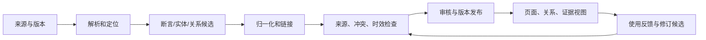

# LLM-Wiki：把资料编译成可持续使用的知识资产

> LLM-Wiki 的核心本质，是把分散来源中的事实、实体、关系和决策依据编译成有身份、有来源、有版本、可持续更新的知识资产，供模型按需阅读和引用。

模型面对领域资料时，常见问题不是“没有文档”，而是资料分散在不同来源，名称不一致，内容互相引用，版本不断变化，关键结论也很难追溯。把网页、文档和任务记录直接堆进检索库，只能解决“找到一段文字”，不能稳定回答“这段内容代表什么、是否仍然有效、和其他事实有什么关系”。

LLM-Wiki 处理的是知识资产的整理和维护。页面只是面向人和模型的可读视图，来源、断言、实体、关系和版本记录才是需要持续管理的对象。

## 知识编译到底在编译什么

编译的输入不是一篇文章，而是一组带结构和生命周期的来源：

| 输入 | 编译后要得到的内容 |
| --- | --- |
| 文档、网页、代码、表格 | 可定位的事实和证据片段 |
| 多个名称和别名 | 统一的实体身份 |
| 跨文档引用 | 可导航的关系 |
| 方案说明和处理记录 | 决策、适用条件和结果 |
| 新旧版本和修订意见 | 当前视图与历史版本 |

编译结果也不只有页面，还包括关系索引、引用索引、变更记录和供模型读取的证据视图。

## 一条可重放的编译链



每一步都要有明确输入、输出和失败记录：

- **解析和定位**：保留标题路径、页码、段落、代码位置等来源坐标；
- **抽取候选**：从文本中提取事实、实体、关系、决策和错误案例；
- **归一化和链接**：统一别名、实体身份、时间范围和引用关系；
- **检查和审核**：处理来源冲突、低置信度、敏感内容和过期内容；
- **版本发布**：发布可使用的当前视图，同时保留旧版本和变更原因；
- **反馈修订**：根据错误答案、人工修正和新来源生成下一轮候选。

链路可重放，才能定位“是解析错、归一化错，还是发布规则错”，也才能在规则或模型升级后重建受影响资产。

## 先定义知识资产的最小单位

页面不是最小事实单位。建议至少区分以下对象：

| 对象 | 作用 | 应保留的字段 |
| --- | --- | --- |
| 来源 | 说明信息从哪里来 | 来源 ID、版本、更新时间、访问范围 |
| 断言 | 表达一个可验证的事实 | 主体、谓词、客体、来源片段、有效期 |
| 实体 | 统一同一对象的不同称呼 | 实体 ID、类型、规范名、别名 |
| 关系 | 连接两个实体或事件 | 起点、关系类型、终点、来源、时间 |
| 页面 | 面向阅读和导航的投影 | 页面类型、摘要、关联对象、引用列表 |
| 变更 | 记录知识如何变化 | 前后版本、原因、影响范围、审核记录 |

页面中的结论必须能回到断言和来源片段。无法定位来源的模型生成内容，只能作为待审核候选。

## 页面按用途组织

页面类型应服务于不同的阅读和检索任务：

| 页面类型 | 适合承载的内容 | 关键要求 |
| --- | --- | --- |
| 概念页 | 定义、边界、别名、相关概念 | 每个关键定义都有来源 |
| 实体页 | 属性、状态、关系和时间变化 | 实体 ID、有效期和冲突记录 |
| 主题页 | 多来源归纳、章节导航、问题地图 | 标明覆盖范围和摘要依据 |
| 决策页 | 方案、适用条件、取舍和结果 | 记录决策来源和修订原因 |
| 错误页 | 失败现象、复现条件、修复结果 | 关联原始任务或错误记录 |

页面类型固定后，模型生成和审核才有稳定的字段，读者也能快速判断一页内容的用途。

## 候选不等于事实

抽取模型输出的是候选知识，不能直接成为已发布内容。可以使用简单的发布状态：

```text
candidate → reviewed → published
                 ↘ rejected
```

进入 `published` 前至少检查：

- 关键断言是否有可定位的来源；
- 实体是否已经和已有对象正确归一化；
- 时间和版本是否明确；
- 是否存在未处理的冲突；
- 是否包含超出访问范围的内容；
- 受影响页面、索引和评测样本是否已经列出。

审核不一定要求人工逐条确认。规则校验、来源权威性、重复证据和历史反馈都可以参与自动审核，但低置信度和高影响变更应保留人工确认入口。

## 更新要维护影响关系

知识更新要区分新增、修改、删除和暂时不可用。每次发布至少记录：

```text
change_id
asset_id
before_version
after_version
source_refs
reason
affected_views
review_record
```

来源失效时，沿着引用关系标记受影响断言、页面和索引；新旧来源冲突时，保留两个版本及其依据，按照时间、来源权威性或人工决策生成当前视图。直接覆盖旧文本会让历史答案无法解释，也无法回放一次错误更新。

## 给模型提供什么视图

模型读取知识资产时，不应默认加载整套 Wiki。根据任务返回不同深度的视图：

- **摘要视图**：帮助模型判断页面是否相关；
- **事实视图**：返回断言、时间、状态和来源；
- **关系视图**：返回关联实体、关系类型和有限路径；
- **证据视图**：返回支撑结论的原文片段；
- **冲突视图**：返回互相矛盾的版本和各自依据。

摘要用于导航，事实和关系用于组织答案，原文片段用于验证，冲突视图用于避免模型把不确定内容说成定论。每种视图都应带上来源、版本和访问范围。

## 什么时候值得建设 LLM-Wiki

适合建设的信号是：

- 领域资料来自多个长期变化的来源；
- 同一实体、概念或决策会被反复查询；
- 关系、版本和历史变化会影响答案；
- 结果需要引用、解释和责任追踪；
- 团队愿意维护审核、回滚和评测链路。

资料量小且稳定时，直接维护少量高质量文档更经济。没有来源管理和发布责任时，先建大量页面只会把不可验证的模型文本固化下来。

## 如何验收知识编译质量

不要用页面数量衡量系统效果，重点检查知识变化是否被正确处理：

- 关键断言能否回溯到具体来源片段；
- 同名实体是否被错误合并；
- 新版本发布后旧版本是否按规则失效；
- 来源删除后是否能找到所有受影响资产；
- 冲突来源是否被保留并正确呈现；
- 页面、关系和证据视图是否同步更新；
- 知识更新后，真实任务的正确率和引用质量是否改善。

每次线上错误都应保留查询、知识版本、命中的资产、使用的证据和最终结果。只有把结果和编译版本关联起来，才能判断问题来自来源、抽取、归一化、发布还是读取视图。
